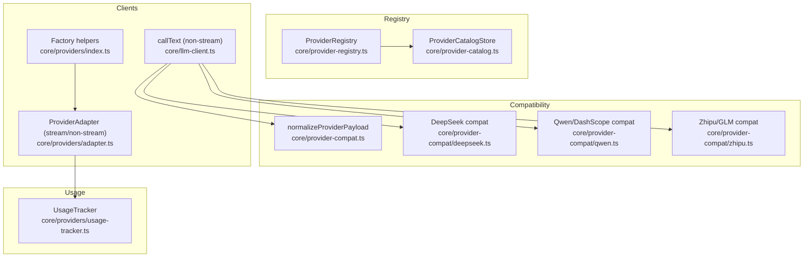
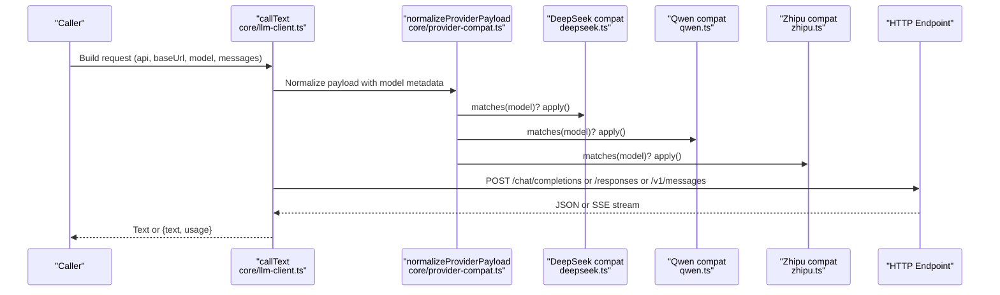
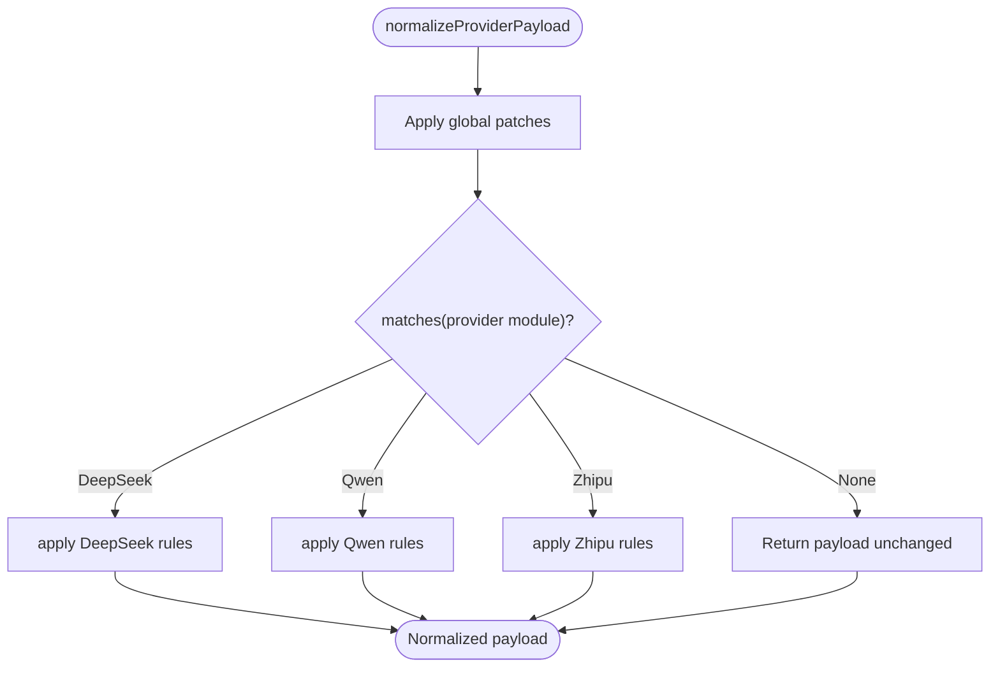
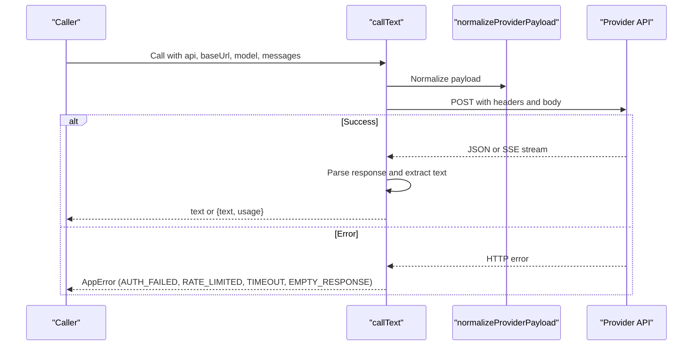
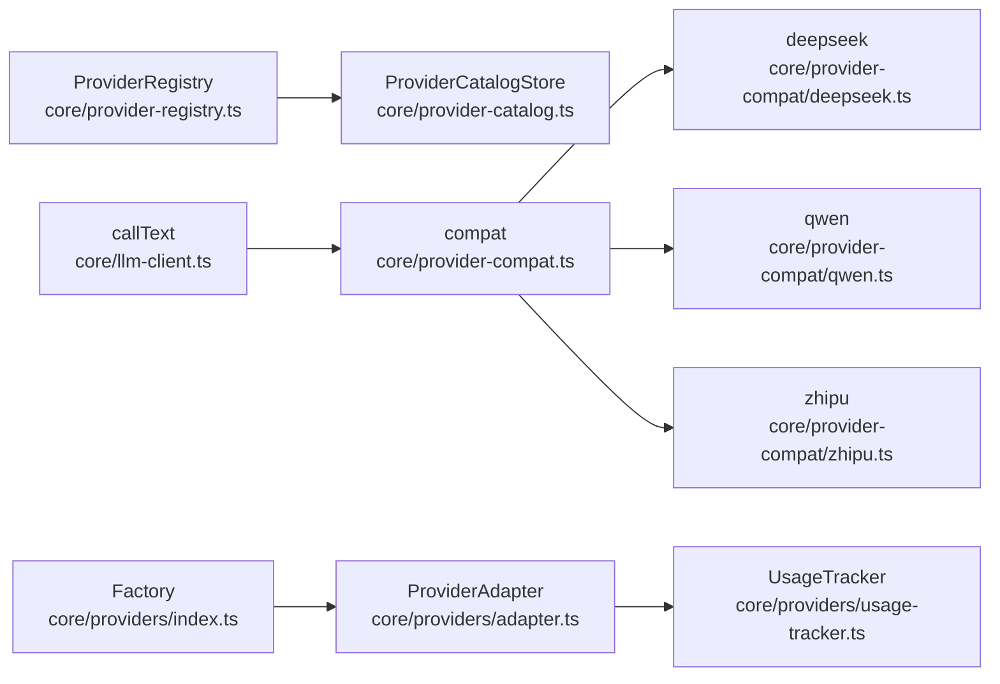

# AI Provider Integration

<cite>
**Referenced Files in This Document**
- [provider-registry.ts](file://core/provider-registry.ts)
- [provider-catalog.ts](file://core/provider-catalog.ts)
- [provider-compat.ts](file://core/provider-compat.ts)
- [deepseek.ts](file://core/provider-compat/deepseek.ts)
- [qwen.ts](file://core/provider-compat/qwen.ts)
- [zhipu.ts](file://core/provider-compat/zhipu.ts)
- [llm-client.ts](file://core/llm-client.ts)
- [adapter.ts](file://core/providers/adapter.ts)
- [index.ts](file://core/providers/index.ts)
- [types.ts](file://core/providers/types.ts)
- [usage-tracker.ts](file://core/providers/usage-tracker.ts)
- [minimax.ts](file://lib/providers/minimax.ts)
- [dashscope.ts](file://lib/providers/dashscope.ts)
- [deepseek.ts](file://lib/providers/deepseek.ts)
- [zhipu.ts](file://lib/providers/zhipu.ts)
</cite>

## Table of Contents
1. [Introduction](#introduction)
2. [Project Structure](#project-structure)
3. [Core Components](#core-components)
4. [Architecture Overview](#architecture-overview)
5. [Detailed Component Analysis](#detailed-component-analysis)
6. [Dependency Analysis](#dependency-analysis)
7. [Performance Considerations](#performance-considerations)
8. [Troubleshooting Guide](#troubleshooting-guide)
9. [Conclusion](#conclusion)
10. [Appendices](#appendices)

## Introduction
This document explains the AI provider integration layer that abstracts multiple LLM backends (MiniMax, DeepSeek, Qwen/DashScope, GLM/Zhipu) behind a unified interface. It covers:
- Provider abstraction and registration
- Configuration and model selection strategies
- Cost optimization techniques
- OpenAI-compatible compatibility layer and streaming handling
- Failover, rate limiting, and usage tracking
- Provider-specific optimizations and debugging approaches

The system supports both direct HTTP calls for utility tasks and Pi SDK-based chat flows, with a robust compatibility layer to normalize payloads per provider quirks.

## Project Structure
At a high level:
- Provider registry and catalog manage static declarations and user configuration
- Compatibility layer normalizes requests per provider
- Client layers handle non-streaming and streaming paths
- Usage tracker records token usage and latency

**Diagram sources**
- [provider-registry.ts:429-700](file://core/provider-registry.ts#L429-L700)
- [provider-catalog.ts:89-168](file://core/provider-catalog.ts#L89-L168)
- [provider-compat.ts:240-278](file://core/provider-compat.ts#L240-L278)
- [deepseek.ts:59-125](file://core/provider-compat/deepseek.ts#L59-L125)
- [qwen.ts:33-59](file://core/provider-compat/qwen.ts#L33-L59)
- [zhipu.ts:40-54](file://core/provider-compat/zhipu.ts#L40-L54)
- [llm-client.ts:356-502](file://core/llm-client.ts#L356-L502)
- [adapter.ts:30-43](file://core/providers/adapter.ts#L30-L43)
- [index.ts:22-45](file://core/providers/index.ts#L22-L45)
- [usage-tracker.ts:26-53](file://core/providers/usage-tracker.ts#L26-L53)

**Section sources**
- [provider-registry.ts:429-700](file://core/provider-registry.ts#L429-L700)
- [provider-catalog.ts:89-168](file://core/provider-catalog.ts#L89-L168)
- [provider-compat.ts:240-278](file://core/provider-compat.ts#L240-L278)
- [llm-client.ts:356-502](file://core/llm-client.ts#L356-L502)
- [adapter.ts:30-43](file://core/providers/adapter.ts#L30-L43)
- [index.ts:22-45](file://core/providers/index.ts#L22-L45)
- [usage-tracker.ts:26-53](file://core/providers/usage-tracker.ts#L26-L53)

## Core Components
- ProviderRegistry: Declares built-in providers, merges user config, resolves capabilities, and exposes model lists and credential lanes.
- ProviderCatalogStore: Persists provider definitions and capabilities; migrates legacy configs.
- Compatibility Layer: Normalizes payloads per provider (thinking mode, tool call history, unsupported fields).
- Clients:
  - Non-streaming callText: Direct HTTP POST for utility tasks with provider normalization.
  - ProviderAdapter: Factory for OpenAI-compatible, Gemini, Anthropic clients with streaming support.
- Usage Tracker: Records token usage and latency for cost analysis.

Key responsibilities:
- Abstraction over multiple LLM backends
- Model selection and capability resolution
- Payload normalization for provider-specific quirks
- Streaming and non-streaming response handling
- Usage logging and basic analytics

**Section sources**
- [provider-registry.ts:429-700](file://core/provider-registry.ts#L429-L700)
- [provider-catalog.ts:89-168](file://core/provider-catalog.ts#L89-L168)
- [provider-compat.ts:240-278](file://core/provider-compat.ts#L240-L278)
- [llm-client.ts:356-502](file://core/llm-client.ts#L356-L502)
- [adapter.ts:30-43](file://core/providers/adapter.ts#L30-L43)
- [usage-tracker.ts:26-53](file://core/providers/usage-tracker.ts#L26-L53)

## Architecture Overview
The architecture separates concerns into clear layers:
- Registry/Catalog: Static provider declarations + user overrides
- Compatibility: Provider-specific payload normalization
- Client: Unified API for chat and streaming
- Usage: Persistent metrics for cost and performance

**Diagram sources**
- [llm-client.ts:356-502](file://core/llm-client.ts#L356-L502)
- [provider-compat.ts:240-278](file://core/provider-compat.ts#L240-L278)
- [deepseek.ts:59-125](file://core/provider-compat/deepseek.ts#L59-L125)
- [qwen.ts:33-59](file://core/provider-compat/qwen.ts#L33-L59)
- [zhipu.ts:40-54](file://core/provider-compat/zhipu.ts#L40-L54)

## Detailed Component Analysis

### Provider Registry and Catalog
- ProviderRegistry loads built-in plugins and local provider plugins, merges user configuration from the catalog, and produces normalized entries with capabilities and runtime metadata.
- ProviderCatalogStore persists provider definitions, capabilities, and migration metadata; supports cutover from legacy added-models.yaml.

Highlights:
- Capability normalization for chat and media
- Credential lane support for multi-lane image generation
- Mtime caching for catalog reads
- Migration utilities for legacy configurations

**Section sources**
- [provider-registry.ts:429-700](file://core/provider-registry.ts#L429-L700)
- [provider-catalog.ts:89-168](file://core/provider-catalog.ts#L89-L168)

### Compatibility Layer
The compatibility layer is the single entry point for provider-specific payload adjustments:
- Global patches: strip empty tools, remove incompatible thinking fields, normalize reasoning effort, strip orphan tool results, normalize audio transport payloads
- Provider modules: first-match-wins dispatcher to specific adapters

DeepSeek:
- Thinking mode control via thinking.type and reasoning_effort mapping
- Enforces minimum token budgets when thinking is enabled
- Ensures reasoning_content presence for tool call turns
- Roleplay reasoning marker injection for V4 models

Qwen/DashScope:
- enable_thinking field normalization
- Video input normalization via video_url for DashScope vision models
- Utility mode forces thinking off to save tokens

Zhipu/GLM:
- Thinking controls via thinking.type and clear_thinking flags
- Strips unsupported OpenAI-only fields (store, stream_options)
- Normalizes tools by removing strict fields not supported by GLM

**Diagram sources**
- [provider-compat.ts:240-278](file://core/provider-compat.ts#L240-L278)
- [deepseek.ts:59-125](file://core/provider-compat/deepseek.ts#L59-L125)
- [qwen.ts:33-59](file://core/provider-compat/qwen.ts#L33-L59)
- [zhipu.ts:40-54](file://core/provider-compat/zhipu.ts#L40-L54)

**Section sources**
- [provider-compat.ts:240-278](file://core/provider-compat.ts#L240-L278)
- [deepseek.ts:59-125](file://core/provider-compat/deepseek.ts#L59-L125)
- [qwen.ts:33-59](file://core/provider-compat/qwen.ts#L33-L59)
- [zhipu.ts:40-54](file://core/provider-compat/zhipu.ts#L40-L54)

### Non-Streaming Client (Utility Path)
The non-streaming client builds protocol-specific requests, applies compatibility normalization, handles timeouts and abort signals, parses responses, and logs usage.

Key behaviors:
- Supports openai-completions, anthropic-messages, openai-responses, and openai-codex-responses
- Extracts text content across different response shapes
- Handles structured thinking blocks and strips tags where needed
- Emits AppError codes for auth failures, rate limits, timeouts, and empty responses

**Diagram sources**
- [llm-client.ts:356-502](file://core/llm-client.ts#L356-L502)
- [provider-compat.ts:240-278](file://core/provider-compat.ts#L240-L278)

**Section sources**
- [llm-client.ts:356-502](file://core/llm-client.ts#L356-L502)

### Provider Adapter (Streaming and Non-Streaming)
The adapter factory creates typed clients for OpenAI-compatible, Gemini, and Anthropic endpoints. Each adapter implements:
- chat(): non-streaming completion
- chatStream(): streaming delta delivery
- getModel(), getProviderId()
- Usage tracking via UsageTracker

OpenAI-compatible:
- Uses OpenAI SDK client configured with apiKey and baseURL
- Streams deltas and aggregates tool_calls

Gemini:
- Converts messages to Gemini format
- Streams via SSE with manual parsing

Anthropic:
- Formats system and conversation messages
- Streams content_block_delta events

**Section sources**
- [adapter.ts:30-43](file://core/providers/adapter.ts#L30-L43)
- [adapter.ts:48-160](file://core/providers/adapter.ts#L48-L160)
- [adapter.ts:162-308](file://core/providers/adapter.ts#L162-L308)
- [adapter.ts:310-519](file://core/providers/adapter.ts#L310-L519)

### Usage Tracking
UsageTracker persists token counts and latency to a local database, provides summary queries by period, and supports cleanup of old logs.

- record(): inserts a new usage log
- getSummary(): aggregates by provider and model
- getTotalUsage(): returns totals optionally filtered by provider
- cleanupOldLogs(): removes logs older than maxAgeMs

**Section sources**
- [usage-tracker.ts:26-53](file://core/providers/usage-tracker.ts#L26-L53)
- [usage-tracker.ts:55-99](file://core/providers/usage-tracker.ts#L55-L99)
- [usage-tracker.ts:101-115](file://core/providers/usage-tracker.ts#L101-L115)
- [usage-tracker.ts:117-126](file://core/providers/usage-tracker.ts#L117-L126)

### Provider Plugins and Capabilities
Built-in provider plugins declare defaults, authentication types, base URLs, APIs, and capabilities (including media generation). Examples include MiniMax and DashScope.

- MiniMax plugin declares image generation capability with credential lanes and model modes
- DashScope plugin declares image generation and speech recognition capabilities with model aliases and parameters

**Section sources**
- [minimax.ts:55-68](file://lib/providers/minimax.ts#L55-L68)
- [dashscope.ts:121-149](file://lib/providers/dashscope.ts#L121-L149)

## Dependency Analysis
The following diagram shows key dependencies between components:

**Diagram sources**
- [provider-registry.ts:429-700](file://core/provider-registry.ts#L429-L700)
- [provider-catalog.ts:89-168](file://core/provider-catalog.ts#L89-L168)
- [provider-compat.ts:240-278](file://core/provider-compat.ts#L240-L278)
- [deepseek.ts:59-125](file://core/provider-compat/deepseek.ts#L59-L125)
- [qwen.ts:33-59](file://core/provider-compat/qwen.ts#L33-L59)
- [zhipu.ts:40-54](file://core/provider-compat/zhipu.ts#L40-L54)
- [llm-client.ts:356-502](file://core/llm-client.ts#L356-L502)
- [adapter.ts:30-43](file://core/providers/adapter.ts#L30-L43)
- [index.ts:22-45](file://core/providers/index.ts#L22-L45)
- [usage-tracker.ts:26-53](file://core/providers/usage-tracker.ts#L26-L53)

**Section sources**
- [provider-registry.ts:429-700](file://core/provider-registry.ts#L429-L700)
- [provider-catalog.ts:89-168](file://core/provider-catalog.ts#L89-L168)
- [provider-compat.ts:240-278](file://core/provider-compat.ts#L240-L278)
- [llm-client.ts:356-502](file://core/llm-client.ts#L356-L502)
- [adapter.ts:30-43](file://core/providers/adapter.ts#L30-L43)
- [index.ts:22-45](file://core/providers/index.ts#L22-L45)
- [usage-tracker.ts:26-53](file://core/providers/usage-tracker.ts#L26-L53)

## Performance Considerations
- Prefer non-streaming callText for short utility tasks to avoid Pi SDK overhead on certain providers
- Use streaming for long outputs to improve time-to-first-token
- Disable thinking in utility mode to reduce token consumption
- Ensure adequate max_tokens when enabling thinking to avoid budget constraints
- Normalize payloads once via compatibility layer to prevent redundant processing

[No sources needed since this section provides general guidance]

## Troubleshooting Guide
Common issues and resolutions:
- Authentication failures: Check apiKey and provider base URL; ensure correct header conventions (Bearer vs x-api-key)
- Rate limiting: Handle 429 errors with exponential backoff and circuit breaker patterns
- Empty responses after thinking: Strip or disable thinking if only reasoning content is returned
- Tool call mismatches: Ensure assistant messages have matching tool_calls and reasoning_content for providers requiring it
- Unsupported fields: Remove fields like store or stream_options for GLM; normalize tools by removing strict fields

Operational tips:
- Enable slow response detection and capture context for diagnostics
- Log raw error bodies truncated to safe lengths
- Use usage summaries to identify expensive models or providers

**Section sources**
- [llm-client.ts:554-571](file://core/llm-client.ts#L554-L571)
- [llm-client.ts:592-618](file://core/llm-client.ts#L592-L618)
- [zhipu.ts:182-202](file://core/provider-compat/zhipu.ts#L182-L202)
- [deepseek.ts:278-313](file://core/provider-compat/deepseek.ts#L278-L313)

## Conclusion
The integration layer provides a robust abstraction over multiple LLM providers with strong compatibility handling, flexible configuration, and comprehensive usage tracking. By leveraging the registry/catalog for declarations, the compatibility layer for provider quirks, and dedicated clients for streaming and non-streaming paths, the system achieves reliability and extensibility.

[No sources needed since this section summarizes without analyzing specific files]

## Appendices

### Provider Configuration and Model Selection
- Configure providers via the catalog with display names, auth type, base URL, API protocol, and capabilities
- Override models and defaults per provider; use credential lanes for multi-account scenarios
- Resolve chat providers and projections through the registry’s resolveChatProvider and getChatProjection methods

**Section sources**
- [provider-registry.ts:640-700](file://core/provider-registry.ts#L640-L700)
- [provider-catalog.ts:150-168](file://core/provider-catalog.ts#L150-L168)

### Adding a New Provider
Steps:
1. Create a provider plugin declaration with id, displayName, authType, defaultBaseUrl, defaultApi, and optional capabilities
2. Register the plugin so it appears in the registry
3. If needed, add compatibility rules under core/provider-compat/<name>.ts implementing matches and apply
4. Update known-models.json or provider catalog to mark quirks and capabilities
5. Test via callText and streaming adapters

**Section sources**
- [minimax.ts:55-68](file://lib/providers/minimax.ts#L55-L68)
- [dashscope.ts:121-149](file://lib/providers/dashscope.ts#L121-L149)
- [provider-compat.ts:240-278](file://core/provider-compat.ts#L240-L278)

### Customizing Model Behavior
- Use quirks to signal provider-specific features (e.g., enable_thinking)
- Adjust reasoning levels and output budgets via options passed to compatibility layer
- For GLM, control thinking.clear_thinking to preserve or reset reasoning history

**Section sources**
- [qwen.ts:33-59](file://core/provider-compat/qwen.ts#L33-L59)
- [zhipu.ts:124-180](file://core/provider-compat/zhipu.ts#L124-L180)

### Streaming Response Handling
- Use ProviderAdapter.chatStream for OpenAI-compatible, Gemini, and Anthropic endpoints
- For utility tasks, callText supports special codex responses streaming path
- Aggregate deltas and parse tool_calls incrementally

**Section sources**
- [adapter.ts:93-143](file://core/providers/adapter.ts#L93-L143)
- [adapter.ts:219-279](file://core/providers/adapter.ts#L219-L279)
- [adapter.ts:389-463](file://core/providers/adapter.ts#L389-L463)
- [llm-client.ts:534-551](file://core/llm-client.ts#L534-L551)

### Failover, Rate Limiting, and Usage Tracking
- Implement retry with backoff and circuit breaker at the caller layer
- Detect and handle 429 responses explicitly; consider switching to alternate providers or lanes
- Record usage per provider/model to monitor costs and optimize routing

**Section sources**
- [llm-client.ts:564-571](file://core/llm-client.ts#L564-L571)
- [usage-tracker.ts:55-99](file://core/providers/usage-tracker.ts#L55-L99)

### Provider-Specific Optimizations and Debugging
- DeepSeek: Ensure sufficient max_tokens when thinking is enabled; validate reasoning_content for tool calls
- Qwen/DashScope: Force thinking off in utility mode; normalize video inputs via video_url
- GLM: Remove unsupported fields; manage clear_thinking to preserve reasoning context

**Section sources**
- [deepseek.ts:242-258](file://core/provider-compat/deepseek.ts#L242-L258)
- [qwen.ts:49-59](file://core/provider-compat/qwen.ts#L49-L59)
- [zhipu.ts:182-202](file://core/provider-compat/zhipu.ts#L182-L202)