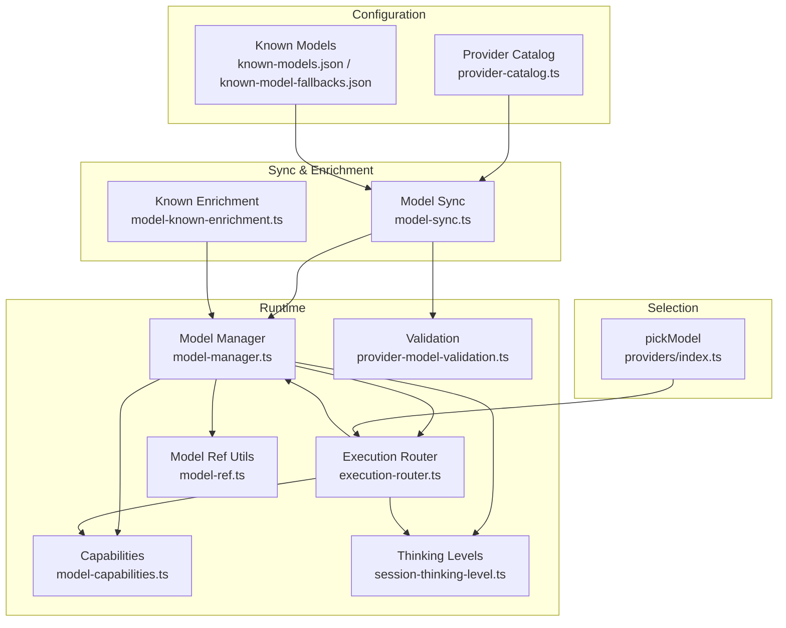
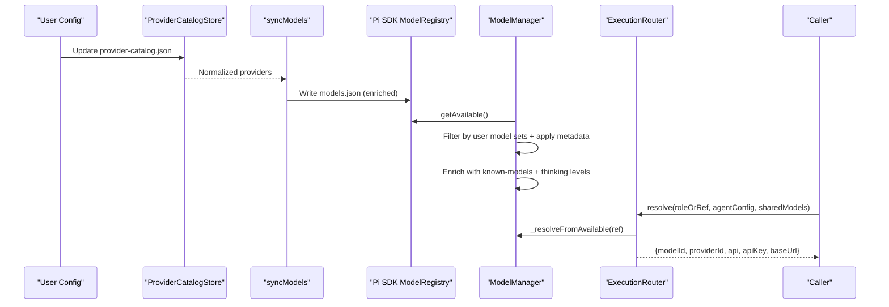
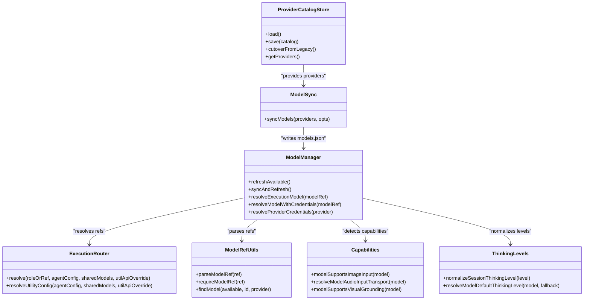

# Model Management & Selection

<cite>
**Referenced Files in This Document**
- [core/model-manager.ts](file://core/model-manager.ts)
- [core/execution-router.ts](file://core/execution-router.ts)
- [core/model-sync.ts](file://core/model-sync.ts)
- [core/model-known-enrichment.ts](file://core/model-known-enrichment.ts)
- [shared/model-ref.ts](file://shared/model-ref.ts)
- [shared/model-capabilities.ts](file://shared/model-capabilities.ts)
- [shared/provider-model-validation.ts](file://shared/provider-model-validation.ts)
- [core/session-thinking-level.ts](file://core/session-thinking-level.ts)
- [core/provider-catalog.ts](file://core/provider-catalog.ts)
- [lib/known-models.json](file://lib/known-models.json)
- [lib/known-model-fallbacks.json](file://lib/known-model-fallbacks.json)
- [core/providers/index.ts](file://core/providers/index.ts)
</cite>

## Table of Contents
1. Introduction
2. Project Structure
3. Core Components
4. Architecture Overview
5. Detailed Component Analysis
6. Dependency Analysis
7. Performance Considerations
8. Troubleshooting Guide
9. Conclusion

## Introduction
This document explains the model management and selection mechanisms across the system. It covers:
- The model catalog system and provider-specific configurations
- Automatic model discovery and enrichment
- The pickModel function logic, fallback strategies, and validation processes
- Practical examples for configuring models, setting up hierarchies, and implementing custom routing rules
- Capability detection, thinking level handling, and dynamic updates
- Versioning and deprecation handling via the provider catalog

## Project Structure
The model subsystem spans several modules:
- Provider Catalog: centralizes provider definitions and capabilities
- Model Sync: projects provider configs into a canonical models.json consumed by the SDK
- Model Manager: orchestrates available models, default selection, credential resolution, and refresh cycles
- Execution Router: resolves role-based model references to concrete execution parameters
- Shared Utilities: model reference parsing, capability detection, and validation helpers
- Known Models: static dictionaries that enrich runtime model metadata

**Diagram sources**
- [core/provider-catalog.ts:1-235](file://core/provider-catalog.ts#L1-L235)
- [core/model-sync.ts:1-407](file://core/model-sync.ts#L1-L407)
- [core/model-known-enrichment.ts:1-87](file://core/model-known-enrichment.ts#L1-L87)
- [core/model-manager.ts:1-532](file://core/model-manager.ts#L1-L532)
- [core/execution-router.ts:1-235](file://core/execution-router.ts#L1-L235)
- [shared/model-ref.ts:1-100](file://shared/model-ref.ts#L1-L100)
- [shared/model-capabilities.ts:1-652](file://shared/model-capabilities.ts#L1-L652)
- [core/session-thinking-level.ts:1-116](file://core/session-thinking-level.ts#L1-L116)
- [shared/provider-model-validation.ts:1-82](file://shared/provider-model-validation.ts#L1-L82)
- [lib/known-models.json:1-800](file://lib/known-models.json#L1-L800)
- [lib/known-model-fallbacks.json:1-800](file://lib/known-model-fallbacks.json#L1-L800)
- [core/providers/index.ts](file://core/providers/index.ts)

**Section sources**
- [core/provider-catalog.ts:1-235](file://core/provider-catalog.ts#L1-L235)
- [core/model-sync.ts:1-407](file://core/model-sync.ts#L1-L407)
- [core/model-manager.ts:1-532](file://core/model-manager.ts#L1-L532)
- [core/execution-router.ts:1-235](file://core/execution-router.ts#L1-L235)
- [shared/model-ref.ts:1-100](file://shared/model-ref.ts#L1-L100)
- [shared/model-capabilities.ts:1-652](file://shared/model-capabilities.ts#L1-L652)
- [core/session-thinking-level.ts:1-116](file://core/session-thinking-level.ts#L1-L116)
- [shared/provider-model-validation.ts:1-82](file://shared/provider-model-validation.ts#L1-L82)
- [lib/known-models.json:1-800](file://lib/known-models.json#L1-L800)
- [lib/known-model-fallbacks.json:1-800](file://lib/known-model-fallbacks.json#L1-L800)
- [core/providers/index.ts](file://core/providers/index.ts)

## Core Components
- Provider Catalog Store: loads, normalizes, and persists provider definitions; supports migration from legacy formats and tracks deleted providers.
- Model Sync: transforms provider catalog entries into Pi SDK-compatible models.json, applying known-models metadata, tool-use contracts, vision capabilities, and thinking format compatibility.
- Model Manager: owns the single source of truth for available models, performs discovery filtering, applies provider metadata, enriches with known data, binds defaults, and resolves credentials.
- Execution Router: maps agent roles (chat/utility/embed) to concrete model references and provider credentials, enforcing API and base URL requirements.
- Shared Utilities: strict model reference parsing, capability detection (image/audio/video, reasoning), thinking level normalization, and provider model validation.

Key responsibilities and interactions are detailed in the following sections.

**Section sources**
- [core/provider-catalog.ts:1-235](file://core/provider-catalog.ts#L1-L235)
- [core/model-sync.ts:1-407](file://core/model-sync.ts#L1-L407)
- [core/model-manager.ts:1-532](file://core/model-manager.ts#L1-L532)
- [core/execution-router.ts:1-235](file://core/execution-router.ts#L1-L235)
- [shared/model-ref.ts:1-100](file://shared/model-ref.ts#L1-L100)
- [shared/model-capabilities.ts:1-652](file://shared/model-capabilities.ts#L1-L652)
- [core/session-thinking-level.ts:1-116](file://core/session-thinking-level.ts#L1-L116)
- [shared/provider-model-validation.ts:1-82](file://shared/provider-model-validation.ts#L1-L82)

## Architecture Overview
The lifecycle of a model configuration and selection is as follows:
- Providers are defined in the Provider Catalog.
- On sync, provider entries are projected into models.json with enriched metadata from known-models dictionaries and capability normalization.
- At runtime, Model Manager builds the available models list, filters by user-configured sets, applies provider metadata, and enriches with known data.
- Execution Router resolves role-based references to concrete models and validates credentials.
- UI or callers may use pickModel to select a default model when no explicit model is provided.

**Diagram sources**
- [core/provider-catalog.ts:1-235](file://core/provider-catalog.ts#L1-L235)
- [core/model-sync.ts:1-407](file://core/model-sync.ts#L1-L407)
- [core/model-manager.ts:1-532](file://core/model-manager.ts#L1-L532)
- [core/execution-router.ts:1-235](file://core/execution-router.ts#L1-L235)

## Detailed Component Analysis

### Model Catalog System
- ProviderCatalogStore manages versioned provider catalogs, merges overlays, and migrates from legacy added-models.yaml.
- It normalizes provider maps, capabilities, and deleted providers, ensuring safe atomic writes and backup on migration.

Practical example:
- Add a new provider entry under providers with base_url, api, auth_type, and models array.
- Use model_defaults to set per-model thinking levels.
- After saving, call reloadAndSync to regenerate models.json and refresh available models.

**Section sources**
- [core/provider-catalog.ts:1-235](file://core/provider-catalog.ts#L1-L235)

### Provider-Specific Model Configurations
- model-sync.ts converts provider entries into Pi SDK format, merging known-models metadata, toolUse contracts, visionCapabilities, and thinkingFormat compatibility.
- It enforces validation for reserved model IDs and filters chat-only models.

Practical example:
- Configure a provider with image/video/audio toggles and reasoning flags.
- Define toolUse dialect and result format for tool-enabled models.
- Set visionCapabilities for grounding features like boxes and points.

**Section sources**
- [core/model-sync.ts:1-407](file://core/model-sync.ts#L1-L407)
- [shared/provider-model-validation.ts:1-82](file://shared/provider-model-validation.ts#L1-L82)

### Automatic Model Discovery and Enrichment
- Model Manager’s refreshAvailable pulls all models from the SDK registry, then filters based on user-configured model sets and runtime discovery allowances.
- Provider metadata (thinking levels, xhigh, toolUse, visionCapabilities) is applied, followed by enrichment from known-models and runtime-specific adjustments (e.g., kimi-coding).

Practical example:
- When adding a new provider, ensure its models are listed in the provider config so they appear in availableModels after sync.
- For OAuth providers, ensure auth keys map correctly to avoid missing credentials.

**Section sources**
- [core/model-manager.ts:186-214](file://core/model-manager.ts#L186-L214)
- [core/model-known-enrichment.ts:1-87](file://core/model-known-enrichment.ts#L1-L87)

### Model Reference Parsing and Validation
- parseModelRef accepts multiple input forms and returns normalized {id, provider}. requireModelRef enforces both fields at runtime.
- findModel requires both id and provider and refuses fallbacks by id alone.

Practical example:
- Always pass provider/id or {id, provider} objects to avoid ambiguity.
- Use requireModelRef in non-UI code paths to fail fast on incomplete refs.

**Section sources**
- [shared/model-ref.ts:1-100](file://shared/model-ref.ts#L1-L100)

### Thinking Level Handling and Defaults
- session-thinking-level.ts defines canonical levels, visibility mapping, and model support checks (xhigh/max).
- Model Manager integrates persisted defaultThinkingLevel and normalizes choices per model.

Practical example:
- Set defaultThinkingLevel per model in provider config or via setModelDefaultThinkingLevel.
- Normalize “auto” to “medium” and map ultracode to max where supported.

**Section sources**
- [core/session-thinking-level.ts:1-116](file://core/session-thinking-level.ts#L1-L116)
- [core/model-manager.ts:338-373](file://core/model-manager.ts#L338-L373)

### Credential Resolution and Validation
- Execution Router resolves role-based references to full execution parameters, validating provider API, base URL, and presence of apiKey or headers.
- Model Manager provides resolveModelWithCredentials and resolveProviderCredentialsFresh for OAuth-aware refresh.

Practical example:
- Ensure each provider has api and baseUrl configured; local endpoints may allow missing apiKey if explicitly allowed.
- For utility roles, override api_key/base_url while keeping provider consistent.

**Section sources**
- [core/execution-router.ts:65-114](file://core/execution-router.ts#L65-L114)
- [core/model-manager.ts:479-507](file://core/model-manager.ts#L479-L507)
- [core/model-manager.ts:429-459](file://core/model-manager.ts#L429-L459)

### pickModel Function Logic and Fallback Strategies
- pickModel selects a model name for a given provider when none is specified. It typically falls back to a first-available or default model within the provider context.
- In higher layers, Execution Router and Model Manager enforce explicit provider inclusion and throw errors if models cannot be resolved.

Practical example:
- If a caller omits modelName, pickModel chooses a sensible default for the active provider.
- If a model ref lacks provider, resolveExecutionModel throws an error requiring explicit provider specification.

**Section sources**
- [core/providers/index.ts](file://core/providers/index.ts)
- [core/model-manager.ts:379-393](file://core/model-manager.ts#L379-L393)

### Custom Model Routing Rules
- Execution Router supports role-based routing (chat, utility, utility_large, embed) and allows overriding utility API credentials while maintaining provider consistency.
- You can implement custom routing by extending role mappings and injecting additional constraints (e.g., cost tiers, latency targets) before calling resolve.

Practical example:
- Map utility_large to a larger context model while reusing the same provider credentials unless overridden.
- Validate that any override provider matches the selected model’s provider.

**Section sources**
- [core/execution-router.ts:134-205](file://core/execution-router.ts#L134-L205)

### Capability Detection
- model-capabilities.ts detects image/audio/video inputs, reasoning profiles, and transport modes per provider and API family.
- Vision grounding capabilities are normalized and exposed for downstream consumers.

Practical example:
- Check modelSupportsDirectImageInput before sending images.
- Use resolveModelAudioInputTransport to determine correct audio payload format.

**Section sources**
- [shared/model-capabilities.ts:1-652](file://shared/model-capabilities.ts#L1-L652)

### Cost-Based Selection Algorithms
- The current implementation does not include built-in cost-based selection. To implement it:
  - Extend Execution Router to score candidate models using known costs (from known-models or external pricing tables).
  - Apply policy constraints (latency, capability, thinking level) and choose the best fit.
  - Cache results and invalidate on provider changes.

[No sources needed since this section provides general guidance]

### Dynamic Model Updates
- ProviderCatalogStore supports cutover from legacy formats and saves normalized catalogs atomically.
- Model Manager’s syncAndRefresh regenerates models.json, refreshes the registry, rebuilds availableModels, and rebinds defaultModel.

Practical example:
- After updating provider-catalog.json, call reloadAndSync to propagate changes without restart.

**Section sources**
- [core/provider-catalog.ts:111-142](file://core/provider-catalog.ts#L111-L142)
- [core/model-manager.ts:226-254](file://core/model-manager.ts#L226-L254)

### Versioning and Deprecation Handling
- ProviderCatalogStore tracks catalogVersion and deletedProviders, enabling graceful deprecation and auditability.
- Migrations create backups and report details for traceability.

Practical example:
- Mark deprecated providers in meta.deletedProviders to prevent accidental usage.
- Monitor migration reports to understand changes during upgrades.

**Section sources**
- [core/provider-catalog.ts:71-83](file://core/provider-catalog.ts#L71-L83)
- [core/provider-catalog.ts:188-201](file://core/provider-catalog.ts#L188-L201)

## Dependency Analysis

**Diagram sources**
- [core/provider-catalog.ts:1-235](file://core/provider-catalog.ts#L1-L235)
- [core/model-sync.ts:1-407](file://core/model-sync.ts#L1-L407)
- [core/model-manager.ts:1-532](file://core/model-manager.ts#L1-L532)
- [core/execution-router.ts:1-235](file://core/execution-router.ts#L1-L235)
- [shared/model-ref.ts:1-100](file://shared/model-ref.ts#L1-L100)
- [shared/model-capabilities.ts:1-652](file://shared/model-capabilities.ts#L1-L652)
- [core/session-thinking-level.ts:1-116](file://core/session-thinking-level.ts#L1-L116)

**Section sources**
- [core/provider-catalog.ts:1-235](file://core/provider-catalog.ts#L1-L235)
- [core/model-sync.ts:1-407](file://core/model-sync.ts#L1-L407)
- [core/model-manager.ts:1-532](file://core/model-manager.ts#L1-L532)
- [core/execution-router.ts:1-235](file://core/execution-router.ts#L1-L235)
- [shared/model-ref.ts:1-100](file://shared/model-ref.ts#L1-L100)
- [shared/model-capabilities.ts:1-652](file://shared/model-capabilities.ts#L1-L652)
- [core/session-thinking-level.ts:1-116](file://core/session-thinking-level.ts#L1-L116)

## Performance Considerations
- Avoid repeated disk reads by caching provider catalog and known-models lookups; the known-models loader already uses lazy initialization.
- Minimize syncAndRefresh calls; batch provider updates and trigger a single refresh cycle.
- Prefer resolveExecutionModel over manual string parsing to reduce overhead and errors.
- Reuse Execution Router instances per agent to avoid redundant resolution work.

[No sources needed since this section provides general guidance]

## Troubleshooting Guide
Common issues and resolutions:
- Missing provider or API key: Ensure provider has api and baseUrl configured; local endpoints may allow missing apiKey if explicitly permitted.
- Invalid model ID for official providers: Reserved model IDs are rejected; use concrete model identifiers.
- Model not found: Provide explicit provider in model ref; bare ids are not accepted at runtime.
- Utility API mismatch: Override provider must match the selected model’s provider.

**Section sources**
- [core/execution-router.ts:94-114](file://core/execution-router.ts#L94-L114)
- [shared/provider-model-validation.ts:36-66](file://shared/provider-model-validation.ts#L36-L66)
- [core/model-manager.ts:379-393](file://core/model-manager.ts#L379-L393)

## Conclusion
The model management system centers on a robust provider catalog, deterministic syncing into a canonical models.json, and a runtime layer that enforces strict model references, validates credentials, and enriches capabilities. Role-based routing and pickModel provide flexible selection strategies, while thinking level normalization ensures consistent behavior across providers. With clear versioning and deprecation mechanisms, the system supports dynamic updates and long-term maintainability.