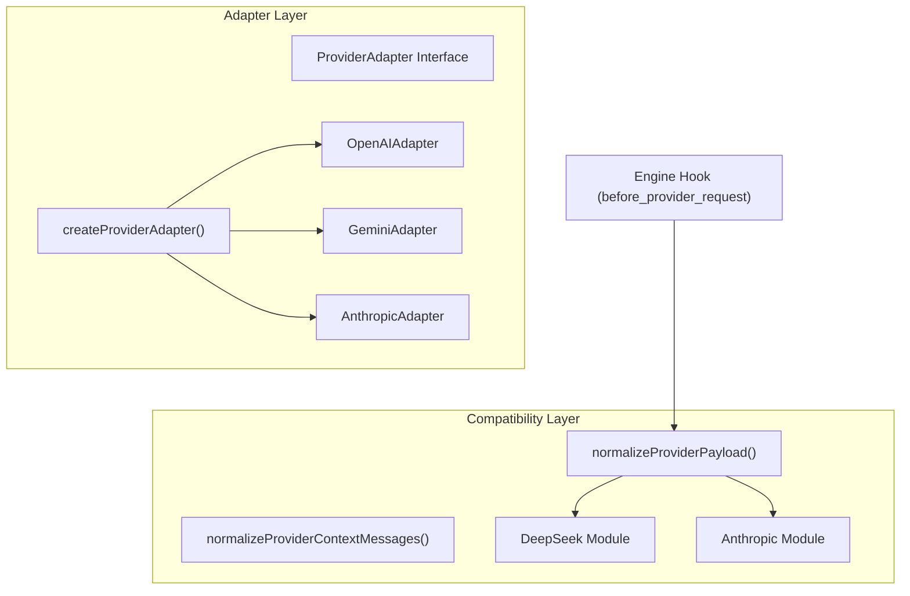
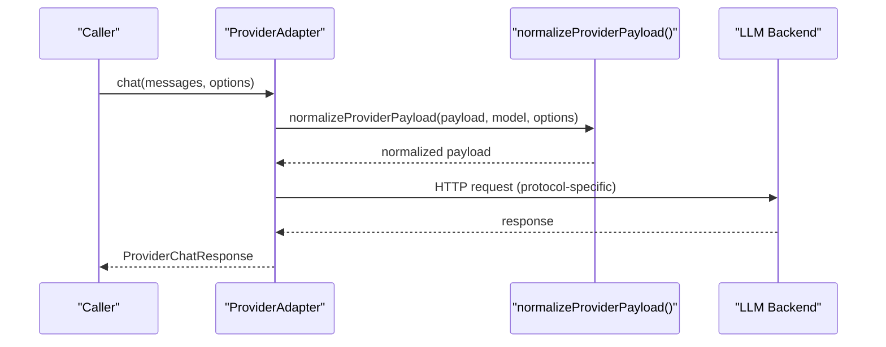
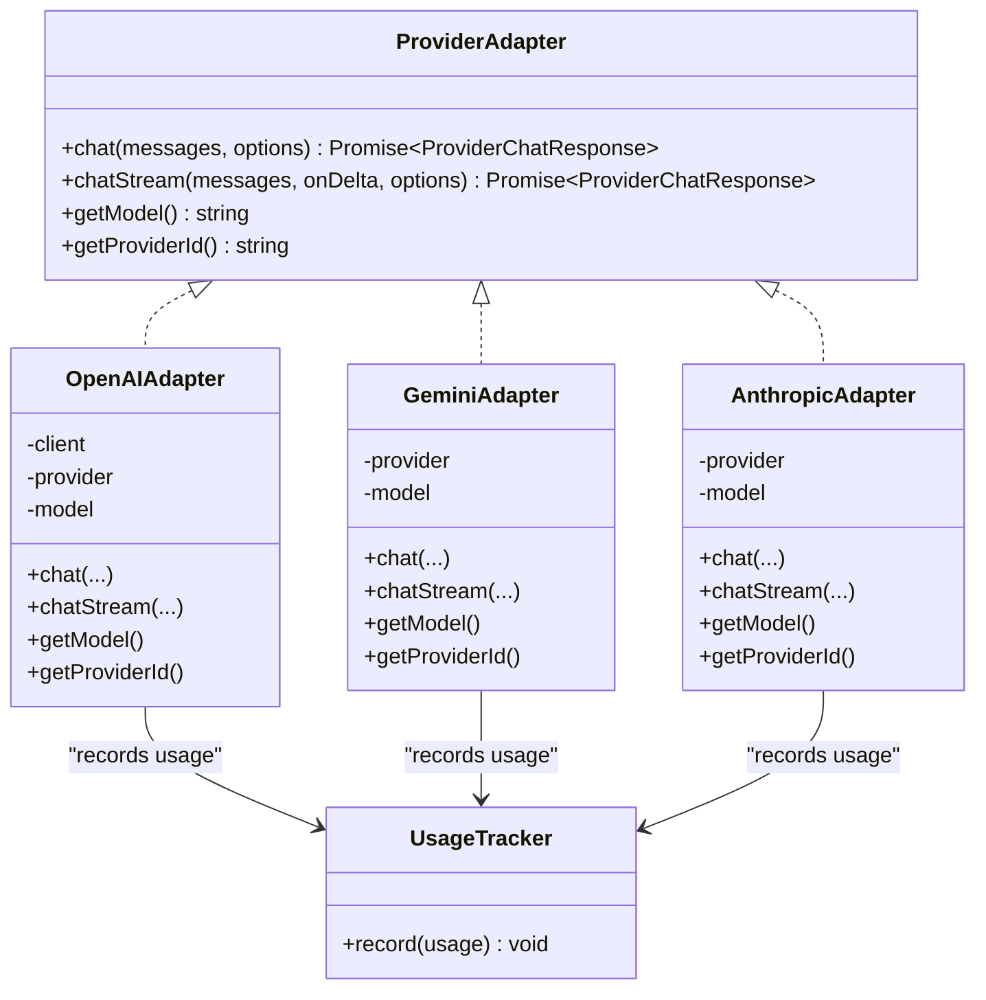
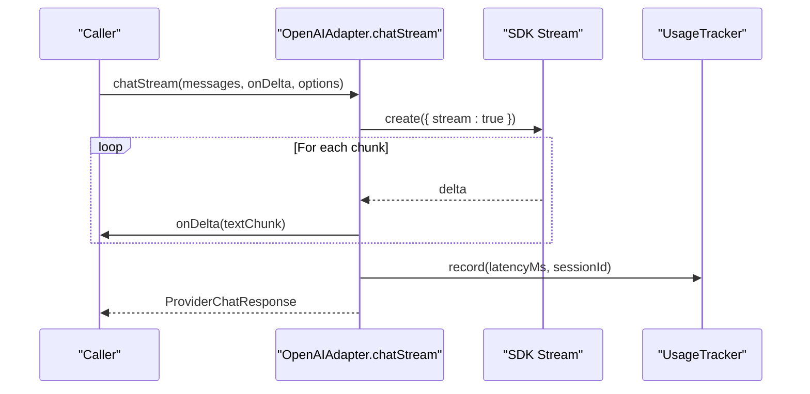
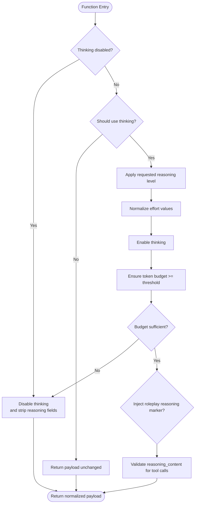
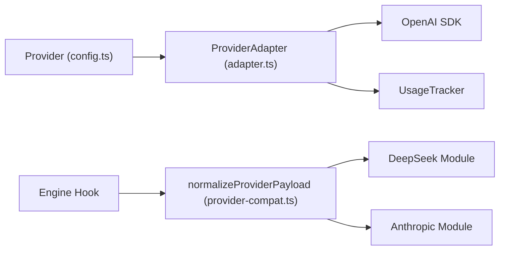

# Provider Abstraction Layer

<cite>
**Referenced Files in This Document**
- [adapter.ts](file://core/providers/adapter.ts)
- [types.ts](file://core/providers/types.ts)
- [builtin.ts](file://core/providers/builtin.ts)
- [usage-tracker.ts](file://core/providers/usage-tracker.ts)
- [provider-compat.ts](file://core/provider-compat.ts)
- [deepseek.ts](file://core/provider-compat/deepseek.ts)
- [anthropic.ts](file://core/provider-compat/anthropic.ts)
- [config.ts](file://core/config.ts)
- [engine.ts](file://core/engine.ts)
</cite>

## Table of Contents
1. [Introduction](#introduction)
2. [Project Structure](#project-structure)
3. [Core Components](#core-components)
4. [Architecture Overview](#architecture-overview)
5. [Detailed Component Analysis](#detailed-component-analysis)
6. [Dependency Analysis](#dependency-analysis)
7. [Performance Considerations](#performance-considerations)
8. [Troubleshooting Guide](#troubleshooting-guide)
9. [Conclusion](#conclusion)
10. [Appendices](#appendices)

## Introduction
This document explains the provider abstraction layer that unifies different LLM backends behind a single interface. It focuses on:
- The ProviderAdapter interface and its responsibilities
- The ChatOptions schema for request parameters
- The ProviderChatResponse structure for normalized responses
- How OpenAI-compatible providers (OpenAI, MiniMax, DashScope, DeepSeek) are handled alongside custom implementations
- Practical guidance to implement new provider adapters
- Adapter lifecycle, error handling patterns, and streaming response processing
- Compatibility considerations and migration strategies for existing integrations

## Project Structure
The provider abstraction spans two complementary layers:
- A lightweight adapter layer that exposes a unified chat interface across multiple protocols
- A compatibility dispatcher that normalizes payloads and context messages per provider quirks before they reach the network

**Diagram sources**
- [adapter.ts:4-43](file://core/providers/adapter.ts#L4-L43)
- [provider-compat.ts:251-303](file://core/provider-compat.ts#L251-L303)
- [deepseek.ts:59-66](file://core/provider-compat/deepseek.ts#L59-L66)
- [anthropic.ts:144-150](file://core/provider-compat/anthropic.ts#L144-L150)
- [engine.ts:1567-1588](file://core/engine.ts#L1567-L1588)

**Section sources**
- [adapter.ts:4-43](file://core/providers/adapter.ts#L4-L43)
- [provider-compat.ts:251-303](file://core/provider-compat.ts#L251-L303)
- [engine.ts:1567-1588](file://core/engine.ts#L1567-L1588)

## Core Components
- ProviderAdapter: Defines the unified contract for chat and streaming chat, plus identity helpers.
- ChatOptions: Request-level options such as model override, token limits, temperature, tools, and session tracking.
- ProviderChatResponse: Normalized response with content, optional tool calls, usage metrics, and latency.
- createProviderAdapter(): Factory that maps provider type to concrete adapter implementation.
- UsageTracker: Records per-request usage and latency for analytics.

Key behaviors:
- OpenAI-compatible adapters use an OpenAI SDK client with configurable base URL to support OpenAI, MiniMax, DashScope, DeepSeek, etc.
- Gemini and Anthropic adapters implement their native HTTP APIs directly.
- Streaming is supported via async iteration or server-sent events, with consistent delta delivery through onDelta callbacks.

**Section sources**
- [adapter.ts:4-28](file://core/providers/adapter.ts#L4-L28)
- [adapter.ts:30-43](file://core/providers/adapter.ts#L30-L43)
- [usage-tracker.ts:26-53](file://core/providers/usage-tracker.ts#L26-L53)

## Architecture Overview
The system composes two layers:
- Adapter layer: Provides a uniform API surface for callers regardless of backend protocol.
- Compatibility layer: Applies provider-specific payload and message normalization before requests are sent.

**Diagram sources**
- [adapter.ts:62-91](file://core/providers/adapter.ts#L62-L91)
- [provider-compat.ts:251-278](file://core/provider-compat.ts#L251-L278)

## Detailed Component Analysis

### ProviderAdapter Interface and Response Model
- chat(messages, options): Non-streaming call returning a complete response.
- chatStream(messages, onDelta, options): Streaming call invoking onDelta for each text chunk.
- getModel(), getProviderId(): Identity helpers used by registry and telemetry.
- ProviderChatResponse includes:
  - content: final assembled text
  - toolCalls: optional list of function invocations with parsed arguments
  - usage: optional token usage summary
  - latencyMs: total time from request start to completion

Implementation highlights:
- OpenAIAdapter uses the OpenAI SDK with baseURL and apiKey from configuration; supports both non-streaming and streaming paths.
- GeminiAdapter and AnthropicAdapter perform direct fetch calls tailored to their APIs.
- All adapters record usage via UsageTracker when available.

**Section sources**
- [adapter.ts:4-28](file://core/providers/adapter.ts#L4-L28)
- [adapter.ts:48-91](file://core/providers/adapter.ts#L48-L91)
- [adapter.ts:93-143](file://core/providers/adapter.ts#L93-L143)
- [adapter.ts:162-217](file://core/providers/adapter.ts#L162-L217)
- [adapter.ts:219-279](file://core/providers/adapter.ts#L219-L279)
- [adapter.ts:310-387](file://core/providers/adapter.ts#L310-L387)
- [adapter.ts:389-463](file://core/providers/adapter.ts#L389-L463)
- [usage-tracker.ts:26-53](file://core/providers/usage-tracker.ts#L26-L53)

### ChatOptions Schema
- model?: string — overrides the default model selected by the adapter
- maxTokens?: number — maximum output tokens
- temperature?: number — sampling temperature
- tools?: any[] — tool definitions forwarded to the backend
- sessionId?: string — optional session identifier for telemetry

These fields are consumed by adapters and passed into backend requests.

**Section sources**
- [adapter.ts:11-17](file://core/providers/adapter.ts#L11-L17)

### ProviderChatResponse Structure
- content: string
- toolCalls?: Array<{ name: string; args: Record<string, unknown> }>
- usage?: { promptTokens: number; completionTokens: number; totalTokens: number }
- latencyMs: number

Adapters map backend-specific fields into this shape, ensuring consistent consumption upstream.

**Section sources**
- [adapter.ts:19-28](file://core/providers/adapter.ts#L19-L28)

### ProviderFactory and Built-in Catalog
- createProviderAdapter(provider, modelName?): selects the correct adapter based on provider.type
- Built-in catalog provides static metadata for common providers (e.g., OpenAI, MiniMax, DashScope, DeepSeek), including default base URLs and model lists

Adding a new built-in provider typically involves updating the catalog entry; the factory routes OpenAI-compatible types to the OpenAIAdapter.

**Section sources**
- [adapter.ts:30-43](file://core/providers/adapter.ts#L30-L43)
- [builtin.ts:11-43](file://core/providers/builtin.ts#L11-L43)
- [types.ts:14](file://core/providers/types.ts#L14-L14)

### Compatibility Layer: Payload and Context Normalization
The compatibility layer centralizes provider-specific adjustments:
- normalizeProviderPayload(payload, model, options): applies generic patches then dispatches to provider modules
- normalizeProviderContextMessages(messages, model, options): adapts historical messages for replay/hook contexts

Dispatch order:
1. Generic patches (strip empty tools, strip incompatible thinking fields, normalize reasoning effort, orphan tool result pairing, media marker stripping, audio transport normalization)
2. Provider-specific module apply() (first-match-wins)

Provider modules:
- DeepSeek: handles thinking mode flags, reasoning_effort normalization, token budget adjustments, roleplay reasoning markers, and strict reasoning_content validation for tool calls
- Anthropic: manages cache_control injection, adaptive thinking profiles, and output budget adjustments for high-effort modes

**Section sources**
- [provider-compat.ts:251-303](file://core/provider-compat.ts#L251-L303)
- [deepseek.ts:59-66](file://core/provider-compat/deepseek.ts#L59-L66)
- [deepseek.ts:365-426](file://core/provider-compat/deepseek.ts#L365-L426)
- [anthropic.ts:144-150](file://core/provider-compat/anthropic.ts#L144-L150)
- [anthropic.ts:259-277](file://core/provider-compat/anthropic.ts#L259-L277)

### Engine Integration Point
The engine hooks into the compatibility layer during Pi SDK’s before_provider_request event, passing the serialized payload along with model and reasoning level information. This ensures all outgoing requests are normalized consistently.

**Section sources**
- [engine.ts:1567-1588](file://core/engine.ts#L1567-L1588)

### Class Diagram: Adapters and Interfaces

**Diagram sources**
- [adapter.ts:4-28](file://core/providers/adapter.ts#L4-L28)
- [adapter.ts:48-91](file://core/providers/adapter.ts#L48-L91)
- [adapter.ts:162-217](file://core/providers/adapter.ts#L162-L217)
- [adapter.ts:310-387](file://core/providers/adapter.ts#L310-L387)
- [usage-tracker.ts:26-53](file://core/providers/usage-tracker.ts#L26-L53)

### Sequence Diagram: Streaming Flow

**Diagram sources**
- [adapter.ts:93-143](file://core/providers/adapter.ts#L93-L143)
- [usage-tracker.ts:26-53](file://core/providers/usage-tracker.ts#L26-L53)

### Flowchart: DeepSeek Thinking Mode Logic

**Diagram sources**
- [deepseek.ts:365-426](file://core/provider-compat/deepseek.ts#L365-L426)

## Dependency Analysis
- Adapter layer depends on:
  - Provider configuration types (Provider)
  - Optional OpenAI SDK client for OpenAI-compatible endpoints
  - UsageTracker for telemetry
- Compatibility layer depends on:
  - Shared model capabilities and reasoning profile utilities
  - Session thinking level normalization
  - Provider-specific modules (DeepSeek, Anthropic, etc.)
- Engine integration:
  - Calls normalizeProviderPayload within before_provider_request hook

**Diagram sources**
- [config.ts:78-85](file://core/config.ts#L78-L85)
- [adapter.ts:48-91](file://core/providers/adapter.ts#L48-L91)
- [provider-compat.ts:251-303](file://core/provider-compat.ts#L251-L303)
- [deepseek.ts:59-66](file://core/provider-compat/deepseek.ts#L59-L66)
- [anthropic.ts:144-150](file://core/provider-compat/anthropic.ts#L144-L150)
- [engine.ts:1567-1588](file://core/engine.ts#L1567-L1588)

**Section sources**
- [config.ts:78-85](file://core/config.ts#L78-L85)
- [adapter.ts:48-91](file://core/providers/adapter.ts#L48-L91)
- [provider-compat.ts:251-303](file://core/provider-compat.ts#L251-L303)
- [engine.ts:1567-1588](file://core/engine.ts#L1567-L1588)

## Performance Considerations
- Streaming reduces perceived latency by delivering deltas immediately
- Usage tracking is wrapped in try/catch to avoid impacting main flows
- Compatibility layer avoids unnecessary mutations by copying only when needed
- Token budget adjustments prevent excessive costs while enabling advanced reasoning features where supported

[No sources needed since this section provides general guidance]

## Troubleshooting Guide
Common issues and resolutions:
- Unsupported provider type: ensure provider.type matches one of the supported values and is routed by createProviderAdapter
- Missing API key or invalid base URL: verify Provider configuration fields (apiKey, baseUrl)
- Streaming errors: check SSE parsing and reader availability; malformed lines are skipped gracefully
- Tool call argument parsing failures: JSON.parse fallbacks return empty objects to keep flow stable
- Reasoning mode conflicts: compatibility modules enforce constraints (e.g., minimum token budgets, adaptive-only models)

Operational checks:
- Confirm normalizeProviderPayload is invoked via engine hook for all outgoing requests
- Validate provider-specific matches() functions identify the intended backend
- Inspect UsageTracker records for latency and token counts

**Section sources**
- [adapter.ts:30-43](file://core/providers/adapter.ts#L30-L43)
- [adapter.ts:93-143](file://core/providers/adapter.ts#L93-L143)
- [adapter.ts:219-279](file://core/providers/adapter.ts#L219-L279)
- [provider-compat.ts:251-303](file://core/provider-compat.ts#L251-L303)
- [deepseek.ts:365-426](file://core/provider-compat/deepseek.ts#L365-L426)
- [anthropic.ts:259-277](file://core/provider-compat/anthropic.ts#L259-L277)

## Conclusion
The provider abstraction layer delivers a clean, unified interface over diverse LLM backends. By combining a straightforward adapter contract with a robust compatibility dispatcher, it standardizes request/response shapes, handles streaming uniformly, and encapsulates provider-specific nuances. This design simplifies adding new providers, improves reliability, and enables consistent telemetry and performance monitoring.

[No sources needed since this section summarizes without analyzing specific files]

## Appendices

### Implementing a New Provider Adapter
Steps:
1. Define or reuse Provider configuration fields (id, type, apiKey, baseUrl, models)
2. Create a new adapter class implementing ProviderAdapter
   - Implement chat() and chatStream() methods
   - Map backend-specific usage and tool calls into ProviderChatResponse
   - Record usage via UsageTracker
3. Register the adapter in createProviderAdapter() by mapping provider.type to your class
4. If the provider has unique payload requirements, add a compatibility module under core/provider-compat/<name>.ts and register it in the dispatcher
5. Update built-in catalog if you want to expose the provider in the wizard dropdown

Practical examples:
- OpenAI-compatible providers (OpenAI, MiniMax, DashScope, DeepSeek) share the same adapter path; differences are handled by base URL and model selection
- Custom implementations can follow the same pattern, using fetch or SDK clients as appropriate

**Section sources**
- [adapter.ts:30-43](file://core/providers/adapter.ts#L30-L43)
- [builtin.ts:11-43](file://core/providers/builtin.ts#L11-L43)
- [provider-compat.ts:251-303](file://core/provider-compat.ts#L251-L303)

### Handling Provider-Specific Features
- Thinking/reasoning modes: managed by compatibility modules (DeepSeek, Anthropic)
- Output budget and token limits: adjusted to meet provider constraints
- Media attachments and audio transports: normalized prior to sending
- Tool call histories: validated and repaired to satisfy provider contracts

**Section sources**
- [deepseek.ts:365-426](file://core/provider-compat/deepseek.ts#L365-L426)
- [anthropic.ts:259-277](file://core/provider-compat/anthropic.ts#L259-L277)
- [provider-compat.ts:251-303](file://core/provider-compat.ts#L251-L303)

### Migration Strategies for Existing Integrations
- Migrate legacy provider configs to the Provider schema (id, type, apiKey, baseUrl, models)
- Replace direct backend calls with ProviderAdapter usage
- Ensure engine hooks continue to invoke normalizeProviderPayload for all requests
- Validate that streaming consumers handle onDelta callbacks consistently

**Section sources**
- [config.ts:78-85](file://core/config.ts#L78-L85)
- [engine.ts:1567-1588](file://core/engine.ts#L1567-L1588)
- [adapter.ts:93-143](file://core/providers/adapter.ts#L93-L143)