# Provider Compatibility & Extensions

<cite>
**Referenced Files in This Document**
- [core/provider-compat.ts](file://core/provider-compat.ts)
- [core/provider-compat/anthropic.ts](file://core/provider-compat/anthropic.ts)
- [core/provider-compat/deepseek.ts](file://core/provider-compat/deepseek.ts)
- [core/provider-compat/qwen.ts](file://core/provider-compat/qwen.ts)
- [core/provider-compat/openrouter.ts](file://core/provider-compat/openrouter.ts)
- [core/provider-compat/kimi.ts](file://core/provider-compat/kimi.ts)
- [core/provider-compat/mimo.ts](file://core/provider-compat/mimo.ts)
- [core/provider-compat/zhipu.ts](file://core/provider-compat/zhipu.ts)
- [core/provider-compat/input-audio.ts](file://core/provider-compat/input-audio.ts)
- [core/provider-compat/openai-input-audio.ts](file://core/provider-compat/openai-input-audio.ts)
- [core/provider-compat/openai-video-url.ts](file://core/provider-compat/openai-video-url.ts)
- [core/provider-compat/reasoning-content-replay.ts](file://core/provider-compat/reasoning-content-replay.ts)
- [core/provider-compat/tool-pairing.ts](file://core/provider-compat/tool-pairing.ts)
- [core/provider-compat/output-budget.ts](file://core/provider-compat/output-budget.ts)
- [shared/model-capabilities.ts](file://shared/model-capabilities.ts)
</cite>

## Table of Contents
1. Introduction
2. Project Structure
3. Core Components
4. Architecture Overview
5. Detailed Component Analysis
6. Dependency Analysis
7. Performance Considerations
8. Troubleshooting Guide
9. Conclusion
10. Appendices

## Introduction
This document explains the provider compatibility layers and extension points that normalize LLM requests across Anthropic, DeepSeek, Qwen (DashScope), OpenRouter, Kimi, MiMo, Zhipu, and other specialized providers. It covers how adapters handle:
- Tool calling consistency and replay of reasoning content
- Vision input normalization (image/video)
- Audio processing for OpenAI-compatible and MiMo-specific transports
- Reasoning/thinking control fields and effort mapping
- Output budget normalization and implicit SDK defaults
- Extension points to add new providers, custom message formats, and advanced features
It also includes testing strategies and debugging techniques for integration issues.

## Project Structure
The compatibility system is a dispatcher with pluggable submodules. The main entry applies generic patches and then dispatches to the first matching provider module. Shared model capability helpers determine transport modes and thinking formats.

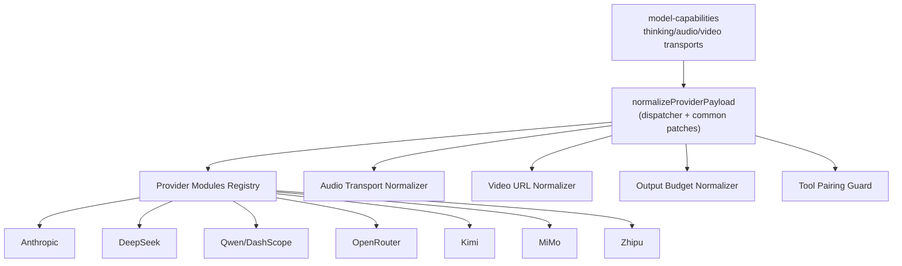

**Diagram sources**
- [core/provider-compat.ts](file://core/provider-compat.ts)
- [shared/model-capabilities.ts](file://shared/model-capabilities.ts)

**Section sources**
- [core/provider-compat.ts](file://core/provider-compat.ts)
- [shared/model-capabilities.ts](file://shared/model-capabilities.ts)

## Core Components
- Dispatcher and common patches: centralizes provider-agnostic transformations (empty tools removal, incompatible thinking stripping, disabled reasoning effort handling, orphan tool result cleanup, native media marker stripping, audio transport normalization).
- Provider modules: each implements matches(model) and apply(payload, model, options), optionally normalizeContextMessages(messages, model, options).
- Capability helpers: resolve thinking format, reasoning profile, and media transports (audio/video/image).
- Replay utilities: ensure assistant messages with tool_calls carry non-empty reasoning_content; strip or preserve reasoning as needed.
- Output budget policy: enforce required output cap fields and remove implicit SDK defaults when appropriate.

Key responsibilities by file:
- core/provider-compat.ts: dispatcher, common patches, context normalizer entry
- shared/model-capabilities.ts: thinking format/profile resolution, audio/video/image transport resolution
- core/provider-compat/*: per-provider logic
- core/provider-compat/reasoning-content-replay.ts: reasoning replay helpers
- core/provider-compat/tool-pairing.ts: orphan toolResult cleanup
- core/provider-compat/output-budget.ts: output budget normalization

**Section sources**
- [core/provider-compat.ts](file://core/provider-compat.ts)
- [shared/model-capabilities.ts](file://shared/model-capabilities.ts)
- [core/provider-compat/reasoning-content-replay.ts](file://core/provider-compat/reasoning-content-replay.ts)
- [core/provider-compat/tool-pairing.ts](file://core/provider-compat/tool-pairing.ts)
- [core/provider-compat/output-budget.ts](file://core/provider-compat/output-budget.ts)

## Architecture Overview
The request pipeline runs before provider serialization and after Pi SDK context hooks. It ensures payloads conform to each provider’s wire contract while preserving a unified internal model.

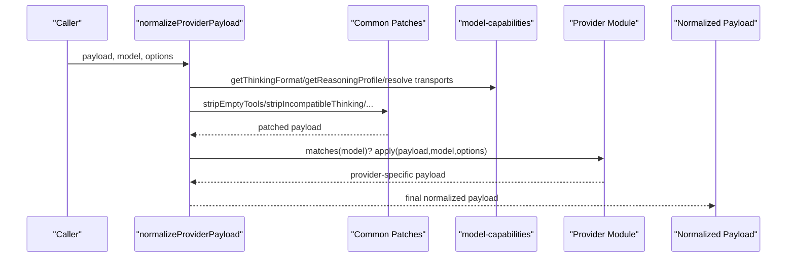

**Diagram sources**
- [core/provider-compat.ts](file://core/provider-compat.ts)
- [shared/model-capabilities.ts](file://shared/model-capabilities.ts)

## Detailed Component Analysis

### Anthropic Adapter
Highlights:
- Cache-control injection on system and recent user messages for Anthropic Messages API.
- Adaptive-only profiles (e.g., Claude Fable/Mythos 5) force adaptive thinking and map reasoning levels to output_config.effort.
- Max effort path raises max_tokens to a minimum threshold when requested.
- Disables thinking in utility mode or when explicitly off.

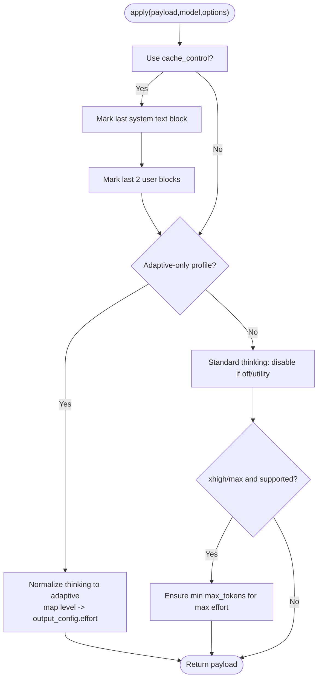

**Diagram sources**
- [core/provider-compat/anthropic.ts](file://core/provider-compat/anthropic.ts)

**Section sources**
- [core/provider-compat/anthropic.ts](file://core/provider-compat/anthropic.ts)

### DeepSeek Adapter
Highlights:
- Supports both OpenAI-style and Anthropic-style payloads for DeepSeek V4 models.
- Thinking enabled via thinking.type and reasoning_effort mapping; enforces minimum token budgets for high/max effort.
- Utility mode disables thinking to save tokens.
- Ensures assistant messages with tool_calls have real reasoning_content; fails closed if missing.
- Optional roleplay reasoning marker injection for immersive persona behavior.

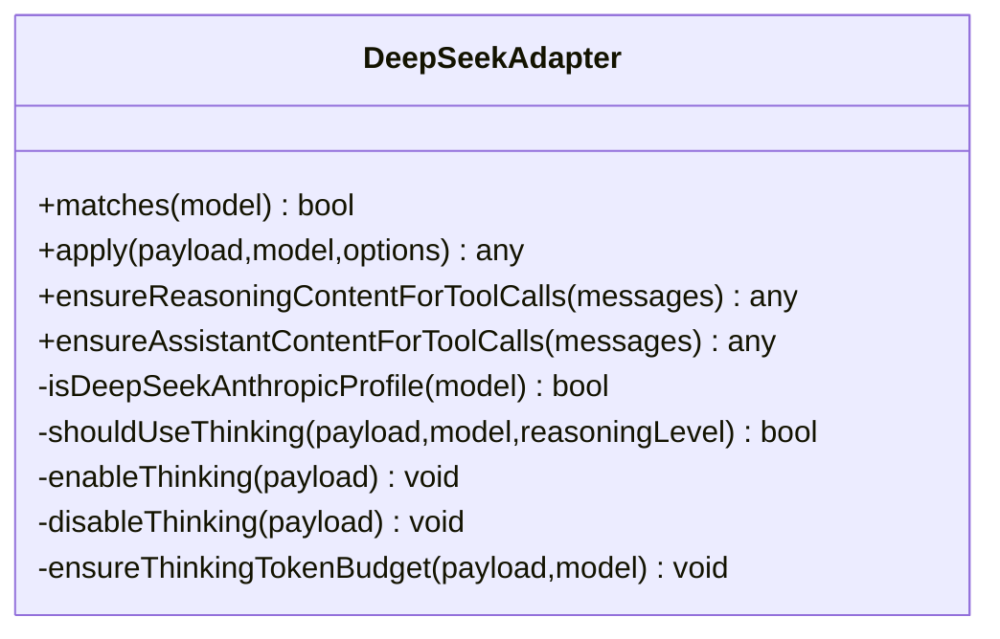

**Diagram sources**
- [core/provider-compat/deepseek.ts](file://core/provider-compat/deepseek.ts)
- [core/provider-compat/reasoning-content-replay.ts](file://core/provider-compat/reasoning-content-replay.ts)

**Section sources**
- [core/provider-compat/deepseek.ts](file://core/provider-compat/deepseek.ts)
- [core/provider-compat/reasoning-content-replay.ts](file://core/provider-compat/reasoning-content-replay.ts)

### Qwen (DashScope) Adapter
Highlights:
- Matches models with quirks.enable_thinking or DashScope endpoints supporting video_url.
- For utility mode or explicit off, forces enable_thinking=false.
- Converts data:video image_url blocks to video_url for DashScope/OpenAI-compatible video models.

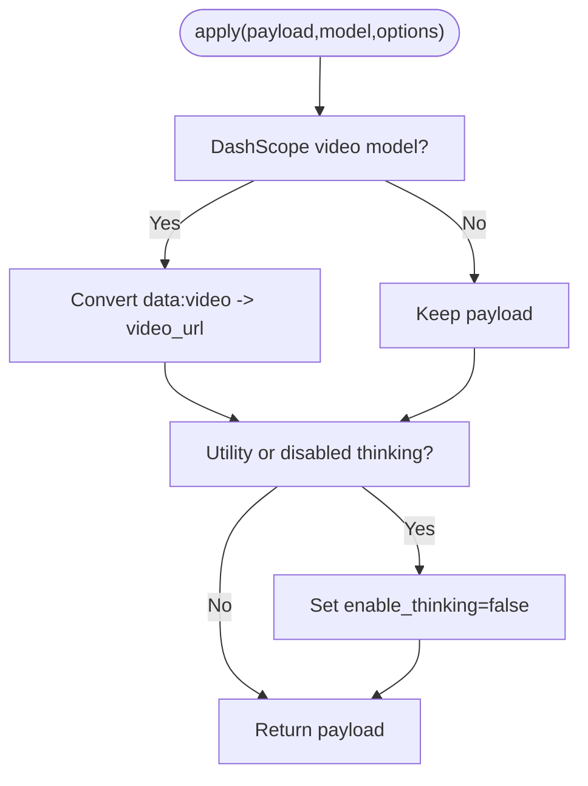

**Diagram sources**
- [core/provider-compat/qwen.ts](file://core/provider-compat/qwen.ts)
- [core/provider-compat/openai-video-url.ts](file://core/provider-compat/openai-video-url.ts)

**Section sources**
- [core/provider-compat/qwen.ts](file://core/provider-compat/qwen.ts)
- [core/provider-compat/openai-video-url.ts](file://core/provider-compat/openai-video-url.ts)

### OpenRouter Adapter
Highlights:
- Targets OpenRouter-hosted Anthropic adaptive-only Claude models.
- Maps reasoning levels to verbosity and strips unsupported thinking/reasoning fields.
- Throws when adaptive thinking is disabled (not supported by these models).

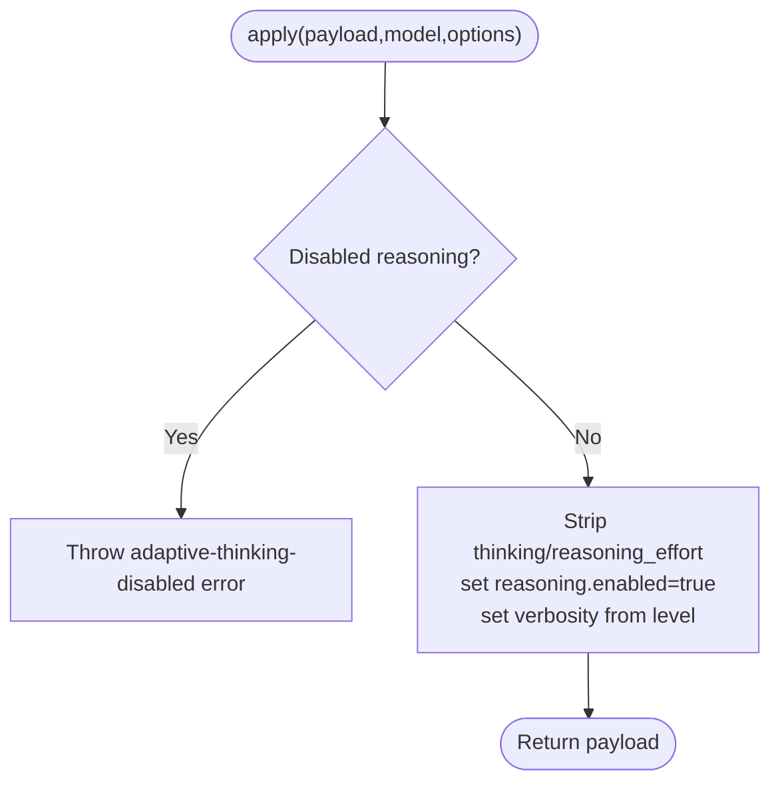

**Diagram sources**
- [core/provider-compat/openrouter.ts](file://core/provider-compat/openrouter.ts)

**Section sources**
- [core/provider-compat/openrouter.ts](file://core/provider-compat/openrouter.ts)

### Kimi Adapter
Highlights:
- OpenAI-compatible thinking with thinking.type and reasoning_effort; uses reasoning_content for replay.
- Normalizes max_tokens to max_completion_tokens where applicable.
- Ensures assistant messages with tool_calls include non-empty reasoning_content.

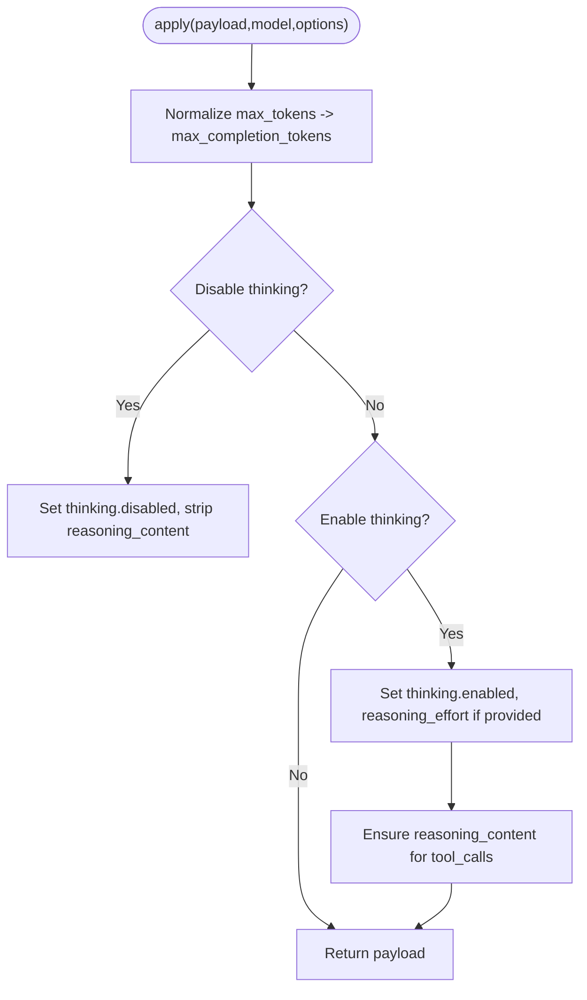

**Diagram sources**
- [core/provider-compat/kimi.ts](file://core/provider-compat/kimi.ts)
- [core/provider-compat/reasoning-content-replay.ts](file://core/provider-compat/reasoning-content-replay.ts)

**Section sources**
- [core/provider-compat/kimi.ts](file://core/provider-compat/kimi.ts)
- [core/provider-compat/reasoning-content-replay.ts](file://core/provider-compat/reasoning-content-replay.ts)

### MiMo Adapter
Highlights:
- Uses chat_template_kwargs.enable_thinking and preserve_thinking flags.
- Enforces reasoning_content replay for tool calls.
- Normalizes OpenAI input_audio parts for MiMo-specific transport.

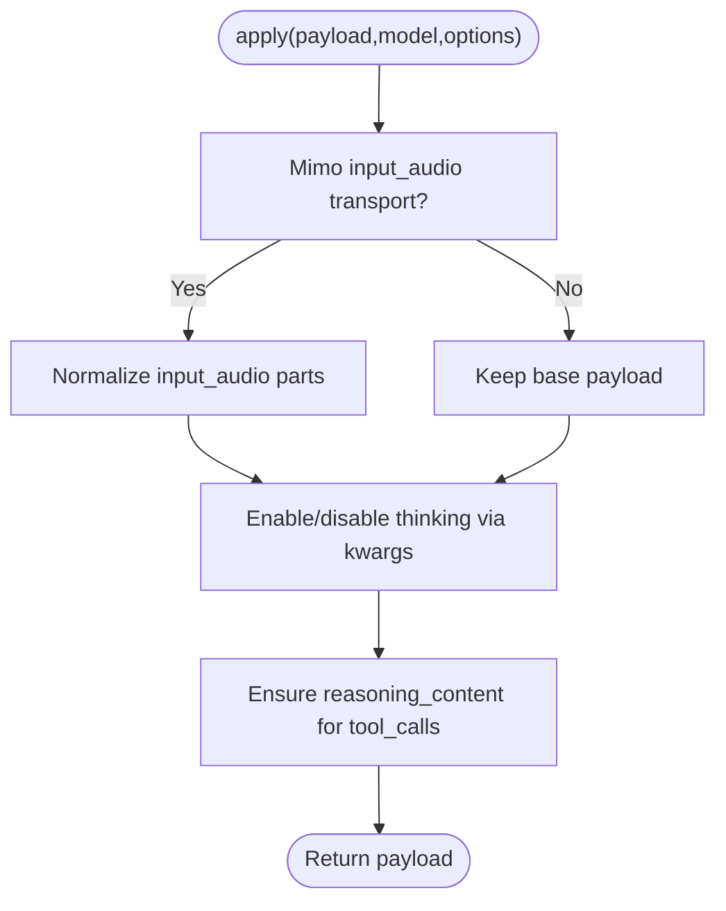

**Diagram sources**
- [core/provider-compat/mimo.ts](file://core/provider-compat/mimo.ts)
- [core/provider-compat/input-audio.ts](file://core/provider-compat/input-audio.ts)

**Section sources**
- [core/provider-compat/mimo.ts](file://core/provider-compat/mimo.ts)
- [core/provider-compat/input-audio.ts](file://core/provider-compat/input-audio.ts)

### Zhipu Adapter
Highlights:
- OpenAI-compatible but rejects certain OpenAI-only fields; cleans up strict and stream_options.
- Controls thinking via thinking.type and clear_thinking flag; preserves or clears history based on options.
- Ensures reasoning_content replay for tool calls.

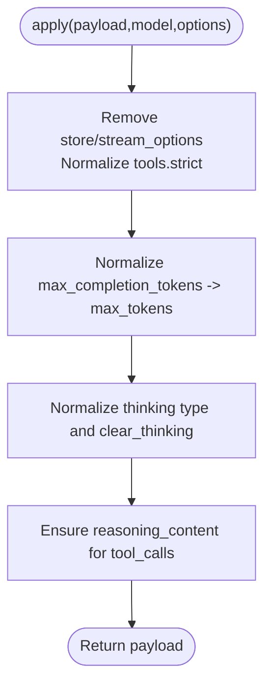

**Diagram sources**
- [core/provider-compat/zhipu.ts](file://core/provider-compat/zhipu.ts)
- [core/provider-compat/reasoning-content-replay.ts](file://core/provider-compat/reasoning-content-replay.ts)

**Section sources**
- [core/provider-compat/zhipu.ts](file://core/provider-compat/zhipu.ts)
- [core/provider-compat/reasoning-content-replay.ts](file://core/provider-compat/reasoning-content-replay.ts)

### Audio and Video Transports
- OpenAI input_audio normalization converts data URLs or canonical audio blocks into input_audio parts with base64 data and format.
- MiMo-specific audio transport uses the same normalization when resolved.
- OpenAI-compatible video_url normalization converts data:video image_url blocks to video_url for DashScope/Moonshot.

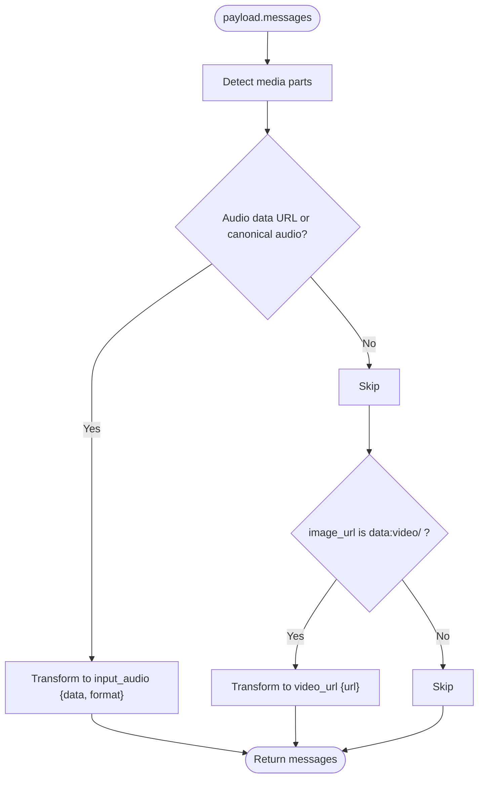

**Diagram sources**
- [core/provider-compat/input-audio.ts](file://core/provider-compat/input-audio.ts)
- [core/provider-compat/openai-input-audio.ts](file://core/provider-compat/openai-input-audio.ts)
- [core/provider-compat/openai-video-url.ts](file://core/provider-compat/openai-video-url.ts)

**Section sources**
- [core/provider-compat/input-audio.ts](file://core/provider-compat/input-audio.ts)
- [core/provider-compat/openai-input-audio.ts](file://core/provider-compat/openai-input-audio.ts)
- [core/provider-compat/openai-video-url.ts](file://core/provider-compat/openai-video-url.ts)

### Reasoning Content Replay and Tool Pairing
- ensureReasoningContentForToolCalls: guarantees assistant messages with tool_calls have non-empty reasoning_content; extracts from content if present; throws if missing.
- ensureAssistantContentForToolCalls: ensures assistant.content is not null for tool call turns.
- stripOrphanToolResults: removes orphan role:"tool" messages whose parent assistant.tool_calls were dropped by upstream transforms.

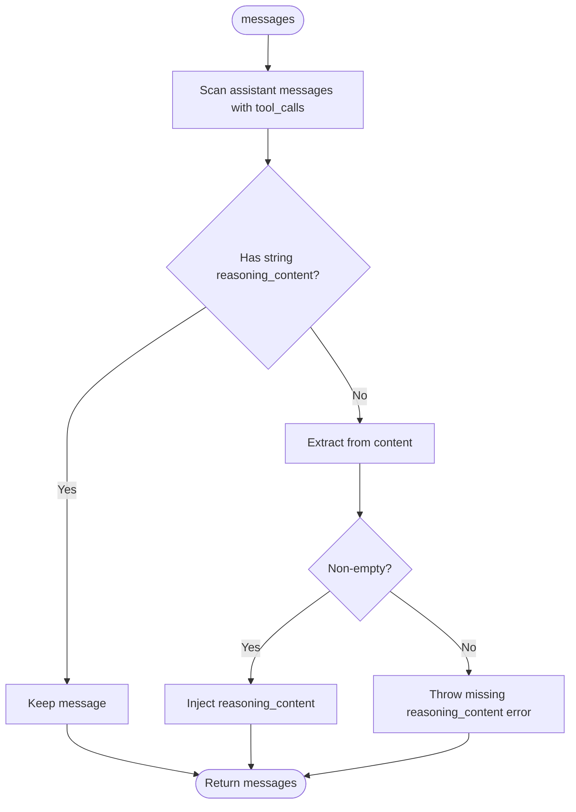

**Diagram sources**
- [core/provider-compat/reasoning-content-replay.ts](file://core/provider-compat/reasoning-content-replay.ts)
- [core/provider-compat/tool-pairing.ts](file://core/provider-compat/tool-pairing.ts)

**Section sources**
- [core/provider-compat/reasoning-content-replay.ts](file://core/provider-compat/reasoning-content-replay.ts)
- [core/provider-compat/tool-pairing.ts](file://core/provider-compat/tool-pairing.ts)

### Output Budget Normalization
- Resolves capability rules (required vs optional output cap fields) and source policies (user/system preservation).
- Removes implicit SDK default output caps when safe; injects model limits for required providers.

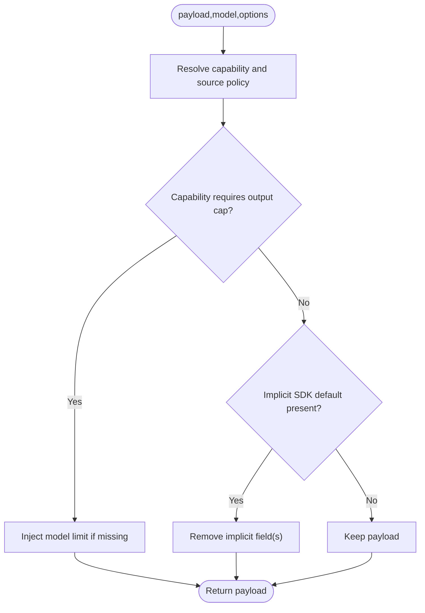

**Diagram sources**
- [core/provider-compat/output-budget.ts](file://core/provider-compat/output-budget.ts)

**Section sources**
- [core/provider-compat/output-budget.ts](file://core/provider-compat/output-budget.ts)

## Dependency Analysis
The dispatcher depends on capability helpers to route and transform payloads. Provider modules depend on shared capabilities and replay utilities.

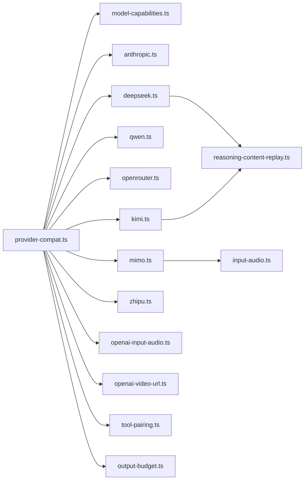

**Diagram sources**
- [core/provider-compat.ts](file://core/provider-compat.ts)
- [shared/model-capabilities.ts](file://shared/model-capabilities.ts)
- [core/provider-compat/anthropic.ts](file://core/provider-compat/anthropic.ts)
- [core/provider-compat/deepseek.ts](file://core/provider-compat/deepseek.ts)
- [core/provider-compat/qwen.ts](file://core/provider-compat/qwen.ts)
- [core/provider-compat/openrouter.ts](file://core/provider-compat/openrouter.ts)
- [core/provider-compat/kimi.ts](file://core/provider-compat/kimi.ts)
- [core/provider-compat/mimo.ts](file://core/provider-compat/mimo.ts)
- [core/provider-compat/zhipu.ts](file://core/provider-compat/zhipu.ts)
- [core/provider-compat/input-audio.ts](file://core/provider-compat/input-audio.ts)
- [core/provider-compat/openai-input-audio.ts](file://core/provider-compat/openai-input-audio.ts)
- [core/provider-compat/openai-video-url.ts](file://core/provider-compat/openai-video-url.ts)
- [core/provider-compat/reasoning-content-replay.ts](file://core/provider-compat/reasoning-content-replay.ts)
- [core/provider-compat/tool-pairing.ts](file://core/provider-compat/tool-pairing.ts)
- [core/provider-compat/output-budget.ts](file://core/provider-compat/output-budget.ts)

**Section sources**
- [core/provider-compat.ts](file://core/provider-compat.ts)
- [shared/model-capabilities.ts](file://shared/model-capabilities.ts)

## Performance Considerations
- Avoid unnecessary copies: many functions return the original array/object when no changes are made.
- Early exits: quick checks for disabled thinking or utility mode prevent heavy transformations.
- Minimal scanning: orphan tool result cleanup performs two passes only when necessary.
- Prefer capability-based routing: use model-capabilities resolvers to avoid repeated provider name parsing.

[No sources needed since this section provides general guidance]

## Troubleshooting Guide
Common issues and resolutions:
- Missing reasoning_content for tool_calls:
  - Symptom: Provider returns 400 due to missing reasoning_content on assistant messages with tool_calls.
  - Resolution: Ensure replay utilities run; compact session or start new session if content is truly lost.
  - Related code paths:
    - [core/provider-compat/reasoning-content-replay.ts](file://core/provider-compat/reasoning-content-replay.ts)
    - [core/provider-compat/deepseek.ts](file://core/provider-compat/deepseek.ts)
    - [core/provider-compat/kimi.ts](file://core/provider-compat/kimi.ts)
    - [core/provider-compat/mimo.ts](file://core/provider-compat/mimo.ts)
    - [core/provider-compat/zhipu.ts](file://core/provider-compat/zhipu.ts)
- Orphan tool results causing 400:
  - Symptom: role:"tool" without preceding assistant.tool_calls.
  - Resolution: Use orphan cleanup; verify upstream transform-messages behavior.
  - Related code paths:
    - [core/provider-compat/tool-pairing.ts](file://core/provider-compat/tool-pairing.ts)
- Adaptive thinking disabled errors:
  - Symptom: Errors thrown for models that do not support disabling adaptive thinking.
  - Resolution: Do not set reasoning_level to off for these models; adjust options.
  - Related code paths:
    - [core/provider-compat/anthropic.ts](file://core/provider-compat/anthropic.ts)
    - [core/provider-compat/openrouter.ts](file://core/provider-compat/openrouter.ts)
- Audio/video transport mismatches:
  - Symptom: Unsupported MIME types or incorrect part shapes.
  - Resolution: Use input_audio/video_url normalizers; validate MIME-to-format mapping.
  - Related code paths:
    - [core/provider-compat/input-audio.ts](file://core/provider-compat/input-audio.ts)
    - [core/provider-compat/openai-video-url.ts](file://core/provider-compat/openai-video-url.ts)
- Output budget anomalies:
  - Symptom: Unexpected truncation or overuse of tokens.
  - Resolution: Review output budget policy and provider requirements; check model limits.
  - Related code paths:
    - [core/provider-compat/output-budget.ts](file://core/provider-compat/output-budget.ts)

**Section sources**
- [core/provider-compat/reasoning-content-replay.ts](file://core/provider-compat/reasoning-content-replay.ts)
- [core/provider-compat/tool-pairing.ts](file://core/provider-compat/tool-pairing.ts)
- [core/provider-compat/anthropic.ts](file://core/provider-compat/anthropic.ts)
- [core/provider-compat/openrouter.ts](file://core/provider-compat/openrouter.ts)
- [core/provider-compat/input-audio.ts](file://core/provider-compat/input-audio.ts)
- [core/provider-compat/openai-video-url.ts](file://core/provider-compat/openai-video-url.ts)
- [core/provider-compat/output-budget.ts](file://core/provider-compat/output-budget.ts)

## Conclusion
The provider compatibility layer provides a robust, extensible framework to unify diverse provider behaviors around thinking/reasoning, tool calling, and multimodal inputs. By centralizing common patches and delegating provider-specific logic to focused modules, it simplifies adding new providers and maintaining correctness across updates.

[No sources needed since this section summarizes without analyzing specific files]

## Appendices

### How to Extend Compatibility for a New Provider
Steps:
1. Create a new submodule under core/provider-compat/<name>.ts implementing:
   - matches(model): detect provider via compat fields, provider/baseUrl, or reasoning profile/format.
   - apply(payload, model, options): perform provider-specific transformations.
   - normalizeContextMessages(messages, model, options) (optional): early context fixes before serialization.
2. Register the module in the PROVIDER_MODULES list in core/provider-compat.ts (order matters; more specific modules earlier).
3. If the provider has unique audio/video transport needs, integrate with shared/model-capabilities.ts resolvers and existing normalizers.
4. Add tests covering:
   - matches detection
   - apply transformations for typical and edge cases
   - reasoning replay and tool pairing scenarios
   - audio/video transport conversions
5. Validate with real provider endpoints using the tester utilities in core/providers/tester.ts.

**Section sources**
- [core/provider-compat.ts](file://core/provider-compat.ts)
- [shared/model-capabilities.ts](file://shared/model-capabilities.ts)

### Practical Examples and Edge Cases
- Anthropic adaptive-only models:
  - Map reasoning levels to output_config.effort; throw when disabled.
  - Reference: [core/provider-compat/anthropic.ts](file://core/provider-compat/anthropic.ts)
- DeepSeek V4 Anthropic profile:
  - Enforce non-empty reasoning_content for tool calls; fail closed if missing.
  - Reference: [core/provider-compat/deepseek.ts](file://core/provider-compat/deepseek.ts)
- Qwen/DashScope video:
  - Convert data:video image_url to video_url; disable thinking in utility mode.
  - References: [core/provider-compat/qwen.ts](file://core/provider-compat/qwen.ts), [core/provider-compat/openai-video-url.ts](file://core/provider-compat/openai-video-url.ts)
- OpenRouter adaptive-only:
  - Strip thinking/reasoning_effort; set verbosity; disallow disabling adaptive thinking.
  - Reference: [core/provider-compat/openrouter.ts](file://core/provider-compat/openrouter.ts)
- Kimi OpenAI-compatible:
  - Normalize max_tokens to max_completion_tokens; ensure reasoning_content replay.
  - References: [core/provider-compat/kimi.ts](file://core/provider-compat/kimi.ts), [core/provider-compat/reasoning-content-replay.ts](file://core/provider-compat/reasoning-content-replay.ts)
- MiMo input_audio:
  - Normalize input_audio parts; enable thinking via chat_template_kwargs.
  - References: [core/provider-compat/mimo.ts](file://core/provider-compat/mimo.ts), [core/provider-compat/input-audio.ts](file://core/provider-compat/input-audio.ts)
- Zhipu OpenAI-compatible:
  - Clean unsupported fields; manage clear_thinking; ensure reasoning_content replay.
  - References: [core/provider-compat/zhipu.ts](file://core/provider-compat/zhipu.ts), [core/provider-compat/reasoning-content-replay.ts](file://core/provider-compat/reasoning-content-replay.ts)

**Section sources**
- [core/provider-compat/anthropic.ts](file://core/provider-compat/anthropic.ts)
- [core/provider-compat/deepseek.ts](file://core/provider-compat/deepseek.ts)
- [core/provider-compat/qwen.ts](file://core/provider-compat/qwen.ts)
- [core/provider-compat/openrouter.ts](file://core/provider-compat/openrouter.ts)
- [core/provider-compat/kimi.ts](file://core/provider-compat/kimi.ts)
- [core/provider-compat/mimo.ts](file://core/provider-compat/mimo.ts)
- [core/provider-compat/zhipu.ts](file://core/provider-compat/zhipu.ts)
- [core/provider-compat/input-audio.ts](file://core/provider-compat/input-audio.ts)
- [core/provider-compat/openai-video-url.ts](file://core/provider-compat/openai-video-url.ts)
- [core/provider-compat/reasoning-content-replay.ts](file://core/provider-compat/reasoning-content-replay.ts)

### Testing Strategies for Provider Compatibility
- Unit tests:
  - matches(model) for various model configurations (provider, baseUrl, compat fields).
  - apply(payload, model, options) for typical flows and edge cases (disabled thinking, utility mode, max effort).
  - reasoning replay: ensureReasoningContentForToolCalls and stripReasoningContent.
  - tool pairing: stripOrphanToolResults with mixed sequences.
  - audio/video: normalizeOpenAIInputAudioPayload and normalizeOpenAIVideoUrlPayload.
- Integration tests:
  - Use core/providers/tester.ts to send normalized payloads to live endpoints.
  - Validate responses for tool calling, reasoning content presence, and multimodal outputs.
- Regression tests:
  - Capture known failing payloads and assert they are repaired or rejected with clear errors.

**Section sources**
- [core/providers/tester.ts](file://core/providers/tester.ts)
- [core/provider-compat/reasoning-content-replay.ts](file://core/provider-compat/reasoning-content-replay.ts)
- [core/provider-compat/tool-pairing.ts](file://core/provider-compat/tool-pairing.ts)
- [core/provider-compat/input-audio.ts](file://core/provider-compat/input-audio.ts)
- [core/provider-compat/openai-video-url.ts](file://core/provider-compat/openai-video-url.ts)

### Debugging Techniques for Integration Issues
- Log the pre/post normalized payloads around normalizeProviderPayload to inspect transformations.
- Inspect model-capabilities decisions (thinking format, reasoning profile, transports) to confirm correct routing.
- Verify tool_call_id matching and assistant.tool_calls presence before sending to providers.
- For adaptive-only models, ensure reasoning_level is not set to off and verbosity maps correctly.
- For audio/video, validate MIME types and base64 encoding; ensure format strings match provider expectations.

**Section sources**
- [core/provider-compat.ts](file://core/provider-compat.ts)
- [shared/model-capabilities.ts](file://shared/model-capabilities.ts)
- [core/provider-compat/anthropic.ts](file://core/provider-compat/anthropic.ts)
- [core/provider-compat/openrouter.ts](file://core/provider-compat/openrouter.ts)
- [core/provider-compat/input-audio.ts](file://core/provider-compat/input-audio.ts)
- [core/provider-compat/openai-video-url.ts](file://core/provider-compat/openai-video-url.ts)