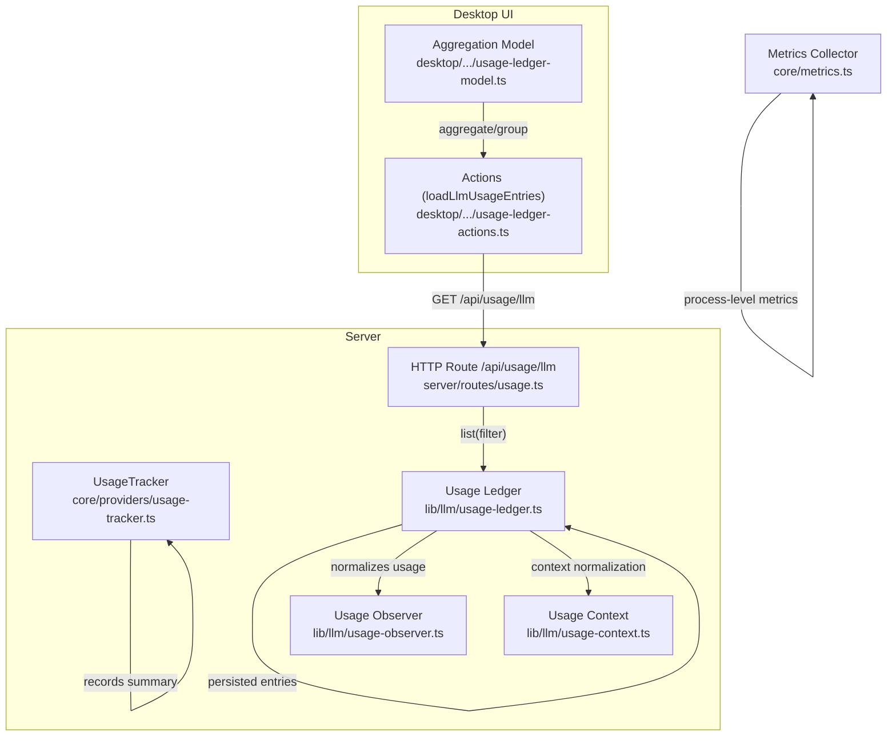
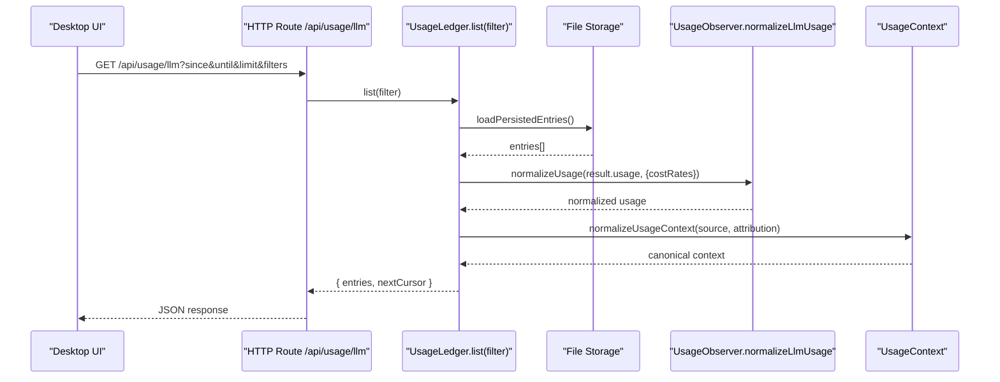
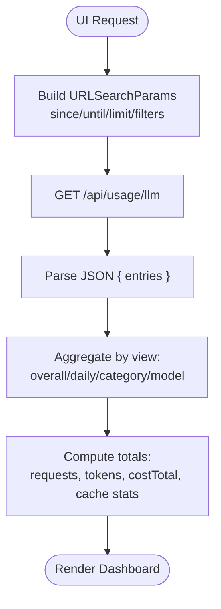
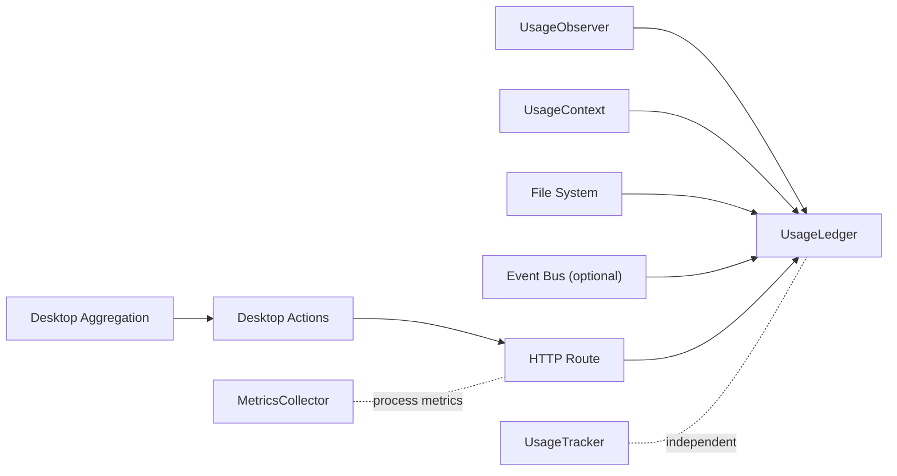

# Usage Tracking & Analytics

<cite>
**Referenced Files in This Document**
- [usage-tracker.ts](file://core/providers/usage-tracker.ts)
- [usage-ledger.ts](file://lib/llm/usage-ledger.ts)
- [usage-context.ts](file://lib/llm/usage-context.ts)
- [usage-observer.ts](file://lib/llm/usage-observer.ts)
- [usage.ts](file://server/routes/usage.ts)
- [usage-ledger-actions.ts](file://desktop/src/react/settings/tabs/providers/usage-ledger-actions.ts)
- [usage-ledger-model.ts](file://desktop/src/react/settings/tabs/providers/usage-ledger-model.ts)
- [metrics.ts](file://core/metrics.ts)
- [usage-tracker.test.ts](file://tests/core/usage-tracker.test.ts)
</cite>

## Table of Contents
1. Introduction
2. Project Structure
3. Core Components
4. Architecture Overview
5. Detailed Component Analysis
6. Dependency Analysis
7. Performance Considerations
8. Troubleshooting Guide
9. Conclusion
10. Appendices

## Introduction
This document explains the usage tracking and analytics capabilities for LLM provider interactions. It covers:
- The UsageRecord and UsageSummary structures used by the lightweight server-side tracker
- The ledger-based system that normalizes, persists, and exposes detailed usage entries
- Token counting mechanisms and cost calculation algorithms
- Integration points for monitoring provider usage, generating reports, and building billing systems
- Practical examples for custom metrics, threshold-based alerts, and cost optimization strategies
- Data retention policies and privacy considerations
- Performance impact and asynchronous processing approaches

## Project Structure
The usage tracking system spans multiple layers:
- Server-side lightweight tracker for quick summaries and totals
- Ledger subsystem for normalized, persisted, and queryable usage entries
- Normalization utilities for provider-specific usage payloads
- HTTP route to expose usage entries to clients
- Desktop UI actions and aggregation model for visualization

**Diagram sources**
- [usage-tracker.ts:1-130](file://core/providers/usage-tracker.ts#L1-L130)
- [usage-ledger.ts:1-302](file://lib/llm/usage-ledger.ts#L1-L302)
- [usage-context.ts:1-56](file://lib/llm/usage-context.ts#L1-L56)
- [usage-observer.ts:1-201](file://lib/llm/usage-observer.ts#L1-L201)
- [usage.ts:1-40](file://server/routes/usage.ts#L1-L40)
- [usage-ledger-actions.ts:1-110](file://desktop/src/react/settings/tabs/providers/usage-ledger-actions.ts#L1-L110)
- [usage-ledger-model.ts:1-228](file://desktop/src/react/settings/tabs/providers/usage-ledger-model.ts#L1-L228)
- [metrics.ts:1-78](file://core/metrics.ts#L1-L78)

**Section sources**
- [usage-tracker.ts:1-130](file://core/providers/usage-tracker.ts#L1-L130)
- [usage-ledger.ts:1-302](file://lib/llm/usage-ledger.ts#L1-L302)
- [usage-context.ts:1-56](file://lib/llm/usage-context.ts#L1-L56)
- [usage-observer.ts:1-201](file://lib/llm/usage-observer.ts#L1-L201)
- [usage.ts:1-40](file://server/routes/usage.ts#L1-L40)
- [usage-ledger-actions.ts:1-110](file://desktop/src/react/settings/tabs/providers/usage-ledger-actions.ts#L1-L110)
- [usage-ledger-model.ts:1-228](file://desktop/src/react/settings/tabs/providers/usage-ledger-model.ts#L1-L228)
- [metrics.ts:1-78](file://core/metrics.ts#L1-L78)

## Core Components
- UsageRecord and UsageSummary: Lightweight server-side structures for per-request token counts and latency, plus aggregated summaries over time windows.
- UsageLedger: In-memory + file-backed ledger that normalizes provider usage, persists entries, emits events, and supports filtering/listing.
- UsageObserver: Provider-agnostic normalization of usage payloads into a canonical shape with token breakdowns and optional cost computation.
- UsageContext: Canonical source/attribution context for each request.
- MetricsCollector: Process-level metrics (uptime, memory, request counts, chat/tool call counters).

Key responsibilities:
- Record and aggregate usage at different granularities
- Normalize heterogeneous provider responses
- Persist and serve usage data via API
- Provide UI-friendly aggregations and groupings

**Section sources**
- [usage-tracker.ts:1-130](file://core/providers/usage-tracker.ts#L1-L130)
- [usage-ledger.ts:1-302](file://lib/llm/usage-ledger.ts#L1-L302)
- [usage-observer.ts:1-201](file://lib/llm/usage-observer.ts#L1-L201)
- [usage-context.ts:1-56](file://lib/llm/usage-context.ts#L1-L56)
- [metrics.ts:1-78](file://core/metrics.ts#L1-L78)

## Architecture Overview
The system has two complementary paths:
- Lightweight tracker path: records compact UsageRecord rows and computes UsageSummary aggregates from a local database.
- Ledger path: captures full normalized usage entries, persists them, and exposes them through an HTTP endpoint consumed by the desktop UI.

**Diagram sources**
- [usage.ts:1-40](file://server/routes/usage.ts#L1-L40)
- [usage-ledger.ts:1-302](file://lib/llm/usage-ledger.ts#L1-L302)
- [usage-observer.ts:1-201](file://lib/llm/usage-observer.ts#L1-L201)
- [usage-context.ts:1-56](file://lib/llm/usage-context.ts#L1-L56)

## Detailed Component Analysis

### UsageRecord and UsageSummary (Lightweight Tracker)
- UsageRecord fields include identifiers, provider/model, token counts, latency, timestamp, and session association.
- UsageSummary aggregates requests, tokens, and average latency grouped by provider and model within a period.
- Methods:
  - record(): inserts a row into a local table with indexes for efficient queries.
  - getSummary(period, providerId?): returns aggregated rows for the selected window.
  - getTotalUsage(providerId?): returns total tokens and request count across all or filtered entries.
  - cleanupOldLogs(maxAgeMs): deletes old rows based on timestamp cutoff.

Complexity and performance:
- record() is O(1) write with prepared statements; indexes support fast filtering and grouping.
- getSummary() uses SQL GROUP BY and ORDER BY; complexity depends on number of rows within the period.
- cleanupOldLogs() performs a single DELETE with index scan on timestamp.

Error handling:
- Queries are wrapped in try/catch returning safe defaults when errors occur.

Retention policy:
- cleanupOldLogs() supports configurable retention (default 90 days).

**Section sources**
- [usage-tracker.ts:1-130](file://core/providers/usage-tracker.ts#L1-L130)
- [usage-tracker.test.ts:1-139](file://tests/core/usage-tracker.test.ts#L1-L139)

### UsageLedger (Normalized, Persisted Entries)
Responsibilities:
- start(), finish(), recordError(), record(): lifecycle methods to create, complete, or error out a request entry.
- list(filter): filters entries by date range, status, attribution, subsystem, operation, model/provider, and applies limit.
- clear(): resets in-memory entries and persists empty state.
- Persistence: loads/saves entries to a JSON file with atomic writes; enforces max entries cap.
- Events: emits llm_usage events on an optional event bus without blocking request flow.

Normalization:
- Uses normalizeUsage() which delegates to normalizeLlmUsage() for provider-agnostic token breakdowns and optional costTotal.
- Uses normalizeUsageContext() to ensure consistent source and attribution metadata.

Filtering:
- Supports since/until boundaries, status, attribution kind/session/agent IDs, subsystem/operation, modelId/provider.

Data model highlights:
- Each entry includes requestId, timestamps, durationMs, status, source, attribution, model, usage, rawUsageShape, and error.

**Section sources**
- [usage-ledger.ts:1-302](file://lib/llm/usage-ledger.ts#L1-L302)
- [usage-context.ts:1-56](file://lib/llm/usage-context.ts#L1-L56)

### UsageObserver (Token Counting and Cost Calculation)
Token counting:
- Accepts various provider shapes and maps to canonical input/output/cache tokens.
- Computes uncachedTokens and hitRatio when cache reporting is supported.
- Derives totalTokens using explicit values or fallback sums.

Cost calculation:
- If usage contains explicit costTotal, it is used directly.
- Otherwise, costTotal is computed from costRates and normalized token counts:
  - input = rate_input * uncached_or_total_input_tokens / 1e6
  - output = rate_output * output_tokens / 1e6
  - cache_read = rate_cacheRead * cache_read_tokens / 1e6
  - cache_write = rate_cacheWrite * cache_write_tokens / 1e6
  - total = sum of above components

Provider coverage:
- Handles Pi SDK, Anthropic, and OpenAI-compatible usage shapes.

**Section sources**
- [usage-observer.ts:1-201](file://lib/llm/usage-observer.ts#L1-L201)

### HTTP Route and Desktop Integration
- Server route /api/usage/llm accepts query parameters (since, until, attributionKind, sessionPath, agentId, subsystem, operation, modelId, provider, status) and a limit (capped).
- Desktop actions build URLSearchParams and fetch entries from the route.
- Desktop model aggregates entries into UsageAggregate groups (overall, daily, category, model) and computes totals including costTotal and cache metrics.

**Diagram sources**
- [usage.ts:1-40](file://server/routes/usage.ts#L1-L40)
- [usage-ledger-actions.ts:1-110](file://desktop/src/react/settings/tabs/providers/usage-ledger-actions.ts#L1-L110)
- [usage-ledger-model.ts:1-228](file://desktop/src/react/settings/tabs/providers/usage-ledger-model.ts#L1-L228)

**Section sources**
- [usage.ts:1-40](file://server/routes/usage.ts#L1-L40)
- [usage-ledger-actions.ts:1-110](file://desktop/src/react/settings/tabs/providers/usage-ledger-actions.ts#L1-L110)
- [usage-ledger-model.ts:1-228](file://desktop/src/react/settings/tabs/providers/usage-ledger-model.ts#L1-L228)

### MetricsCollector (Process-Level Observability)
- Tracks uptime, memory usage, request counts (total/success/error), chat counts, tool calls, and average response time.
- Useful for correlating system health with usage spikes.

**Section sources**
- [metrics.ts:1-78](file://core/metrics.ts#L1-L78)

## Dependency Analysis
- UsageLedger depends on:
  - UsageObserver for normalization and cost calculation
  - UsageContext for canonical source/attribution
  - Filesystem for persistence
  - Optional event bus for async emission
- HTTP route depends on UsageLedger.list(filter)
- Desktop UI depends on HTTP route and aggregation model
- Lightweight UsageTracker is independent and backed by a local DB

**Diagram sources**
- [usage-ledger.ts:1-302](file://lib/llm/usage-ledger.ts#L1-L302)
- [usage-observer.ts:1-201](file://lib/llm/usage-observer.ts#L1-L201)
- [usage-context.ts:1-56](file://lib/llm/usage-context.ts#L1-L56)
- [usage.ts:1-40](file://server/routes/usage.ts#L1-L40)
- [usage-ledger-actions.ts:1-110](file://desktop/src/react/settings/tabs/providers/usage-ledger-actions.ts#L1-L110)
- [usage-ledger-model.ts:1-228](file://desktop/src/react/settings/tabs/providers/usage-ledger-model.ts#L1-L228)
- [usage-tracker.ts:1-130](file://core/providers/usage-tracker.ts#L1-L130)
- [metrics.ts:1-78](file://core/metrics.ts#L1-L78)

**Section sources**
- [usage-ledger.ts:1-302](file://lib/llm/usage-ledger.ts#L1-L302)
- [usage.ts:1-40](file://server/routes/usage.ts#L1-L40)
- [usage-ledger-actions.ts:1-110](file://desktop/src/react/settings/tabs/providers/usage-ledger-actions.ts#L1-L110)
- [usage-ledger-model.ts:1-228](file://desktop/src/react/settings/tabs/providers/usage-ledger-model.ts#L1-L228)
- [usage-tracker.ts:1-130](file://core/providers/usage-tracker.ts#L1-L130)
- [metrics.ts:1-78](file://core/metrics.ts#L1-L78)

## Performance Considerations
- Ledger persistence:
  - Atomic writes reduce corruption risk but add I/O overhead per append.
  - Max entries cap prevents unbounded growth; oldest entries are dropped automatically.
- Query performance:
  - Filtering is done in-memory after loading persisted entries; consider limiting results via limit and date windows.
- Lightweight tracker:
  - Indexed SQLite-like operations provide efficient aggregation; suitable for high-frequency summaries.
- Asynchronous processing:
  - Ledger emits events asynchronously and never blocks request flows; logging and persistence failures are caught and logged safely.

[No sources needed since this section provides general guidance]

## Troubleshooting Guide
Common issues and mitigations:
- Missing usage payload:
  - Entries may be marked with status usage_missing if no usage object is provided. Investigate provider integration to ensure usage is returned.
- Unknown context:
  - When source/attribution is missing, context is normalized to unknown; enrich context at call sites to improve filtering and attribution.
- Cost not calculated:
  - Ensure costRates are supplied when providers do not return explicit costTotal; otherwise costTotal remains null.
- Large datasets:
  - Use since/until and limit filters to constrain results; default limits protect against large payloads.
- Persistence errors:
  - Ledger logs warnings on read/write failures; verify storage path permissions and disk space.

**Section sources**
- [usage-ledger.ts:1-302](file://lib/llm/usage-ledger.ts#L1-L302)
- [usage-observer.ts:1-201](file://lib/llm/usage-observer.ts#L1-L201)
- [usage-context.ts:1-56](file://lib/llm/usage-context.ts#L1-L56)

## Conclusion
The system offers two complementary usage tracking paths:
- A lightweight tracker for fast summaries and totals
- A comprehensive ledger for normalized, persisted, and filterable usage entries with cost calculations

Together they enable robust monitoring, reporting, and billing integrations while maintaining performance and resilience.

[No sources needed since this section summarizes without analyzing specific files]

## Appendices

### Practical Examples

- Custom usage metrics:
  - Track reasoningTokens and cache hit ratio from normalized usage to identify models benefiting from caching.
  - Correlate avgLatencyMs from UsageSummary with cache hit rates to evaluate performance gains.

- Threshold-based alerts:
  - Monitor costTotal per provider/model and trigger alerts when exceeding configured thresholds.
  - Alert on usage_missing status spikes to detect integration regressions.

- Cost optimization strategies:
  - Prefer models with higher cache hit ratios and lower uncachedTokens.
  - Adjust costRates to reflect negotiated pricing and compare actual vs expected costs.

- Billing integration:
  - Export filtered entries via /api/usage/llm for downstream billing pipelines.
  - Use attribution fields (agentId, sessionPath, conversationId) to allocate costs accurately.

- Data retention and privacy:
  - Configure cleanupOldLogs(maxAgeMs) to enforce retention policies.
  - Avoid persisting sensitive content; only store normalized usage and minimal attribution metadata.

- Asynchronous processing:
  - Leverage event emissions for real-time dashboards without impacting request latency.
  - Batch export jobs can consume events off the critical path.

[No sources needed since this section provides general guidance]