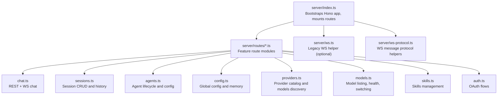
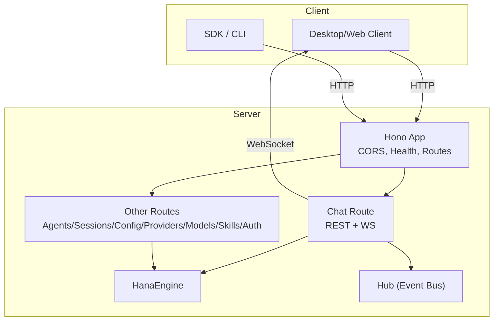
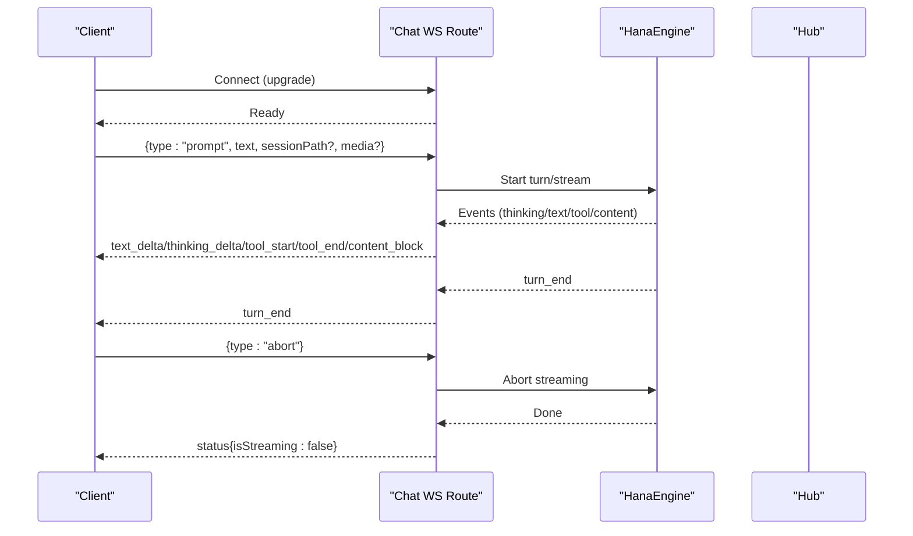
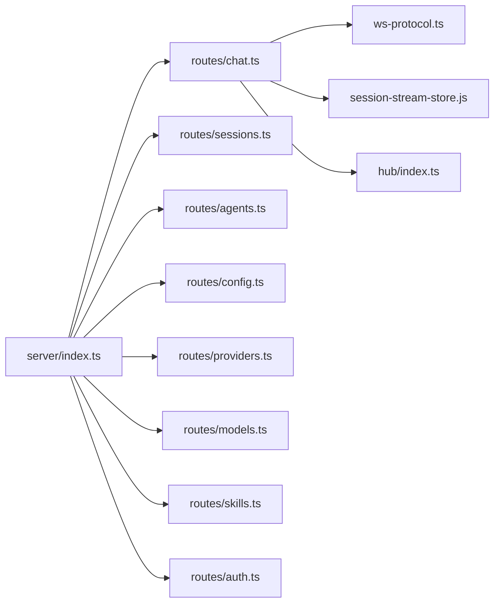

# API Reference

<cite>
**Referenced Files in This Document**
- [server/index.ts](file://server/index.ts)
- [server/ws.ts](file://server/ws.ts)
- [server/ws-protocol.ts](file://server/ws-protocol.ts)
- [server/routes/auth.ts](file://server/routes/auth.ts)
- [server/routes/chat.ts](file://server/routes/chat.ts)
- [server/routes/sessions.ts](file://server/routes/sessions.ts)
- [server/routes/agents.ts](file://server/routes/agents.ts)
- [server/routes/config.ts](file://server/routes/config.ts)
- [server/routes/providers.ts](file://server/routes/providers.ts)
- [server/routes/models.ts](file://server/routes/models.ts)
- [server/routes/skills.ts](file://server/routes/skills.ts)
</cite>

## Table of Contents
1. Introduction
2. Project Structure
3. Core Components
4. Architecture Overview
5. Detailed Component Analysis
6. Dependency Analysis
7. Performance Considerations
8. Troubleshooting Guide
9. Conclusion
10. Appendices

## Introduction
This document provides a comprehensive API reference for OpenShadow’s server surface, covering:
- RESTful endpoints (HTTP methods, URL patterns, request/response schemas, authentication and authorization)
- WebSocket protocol (connection handling, message formats, event types, real-time interaction patterns)
- Security considerations, error handling strategies, rate limiting notes
- Versioning, compatibility, migration guidance
- Client implementation guidelines, SDK usage examples, performance optimization tips
- Debugging tools and monitoring approaches

OpenShadow exposes 37+ business routes mounted under /api, plus a WebSocket chat interface. Authentication is primarily local loopback token-based with optional OAuth flows for provider credentials. Authorization uses capability scopes enforced at route boundaries.

## Project Structure
The HTTP server is bootstrapped by the main entrypoint, which initializes the engine, mounts all routes, and enables WebSocket support. The primary route modules are organized by feature area under server/routes.

**Diagram sources**
- [server/index.ts:162-228](file://server/index.ts#L162-L228)
- [server/routes/chat.ts:200-210](file://server/routes/chat.ts#L200-L210)
- [server/routes/sessions.ts:236-240](file://server/routes/sessions.ts#L236-L240)
- [server/routes/agents.ts:188-190](file://server/routes/agents.ts#L188-L190)
- [server/routes/config.ts:189-191](file://server/routes/config.ts#L189-L191)
- [server/routes/providers.ts:44-46](file://server/routes/providers.ts#L44-L46)
- [server/routes/models.ts:184-186](file://server/routes/models.ts#L184-L186)
- [server/routes/skills.ts:65-67](file://server/routes/skills.ts#L65-L67)
- [server/routes/auth.ts:39-41](file://server/routes/auth.ts#L39-L41)

**Section sources**
- [server/index.ts:1-320](file://server/index.ts#L1-L320)

## Core Components
- Server bootstrap and routing: Initializes Hono, mounts 37+ routes under /api, injects WebSocket upgrade, writes runtime info file, and exposes health/shutdown endpoints.
- Chat route module: Provides both REST and WebSocket chat interfaces; manages streaming events, session state, browser status, notifications, and content blocks.
- Sessions route module: Session list/search, pinning, authorized folders, messages pagination, summaries, and lifecycle cleanup.
- Agents route module: Agent CRUD, avatar management, per-agent config, identity/ishiki/pinned/experience files, and related app events.
- Config route module: Global configuration read/write, workspace history, system prompt, user profile, pinned memory, memory store operations, search key verification.
- Providers route module: Provider summary, model discovery, test connectivity, update/delete model metadata, cache discovered models.
- Models route module: List available models, auxiliary vision status, health check via utility call, set pending model, switch model within a session.
- Skills route module: Skill bundles, enable/disable skills per agent, install/remove/reload skills, external paths, translation.
- Auth route module: OAuth start/callback/poll/status/logout and custom model management for OAuth providers.
- WebSocket protocol helpers: Message construction, serialization, parsing, and stream resume utilities.

**Section sources**
- [server/index.ts:67-228](file://server/index.ts#L67-L228)
- [server/routes/chat.ts:200-210](file://server/routes/chat.ts#L200-L210)
- [server/routes/sessions.ts:236-240](file://server/routes/sessions.ts#L236-L240)
- [server/routes/agents.ts:188-190](file://server/routes/agents.ts#L188-L190)
- [server/routes/config.ts:189-191](file://server/routes/config.ts#L189-L191)
- [server/routes/providers.ts:44-46](file://server/routes/providers.ts#L44-L46)
- [server/routes/models.ts:184-186](file://server/routes/models.ts#L184-L186)
- [server/routes/skills.ts:65-67](file://server/routes/skills.ts#L65-L67)
- [server/routes/auth.ts:39-41](file://server/routes/auth.ts#L39-L41)
- [server/ws-protocol.ts:1-36](file://server/ws-protocol.ts#L1-L36)

## Architecture Overview
High-level architecture showing how clients interact with REST and WebSocket surfaces, and how routes delegate to the engine and hub.

**Diagram sources**
- [server/index.ts:67-228](file://server/index.ts#L67-L228)
- [server/routes/chat.ts:200-210](file://server/routes/chat.ts#L200-L210)

## Detailed Component Analysis

### Authentication and Authorization
- Local loopback token: The server writes a token to a local file for local client discovery. Requests can be authenticated via this token when applicable.
- Capability scopes: Many routes enforce scopes such as settings.write, providers.manage, secrets.write, sessions.read, sessions.write. Unauthorized requests return 403 with reason details.
- OAuth flows: Start, callback, poll, status, logout endpoints manage provider credentials. Custom models per OAuth provider are supported.

Key endpoints:
- GET /health, GET /api/health — Health checks
- POST /api/shutdown — Graceful shutdown
- POST /api/auth/oauth/start — Start OAuth flow
- POST /api/auth/oauth/callback — Submit code for auth code flow
- GET /api/auth/oauth/poll/:sessionId — Poll device code flow
- GET /api/auth/oauth/status — Query OAuth login status
- POST /api/auth/oauth/logout — Logout provider
- GET /api/auth/oauth/:provider/custom-models — List custom models
- POST /api/auth/oauth/:provider/custom-models — Add custom model
- DELETE /api/auth/oauth/:provider/custom-models/:modelId — Remove custom model

Request/response highlights:
- OAuth start returns sessionId, url, optional instructions (device code), and polling flag for callback-server flows.
- Callback returns ok on success; poll returns status pending/done/error.
- Status returns per-provider loggedIn and modelCount.

Security considerations:
- Secrets mutation requires explicit scope and secret field authorization.
- Provider credential updates may require providers.manage and secrets.write.

**Section sources**
- [server/index.ts:77-84](file://server/index.ts#L77-L84)
- [server/index.ts:294-304](file://server/index.ts#L294-L304)
- [server/routes/auth.ts:60-142](file://server/routes/auth.ts#L60-L142)
- [server/routes/auth.ts:148-202](file://server/routes/auth.ts#L148-L202)
- [server/routes/auth.ts:208-238](file://server/routes/auth.ts#L208-L238)
- [server/routes/auth.ts:243-276](file://server/routes/auth.ts#L243-L276)

### Chat API (REST + WebSocket)
REST endpoints:
- The chat route exports both restRoute and wsRoute; REST endpoints are mounted under /api.

WebSocket connection:
- Upgrade path provided by createNodeWebSocket; chat WS is mounted at /api and also at root / for Electron compatibility.

Message protocol (client → server):
- prompt: text, optional sessionPath, images/videos/audios/skills arrays, uiContext object or null
- abort: cancel current turn
- resume_stream: sessionPath, streamId, sinceSeq to continue from a sequence number

Message protocol (server → client):
- text_delta, mood_start/mood_text/mood_end, thinking_start/thinking_delta/thinking_end
- tool_start/tool_end, turn_end, error, status
- session_title, jian_update, devlog, activity_update
- content_block (unified block type for various results)
- session_user_message, confirmation_resolved, block_update
- browser_status, bridge_status
- stream_resume (replay with seq, reset/truncated flags, isStreaming/runtimeIsStreaming)

Real-time features:
- Streaming deltas and structured events
- Browser thumbnail polling while active
- Deferred result interlude and completion notifications
- Compaction lifecycle events
- Desktop notification delivery based on preferences

Error handling:
- Stream errors broadcast as error events
- Turn stall abort after configurable idle time
- Disconnect grace period to abort all streaming if no clients

**Section sources**
- [server/index.ts:172-176](file://server/index.ts#L172-L176)
- [server/routes/chat.ts:200-210](file://server/routes/chat.ts#L200-L210)
- [server/ws-protocol.ts:1-36](file://server/ws-protocol.ts#L1-L36)
- [server/routes/chat.ts:389-449](file://server/routes/chat.ts#L389-L449)
- [server/routes/chat.ts:460-488](file://server/routes/chat.ts#L460-L488)
- [server/routes/chat.ts:532-590](file://server/routes/chat.ts#L532-L590)

#### WebSocket Sequence Diagram

**Diagram sources**
- [server/routes/chat.ts:200-210](file://server/routes/chat.ts#L200-L210)
- [server/ws-protocol.ts:72-122](file://server/ws-protocol.ts#L72-L122)

### Sessions API
Endpoints:
- GET /api/sessions — List sessions with metadata and attachment info
- GET /api/sessions/search?q=&phase=title|content&limit=N — Search sessions
- GET /api/sessions/summary?path=... — Get rolling summary record
- POST /api/sessions/pin — Pin/unpin session
- GET /api/sessions/authorized-folders?path=... — Read authorized folder scope
- PATCH /api/sessions/authorized-folders — Add/remove/set authorized folders
- GET /api/sessions/messages?path=...&before=&limit= — Paginated messages with revision

Authorization:
- Requires sessions.read or sessions.write depending on operation
- Studio scope validation ensures same-studio access

Response fields include path, title, firstMessage, modified, revision, messageCount, cwd, agentId, agentName, projectId, modelId, modelProvider, workspaceMountId, workspaceLabel, permissionMode, pinnedAt, agentDeleted, readOnlyReason, continuationAvailable, deletedAt, hasSummary, rcAttachment.

**Section sources**
- [server/routes/sessions.ts:508-574](file://server/routes/sessions.ts#L508-L574)
- [server/routes/sessions.ts:576-637](file://server/routes/sessions.ts#L576-L637)
- [server/routes/sessions.ts:640-662](file://server/routes/sessions.ts#L640-L662)
- [server/routes/sessions.ts:665-693](file://server/routes/sessions.ts#L665-L693)
- [server/routes/sessions.ts:695-773](file://server/routes/sessions.ts#L695-L773)
- [server/routes/sessions.ts:776-800](file://server/routes/sessions.ts#L776-L800)

### Agents API
Endpoints:
- GET /api/agents — List agents (fresh query param supported)
- POST /api/agents — Create agent
- POST /api/agents/switch — Switch active agent
- DELETE /api/agents/:id — Delete agent
- PUT /api/agents/primary — Set primary agent
- PUT /api/agents/order — Persist order
- GET /api/agents/:id/avatar — Get avatar image
- POST /api/agents/:id/avatar — Upload avatar (base64 data URL)
- DELETE /api/agents/:id/avatar — Remove avatar
- GET /api/agents/:id/config — Read agent config (providers, tools, experience)
- PUT /api/agents/:id/config — Update agent config (global fields, providers, inline credentials)
- GET /api/agents/:id/identity — Read identity.md
- PUT /api/agents/:id/identity — Write identity.md
- GET /api/agents/:id/ishiki — Read ishiki.md
- PUT /api/agents/:id/ishiki — Write ishiki.md
- GET /api/agents/:id/public-ishiki — Read public-ishiki.md
- PUT /api/agents/:id/public-ishiki — Write public-ishiki.md
- GET /api/agents/:id/pinned — Read pinned items
- PUT /api/agents/:id/pinned — Replace pinned items
- GET /api/agents/:id/experience — Read merged experience docs
- PUT /api/agents/:id/experience — Write experience docs

Notes:
- Provider mutations require providers.manage scope; secret mutations require secrets.write scope.
- Tools.disabled whitelist restricts disabling core tools.
- Inline provider credential patches are supported for api/embedding_api/utility_api blocks.

**Section sources**
- [server/routes/agents.ts:195-327](file://server/routes/agents.ts#L195-L327)
- [server/routes/agents.ts:333-392](file://server/routes/agents.ts#L333-L392)
- [server/routes/agents.ts:398-614](file://server/routes/agents.ts#L398-L614)
- [server/routes/agents.ts:620-729](file://server/routes/agents.ts#L620-L729)
- [server/routes/agents.ts:735-766](file://server/routes/agents.ts#L735-L766)
- [server/routes/agents.ts:772-800](file://server/routes/agents.ts#L772-L800)

### Configuration API
Endpoints:
- GET /api/config — Read global config (providers, _raw, security)
- PUT /api/config — Update global config (global fields, providers, inline credentials)
- POST /api/config/workspaces/recent — Add recent workspace
- DELETE /api/config/workspaces/recent — Remove recent workspace
- DELETE /api/config/workspaces/recent/all — Clear recent workspaces
- GET /api/config/default-workspace — Get default workspace path
- POST /api/config/default-workspace — Ensure default workspace
- GET /api/system-prompt — Read effective system prompt (read-only)
- GET /api/ishiki — Read personality file
- PUT /api/ishiki — Write personality file
- GET /api/identity — Read identity file
- PUT /api/identity — Write identity file
- GET /api/user-profile — Read user profile
- PUT /api/user-profile — Write user profile
- GET /api/pinned — Read pinned memory
- PUT /api/pinned — Replace pinned memory
- GET /api/memories/health — Memory subsystem health
- GET /api/memories — Export all facts
- GET /api/memories/compiled — Read compiled memory.md
- DELETE /api/memories/compiled — Clear compiled artifacts
- DELETE /api/memories — Clear all memories
- GET /api/memories/export — Export v2 JSON
- POST /api/memories/import — Import v1/v2 entries
- POST /api/search/verify — Verify search provider key

Scopes:
- settings.write required for most write endpoints
- providers.manage required for provider changes
- secrets.write required for secret mutations

**Section sources**
- [server/routes/config.ts:193-405](file://server/routes/config.ts#L193-L405)
- [server/routes/config.ts:411-521](file://server/routes/config.ts#L411-L521)
- [server/routes/config.ts:526-555](file://server/routes/config.ts#L526-L555)
- [server/routes/config.ts:583-709](file://server/routes/config.ts#L583-L709)
- [server/routes/config.ts:713-742](file://server/routes/config.ts#L713-L742)

### Providers API
Endpoints:
- GET /api/providers/summary — Unified provider overview (catalog + OAuth + SDK models)
- GET /api/providers/:name/api-key — Read plaintext API key (requires providers.manage + secrets.write)
- POST /api/providers/fetch-models — Discover models (remote → registry → defaults fallback)
- GET /api/providers/:name/discovered-models — Read cached discovered models
- POST /api/providers/test — Test provider connectivity
- PUT /api/providers/:name/models/:modelId — Update model metadata
- DELETE /api/providers/:name/models/:modelId — Remove model entry

Behavior:
- Model discovery supports anthropic-messages and generic OpenAI-like APIs
- Registry fallback includes built-in OAuth models and known-models
- Cache persisted atomically per provider

**Section sources**
- [server/routes/providers.ts:63-208](file://server/routes/providers.ts#L63-L208)
- [server/routes/providers.ts:214-225](file://server/routes/providers.ts#L214-L225)
- [server/routes/providers.ts:356-443](file://server/routes/providers.ts#L356-L443)
- [server/routes/providers.ts:449-459](file://server/routes/providers.ts#L449-L459)
- [server/routes/providers.ts:466-508](file://server/routes/providers.ts#L466-L508)
- [server/routes/providers.ts:514-549](file://server/routes/providers.ts#L514-L549)

### Models API
Endpoints:
- GET /api/models — List available models with capabilities and overrides
- GET /api/models/auxiliary-vision — Auxiliary vision availability
- POST /api/models/health — Health check via utility call (explicit model ref required)
- POST /api/models/set — Set pending model for next session
- POST /api/models/switch — Switch model within a session

Responses include id, name, provider, input modalities, video/audio transports, reasoning, thinking levels, contextWindow, maxTokens, xhigh, toolUse contract.

**Section sources**
- [server/routes/models.ts:188-202](file://server/routes/models.ts#L188-L202)
- [server/routes/models.ts:205-211](file://server/routes/models.ts#L205-L211)
- [server/routes/models.ts:215-264](file://server/routes/models.ts#L215-L264)
- [server/routes/models.ts:267-315](file://server/routes/models.ts#L267-L315)

### Skills API
Endpoints:
- GET /api/skills/bundles — List skill bundles with enabled view
- POST /api/skills/bundles — Create bundle
- PUT /api/skills/bundles/order — Reorder bundles
- PUT /api/skills/bundles/:id — Update bundle
- DELETE /api/skills/bundles/:id — Delete bundle
- POST /api/skills/bundles/:id/export — Export bundle package
- GET /api/skills?agentId=... — List skills (runtime or static)
- PUT /api/agents/:id/skills — Set enabled skills
- PATCH /api/agents/:id/skills/:name — Toggle single skill
- PATCH /api/agents/:id/skill-bundles/:bundleId — Toggle bundle
- POST /api/skills/install — Install skill (path or uploaded archive)
- DELETE /api/skills/:name — Delete user skill
- POST /api/skills/reload — Reload skills
- GET /api/skills/external-paths — List external skill paths
- PUT /api/skills/external-paths — Set external skill paths
- POST /api/skills/translate — Translate skill names

Concurrency:
- Installation and deletion are serialized to avoid reload races

**Section sources**
- [server/routes/skills.ts:200-279](file://server/routes/skills.ts#L200-L279)
- [server/routes/skills.ts:281-348](file://server/routes/skills.ts#L281-L348)
- [server/routes/skills.ts:350-369](file://server/routes/skills.ts#L350-L369)
- [server/routes/skills.ts:372-452](file://server/routes/skills.ts#L372-L452)
- [server/routes/skills.ts:455-484](file://server/routes/skills.ts#L455-L484)
- [server/routes/skills.ts:487-552](file://server/routes/skills.ts#L487-L552)
- [server/routes/skills.ts:555-588](file://server/routes/skills.ts#L555-L588)

### Legacy WebSocket Helper
A standalone WebSocket server helper exists for simple session and chat messaging. It is not the primary production path but demonstrates basic message types and responses.

Message types:
- Client: chat, session:create, session:switch, session:list
- Server: response, error, typing, delta, done, session, sessions

**Section sources**
- [server/ws.ts:6-22](file://server/ws.ts#L6-L22)
- [server/ws.ts:24-118](file://server/ws.ts#L24-L118)
- [server/ws.ts:120-176](file://server/ws.ts#L120-L176)

## Dependency Analysis
The server composes multiple route modules that depend on the engine and hub. Chat route additionally depends on WebSocket protocol helpers and session stream store.

**Diagram sources**
- [server/index.ts:162-228](file://server/index.ts#L162-L228)
- [server/routes/chat.ts:200-210](file://server/routes/chat.ts#L200-L210)
- [server/ws-protocol.ts:1-36](file://server/ws-protocol.ts#L1-L36)

**Section sources**
- [server/index.ts:162-228](file://server/index.ts#L162-L228)

## Performance Considerations
- WebSocket broadcasting serializes once per message and only sends to eligible clients using subscription checks.
- Session state map caps at a fixed size; non-streaming sessions are evicted by last-accessed timestamp.
- Browser thumbnail polling runs every 30 seconds only while any browser session is active.
- Turn stall watchdog prevents long-running stalls by aborting streams after a configurable timeout.
- Disconnect grace period allows background abort of streaming when no clients remain connected.

[No sources needed since this section provides general guidance]

## Troubleshooting Guide
Common issues and diagnostics:
- OAuth failures: diagnose network timeouts and callback server behavior; poll endpoint clarifies pending vs error states.
- Provider model discovery: use fetch-models and discovered-models endpoints; registry and defaults fallbacks help when remote calls fail.
- Model health: POST /api/models/health validates credentials and provider compatibility; some APIs skip health checks.
- Session permissions: ensure correct scope and studio alignment; mismatched studio returns 403 with reason.
- WebSocket errors: listen for error events and handle turn stalls; verify sessionPath presence and stream resume parameters.

**Section sources**
- [server/routes/auth.ts:22-37](file://server/routes/auth.ts#L22-L37)
- [server/routes/providers.ts:356-443](file://server/routes/providers.ts#L356-L443)
- [server/routes/models.ts:215-264](file://server/routes/models.ts#L215-L264)
- [server/routes/sessions.ts:516-525](file://server/routes/sessions.ts#L516-L525)
- [server/routes/chat.ts:460-488](file://server/routes/chat.ts#L460-L488)

## Conclusion
OpenShadow’s API surface offers a robust set of REST endpoints and a rich WebSocket protocol for real-time interactions. Security is enforced through capability scopes and secret mutation controls. The design emphasizes streaming, resiliency, and clear error signaling. Clients should implement proper reconnection, stream resume, and scope-aware requests.

[No sources needed since this section summarizes without analyzing specific files]

## Appendices

### Authentication Methods and Scopes
- Local loopback token: Used for local client discovery and trusted connections.
- OAuth flows: Start/callback/poll/status/logout for provider credentials.
- Scopes:
  - settings.write: Global and agent config updates
  - providers.manage: Provider and model metadata operations
  - secrets.write: Secret mutations and reading plaintext keys
  - sessions.read/sessions.write: Session listing and modifications

**Section sources**
- [server/routes/config.ts:295-405](file://server/routes/config.ts#L295-L405)
- [server/routes/providers.ts:356-443](file://server/routes/providers.ts#L356-L443)
- [server/routes/sessions.ts:508-574](file://server/routes/sessions.ts#L508-L574)

### Error Handling Strategies
- Consistent JSON error responses with error/message/code fields
- HTTP status codes aligned with semantics (400, 403, 404, 409, 422, 500)
- WebSocket error events for streaming failures
- Diagnostic messages for OAuth and provider connectivity

**Section sources**
- [server/routes/auth.ts:148-202](file://server/routes/auth.ts#L148-L202)
- [server/routes/providers.ts:466-508](file://server/routes/providers.ts#L466-L508)
- [server/routes/models.ts:215-264](file://server/routes/models.ts#L215-L264)
- [server/routes/chat.ts:460-488](file://server/routes/chat.ts#L460-L488)

### Rate Limiting
- No explicit rate limiting middleware is present in the analyzed routes. Implement client-side retries with backoff and respect server hints.

[No sources needed since this section provides general guidance]

### API Versioning and Compatibility
- Server version exposed in health and server-info.json
- Backward compatibility maintained via schema-driven global fields and provider header patch resolution
- Migration guidance: Use latest endpoints; prefer explicit agentId where required; rely on revision fields for session synchronization

**Section sources**
- [server/index.ts:77-84](file://server/index.ts#L77-L84)
- [server/index.ts:284-292](file://server/index.ts#L284-L292)
- [server/routes/sessions.ts:535-570](file://server/routes/sessions.ts#L535-L570)

### Client Implementation Guidelines
- Prefer REST for configuration and management tasks; use WebSocket for live chat and streaming
- Handle stream resume with sinceSeq and reset/truncated flags
- Respect capability scopes and handle 403 responses gracefully
- Implement retry with exponential backoff for transient errors

[No sources needed since this section provides general guidance]

### SDK Usage Examples
- Use the provided SDK functions for provider model discovery and health checks
- For chat, integrate with the WebSocket protocol helpers for safe send/parse and stream resume

**Section sources**
- [server/routes/providers.ts:356-443](file://server/routes/providers.ts#L356-L443)
- [server/routes/models.ts:215-264](file://server/routes/models.ts#L215-L264)
- [server/ws-protocol.ts:38-64](file://server/ws-protocol.ts#L38-L64)

### Debugging Tools and Monitoring
- Devlog events over WebSocket for detailed logs
- Activity updates for subagent/workflow/cron actions
- Browser status events for automation debugging
- Health endpoints for readiness checks

**Section sources**
- [server/routes/chat.ts:760-780](file://server/routes/chat.ts#L760-L780)
- [server/routes/chat.ts:593-614](file://server/routes/chat.ts#L593-L614)
- [server/index.ts:77-84](file://server/index.ts#L77-L84)