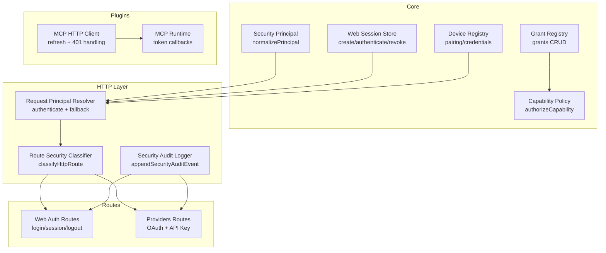
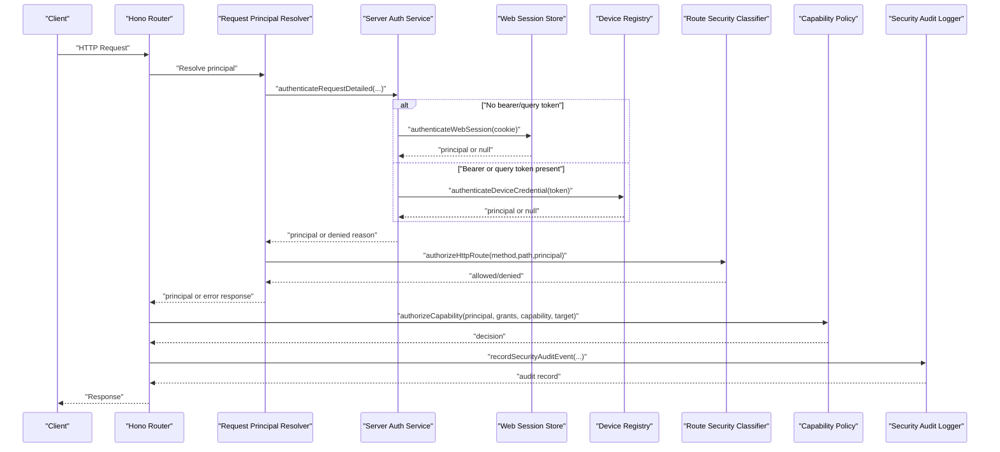
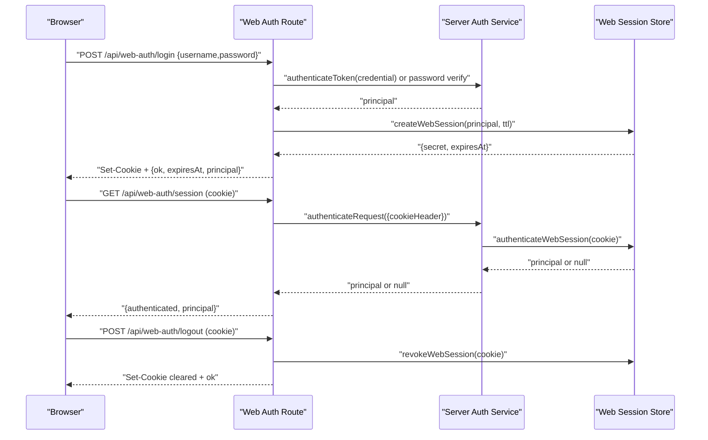
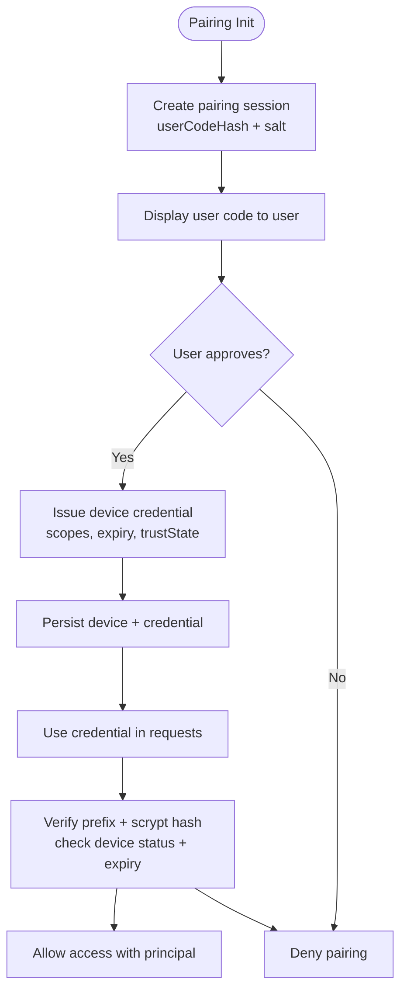
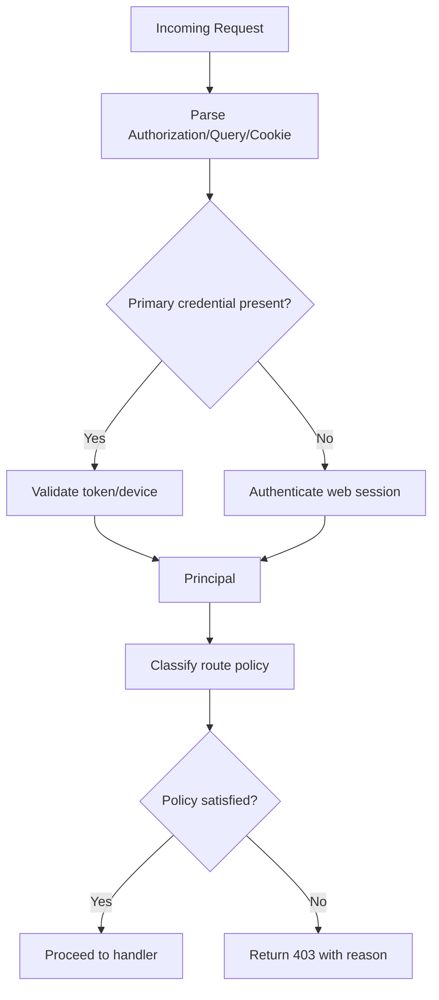
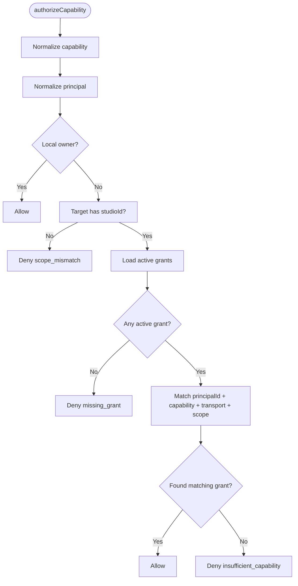
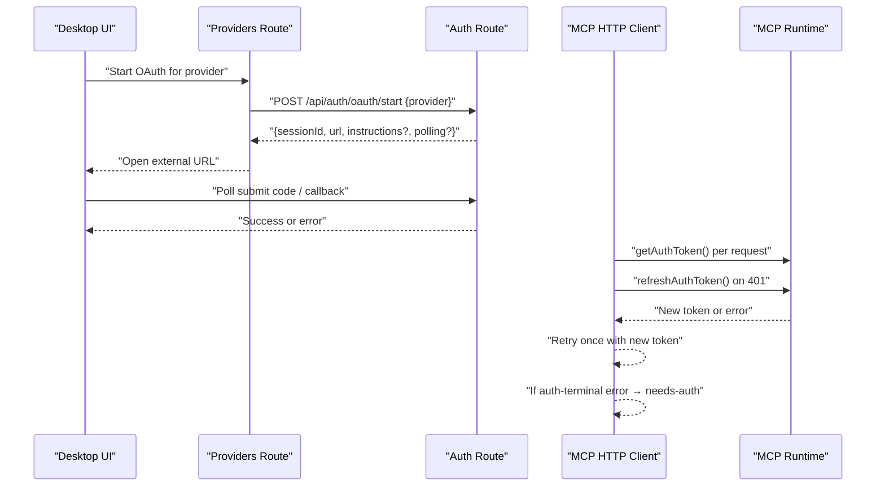
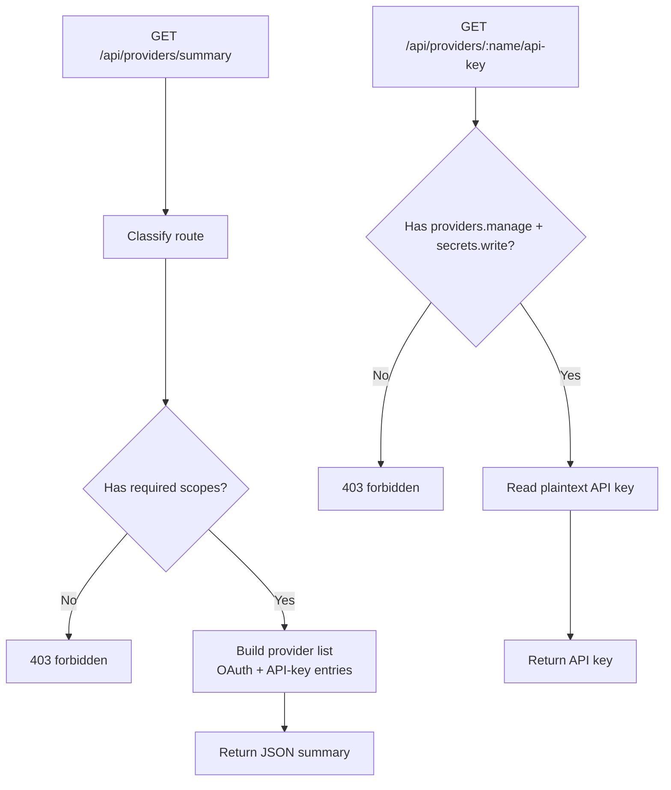
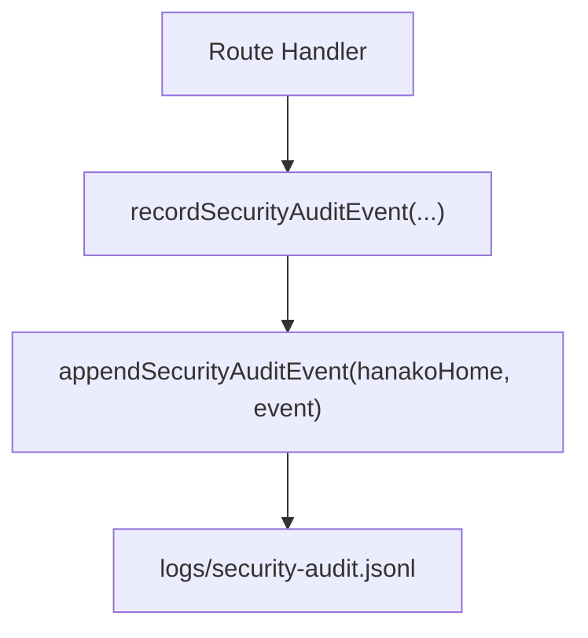
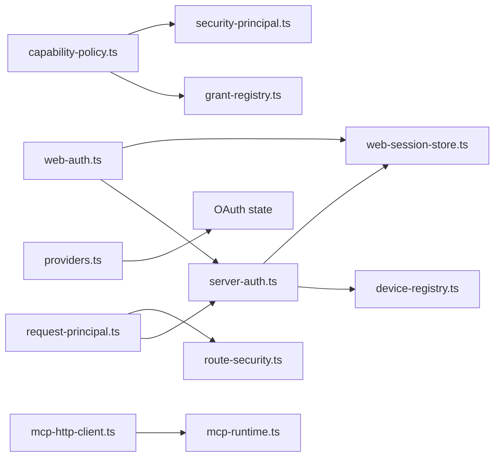

# Authentication & Authorization

<cite>
**Referenced Files in This Document**
- [server-auth.ts](file://core/server-auth.ts)
- [web-session-store.ts](file://core/web-session-store.ts)
- [device-registry.ts](file://core/device-registry.ts)
- [security-principal.ts](file://core/security-principal.ts)
- [route-security.ts](file://server/http/route-security.ts)
- [request-principal.ts](file://server/http/request-principal.ts)
- [web-auth.ts](file://server/routes/web-auth.ts)
- [providers.ts](file://server/routes/providers.ts)
- [capability-policy.ts](file://core/capability-policy.ts)
- [grant-registry.ts](file://core/grant-registry.ts)
- [security-audit-log.ts](file://core/security-audit-log.ts)
- [security-audit.ts](file://server/http/security-audit.ts)
- [mcp-http-client.ts](file://plugins/mcp/lib/mcp-http-client.ts)
- [mcp-runtime.ts](file://plugins/mcp/lib/mcp-runtime.ts)
</cite>

## Table of Contents
1. Introduction
2. Project Structure
3. Core Components
4. Architecture Overview
5. Detailed Component Analysis
6. Dependency Analysis
7. Performance Considerations
8. Troubleshooting Guide
9. Conclusion

## Introduction
This document describes OpenShadow’s authentication and authorization framework with a focus on:
- Web session-based authentication (cookie-backed sessions)
- Device credential-based authentication (paired devices)
- Local loopback token for trusted local processes
- Scope-based route authorization and capability-based policy evaluation
- OAuth2 integration for external providers, including refresh handling and auth-terminal error detection
- API key management for provider credentials
- Audit logging for security events

The goal is to provide both high-level understanding and code-mapped details so that implementers can build secure clients, handle token expiration, and extend the system with custom authentication flows.

## Project Structure
OpenShadow separates concerns across core services, HTTP middleware, routes, and plugins:
- Core services implement principal normalization, web sessions, device credentials, grants, and capability policies.
- HTTP layer provides request principal resolution and route classification/authorization.
- Routes expose login/session/logout endpoints and provider configuration endpoints.
- Plugins integrate OAuth2 flows and manage token lifecycles.

**Diagram sources**
- [security-principal.ts](file://core/security-principal.ts)
- [web-session-store.ts](file://core/web-session-store.ts)
- [device-registry.ts](file://core/device-registry.ts)
- [grant-registry.ts](file://core/grant-registry.ts)
- [capability-policy.ts](file://core/capability-policy.ts)
- [request-principal.ts](file://server/http/request-principal.ts)
- [route-security.ts](file://server/http/route-security.ts)
- [web-auth.ts](file://server/routes/web-auth.ts)
- [providers.ts](file://server/routes/providers.ts)
- [security-audit-log.ts](file://core/security-audit-log.ts)
- [mcp-http-client.ts](file://plugins/mcp/lib/mcp-http-client.ts)
- [mcp-runtime.ts](file://plugins/mcp/lib/mcp-runtime.ts)

**Section sources**
- [server-auth.ts](file://core/server-auth.ts)
- [web-session-store.ts](file://core/web-session-store.ts)
- [device-registry.ts](file://core/device-registry.ts)
- [security-principal.ts](file://core/security-principal.ts)
- [route-security.ts](file://server/http/route-security.ts)
- [request-principal.ts](file://server/http/request-principal.ts)
- [web-auth.ts](file://server/routes/web-auth.ts)
- [providers.ts](file://server/routes/providers.ts)
- [capability-policy.ts](file://core/capability-policy.ts)
- [grant-registry.ts](file://core/grant-registry.ts)
- [security-audit-log.ts](file://core/security-audit-log.ts)
- [mcp-http-client.ts](file://plugins/mcp/lib/mcp-http-client.ts)
- [mcp-runtime.ts](file://plugins/mcp/lib/mcp-runtime.ts)

## Core Components
- Security Principal: Normalizes and validates principals, derives stable IDs, and supports scope checks.
- Server Auth Service: Parses credentials (Bearer, query token), authenticates via web sessions or device credentials, and enforces connection kind constraints.
- Web Session Store: Creates, authenticates, and revokes cookie-based sessions; persists hashed secrets safely.
- Device Registry: Manages paired devices, issues credentials, and supports pairing flows with user codes.
- Grant Registry: Stores scoped grants with capabilities and constraints; used by capability policy evaluation.
- Capability Policy: Evaluates whether a principal has sufficient capability for a target under active grants and transport constraints.
- Route Security: Classifies HTTP routes into public/local-only/authenticated/scoped/plugin-route and enforces principal requirements.
- Request Principal Resolver: Orchestrates primary authentication and plugin surface fallback, then delegates to route authorization.
- Security Audit Logger: Appends structured audit events with masked secrets and decision summaries.

**Section sources**
- [security-principal.ts](file://core/security-principal.ts)
- [server-auth.ts](file://core/server-auth.ts)
- [web-session-store.ts](file://core/web-session-store.ts)
- [device-registry.ts](file://core/device-registry.ts)
- [grant-registry.ts](file://core/grant-registry.ts)
- [capability-policy.ts](file://core/capability-policy.ts)
- [route-security.ts](file://server/http/route-security.ts)
- [request-principal.ts](file://server/http/request-principal.ts)
- [security-audit-log.ts](file://core/security-audit-log.ts)

## Architecture Overview
End-to-end flow from client request to authorization decision:

**Diagram sources**
- [request-principal.ts](file://server/http/request-principal.ts)
- [server-auth.ts](file://core/server-auth.ts)
- [web-session-store.ts](file://core/web-session-store.ts)
- [device-registry.ts](file://core/device-registry.ts)
- [route-security.ts](file://server/http/route-security.ts)
- [capability-policy.ts](file://core/capability-policy.ts)
- [security-audit.ts](file://server/http/security-audit.ts)

## Detailed Component Analysis

### Web Session Authentication Flow
- Login endpoint accepts either a token (via authService.authenticateToken) or username/password. On success, it creates a web session and sets an HttpOnly, SameSite=Strict cookie.
- Session retrieval uses the cookie to authenticate and returns the principal if valid.
- Logout revokes the session and clears the cookie.

**Diagram sources**
- [web-auth.ts](file://server/routes/web-auth.ts)
- [server-auth.ts](file://core/server-auth.ts)
- [web-session-store.ts](file://core/web-session-store.ts)

**Section sources**
- [web-auth.ts](file://server/routes/web-auth.ts)
- [web-session-store.ts](file://core/web-session-store.ts)
- [server-auth.ts](file://core/server-auth.ts)

### Device Credential Authentication and Pairing
- Devices are paired via a pairing session with a short-lived user code. Approval issues a signed credential bound to a device and scopes.
- Authentication verifies the credential prefix and hash against persisted records and checks device status and expiry.

**Diagram sources**
- [device-registry.ts](file://core/device-registry.ts)

**Section sources**
- [device-registry.ts](file://core/device-registry.ts)

### Scope-Based Route Authorization
- Route classifier maps each path/method to a policy: public, local_only, authenticated, studio_owner, scoped(scope), or plugin_route(pluginId).
- The resolver first attempts primary authentication (bearer/query token), falls back to web session only when no primary credential is present, then applies route policy.

**Diagram sources**
- [request-principal.ts](file://server/http/request-principal.ts)
- [route-security.ts](file://server/http/route-security.ts)
- [server-auth.ts](file://core/server-auth.ts)

**Section sources**
- [request-principal.ts](file://server/http/request-principal.ts)
- [route-security.ts](file://server/http/route-security.ts)
- [server-auth.ts](file://core/server-auth.ts)

### Capability-Based Policy Evaluation
- Capability authorization requires an active grant matching the principal, capability namespace/prefix, transport constraints, and target scope (studioId and optional narrower fields).
- Local owner principals bypass grants and are allowed.

**Diagram sources**
- [capability-policy.ts](file://core/capability-policy.ts)
- [grant-registry.ts](file://core/grant-registry.ts)
- [security-principal.ts](file://core/security-principal.ts)

**Section sources**
- [capability-policy.ts](file://core/capability-policy.ts)
- [grant-registry.ts](file://core/grant-registry.ts)
- [security-principal.ts](file://core/security-principal.ts)

### OAuth2 Integration and Token Lifecycle
- Provider routes expose OAuth start and polling endpoints; UI initiates flows and opens external browser.
- MCP HTTP client detects auth-terminal errors (invalid_grant, invalid_client, unauthorized_client) and triggers re-auth flows; it also retries once after force-refresh on 401.
- Runtime supplies getAuthToken and refreshAuthToken callbacks keyed per connector id to ensure fresh tokens and safe retry semantics.

**Diagram sources**
- [providers.ts](file://server/routes/providers.ts)
- [auth.ts](file://server/routes/auth.ts)
- [mcp-http-client.ts](file://plugins/mcp/lib/mcp-http-client.ts)
- [mcp-runtime.ts](file://plugins/mcp/lib/mcp-runtime.ts)

**Section sources**
- [providers.ts](file://server/routes/providers.ts)
- [mcp-http-client.ts](file://plugins/mcp/lib/mcp-http-client.ts)
- [mcp-runtime.ts](file://plugins/mcp/lib/mcp-runtime.ts)

### API Key Management
- Provider summary endpoint lists configured providers, distinguishing OAuth vs API-key types and indicating missing fields.
- Narrow endpoint to read plaintext API keys is protected by scopes and secret write permissions.

**Diagram sources**
- [providers.ts](file://server/routes/providers.ts)

**Section sources**
- [providers.ts](file://server/routes/providers.ts)

### Audit Logging
- Security audit logger appends structured JSONL events with masked secrets and normalized actor/decision metadata.
- HTTP helper reads current principal from context and attaches to audit events.

**Diagram sources**
- [security-audit.ts](file://server/http/security-audit.ts)
- [security-audit-log.ts](file://core/security-audit-log.ts)

**Section sources**
- [security-audit.ts](file://server/http/security-audit.ts)
- [security-audit-log.ts](file://core/security-audit-log.ts)

## Dependency Analysis
- server-auth depends on device-registry and web-session-store for credential verification and session lookup.
- request-principal composes server-auth and route-security to enforce both authentication and authorization.
- capability-policy consumes grant-registry data and security-principal normalization.
- web-auth routes depend on server-auth and web-session-store.
- providers routes depend on provider registry and OAuth state.
- MCP components rely on runtime-provided token callbacks and detect auth-terminal errors to drive re-auth.

**Diagram sources**
- [server-auth.ts](file://core/server-auth.ts)
- [device-registry.ts](file://core/device-registry.ts)
- [web-session-store.ts](file://core/web-session-store.ts)
- [request-principal.ts](file://server/http/request-principal.ts)
- [route-security.ts](file://server/http/route-security.ts)
- [capability-policy.ts](file://core/capability-policy.ts)
- [grant-registry.ts](file://core/grant-registry.ts)
- [security-principal.ts](file://core/security-principal.ts)
- [web-auth.ts](file://server/routes/web-auth.ts)
- [providers.ts](file://server/routes/providers.ts)
- [mcp-http-client.ts](file://plugins/mcp/lib/mcp-http-client.ts)
- [mcp-runtime.ts](file://plugins/mcp/lib/mcp-runtime.ts)

**Section sources**
- [server-auth.ts](file://core/server-auth.ts)
- [device-registry.ts](file://core/device-registry.ts)
- [web-session-store.ts](file://core/web-session-store.ts)
- [request-principal.ts](file://server/http/request-principal.ts)
- [route-security.ts](file://server/http/route-security.ts)
- [capability-policy.ts](file://core/capability-policy.ts)
- [grant-registry.ts](file://core/grant-registry.ts)
- [security-principal.ts](file://core/security-principal.ts)
- [web-auth.ts](file://server/routes/web-auth.ts)
- [providers.ts](file://server/routes/providers.ts)
- [mcp-http-client.ts](file://plugins/mcp/lib/mcp-http-client.ts)
- [mcp-runtime.ts](file://plugins/mcp/lib/mcp-runtime.ts)

## Performance Considerations
- Prefer Bearer tokens over repeated cookie lookups where possible to reduce file I/O on session registries.
- Cache active grants per principal within request boundaries to avoid repeated scans.
- Use timing-safe comparisons for secret verification (already implemented) and keep salts random and unique.
- Avoid excessive polling in OAuth flows; respect server-side timeouts and use callback endpoints when available.

[No sources needed since this section provides general guidance]

## Troubleshooting Guide
Common issues and resolutions:
- 401/403 on resource requests: Indicates auth-terminal conditions for OAuth; trigger re-auth flow and do not blindly retry.
- Expired web sessions: Re-login to obtain a new session cookie; check expiresAt and TTL settings.
- Invalid device credentials: Ensure device is active and credential has not expired; revoke and re-pair if necessary.
- Missing scopes: Confirm route policy and principal scopes; adjust clientKind or requested scopes accordingly.
- Audit logs: Inspect logs/security-audit.jsonl for action, result, actor, and decision details.

**Section sources**
- [mcp-http-client.ts](file://plugins/mcp/lib/mcp-http-client.ts)
- [web-session-store.ts](file://core/web-session-store.ts)
- [device-registry.ts](file://core/device-registry.ts)
- [route-security.ts](file://server/http/route-security.ts)
- [security-audit-log.ts](file://core/security-audit-log.ts)

## Conclusion
OpenShadow’s security framework combines robust authentication (web sessions, device credentials, local loopback tokens) with fine-grained authorization (scope-based route policies and capability-based grants). OAuth2 integration includes resilient token lifecycle management and clear signals for re-authorization. Audit logging ensures traceability. By following the flows and best practices outlined here, developers can implement secure clients, handle token expiration gracefully, and extend the system with custom providers while maintaining strong security guarantees.