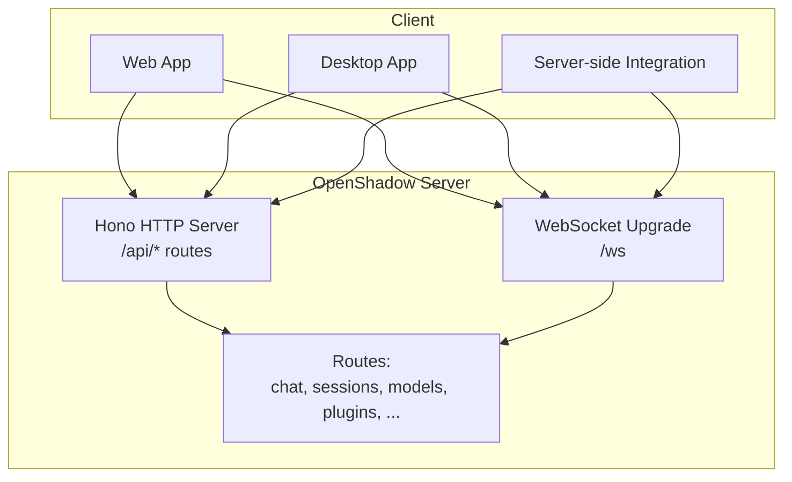
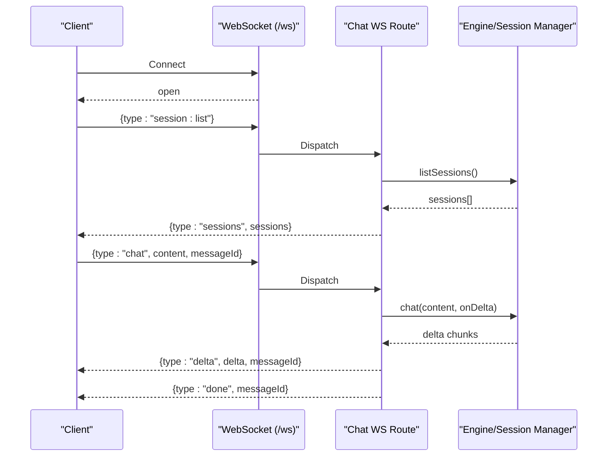
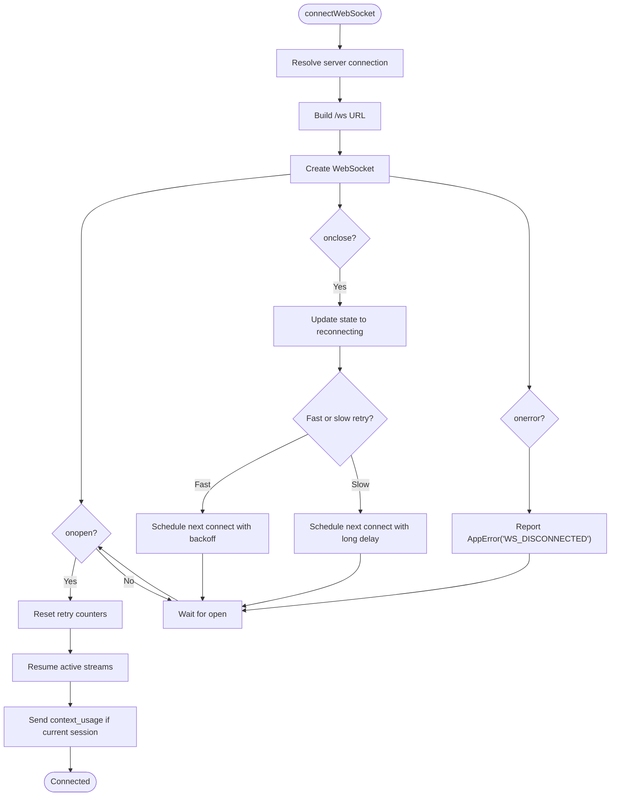
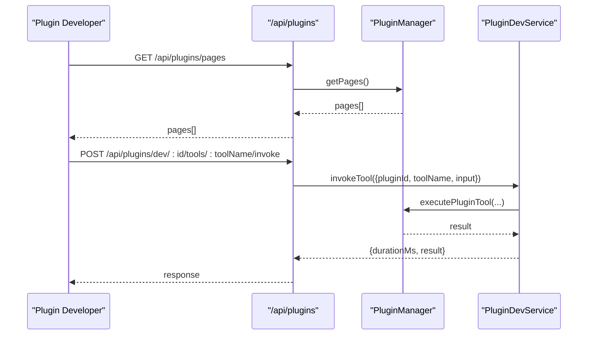
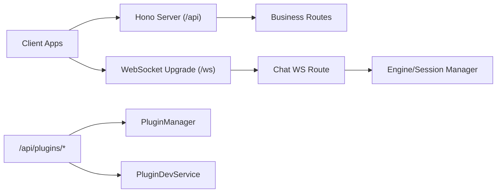

# Client Integration Guide

<cite>
**Referenced Files in This Document**
- [README.md](file://README.md)
- [server/index.ts](file://server/index.ts)
- [server/ws.ts](file://server/ws.ts)
- [server/ws-scope.ts](file://server/ws-scope.ts)
- [desktop/src/react/services/websocket.ts](file://desktop/src/react/services/websocket.ts)
- [shared/retry.ts](file://shared/retry.ts)
- [shared/errors.ts](file://shared/errors.ts)
- [server/routes/chat.ts](file://server/routes/chat.ts)
- [server/routes/plugins.ts](file://server/routes/plugins.ts)
- [core/plugin-dev-service.ts](file://core/plugin-dev-service.ts)
- [server/http/route-security.ts](file://server/http/route-security.ts)
</cite>

## Table of Contents
1. Introduction
2. Project Structure
3. Core Components
4. Architecture Overview
5. Detailed Component Analysis
6. Dependency Analysis
7. Performance Considerations
8. Troubleshooting Guide
9. Conclusion

## Introduction
This guide explains how to integrate with OpenShadow’s APIs from web clients, desktop applications, and server-side integrations. It covers SDK usage patterns, connection management, error handling strategies, retry mechanisms, plugin development (tools, routes, UI components), client-side caching, offline support, performance optimization, troubleshooting, debugging, and production monitoring.

OpenShadow exposes:
- A Hono-based HTTP API with 37 business routes
- WebSocket endpoints for real-time chat streaming and session control
- Plugin system with REST endpoints for management, dev tools, and UI surfaces

The repository also includes a simple legacy WebSocket example for quick integration prototyping.

[No sources needed since this section provides general guidance]

## Project Structure
High-level structure relevant to client integration:
- server/index.ts: Bootstraps the Hono app, mounts all routes, enables WebSocket upgrade, writes server-info.json
- server/ws.ts: Legacy WebSocket server and client helper for chat/session operations
- server/ws-scope.ts: Security scoping for WebSocket events and message permissions
- desktop/src/react/services/websocket.ts: Production-grade WS client with reconnection, resume, and status updates
- shared/retry.ts: Decorrelated jitter retry utility
- shared/errors.ts: Centralized error model and codes
- server/routes/chat.ts: Chat REST + WebSocket route factory
- server/routes/plugins.ts: Plugin management and dev tool endpoints
- core/plugin-dev-service.ts: Dev tool service for scenarios, surfaces, and tool invocation
- server/http/route-security.ts: Route-level security helpers for plugins

**Diagram sources**
- [server/index.ts:67-209](file://server/index.ts#L67-L209)
- [server/ws.ts:24-118](file://server/ws.ts#L24-L118)

**Section sources**
- [README.md:63-74](file://README.md#L63-L74)
- [server/index.ts:67-209](file://server/index.ts#L67-L209)

## Core Components
- HTTP API surface: All business logic is exposed under /api via Hono routes. The server initializes the engine, mounts routes, and serves static assets.
- WebSocket API: Real-time streaming for chat and session lifecycle. The modern implementation uses Hono’s node-ws upgrade; a legacy ws module is also present for compatibility.
- Client-side WS manager: Handles connection lifecycle, exponential backoff, fast/slow retry tiers, stream resume after reconnect, and context refresh.
- Retry and errors: Centralized AppError types and withRetry decorator using decorrelated jitter.
- Plugin system: Management, installation, configuration, pages/widgets discovery, and dev tools (scenarios, diagnostics, surface describe).

**Section sources**
- [server/index.ts:116-209](file://server/index.ts#L116-L209)
- [server/ws.ts:24-118](file://server/ws.ts#L24-L118)
- [desktop/src/react/services/websocket.ts:41-125](file://desktop/src/react/services/websocket.ts#L41-L125)
- [shared/retry.ts:19-38](file://shared/retry.ts#L19-L38)
- [shared/errors.ts:36-80](file://shared/errors.ts#L36-L80)
- [server/routes/plugins.ts:786-993](file://server/routes/plugins.ts#L786-L993)

## Architecture Overview
End-to-end flows for typical client interactions:

**Diagram sources**
- [server/ws.ts:32-103](file://server/ws.ts#L32-L103)
- [server/routes/chat.ts:200-218](file://server/routes/chat.ts#L200-L218)

## Detailed Component Analysis

### HTTP API Integration
- Base path: /api
- Health checks: GET /health, GET /api/health
- Authentication and identity: Provided by mounted routes (e.g., auth, providers, preferences)
- Session and chat: See chat route section below
- Models, skills, plugins, resources, uploads, etc.: Mounted under /api

Implementation notes:
- The server writes server-info.json with pid, port, host, token, version for local discovery.
- CORS middleware is enabled globally.

**Section sources**
- [server/index.ts:77-84](file://server/index.ts#L77-L84)
- [server/index.ts:270-292](file://server/index.ts#L270-L292)
- [server/index.ts:67-209](file://server/index.ts#L67-L209)

### WebSocket API Integration
Two implementations exist:
- Legacy ws module: Simple server/client for chat and session operations
- Modern Hono node-ws: Used by the main server for upgrade and routing

Key behaviors:
- Message types include chat, typing, delta, done, error, session, sessions
- Streaming deltas are sent per chunk
- Errors are returned as typed messages

Security:
- Permission scopes govern read/write access to chat-related events
- Subscriptions allow fine-grained event delivery

**Section sources**
- [server/ws.ts:6-22](file://server/ws.ts#L6-L22)
- [server/ws.ts:32-118](file://server/ws.ts#L32-L118)
- [server/ws-scope.ts:8-25](file://server/ws-scope.ts#L8-L25)
- [server/ws-scope.ts:80-88](file://server/ws-scope.ts#L80-L88)

### Client-Side WebSocket Manager (Desktop/Web)
Responsibilities:
- Resolve server URL and connect to /ws
- Exponential backoff with fast/slow retry tiers
- Stream resume after reconnect
- Context refresh on reconnect
- Error reporting via error bus

**Diagram sources**
- [desktop/src/react/services/websocket.ts:41-125](file://desktop/src/react/services/websocket.ts#L41-L125)

**Section sources**
- [desktop/src/react/services/websocket.ts:41-125](file://desktop/src/react/services/websocket.ts#L41-L125)

### Error Handling Strategy
- Use AppError for structured errors with code, severity, category, retryable flag, httpStatus, traceId
- Wrap raw errors with AppError.wrap to normalize
- Clients can inspect retryable and httpStatus to decide retry behavior

Best practices:
- For network calls, wrap with withRetry using shouldRetry when necessary
- Surface user-friendly messages via i18n keys defined in error definitions

**Section sources**
- [shared/errors.ts:36-80](file://shared/errors.ts#L36-L80)
- [shared/retry.ts:19-38](file://shared/retry.ts#L19-L38)

### Retry Mechanisms
- Decorrelated jitter: delay = min(maxDelayMs, random(baseDelayMs, previousDelay * 3))
- Abortable sleep supports cancellation via AbortSignal
- Default maxAttempts=3, baseDelayMs=1000, maxDelayMs=30000

Usage pattern:
- Wrap any async operation that may fail transiently
- Provide shouldRetry for custom policies based on AppError fields

**Section sources**
- [shared/retry.ts:19-38](file://shared/retry.ts#L19-L38)

### Chat API (REST + WebSocket)
- REST route factory returns both restRoute and wsRoute
- WS supports session:create, session:switch, session:list, chat with streaming
- Graceful disconnect abort and turn stall abort are configurable via environment variables

Integration tips:
- Prefer WS for streaming responses
- Use REST for non-streaming operations (e.g., listing sessions)

**Section sources**
- [server/routes/chat.ts:185-218](file://server/routes/chat.ts#L185-L218)
- [server/ws.ts:32-103](file://server/ws.ts#L32-L103)

### Plugin Development Kit
Plugin capabilities:
- Tools: Discoverable and invocable via dev tools
- Routes: Dynamic registration and mounting under /plugins/<pluginId>/<routePath>
- UI Surfaces: Pages and widgets with host capabilities

Management and dev endpoints:
- List plugins, install/uninstall, update config
- Dev tools: scenarios, diagnostics, surfaces, surface describe, tool invoke
- UI discovery: pages, widgets, theme assets

Security:
- Read-only plugin UI routes are allowed without full access
- Asset reads are permitted for GET/HEAD

**Diagram sources**
- [server/routes/plugins.ts:955-970](file://server/routes/plugins.ts#L955-L970)
- [core/plugin-dev-service.ts:627-643](file://core/plugin-dev-service.ts#L627-L643)

**Section sources**
- [server/routes/plugins.ts:786-993](file://server/routes/plugins.ts#L786-L993)
- [core/plugin-dev-service.ts:645-670](file://core/plugin-dev-service.ts#L645-L670)
- [server/http/route-security.ts:557-573](file://server/http/route-security.ts#L557-L573)

### Implementation Examples

#### Web Client (HTTP + WebSocket)
- Use fetch for /api endpoints
- Connect to ws://host/ws for streaming chat
- Implement reconnection with exponential backoff similar to the desktop client
- Handle typed messages: typing, delta, done, error, session, sessions

References:
- [server/ws.ts:6-22](file://server/ws.ts#L6-L22)
- [desktop/src/react/services/websocket.ts:41-125](file://desktop/src/react/services/websocket.ts#L41-L125)

#### Desktop Application (Electron)
- Use the provided websocket.ts module for connection lifecycle and reconnection
- Subscribe to store updates for wsState and reconnect attempts
- Resume streaming sessions after reconnect

References:
- [desktop/src/react/services/websocket.ts:41-125](file://desktop/src/react/services/websocket.ts#L41-L125)

#### Server-side Integration
- Call /api endpoints over HTTP
- Optionally use WebSocket for real-time features
- Respect permission scopes and authentication requirements

References:
- [server/index.ts:67-209](file://server/index.ts#L67-L209)

### Client-side Caching Strategies
- Cache model lists, provider catalogs, and plugin metadata locally to reduce latency
- Use ETags or conditional requests where supported by endpoints
- Persist last-known session state and reconcile on reconnect

[No sources needed since this section provides general guidance]

### Offline Support
- Queue chat messages locally and send when connected
- Reconcile queued messages upon reconnect using stream resume mechanism
- Show clear connectivity status and allow manual reconnect

References:
- [desktop/src/react/services/websocket.ts:101-125](file://desktop/src/react/services/websocket.ts#L101-L125)

### Performance Optimization Techniques
- Batch small UI updates and avoid redundant renders
- Debounce heavy operations (e.g., file indexing)
- Use streaming responses for long-running tasks
- Limit concurrent background tasks and respect turn stall abort settings

References:
- [server/routes/chat.ts:185-218](file://server/routes/chat.ts#L185-L218)

## Dependency Analysis
Relationships between key integration points:

**Diagram sources**
- [server/index.ts:67-209](file://server/index.ts#L67-L209)
- [server/routes/chat.ts:200-218](file://server/routes/chat.ts#L200-L218)
- [server/routes/plugins.ts:786-993](file://server/routes/plugins.ts#L786-L993)
- [core/plugin-dev-service.ts:645-670](file://core/plugin-dev-service.ts#L645-L670)

**Section sources**
- [server/index.ts:67-209](file://server/index.ts#L67-L209)
- [server/routes/plugins.ts:786-993](file://server/routes/plugins.ts#L786-L993)

## Performance Considerations
- Prefer streaming over polling for long-running operations
- Tune disconnect abort grace and turn stall abort via environment variables
- Avoid excessive reconnections; leverage fast/slow retry tiers
- Cache stable data (models, plugins) and invalidate on change events

[No sources needed since this section provides general guidance]

## Troubleshooting Guide
Common issues and resolutions:
- Connection failures: Check server-info.json for correct port/token; verify CORS and firewall rules
- Reconnect loops: Inspect wsState and wsReconnectAttempt; ensure backoff is applied
- Auth errors: Some connectors require re-auth; follow needs-auth flow
- Plugin dev tools not available: Ensure dev tools are enabled and routes are accessible

Debugging tools:
- WebSocket inspector: window.__openshadowWS__ is exposed in development
- Error bus: Reports structured errors with traceId for correlation
- Plugin diagnostics: GET /api/plugins/dev/diagnostics

Monitoring approaches:
- Log WS lifecycle events and error reports
- Track reconnect attempts and durations
- Monitor plugin dev tool invocations and durations

**Section sources**
- [desktop/src/react/services/websocket.ts:115-125](file://desktop/src/react/services/websocket.ts#L115-L125)
- [server/routes/plugins.ts:972-976](file://server/routes/plugins.ts#L972-L976)
- [shared/errors.ts:36-80](file://shared/errors.ts#L36-L80)

## Conclusion
OpenShadow provides a robust, extensible API surface for building rich client experiences. Use the HTTP API for standard operations and WebSocket for real-time streaming. Adopt the centralized error and retry utilities for resilience. Extend functionality through the plugin system with tools, routes, and UI surfaces. Apply caching, offline queuing, and performance tuning to deliver responsive applications across web, desktop, and server environments.

[No sources needed since this section summarizes without analyzing specific files]