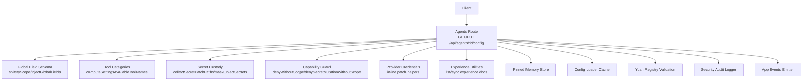
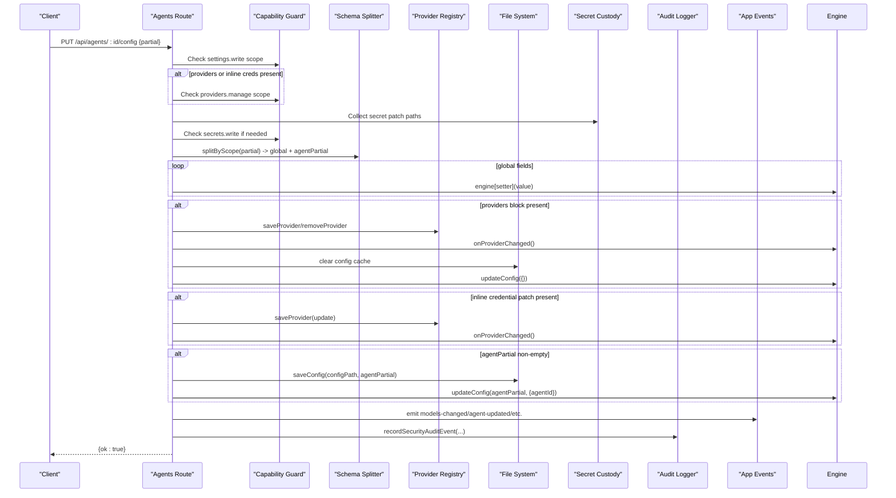
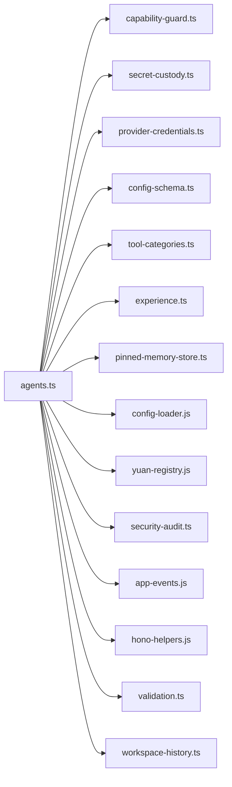

# Agent Configuration API

<cite>
**Referenced Files in This Document**
- [agents.ts](file://server/routes/agents.ts)
- [config-schema.ts](file://shared/config-schema.ts)
- [tool-categories.ts](file://shared/tool-categories.ts)
- [secret-custody.ts](file://shared/secret-custody.ts)
- [capability-guard.ts](file://server/http/capability-guard.ts)
- [provider-credentials.ts](file://server/routes/provider-credentials.ts)
- [experience.ts](file://lib/tools/experience.ts)
- [pinned-memory-store.ts](file://lib/memory/pinned-memory-store.ts)
- [config-loader.js](file://lib/memory/config-loader.js)
- [yuan-registry.js](file://core/yuan-registry.js)
- [workspace-history.ts](file://shared/workspace-history.ts)
- [security-audit.ts](file://server/http/security-audit.ts)
- [hono-helpers.js](file://server/hono-helpers.js)
- [validation.ts](file://server/utils/validation.ts)
- [app-events.js](file://server/app-events.js)
- [config.example.yaml](file://config.example.yaml)
- [rem-default config.yaml](file://agents/rem-default/config.yaml)
</cite>

## Table of Contents
1. Introduction
2. Project Structure
3. Core Components
4. Architecture Overview
5. Detailed Component Analysis
6. Dependency Analysis
7. Performance Considerations
8. Troubleshooting Guide
9. Conclusion

## Introduction
This document provides comprehensive API documentation for agent configuration management endpoints:
- GET /api/agents/:id/config
- PUT /api/agents/:id/config

It covers the config.yaml schema, provider settings, tool availability, memory configuration, global field injection, security scopes (settings.write, providers.manage), secret handling, provider credential updates, and experience configuration. It also includes examples of partial updates, provider management, tool toggling, and validation errors.

## Project Structure
The agent configuration endpoints are implemented in the server routes module and rely on shared utilities for schema-driven global fields, secret custody, tool categories, and security guards. The response surface is enriched with runtime information such as available tools and provider summaries.

**Diagram sources**
- [agents.ts](file://server/routes/agents.ts)
- [config-schema.ts](file://shared/config-schema.ts)
- [tool-categories.ts](file://shared/tool-categories.ts)
- [secret-custody.ts](file://shared/secret-custody.ts)
- [capability-guard.ts](file://server/http/capability-guard.ts)
- [provider-credentials.ts](file://server/routes/provider-credentials.ts)
- [experience.ts](file://lib/tools/experience.ts)
- [pinned-memory-store.ts](file://lib/memory/pinned-memory-store.ts)
- [config-loader.js](file://lib/memory/config-loader.js)
- [yuan-registry.js](file://core/yuan-registry.js)
- [security-audit.ts](file://server/http/security-audit.ts)
- [app-events.js](file://server/app-events.js)

**Section sources**
- [agents.ts](file://server/routes/agents.ts)

## Core Components
- GET /api/agents/:id/config
  - Reads an agent’s config.yaml directly (no global cache).
  - Normalizes experience.enabled to boolean.
  - Adds a _raw summary of api/embedding_api/utility_api provider hints.
  - Injects global fields from engine based on schema.
  - Enriches providers list with masked secrets and model counts.
  - Computes availableTools using runtime tool names and plugin tools.
  - Masks all secret values before returning.

- PUT /api/agents/:id/config
  - Validates request body and enforces scopes:
    - settings.write required for any update.
    - providers.manage required when mutating providers or inline credentials.
    - secrets.write required when mutating secret fields (e.g., api_key).
  - Applies schema-driven global field setters via splitByScope.
  - Handles providers block: save/remove providers; triggers runtime refresh.
  - Handles inline provider credential patches under api/embedding_api/utility_api blocks.
  - Validates tools.disabled whitelist (only optional tools).
  - Validates experience.enabled type.
  - Persists agent-specific changes to config.yaml and refreshes runtime state.
  - Emits app events and records security audit entries.

**Section sources**
- [agents.ts](file://server/routes/agents.ts)

## Architecture Overview
The endpoints orchestrate multiple subsystems to provide a secure, schema-driven configuration interface.

**Diagram sources**
- [agents.ts](file://server/routes/agents.ts)
- [capability-guard.ts](file://server/http/capability-guard.ts)
- [secret-custody.ts](file://shared/secret-custody.ts)
- [provider-credentials.ts](file://server/routes/provider-credentials.ts)
- [config-loader.js](file://lib/memory/config-loader.js)
- [security-audit.ts](file://server/http/security-audit.ts)
- [app-events.js](file://server/app-events.js)

## Detailed Component Analysis

### GET /api/agents/:id/config
- Path parameters
  - id: string (validated)
- Response fields
  - All fields from config.yaml plus:
    - _raw.api, _raw.embedding_api, _raw.utility_api: minimal provider hints (provider, base_url)
    - providers: map of provider name to entry with base_url, api, api_key (masked), models, model_count
    - availableTools: array of tool names computed from runtime and plugins
    - experience.enabled normalized to boolean
- Security
  - No explicit scope check in this route; returns masked secrets.
- Notes
  - Global fields injected automatically by schema.
  - If agent not found, returns 404.

Example response shape (abbreviated):
{
  agent: { name, yuan, avatar },
  memory: { enabled, disabledSince?, reenableAt? },
  desk: { heartbeat_enabled, heartbeat_interval, home_folder },
  user: { name },
  preferences: {},
  models: { chat: { id, provider } },
  experience: { enabled: boolean },
  tools: { disabled?: string[] },
  _raw: { api, embedding_api, utility_api },
  providers: { [name]: { base_url, api, api_key, models, model_count } },
  availableTools: string[]
}

**Section sources**
- [agents.ts](file://server/routes/agents.ts)
- [config-schema.ts](file://shared/config-schema.ts)
- [tool-categories.ts](file://shared/tool-categories.ts)
- [secret-custody.ts](file://shared/secret-custody.ts)

### PUT /api/agents/:id/config
- Path parameters
  - id: string (validated)
- Request body
  - Partial object conforming to config.yaml structure. Supports:
    - Global fields (schema-driven): e.g., locale, timezone, sandbox, keep_awake, editor, network_proxy, bridge.* automation.*, channels.enabled, etc.
    - Agent fields: agent.*, memory.*, desk.*, user.*, preferences.*, models.*, experience.*, tools.*
    - providers block: per-provider updates or removal (null)
    - Inline credential patches under api/embedding_api/utility_api blocks
- Security scopes
  - settings.write: required for any update
  - providers.manage: required if providers block or inline credential patches are present
  - secrets.write: required if any secret fields (e.g., api_key) are mutated
- Validation rules
  - tools.disabled must be an array and only contain optional tool names
  - experience.enabled must be boolean
  - Inline credential patch requires provider to be specified
- Behavior
  - Global fields applied via engine setters
  - Providers updated atomically; runtime refreshed
  - Inline credential patches resolved against existing provider data
  - Agent-specific changes persisted to config.yaml and runtime refreshed
  - App events emitted for model changes, workspace changes, memory master toggle, locale/editor/network proxy/keep awake, skills
  - Security audit event recorded

Example partial update payloads:
- Toggle memory master:
  { memory: { enabled: false } }
- Update agent identity:
  { agent: { name: "New Name", yuan: "hanako" } }
- Disable optional tools:
  { tools: { disabled: ["workflow", "dm"] } }
- Update provider entry:
  { providers: { "openai": { api_key: "sk-...", models: ["gpt-4o"] } } }
- Remove provider:
  { providers: { "openai": null } }
- Inline credential update:
  { utility_api: { provider: "openai", api_key: "sk-..." } }

Error responses:
- 400 invalid JSON body
- 400 tools.disabled contains non-optional tool names
- 400 experience.enabled not boolean
- 400 missing provider when saving inline credentials
- 403 insufficient_scope (settings.write/providers.manage/secrets.write)
- 404 agent not found

**Section sources**
- [agents.ts](file://server/routes/agents.ts)
- [capability-guard.ts](file://server/http/capability-guard.ts)
- [secret-custody.ts](file://shared/secret-custody.ts)
- [provider-credentials.ts](file://server/routes/provider-credentials.ts)
- [tool-categories.ts](file://shared/tool-categories.ts)
- [security-audit.ts](file://server/http/security-audit.ts)

### config.yaml Schema Reference
Top-level fields commonly used by agents:
- agent
  - name: string
  - yuan: string
  - avatar: any (often null)
- models
  - chat: { id: string, provider: string }
- memory
  - enabled: boolean
  - disabledSince?: string (ISO timestamp set when disabled)
  - reenableAt?: string (ISO timestamp set when re-enabled)
- desk
  - heartbeat_enabled: boolean
  - heartbeat_interval: number
  - home_folder: string
- user
  - name: string
- preferences: object
- experience
  - enabled: boolean
- tools
  - disabled?: string[] (optional tool names only)
- last_cwd: string
- cwd_history: string[]

Notes:
- Global fields (e.g., locale, timezone, sandbox, keep_awake, editor, network_proxy, bridge.*, automation.*, channels.enabled) are stored in preferences.json and injected into the response; they are not persisted in agent config.yaml.
- The response adds _raw.provider/base_url hints and providers map with masked secrets.

Examples:
- [config.example.yaml](file://config.example.yaml)
- [rem-default config.yaml](file://agents/rem-default/config.yaml)

**Section sources**
- [config.example.yaml](file://config.example.yaml)
- [rem-default config.yaml](file://agents/rem-default/config.yaml)
- [agents.ts](file://server/routes/agents.ts)

### Global Field Injection (Schema-driven)
- Source of truth: CONFIG_SCHEMA defines which fields are global and their setter/getter names.
- On GET, injectGlobalFields merges current engine state into the response.
- On PUT, splitByScope separates global vs agent fields; global setters are invoked immediately.

Common global fields include:
- locale, timezone, sandbox, sandbox_network, hardware_acceleration, file_backup, update_channel, auto_check_updates, keep_awake, thinking_level, editor
- capabilities.learn_skills
- desk.heartbeat_master
- channels.enabled
- bridge.permissionMode, bridge.readOnly, bridge.receiptEnabled, bridge.richStreamingEnabled
- automation.permissionMode
- network_proxy

**Section sources**
- [config-schema.ts](file://shared/config-schema.ts)
- [agents.ts](file://server/routes/agents.ts)

### Tool Availability and Toggling
- availableTools is computed from:
  - Runtime tool names for the agent
  - Plugin-registered optional tools
  - Built-in optional tool whitelist
- Only optional tools can be disabled via tools.disabled.
- Frontend uses the same optional tool names to render toggles.

Optional tool names include:
- automation, beautify, browser, dm, install_skill, office, update_settings, workflow

Behavior:
- GET returns availableTools filtered by runtime context (e.g., computer use setting).
- PUT validates tools.disabled against the optional whitelist.

**Section sources**
- [tool-categories.ts](file://shared/tool-categories.ts)
- [agents.ts](file://server/routes/agents.ts)

### Secret Handling and Credential Updates
- Secret keys include api_key across provider blocks.
- GET masks secret values in providers and top-level objects.
- PUT:
  - Detects secret mutations via collectSecretPatchPaths.
  - Requires secrets.write scope when secrets are mutated.
  - Resolves inline patches so masked values preserve existing secrets.
- Inline credential patches:
  - Supported under api/embedding_api/utility_api blocks.
  - Requires provider to be specified; resolves target provider and applies update.

**Section sources**
- [secret-custody.ts](file://shared/secret-custody.ts)
- [agents.ts](file://server/routes/agents.ts)
- [provider-credentials.ts](file://server/routes/provider-credentials.ts)

### Experience Configuration
- experience.enabled controls whether experience features are active.
- GET normalizes experience.enabled to boolean.
- PUT validates type and persists change.
- Separate endpoints manage experience content:
  - GET /api/agents/:id/experience: reads merged experience documents
  - PUT /api/agents/:id/experience: writes categorized experience markdown

**Section sources**
- [agents.ts](file://server/routes/agents.ts)
- [experience.ts](file://lib/tools/experience.ts)

### Security Scopes and Audit
- settings.write: required for any config update.
- providers.manage: required for providers block or inline credential patches.
- secrets.write: required when mutating secret fields.
- Security audit events recorded for config updates including target and secret fields touched.

**Section sources**
- [capability-guard.ts](file://server/http/capability-guard.ts)
- [agents.ts](file://server/routes/agents.ts)
- [security-audit.ts](file://server/http/security-audit.ts)

## Dependency Analysis
Key dependencies for the configuration endpoints:
- Hono routing and helpers for JSON parsing and error formatting
- YAML parser for reading/writing config.yaml
- Provider registry for managing provider entries and runtime refresh
- Secret custody utilities for masking and patch resolution
- Capability guard for scope enforcement
- Schema splitter/injector for global fields
- Tool categories for available tools computation
- Experience utilities for merging/splitting experience content
- Pinned memory store for related agent resources
- App events emitter for cross-module notifications
- Security audit logger for compliance tracking

**Diagram sources**
- [agents.ts](file://server/routes/agents.ts)
- [capability-guard.ts](file://server/http/capability-guard.ts)
- [secret-custody.ts](file://shared/secret-custody.ts)
- [provider-credentials.ts](file://server/routes/provider-credentials.ts)
- [config-schema.ts](file://shared/config-schema.ts)
- [tool-categories.ts](file://shared/tool-categories.ts)
- [experience.ts](file://lib/tools/experience.ts)
- [pinned-memory-store.ts](file://lib/memory/pinned-memory-store.ts)
- [config-loader.js](file://lib/memory/config-loader.js)
- [yuan-registry.js](file://core/yuan-registry.js)
- [security-audit.ts](file://server/http/security-audit.ts)
- [app-events.js](file://server/app-events.js)
- [hono-helpers.js](file://server/hono-helpers.js)
- [validation.ts](file://server/utils/validation.ts)
- [workspace-history.ts](file://shared/workspace-history.ts)

**Section sources**
- [agents.ts](file://server/routes/agents.ts)

## Performance Considerations
- GET bypasses global config cache to ensure fresh per-agent YAML parsing.
- Provider enumeration and masking may add overhead; consider caching provider lists at higher layers if needed.
- Provider changes trigger runtime refresh and config cache clearing; batch provider updates where possible.
- Avoid frequent large payload updates; prefer partial updates targeting specific fields.

## Troubleshooting Guide
Common issues and resolutions:
- 404 agent not found
  - Ensure the agent ID exists and is valid.
- 400 invalid JSON body
  - Verify request body is valid JSON and conforms to expected structure.
- 400 tools.disabled contains invalid tool names
  - Only optional tools can be disabled; remove non-optional names.
- 400 experience.enabled must be a boolean
  - Provide a boolean value for experience.enabled.
- 400 provider required when saving inline credentials
  - Include provider in the inline credential patch block.
- 403 insufficient_scope
  - Add required scopes:
    - settings.write for general updates
    - providers.manage for providers block or inline credential patches
    - secrets.write for mutating secret fields like api_key
- 403 secret_write_scope_required
  - Grant secrets.write scope when updating api_key or other secret fields.

Operational checks:
- After provider updates, verify runtime refresh occurred and models-changed event was emitted.
- For memory master toggles, confirm memory-master-changed event and runtime state updates.
- For global fields, ensure corresponding engine setters were invoked and events emitted (locale, editor, network proxy, keep awake).

**Section sources**
- [agents.ts](file://server/routes/agents.ts)
- [capability-guard.ts](file://server/http/capability-guard.ts)
- [secret-custody.ts](file://shared/secret-custody.ts)

## Conclusion
The agent configuration API provides a robust, secure, and schema-driven interface for reading and updating agent configurations. It integrates provider management, tool availability, secret handling, and experience configuration while enforcing strict scope-based access control and emitting comprehensive application events for downstream consumers.