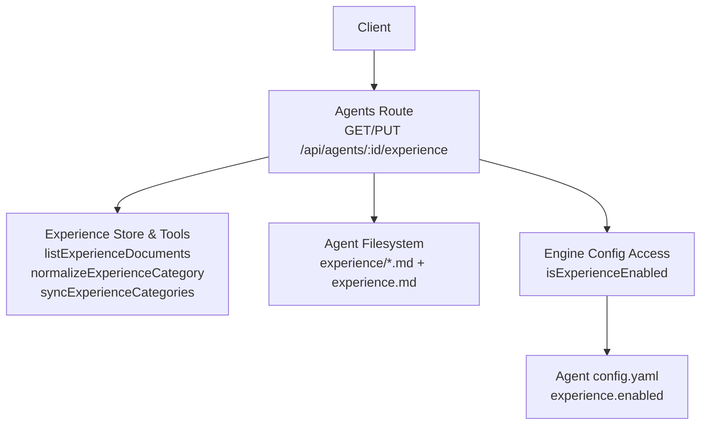
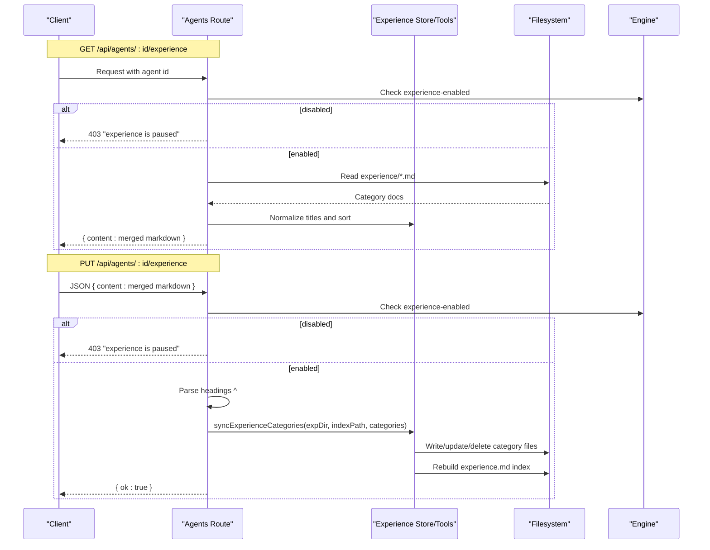
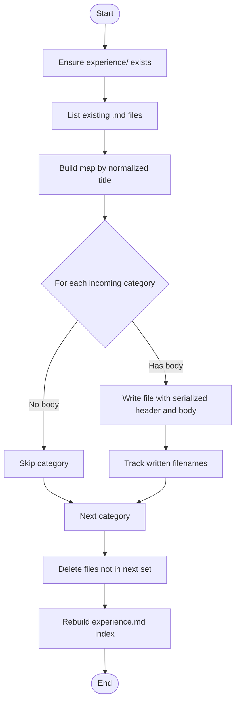
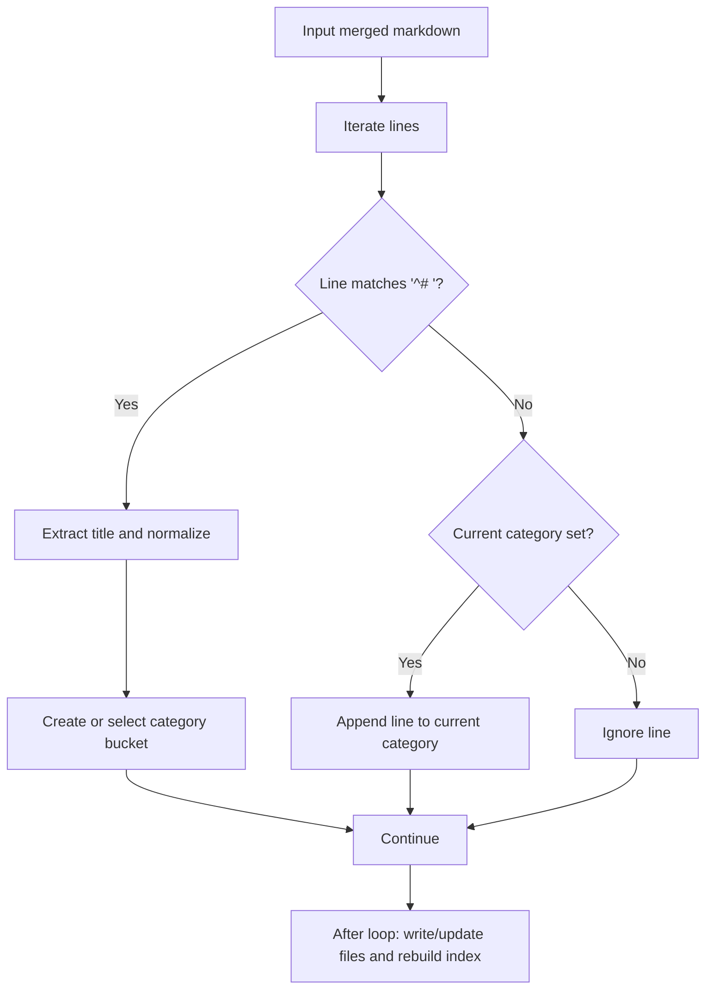
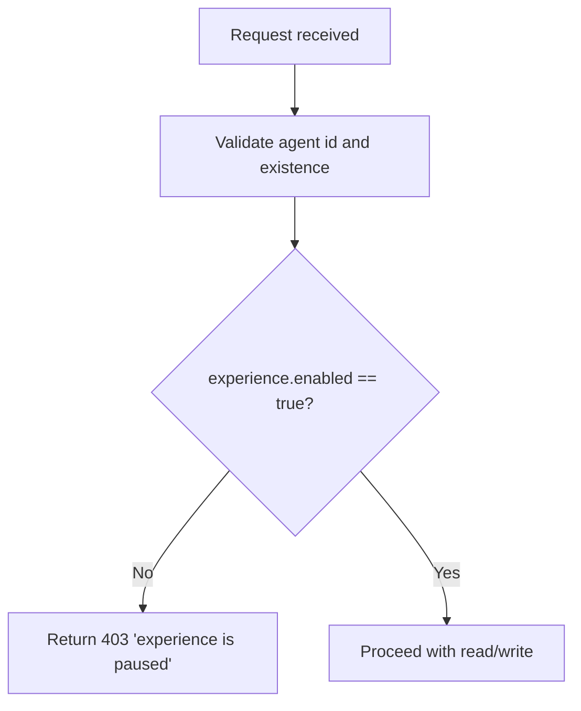
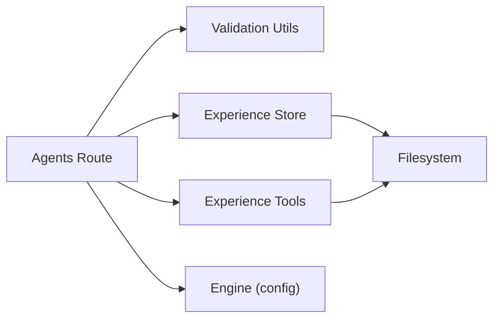

# Agent Experience Management API

<cite>
**Referenced Files in This Document**
- [agents.ts](file://server/routes/agents.ts)
- [experience-store.ts](file://core/experience-store.ts)
- [experience-tool.ts](file://lib/tools/experience.ts)
- [agent-manager.ts](file://core/agent-manager.ts)
</cite>

## Table of Contents
1. [Introduction](#introduction)
2. [Project Structure](#project-structure)
3. [Core Components](#core-components)
4. [Architecture Overview](#architecture-overview)
5. [Detailed Component Analysis](#detailed-component-analysis)
6. [Dependency Analysis](#dependency-analysis)
7. [Performance Considerations](#performance-considerations)
8. [Troubleshooting Guide](#troubleshooting-guide)
9. [Conclusion](#conclusion)
10. [Appendices](#appendices)

## Introduction
This document provides API documentation for the Agent Experience Management endpoints:
- GET /api/agents/:id/experience
- PUT /api/agents/:id/experience

These endpoints allow reading and writing an agent’s experience documents. The system organizes experiences by categories, supports merging/splitting content, enforces permission checks via an experience-enabled flag, normalizes document titles, and defines a strict content format. It also includes examples for creation, category management, and bulk operations.

## Project Structure
The experience feature is implemented across server routes and core storage utilities:
- Server route handlers for GET/PUT are defined under the agents route module.
- Core storage and parsing logic resides in the experience store and shared tools.
- Agent configuration controls whether the experience feature is enabled per agent.

**Diagram sources**
- [agents.ts:772-841](file://server/routes/agents.ts#L772-L841)
- [experience-store.ts:83-127](file://core/experience-store.ts#L83-L127)
- [experience-tool.ts:99-125](file://lib/tools/experience.ts#L99-L125)
- [agents.ts:91-104](file://server/routes/agents.ts#L91-L104)
- [agent-manager.ts:561-573](file://core/agent-manager.ts#L561-L573)

**Section sources**
- [agents.ts:772-841](file://server/routes/agents.ts#L772-L841)
- [experience-store.ts:83-127](file://core/experience-store.ts#L83-L127)
- [experience-tool.ts:99-125](file://lib/tools/experience.ts#L99-L125)
- [agents.ts:91-104](file://server/routes/agents.ts#L91-L104)
- [agent-manager.ts:561-573](file://core/agent-manager.ts#L561-L573)

## Core Components
- Experience Store: Provides functions to list, parse, serialize, and rebuild index files; validates and normalizes category names; builds stable file names from normalized titles.
- Agents Route: Implements GET and PUT endpoints with validation, permission checks, content parsing, and persistence.
- Experience Tools (shared): Contains sync and normalization helpers used by both API and tooling.

Key responsibilities:
- Permission gating via experience-enabled flag.
- Title normalization and safe filename generation.
- Content merging/splitting between a single merged markdown payload and multiple category files.
- Index maintenance at the agent root.

**Section sources**
- [experience-store.ts:22-56](file://core/experience-store.ts#L22-L56)
- [experience-store.ts:83-127](file://core/experience-store.ts#L83-L127)
- [experience-tool.ts:99-125](file://lib/tools/experience.ts#L99-L125)
- [agents.ts:772-841](file://server/routes/agents.ts#L772-L841)

## Architecture Overview
The API endpoints operate as follows:
- GET reads all category files under the agent’s experience directory, merges them into a single markdown string, and returns it.
- PUT accepts a merged markdown payload, splits it by top-level headings into categories, writes or updates corresponding files, deletes unused categories, and rebuilds the index.

**Diagram sources**
- [agents.ts:772-841](file://server/routes/agents.ts#L772-L841)
- [experience-tool.ts:99-125](file://lib/tools/experience.ts#L99-L125)
- [experience-store.ts:104-127](file://core/experience-store.ts#L104-L127)

## Detailed Component Analysis

### Endpoint: GET /api/agents/:id/experience
- Purpose: Return a merged view of all experience categories for an agent.
- Behavior:
  - Validates agent id and existence.
  - Checks if experience is enabled for the agent.
  - Reads all .md files under the agent’s experience directory.
  - Normalizes titles and sorts alphabetically.
  - Concatenates each category block as “# Title\nBody” separated by blank lines.
  - Returns empty content when no files exist or directory is missing.
- Responses:
  - 200 OK with { content: string }
  - 404 Not Found if agent not found
  - 403 Forbidden if experience is paused
  - 500 Internal Server Error on unexpected errors

**Section sources**
- [agents.ts:772-794](file://server/routes/agents.ts#L772-L794)
- [experience-store.ts:83-97](file://core/experience-store.ts#L83-L97)

### Endpoint: PUT /api/agents/:id/experience
- Purpose: Update experience documents by providing a merged markdown payload.
- Input:
  - JSON body with a required field content (string).
- Processing:
  - Validates agent id and existence.
  - Checks if experience is enabled for the agent.
  - Parses the merged markdown by splitting on top-level headings (^# ).
  - Normalizes category titles using the same rules as the store.
  - Persists categories to individual files under experience/, removes obsolete ones, and rebuilds the index.
- Responses:
  - 200 OK with { ok: true }
  - 400 Bad Request if content is not a string or invalid category name
  - 404 Not Found if agent not found
  - 403 Forbidden if experience is paused
  - 500 Internal Server Error on unexpected errors

**Section sources**
- [agents.ts:796-841](file://server/routes/agents.ts#L796-L841)
- [experience-tool.ts:99-125](file://lib/tools/experience.ts#L99-L125)

### Experience Directory Structure and Organization
- Location: Per-agent directory under agents/<agentId>/experience/.
- Index file: agents/<agentId>/experience.md (auto-generated index).
- Category files: agents/<agentId>/experience/<filename>.md where filenames are derived from normalized category titles plus a hash suffix.
- Each category file contains a numbered list of entries (e.g., “1. ...”, “2. ...”).
- The index summarizes categories and links to their files.

**Diagram sources**
- [experience-tool.ts:99-125](file://lib/tools/experience.ts#L99-L125)
- [experience-store.ts:104-127](file://core/experience-store.ts#L104-L127)

**Section sources**
- [experience-store.ts:83-127](file://core/experience-store.ts#L83-L127)
- [experience-tool.ts:99-125](file://lib/tools/experience.ts#L99-L125)

### Content Merging/Splitting Logic
- Merge (GET):
  - Reads all category files, extracts titles and bodies, sorts by normalized title, and concatenates blocks.
- Split (PUT):
  - Parses input markdown by detecting top-level headings (^# <title>).
  - Groups subsequent lines until the next heading into that category.
  - Normalizes titles and persists to category files.
  - Removes category files not present in the new payload.
  - Rebuilds the index file.

**Diagram sources**
- [agents.ts:815-830](file://server/routes/agents.ts#L815-L830)
- [experience-tool.ts:99-125](file://lib/tools/experience.ts#L99-L125)

**Section sources**
- [agents.ts:815-830](file://server/routes/agents.ts#L815-L830)
- [experience-tool.ts:99-125](file://lib/tools/experience.ts#L99-L125)

### Permission Checks and Experience-Enabled Flag
- The experience feature must be explicitly enabled per agent.
- The endpoint checks the agent’s configuration for experience.enabled.
- If disabled, requests return 403 with a message indicating the feature is paused.

**Diagram sources**
- [agents.ts:772-803](file://server/routes/agents.ts#L772-L803)
- [agents.ts:91-104](file://server/routes/agents.ts#L91-L104)

**Section sources**
- [agents.ts:772-803](file://server/routes/agents.ts#L772-L803)
- [agents.ts:91-104](file://server/routes/agents.ts#L91-L104)

### Document Title Normalization and Format Specifications
- Title normalization:
  - Trims whitespace.
  - Rejects invalid characters (null, carriage return, newline).
  - Disallows path traversal patterns (“.”, “..”, slashes, backslashes, drive letters).
  - Ensures non-empty titles.
- Storage filename:
  - Derived from normalized title: NFKC normalization, lowercased, non-alphanumeric replaced with hyphens, trimmed, truncated to 48 chars, then appended with a short SHA-256 hash suffix.
- Document metadata:
  - Each category file begins with a meta comment containing an encoded title.
- Content format:
  - Category files contain a numbered list of entries (e.g., “1. ...”, “2. ...”).
  - The index file summarizes categories and links to their files.

**Section sources**
- [experience-store.ts:22-56](file://core/experience-store.ts#L22-L56)
- [experience-tool.ts:273-307](file://lib/tools/experience.ts#L273-L307)

### Examples

#### Create Experience Documents (Bulk via PUT)
- Prepare a merged markdown payload with top-level headings for each category and numbered entries under each heading.
- Send a PUT request to /api/agents/:id/experience with JSON body { content: "<merged markdown>" }.
- The server will split by headings, normalize titles, persist category files, remove obsolete ones, and rebuild the index.

Example payload structure (conceptual):
- # Tool Usage
  - 1. Always check permissions before running commands.
  - 2. Prefer built-in tools over shell calls when available.
- # Search Tips
  - 1. Use targeted keywords to reduce noise.
  - 2. Combine filters for better results.

Expected responses:
- 200 OK with { ok: true }
- 400 Bad Request if content is not a string or contains invalid category names
- 403 Forbidden if experience is paused
- 404 Not Found if agent does not exist

**Section sources**
- [agents.ts:796-841](file://server/routes/agents.ts#L796-L841)
- [experience-tool.ts:99-125](file://lib/tools/experience.ts#L99-L125)

#### Manage Categories (Update via PUT)
- To update or delete categories, send a new merged payload including only the desired categories.
- Any category absent from the new payload will be removed from disk.
- The index will be rebuilt automatically.

**Section sources**
- [experience-tool.ts:99-125](file://lib/tools/experience.ts#L99-L125)

#### Read Experience (GET)
- Send a GET request to /api/agents/:id/experience.
- The response returns a merged markdown string with all categories sorted by normalized title.

**Section sources**
- [agents.ts:772-794](file://server/routes/agents.ts#L772-L794)

## Dependency Analysis
- The agents route depends on:
  - Validation utilities for agent id and existence.
  - Experience store and tools for listing, normalizing, syncing, and rebuilding.
  - Engine access to determine if experience is enabled.
- The experience store and tools implement:
  - Safe category normalization.
  - Stable filename generation.
  - Document serialization and parsing.
  - Index rebuilding based on category contents.

**Diagram sources**
- [agents.ts:772-841](file://server/routes/agents.ts#L772-L841)
- [experience-store.ts:83-127](file://core/experience-store.ts#L83-L127)
- [experience-tool.ts:99-125](file://lib/tools/experience.ts#L99-L125)

**Section sources**
- [agents.ts:772-841](file://server/routes/agents.ts#L772-L841)
- [experience-store.ts:83-127](file://core/experience-store.ts#L83-L127)
- [experience-tool.ts:99-125](file://lib/tools/experience.ts#L99-L125)

## Performance Considerations
- Reading performance:
  - Listing and sorting category files is linear in the number of category files.
  - Concatenation is efficient for typical category counts.
- Writing performance:
  - Syncing categories involves scanning existing files, writing updated files, deleting obsolete ones, and rebuilding the index.
  - Avoid sending excessively large payloads; consider batching updates.
- Index rebuild:
  - Rebuilding iterates through category files and summarizes entries; keep category entry lists concise for faster indexing.

[No sources needed since this section provides general guidance]

## Troubleshooting Guide
Common issues and resolutions:
- 403 Forbidden “experience is paused”:
  - Ensure the agent’s configuration has experience.enabled set to true.
- 400 Bad Request “content must be a string”:
  - Verify the request body contains a JSON object with a string field named content.
- 400 Bad Request “invalid experience category”:
  - Ensure category titles do not contain forbidden characters or path traversal patterns.
- 404 Not Found “agent not found”:
  - Confirm the agent id is valid and exists.
- Unexpected 500 errors:
  - Check filesystem permissions and availability of the agent’s experience directory.

**Section sources**
- [agents.ts:772-841](file://server/routes/agents.ts#L772-L841)
- [experience-store.ts:22-56](file://core/experience-store.ts#L22-L56)

## Conclusion
The Agent Experience Management API provides a robust mechanism for organizing and maintaining agent knowledge across categories. With clear permission gating, deterministic title normalization, and automated index maintenance, clients can efficiently manage experience documents via simple merge/split semantics.

[No sources needed since this section summarizes without analyzing specific files]

## Appendices

### API Definitions

- GET /api/agents/:id/experience
  - Path parameter: id (agent identifier)
  - Success response: { content: string }
  - Errors: 404, 403, 500

- PUT /api/agents/:id/experience
  - Path parameter: id (agent identifier)
  - Request body: { content: string }
  - Success response: { ok: boolean }
  - Errors: 400, 404, 403, 500

**Section sources**
- [agents.ts:772-841](file://server/routes/agents.ts#L772-L841)