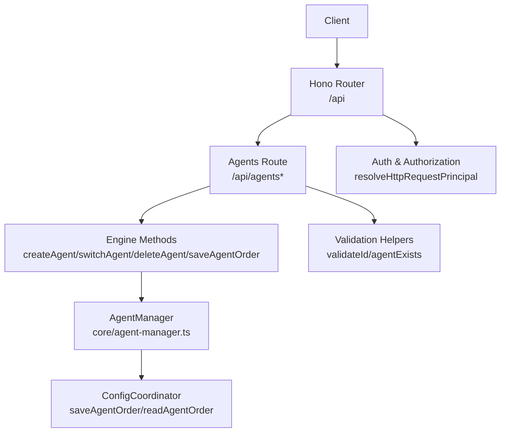
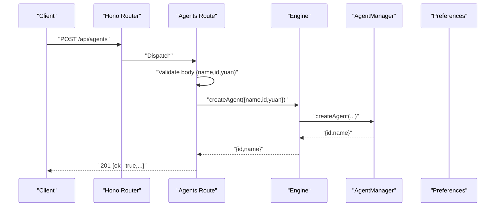
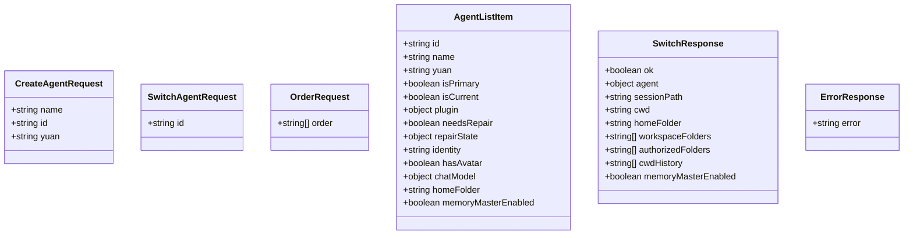
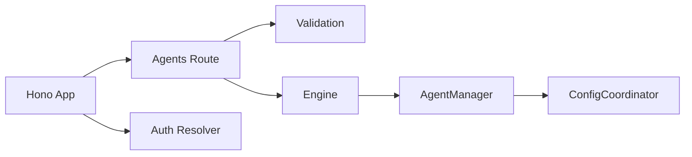

# Agent Lifecycle API

<cite>
**Referenced Files in This Document**
- [agents.ts](file://server/routes/agents.ts)
- [agent-manager.ts](file://core/agent-manager.ts)
- [config-coordinator.ts](file://core/config-coordinator.ts)
- [validation.ts](file://server/utils/validation.ts)
- [request-principal.ts](file://server/http/request-principal.ts)
- [index.ts](file://server/index.ts)
</cite>

## Table of Contents
1. [Introduction](#introduction)
2. [Project Structure](#project-structure)
3. [Core Components](#core-components)
4. [Architecture Overview](#architecture-overview)
5. [Detailed Component Analysis](#detailed-component-analysis)
6. [Dependency Analysis](#dependency-analysis)
7. [Performance Considerations](#performance-considerations)
8. [Troubleshooting Guide](#troubleshooting-guide)
9. [Conclusion](#conclusion)

## Introduction
This document provides detailed API documentation for agent lifecycle management endpoints. It covers:
- Listing agents
- Creating a new agent with name/id/yuan parameters
- Switching the active agent with session context
- Deleting an agent
- Ordering agents via PUT /api/agents/order

It includes request/response schemas (TypeScript interfaces), parameter validation rules, authentication requirements, status codes, and error handling scenarios such as duplicate IDs or invalid states.

## Project Structure
The agent lifecycle endpoints are implemented under server routes and backed by core engine components:
- HTTP routes: server/routes/agents.ts
- Core lifecycle logic: core/agent-manager.ts
- Preferences/order persistence: core/config-coordinator.ts
- Input validation helpers: server/utils/validation.ts
- Authentication and authorization: server/http/request-principal.ts
- Server bootstrap and route mounting: server/index.ts

**Diagram sources**
- [agents.ts:1-845](file://server/routes/agents.ts#L1-L845)
- [agent-manager.ts:1-1150](file://core/agent-manager.ts#L1-L1150)
- [config-coordinator.ts:350-370](file://core/config-coordinator.ts#L350-L370)
- [validation.ts:1-11](file://server/utils/validation.ts#L1-L11)
- [request-principal.ts:1-107](file://server/http/request-principal.ts#L1-L107)
- [index.ts:160-170](file://server/index.ts#L160-L170)

**Section sources**
- [agents.ts:1-845](file://server/routes/agents.ts#L1-L845)
- [agent-manager.ts:1-1150](file://core/agent-manager.ts#L1-L1150)
- [config-coordinator.ts:350-370](file://core/config-coordinator.ts#L350-L370)
- [validation.ts:1-11](file://server/utils/validation.ts#L1-L11)
- [request-principal.ts:1-107](file://server/http/request-principal.ts#L1-L107)
- [index.ts:160-170](file://server/index.ts#L160-L170)

## Core Components
- Agents route: defines REST endpoints for listing, creating, switching, deleting, ordering, and managing per-agent resources.
- AgentManager: orchestrates agent creation, runtime initialization, switching, deletion, and order-related operations.
- ConfigCoordinator: persists agent ordering preferences.
- Validation: validates agent IDs and existence checks.
- Request principal: centralizes authentication and authorization for HTTP requests.

Key responsibilities:
- GET /api/agents: list all agents with optional cache refresh.
- POST /api/agents: create a new agent with name, id, yuan.
- POST /api/agents/switch: switch active agent and return session context.
- DELETE /api/agents/:id: delete an agent if not current.
- PUT /api/agents/order: persist custom ordering.

**Section sources**
- [agents.ts:195-327](file://server/routes/agents.ts#L195-L327)
- [agent-manager.ts:557-753](file://core/agent-manager.ts#L557-L753)
- [config-coordinator.ts:355-363](file://core/config-coordinator.ts#L355-L363)
- [validation.ts:4-10](file://server/utils/validation.ts#L4-L10)
- [request-principal.ts:44-106](file://server/http/request-principal.ts#L44-L106)

## Architecture Overview
The API follows a layered architecture:
- HTTP layer (Hono) exposes REST endpoints.
- Route handlers validate inputs and delegate to Engine methods.
- Engine delegates to AgentManager for lifecycle operations.
- AgentManager interacts with file system, preferences, hub scheduler, and session coordinator.
- Authentication is enforced centrally before route execution.

**Diagram sources**
- [agents.ts:208-221](file://server/routes/agents.ts#L208-L221)
- [agent-manager.ts:557-753](file://core/agent-manager.ts#L557-L753)

## Detailed Component Analysis

### Authentication and Authorization
- All requests pass through a global resolver that authenticates using bearer token, query token, or web session cookie, then authorizes based on route permissions.
- If credentials are missing or invalid, a 403 response is returned with reason details.

Request flow:
- Resolve principal from headers/query/cookie.
- Apply route-level authorization.
- Proceed to handler only if allowed.

**Section sources**
- [request-principal.ts:44-106](file://server/http/request-principal.ts#L44-L106)
- [index.ts:160-170](file://server/index.ts#L160-L170)

### GET /api/agents
Lists all agents. Supports optional fresh query parameter to invalidate list cache.

- Method: GET
- Path: /api/agents
- Query:
  - fresh?: string | boolean — when true, invalidates agent list cache before listing.
- Response:
  - 200 OK: { agents: AgentListItem[] }
  - 500 Internal Server Error: { error: string }

Status codes:
- 200: Success
- 500: Unexpected error

Notes:
- The list respects user-defined order and primary/current flags.

**Section sources**
- [agents.ts:195-206](file://server/routes/agents.ts#L195-L206)
- [agent-manager.ts:371-408](file://core/agent-manager.ts#L371-L408)

### POST /api/agents
Creates a new agent.

- Method: POST
- Path: /api/agents
- Request body:
  - name: string (required, non-empty after trim)
  - id: string (optional; if provided, must be valid and unique)
  - yuan: string (optional; validated against known types)
- Response:
  - 201 Created: { ok: true, id: string, name: string, ... }
  - 400 Bad Request: { error: string } — e.g., name required
  - 409 Conflict: { error: string } — duplicate ID
  - 500 Internal Server Error: { error: string }

Validation rules:
- name must be present and non-empty.
- id must not contain path separators or "..".
- Duplicate id results in conflict.

Example request:
- Body: { "name": "Alice", "id": "alice-bot", "yuan": "hanako" }

Example responses:
- 201: { "ok": true, "id": "alice-bot", "name": "Alice" }
- 409: { "error": "Agent already exists" }

**Section sources**
- [agents.ts:208-221](file://server/routes/agents.ts#L208-L221)
- [agent-manager.ts:557-753](file://core/agent-manager.ts#L557-L753)
- [validation.ts:4-6](file://server/utils/validation.ts#L4-L6)

### POST /api/agents/switch
Switches the active agent and returns session context.

- Method: POST
- Path: /api/agents/switch
- Request body:
  - id: string (required; must be valid)
- Response:
  - 200 OK: { ok: true, agent: { id, name }, sessionPath, cwd, homeFolder, workspaceFolders, authorizedFolders, cwdHistory, memoryMasterEnabled }
  - 400 Bad Request: { error: string } — invalid id
  - 500 Internal Server Error: { error: string }

Behavior:
- Validates id.
- Switches active agent and creates/resumes session context.
- Updates last_cwd and cwd_history.
- Emits app events for UI updates.

Example request:
- Body: { "id": "alice-bot" }

Example response:
- 200: { "ok": true, "agent": { "id": "alice-bot", "name": "Alice" }, "sessionPath": "/path/to/session", "cwd": "/workspace", "homeFolder": "/home/alice", "workspaceFolders": [], "authorizedFolders": [], "cwdHistory": ["/workspace"], "memoryMasterEnabled": true }

**Section sources**
- [agents.ts:223-280](file://server/routes/agents.ts#L223-L280)
- [agent-manager.ts:769-843](file://core/agent-manager.ts#L769-L843)

### DELETE /api/agents/:id
Deletes an agent by id.

- Method: DELETE
- Path: /api/agents/:id
- Path params:
  - id: string (required; must be valid)
- Response:
  - 200 OK: { ok: true }
  - 400 Bad Request: { error: string } — cannot delete current agent
  - 404 Not Found: { error: string } — agent does not exist
  - 500 Internal Server Error: { error: string }

Validation rules:
- id must be valid.
- Cannot delete the currently active agent.

Example request:
- DELETE /api/agents/bob-bot

Example responses:
- 200: { "ok": true }
- 400: { "error": "Cannot delete current agent" }
- 404: { "error": "Agent not found" }

**Section sources**
- [agents.ts:282-295](file://server/routes/agents.ts#L282-L295)
- [agent-manager.ts:854-933](file://core/agent-manager.ts#L854-L933)

### PUT /api/agents/order
Persists custom agent ordering.

- Method: PUT
- Path: /api/agents/order
- Request body:
  - order: string[] — array of agent ids defining desired order
- Response:
  - 200 OK: { ok: true }
  - 400 Bad Request: { error: string } — order must be an array
  - 500 Internal Server Error: { error: string }

Behavior:
- Saves order to preferences.
- List endpoint uses this order to sort agents.

Example request:
- Body: { "order": ["alice-bot", "bob-bot"] }

Example response:
- 200: { "ok": true }

**Section sources**
- [agents.ts:315-327](file://server/routes/agents.ts#L315-L327)
- [config-coordinator.ts:355-363](file://core/config-coordinator.ts#L355-L363)

## Data Models (TypeScript Interfaces)

**Diagram sources**
- [agents.ts:195-327](file://server/routes/agents.ts#L195-L327)
- [agent-manager.ts:371-408](file://core/agent-manager.ts#L371-L408)

## Dependency Analysis
- Routes depend on:
  - Validation helpers for id checks and existence.
  - Engine methods exposed by AgentManager for lifecycle operations.
  - ConfigCoordinator for saving agent order.
- Authentication is applied globally before route handlers execute.

**Diagram sources**
- [agents.ts:1-845](file://server/routes/agents.ts#L1-L845)
- [agent-manager.ts:1-1150](file://core/agent-manager.ts#L1-L1150)
- [config-coordinator.ts:350-370](file://core/config-coordinator.ts#L350-L370)
- [validation.ts:1-11](file://server/utils/validation.ts#L1-L11)
- [request-principal.ts:1-107](file://server/http/request-principal.ts#L1-L107)
- [index.ts:160-170](file://server/index.ts#L160-L170)

**Section sources**
- [agents.ts:1-845](file://server/routes/agents.ts#L1-L845)
- [agent-manager.ts:1-1150](file://core/agent-manager.ts#L1-L1150)
- [config-coordinator.ts:350-370](file://core/config-coordinator.ts#L350-L370)
- [validation.ts:1-11](file://server/utils/validation.ts#L1-L11)
- [request-principal.ts:1-107](file://server/http/request-principal.ts#L1-L107)
- [index.ts:160-170](file://server/index.ts#L160-L170)

## Performance Considerations
- Agent list caching: GET /api/agents supports a fresh flag to bypass cache when needed.
- Switch operations are queued to avoid concurrent state changes.
- Avoid frequent calls to PUT /api/agents/order; order changes are persisted and used by list operations.

[No sources needed since this section provides general guidance]

## Troubleshooting Guide
Common errors and resolutions:
- Duplicate ID during creation:
  - Status: 409
  - Cause: id already exists
  - Resolution: choose a different id or omit id to auto-generate
- Invalid id format:
  - Status: 400
  - Cause: id contains path separators or ".."
  - Resolution: use a simple alphanumeric id without path characters
- Cannot delete current agent:
  - Status: 400
  - Cause: attempting to delete the active agent
  - Resolution: switch to another agent first
- Agent not found:
  - Status: 404
  - Cause: agent directory or config.yaml missing
  - Resolution: verify id and ensure agent exists
- Authentication failures:
  - Status: 403
  - Cause: missing or invalid credentials
  - Resolution: provide valid bearer token, query token, or web session cookie

**Section sources**
- [agents.ts:208-295](file://server/routes/agents.ts#L208-L295)
- [agent-manager.ts:854-933](file://core/agent-manager.ts#L854-L933)
- [request-principal.ts:76-106](file://server/http/request-principal.ts#L76-L106)

## Conclusion
The Agent Lifecycle API provides robust CRUD operations for managing agents, including creation with customizable identity (name/id/yuan), safe switching with session context, deletion with constraints, and persistent ordering. Authentication and authorization are enforced centrally, and input validation ensures data integrity. Use the provided schemas and examples to integrate effectively.