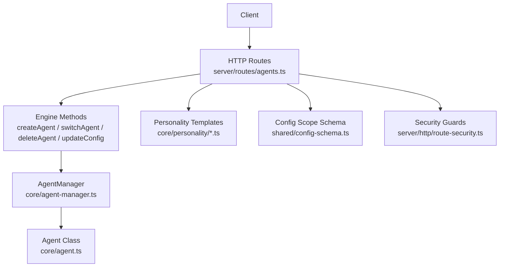
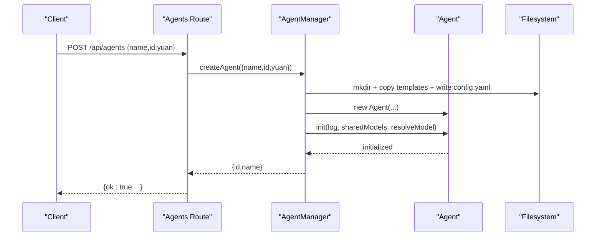
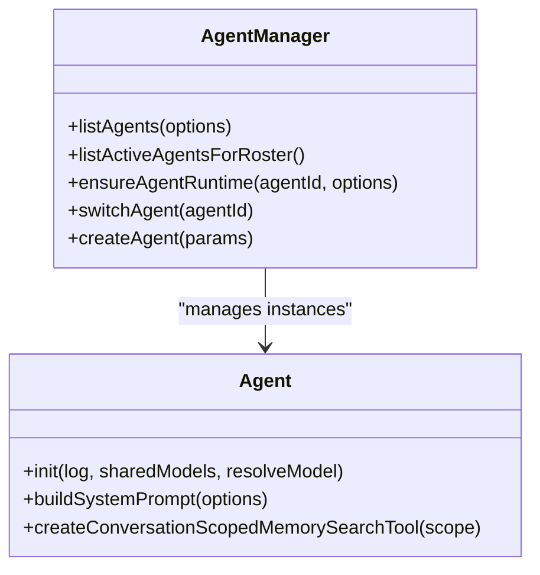
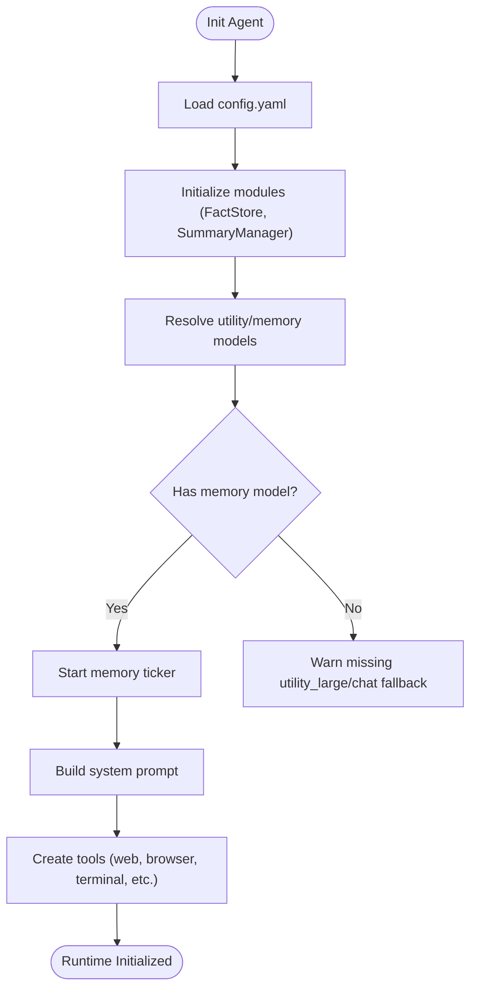
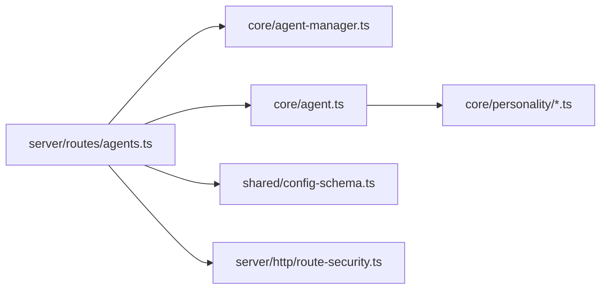

# Agent Management API

<cite>
**Referenced Files in This Document**
- [agents.ts](file://server/routes/agents.ts)
- [agent-manager.ts](file://core/agent-manager.ts)
- [agent.ts](file://core/agent.ts)
- [template.ts](file://core/personality/template.ts)
- [loader.ts](file://core/personality/loader.ts)
- [config-schema.ts](file://shared/config-schema.ts)
- [route-security.ts](file://server/http/route-security.ts)
</cite>

## Table of Contents
1. [Introduction](#introduction)
2. [Project Structure](#project-structure)
3. [Core Components](#core-components)
4. [Architecture Overview](#architecture-overview)
5. [Detailed Component Analysis](#detailed-component-analysis)
6. [Dependency Analysis](#dependency-analysis)
7. [Performance Considerations](#performance-considerations)
8. [Troubleshooting Guide](#troubleshooting-guide)
9. [Conclusion](#conclusion)
10. [Appendices](#appendices)

## Introduction
This document provides comprehensive API documentation for agent management endpoints. It covers CRUD operations for agents, including creation, configuration, personality settings, and lifecycle management. The guide includes HTTP methods, URL patterns, request/response schemas with TypeScript interfaces, parameter validation rules, status codes, examples of agent configuration and personality templates, multi-agent coordination, state management, resource allocation, and monitoring endpoints.

## Project Structure
The agent management API is implemented as a Hono-based REST service under server routes. Core business logic resides in the core module (AgentManager and Agent), while personality templates are defined in core/personality. Global vs per-agent configuration scoping is declared in shared/config-schema.ts. Security guards and capability checks are applied via server/http/route-security.ts.

**Diagram sources**
- [agents.ts:188-327](file://server/routes/agents.ts#L188-L327)
- [agent-manager.ts:98-146](file://core/agent-manager.ts#L98-L146)
- [agent.ts:91-250](file://core/agent.ts#L91-L250)
- [template.ts:1-124](file://core/personality/template.ts#L1-L124)
- [config-schema.ts:22-43](file://shared/config-schema.ts#L22-L43)
- [route-security.ts:443-484](file://server/http/route-security.ts#L443-L484)

**Section sources**
- [agents.ts:188-327](file://server/routes/agents.ts#L188-L327)
- [agent-manager.ts:98-146](file://core/agent-manager.ts#L98-L146)
- [agent.ts:91-250](file://core/agent.ts#L91-L250)
- [template.ts:1-124](file://core/personality/template.ts#L1-L124)
- [config-schema.ts:22-43](file://shared/config-schema.ts#L22-L43)
- [route-security.ts:443-484](file://server/http/route-security.ts#L443-L484)

## Core Components
- Agents Route: Defines all HTTP endpoints for listing, creating, switching, deleting, ordering, avatar handling, config, identity, ishiki, public-ishiki, pinned memory, and experience content.
- AgentManager: Orchestrates agent lifecycle (scan, init, create, switch, delete), list caching, runtime initialization queue, and memory maintenance scheduling.
- Agent: Encapsulates per-agent runtime state, tools, memory ticker, desk/cron, system prompt building, appearance summary refresh, and session-scoped memory search tooling.
- Personality Template: Defines the structure and builder for personality-driven system prompts.
- Config Schema: Declares global vs per-agent configuration fields and their setters/getters.
- Security Guards: Enforce capabilities like settings.write and providers.manage on mutating endpoints.

**Section sources**
- [agents.ts:188-845](file://server/routes/agents.ts#L188-L845)
- [agent-manager.ts:98-800](file://core/agent-manager.ts#L98-L800)
- [agent.ts:91-800](file://core/agent.ts#L91-L800)
- [template.ts:1-124](file://core/personality/template.ts#L1-L124)
- [config-schema.ts:22-43](file://shared/config-schema.ts#L22-L43)
- [route-security.ts:443-484](file://server/http/route-security.ts#L443-L484)

## Architecture Overview
The API follows a layered architecture:
- HTTP Layer: Hono routes parse requests, validate inputs, enforce security, and return JSON responses.
- Business Layer: AgentManager coordinates agent discovery, initialization, switching, deletion, and persistence.
- Runtime Layer: Agent encapsulates runtime resources (memory ticker, tools, desk/cron), builds system prompts, and manages per-agent state.
- Configuration Layer: Global vs per-agent configuration is split by schema; provider credentials and inline patches are handled securely.
- Personality Layer: Personality templates define tone, traits, and response style used to build system prompts.

**Diagram sources**
- [agents.ts:208-221](file://server/routes/agents.ts#L208-L221)
- [agent-manager.ts:557-753](file://core/agent-manager.ts#L557-L753)
- [agent.ts:278-647](file://core/agent.ts#L278-L647)

## Detailed Component Analysis

### Agent Lifecycle Endpoints
- List Agents
  - Method: GET
  - Path: /api/agents
  - Query: fresh=1|true (optional) to invalidate cache
  - Response: { agents: AgentListItem[] }
  - Status Codes: 200 OK, 500 Internal Server Error
- Create Agent
  - Method: POST
  - Path: /api/agents
  - Request Body: { name: string, id?: string, yuan?: string }
  - Validation: name required and non-empty; id optional but must be valid if provided
  - Response: { ok: true, id: string, name: string }
  - Status Codes: 200 OK, 400 Bad Request, 409 Conflict, 500 Internal Server Error
- Switch Agent
  - Method: POST
  - Path: /api/agents/switch
  - Request Body: { id: string }
  - Validation: id required and valid
  - Response: { ok: true, agent: { id, name }, sessionPath, cwd, homeFolder, workspaceFolders, authorizedFolders, cwdHistory, memoryMasterEnabled }
  - Status Codes: 200 OK, 400 Bad Request, 500 Internal Server Error
- Delete Agent
  - Method: DELETE
  - Path: /api/agents/:id
  - Path Param: id (validated)
  - Response: { ok: true }
  - Status Codes: 200 OK, 400 Bad Request (cannot delete current), 404 Not Found, 500 Internal Server Error
- Set Primary Agent
  - Method: PUT
  - Path: /api/agents/primary
  - Request Body: { id: string }
  - Validation: id required
  - Response: { ok: true }
  - Status Codes: 200 OK, 400 Bad Request, 500 Internal Server Error
- Order Agents
  - Method: PUT
  - Path: /api/agents/order
  - Request Body: { order: string[] }
  - Validation: order must be an array
  - Response: { ok: true }
  - Status Codes: 200 OK, 400 Bad Request, 500 Internal Server Error

**Section sources**
- [agents.ts:195-327](file://server/routes/agents.ts#L195-L327)
- [agent-manager.ts:367-408](file://core/agent-manager.ts#L367-L408)
- [agent-manager.ts:557-753](file://core/agent-manager.ts#L557-L753)
- [agent-manager.ts:769-800](file://core/agent-manager.ts#L769-L800)

### Avatar Endpoints
- Get Avatar
  - Method: GET
  - Path: /api/agents/:id/avatar
  - Path Param: id (validated)
  - Response: image bytes (png/jpg/jpeg/webp) or { error: "no avatar" }
  - Status Codes: 200 OK, 404 Not Found, 400 Bad Request
- Upload Avatar
  - Method: POST
  - Path: /api/agents/:id/avatar
  - Path Param: id (validated)
  - Request Body: { data: string } (base64 data URL)
  - Validation: data must be a base64 data URL with supported MIME types; max size enforced
  - Response: { ok: true, ext: string }
  - Status Codes: 200 OK, 400 Bad Request, 404 Not Found, 500 Internal Server Error
- Delete Avatar
  - Method: DELETE
  - Path: /api/agents/:id/avatar
  - Path Param: id (validated)
  - Response: { ok: true }
  - Status Codes: 200 OK, 404 Not Found, 500 Internal Server Error

**Section sources**
- [agents.ts:333-392](file://server/routes/agents.ts#L333-L392)

### Configuration Endpoints
- Get Agent Config
  - Method: GET
  - Path: /api/agents/:id/config
  - Path Param: id (validated)
  - Response: merged config object with injected global fields, providers metadata, availableTools, and _raw provider hints
  - Status Codes: 200 OK, 404 Not Found, 500 Internal Server Error
- Update Agent Config
  - Method: PUT
  - Path: /api/agents/:id/config
  - Path Param: id (validated)
  - Request Body: partial config object
  - Validation:
    - tools.disabled must be an array of optional tool names only
    - experience.enabled must be boolean if present
    - Provider mutations require providers.manage capability
    - Secret field mutations require denySecretMutationWithoutScope checks
  - Behavior:
    - Global fields routed via schema-driven setter calls
    - Inline provider credential patches resolved and saved
    - Providers changed triggers runtime refresh and config cache clear
    - Memory master toggle updates timestamps and runtime state
  - Response: { ok: true }
  - Status Codes: 200 OK, 400 Bad Request, 403 Forbidden, 404 Not Found, 500 Internal Server Error

**Section sources**
- [agents.ts:398-614](file://server/routes/agents.ts#L398-L614)
- [config-schema.ts:22-43](file://shared/config-schema.ts#L22-L43)
- [route-security.ts:443-484](file://server/http/route-security.ts#L443-L484)

### Identity, Ishiki, Public Ishiki, Pinned, Experience
- Identity
  - GET /api/agents/:id/identity → { content: string }
  - PUT /api/agents/:id/identity → { ok: true }
  - Validation: content must be string
  - Status Codes: 200 OK, 400 Bad Request, 404 Not Found, 500 Internal Server Error
- Ishiki
  - GET /api/agents/:id/ishiki → { content: string }
  - PUT /api/agents/:id/ishiki → { ok: true }
  - Validation: content must be string
  - Status Codes: 200 OK, 400 Bad Request, 404 Not Found, 500 Internal Server Error
- Public Ishiki
  - GET /api/agents/:id/public-ishiki → { content: string }
  - PUT /api/agents/:id/public-ishiki → { ok: true }
  - Validation: content must be string
  - Status Codes: 200 OK, 400 Bad Request, 404 Not Found, 500 Internal Server Error
- Pinned Memory
  - GET /api/agents/:id/pinned → { pins: string[] }
  - PUT /api/agents/:id/pinned → { ok: true }
  - Validation: pins must be array of strings
  - Status Codes: 200 OK, 400 Bad Request, 404 Not Found, 500 Internal Server Error
- Experience
  - GET /api/agents/:id/experience → { content: string } or { error: "experience is paused" }
  - PUT /api/agents/:id/experience → { ok: true }
  - Validation: content must be string; categories normalized and synced
  - Status Codes: 200 OK, 400 Bad Request, 403 Forbidden, 404 Not Found, 500 Internal Server Error

**Section sources**
- [agents.ts:620-841](file://server/routes/agents.ts#L620-L841)

### Personality Templates
- PersonalityTemplate Interface
  - Fields: name, greeting, tone, traits[], response_style.use_emoji, response_style.max_length, response_style.language, response_style.creativity?
- Builder
  - buildSystemPrompt(template, userName?) constructs a system prompt incorporating platform info, tool discipline, failure handling, memory support, and hard principles.
- Loader
  - loadPersonality(path?) loads and validates a template file; loadPersonalityOrDefault(path?) falls back to embedded default.

Example usage pattern:
- Use loader to obtain a template.
- Pass template and user name to builder to generate system prompt.

**Section sources**
- [template.ts:1-124](file://core/personality/template.ts#L1-L124)
- [loader.ts:1-33](file://core/personality/loader.ts#L1-L33)

### Multi-Agent Coordination
- Listing active agents for roster:
  - AgentManager exposes listActiveAgentsForRoster() which returns lightweight entries (id, name, summary, model).
- Subagent and workflow tools:
  - Agent initializes subagent and workflow tools that can resolve target agents by id or name using the roster.
- Channel and DM tools:
  - When channelsDir and agentsDir exist, channel and dm tools are created with listAgents callback from AgentManager.

**Diagram sources**
- [agent-manager.ts:367-450](file://core/agent-manager.ts#L367-L450)
- [agent.ts:528-636](file://core/agent.ts#L528-L636)

**Section sources**
- [agent-manager.ts:422-450](file://core/agent-manager.ts#L422-L450)
- [agent.ts:528-636](file://core/agent.ts#L528-L636)

### State Management, Resource Allocation, Monitoring
- Agent State
  - Agent exposes runtimeInitialized, memoryMasterEnabled, experienceEnabled, memoryEnabled, utilityModel, memoryModel, needsRepair, repairState.
- Resource Allocation
  - AgentManager maintains concurrency queues for runtime initialization and memory maintenance.
  - Agent creates memory ticker, FactStore, SessionSummaryManager, Desk/Cron, and various tools during init.
- Monitoring
  - AgentManager schedules memory maintenance tasks and emits events when configs change.
  - Agent refreshes appearance summaries asynchronously and rebuilds system prompts upon changes.

**Diagram sources**
- [agent.ts:278-647](file://core/agent.ts#L278-L647)
- [agent-manager.ts:338-365](file://core/agent-manager.ts#L338-L365)

**Section sources**
- [agent.ts:278-647](file://core/agent.ts#L278-L647)
- [agent-manager.ts:338-365](file://core/agent-manager.ts#L338-L365)

## Dependency Analysis
- HTTP routes depend on engine methods exposed by AgentManager and Agent.
- Security guards enforce capabilities before mutating config or providers.
- Global vs per-agent configuration is split by CONFIG_SCHEMA; setters are invoked dynamically based on scope.
- Personality templates are independent of runtime and used to build system prompts.

**Diagram sources**
- [agents.ts:188-327](file://server/routes/agents.ts#L188-L327)
- [agent-manager.ts:98-146](file://core/agent-manager.ts#L98-L146)
- [agent.ts:91-250](file://core/agent.ts#L91-L250)
- [config-schema.ts:22-43](file://shared/config-schema.ts#L22-L43)
- [route-security.ts:443-484](file://server/http/route-security.ts#L443-L484)

**Section sources**
- [agents.ts:188-327](file://server/routes/agents.ts#L188-L327)
- [agent-manager.ts:98-146](file://core/agent-manager.ts#L98-L146)
- [agent.ts:91-250](file://core/agent.ts#L91-L250)
- [config-schema.ts:22-43](file://shared/config-schema.ts#L22-L43)
- [route-security.ts:443-484](file://server/http/route-security.ts#L443-L484)

## Performance Considerations
- Agent list caching: AgentManager caches agent listings with TTL; clients can force refresh via fresh query param.
- Concurrency control: Runtime initialization and memory maintenance are queued with controlled concurrency to avoid contention.
- File I/O: Avatar upload enforces body size limits; config writes use YAML serialization; description regeneration uses hash comparison to avoid unnecessary LLM calls.
- Provider changes: Updating providers triggers runtime refresh and clears config cache to ensure consistency.

[No sources needed since this section provides general guidance]

## Troubleshooting Guide
Common errors and resolutions:
- Invalid ID: Ensure agent id matches validation rules; route returns 400.
- Agent not found: Verify id exists; route returns 404.
- Cannot delete current agent: Switch to another agent first; route returns 400.
- Experience paused: Enable experience in config; route returns 403.
- Provider mutation denied: Grant providers.manage capability; route returns 403.
- Secret mutation denied: Grant secret mutation scope; route returns 403.
- tools.disabled invalid: Only optional tool names allowed; route returns 400.
- Base64 avatar format invalid: Provide correct data URL format; route returns 400.

**Section sources**
- [agents.ts:282-327](file://server/routes/agents.ts#L282-L327)
- [agents.ts:398-614](file://server/routes/agents.ts#L398-L614)
- [agents.ts:620-841](file://server/routes/agents.ts#L620-L841)

## Conclusion
The Agent Management API provides robust endpoints for managing multiple agents, including lifecycle operations, configuration, personality, and experience content. It enforces security through capability checks, supports global and per-agent configuration scoping, and offers efficient runtime initialization and memory maintenance. The design ensures consistent state across agents and integrates personality templates to shape system prompts.

[No sources needed since this section summarizes without analyzing specific files]

## Appendices

### TypeScript Interfaces

- AgentListItem
  - id: string
  - name: string
  - yuan: string
  - plugin: { ownerPluginId?: string | null, visibility: string }
  - needsRepair: boolean
  - repairState: any
  - identity: string
  - hasAvatar: boolean
  - chatModel: { id: string, provider: string } | null
  - homeFolder: string | null
  - memoryMasterEnabled: boolean
  - isPrimary: boolean
  - isCurrent: boolean

- CreateAgentRequest
  - name: string
  - id?: string
  - yuan?: string

- SwitchAgentRequest
  - id: string

- SwitchAgentResponse
  - ok: boolean
  - agent: { id: string, name: string }
  - sessionPath: string | null
  - cwd: string | null
  - homeFolder: string | null
  - workspaceFolders: string[]
  - authorizedFolders: string[]
  - cwdHistory: string[]
  - memoryMasterEnabled: boolean

- UpdateConfigRequest
  - Partial config object with validated fields:
    - tools.disabled?: string[] (optional tool names only)
    - experience.enabled?: boolean
    - providers?: Record<string, any>
    - api/embedding_api/utility_api inline credential patches
    - Global fields per CONFIG_SCHEMA

- PersonalityTemplate
  - name: string
  - greeting: string
  - tone: string
  - traits: string[]
  - response_style: {
      use_emoji: boolean
      max_length: number
      language: string
      creativity?: number
    }

**Section sources**
- [agent-manager.ts:453-497](file://core/agent-manager.ts#L453-L497)
- [agents.ts:208-221](file://server/routes/agents.ts#L208-L221)
- [agents.ts:223-280](file://server/routes/agents.ts#L223-L280)
- [agents.ts:398-614](file://server/routes/agents.ts#L398-L614)
- [template.ts:1-124](file://core/personality/template.ts#L1-L124)