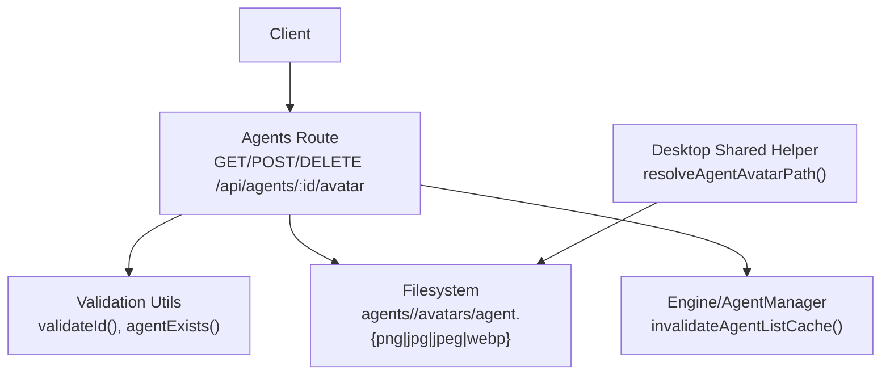
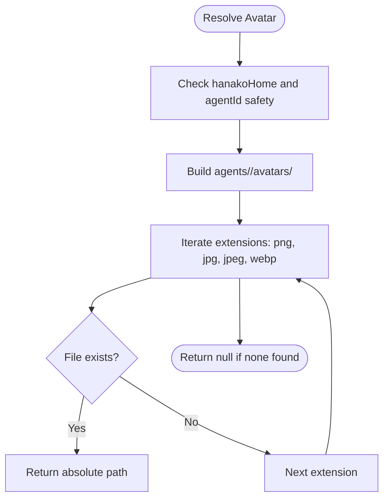
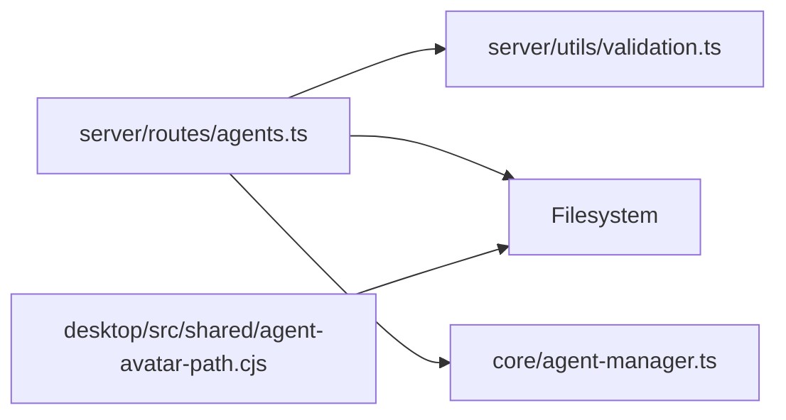

# Agent Media Management API

<cite>
**Referenced Files in This Document**
- [server/routes/agents.ts](file://server/routes/agents.ts)
- [server/utils/validation.ts](file://server/utils/validation.ts)
- [core/agent-manager.ts](file://core/agent-manager.ts)
- [desktop/src/shared/agent-avatar-path.cjs](file://desktop/src/shared/agent-avatar-path.cjs)
</cite>

## Table of Contents
1. [Introduction](#introduction)
2. [Project Structure](#project-structure)
3. [Core Components](#core-components)
4. [Architecture Overview](#architecture-overview)
5. [Detailed Component Analysis](#detailed-component-analysis)
6. [Dependency Analysis](#dependency-analysis)
7. [Performance Considerations](#performance-considerations)
8. [Troubleshooting Guide](#troubleshooting-guide)
9. [Conclusion](#conclusion)

## Introduction
This document provides API documentation for agent avatar and media management endpoints focused on per-agent avatar operations:
- GET /api/agents/:id/avatar
- POST /api/agents/:id/avatar
- DELETE /api/agents/:id/avatar

It covers supported image formats, base64 data URL requirements, size limits, storage layout, automatic cache invalidation, example workflows, and error handling scenarios.

## Project Structure
The agent avatar endpoints are implemented in the server routes layer and integrate with core caching and validation utilities. The desktop side includes a shared helper that mirrors the same avatar file resolution logic used by the server.



**Diagram sources**
- [server/routes/agents.ts:333-392](file://server/routes/agents.ts#L333-L392)
- [server/utils/validation.ts:4-10](file://server/utils/validation.ts#L4-L10)
- [core/agent-manager.ts:148-149](file://core/agent-manager.ts#L148-L149)
- [desktop/src/shared/agent-avatar-path.cjs:37-47](file://desktop/src/shared/agent-avatar-path.cjs#L37-L47)

**Section sources**
- [server/routes/agents.ts:333-392](file://server/routes/agents.ts#L333-L392)
- [server/utils/validation.ts:4-10](file://server/utils/validation.ts#L4-L10)
- [core/agent-manager.ts:148-149](file://core/agent-manager.ts#L148-L149)
- [desktop/src/shared/agent-avatar-path.cjs:37-47](file://desktop/src/shared/agent-avatar-path.cjs#L37-L47)

## Core Components
- Server route handlers for agent avatars (read, upload, delete).
- Input validation helpers to ensure safe agent IDs and existence checks.
- Cache invalidation via engine’s agent list cache invalidation method.
- Desktop-side path resolver mirroring server behavior for consistent avatar discovery.

Key behaviors:
- Supported formats: PNG, JPG/JPEG, WebP.
- Upload payload: JSON body with a base64-encoded data URL string under key "data".
- Size limit: 15 MB enforced at the HTTP layer.
- Storage location: agents/<id>/avatars/agent.<ext>.
- Automatic cache invalidation after upload or deletion.

**Section sources**
- [server/routes/agents.ts:333-392](file://server/routes/agents.ts#L333-L392)
- [server/utils/validation.ts:4-10](file://server/utils/validation.ts#L4-L10)
- [core/agent-manager.ts:148-149](file://core/agent-manager.ts#L148-L149)
- [desktop/src/shared/agent-avatar-path.cjs:37-47](file://desktop/src/shared/agent-avatar-path.cjs#L37-L47)

## Architecture Overview
The agent avatar endpoints follow a straightforward flow: validate inputs, read/write files under the agent directory, update caches, and return responses.

```mermaid
sequenceDiagram
participant C as "Client"
participant R as "Agents Route"
participant V as "Validation"
participant F as "Filesystem"
participant E as "Engine/AgentManager"
Note over C,R : GET /api/agents/ : id/avatar
C->>R : GET request
R->>V : validateId(id)
alt valid id
R->>F : check agents/<id>/avatars/agent.{png|jpg|jpeg|webp}
alt found
R-->>C : 200 OK + image bytes + headers
else not found
R-->>C : 404 {error : "no avatar"}
end
else invalid id
R-->>C : 400 {error : "invalid id"}
end
Note over C,R : POST /api/agents/ : id/avatar
C->>R : POST JSON {data : "data : image/...;base64,..."}
R->>V : validateId(id), agentExists(engine,id)
alt exists
R->>R : parse data URL, decode base64
R->>F : write agents/<id>/avatars/agent.<ext>
R->>E : invalidateAgentListCache()
R-->>C : 200 {ok : true, ext}
else not exists
R-->>C : 404 {error : "agent not found"}
end
Note over C,R : DELETE /api/agents/ : id/avatar
C->>R : DELETE request
R->>V : validateId(id), agentExists(engine,id)
alt exists
R->>F : remove all agent.* extensions
R->>E : invalidateAgentListCache()
R-->>C : 200 {ok : true}
else not exists
R-->>C : 404 {error : "agent not found"}
end
```

**Diagram sources**
- [server/routes/agents.ts:333-392](file://server/routes/agents.ts#L333-L392)
- [server/utils/validation.ts:4-10](file://server/utils/validation.ts#L4-L10)
- [core/agent-manager.ts:148-149](file://core/agent-manager.ts#L148-L149)

## Detailed Component Analysis

### Endpoint: GET /api/agents/:id/avatar
- Purpose: Retrieve an agent’s custom avatar if present.
- Path parameters:
  - id: string, validated to prevent traversal.
- Behavior:
  - Validates id using validateId().
  - Looks for agents/<id>/avatars/agent.{png|jpg|jpeg|webp}.
  - Returns image bytes with appropriate Content-Type and no-cache header when found.
  - Returns 404 JSON when no avatar is present.
- Response codes:
  - 200: Image bytes.
  - 400: Invalid id.
  - 404: No avatar found.

Example response (success):
- Status: 200
- Headers: Content-Type set to image/png, image/jpeg, or image/webp depending on file extension.
- Body: Raw image bytes.

Example response (not found):
- Status: 404
- Body: { "error": "no avatar" }

**Section sources**
- [server/routes/agents.ts:333-351](file://server/routes/agents.ts#L333-L351)
- [server/utils/validation.ts:4-6](file://server/utils/validation.ts#L4-L6)

### Endpoint: POST /api/agents/:id/avatar
- Purpose: Upload a new avatar for a specific agent.
- Path parameters:
  - id: string, validated and must correspond to an existing agent.
- Request body:
  - JSON object with a single field:
    - data: string, a data URL in the format data:image/{format};base64,{base64string}.
- Supported image formats:
  - png, jpg, jpeg, webp.
- Size limit:
  - 15 MB enforced by HTTP middleware.
- Behavior:
  - Validates id and ensures the agent exists.
  - Parses and validates the data URL format.
  - Decodes base64 content into binary.
  - Removes any previous avatar files across supported extensions.
  - Writes the new avatar file as agents/<id>/avatars/agent.<ext>.
  - Invalidates the agent list cache and emits an update event.
- Response codes:
  - 200: Success with extension info.
  - 400: Missing or malformed data URL.
  - 404: Agent not found.
  - 413: Payload exceeds 15 MB.

Example request:
- Method: POST
- URL: /api/agents/{id}/avatar
- Body:
  - { "data": "data:image/png;base64,iVBORw0KGgoAAAANSUhEUgAA..." }

Example success response:
- Status: 200
- Body: { "ok": true, "ext": "png" }

Example error responses:
- 400: { "error": "data (base64) is required" }
- 400: { "error": "invalid data URL format" }
- 404: { "error": "agent not found" }

**Section sources**
- [server/routes/agents.ts:353-378](file://server/routes/agents.ts#L353-L378)
- [server/utils/validation.ts:8-10](file://server/utils/validation.ts#L8-L10)
- [core/agent-manager.ts:148-149](file://core/agent-manager.ts#L148-L149)

### Endpoint: DELETE /api/agents/:id/avatar
- Purpose: Delete an agent’s custom avatar to restore default behavior.
- Path parameters:
  - id: string, validated and must correspond to an existing agent.
- Behavior:
  - Validates id and ensures the agent exists.
  - Deletes any existing avatar files across supported extensions.
  - Invalidates the agent list cache and emits an update event.
- Response codes:
  - 200: Success.
  - 400: Invalid id.
  - 404: Agent not found.

Example success response:
- Status: 200
- Body: { "ok": true }

Example error responses:
- 400: { "error": "invalid id" }
- 404: { "error": "agent not found" }

**Section sources**
- [server/routes/agents.ts:380-392](file://server/routes/agents.ts#L380-L392)
- [server/utils/validation.ts:4-10](file://server/utils/validation.ts#L4-L10)

### Data Model and Storage Layout
- Avatar storage convention:
  - Directory: agents/<id>/avatars/
  - File names: agent.png, agent.jpg, agent.jpeg, agent.webp
- Resolution precedence:
  - png → jpg → jpeg → webp
- Desktop helper mirrors this logic for consistent avatar discovery outside the server.



**Diagram sources**
- [desktop/src/shared/agent-avatar-path.cjs:37-47](file://desktop/src/shared/agent-avatar-path.cjs#L37-L47)

**Section sources**
- [desktop/src/shared/agent-avatar-path.cjs:18-47](file://desktop/src/shared/agent-avatar-path.cjs#L18-L47)

## Dependency Analysis
- Route handlers depend on:
  - Validation utilities for id safety and agent existence checks.
  - Filesystem operations for reading/writing/deleting avatar files.
  - Engine/AgentManager cache invalidation to keep agent listings fresh.
- Desktop helper depends on:
  - Same filesystem conventions and extension precedence to resolve avatar paths consistently.



**Diagram sources**
- [server/routes/agents.ts:333-392](file://server/routes/agents.ts#L333-L392)
- [server/utils/validation.ts:4-10](file://server/utils/validation.ts#L4-L10)
- [core/agent-manager.ts:148-149](file://core/agent-manager.ts#L148-L149)
- [desktop/src/shared/agent-avatar-path.cjs:37-47](file://desktop/src/shared/agent-avatar-path.cjs#L37-L47)

**Section sources**
- [server/routes/agents.ts:333-392](file://server/routes/agents.ts#L333-L392)
- [server/utils/validation.ts:4-10](file://server/utils/validation.ts#L4-L10)
- [core/agent-manager.ts:148-149](file://core/agent-manager.ts#L148-L149)
- [desktop/src/shared/agent-avatar-path.cjs:37-47](file://desktop/src/shared/agent-avatar-path.cjs#L37-L47)

## Performance Considerations
- Upload size limit: 15 MB enforced at the HTTP layer to avoid large payloads.
- Cache invalidation: After upload or deletion, the agent list cache is invalidated to reflect changes promptly.
- Read performance: Avatar retrieval reads directly from disk; consider client-side caching strategies if needed.

[No sources needed since this section provides general guidance]

## Troubleshooting Guide
Common errors and resolutions:
- Invalid agent id:
  - Cause: id contains path separators or traversal sequences.
  - Fix: Ensure id is a simple, safe string without "/" or "\" or "..".
- Agent not found:
  - Cause: No config.yaml exists under agents/<id>.
  - Fix: Create or verify the agent before uploading or deleting its avatar.
- Invalid data URL format:
  - Cause: data field is missing or not a valid data:image/*;base64,... string.
  - Fix: Provide a properly formatted data URL with one of the supported MIME types.
- Unsupported format:
  - Cause: MIME type not in png/jpg/jpeg/webp.
  - Fix: Convert the image to a supported format before encoding.
- Exceeds size limit:
  - Cause: Base64 payload larger than 15 MB.
  - Fix: Compress or resize the image to fit within the limit.

**Section sources**
- [server/routes/agents.ts:333-392](file://server/routes/agents.ts#L333-L392)
- [server/utils/validation.ts:4-10](file://server/utils/validation.ts#L4-L10)

## Conclusion
The agent avatar endpoints provide a secure and efficient way to manage per-agent images. They enforce strict input validation, support common image formats, cap upload sizes, and automatically refresh cached agent lists after mutations. Clients should construct proper data URLs, handle expected error responses, and respect the 15 MB size limit.