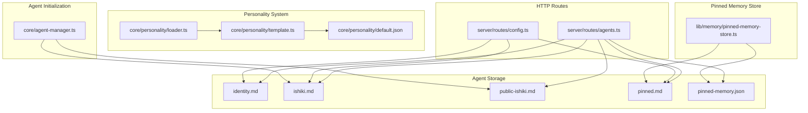
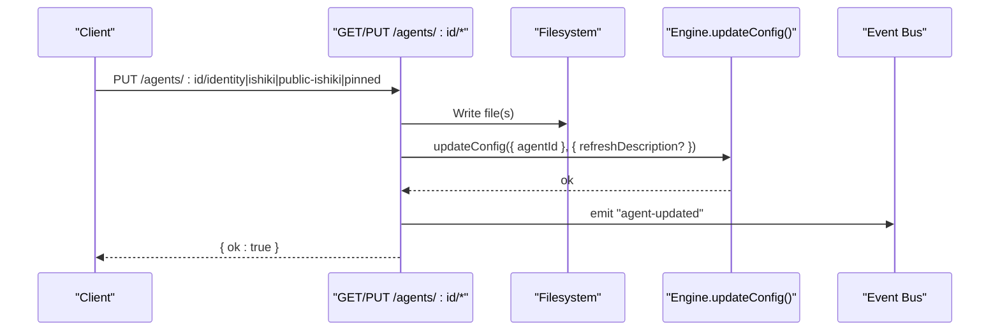
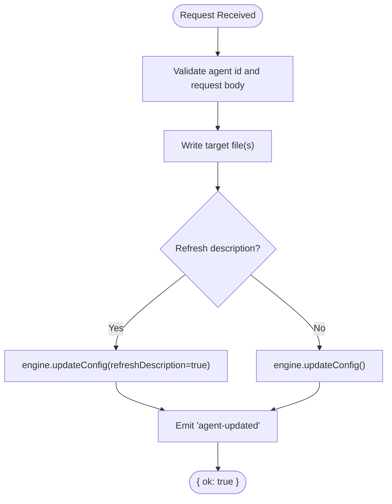
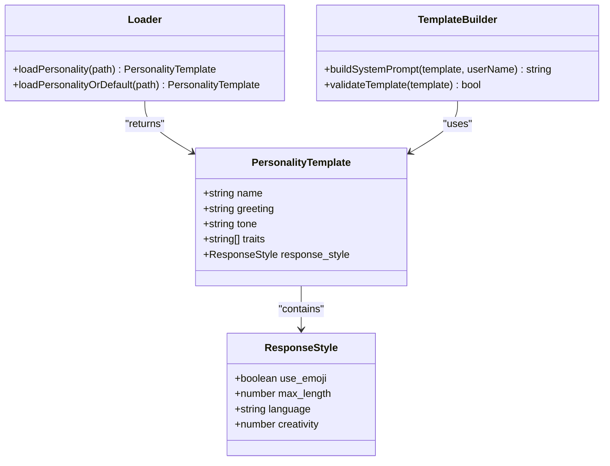
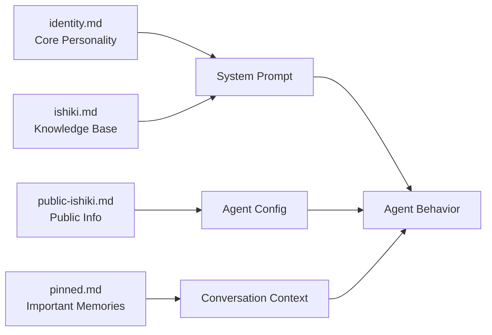

# Agent Personality & Identity API

<cite>
**Referenced Files in This Document**
- [agents.ts](file://server/routes/agents.ts)
- [config.ts](file://server/routes/config.ts)
- [pinned-memory-store.ts](file://lib/memory/pinned-memory-store.ts)
- [agent-manager.ts](file://core/agent-manager.ts)
- [loader.ts](file://core/personality/loader.ts)
- [template.ts](file://core/personality/template.ts)
- [default.json](file://core/personality/default.json)
</cite>

## Table of Contents
1. [Introduction](#introduction)
2. [Project Structure](#project-structure)
3. [Core Components](#core-components)
4. [Architecture Overview](#architecture-overview)
5. [Detailed Component Analysis](#detailed-component-analysis)
6. [Dependency Analysis](#dependency-analysis)
7. [Performance Considerations](#performance-considerations)
8. [Troubleshooting Guide](#troubleshooting-guide)
9. [Conclusion](#conclusion)
10. [Appendices](#appendices)

## Introduction
This document provides detailed API documentation for agent personality and identity management endpoints. It covers GET/PUT operations for:
- identity.md (core personality)
- ishiki.md (knowledge base)
- public-ishiki.md (public-facing info)
- pinned.md (important memories)

It also explains how these files relate to each other, how changes affect agent behavior, content formats, templates, and real-time update mechanisms.

## Project Structure
The relevant endpoints are implemented under server routes and use per-agent directories to persist markdown files. The pinned memory system uses both a JSON store and a Markdown representation for compatibility and persistence.

**Diagram sources**
- [agents.ts:620-766](file://server/routes/agents.ts#L620-L766)
- [config.ts:428-555](file://server/routes/config.ts#L428-L555)
- [pinned-memory-store.ts:1-198](file://lib/memory/pinned-memory-store.ts#L1-L198)
- [agent-manager.ts:634-664](file://core/agent-manager.ts#L634-L664)
- [loader.ts:1-33](file://core/personality/loader.ts#L1-L33)
- [template.ts:1-124](file://core/personality/template.ts#L1-L124)
- [default.json:1-19](file://core/personality/default.json#L1-L19)

**Section sources**
- [agents.ts:620-766](file://server/routes/agents.ts#L620-L766)
- [config.ts:428-555](file://server/routes/config.ts#L428-L555)
- [pinned-memory-store.ts:1-198](file://lib/memory/pinned-memory-store.ts#L1-L198)
- [agent-manager.ts:634-664](file://core/agent-manager.ts#L634-L664)
- [loader.ts:1-33](file://core/personality/loader.ts#L1-L33)
- [template.ts:1-124](file://core/personality/template.ts#L1-L124)
- [default.json:1-19](file://core/personality/default.json#L1-L19)

## Core Components
- Identity (identity.md): Defines the agent’s core personality and persona. Updates trigger a system prompt refresh.
- Ishiki (ishiki.md): Knowledge base used to inform responses. Updates trigger a system prompt refresh.
- Public Ishiki (public-ishiki.md): Public-facing information about the agent. Updates do not force a full description refresh but still reconfigure the agent.
- Pinned (pinned.md): Important memories persisted as a list; stored via a JSON-backed store that renders pinned.md.

Behavioral impact:
- Changes to identity.md and ishiki.md cause the engine to rebuild the system prompt so new personality/knowledge is applied immediately.
- Changes to public-ishiki.md update configuration without forcing a full description refresh.
- Changes to pinned.md influence what important facts are injected into context during conversations.

**Section sources**
- [agents.ts:620-766](file://server/routes/agents.ts#L620-L766)
- [config.ts:428-555](file://server/routes/config.ts#L428-L555)
- [pinned-memory-store.ts:1-198](file://lib/memory/pinned-memory-store.ts#L1-L198)

## Architecture Overview
The HTTP layer persists markdown files to the agent directory and then instructs the engine to reload configuration. For pinned memories, a structured store manages items and renders pinned.md.

**Diagram sources**
- [agents.ts:634-766](file://server/routes/agents.ts#L634-L766)

## Detailed Component Analysis

### Endpoint: GET /agents/:id/identity
- Purpose: Read the current identity.md content for an agent.
- Path parameters: id (string)
- Response:
  - 200 OK: { content: string }
  - 404 Not Found: if agent does not exist
  - 500 Internal Server Error: on filesystem or unexpected errors
- Behavior: If identity.md does not exist, returns empty content.

**Section sources**
- [agents.ts:620-632](file://server/routes/agents.ts#L620-L632)

### Endpoint: PUT /agents/:id/identity
- Purpose: Update identity.md with new personality content.
- Path parameters: id (string)
- Request body:
  - content: string (required)
- Response:
  - 200 OK: { ok: true }
  - 400 Bad Request: if content is not a string
  - 404 Not Found: if agent does not exist
  - 500 Internal Server Error: on filesystem or unexpected errors
- Side effects:
  - Writes identity.md
  - Invalidates agent list cache
  - Calls engine.updateConfig with refreshDescription=true to rebuild system prompt
  - Emits "agent-updated" event

**Section sources**
- [agents.ts:634-653](file://server/routes/agents.ts#L634-L653)

### Endpoint: GET /agents/:id/ishiki
- Purpose: Read the current ishiki.md knowledge base.
- Path parameters: id (string)
- Response:
  - 200 OK: { content: string }
  - 404 Not Found: if agent does not exist
  - 500 Internal Server Error: on filesystem or unexpected errors
- Behavior: If ishiki.md does not exist, returns empty content.

**Section sources**
- [agents.ts:659-671](file://server/routes/agents.ts#L659-L671)

### Endpoint: PUT /agents/:id/ishiki
- Purpose: Update ishiki.md knowledge base.
- Path parameters: id (string)
- Request body:
  - content: string (required)
- Response:
  - 200 OK: { ok: true }
  - 400 Bad Request: if content is not a string
  - 404 Not Found: if agent does not exist
  - 500 Internal Server Error: on filesystem or unexpected errors
- Side effects:
  - Writes ishiki.md
  - Calls engine.updateConfig with refreshDescription=true
  - Emits "agent-updated" event

**Section sources**
- [agents.ts:673-691](file://server/routes/agents.ts#L673-L691)

### Endpoint: GET /agents/:id/public-ishiki
- Purpose: Read public-ishiki.md public-facing information.
- Path parameters: id (string)
- Response:
  - 200 OK: { content: string }
  - 404 Not Found: if agent does not exist
  - 500 Internal Server Error: on filesystem or unexpected errors
- Behavior: If public-ishiki.md does not exist, returns empty content.

**Section sources**
- [agents.ts:697-709](file://server/routes/agents.ts#L697-L709)

### Endpoint: PUT /agents/:id/public-ishiki
- Purpose: Update public-ishiki.md public-facing information.
- Path parameters: id (string)
- Request body:
  - content: string (required)
- Response:
  - 200 OK: { ok: true }
  - 400 Bad Request: if content is not a string
  - 404 Not Found: if agent does not exist
  - 500 Internal Server Error: on filesystem or unexpected errors
- Side effects:
  - Writes public-ishiki.md
  - Calls engine.updateConfig (without refreshDescription flag)
  - Emits "agent-updated" event

**Section sources**
- [agents.ts:711-729](file://server/routes/agents.ts#L711-L729)

### Endpoint: GET /agents/:id/pinned
- Purpose: Read pinned.md as an array of strings.
- Path parameters: id (string)
- Response:
  - 200 OK: { pins: string[] }
  - 404 Not Found: if agent does not exist
  - 500 Internal Server Error: on filesystem or unexpected errors
- Behavior: Reads from the pinned memory store which maintains pinned.md and pinned-memory.json.

**Section sources**
- [agents.ts:735-746](file://server/routes/agents.ts#L735-L746)
- [pinned-memory-store.ts:130-138](file://lib/memory/pinned-memory-store.ts#L130-L138)

### Endpoint: PUT /agents/:id/pinned
- Purpose: Replace pinned.md contents with provided array of strings.
- Path parameters: id (string)
- Request body:
  - pins: string[] (required)
- Response:
  - 200 OK: { ok: true }
  - 400 Bad Request: if pins is not an array
  - 404 Not Found: if agent does not exist
  - 500 Internal Server Error: on filesystem or unexpected errors
- Side effects:
  - Replaces pinned.md via store
  - Calls engine.updateConfig
  - Emits "agent-updated" event

**Section sources**
- [agents.ts:748-766](file://server/routes/agents.ts#L748-L766)
- [pinned-memory-store.ts:188-198](file://lib/memory/pinned-memory-store.ts#L188-L198)

### Legacy Per-Agent Endpoints (current active agent)
These endpoints operate on the currently active agent rather than specifying an ID.

- GET /api/identity
- PUT /api/identity
- GET /api/ishiki
- PUT /api/ishiki
- GET /api/pinned
- PUT /api/pinned

All behave similarly to their /agents/:id counterparts, resolving the active agent and triggering updates accordingly.

**Section sources**
- [config.ts:428-555](file://server/routes/config.ts#L428-L555)

## Dependency Analysis
- File persistence: All endpoints write directly to the agent directory using Node.js filesystem APIs.
- Configuration reload: After writes, endpoints call engine.updateConfig with optional refreshDescription to rebuild system prompts when necessary.
- Eventing: Many endpoints emit "agent-updated" events to notify clients or subsystems.
- Pinned memory store: Uses a dual-file approach—JSON store for structured data and pinned.md for human-readable format.

**Diagram sources**
- [agents.ts:634-766](file://server/routes/agents.ts#L634-L766)
- [config.ts:428-555](file://server/routes/config.ts#L428-L555)

**Section sources**
- [agents.ts:620-766](file://server/routes/agents.ts#L620-L766)
- [config.ts:428-555](file://server/routes/config.ts#L428-L555)

## Performance Considerations
- File I/O: Each update performs synchronous or asynchronous file writes depending on implementation; ensure minimal payload sizes for frequent updates.
- Prompt rebuild: Refreshing descriptions can be expensive; prefer batching updates where possible.
- Pinned memory store: Maintains two files; replacing pins triggers atomic writes to both pinned.md and pinned-memory.json.

[No sources needed since this section provides general guidance]

## Troubleshooting Guide
Common issues and resolutions:
- 404 Not Found: Ensure the agent exists before calling endpoints.
- 400 Bad Request: Verify request bodies match expected types (content must be string; pins must be array).
- 500 Internal Server Error: Check filesystem permissions and disk space. Review logs for specific error messages.
- Real-time updates: Clients should listen for "agent-updated" events to reflect changes promptly.

**Section sources**
- [agents.ts:620-766](file://server/routes/agents.ts#L620-L766)
- [config.ts:428-555](file://server/routes/config.ts#L428-L555)

## Conclusion
The API provides straightforward GET/PUT endpoints to manage agent identity, knowledge, public information, and pinned memories. Updates to identity and knowledge trigger immediate system prompt rebuilds, while public information updates adjust configuration without full prompt refresh. Pinned memories are managed through a robust store that keeps both machine-readable and human-readable formats in sync.

[No sources needed since this section summarizes without analyzing specific files]

## Appendices

### Content Format Specifications
- identity.md: Free-form Markdown describing the agent’s persona and behavior guidelines.
- ishiki.md: Free-form Markdown representing the agent’s knowledge base.
- public-ishiki.md: Free-form Markdown for public-facing details about the agent.
- pinned.md: List of important memories rendered as bullet points; internally managed by the pinned memory store.

**Section sources**
- [pinned-memory-store.ts:57-63](file://lib/memory/pinned-memory-store.ts#L57-L63)

### Personality Templates and Behavior
Personality templates define name, greeting, tone, traits, and response style. The system builds a system prompt from the template, influencing language, length, emoji usage, creativity, and tool discipline.

**Diagram sources**
- [loader.ts:1-33](file://core/personality/loader.ts#L1-L33)
- [template.ts:1-124](file://core/personality/template.ts#L1-L124)
- [default.json:1-19](file://core/personality/default.json#L1-L19)

**Section sources**
- [loader.ts:1-33](file://core/personality/loader.ts#L1-L33)
- [template.ts:1-124](file://core/personality/template.ts#L1-L124)
- [default.json:1-19](file://core/personality/default.json#L1-L19)

### Relationship Between Identity, Ishiki, Public Ishiki, and Pinned
- Identity (identity.md): Core personality shaping tone, traits, and behavioral rules.
- Ishiki (ishiki.md): Knowledge base augmenting factual understanding.
- Public Ishiki (public-ishiki.md): Public-facing profile and disclosures.
- Pinned (pinned.md): High-importance facts retained across sessions.

**Diagram sources**
- [agents.ts:620-766](file://server/routes/agents.ts#L620-L766)
- [config.ts:428-555](file://server/routes/config.ts#L428-L555)
- [pinned-memory-store.ts:1-198](file://lib/memory/pinned-memory-store.ts#L1-L198)

**Section sources**
- [agents.ts:620-766](file://server/routes/agents.ts#L620-L766)
- [config.ts:428-555](file://server/routes/config.ts#L428-L555)
- [pinned-memory-store.ts:1-198](file://lib/memory/pinned-memory-store.ts#L1-L198)

### Real-Time Updates
After successful updates, endpoints emit "agent-updated" events. Clients should subscribe to these events to refresh UI state or re-fetch updated content.

**Section sources**
- [agents.ts:648-649](file://server/routes/agents.ts#L648-L649)
- [agents.ts:686-687](file://server/routes/agents.ts#L686-L687)
- [agents.ts:724-725](file://server/routes/agents.ts#L724-L725)
- [agents.ts:761-762](file://server/routes/agents.ts#L761-L762)

### Example Usage Patterns
- Updating identity: Send a PUT request with a new Markdown personality description; expect a prompt rebuild and an "agent-updated" event.
- Updating knowledge: Send a PUT request with new ishiki content; expect a prompt rebuild and an "agent-updated" event.
- Updating public info: Send a PUT request with public-facing Markdown; expect config update and an "agent-updated" event.
- Managing pinned memories: Send a PUT request with an array of strings; expect pinned.md and pinned-memory.json to be synchronized and an "agent-updated" event.

[No sources needed since this section provides general guidance]