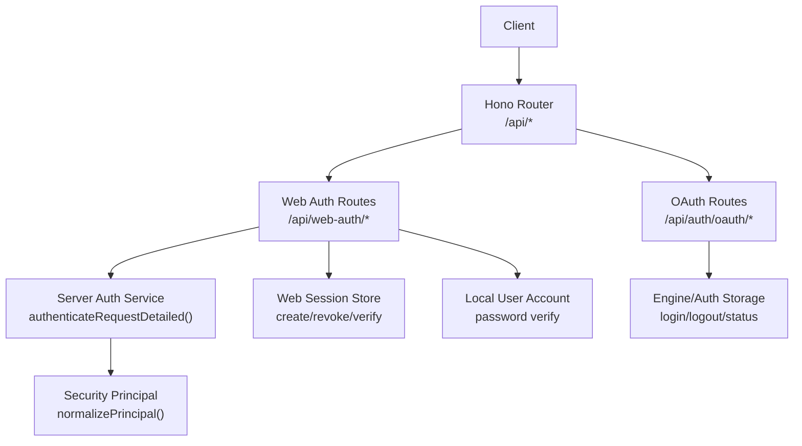

# Authentication API

<cite>
**Referenced Files in This Document**
- [server/index.ts](file://server/index.ts)
- [server/routes/web-auth.ts](file://server/routes/web-auth.ts)
- [server/routes/auth.ts](file://server/routes/auth.ts)
- [core/server-auth.ts](file://core/server-auth.ts)
- [core/local-user-account.ts](file://core/local-user-account.ts)
- [core/web-session-store.ts](file://core/web-session-store.ts)
- [server/http/route-security.ts](file://server/http/route-security.ts)
- [server/http/capability-guard.ts](file://server/http/capability-guard.ts)
</cite>

## Table of Contents
1. Introduction
2. Project Structure
3. Core Components
4. Architecture Overview
5. Detailed Component Analysis
6. Dependency Analysis
7. Performance Considerations
8. Troubleshooting Guide
9. Conclusion

## Introduction
This document provides detailed API documentation for OpenShadow’s authentication endpoints, covering:
- Web session-based login/logout and session management
- OAuth provider authentication flows (authorization code and device code)
- Token usage patterns and security considerations
- Request/response schemas with TypeScript interfaces
- Parameter validation rules and status codes
- Error responses and best practices

OpenShadow supports two primary authentication mechanisms:
- Web sessions via HTTP cookies for browser-based clients
- Bearer tokens (device credentials or loopback token) for programmatic access

OAuth is supported for third-party providers through a server-managed flow that returns an authorization URL and optional instructions, with polling or callback submission to complete the process.

## Project Structure
Authentication-related routes are mounted under /api and include:
- Web auth endpoints for login, session check, and logout
- OAuth endpoints for starting, completing, and polling provider authentication
- Server-side authentication service used by middleware to validate requests



**Diagram sources**
- [server/index.ts:164-228](file://server/index.ts#L164-L228)
- [server/routes/web-auth.ts:32-92](file://server/routes/web-auth.ts#L32-L92)
- [server/routes/auth.ts:60-238](file://server/routes/auth.ts#L60-L238)
- [core/server-auth.ts:35-90](file://core/server-auth.ts#L35-L90)
- [core/web-session-store.ts:31-90](file://core/web-session-store.ts#L31-L90)
- [core/local-user-account.ts:88-111](file://core/local-user-account.ts#L88-L111)

**Section sources**
- [server/index.ts:164-228](file://server/index.ts#L164-L228)

## Core Components
- Web Auth Route: Provides login, session verification, and logout using cookie-based sessions.
- OAuth Route: Manages provider authentication flows (start, callback/poll, status, logout).
- Server Auth Service: Centralized authentication logic supporting bearer tokens, query tokens (local only), and web sessions.
- Web Session Store: Creates, verifies, and revokes web sessions stored on disk.
- Local User Account: Password hashing and verification for local account login.
- Security Policy: Classifies routes and enforces scopes and principal constraints.

Key responsibilities:
- Validate request inputs and enforce connection kind constraints
- Issue and manage short-lived web sessions
- Support Bearer token authentication for device credentials and loopback token
- Provide OAuth orchestration for external providers

**Section sources**
- [server/routes/web-auth.ts:32-92](file://server/routes/web-auth.ts#L32-L92)
- [server/routes/auth.ts:60-238](file://server/routes/auth.ts#L60-L238)
- [core/server-auth.ts:35-90](file://core/server-auth.ts#L35-L90)
- [core/web-session-store.ts:31-90](file://core/web-session-store.ts#L31-L90)
- [core/local-user-account.ts:88-111](file://core/local-user-account.ts#L88-L111)
- [server/http/route-security.ts:29-80](file://server/http/route-security.ts#L29-L80)

## Architecture Overview
The authentication architecture integrates three layers:
- HTTP routes handling client requests
- Authentication service validating credentials and producing principals
- Persistence stores for sessions and user credentials

```mermaid
sequenceDiagram
participant C as "Client"
participant R as "Web Auth Route"
participant S as "Server Auth Service"
participant WS as "Web Session Store"
participant LU as "Local User Account"
C->>R : POST /api/web-auth/login {credential? | username,password}
alt credential provided
R->>S : authenticateToken(credential)
S-->>R : principal or null
else password login
R->>LU : verifyLocalAccountPassword(username,password)
LU-->>R : ok + userId
R->>S : create principal from verified account
end
R->>WS : createWebSession(principal, ttlMs)
WS-->>R : secret, expiresAt
R-->>C : Set-Cookie hana_session=secret; ok=true; expiresAt; principal
```

**Diagram sources**
- [server/routes/web-auth.ts:32-68](file://server/routes/web-auth.ts#L32-L68)
- [core/server-auth.ts:92-97](file://core/server-auth.ts#L92-L97)
- [core/web-session-store.ts:31-64](file://core/web-session-store.ts#L31-L64)
- [core/local-user-account.ts:88-111](file://core/local-user-account.ts#L88-L111)

## Detailed Component Analysis

### Web Auth Endpoints
Endpoints:
- POST /api/web-auth/login
- GET /api/web-auth/session
- POST /api/web-auth/logout

Behavior:
- Login accepts either a bearer credential or username/password. If credential is provided, it is validated via the server auth service. If username/password is provided, local account verification is performed. On success, a web session is created and returned with a Set-Cookie header.
- Session checks the current cookie and returns authenticated state and sanitized principal.
- Logout revokes the current session and clears the cookie.

Request/Response Schemas (TypeScript):
```typescript
interface WebAuthLoginRequest {
  credential?: string;
  username?: string;
  password?: string;
  clientKind?: string;
}

interface WebAuthLoginResponse {
  ok: boolean;
  expiresAt: string;
  principal: SanitizedPrincipal;
}

interface WebAuthSessionResponse {
  authenticated: boolean;
  principal: SanitizedPrincipal | null;
}

interface WebAuthLogoutResponse {
  ok: boolean;
}

interface SanitizedPrincipal {
  kind: string | null;
  credentialKind: string | null;
  connectionKind: string | null;
  trustState: string | null;
  serverId: string | null;
  serverNodeId: string | null;
  userId: string | null;
  studioId: string | null;
  deviceId: string | null;
  credentialId: string | null;
  platformAccountId: string | null;
  officialServiceKind: string | null;
  authMethod: string | null;
  scopes: string[];
}
```

Parameter Validation Rules:
- credential: optional string; if present, treated as bearer token
- username/password: both required together; password login requires secure context (HTTPS) when connectionKind is not local
- clientKind: optional; influences default scopes

Status Codes:
- 200 OK on successful login/session/logout
- 400 Bad Request for missing or invalid parameters
- 403 Forbidden when forbidden or insufficient scope

Cookie Details:
- Name: hana_session
- Attributes: Path=/, HttpOnly, SameSite=Strict, Max-Age=<seconds>, Secure (optional)

Examples:
- Login with credential:
  - Request: POST /api/web-auth/login {"credential": "<token>"}
  - Response: 200 {"ok": true, "expiresAt": "...", "principal": {...}}
  - Cookie: Set-Cookie hana_session=<secret>; Path=/; HttpOnly; SameSite=Strict; Max-Age=...; Secure
- Login with password:
  - Request: POST /api/web-auth/login {"username": "...", "password": "..."}
  - Response: 200 {"ok": true, "expiresAt": "...", "principal": {...}}
  - Cookie: Set-Cookie hana_session=<secret>; ...
- Check session:
  - Request: GET /api/web-auth/session (with cookie)
  - Response: 200 {"authenticated": true, "principal": {...}}
- Logout:
  - Request: POST /api/web-auth/logout (with cookie)
  - Response: 200 {"ok": true}
  - Cookie: Set-Cookie hana_session=; Path=/; HttpOnly; SameSite=Strict; Max-Age=0; Secure

Error Responses:
- 400 {"error": "credential_required"}
- 400 {"error": "password_login_requires_secure_context"}
- 403 {"error": "forbidden"}

Security Considerations:
- Passwords are verified against scrypt-sha256 hashes with timing-safe comparison
- Web sessions are hashed and stored on disk; secrets are never exposed
- Secure flag on cookie is configurable based on environment

**Section sources**
- [server/routes/web-auth.ts:32-92](file://server/routes/web-auth.ts#L32-L92)
- [core/local-user-account.ts:88-111](file://core/local-user-account.ts#L88-L111)
- [core/web-session-store.ts:31-90](file://core/web-session-store.ts#L31-L90)

### OAuth Endpoints
Endpoints:
- POST /api/auth/oauth/start
- POST /api/auth/oauth/callback
- GET /api/auth/oauth/poll/:sessionId
- GET /api/auth/oauth/status
- POST /api/auth/oauth/logout
- GET /api/auth/oauth/:provider/custom-models
- POST /api/auth/oauth/:provider/custom-models
- DELETE /api/auth/oauth/:provider/custom-models/:modelId

Behavior:
- Start initiates an OAuth flow for a specified provider and returns a sessionId, authorization URL, and optional instructions (user_code for device code flow). Some providers use a callback server and indicate polling mode.
- Callback submits an authorization code for authorization code flow; server completes login and triggers model sync.
- Polling checks the status of device code flow until done or error.
- Status lists provider login states and available model counts.
- Logout clears provider credentials.
- Custom models CRUD allows adding/removing provider-specific models.

Request/Response Schemas (TypeScript):
```typescript
interface OAuthStartRequest {
  provider: string;
}

interface OAuthStartResponse {
  sessionId: string;
  url: string;
  instructions?: string;
  polling?: boolean;
}

interface OAuthCallbackRequest {
  sessionId: string;
  code: string;
}

interface OAuthCallbackResponse {
  ok: boolean;
}

interface OAuthPollResponse {
  status: "pending" | "done" | "error";
  error?: string;
}

interface OAuthStatusResponse {
  [providerId: string]: {
    name: string;
    loggedIn: boolean;
    modelCount: number;
  };
}

interface OAuthLogoutRequest {
  provider: string;
}

interface OAuthLogoutResponse {
  ok: boolean;
}

interface OAuthCustomModelsListResponse {
  models: string[];
}

interface OAuthAddCustomModelRequest {
  modelId: string;
}

interface OAuthAddCustomModelResponse {
  ok: boolean;
  models: string[];
}

interface OAuthDeleteCustomModelResponse {
  ok: boolean;
  models: string[];
}
```

Parameter Validation Rules:
- provider: required string for start/logout; must match known provider IDs
- sessionId: required string for callback/poll; must correspond to a pending flow
- code: required string for callback; submitted to resolve the authorization code promise
- modelId: required non-empty string for add/delete custom models

Status Codes:
- 200 OK on successful operations
- 400 Bad Request for missing or invalid parameters or no pending flow
- 500 Internal Server Error for unexpected failures

Examples:
- Start OAuth:
  - Request: POST /api/auth/oauth/start {"provider": "anthropic"}
  - Response: 200 {"sessionId": "...", "url": "...", "instructions": "..."}
- Submit code:
  - Request: POST /api/auth/oauth/callback {"sessionId": "...", "code": "..."}
  - Response: 200 {"ok": true}
- Poll status:
  - Request: GET /api/auth/oauth/poll/:sessionId
  - Response: 200 {"status": "done"}
- Status overview:
  - Request: GET /api/auth/oauth/status
  - Response: 200 {"anthropic": {"name": "...", "loggedIn": true, "modelCount": N}, ...}
- Logout:
  - Request: POST /api/auth/oauth/logout {"provider": "anthropic"}
  - Response: 200 {"ok": true}
- Add custom model:
  - Request: POST /api/auth/oauth/openai-codex/custom-models {"modelId": "gpt-4o"}
  - Response: 200 {"ok": true, "models": ["gpt-4o"]}

Error Responses:
- 400 {"error": "provider is required"}
- 400 {"error": "No pending login flow"}
- 200 {"status": "error", "error": "diagnosed message"}

Security Considerations:
- Pending flows are cleaned up after timeouts
- Provider callback server support avoids exposing user_code in UI when not needed
- Post-login model synchronization may fail independently without affecting login result

**Section sources**
- [server/routes/auth.ts:60-238](file://server/routes/auth.ts#L60-L238)

### Token Usage Patterns
Bearer Tokens:
- Use Authorization: Bearer <token> header
- Tokens can be device credentials or loopback token
- Loopback token is restricted to local connections
- Query parameter token is allowed only for local connections and when explicitly permitted

Web Sessions:
- After login, the server sets a cookie named hana_session
- Subsequent requests should include the cookie header
- Sessions have TTL and are persisted on disk with hashed secrets

Refresh Token Flow:
- Not implemented in this repository; web sessions expire after TTL and require re-login
- For long-lived access, issue new device credentials via access endpoints

Example Requests:
- Bearer token:
  - Header: Authorization: Bearer <device_credential>
- Web session:
  - Header: Cookie: hana_session=<secret>

**Section sources**
- [core/server-auth.ts:35-90](file://core/server-auth.ts#L35-L90)
- [core/web-session-store.ts:66-90](file://core/web-session-store.ts#L66-L90)

### Security Considerations
Password Hashing:
- Algorithm: scrypt-sha256 with salt and configurable parameters
- Verification uses timing-safe comparison to prevent timing attacks

Token Expiration:
- Web sessions have a default TTL of 14 days
- Expired sessions are marked and rejected

Rate Limiting:
- No explicit rate limiting middleware is applied to authentication endpoints in this repository
- Implement at reverse proxy or gateway layer if needed

Connection Kind Constraints:
- Password login requires HTTPS unless connectionKind is local
- Loopback token requires local transport
- Device credentials allow lan or tunnel depending on trust state

Scope Enforcement:
- Route classification determines required scopes
- Local owner principal bypasses most restrictions

**Section sources**
- [core/local-user-account.ts:225-233](file://core/local-user-account.ts#L225-L233)
- [core/web-session-store.ts:77-90](file://core/web-session-store.ts#L77-L90)
- [server/http/route-security.ts:29-80](file://server/http/route-security.ts#L29-L80)
- [server/routes/web-auth.ts:105-107](file://server/routes/web-auth.ts#L105-L107)

## Dependency Analysis
Authentication components interact as follows:
- Web Auth Route depends on Server Auth Service and Web Session Store
- OAuth Route depends on Engine/Auth Storage for provider login/logout/status
- Server Auth Service normalizes principals and validates credentials
- Security Policy classifies routes and enforces scopes

```mermaid
classDiagram
class WebAuthRoute {
+POST "/web-auth/login"
+GET "/web-auth/session"
+POST "/web-auth/logout"
}
class OAuthRoute {
+POST "/auth/oauth/start"
+POST "/auth/oauth/callback"
+GET "/auth/oauth/poll/ : sessionId"
+GET "/auth/oauth/status"
+POST "/auth/oauth/logout"
+CRUD "/auth/oauth/ : provider/custom-models"
}
class ServerAuthService {
+authenticateRequestDetailed(input)
+authenticateToken(token, options)
}
class WebSessionStore {
+createWebSession(hanakoHome, input)
+authenticateWebSession(hanakoHome, cookieHeader, options)
+revokeWebSession(hanakoHome, cookieHeader, options)
}
class LocalUserAccount {
+verifyLocalAccountPassword(hanakoHome, params)
}
class SecurityPolicy {
+classifyHttpRoute({method,path})
+authorizeHttpRoute({method,path,principal})
}
WebAuthRoute --> ServerAuthService : "uses"
WebAuthRoute --> WebSessionStore : "creates/verifies"
WebAuthRoute --> LocalUserAccount : "verifies passwords"
OAuthRoute --> ServerAuthService : "indirectly via engine"
ServerAuthService --> SecurityPolicy : "normalizes principals"
```

**Diagram sources**
- [server/routes/web-auth.ts:32-92](file://server/routes/web-auth.ts#L32-L92)
- [server/routes/auth.ts:60-238](file://server/routes/auth.ts#L60-L238)
- [core/server-auth.ts:35-90](file://core/server-auth.ts#L35-L90)
- [core/web-session-store.ts:31-90](file://core/web-session-store.ts#L31-L90)
- [core/local-user-account.ts:88-111](file://core/local-user-account.ts#L88-L111)
- [server/http/route-security.ts:29-80](file://server/http/route-security.ts#L29-L80)

**Section sources**
- [server/index.ts:164-228](file://server/index.ts#L164-L228)

## Performance Considerations
- Web session creation and verification involve file I/O; consider caching strategies if high throughput is expected
- OAuth polling introduces repeated requests; implement client-side backoff and jitter
- Password hashing uses scrypt with moderate cost; ensure CPU resources are adequate during peak login times

[No sources needed since this section provides general guidance]

## Troubleshooting Guide
Common Issues:
- Missing credential: Ensure Authorization header or cookie is included
- Password login requires secure context: Use HTTPS for remote connections
- No pending login flow: Verify sessionId and that the flow has not expired
- Insufficient scope: Check route policy and principal scopes

Diagnostic Steps:
- Check session expiration and revoke old sessions
- Validate provider configuration and network connectivity for OAuth
- Review security audit logs for denied actions

**Section sources**
- [server/routes/web-auth.ts:105-107](file://server/routes/web-auth.ts#L105-L107)
- [server/routes/auth.ts:152-172](file://server/routes/auth.ts#L152-L172)
- [server/http/route-security.ts:29-80](file://server/http/route-security.ts#L29-L80)

## Conclusion
OpenShadow’s authentication system provides robust support for web sessions and OAuth provider integration. It emphasizes secure password storage, strict connection kind enforcement, and clear scope-based authorization. While refresh tokens are not implemented, web sessions offer practical session management with configurable TTL. For production deployments, consider adding rate limiting and monitoring around authentication endpoints.

[No sources needed since this section summarizes without analyzing specific files]