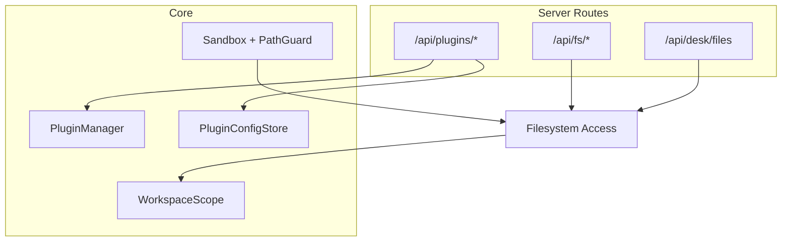
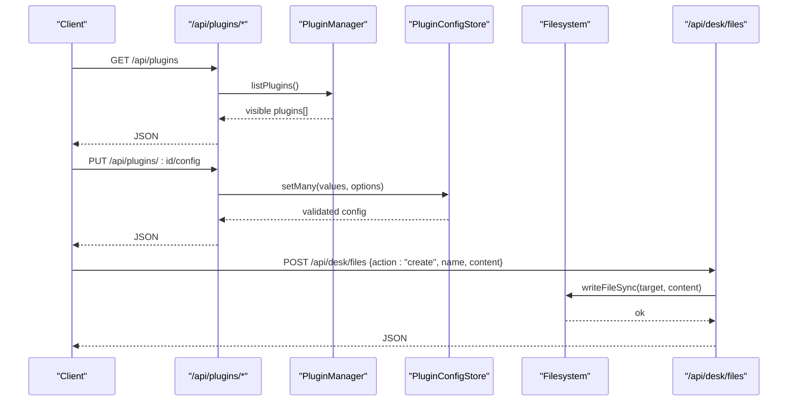
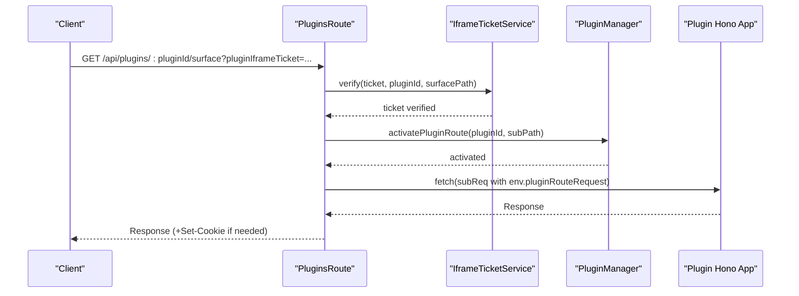
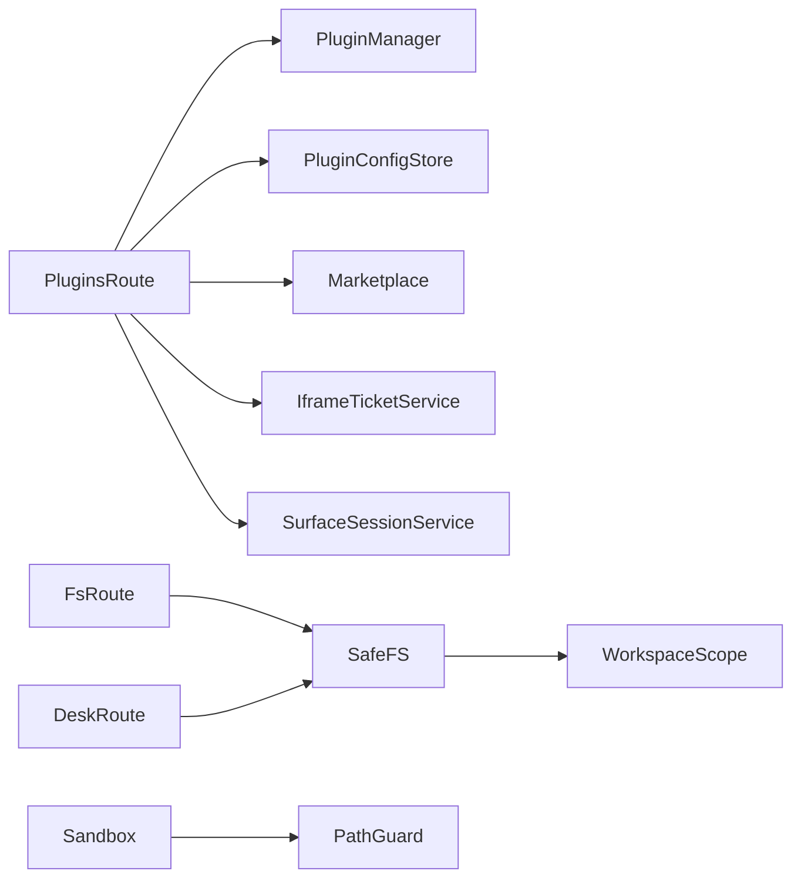

# Plugin & Workspace API

<cite>
**Referenced Files in This Document**
- [plugins.ts](file://server/routes/plugins.ts)
- [plugin-manager.ts](file://core/plugin-manager.ts)
- [plugin-config.ts](file://core/plugin-config.ts)
- [fs.ts](file://server/routes/fs.ts)
- [desk.ts](file://server/routes/desk.ts)
- [workspace-scope.ts](file://core/shared/workspace-scope.ts)
- [sandbox.ts](file://core/sandbox/sandbox.ts)
- [path-guard.ts](file://lib/sandbox/path-guard.ts)
</cite>

## Table of Contents
1. Introduction
2. Project Structure
3. Core Components
4. Architecture Overview
5. Detailed Component Analysis
6. Dependency Analysis
7. Performance Considerations
8. Troubleshooting Guide
9. Conclusion

## Introduction
This document provides detailed API documentation for plugin administration and workspace management endpoints exposed by the server. It covers:
- Plugin installation, configuration, tool registration, marketplace operations, and UI surface provisioning
- Workspace file operations (read, write, tree, upload, create, rename, move, remove)
- Request/response schemas using TypeScript interfaces
- Parameter validation rules and status codes
- Examples of plugin development workflow, workspace organization, file synchronization, and permission management
- Security boundaries and sandboxing policies applied to plugins and workspace operations

## Project Structure
The relevant server routes and core modules are organized as follows:
- Server HTTP routes under server/routes/ expose REST endpoints for plugin management and workspace operations
- Core plugin lifecycle and runtime under core/plugin-manager.ts
- Plugin configuration schema and persistence under core/plugin-config.ts
- File system access endpoints under server/routes/fs.ts
- Desk workspace file operations under server/routes/desk.ts
- Workspace scoping utilities under core/shared/workspace-scope.ts
- Sandbox execution environment under core/sandbox/sandbox.ts and lib/sandbox/path-guard.ts

**Diagram sources**
- [plugins.ts:786-1373](file://server/routes/plugins.ts#L786-L1373)
- [plugin-manager.ts:155-236](file://core/plugin-manager.ts#L155-L236)
- [plugin-config.ts:41-129](file://core/plugin-config.ts#L41-L129)
- [fs.ts:57-141](file://server/routes/fs.ts#L57-L141)
- [desk.ts:1318-1524](file://server/routes/desk.ts#L1318-L1524)
- [workspace-scope.ts:10-56](file://core/shared/workspace-scope.ts#L10-L56)
- [sandbox.ts:61-94](file://core/sandbox/sandbox.ts#L61-L94)
- [path-guard.ts:38-56](file://lib/sandbox/path-guard.ts#L38-L56)

**Section sources**
- [plugins.ts:786-1373](file://server/routes/plugins.ts#L786-L1373)
- [plugin-manager.ts:155-236](file://core/plugin-manager.ts#L155-L236)
- [plugin-config.ts:41-129](file://core/plugin-config.ts#L41-L129)
- [fs.ts:57-141](file://server/routes/fs.ts#L57-L141)
- [desk.ts:1318-1524](file://server/routes/desk.ts#L1318-L1524)
- [workspace-scope.ts:10-56](file://core/shared/workspace-scope.ts#L10-L56)
- [sandbox.ts:61-94](file://core/sandbox/sandbox.ts#L61-L94)
- [path-guard.ts:38-56](file://lib/sandbox/path-guard.ts#L38-L56)

## Core Components
- Plugin Manager: Scans, loads, activates, and manages plugins; exposes tools, commands, pages, widgets, settings tabs, providers, and route apps.
- Plugin Config Store: Validates and persists plugin configuration with scoped storage (global, per-agent, per-session).
- File System Route: Provides safe read-only file access within allowed roots.
- Desk Workspace Route: Provides comprehensive file operations within approved directories.
- Workspace Scope: Normalizes primary CWD and workspace folders into a sandbox scope.
- Sandbox and Path Guard: Enforces path-based access levels and operation requirements.

**Section sources**
- [plugin-manager.ts:155-236](file://core/plugin-manager.ts#L155-L236)
- [plugin-config.ts:41-129](file://core/plugin-config.ts#L41-L129)
- [fs.ts:57-141](file://server/routes/fs.ts#L57-L141)
- [desk.ts:1318-1524](file://server/routes/desk.ts#L1318-L1524)
- [workspace-scope.ts:10-56](file://core/shared/workspace-scope.ts#L10-L56)
- [sandbox.ts:61-94](file://core/sandbox/sandbox.ts#L61-L94)
- [path-guard.ts:38-56](file://lib/sandbox/path-guard.ts#L38-L56)

## Architecture Overview
The plugin and workspace APIs follow a layered architecture:
- HTTP layer (Hono routes) validates inputs, enforces security, and delegates to core services
- Core services manage plugin lifecycle, configuration, and workspace scoping
- Sandbox and path guard enforce strict filesystem boundaries

**Diagram sources**
- [plugins.ts:817-826](file://server/routes/plugins.ts#L817-L826)
- [plugin-manager.ts:1087-1112](file://core/plugin-manager.ts#L1087-L1112)
- [plugin-config.ts:98-112](file://core/plugin-config.ts#L98-L112)
- [desk.ts:1385-1395](file://server/routes/desk.ts#L1385-L1395)

## Detailed Component Analysis

### Plugin Administration Endpoints
Base path: /api/plugins

- GET /api/plugins
  - Purpose: List visible plugins with optional source filter
  - Query params:
    - source?: "community" | "builtin"
  - Response: PluginInfo[]
  - Status codes: 200 OK

- GET /api/plugins/config-schemas
  - Purpose: Retrieve all plugin configuration schemas
  - Response: ConfigSchema[]
  - Status codes: 200 OK

- GET /api/plugins/event-bus/capabilities
  - Purpose: List event bus capabilities
  - Response: string[]
  - Status codes: 200 OK

- GET /api/plugins/diagnostics
  - Purpose: Aggregate diagnostics for plugins, event bus, tasks, schedules
  - Response: Diagnostics
  - Status codes: 200 OK

- GET /api/plugins/marketplace
  - Purpose: Load marketplace data with installability flags
  - Response: MarketplaceData
  - Status codes: 200 OK

- GET /api/plugins/marketplace/:id/readme
  - Purpose: Fetch README markdown for a marketplace plugin
  - Response: { pluginId: string; markdown: string }
  - Status codes: 200 OK, 404 Not Found, 500 Internal Error

- POST /api/plugins/marketplace/:id/install
  - Purpose: Install a marketplace plugin version
  - Body: { sessionPath?: string; version?: string; allowDowngrade?: boolean }
  - Response: InstalledPlugin
  - Status codes: 200 OK, 404 Not Found, 409 Conflict (incompatible/downgrade), 500 Internal Error

- POST /api/plugins/install
  - Purpose: Install from local path or zip
  - Body: { path: string; sessionPath?: string; allowDowngrade?: boolean }
  - Response: InstalledPlugin
  - Status codes: 200 OK, 400 Bad Request, 409 Conflict, 500 Internal Error

- DELETE /api/plugins/:id
  - Purpose: Remove a community plugin
  - Response: { ok: true }
  - Status codes: 200 OK, 404 Not Found, 500 Internal Error

- PUT /api/plugins/:id/enabled
  - Purpose: Enable/disable a community plugin
  - Body: { enabled: boolean }
  - Response: { ok: true }
  - Status codes: 200 OK, 404 Not Found, 500 Internal Error

- GET /api/plugins/settings
  - Purpose: Read global plugin settings (requires owner principal for paths)
  - Response: { allow_full_access: boolean; plugin_dev_tools_enabled: boolean; plugins_dir: string }
  - Status codes: 200 OK

- PUT /api/plugins/settings
  - Purpose: Update global plugin settings
  - Body: { allow_full_access?: boolean; plugin_dev_tools_enabled?: boolean }
  - Response: CommunityPluginInfo[]
  - Status codes: 200 OK, 500 Internal Error

- GET /api/plugins/pages
  - Purpose: Discover plugin pages
  - Response: PageInfo[]
  - Status codes: 200 OK

- GET /api/plugins/widgets
  - Purpose: Discover plugin widgets
  - Response: WidgetInfo[]
  - Status codes: 200 OK

- GET /api/plugins/ui-host-capabilities
  - Purpose: List granted UI host capabilities for active plugins
  - Response: UiHostCapabilityGrant[]
  - Status codes: 200 OK

- GET /api/plugins/settings-tabs
  - Purpose: List built-in settings tabs
  - Response: SettingsTabInfo[]
  - Status codes: 200 OK

- POST /api/plugins/iframe-ticket
  - Purpose: Issue iframe ticket and surface session for plugin UI surfaces
  - Body: { routeUrl: string }
  - Response: { ticket: string; ticketId: string; pluginId: string; surfacePath: string; expiresAt: string; surfaceSession: { token: string; expiresAt: string } }
  - Status codes: 200 OK, 400 Bad Request, 404 Not Found

- GET /api/plugins/theme.css
  - Purpose: Serve theme CSS for plugin iframes
  - Query params: theme?: string
  - Response: text/css
  - Status codes: 200 OK

- GET /api/plugins/:pluginId/assets/*
  - Purpose: Serve plugin assets with asset session cookie handling
  - Status codes: 200 OK, 404 Not Found

- ALL /api/plugins/:pluginId/*
  - Purpose: Proxy requests to plugin route app with request context injection and activation
  - Headers: X-Hana-Agent-Id (optional)
  - Query params: pluginIframeTicket?, hana-theme?, hana-css?
  - Response: Plugin-defined
  - Status codes: 200 OK, 404 Not Found, 400 Bad Request (ticket errors)

TypeScript Interfaces
- PluginInfo
  - id: string
  - name: string
  - version: string
  - pluginKey: string
  - description: string
  - status: string
  - shadowedBy: string | null
  - shadowedByPluginKey: string | null
  - shadows: string[]
  - activationState: string | null
  - activationEvents: string[]
  - activationError: string | null
  - source: string
  - trust: string
  - contributions: string[]
  - error: string | null

- ConfigSchema
  - pluginId: string
  - type: "object"
  - properties: Record<string, PropertyDef>
  - required: string[]
  - migrationVersion: number

- PropertyDef
  - type: "string" | "number" | "integer" | "boolean" | "object" | "array"
  - title: string
  - description: string
  - default: any
  - enum: any[] | undefined
  - scope: "global" | "per-agent" | "per-session"
  - sensitive: boolean
  - ui: object
  - reloadRequired: boolean
  - migrationVersion: number | undefined

- MarketplaceData
  - plugins: MarketplacePlugin[]
  - source?: { url?: string; path?: string }

- MarketplacePlugin
  - id: string
  - name: string
  - version: string
  - compatibility: Record<string, string>
  - distribution: Distribution | null
  - versions: VersionEntry[]
  - installed: boolean
  - canInstall: boolean
  - selectedVersion: string | null
  - compatible: boolean
  - downgrade: boolean

- Distribution
  - kind: "source" | "release"
  - path?: string
  - packageUrl?: string
  - sha256?: string

- VersionEntry
  - version: string
  - compatibility: Record<string, string>
  - distribution: Distribution | null

- InstalledPlugin
  - id: string
  - version: string
  - status: string
  - error?: string
  - sourceFile?: SessionFileRef

- PageInfo
  - pluginId: string
  - title: string
  - icon: string | null
  - routeUrl: string
  - hostCapabilities: string[]

- WidgetInfo
  - pluginId: string
  - title: string
  - icon: string | null
  - routeUrl: string
  - hostCapabilities: string[]

- UiHostCapabilityGrant
  - pluginId: string
  - pluginKey: string
  - source: string
  - hostCapabilities: string[]

- SettingsTabInfo
  - pluginId: string
  - id: string
  - title: string
  - icon: string | null
  - nativeComponent: string

Validation Rules
- Plugin ID must be a valid directory name; invalid names return 400
- Downgrade protection unless allowDowngrade is true
- Marketplace release requires https packageUrl and 64-char lowercase hex sha256
- Config updates validate against schema types, enums, scopes, and required fields
- Iframe ticket routeUrl must target /api/plugins/:pluginId/* and not host routes

Status Codes
- 200 OK on success
- 400 Bad Request for invalid inputs or tickets
- 404 Not Found for missing plugins or resources
- 409 Conflict for incompatible versions or downgrades
- 413 Payload Too Large for oversized releases
- 500 Internal Server Error for unexpected failures

Security Notes
- Host routes (/config, /config-schema) cannot be targeted by iframe tickets
- Asset session cookies are only issued when needed and never reissued from surface sessions
- Full-access plugins require explicit enablement and may be restricted by policy

**Section sources**
- [plugins.ts:786-1373](file://server/routes/plugins.ts#L786-L1373)
- [plugin-manager.ts:1087-1112](file://core/plugin-manager.ts#L1087-L1112)
- [plugin-config.ts:131-155](file://core/plugin-config.ts#L131-L155)

### Plugin Configuration API
Endpoints
- GET /api/plugins/:id/config-schema
  - Response: ConfigSchema | 404
- GET /api/plugins/:id/config
  - Query params: scope?, agentId?, sessionPath?
  - Response: { pluginId, pluginKey, source, schema, values } | 404
- PUT /api/plugins/:id/config
  - Body envelope: { values?: object; scope?: "global"|"per-agent"|"per-session"; agentId?: string; sessionPath?: string }
  - Alternative body: direct key-value pairs plus optional scope/agentId/sessionPath
  - Response: { pluginId, pluginKey, source, schema, values, rawValues } | 400 (validation errors) | 404

Validation Errors
- Code: PLUGIN_CONFIG_INVALID
- Fields array includes:
  - UNKNOWN_FIELD
  - WRONG_SCOPE
  - INVALID_ENUM
  - INVALID_TYPE

Example Flow
- Client reads schema, then sets values respecting scope and types
- Sensitive fields are redacted in responses

**Section sources**
- [plugins.ts:1101-1142](file://server/routes/plugins.ts#L1101-L1142)
- [plugin-config.ts:131-155](file://core/plugin-config.ts#L131-L155)

### Plugin Development Loop Endpoints
Endpoints
- POST /api/plugins/dev/install
  - Body: { sourcePath?: string; path?: string; pluginId?: string; allowFullAccess?: boolean }
  - Response: DevInstallResult
- POST /api/plugins/dev/:id/reload
  - Body: { devRunId?: string; allowFullAccess?: boolean }
  - Response: DevReloadResult
- PUT /api/plugins/dev/:id/enabled
  - Body: { enabled: boolean; devRunId?: string; allowFullAccess?: boolean }
  - Response: DevEnableDisableResult
- POST /api/plugins/dev/:id/reset
  - Body: { devRunId?: string; allowFullAccess?: boolean }
  - Response: DevResetResult
- DELETE /api/plugins/dev/:id
  - Body: { devRunId?: string }
  - Response: DevUninstallResult
- GET /api/plugins/dev/:id/scenarios
  - Response: { pluginId: string; scenarios: ScenarioInfo[] }
- POST /api/plugins/dev/:id/scenarios/:scenarioId/run
  - Body: { allowDestructive?: boolean }
  - Response: ScenarioRunResult
- POST /api/plugins/dev/:id/tools/:toolName/invoke
  - Body: { input?: object; sessionPath?: string; agentId?: string }
  - Response: ToolInvocationResult
- GET /api/plugins/dev/diagnostics
  - Query: pluginId?
  - Response: DevDiagnostics
- GET /api/plugins/dev/surfaces
  - Query: pluginId?
  - Response: SurfaceList
- POST /api/plugins/dev/surfaces/describe
  - Body: SurfaceDebugInput
  - Response: SurfaceDebugOutput

Notes
- Requires plugin dev service availability; otherwise returns 500 with code PLUGIN_DEV_SERVICE_UNAVAILABLE
- All dev endpoints normalize errors to { error, code? }

**Section sources**
- [plugins.ts:852-993](file://server/routes/plugins.ts#L852-L993)

### Workspace File Operations
Endpoints
- GET /api/fs/read
  - Query: path
  - Response: UTF-8 text or 404
  - Validation: path must resolve inside hanakoHome or desk home; symlinks rejected
  - Status: 200 OK, 400 Missing path, 403 Path not allowed, 404 Not found

- GET /api/fs/read-base64
  - Query: path
  - Response: base64 string or 404
  - Status: 200 OK, 400 Missing path, 403 Path not allowed, 404 Not found

- GET /api/fs/docx-html
  - Query: path
  - Response: HTML string or error
  - Constraints: file size ≤ 20MB; must be a file
  - Status: 200 OK, 400 Invalid, 403 Path not allowed, 404 Not found, 413 Too large, 500 Parse failed

- GET /api/fs/tree
  - Query: path, depth (default 3, clamped 1..10)
  - Response: { tree: TreeNode[] }
  - Status: 200 OK, 400 Invalid, 403 Path not allowed, 404 Not found, 500 Error

- POST /api/desk/files
  - Body: { action: "upload"|"create"|"mkdir"|"rename"|"move"|"movePaths"|"remove"; subdir?: string; dir?: string; agentId?: string; ... }
  - Actions:
    - upload: { paths: string[] } — copies absolute paths into desk; requires local owner principal
    - create: { name: string; content: string }
    - mkdir: { name: string }
    - rename: { oldName: string; newName: string }
    - move: { names: string[]; destFolder: string }
    - movePaths: { items: Array<{ sourceSubdir?: string; name: string }>; destSubdir: string }
    - remove: { name: string }
  - Responses include files listing or results arrays with per-item status
  - Status: 200 OK, 400 Validation failed, 403 Forbidden, 409 Conflict (exists), 500 Error

TypeScript Interfaces
- TreeNode
  - name: string
  - path: string
  - relativePath: string
  - isDirectory: boolean
  - children?: TreeNode[]

- WorkspaceActionBody
  - action: string
  - subdir?: string
  - dir?: string
  - agentId?: string
  - paths?: string[]
  - name?: string
  - content?: string
  - oldName?: string
  - newName?: string
  - names?: string[]
  - destFolder?: string
  - items?: Array<{ sourceSubdir?: string; name: string }>
  - destSubdir?: string
  - currentSubdir?: string

- WorkspaceActionResult
  - ok: boolean
  - results?: Array<{ src?: string; name?: string; error?: string; ok?: boolean; skipped?: boolean }>
  - files?: TreeNode[]
  - filesByPath?: Record<string, TreeNode[]>

Validation Rules
- Subdir must not contain backslashes, "..", or start with "."
- Names must be plain entry names without traversal
- Upload requires local owner principal and blocks sensitive paths
- Move operations prevent moving folder into itself

Security Boundaries
- Paths resolved via realpath; symlinked targets checked against allowed roots
- Desk operations restrict to approved directories and sanitize subdirs

**Section sources**
- [fs.ts:57-141](file://server/routes/fs.ts#L57-L141)
- [desk.ts:1318-1524](file://server/routes/desk.ts#L1318-L1524)

### Plugin Tool Registration and Invocation
- Dynamic tool registration via PluginManager.addTool(pluginId, toolDef, options)
  - Supports both SDK-style and Pi-tool invocation styles
  - Returns a dispose function to unregister the tool
- Static tool loading from plugin/tools/*.ts
  - Each module exports name, description, parameters, execute
  - Tools are prefixed with pluginId_ and wrapped with activation and context normalization

TypeScript Interfaces
- ToolDefinition
  - name: string
  - description: string
  - parameters?: object
  - execute: Function
  - isEnabledForAgentConfig?: Function
  - metadata?: object

- ToolResult
  - content: Array<{ type: string; text?: string; card?: object }>
  - details?: object

**Section sources**
- [plugin-manager.ts:793-831](file://core/plugin-manager.ts#L793-L831)
- [plugin-manager.ts:744-784](file://core/plugin-manager.ts#L744-L784)

### Plugin Route Proxy and Surface Sessions
- Requests to /api/plugins/:pluginId/* are proxied to the plugin’s Hono app
- Middleware injects pluginCtx, agentId, and pluginRequestContext (principal + capability checks)
- Iframe ticket verification ensures surface path matches requested route
- Asset session cookies are appended for HTML responses or when ticket present

Sequence Diagram

**Diagram sources**
- [plugins.ts:1344-1369](file://server/routes/plugins.ts#L1344-L1369)
- [plugin-manager.ts:951-1035](file://core/plugin-manager.ts#L951-L1035)

**Section sources**
- [plugins.ts:1344-1369](file://server/routes/plugins.ts#L1344-L1369)
- [plugin-manager.ts:951-1035](file://core/plugin-manager.ts#L951-L1035)

## Dependency Analysis

**Diagram sources**
- [plugins.ts:786-1373](file://server/routes/plugins.ts#L786-L1373)
- [plugin-manager.ts:155-236](file://core/plugin-manager.ts#L155-L236)
- [plugin-config.ts:41-129](file://core/plugin-config.ts#L41-L129)
- [fs.ts:57-141](file://server/routes/fs.ts#L57-L141)
- [desk.ts:1318-1524](file://server/routes/desk.ts#L1318-L1524)
- [workspace-scope.ts:10-56](file://core/shared/workspace-scope.ts#L10-L56)
- [sandbox.ts:61-94](file://core/sandbox/sandbox.ts#L61-L94)
- [path-guard.ts:38-56](file://lib/sandbox/path-guard.ts#L38-L56)

**Section sources**
- [plugins.ts:786-1373](file://server/routes/plugins.ts#L786-L1373)
- [plugin-manager.ts:155-236](file://core/plugin-manager.ts#L155-L236)
- [plugin-config.ts:41-129](file://core/plugin-config.ts#L41-L129)
- [fs.ts:57-141](file://server/routes/fs.ts#L57-L141)
- [desk.ts:1318-1524](file://server/routes/desk.ts#L1318-L1524)
- [workspace-scope.ts:10-56](file://core/shared/workspace-scope.ts#L10-L56)
- [sandbox.ts:61-94](file://core/sandbox/sandbox.ts#L61-L94)
- [path-guard.ts:38-56](file://lib/sandbox/path-guard.ts#L38-L56)

## Performance Considerations
- Marketplace downloads enforce max size and SHA-256 verification to avoid large payloads and tampering
- Plugin load timeouts prevent long-running initialization from blocking startup
- Asset session cookies are only issued when necessary to reduce overhead
- Workspace tree depth is bounded to limit response sizes
- Desk operations batch results and return updated file listings efficiently

[No sources needed since this section provides general guidance]

## Troubleshooting Guide
Common issues and resolutions:
- Plugin not found: Ensure plugin is installed and loaded; check diagnostics endpoint
- Incompatible version: Verify minAppVersion and app version; select compatible marketplace version
- Downgrade blocked: Pass allowDowngrade=true if intentional
- Config validation errors: Check field types, enums, and scopes; use config-schemas endpoint
- Iframe ticket errors: Validate routeUrl format and ensure it does not target host routes
- Path not allowed: Confirm path resolves within hanakoHome or desk home; avoid symlinks outside roots
- Upload forbidden: Only local owner principal can upload by absolute path; use proper upload flow for remote clients

**Section sources**
- [plugins.ts:1272-1314](file://server/routes/plugins.ts#L1272-L1314)
- [plugin-config.ts:131-155](file://core/plugin-config.ts#L131-L155)
- [fs.ts:26-55](file://server/routes/fs.ts#L26-L55)
- [desk.ts:1352-1383](file://server/routes/desk.ts#L1352-L1383)

## Conclusion
The Plugin & Workspace API provides a robust, secure, and extensible interface for managing plugins and workspace files. It enforces strong security boundaries through iframe tickets, surface sessions, path guards, and scoped configuration. The documented endpoints, schemas, and validation rules enable reliable integration for plugin development workflows and workspace synchronization.

[No sources needed since this section summarizes without analyzing specific files]