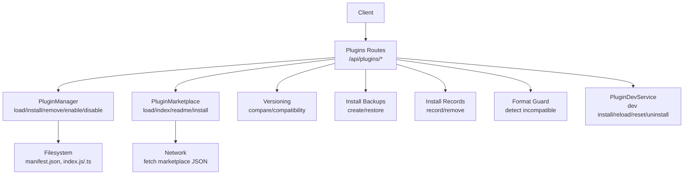
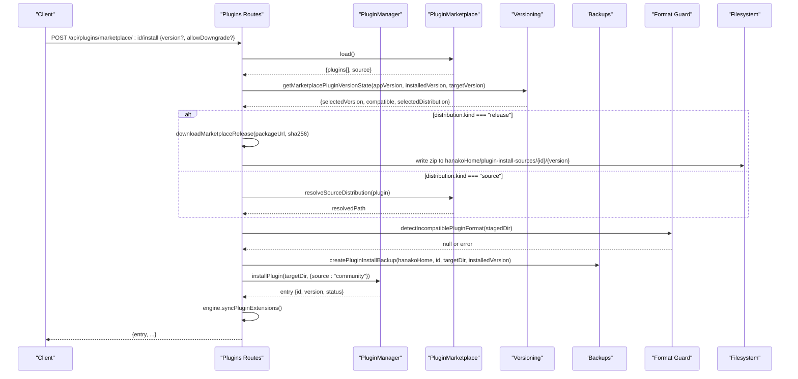
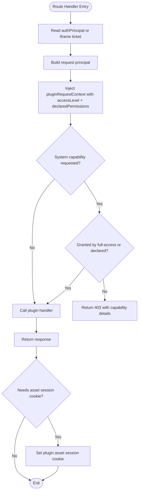
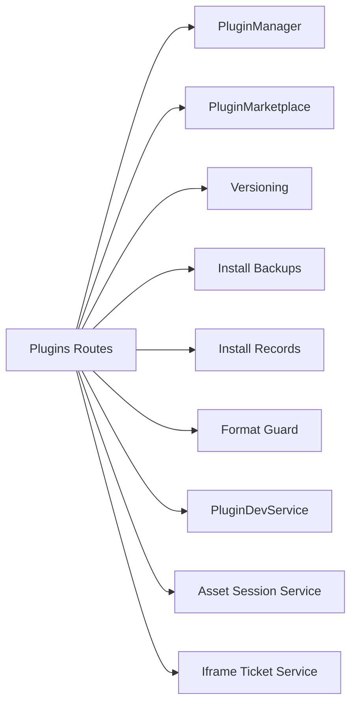

# Plugin Management API

<cite>
**Referenced Files in This Document**
- [plugins.ts](file://server/routes/plugins.ts)
- [plugin-manager.ts](file://core/plugin-manager.ts)
- [plugin-marketplace.ts](file://lib/plugin-marketplace.ts)
- [plugin-versioning.ts](file://lib/plugin-versioning.ts)
- [plugin-install-backups.ts](file://lib/plugin-install-backups.ts)
- [plugin-install-records.ts](file://lib/plugin-install-records.ts)
- [plugin-format-guard.ts](file://lib/plugin-format-guard.ts)
- [plugin-route-request-context.ts](file://core/plugin-route-request-context.ts)
- [plugin-dev-service.ts](file://core/plugin-dev-service.ts)
</cite>

## Table of Contents
1. [Introduction](#introduction)
2. [Project Structure](#project-structure)
3. [Core Components](#core-components)
4. [Architecture Overview](#architecture-overview)
5. [Detailed Component Analysis](#detailed-component-analysis)
6. [Dependency Analysis](#dependency-analysis)
7. [Performance Considerations](#performance-considerations)
8. [Troubleshooting Guide](#troubleshooting-guide)
9. [Conclusion](#conclusion)
10. [Appendices](#appendices)

## Introduction
This document provides comprehensive API documentation for plugin management endpoints exposed by the server. It covers installation, uninstallation, version management, marketplace integration, lifecycle operations, configuration, and security boundaries. The API supports:
- Listing plugins and diagnostics
- Installing from local paths or marketplace releases with integrity checks
- Enabling/disabling and removing plugins
- Managing per-plugin configuration schemas and values
- Browsing and installing from a plugin marketplace
- Developer workflow endpoints for hot-reloading and testing
- Secure iframe ticketing and asset session cookies for plugin UI surfaces

The API is implemented using Hono routes and integrates with a plugin manager that orchestrates loading, activation, and contribution registration.

## Project Structure
Key files involved in plugin management:
- Server routes define HTTP endpoints under /api/plugins
- Plugin manager handles scanning, loading, enabling/disabling, and contributions
- Marketplace client loads plugin catalogs and resolves versions/distributions
- Versioning utilities compare semver-like versions and compatibility
- Backup/restore helpers protect against failed installs
- Install records persist metadata about installations
- Format guard rejects incompatible plugin formats
- Route request context enforces capability permissions for plugin route handlers
- Dev service exposes developer-only endpoints for hot reloads and scenarios

**Diagram sources**
- [plugins.ts:786-1373](file://server/routes/plugins.ts#L786-L1373)
- [plugin-manager.ts:155-1626](file://core/plugin-manager.ts#L155-L1626)
- [plugin-marketplace.ts:12-110](file://lib/plugin-marketplace.ts#L12-L110)
- [plugin-versioning.ts:41-66](file://lib/plugin-versioning.ts#L41-L66)
- [plugin-install-backups.ts:33-61](file://lib/plugin-install-backups.ts#L33-L61)
- [plugin-install-records.ts:30-95](file://lib/plugin-install-records.ts#L30-L95)
- [plugin-format-guard.ts:6-29](file://lib/plugin-format-guard.ts#L6-L29)
- [plugin-dev-service.ts:355-598](file://core/plugin-dev-service.ts#L355-L598)

**Section sources**
- [plugins.ts:786-1373](file://server/routes/plugins.ts#L786-L1373)
- [plugin-manager.ts:155-1626](file://core/plugin-manager.ts#L155-L1626)
- [plugin-marketplace.ts:12-110](file://lib/plugin-marketplace.ts#L12-L110)
- [plugin-versioning.ts:41-66](file://lib/plugin-versioning.ts#L41-L66)
- [plugin-install-backups.ts:33-61](file://lib/plugin-install-backups.ts#L33-L61)
- [plugin-install-records.ts:30-95](file://lib/plugin-install-records.ts#L30-L95)
- [plugin-format-guard.ts:6-29](file://lib/plugin-format-guard.ts#L6-L29)
- [plugin-dev-service.ts:355-598](file://core/plugin-dev-service.ts#L355-L598)

## Core Components
- Plugins Routes: Define all REST endpoints for listing, installing, configuring, dev workflows, marketplace browsing/installing, and proxying to plugin route apps.
- Plugin Manager: Scans directories, reads manifest.json, loads tools/commands/routes/providers/pages/widgets/settings tabs, manages lifecycle (load/unload/activate), and maintains registries.
- Marketplace: Loads plugin catalog from file or URL, normalizes entries, resolves versions and distributions, and provides readme retrieval.
- Versioning: Compares plugin versions, checks app compatibility, sorts version records.
- Backups: Creates timestamped backups before install; restores on failure.
- Install Records: Persists installation metadata including source, packageUrl, sha256, timestamps, and history.
- Format Guard: Detects incompatible plugin formats (e.g., OpenClaw markers) and rejects them early.
- Route Request Context: Validates capability declarations and grants for plugin route handlers based on access level and principal.
- Dev Service: Provides developer-only endpoints for installing from source, reloading, enabling/disabling, resetting, uninstalling, running scenarios, invoking tools, and diagnostics.

**Section sources**
- [plugins.ts:786-1373](file://server/routes/plugins.ts#L786-L1373)
- [plugin-manager.ts:155-1626](file://core/plugin-manager.ts#L155-L1626)
- [plugin-marketplace.ts:12-110](file://lib/plugin-marketplace.ts#L12-L110)
- [plugin-versioning.ts:41-66](file://lib/plugin-versioning.ts#L41-L66)
- [plugin-install-backups.ts:33-61](file://lib/plugin-install-backups.ts#L33-L61)
- [plugin-install-records.ts:30-95](file://lib/plugin-install-records.ts#L30-L95)
- [plugin-format-guard.ts:6-29](file://lib/plugin-format-guard.ts#L6-L29)
- [plugin-route-request-context.ts:101-204](file://core/plugin-route-request-context.ts#L101-L204)
- [plugin-dev-service.ts:355-598](file://core/plugin-dev-service.ts#L355-L598)

## Architecture Overview
The plugin management architecture centers around a Hono-based route layer that delegates to the PluginManager and supporting libraries. Installation flows validate format, stage sources, create backups, perform atomic rename into user plugins directory, invoke PluginManager.installPlugin, and record install metadata. Marketplace installation downloads release packages over HTTPS, verifies SHA-256, and proceeds similarly.

**Diagram sources**
- [plugins.ts:1041-1099](file://server/routes/plugins.ts#L1041-L1099)
- [plugin-marketplace.ts:101-110](file://lib/plugin-marketplace.ts#L101-L110)
- [plugin-versioning.ts:205-254](file://lib/plugin-versioning.ts#L205-L254)
- [plugin-install-backups.ts:33-51](file://lib/plugin-install-backups.ts#L33-L51)
- [plugin-format-guard.ts:6-29](file://lib/plugin-format-guard.ts#L6-L29)
- [plugin-manager.ts:1262-1327](file://core/plugin-manager.ts#L1262-L1327)

**Section sources**
- [plugins.ts:1041-1099](file://server/routes/plugins.ts#L1041-L1099)
- [plugin-marketplace.ts:101-110](file://lib/plugin-marketplace.ts#L101-L110)
- [plugin-versioning.ts:205-254](file://lib/plugin-versioning.ts#L205-L254)
- [plugin-install-backups.ts:33-51](file://lib/plugin-install-backups.ts#L33-L51)
- [plugin-format-guard.ts:6-29](file://lib/plugin-format-guard.ts#L6-L29)
- [plugin-manager.ts:1262-1327](file://core/plugin-manager.ts#L1262-L1327)

## Detailed Component Analysis

### HTTP Endpoints Reference
Base path: /api/plugins

- GET /api/plugins
  - Purpose: List visible plugins (filters hidden/system plugins). Optional query parameter source filters by source ("community" | "builtin").
  - Response: Array of plugin summaries including id, name, version, status, trust, contributions, activation state, shadowing info.
  - Status codes: 200 OK.

- GET /api/plugins/config-schemas
  - Purpose: Retrieve all plugin configuration schemas.
  - Response: Array of schema objects keyed by pluginId.
  - Status codes: 200 OK.

- GET /api/plugins/event-bus/capabilities
  - Purpose: List event bus capabilities available to plugins.
  - Response: Array of capability descriptors.
  - Status codes: 200 OK.

- GET /api/plugins/diagnostics
  - Purpose: Aggregate diagnostics for plugins, event bus capabilities, tasks, schedules.
  - Response: Object containing plugins[], eventBus[], tasks[], schedules[].
  - Status codes: 200 OK.

- POST /api/plugins/dev/install
  - Purpose: Developer-only install from local source path. Body includes sourcePath (or path), optional pluginId, allowFullAccess.
  - Response: Dev install result object.
  - Error responses: 500 if dev service unavailable; 400/404/409 for validation errors.
  - Notes: Requires plugin dev service enabled.

- POST /api/plugins/dev/:id/reload
  - Purpose: Reload a dev plugin identified by id. Body may include devRunId, allowFullAccess.
  - Response: Dev reload result.
  - Errors: 404 if slot not found; 409 if devRunId mismatch.

- PUT /api/plugins/dev/:id/enabled
  - Purpose: Enable or disable a dev plugin. Body includes enabled boolean, optional devRunId, allowFullAccess.
  - Response: Updated dev plugin summary.
  - Errors: 404/403/409 as applicable.

- POST /api/plugins/dev/:id/reset
  - Purpose: Reset a dev plugin (reload with same slot). Body may include devRunId, allowFullAccess.
  - Response: Dev reset result.

- DELETE /api/plugins/dev/:id
  - Purpose: Uninstall a dev plugin and remove its dev slot. Body may include devRunId.
  - Response: Dev uninstall result.

- GET /api/plugins/dev/:id/scenarios
  - Purpose: List test scenarios for a dev plugin.
  - Response: { pluginId, scenarios[] }.

- POST /api/plugins/dev/:id/scenarios/:scenarioId/run
  - Purpose: Run a scenario for a dev plugin. Body may include allowDestructive.
  - Response: Scenario run result.

- POST /api/plugins/dev/:id/tools/:toolName/invoke
  - Purpose: Invoke a tool defined by a dev plugin. Body includes input, optional sessionPath, agentId.
  - Response: Tool invocation result.

- GET /api/plugins/dev/diagnostics
  - Purpose: Get dev diagnostics, optionally filtered by pluginId.
  - Response: Diagnostics object.

- GET /api/plugins/dev/surfaces
  - Purpose: List plugin surfaces for development.
  - Response: Surfaces array.

- POST /api/plugins/dev/surfaces/describe
  - Purpose: Describe a surface for debugging. Body includes surface description parameters.
  - Response: Surface description.

- GET /api/plugins/marketplace
  - Purpose: Load marketplace index and enrich with installed state and version compatibility.
  - Response: { source, schemaVersion, plugins[] } where each plugin includes installed flags, version state, canInstall.
  - Status codes: 200 OK.

- GET /api/plugins/marketplace/:id/readme
  - Purpose: Fetch README for a marketplace plugin.
  - Response: { pluginId, markdown }.
  - Status codes: 200 OK, 404 if not found, 500 on network errors.

- POST /api/plugins/marketplace/:id/install
  - Purpose: Install a marketplace plugin by id. Body includes optional sessionPath, version (targetVersion), allowDowngrade boolean.
  - Behavior: Resolves compatible version, validates downgrade policy, downloads release or resolves source distribution, stages, backs up existing, installs via PluginManager, syncs extensions, records install metadata.
  - Response: Installed plugin entry.
  - Status codes: 200 OK, 400 bad request, 404 not found, 409 incompatible/downgrade, 413 too large, 502 network/integrity failures.

- GET /api/plugins/:id/config-schema
  - Purpose: Get configuration schema for a specific plugin.
  - Response: Schema object.
  - Status codes: 200 OK, 404 if not found.

- GET /api/plugins/:id/config
  - Purpose: Read plugin config values. Query params: scope (default "global"), agentId, sessionPath.
  - Response: Config object with values redacted.
  - Status codes: 200 OK, 404 if not found.

- PUT /api/plugins/:id/config
  - Purpose: Update plugin config values. Body supports envelope { values, scope, agentId, sessionPath } or flat fields. Special validation for image-gen defaultImageModel.
  - Response: Safe config object (values redacted).
  - Status codes: 200 OK, 400 validation errors, 404 not found.

- POST /api/plugins/install
  - Purpose: Install plugin from local path. Body includes path (required), optional sessionPath, allowDowngrade.
  - Behavior: Stages source (zip or directory), validates format, determines target dir inside user plugins directory, creates backup, performs atomic rename, installs via PluginManager, syncs extensions, records install metadata.
  - Response: Installed plugin entry.
  - Status codes: 200 OK, 400 invalid source/path, 409 downgrade/incompatible, 500 internal.

- DELETE /api/plugins/:id
  - Purpose: Remove a community plugin.
  - Behavior: Unloads if loaded, removes from registry, deletes directory.
  - Response: { ok: true }.
  - Status codes: 200 OK, 404 not found.

- PUT /api/plugins/:id/enabled
  - Purpose: Enable or disable a community plugin. Body includes enabled boolean.
  - Behavior: Persists preference, unloads/loads accordingly, syncs extensions.
  - Response: { ok: true }.
  - Status codes: 200 OK, 404 not found.

- GET /api/plugins/settings
  - Purpose: Read global plugin settings (allow full access, dev tools enabled, plugins dir visibility).
  - Response: { allow_full_access, plugin_dev_tools_enabled, plugins_dir }.
  - Status codes: 200 OK.

- PUT /api/plugins/settings
  - Purpose: Update global plugin settings. Body includes allow_full_access, plugin_dev_tools_enabled booleans.
  - Behavior: Updates preferences, reloads affected plugins, toggles dev tools.
  - Response: Community plugins list.
  - Status codes: 200 OK.

- GET /api/plugins/pages
  - Purpose: List plugin pages contributed by loaded plugins.
  - Response: Array of page descriptors with routeUrl.
  - Status codes: 200 OK.

- GET /api/plugins/widgets
  - Purpose: List plugin widgets contributed by loaded plugins.
  - Response: Array of widget descriptors with routeUrl.
  - Status codes: 200 OK.

- GET /api/plugins/ui-host-capabilities
  - Purpose: List granted UI host capabilities for active plugins.
  - Response: Array of capability grants.
  - Status codes: 200 OK.

- GET /api/plugins/settings-tabs
  - Purpose: List settings tabs contributed by built-in plugins.
  - Response: Array of tab descriptors.
  - Status codes: 200 OK.

- POST /api/plugins/iframe-ticket
  - Purpose: Issue an iframe ticket and surface session for a plugin surface. Body includes routeUrl targeting /api/plugins/:pluginId/* with allowed query params.
  - Response: { ticket, ticketId, pluginId, surfacePath, expiresAt, surfaceSession: { token, expiresAt } }.
  - Status codes: 200 OK, 400 invalid route/ticket, 404 plugin not found.

- GET /api/plugins/theme.css
  - Purpose: Serve theme CSS for plugin UI consumption. Query param theme selects theme name.
  - Response: CSS text with sanitized selector rewriting.
  - Status codes: 200 OK.

- GET /api/plugins/:pluginId/assets/*
- HEAD /api/plugins/:pluginId/assets/*
  - Purpose: Serve plugin assets with secure session cookie handling.
  - Response: Asset content or HEAD response.
  - Status codes: 200 OK, 404 not found.

- ALL /api/plugins/:pluginId/*
  - Purpose: Proxy requests to plugin route apps. Validates iframe ticket when present, activates plugin route if needed, injects agentId and principal, returns response and sets asset session cookie when appropriate.
  - Response: Plugin route handler response.
  - Status codes: 200 OK, 404 not found, 403 forbidden (capability denied), 500 internal.

**Section sources**
- [plugins.ts:817-1373](file://server/routes/plugins.ts#L817-L1373)

### TypeScript Interfaces (Representative)
Note: These interfaces summarize request/response shapes used by the endpoints. They are derived from endpoint behaviors and payloads described above.

- PluginSummary
  - Fields: id, name, version, status, trust, contributions, activationState, activationEvents, activationError, shadowedBy, shadowedByPluginKey, shadows, error, source, pluginKey, description
  - Used by: GET /api/plugins, GET /api/plugins/diagnostics

- MarketplacePlugin
  - Fields: id, name, publisher, version, description, license, categories, keywords, homepage, repository, compatibility, trust, permissions, contributions, distribution, versions, screenshots, readme, readmePath, readmeUrl, install
  - Used by: GET /api/plugins/marketplace

- MarketplacePluginResponse
  - Fields: source, schemaVersion, plugins[] enriched with installed, compatible, selectedVersion, updateAvailable, downgrade, reinstall, canInstall, installAction, selectedDistribution, selectedCompatibility

- InstallRequest
  - Fields: path (string), sessionPath (string?), allowDowngrade (boolean?)
  - Used by: POST /api/plugins/install

- MarketplaceInstallRequest
  - Fields: sessionPath (string?), version (string?), allowDowngrade (boolean?)
  - Used by: POST /api/plugins/marketplace/:id/install

- ConfigSchema
  - Fields: pluginId, type, properties, required, migrationVersion
  - Used by: GET /api/plugins/config-schemas, GET /api/plugins/:id/config-schema

- ConfigValue
  - Fields: pluginId, pluginKey, source, schema, values (redacted), rawValues (internal)
  - Used by: GET /api/plugins/:id/config, PUT /api/plugins/:id/config

- IframeTicketRequest
  - Fields: routeUrl (string) targeting /api/plugins/:pluginId/* with allowed query params
  - Used by: POST /api/plugins/iframe-ticket

- IframeTicketResponse
  - Fields: ticket, ticketId, pluginId, surfacePath, expiresAt, surfaceSession: { token, expiresAt }

- Settings
  - Fields: allow_full_access (boolean), plugin_dev_tools_enabled (boolean), plugins_dir (string)
  - Used by: GET /api/plugins/settings, PUT /api/plugins/settings

- PageDescriptor
  - Fields: pluginId, title, icon, routeUrl, hostCapabilities[]
  - Used by: GET /api/plugins/pages

- WidgetDescriptor
  - Fields: pluginId, title, icon, routeUrl, hostCapabilities[]
  - Used by: GET /api/plugins/widgets

- SettingsTabDescriptor
  - Fields: pluginId, id, title, icon, nativeComponent
  - Used by: GET /api/plugins/settings-tabs

- CapabilityGrant
  - Fields: pluginId, pluginKey, source, hostCapabilities[]
  - Used by: GET /api/plugins/ui-host-capabilities

- DevInstallRequest
  - Fields: sourcePath (string), pluginId (string?), allowFullAccess (boolean?)
  - Used by: POST /api/plugins/dev/install

- DevReloadRequest
  - Fields: devRunId (string?), allowFullAccess (boolean?)
  - Used by: POST /api/plugins/dev/:id/reload

- DevEnableRequest
  - Fields: enabled (boolean), devRunId (string?), allowFullAccess (boolean?)
  - Used by: PUT /api/plugins/dev/:id/enabled

- DevResetRequest
  - Fields: devRunId (string?), allowFullAccess (boolean?)
  - Used by: POST /api/plugins/dev/:id/reset

- DevUninstallRequest
  - Fields: devRunId (string?)
  - Used by: DELETE /api/plugins/dev/:id

- DevScenarioRunRequest
  - Fields: allowDestructive (boolean?)
  - Used by: POST /api/plugins/dev/:id/scenarios/:scenarioId/run

- DevToolInvokeRequest
  - Fields: input (object), sessionPath (string?), agentId (string?)
  - Used by: POST /api/plugins/dev/:id/tools/:toolName/invoke

**Section sources**
- [plugins.ts:817-1373](file://server/routes/plugins.ts#L817-L1373)

### Security Boundaries, Sandboxing Policies, Permission Models
- Access Levels:
  - Restricted: Default for community plugins unless explicitly allowed.
  - Full-access: Allowed for builtin plugins or community plugins when global setting permits and plugin declares trust="full-access".
- Capability Declarations:
  - Plugins declare capabilities and sensitiveCapabilities arrays. Legacy behavior applies only when both lists are absent; explicit empty arrays enforce strict denial.
- Route Request Context:
  - For plugin route handlers, a request-level context is created with principal, agentId, and capability grant enforcement. System-owned capabilities require either full-access or explicit declaration matching permission namespaces.
- Principal Derivation:
  - For proxied plugin routes, authPrincipal is preferred; otherwise, iframe ticket principal is used. Surface sessions cannot re-issue asset session cookies; only tickets or owner/device credentials can.
- Path Guards:
  - Install targets must remain within user plugins directory; escape attempts are rejected.
- Release Integrity:
  - Marketplace release downloads require https and SHA-256 verification; size limits enforced.
- Theme Serving:
  - Theme names sanitized to prevent traversal; selectors rewritten for iframe consumption.

**Diagram sources**
- [plugins.ts:158-236](file://server/routes/plugins.ts#L158-L236)
- [plugins.ts:266-288](file://server/routes/plugins.ts#L266-L288)
- [plugins.ts:181-220](file://server/routes/plugins.ts#L181-L220)
- [plugin-route-request-context.ts:101-204](file://core/plugin-route-request-context.ts#L101-L204)

**Section sources**
- [plugins.ts:158-236](file://server/routes/plugins.ts#L158-L236)
- [plugins.ts:266-288](file://server/routes/plugins.ts#L266-L288)
- [plugins.ts:181-220](file://server/routes/plugins.ts#L181-L220)
- [plugin-route-request-context.ts:101-204](file://core/plugin-route-request-context.ts#L101-L204)

### Lifecycle Operations
- Install:
  - Local: POST /api/plugins/install with path to .zip or directory.
  - Marketplace: POST /api/plugins/marketplace/:id/install with optional version and downgrade flag.
- Uninstall:
  - Community: DELETE /api/plugins/:id.
  - Dev: DELETE /api/plugins/dev/:id.
- Enable/Disable:
  - Community: PUT /api/plugins/:id/enabled with enabled boolean.
  - Dev: PUT /api/plugins/dev/:id/enabled with body controlling enable/disable.
- Reload/Reset:
  - Dev: POST /api/plugins/dev/:id/reload, POST /api/plugins/dev/:id/reset.
- Activation:
  - Automatic during load if activation events match; manual activation supported internally.

**Section sources**
- [plugins.ts:1145-1196](file://server/routes/plugins.ts#L1145-L1196)
- [plugins.ts:852-924](file://server/routes/plugins.ts#L852-L924)
- [plugin-manager.ts:1262-1418](file://core/plugin-manager.ts#L1262-L1418)

### Version Management
- Compatibility:
  - Marketplace version selection uses appVersion and plugin compatibility constraints.
- Downgrade Policy:
  - Downgrades blocked unless allowDowngrade=true provided in request bodies.
- Semver Comparison:
  - Versions parsed and compared with pre-release support; sorting descending for latest-first.

**Section sources**
- [plugin-versioning.ts:41-66](file://lib/plugin-versioning.ts#L41-L66)
- [plugin-versioning.ts:205-254](file://lib/plugin-versioning.ts#L205-L254)
- [plugins.ts:1041-1099](file://server/routes/plugins.ts#L1041-L1099)

### Marketplace Integration
- Index Loading:
  - Supports file or URL source; environment variables override defaults.
- Readme Retrieval:
  - Inline markdown, local path, or remote URL fetched via fetch.
- Version State Computation:
  - Determines selected version, compatibility, update availability, downgrade/reinstall actions.
- Distribution Resolution:
  - Source distribution resolved to local path; release distribution downloaded securely with integrity check.

**Section sources**
- [plugin-marketplace.ts:12-110](file://lib/plugin-marketplace.ts#L12-L110)
- [plugin-marketplace.ts:112-183](file://lib/plugin-marketplace.ts#L112-L183)
- [plugin-marketplace.ts:205-254](file://lib/plugin-marketplace.ts#L205-L254)
- [plugins.ts:995-1099](file://server/routes/plugins.ts#L995-L1099)

### Backup/Restore Operations
- Before install, a timestamped backup of the existing plugin directory is created under hanakoHome/plugin-backups.
- On install failure, backup is restored and plugin reloaded; otherwise, stale directories are removed.

**Section sources**
- [plugin-install-backups.ts:33-61](file://lib/plugin-install-backups.ts#L33-L61)
- [plugins.ts:462-480](file://server/routes/plugins.ts#L462-L480)

### Error Handling Strategies
- Validation Errors:
  - 400 for invalid inputs, incompatible formats, missing fields.
- Conflict Errors:
  - 409 for incompatible versions, downgrade attempts, ID/version mismatches.
- Network/Integrity Errors:
  - 502 for marketplace download failures or SHA-256 mismatches.
- Size Limits:
  - 413 for oversized release packages.
- Capability Denials:
  - 403 with capability details for unauthorized system capabilities.
- Not Found:
  - 404 for missing plugins, configs, or readme.

**Section sources**
- [plugins.ts:118-123](file://server/routes/plugins.ts#L118-L123)
- [plugins.ts:629-701](file://server/routes/plugins.ts#L629-L701)
- [plugins.ts:1041-1099](file://server/routes/plugins.ts#L1041-L1099)
- [plugin-route-request-context.ts:101-204](file://core/plugin-route-request-context.ts#L101-L204)

## Dependency Analysis
- Plugins Routes depend on:
  - PluginManager for listing, installing, enabling/disabling, configuration, and diagnostics.
  - PluginMarketplace for catalog loading and readme retrieval.
  - Versioning utilities for compatibility checks.
  - Backup/restore helpers for safe installs.
  - Install records for persistence.
  - Format guard for rejecting incompatible packages.
  - Dev service for developer workflows.
  - Asset/session services for secure UI surfaces.

**Diagram sources**
- [plugins.ts:786-1373](file://server/routes/plugins.ts#L786-L1373)
- [plugin-manager.ts:155-1626](file://core/plugin-manager.ts#L155-L1626)
- [plugin-marketplace.ts:12-110](file://lib/plugin-marketplace.ts#L12-L110)
- [plugin-versioning.ts:41-66](file://lib/plugin-versioning.ts#L41-L66)
- [plugin-install-backups.ts:33-61](file://lib/plugin-install-backups.ts#L33-L61)
- [plugin-install-records.ts:30-95](file://lib/plugin-install-records.ts#L30-L95)
- [plugin-format-guard.ts:6-29](file://lib/plugin-format-guard.ts#L6-L29)
- [plugin-dev-service.ts:355-598](file://core/plugin-dev-service.ts#L355-L598)

**Section sources**
- [plugins.ts:786-1373](file://server/routes/plugins.ts#L786-L1373)
- [plugin-manager.ts:155-1626](file://core/plugin-manager.ts#L155-L1626)
- [plugin-marketplace.ts:12-110](file://lib/plugin-marketplace.ts#L12-L110)
- [plugin-versioning.ts:41-66](file://lib/plugin-versioning.ts#L41-L66)
- [plugin-install-backups.ts:33-61](file://lib/plugin-install-backups.ts#L33-L61)
- [plugin-install-records.ts:30-95](file://lib/plugin-install-records.ts#L30-L95)
- [plugin-format-guard.ts:6-29](file://lib/plugin-format-guard.ts#L6-L29)
- [plugin-dev-service.ts:355-598](file://core/plugin-dev-service.ts#L355-L598)

## Performance Considerations
- Avoid unnecessary reloads: Use dev reload endpoints sparingly; prefer targeted tool invocations.
- Cache-friendly theme serving: Theme CSS endpoint sets cache headers.
- Streamlined marketplace queries: Single load call returns enriched data; clients should reuse results.
- Limit large downloads: Release package size limit prevents memory pressure.

[No sources needed since this section provides general guidance]

## Troubleshooting Guide
- Incompatible Plugin Format:
  - Error code PLUGIN_FORMAT_INCOMPATIBLE indicates unsupported plugin structure (e.g., OpenClaw markers). Convert to Hana plugin format with manifest.json.
- Version Incompatibility:
  - Error code PLUGIN_VERSION_INCOMPATIBLE indicates minAppVersion constraint not met. Upgrade application or select compatible version.
- Downgrade Blocked:
  - Error code PLUGIN_VERSION_DOWNGRADE requires allowDowngrade=true to proceed.
- Missing Plugin Directory:
  - Reconciliation removes stale registry entries; ensure plugin directory exists under user plugins path.
- Capability Denied:
  - 403 responses include capability details; review plugin manifest capabilities and trust settings.
- Network Failures:
  - 502 errors for marketplace downloads or integrity checks; verify network connectivity and packageUrl/sha256 correctness.

**Section sources**
- [plugin-format-guard.ts:6-29](file://lib/plugin-format-guard.ts#L6-L29)
- [plugins.ts:1041-1099](file://server/routes/plugins.ts#L1041-L1099)
- [plugins.ts:629-701](file://server/routes/plugins.ts#L629-L701)
- [plugin-route-request-context.ts:101-204](file://core/plugin-route-request-context.ts#L101-L204)

## Conclusion
The Plugin Management API provides robust endpoints for managing plugins across installation, configuration, marketplace integration, and lifecycle operations. Security is enforced through capability declarations, principal derivation, and integrity checks. Developers benefit from dedicated dev endpoints for rapid iteration and testing. Proper use of versioning and downgrade policies ensures stability while allowing controlled updates.

[No sources needed since this section summarizes without analyzing specific files]

## Appendices

### Example Workflows

- Plugin Development Workflow:
  - Install dev source: POST /api/plugins/dev/install with sourcePath and optional pluginId.
  - Reload after changes: POST /api/plugins/dev/:id/reload with devRunId.
  - Enable/disable: PUT /api/plugins/dev/:id/enabled with enabled boolean.
  - Reset: POST /api/plugins/dev/:id/reset.
  - Uninstall: DELETE /api/plugins/dev/:id.
  - Test scenarios: GET /api/plugins/dev/:id/scenarios, then POST /api/plugins/dev/:id/scenarios/:scenarioId/run.
  - Invoke tools: POST /api/plugins/dev/:id/tools/:toolName/invoke with input.

- Marketplace Browsing:
  - GET /api/plugins/marketplace to list plugins with version states.
  - GET /api/plugins/marketplace/:id/readme to fetch documentation.

- Secure Installation from Releases:
  - POST /api/plugins/marketplace/:id/install with version and allowDowngrade options.
  - Server downloads release over HTTPS, verifies SHA-256, stages, backs up, installs, and syncs extensions.

- Backup/Restore:
  - Automatic backup creation before install; restore on failure to maintain system stability.

- Error Handling:
  - Inspect error codes and messages returned by endpoints; handle 400/404/409/413/502 appropriately.

**Section sources**
- [plugins.ts:852-993](file://server/routes/plugins.ts#L852-L993)
- [plugins.ts:1002-1099](file://server/routes/plugins.ts#L1002-L1099)
- [plugin-install-backups.ts:33-61](file://lib/plugin-install-backups.ts#L33-L61)