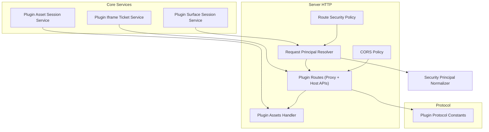
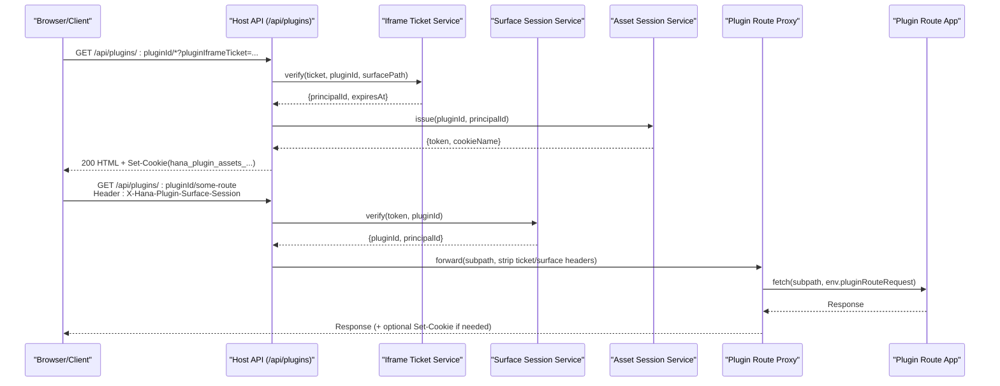
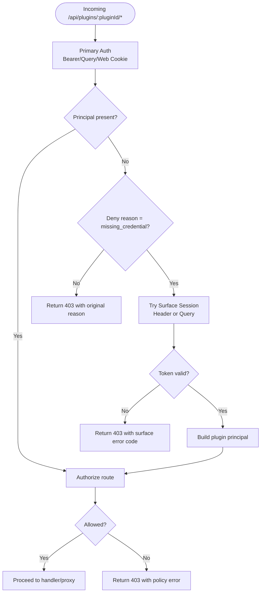
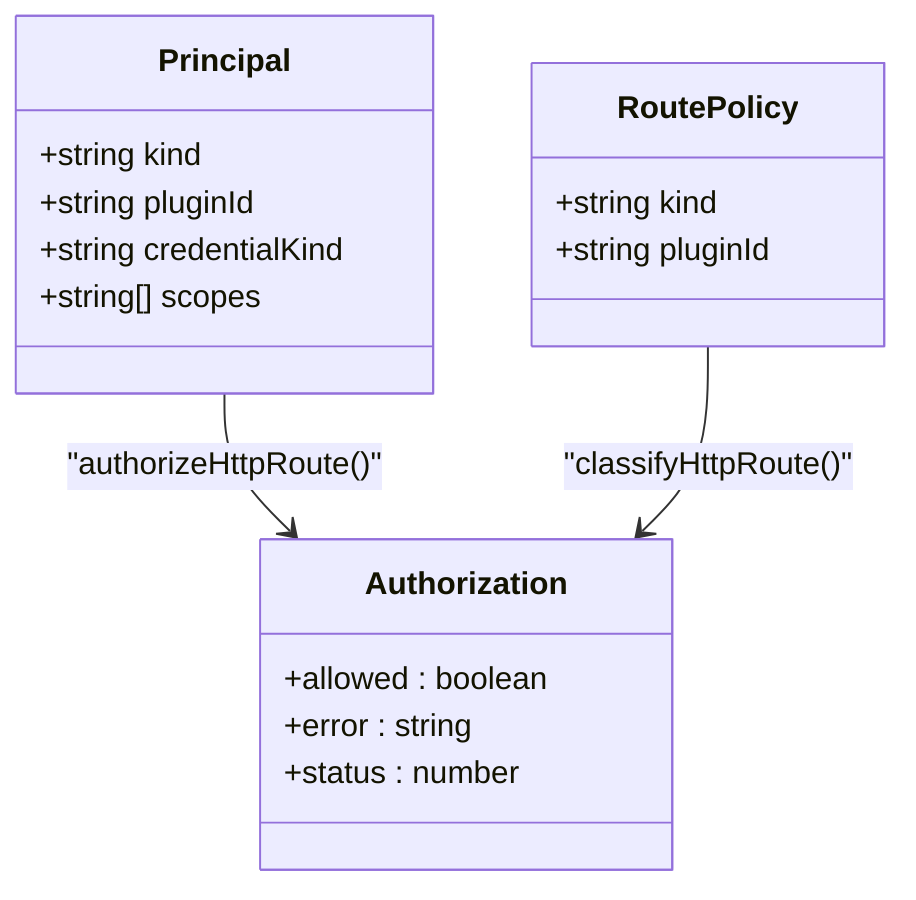
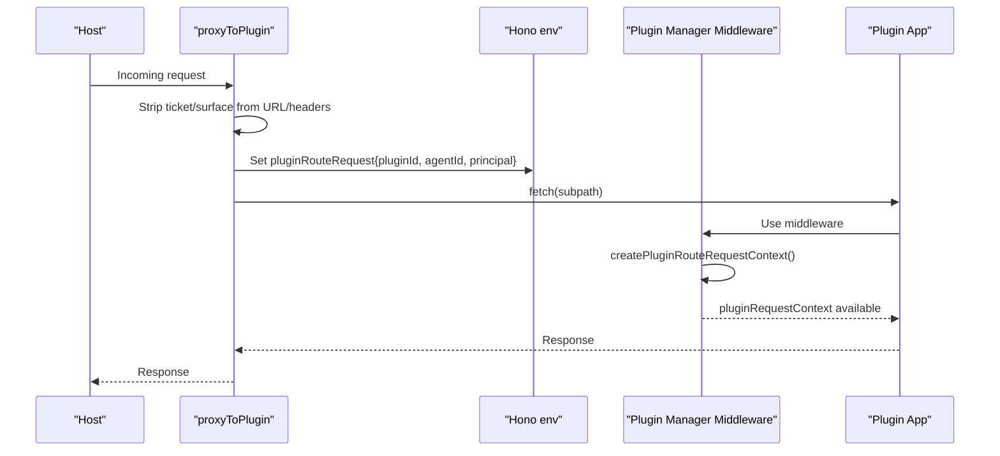
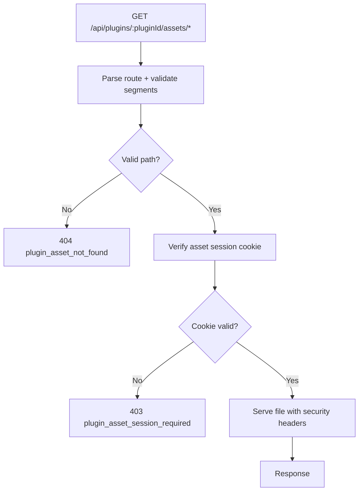
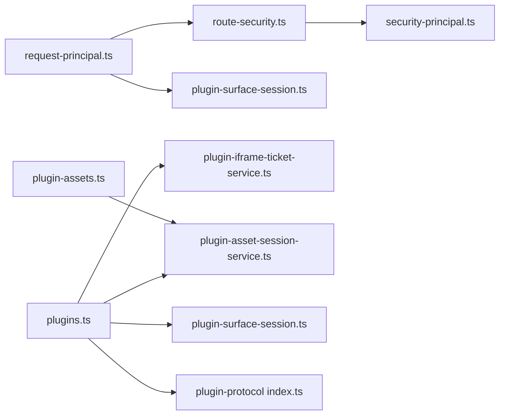

# Plugin Route Proxy & Security

<cite>
**Referenced Files in This Document**
- [plugin-iframe-ticket-service.ts](file://core/plugin-iframe-ticket-service.ts)
- [plugin-surface-session-service.ts](file://core/plugin-surface-session-service.ts)
- [plugin-asset-session-service.ts](file://core/plugin-asset-session-service.ts)
- [route-security.ts](file://server/http/route-security.ts)
- [request-principal.ts](file://server/http/request-principal.ts)
- [plugin-assets.ts](file://server/http/plugin-assets.ts)
- [plugin-surface-session.ts](file://server/http/plugin-surface-session.ts)
- [plugins.ts](file://server/routes/plugins.ts)
- [cors-policy.ts](file://server/http/cors-policy.ts)
- [index.ts (plugin-protocol)](file://packages/plugin-protocol/src/index.ts)
- [security-principal.ts](file://core/security-principal.ts)
</cite>

## Table of Contents
1. [Introduction](#introduction)
2. [Project Structure](#project-structure)
3. [Core Components](#core-components)
4. [Architecture Overview](#architecture-overview)
5. [Detailed Component Analysis](#detailed-component-analysis)
6. [Dependency Analysis](#dependency-analysis)
7. [Performance Considerations](#performance-considerations)
8. [Troubleshooting Guide](#troubleshooting-guide)
9. [Conclusion](#conclusion)
10. [Appendices](#appendices)

## Introduction
This document provides detailed API documentation for plugin route proxying and security mechanisms, focusing on:
- iframe ticket system for secure surface loading
- surface session management for request-level access to plugin routes
- asset session cookies for serving plugin static assets securely
- request forwarding from the host to plugin route apps
- security boundaries, CORS policies, and principal-based access control

It includes HTTP methods, URL patterns, authentication flows, request/response schemas (TypeScript interfaces), and security validation rules with examples for plugin route development and secure communication patterns.

## Project Structure
The plugin proxy and security features are implemented across core services and server HTTP layers:
- Core services implement token/session issuance and verification
- Server HTTP layer enforces authorization, proxies requests, and manages cookies
- Protocol constants define wire headers/query keys used by clients and servers

**Diagram sources**
- [plugin-iframe-ticket-service.ts:1-155](file://core/plugin-iframe-ticket-service.ts#L1-L155)
- [plugin-surface-session-service.ts:1-162](file://core/plugin-surface-session-service.ts#L1-L162)
- [plugin-asset-session-service.ts:1-184](file://core/plugin-asset-session-service.ts#L1-L184)
- [route-security.ts:1-574](file://server/http/route-security.ts#L1-L574)
- [request-principal.ts:1-107](file://server/http/request-principal.ts#L1-L107)
- [plugin-assets.ts:1-227](file://server/http/plugin-assets.ts#L1-L227)
- [plugins.ts:1-800](file://server/routes/plugins.ts#L1-L800)
- [cors-policy.ts:1-15](file://server/http/cors-policy.ts#L1-L15)
- [index.ts (plugin-protocol):1-143](file://packages/plugin-protocol/src/index.ts#L1-L143)
- [security-principal.ts:1-162](file://core/security-principal.ts#L1-L162)

**Section sources**
- [plugin-iframe-ticket-service.ts:1-155](file://core/plugin-iframe-ticket-service.ts#L1-L155)
- [plugin-surface-session-service.ts:1-162](file://core/plugin-surface-session-service.ts#L1-L162)
- [plugin-asset-session-service.ts:1-184](file://core/plugin-asset-session-service.ts#L1-L184)
- [route-security.ts:1-574](file://server/http/route-security.ts#L1-L574)
- [request-principal.ts:1-107](file://server/http/request-principal.ts#L1-L107)
- [plugin-assets.ts:1-227](file://server/http/plugin-assets.ts#L1-L227)
- [plugins.ts:1-800](file://server/routes/plugins.ts#L1-L800)
- [cors-policy.ts:1-15](file://server/http/cors-policy.ts#L1-L15)
- [index.ts (plugin-protocol):1-143](file://packages/plugin-protocol/src/index.ts#L1-L143)
- [security-principal.ts:1-162](file://core/security-principal.ts#L1-L162)

## Core Components
- Plugin Iframe Ticket Service: Issues and verifies short-lived tickets binding a pluginId, surfacePath, and principalId. Used to authorize loading a plugin’s UI surface.
- Plugin Surface Session Service: Issues and verifies request-scoped sessions enabling plugin route calls without full user credentials.
- Plugin Asset Session Service: Issues signed tokens and constructs HttpOnly SameSite=Strict cookies scoped to /api/plugins/:pluginId/assets/ for static asset access.
- Route Security Policy: Classifies routes and enforces principal-based authorization, including special handling for plugin_route entries.
- Request Principal Resolver: Orchestrates primary auth (bearer/query/web cookie) and fallback to plugin surface session; then applies route authorization.
- Plugin Assets Handler: Serves plugin assets under strict path validation and sets security headers.
- Plugin Routes: Proxies requests to plugin apps, strips sensitive query/header values, injects agentId, and attaches asset session cookies when appropriate.
- CORS Policy: Defines allowed origins for loopback and file schemes.
- Plugin Protocol: Defines header/query names for surface session transport.
- Security Principal Normalizer: Produces canonical principal objects consumed by authorization logic.

**Section sources**
- [plugin-iframe-ticket-service.ts:1-155](file://core/plugin-iframe-ticket-service.ts#L1-L155)
- [plugin-surface-session-service.ts:1-162](file://core/plugin-surface-session-service.ts#L1-L162)
- [plugin-asset-session-service.ts:1-184](file://core/plugin-asset-session-service.ts#L1-L184)
- [route-security.ts:1-574](file://server/http/route-security.ts#L1-L574)
- [request-principal.ts:1-107](file://server/http/request-principal.ts#L1-L107)
- [plugin-assets.ts:1-227](file://server/http/plugin-assets.ts#L1-L227)
- [plugins.ts:1-800](file://server/routes/plugins.ts#L1-L800)
- [cors-policy.ts:1-15](file://server/http/cors-policy.ts#L1-L15)
- [index.ts (plugin-protocol):1-143](file://packages/plugin-protocol/src/index.ts#L1-L143)
- [security-principal.ts:1-162](file://core/security-principal.ts#L1-L162)

## Architecture Overview
End-to-end flow for a plugin surface load and subsequent route call:

**Diagram sources**
- [plugins.ts:1345-1372](file://server/routes/plugins.ts#L1345-L1372)
- [plugin-iframe-ticket-service.ts:22-110](file://core/plugin-iframe-ticket-service.ts#L22-L110)
- [plugin-asset-session-service.ts:53-82](file://core/plugin-asset-session-service.ts#L53-L82)
- [plugin-surface-session-service.ts:32-115](file://core/plugin-surface-session-service.ts#L32-L115)
- [plugin-surface-session.ts:35-63](file://server/http/plugin-surface-session.ts#L35-L63)

## Detailed Component Analysis

### HTTP Endpoints and Patterns
- Plugin route proxy
  - Method: Any
  - Pattern: /api/plugins/:pluginId/*
  - Behavior: Forwards to plugin app after stripping sensitive query/header values; injects agentId and request principal into plugin env.
- Plugin assets
  - Method: GET, HEAD
  - Pattern: /api/plugins/:pluginId/assets/*
  - Behavior: Validates asset path, serves files with security headers, requires asset session cookie.
- Iframe ticket issuance
  - Method: POST
  - Pattern: /api/plugins/iframe-ticket
  - Behavior: Requires chat scope; returns a ticket bound to pluginId and surfacePath.
- Surface session fallback
  - Header: X-Hana-Plugin-Surface-Session
  - Query: pluginSurfaceSession
  - Behavior: Accepted only when primary credential is missing; otherwise ignored.

**Section sources**
- [plugins.ts:1345-1372](file://server/routes/plugins.ts#L1345-L1372)
- [plugin-assets.ts:68-96](file://server/http/plugin-assets.ts#L68-L96)
- [route-security.ts:139-193](file://server/http/route-security.ts#L139-L193)
- [plugin-surface-session.ts:35-63](file://server/http/plugin-surface-session.ts#L35-L63)
- [index.ts (plugin-protocol):10-11](file://packages/plugin-protocol/src/index.ts#L10-L11)

### Authentication Flows

#### Primary Authentication
- Sources: Authorization header (Bearer), query token, web session cookie
- Enforced by request principal resolver before any surface session fallback

#### Surface Session Fallback
- Only when primary auth denies due to missing credential
- Accepts token via header or query
- Produces a plugin principal with no scopes, restricted to matching plugin route

**Diagram sources**
- [request-principal.ts:44-106](file://server/http/request-principal.ts#L44-L106)
- [plugin-surface-session.ts:35-63](file://server/http/plugin-surface-session.ts#L35-L63)
- [route-security.ts:29-80](file://server/http/route-security.ts#L29-L80)

**Section sources**
- [request-principal.ts:1-107](file://server/http/request-principal.ts#L1-L107)
- [plugin-surface-session.ts:1-75](file://server/http/plugin-surface-session.ts#L1-L75)
- [route-security.ts:1-120](file://server/http/route-security.ts#L1-L120)

### Security Boundaries and Access Control
- Host-owned plugin IDs are reserved and cannot be targeted by iframe tickets or proxied as plugin routes.
- Plugin route authorization allows:
  - Local owner principals
  - Studio owner principals
  - Plugin surface principals whose pluginId matches the requested route
- Scope checks apply to other endpoints; plugin_route kind bypasses scope checks but enforces pluginId match.

**Diagram sources**
- [route-security.ts:29-80](file://server/http/route-security.ts#L29-L80)
- [security-principal.ts:38-65](file://core/security-principal.ts#L38-L65)

**Section sources**
- [route-security.ts:1-120](file://server/http/route-security.ts#L1-L120)
- [security-principal.ts:1-162](file://core/security-principal.ts#L1-L162)

### Request Forwarding and Context Injection
- The proxy strips iframe ticket and surface session tokens from URL and headers before forwarding to plugin apps.
- Injects agentId via header and passes pluginRouteRequest env containing pluginId, agentId, and principal.
- Plugin manager middleware creates per-request context with capability grants and bus wrapper.

**Diagram sources**
- [plugins.ts:67-96](file://server/routes/plugins.ts#L67-L96)
- [plugin-manager.ts:976-999](file://core/plugin-manager.ts#L976-L999)

**Section sources**
- [plugins.ts:67-96](file://server/routes/plugins.ts#L67-L96)
- [plugin-manager.ts:976-999](file://core/plugin-manager.ts#L976-L999)

### Asset Serving and Cookies
- Asset paths are validated against safe segment rules and allowed extensions.
- Responses include security headers: X-Content-Type-Options: nosniff and Cross-Origin-Resource-Policy: same-origin.
- Asset session cookie is set only for successful GET/HEAD responses when an iframe ticket is present or when content-type indicates HTML; it is not reissued from surface session-derived principals.

**Diagram sources**
- [plugin-assets.ts:68-96](file://server/http/plugin-assets.ts#L68-L96)
- [plugin-assets.ts:98-160](file://server/http/plugin-assets.ts#L98-L160)
- [plugin-asset-session-service.ts:33-51](file://core/plugin-asset-session-service.ts#L33-L51)

**Section sources**
- [plugin-assets.ts:1-227](file://server/http/plugin-assets.ts#L1-L227)
- [plugin-asset-session-service.ts:1-184](file://core/plugin-asset-session-service.ts#L1-L184)

### CORS Policies
- Allowed origins include configured origin, null, file:// schemes, and loopback hosts (localhost/127.0.0.1).
- Applies to cross-origin resource sharing decisions at the server boundary.

**Section sources**
- [cors-policy.ts:1-15](file://server/http/cors-policy.ts#L1-L15)

### TypeScript Interfaces and Schemas

#### Iframe Ticket
- Issuance input fields: hanakoHome, pluginId, surfacePath, principalId, now, ttlMs
- Verification input fields: hanakoHome, ticket, pluginId, surfacePath, now
- Returned payload fields: schemaVersion, ticketId, pluginId, surfacePath, action, principalId, issuedAt, expiresAt, ticket

**Section sources**
- [plugin-iframe-ticket-service.ts:22-110](file://core/plugin-iframe-ticket-service.ts#L22-L110)

#### Surface Session
- Issuance input fields: hanakoHome, pluginId, principalId, now, ttlMs
- Verification input fields: hanakoHome, pluginId, token, now
- Returned payload fields: schemaVersion, sessionId, pluginId, action, principalId, issuedAt, expiresAt, token

**Section sources**
- [plugin-surface-session-service.ts:32-115](file://core/plugin-surface-session-service.ts#L32-L115)

#### Asset Session
- Cookie name derived from pluginId digest
- Cookie path scoped to /api/plugins/:pluginId/assets/
- Cookie attributes: Path, Max-Age, HttpOnly, SameSite=Strict, Secure (optional)
- Issuance input fields: hanakoHome, pluginId, principalId, now, ttlMs
- Verification input fields: hanakoHome, pluginId, token, now
- Returned payload fields: schemaVersion, sessionId, pluginId, action, principalId, issuedAt, expiresAt, token, cookieName

**Section sources**
- [plugin-asset-session-service.ts:22-82](file://core/plugin-asset-session-service.ts#L22-L82)
- [plugin-asset-session-service.ts:84-137](file://core/plugin-asset-session-service.ts#L84-L137)

#### Principal
- Fields: kind, principalId, userId, studioId, serverId, serverNodeId, deviceId, credentialId, agentId, pluginId, bridgeAccountId, platformAccountId, officialServiceKind, connectionKind, credentialKind, trustState, scopes

**Section sources**
- [security-principal.ts:38-65](file://core/security-principal.ts#L38-L65)

#### Protocol Headers and Queries
- Header: X-Hana-Plugin-Surface-Session
- Query: pluginSurfaceSession

**Section sources**
- [index.ts (plugin-protocol):10-11](file://packages/plugin-protocol/src/index.ts#L10-L11)

### Example: Plugin Route Development and Secure Communication
- Define a plugin route app that reads env.pluginRouteRequest for pluginId, agentId, and principal.
- On initial load, obtain an iframe ticket from /api/plugins/iframe-ticket with required scope, then navigate to /api/plugins/:pluginId/surface?pluginIframeTicket=...
- After receiving the HTML response, the browser will receive a Set-Cookie for assets scoped to the plugin’s assets path.
- Subsequent calls to plugin routes should include X-Hana-Plugin-Surface-Session header (or pluginSurfaceSession query) to authenticate as the plugin surface principal.

**Section sources**
- [plugins.ts:1345-1372](file://server/routes/plugins.ts#L1345-L1372)
- [plugin-iframe-ticket-service.ts:22-53](file://core/plugin-iframe-ticket-service.ts#L22-L53)
- [plugin-assets.ts:68-96](file://server/http/plugin-assets.ts#L68-L96)
- [plugin-surface-session.ts:35-63](file://server/http/plugin-surface-session.ts#L35-L63)

## Dependency Analysis
Key dependencies and relationships:
- Request principal resolver depends on route security policy and surface session authenticator
- Plugin routes depend on iframe ticket service, asset session service, and protocol constants
- Asset handler depends on asset session service and file serving utilities
- CORS policy is referenced by server-wide configuration

**Diagram sources**
- [request-principal.ts:1-107](file://server/http/request-principal.ts#L1-L107)
- [route-security.ts:1-120](file://server/http/route-security.ts#L1-L120)
- [plugin-surface-session.ts:1-75](file://server/http/plugin-surface-session.ts#L1-L75)
- [plugins.ts:1-800](file://server/routes/plugins.ts#L1-L800)
- [plugin-iframe-ticket-service.ts:1-155](file://core/plugin-iframe-ticket-service.ts#L1-L155)
- [plugin-asset-session-service.ts:1-184](file://core/plugin-asset-session-service.ts#L1-L184)
- [plugin-assets.ts:1-227](file://server/http/plugin-assets.ts#L1-L227)
- [index.ts (plugin-protocol):1-143](file://packages/plugin-protocol/src/index.ts#L1-L143)
- [security-principal.ts:1-162](file://core/security-principal.ts#L1-L162)

**Section sources**
- [request-principal.ts:1-107](file://server/http/request-principal.ts#L1-L107)
- [route-security.ts:1-120](file://server/http/route-security.ts#L1-L120)
- [plugin-surface-session.ts:1-75](file://server/http/plugin-surface-session.ts#L1-L75)
- [plugins.ts:1-800](file://server/routes/plugins.ts#L1-L800)
- [plugin-iframe-ticket-service.ts:1-155](file://core/plugin-iframe-ticket-service.ts#L1-L155)
- [plugin-asset-session-service.ts:1-184](file://core/plugin-asset-session-service.ts#L1-L184)
- [plugin-assets.ts:1-227](file://server/http/plugin-assets.ts#L1-L227)
- [index.ts (plugin-protocol):1-143](file://packages/plugin-protocol/src/index.ts#L1-L143)
- [security-principal.ts:1-162](file://core/security-principal.ts#L1-L162)

## Performance Considerations
- Token verification uses HMAC-SHA256 with timing-safe comparisons; keep TTLs reasonable to minimize storage churn.
- Asset responses use immutable cache headers for long-term caching; ensure proper versioning of assets.
- Avoid unnecessary reissuance of asset session cookies; they are attached only when needed.

[No sources needed since this section provides general guidance]

## Troubleshooting Guide
Common errors and diagnostics:
- Iframe ticket invalid/expired/mismatched: check pluginId and surfacePath normalization and TTL
- Surface session required/invalid/expired: ensure header/query presence and correct pluginId
- Asset session required/invalid/expired: confirm cookie presence and path scoping
- Plugin asset not found: verify asset path segments and allowed extensions
- CORS blocked: verify Origin matches allowed list or configured origin

**Section sources**
- [plugin-iframe-ticket-service.ts:55-110](file://core/plugin-iframe-ticket-service.ts#L55-L110)
- [plugin-surface-session-service.ts:62-115](file://core/plugin-surface-session-service.ts#L62-L115)
- [plugin-asset-session-service.ts:84-137](file://core/plugin-asset-session-service.ts#L84-L137)
- [plugin-assets.ts:68-96](file://server/http/plugin-assets.ts#L68-L96)
- [cors-policy.ts:1-15](file://server/http/cors-policy.ts#L1-L15)

## Conclusion
The plugin route proxy and security subsystem provides a layered approach:
- Strongly typed, signed tokens for iframe surfaces and asset access
- Strict authorization boundaries ensuring plugins can only access their own routes
- Safe request forwarding with minimal leakage of credentials
- Robust CORS and security headers to protect resources

Adhering to these patterns ensures secure, maintainable plugin integrations.

[No sources needed since this section summarizes without analyzing specific files]

## Appendices

### Security Headers and Policies
- X-Content-Type-Options: nosniff
- Cross-Origin-Resource-Policy: same-origin
- Cookie attributes for assets: HttpOnly, SameSite=Strict, Secure (when HTTPS), Path scoped to plugin assets

**Section sources**
- [plugin-assets.ts:89-96](file://server/http/plugin-assets.ts#L89-L96)
- [plugin-asset-session-service.ts:33-51](file://core/plugin-asset-session-service.ts#L33-L51)
- [cors-policy.ts:1-15](file://server/http/cors-policy.ts#L1-L15)