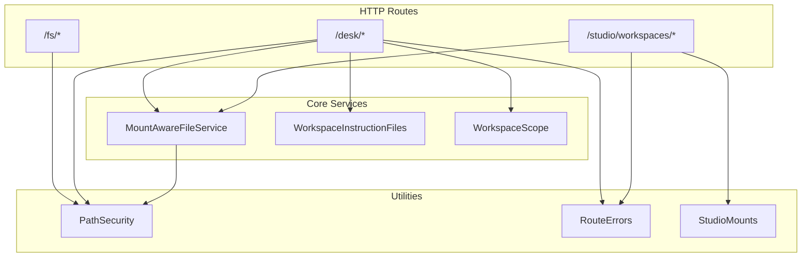
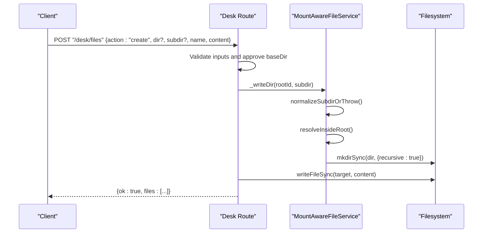
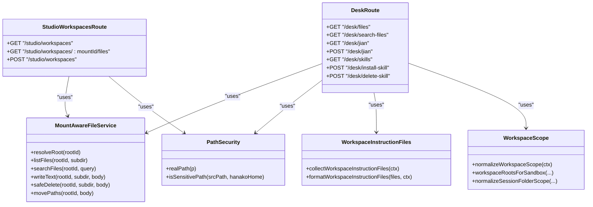

# Workspace File Operations API

<cite>
**Referenced Files in This Document**
- [fs.ts](file://server/routes/fs.ts)
- [desk.ts](file://server/routes/desk.ts)
- [studio-workspaces.ts](file://server/routes/studio-workspaces.ts)
- [mount-aware-file-service.ts](file://core/mount-aware-file-service.ts)
- [workspace-instruction-files.ts](file://core/workspace-instruction-files.ts)
- [workspace-scope.ts](file://shared/workspace-scope.ts)
- [path-security.ts](file://server/utils/path-security.ts)
- [route-errors.ts](file://server/http/route-errors.ts)
- [studio-mounts.ts](file://core/studio-mounts.ts)
</cite>

## Table of Contents
1. Introduction
2. Project Structure
3. Core Components
4. Architecture Overview
5. Detailed Component Analysis
6. Dependency Analysis
7. Performance Considerations
8. Troubleshooting Guide
9. Conclusion

## Introduction
This document provides detailed API documentation for workspace file operations and desk functionality. It covers:
- File CRUD operations, directory navigation, and search
- Workspace organization via mount-aware roots
- Instruction file management (AGENTS.md / CLAUDE.md)
- HTTP methods, URL patterns, request/response schemas with TypeScript interfaces
- Parameter validation rules and status codes
- Examples for workspace setup, file synchronization, batch operations, permission-based access control, and error recovery
- Workspace scope isolation, path security, and mount-aware file service integration

## Project Structure
The workspace file APIs are implemented as Hono routes under server/routes, backed by a mount-aware file service and shared utilities for path security and workspace scoping.



**Diagram sources**
- [fs.ts:57-141](file://server/routes/fs.ts#L57-L141)
- [desk.ts:257-1525](file://server/routes/desk.ts#L257-L1525)
- [studio-workspaces.ts:15-73](file://server/routes/studio-workspaces.ts#L15-L73)
- [mount-aware-file-service.ts:34-293](file://core/mount-aware-file-service.ts#L34-L293)
- [workspace-instruction-files.ts:67-96](file://core/workspace-instruction-files.ts#L67-L96)
- [workspace-scope.ts:10-57](file://shared/workspace-scope.ts#L10-L57)
- [path-security.ts:10-39](file://server/utils/path-security.ts#L10-L39)
- [route-errors.ts:27-36](file://server/http/route-errors.ts#L27-L36)
- [studio-mounts.ts:30-68](file://core/studio-mounts.ts#L30-L68)

**Section sources**
- [fs.ts:57-141](file://server/routes/fs.ts#L57-L141)
- [desk.ts:257-1525](file://server/routes/desk.ts#L257-L1525)
- [studio-workspaces.ts:15-73](file://server/routes/studio-workspaces.ts#L15-L73)

## Core Components
- Mount-Aware File Service: Centralizes root resolution, capability checks, safe path normalization, and file operations across local and studio mounts.
- Desk Route: Exposes REST endpoints for listing/searching files, creating/renaming/moving/deleting, jian.md management, skills scanning/installation, and activity/cron helpers.
- Studio Workspaces Route: Lists workspaces and files per mountId; creates local-path workspaces with authorization and audit logging.
- Path Security: Provides real path resolution and sensitive path detection to prevent traversal and exposure of sensitive directories.
- Workspace Scope and Instruction Files: Normalizes workspace folders and collects AGENTS.md/CLAUDE.md from the working directory chain.

**Section sources**
- [mount-aware-file-service.ts:34-293](file://core/mount-aware-file-service.ts#L34-L293)
- [desk.ts:257-1525](file://server/routes/desk.ts#L257-L1525)
- [studio-workspaces.ts:15-73](file://server/routes/studio-workspaces.ts#L15-L73)
- [path-security.ts:10-39](file://server/utils/path-security.ts#L10-L39)
- [workspace-scope.ts:10-57](file://shared/workspace-scope.ts#L10-L57)
- [workspace-instruction-files.ts:67-96](file://core/workspace-instruction-files.ts#L67-L96)

## Architecture Overview
The system enforces strict path containment within allowed roots (hanako home and approved desk directories), resolves symlinks safely, and scopes operations by mountId or default workspace. The MountAwareFileService abstracts storage providers and capabilities, while routes validate inputs and return structured errors.



**Diagram sources**
- [desk.ts:1319-1395](file://server/routes/desk.ts#L1319-L1395)
- [mount-aware-file-service.ts:247-255](file://core/mount-aware-file-service.ts#L247-L255)
- [mount-aware-file-service.ts:466-473](file://core/mount-aware-file-service.ts#L466-L473)
- [mount-aware-file-service.ts:440-452](file://core/mount-aware-file-service.ts#L440-L452)

## Detailed Component Analysis

### File Read and Tree APIs (/fs/*)
- GET /fs/read?path=...
  - Reads UTF-8 text from an allowed path.
  - Allowed roots: hanako home and agent desk home folder.
  - Status codes: 200 OK, 400 Bad Request (missing path), 403 Forbidden (path not allowed), 404 Not Found (file not found).
- GET /fs/read-base64?path=...
  - Returns base64-encoded content for binary-safe transfer.
  - Status codes: 200 OK, 400 Bad Request, 403 Forbidden, 404 Not Found.
- GET /fs/docx-html?path=...
  - Converts .docx to HTML using mammoth.
  - Limits: max 20 MB.
  - Status codes: 200 OK, 400 Bad Request (not a file), 413 Payload Too Large, 404 Not Found, 500 Internal Server Error.
- GET /fs/tree?path=...&depth=N
  - Builds a directory tree up to depth N (1–10).
  - Status codes: 200 OK, 400 Bad Request (not a directory), 403 Forbidden, 404 Not Found, 500 Internal Server Error.

Request parameters:
- path: string, required. Must resolve inside allowed roots after symlink resolution.
- depth: integer query param, optional, clamped to [1,10].

Response schemas:
- Text responses for read/read-base64/docx-html.
- Tree response:
  - tree: Array<{ name: string; path: string; relativePath: string; isDirectory: boolean; children?: Array }>

Validation and security:
- Symlinks rejected for existing files; realpath must remain within allowed roots.
- For non-existing paths, parent realpath must be within allowed roots.

**Section sources**
- [fs.ts:26-55](file://server/routes/fs.ts#L26-L55)
- [fs.ts:72-138](file://server/routes/fs.ts#L72-L138)
- [fs.ts:144-165](file://server/routes/fs.ts#L144-L165)

### Desk File Operations (/desk/files)
POST /desk/files
- Actions supported:
  - upload: Copy absolute source paths into desk directory (local owner only).
  - create: Create a new file with content.
  - mkdir: Create a directory.
  - rename: Rename a file/folder.
  - move: Move multiple items into a destination folder.
  - movePaths: Batch move across subdirectories with currentSubdir and destSubdir.
  - remove: Delete a file/folder.

Request schema (TypeScript):
```typescript
interface DeskFilesRequest {
  action: "upload" | "create" | "mkdir" | "rename" | "move" | "movePaths" | "remove";
  agentId?: string;
  dir?: string; // override base directory
  subdir?: string; // relative subdirectory within base
  // create
  name?: string;
  content?: string;
  // rename
  oldName?: string;
  newName?: string;
  // move
  names?: string[];
  destFolder?: string;
  // movePaths
  items?: Array<{ sourceSubdir?: string; name?: string }>;
  destSubdir?: string;
  currentSubdir?: string;
  // upload
  paths?: string[];
}
```

Response schemas:
- Common success: { ok: true, files: Array<FileEntry>, ...action-specific fields }
- FileEntry: { name: string; size?: number; mtime: string; isDir: boolean }
- Upload results: { results: Array<{ src: string; name?: string; error?: string }>; files: FileEntry[] }
- Move results: { results: Array<{ name: string; ok?: boolean; error?: string; skipped?: boolean }>; filesByPath?: Record<string, FileEntry[]>; files: FileEntry[] }

Validation and security:
- Base directory approval: if dir is provided, it must be approved via engine’s approval logic.
- Subdir validation: no backslashes, no "..", no leading dot segments.
- Entry names: plain names without slashes/backslashes, not "." or "..", not starting with ".".
- Sensitive path blocking for upload: rejects paths under sensitive directories and hanako home.
- Local owner requirement for upload by absolute path.

Status codes:
- 200 OK on success
- 400 Bad Request for validation failures
- 403 Forbidden for unauthorized actions (e.g., upload by non-local owner)
- 404 Not Found when target does not exist
- 500 Internal Server Error on unexpected failures

Examples:
- Create a file:
  - Request: { action: "create", dir: "/home/user/desk", subdir: "notes", name: "todo.md", content: "# Todo" }
  - Response: { ok: true, files: [...] }
- Batch move:
  - Request: { action: "movePaths", currentSubdir: "drafts", destSubdir: "archive", items: [{ sourceSubdir: "drafts", name: "a.md" }, { sourceSubdir: "drafts", name: "b.md" }] }
  - Response: { ok: true, results: [...], filesByPath: { "drafts": [...], "archive": [...] }, files: [...] }

**Section sources**
- [desk.ts:1319-1521](file://server/routes/desk.ts#L1319-L1521)
- [desk.ts:152-182](file://server/routes/desk.ts#L152-L182)
- [desk.ts:184-255](file://server/routes/desk.ts#L184-L255)
- [desk.ts:38-59](file://server/routes/desk.ts#L38-L59)
- [desk.ts:92-100](file://server/routes/desk.ts#L92-L100)
- [path-security.ts:25-39](file://server/utils/path-security.ts#L25-L39)

### Desk Directory Navigation and Search
- GET /desk/files?dir=&subdir=
  - Lists files in a directory with optional subdir.
  - Validates subdir and ensures target stays within base dir.
  - Returns { files: FileEntry[], subdir: string, basePath: string|null }.
- GET /desk/search-files?dir=&q=&limit=
  - Recursively searches filenames within base dir, skipping common directories.
  - Returns { results: SearchResult[], basePath: string|null, query: string }.
  - SearchResult: { name: string; relativePath: string; parentSubdir: string; isDir: boolean; size?: number; mtime: string }

Validation:
- dir must be approved if explicitly provided.
- subdir must not contain "..", ".", backslashes, or start with ".".
- limit clamped to WORKSPACE_SEARCH_LIMIT.

**Section sources**
- [desk.ts:1229-1264](file://server/routes/desk.ts#L1229-L1264)
- [desk.ts:184-255](file://server/routes/desk.ts#L184-L255)

### Desk Jian.md Management
- GET /desk/jian?dir=&subdir=
  - Reads jian.md from target directory.
  - Returns { content: string|null }.
- POST /desk/jian
  - Saves jian.md; empty content deletes the file.
  - Request: { dir?, subdir?, content?: string|null }
  - Response: { ok: boolean, content: string|null }

Validation:
- dir approval and subdir safety checks apply.

**Section sources**
- [desk.ts:1266-1316](file://server/routes/desk.ts#L1266-L1316)

### Desk Skills Management
- GET /desk/skills?agentId=&dir=&mountId=
  - Scans project-level skill directories (.agents/skills, etc.) and returns discovered skills.
  - Returns { skills: SkillInfo[] }.
  - SkillInfo: { name: string; description: string; source: string; dirPath: string; filePath: string; baseDir: string; workspaceMountId?: string }
- POST /desk/install-skill
  - Installs a skill package (folder or .zip/.skill) into .agents/skills.
  - Request: { filePath?, dir?, mountId?, agentId?, ...package metadata }
  - Response: { ok: boolean, name: string, installedSkillSource: any }
- POST /desk/delete-skill
  - Deletes a skill directory within allowed workspace skill dirs.
  - Request: { skillDir: string, agentId? }
  - Response: { ok: boolean }

Validation:
- dir approval and mount-aware root resolution.
- Deletion restricted to known skill subdirectories.

**Section sources**
- [desk.ts:1094-1133](file://server/routes/desk.ts#L1094-L1133)
- [desk.ts:1140-1185](file://server/routes/desk.ts#L1140-L1185)
- [desk.ts:1187-1217](file://server/routes/desk.ts#L1187-L1217)
- [workspace-skill-paths.ts:4-21](file://shared/workspace-skill-paths.ts#L4-L21)

### Workspace Instructions (AGENTS.md / CLAUDE.md)
- collectWorkspaceInstructionFiles({ cwd, workspaceContext })
  - Collects instruction files from the working directory chain up to git root or cwd.
  - Enabled by keys in workspaceContext (inject_agents_md, inject_claude_md).
  - Returns Array<{ path: string; filename: string; content: string }>.
- formatWorkspaceInstructionFiles(files, { locale })
  - Formats collected files into a localized prompt section.

Use cases:
- Inject project-level rules into agent context based on workspace scope.

**Section sources**
- [workspace-instruction-files.ts:67-119](file://core/workspace-instruction-files.ts#L67-L119)

### Workspace Scope Isolation
- normalizeWorkspaceScope({ primaryCwd, workspaceFolders })
  - Deduplicates and normalizes primary and extra folders.
- workspaceRootsForSandbox(primaryCwd, workspaceFolders, authorizedFolders)
  - Produces sandbox-authorized folders list.
- normalizeSessionFolderScope({ primaryCwd, workspaceFolders, authorizedFolders })
  - Combines workspace and authorized folders into sandboxFolders.
- formatWorkspaceScopePrompt({ primaryCwd, workspaceFolders, locale })
  - Generates human-readable scope summary.

**Section sources**
- [workspace-scope.ts:10-95](file://shared/workspace-scope.ts#L10-L95)

### Mount-Aware File Service Integration
MountAwareFileService provides:
- Root resolution: default root or studio mount by mountId.
- Capability enforcement: list, read, write, watch, materialize, execute.
- Safe path normalization and containment checks.
- Versioned writes with expectedVersion conflict detection.
- Trash-based safeDelete with metadata.
- Batch movePaths returning affected subdirectory listings.

Key methods:
- resolveRoot(rootId)
- resolveDirectory(rootId, subdir)
- listFiles(rootId, subdir)
- searchFiles(rootId, query)
- contentTarget(rootId, subdir, name)
- mkdir(rootId, subdir, body)
- writeText(rootId, subdir, body)
- rename(rootId, subdir, body)
- move(rootId, subdir, body)
- movePaths(rootId, body)
- safeDelete(rootId, subdir, body)
- writeFileTarget(rootId, subdir, name)

Error model:
- MountAwareFileError with code and status fields.

**Section sources**
- [mount-aware-file-service.ts:34-293](file://core/mount-aware-file-service.ts#L34-L293)
- [mount-aware-file-service.ts:336-438](file://core/mount-aware-file-service.ts#L336-L438)
- [mount-aware-file-service.ts:466-489](file://core/mount-aware-file-service.ts#L466-L489)

### Studio Workspaces API
- GET /studio/workspaces
  - Lists available workspaces (default + active mounts).
  - Response: { studioId: string; workspaces: WorkspaceInfo[] }
  - WorkspaceInfo: { workspaceId: string; mountId: string; label: string; sourceKind: string; provider?: string; presentation: string; capabilities: string[]; isDefault?: boolean; nativeRootPath?: string; sourceStudioId?: string; sourceResourceId?: string }
- GET /studio/workspaces/:mountId/files?subdir=
  - Lists files for a specific mountId/subdir.
  - Response: { rootId: string; mountId: string; mount: RootInfo; subdir: string; files: FileEntry[] }
- POST /studio/workspaces
  - Creates a local-path workspace (requires local owner).
  - Request: { path: string; label?: string }
  - Response: { ok: boolean; workspace: WorkspaceInfo }

Authorization:
- Requires capability "files.read" or "files.write".
- Audit logging for creation.

**Section sources**
- [studio-workspaces.ts:15-73](file://server/routes/studio-workspaces.ts#L15-L73)
- [studio-workspaces.ts:75-122](file://server/routes/studio-workspaces.ts#L75-L122)
- [studio-workspaces.ts:124-148](file://server/routes/studio-workspaces.ts#L124-L148)
- [studio-mounts.ts:30-68](file://core/studio-mounts.ts#L30-L68)

### Permission-Based Access Control
- Local owner principal can use absolute path uploads and receive nativeRootPath disclosures.
- Remote principals cannot use absolute paths and do not receive nativeRootPath.
- Mount capabilities enforced at service layer.
- Route-level authorization for studio operations.

**Section sources**
- [desk.ts:485-488](file://server/routes/desk.ts#L485-L488)
- [mount-aware-file-service.ts:321-328](file://core/mount-aware-file-service.ts#L321-L328)
- [studio-workspaces.ts:124-148](file://server/routes/studio-workspaces.ts#L124-L148)

### Error Handling and Recovery Patterns
- Structured route errors via jsonRouteError with code/message/status.
- MountAwareFileError carries code and status for consistent client handling.
- Conflict detection for concurrent edits via expectedVersion (mtimeMs/size/sha256).
- Safe delete moves files to trash with metadata for recovery.

Recovery strategies:
- On version conflict, re-fetch files and retry with updated expectedVersion.
- On safeDelete, restore from trash using payload and metadata.

**Section sources**
- [route-errors.ts:27-36](file://server/http/route-errors.ts#L27-L36)
- [mount-aware-file-service.ts:119-153](file://core/mount-aware-file-service.ts#L119-L153)
- [mount-aware-file-service.ts:213-233](file://core/mount-aware-file-service.ts#L213-L233)

## Dependency Analysis


**Diagram sources**
- [desk.ts:257-1525](file://server/routes/desk.ts#L257-L1525)
- [studio-workspaces.ts:15-73](file://server/routes/studio-workspaces.ts#L15-L73)
- [mount-aware-file-service.ts:34-293](file://core/mount-aware-file-service.ts#L34-L293)
- [workspace-instruction-files.ts:67-119](file://core/workspace-instruction-files.ts#L67-L119)
- [workspace-scope.ts:10-95](file://shared/workspace-scope.ts#L10-L95)
- [path-security.ts:10-39](file://server/utils/path-security.ts#L10-L39)

**Section sources**
- [desk.ts:257-1525](file://server/routes/desk.ts#L257-L1525)
- [studio-workspaces.ts:15-73](file://server/routes/studio-workspaces.ts#L15-L73)
- [mount-aware-file-service.ts:34-293](file://core/mount-aware-file-service.ts#L34-L293)

## Performance Considerations
- Limit recursive search depth and result count to avoid heavy scans.
- Use readdir with withFileTypes and stat only when needed.
- Prefer batch operations (movePaths) to reduce round-trips.
- Avoid large docx conversions; enforce size limits.

[No sources needed since this section provides general guidance]

## Troubleshooting Guide
Common issues and resolutions:
- Path not allowed: Ensure requested path resolves within allowed roots; check symlink behavior and parent realpath containment.
- Invalid subdir/name: Remove "..", ".", backslashes, and ensure names do not start with ".".
- Unauthorized upload: Only local owner can upload by absolute path; use remote upload endpoints instead.
- Version conflict: Update expectedVersion with latest mtimeMs/size before retrying writeText.
- Missing workspace: Provide a valid defaultDeskCwd or mountId; ensure mount is active and accessible.

**Section sources**
- [fs.ts:26-55](file://server/routes/fs.ts#L26-L55)
- [desk.ts:1319-1395](file://server/routes/desk.ts#L1319-L1395)
- [mount-aware-file-service.ts:119-153](file://core/mount-aware-file-service.ts#L119-L153)

## Conclusion
The workspace file operations API offers secure, mount-aware file management with robust validation, permission controls, and structured error handling. It supports comprehensive CRUD, search, batch operations, and workspace instruction injection, enabling reliable integration across desktop and remote clients.