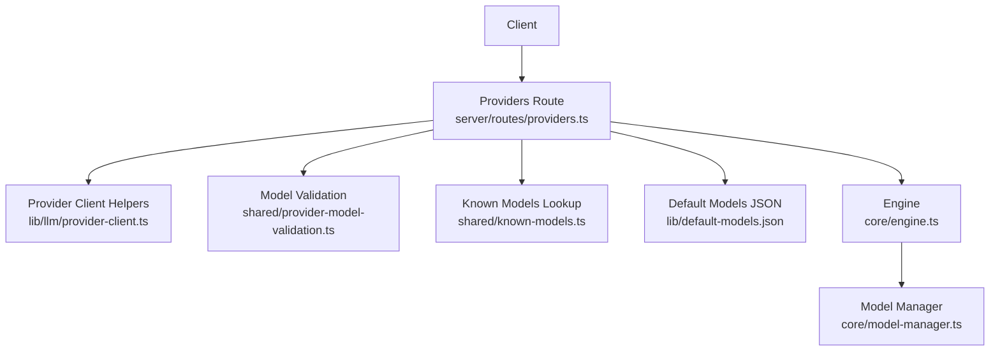
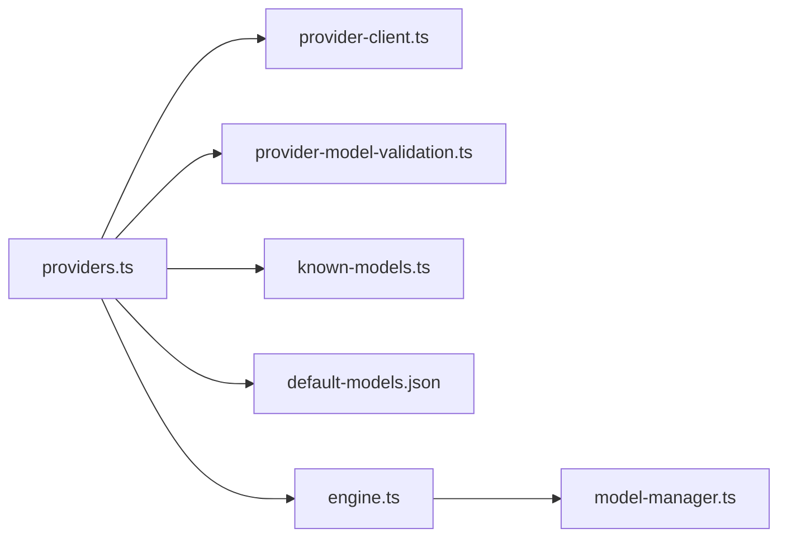

# Model Discovery API

<cite>
**Referenced Files in This Document**
- [providers.ts](file://server/routes/providers.ts)
- [provider-client.ts](file://lib/llm/provider-client.ts)
- [provider-model-validation.ts](file://shared/provider-model-validation.ts)
- [known-models.ts](file://shared/known-models.ts)
- [default-models.json](file://lib/default-models.json)
- [engine.ts](file://core/engine.ts)
- [model-manager.ts](file://core/model-manager.ts)
</cite>

## Table of Contents
1. Introduction
2. Project Structure
3. Core Components
4. Architecture Overview
5. Detailed Component Analysis
6. Dependency Analysis
7. Performance Considerations
8. Troubleshooting Guide
9. Conclusion

## Introduction
This document provides detailed API documentation for model discovery and management endpoints focused on:
- POST /api/providers/fetch-models: Remote model listing with a waterfall fallback strategy (remote → registry → defaults).
- GET /api/providers/:name/discovered-models: Read cached discovered models per provider.

It includes HTTP methods, URL patterns, request/response schemas (TypeScript interfaces), parameter validation rules, status codes, examples for OpenAI, Anthropic, and Google providers, authentication handling, filtering invalid models, cache management, normalization, and compatibility validation.

## Project Structure
The relevant server routes are implemented under the server routes module, with supporting utilities for provider client headers/base-url normalization, model validation, known-model lookup, and default models. The engine delegates registry model retrieval to the model manager.



**Diagram sources**
- [providers.ts:356-443](file://server/routes/providers.ts#L356-L443)
- [provider-client.ts:75-153](file://lib/llm/provider-client.ts#L75-L153)
- [provider-model-validation.ts:68-81](file://shared/provider-model-validation.ts#L68-L81)
- [known-models.ts:60-91](file://shared/known-models.ts#L60-L91)
- [default-models.json:1-218](file://lib/default-models.json#L1-L218)
- [engine.ts:1456-1456](file://core/engine.ts#L1456-L1456)
- [model-manager.ts:525-525](file://core/model-manager.ts#L525-L525)

**Section sources**
- [providers.ts:356-443](file://server/routes/providers.ts#L356-L443)
- [provider-client.ts:75-153](file://lib/llm/provider-client.ts#L75-L153)
- [provider-model-validation.ts:68-81](file://shared/provider-model-validation.ts#L68-L81)
- [known-models.ts:60-91](file://shared/known-models.ts#L60-L91)
- [default-models.json:1-218](file://lib/default-models.json#L1-L218)
- [engine.ts:1456-1456](file://core/engine.ts#L1456-L1456)
- [model-manager.ts:525-525](file://core/model-manager.ts#L525-L525)

## Core Components
- Providers route: Implements fetch-models and discovered-models endpoints, including credential resolution, remote list calls, normalization, filtering, caching, and fallback logic.
- Provider client helpers: Build auth headers, normalize base URLs per protocol, and construct probe URLs.
- Model validation: Filters out reserved or invalid model IDs (e.g., provider-level placeholders).
- Known models: Provides name/context/maxOutput enrichment via known-model dictionaries.
- Default models: Supplies built-in fallback model lists per provider.
- Engine and Model Manager: Provide registry model retrieval used by the fallback path.

Key responsibilities:
- Waterfall strategy: Try remote list first; if it fails or returns only invalid models, fall back to registry, then defaults.
- Normalization: Map provider-specific responses into a common shape {id, name, context, maxOutput}.
- Filtering: Remove reserved/invalid model IDs based on provider rules.
- Caching: Persist discovered models per provider with timestamp.

**Section sources**
- [providers.ts:229-344](file://server/routes/providers.ts#L229-L344)
- [provider-client.ts:75-153](file://lib/llm/provider-client.ts#L75-L153)
- [provider-model-validation.ts:68-81](file://shared/provider-model-validation.ts#L68-L81)
- [known-models.ts:60-91](file://shared/known-models.ts#L60-L91)
- [default-models.json:1-218](file://lib/default-models.json#L1-L218)
- [engine.ts:1456-1456](file://core/engine.ts#L1456-L1456)
- [model-manager.ts:525-525](file://core/model-manager.ts#L525-L525)

## Architecture Overview
The fetch-models endpoint implements a three-stage waterfall:
1. Resolve credentials and effective base URL/api from request body and saved configuration.
2. Attempt remote list models call using provider-specific URL and headers.
3. If remote fails or yields only invalid models, fall back to registry models, then to defaults.

```mermaid
sequenceDiagram
participant C as "Client"
participant R as "Providers Route"
participant PC as "Provider Client"
participant V as "Validation"
participant K as "Known Models"
participant D as "Defaults JSON"
participant E as "Engine"
participant M as "Model Manager"
C->>R : POST /api/providers/fetch-models {name, base_url?, api?, api_key?}
R->>R : Validate scope + secrets
R->>R : Normalize base_url/api, resolve headers
alt Effective base_url present
R->>PC : buildProviderRequestHeaders()
R->>R : fetch(url, headers)
alt 401/403
R-->>C : {error, models : []}
else OK
R->>K : normalizeRemoteModels(data, api)
R->>V : filterDiscoveredProviderModels(name, models, {baseUrl})
alt Only ignored models
R-->>C : {error, models : [], ignoredModels}
else Valid models
R->>R : saveToCache(name, models)
R-->>C : {models[, ignoredModels]}
end
else Other error
R->>E : getRegistryModelsForProvider(name)
E->>M : getRegistryModelsForProvider(name)
alt Registry has models
R->>V : filterDiscoveredProviderModels(...)
R->>R : saveToCache(name, filtered)
R-->>C : {source : "registry", models[, ignoredModels]}
else No registry models
R->>D : getDefaultModels(name/authKey)
alt Defaults exist
R->>V : filterDiscoveredProviderModels(...)
R->>R : saveToCache(name, filtered)
R-->>C : {source : "builtin", models[, ignoredModels]}
else None
R-->>C : {error, models : []}
end
end
end
else No base_url
R->>E : getRegistryModelsForProvider(name)
... same fallback flow ...
end
```

**Diagram sources**
- [providers.ts:356-443](file://server/routes/providers.ts#L356-L443)
- [provider-client.ts:75-153](file://lib/llm/provider-client.ts#L75-L153)
- [provider-model-validation.ts:68-81](file://shared/provider-model-validation.ts#L68-L81)
- [known-models.ts:60-91](file://shared/known-models.ts#L60-L91)
- [default-models.json:1-218](file://lib/default-models.json#L1-L218)
- [engine.ts:1456-1456](file://core/engine.ts#L1456-L1456)
- [model-manager.ts:525-525](file://core/model-manager.ts#L525-L525)

## Detailed Component Analysis

### Endpoint: POST /api/providers/fetch-models
Purpose:
- Discover available models for a provider by attempting a remote list, then falling back to registry and defaults.

Authentication and authorization:
- Requires scope providers.manage.
- Secret mutation guard applies to api_key and header patches.

Request schema (TypeScript):
```typescript
interface FetchModelsRequest {
  name?: string;
  base_url?: string;
  api?: string;
  api_key?: string;
  headers?: Record<string, string>;
}
```

Parameter validation rules:
- Either name or base_url must be provided; otherwise returns 400 with error message.
- If api_key is present without api, returns 400 with error message.
- For anthropic-messages, uses a specific models endpoint; for others, uses standard /models.

Response schema (TypeScript):
```typescript
interface DiscoveredModel {
  id: string;
  name?: string;
  context?: number | null;
  maxOutput?: number | null;
}

interface FetchModelsResponse {
  source?: "registry" | "builtin";
  models: DiscoveredModel[];
  ignoredModels?: string[];
  error?: string;
}
```

Status codes:
- 200: Success with models (and optional ignoredModels).
- 400: Missing required parameters or missing api when api_key provided.
- 401/403: Authentication failure from remote provider (no fallback).
- 5xx: Unexpected errors during processing.

Processing logic highlights:
- Credential resolution: Request body overrides saved credentials; masked secret values are resolved to stored keys.
- Base URL normalization: Protocol-specific adjustments (e.g., kimi-coding, ollama, minimax).
- Remote list:
  - Anthropic: GET {base}/v1/models?limit=1000.
  - Others: GET {base}/models.
- Normalization: Maps provider response fields to common shape.
- Filtering: Removes reserved/invalid model IDs (e.g., provider placeholder IDs).
- Fallback:
  - Registry models via engine.getRegistryModelsForProvider(name).
  - Defaults via lib/default-models.json keyed by provider or its authJsonKey.
- Cache: On success, persists models with fetchedAt timestamp.

Examples:
- OpenAI-compatible:
  - Request: { name: "openai", base_url: "https://api.openai.com", api: "openai-completions", api_key: "sk-..." }
  - Response: { models: [{ id: "gpt-4o", name: "gpt-4o", context: ..., maxOutput: ... }] }
- Anthropic Messages:
  - Request: { name: "anthropic", base_url: "https://api.anthropic.com", api: "anthropic-messages", api_key: "sk-ant-..." }
  - Response: { models: [...] }
- Google Generative AI:
  - Request: { name: "gemini", base_url: "https://generativelanguage.googleapis.com", api: "google-generative-ai", api_key: "AIza..." }
  - Response: { models: [...] }

Notes:
- If remote returns only invalid model IDs, response includes ignoredModels and an error describing the issue.
- For openai-codex-responses, the endpoint bypasses remote list and uses registry/defaults directly.

**Section sources**
- [providers.ts:356-443](file://server/routes/providers.ts#L356-L443)
- [provider-client.ts:75-153](file://lib/llm/provider-client.ts#L75-L153)
- [provider-model-validation.ts:68-81](file://shared/provider-model-validation.ts#L68-L81)
- [known-models.ts:60-91](file://shared/known-models.ts#L60-L91)
- [default-models.json:1-218](file://lib/default-models.json#L1-L218)
- [engine.ts:1456-1456](file://core/engine.ts#L1456-L1456)
- [model-manager.ts:525-525](file://core/model-manager.ts#L525-L525)

### Endpoint: GET /api/providers/:name/discovered-models
Purpose:
- Retrieve previously discovered models for a provider from the local cache.

Authorization:
- Requires scope providers.manage.

Path parameters:
- name: Provider identifier.

Response schema (TypeScript):
```typescript
interface DiscoveredModelsResponse {
  models: DiscoveredModel[];
  ignoredModels?: string[];
  fetchedAt: string | null;
}
```

Behavior:
- Reads per-provider cache entry.
- Re-applies filtering against current credentials (e.g., baseUrl-based rules).
- Returns empty models and null fetchedAt if no cache exists.

**Section sources**
- [providers.ts:449-459](file://server/routes/providers.ts#L449-L459)
- [provider-model-validation.ts:68-81](file://shared/provider-model-validation.ts#L68-L81)

### Normalization and Compatibility Validation
Normalization:
- Remote responses are mapped to a consistent shape with id, name, context, maxOutput.
- Anthropic and Google have specialized mappings; generic mapping covers other providers.

Compatibility validation:
- Reserved model IDs (e.g., provider-level placeholders) are filtered out and reported via ignoredModels.
- Known models dictionary can enrich names and metadata where available.

**Section sources**
- [providers.ts:229-266](file://server/routes/providers.ts#L229-L266)
- [provider-model-validation.ts:68-81](file://shared/provider-model-validation.ts#L68-L81)
- [known-models.ts:60-91](file://shared/known-models.ts#L60-L91)

### Waterfall Fallback Strategy
Flow:
1. Remote list models (if base_url present).
2. If remote fails or returns only invalid models, try registry models via engine.getRegistryModelsForProvider(name).
3. If registry empty, try defaults from lib/default-models.json using provider id or authJsonKey.

Special cases:
- openai-codex-responses: Skip remote list; use registry/defaults directly.
- 401/403 from remote: Return error immediately without fallback.

**Section sources**
- [providers.ts:308-344](file://server/routes/providers.ts#L308-L344)
- [engine.ts:1456-1456](file://core/engine.ts#L1456-L1456)
- [model-manager.ts:525-525](file://core/model-manager.ts#L525-L525)
- [default-models.json:1-218](file://lib/default-models.json#L1-L218)

### Cache Management
- Cache file location: models-cache.json under the application home directory.
- Atomic write pattern: tmp file + rename to avoid partial reads.
- Per-provider entries include models array and fetchedAt ISO timestamp.
- Discovered models endpoint re-filters cached models using current credentials.

**Section sources**
- [providers.ts:24-55](file://server/routes/providers.ts#L24-L55)
- [providers.ts:449-459](file://server/routes/providers.ts#L449-L459)

## Dependency Analysis


**Diagram sources**
- [providers.ts:356-443](file://server/routes/providers.ts#L356-L443)
- [provider-client.ts:75-153](file://lib/llm/provider-client.ts#L75-L153)
- [provider-model-validation.ts:68-81](file://shared/provider-model-validation.ts#L68-L81)
- [known-models.ts:60-91](file://shared/known-models.ts#L60-L91)
- [default-models.json:1-218](file://lib/default-models.json#L1-L218)
- [engine.ts:1456-1456](file://core/engine.ts#L1456-L1456)
- [model-manager.ts:525-525](file://core/model-manager.ts#L525-L525)

**Section sources**
- [providers.ts:356-443](file://server/routes/providers.ts#L356-L443)
- [provider-client.ts:75-153](file://lib/llm/provider-client.ts#L75-L153)
- [provider-model-validation.ts:68-81](file://shared/provider-model-validation.ts#L68-L81)
- [known-models.ts:60-91](file://shared/known-models.ts#L60-L91)
- [default-models.json:1-218](file://lib/default-models.json#L1-L218)
- [engine.ts:1456-1456](file://core/engine.ts#L1456-L1456)
- [model-manager.ts:525-525](file://core/model-manager.ts#L525-L525)

## Performance Considerations
- Network timeouts: Remote requests use AbortSignal timeout to prevent hanging.
- Minimal I/O: Cache writes use atomic tmp+rename to reduce contention.
- Fallback efficiency: Registry and defaults provide quick paths when remote is unavailable.
- Filtering cost: Validation runs over returned models; keep payloads reasonable.

[No sources needed since this section provides general guidance]

## Troubleshooting Guide
Common issues and resolutions:
- Missing parameters: Ensure either name or base_url is provided; include api when api_key is present.
- Authentication failures: 401/403 indicates invalid credentials; verify api_key and provider selection.
- Invalid model IDs: ignoredModels indicates reserved or unsupported IDs; remove them from usage.
- No models found: Check registry and defaults availability; ensure provider id or authJsonKey matches configured defaults.
- Cache not updated: Verify successful remote or fallback path; check file permissions for models-cache.json.

**Section sources**
- [providers.ts:356-443](file://server/routes/providers.ts#L356-L443)
- [provider-model-validation.ts:68-81](file://shared/provider-model-validation.ts#L68-L81)

## Conclusion
The model discovery endpoints implement a robust waterfall strategy that prioritizes live provider listings while ensuring resilience through registry and defaults. Normalization and validation produce a consistent model schema suitable for downstream consumption, and caching enables efficient repeated access to discovered results.

[No sources needed since this section summarizes without analyzing specific files]