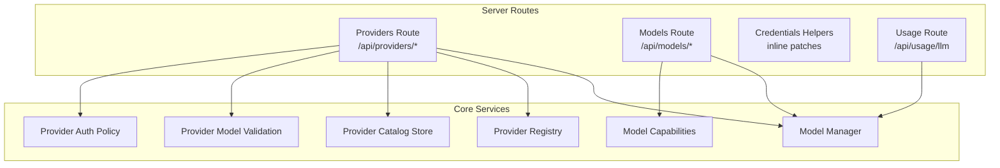
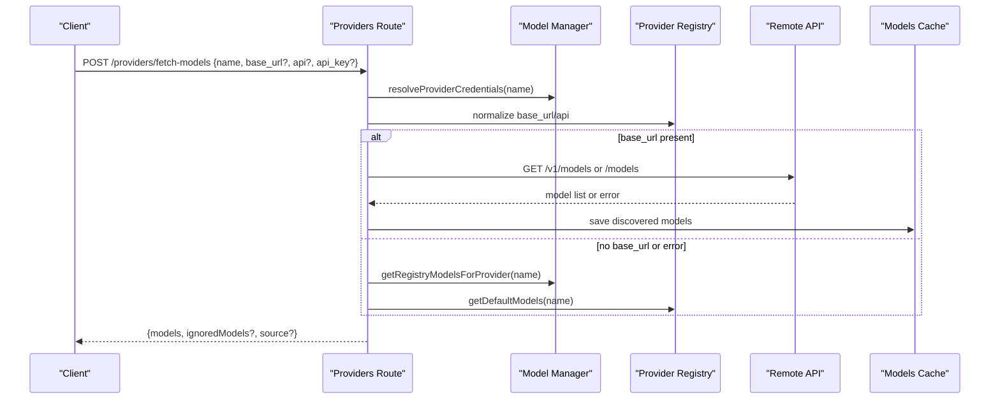
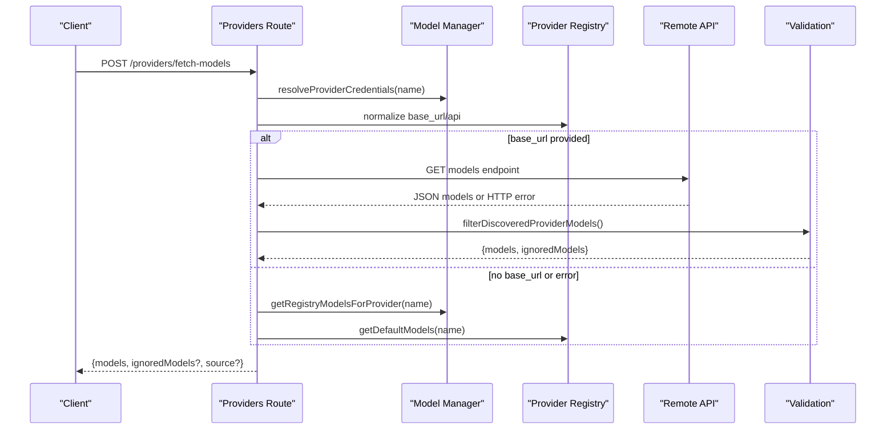
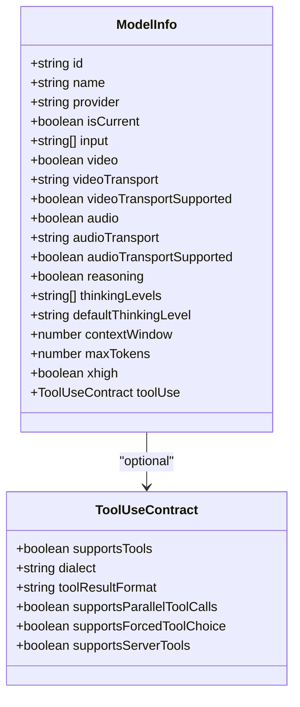
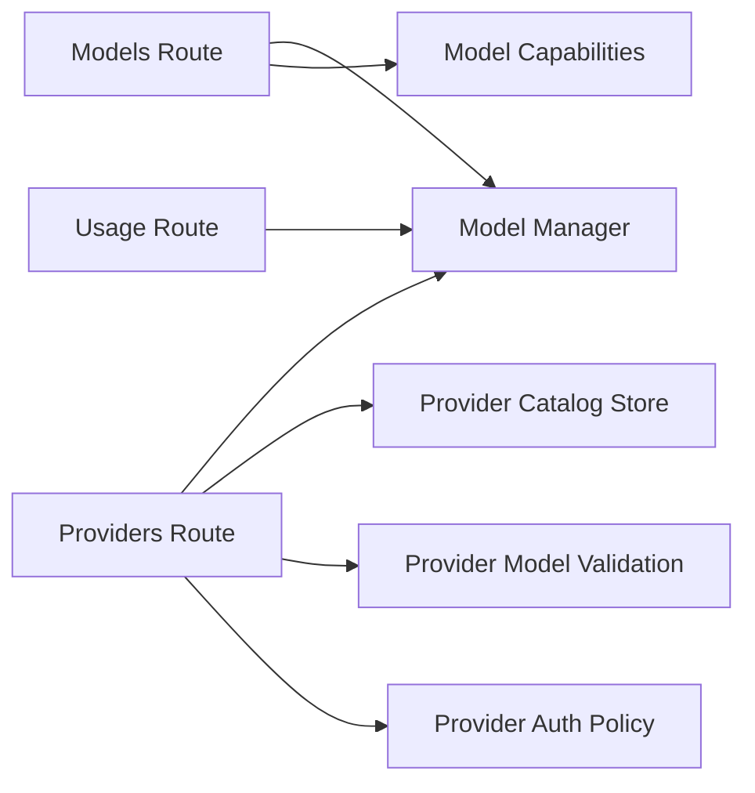

# Provider & Model API

<cite>
**Referenced Files in This Document**
- [providers.ts](file://server/routes/providers.ts)
- [models.ts](file://server/routes/models.ts)
- [provider-credentials.ts](file://server/routes/provider-credentials.ts)
- [usage.ts](file://server/routes/usage.ts)
- [provider-auth.ts](file://shared/provider-auth.ts)
- [model-capabilities.ts](file://shared/model-capabilities.ts)
- [provider-model-validation.ts](file://shared/provider-model-validation.ts)
- [provider-catalog.ts](file://core/provider-catalog.ts)
- [model-manager.ts](file://core/model-manager.ts)
</cite>

## Table of Contents
1. Introduction
2. Project Structure
3. Core Components
4. Architecture Overview
5. Detailed Component Analysis
6. Dependency Analysis
7. Performance Considerations
8. Troubleshooting Guide
9. Conclusion

## Introduction
This document provides comprehensive API documentation for AI provider and model management endpoints. It covers:
- Provider configuration and discovery
- Model selection, switching, and health checks
- Credential management and capability discovery
- Usage monitoring and cost tracking hooks
- Provider compatibility, fallback mechanisms, and validation rules

The APIs are implemented as REST endpoints using Hono and integrate with the internal provider registry, model manager, and usage ledger.

## Project Structure
Provider and model management is primarily exposed through server routes:
- Providers: configuration summary, credential retrieval, model discovery, connection testing, and model metadata updates/deletes
- Models: listing available models, auxiliary vision status, health checks, default model setting, and session-scoped switching
- Credentials: inline patch helpers used by other routes
- Usage: query LLM usage records

**Diagram sources**
- [providers.ts:44-552](file://server/routes/providers.ts#L44-L552)
- [models.ts:184-318](file://server/routes/models.ts#L184-L318)
- [provider-credentials.ts:1-36](file://server/routes/provider-credentials.ts#L1-L36)
- [usage.ts:1-40](file://server/routes/usage.ts#L1-L40)
- [model-manager.ts:93-532](file://core/model-manager.ts#L93-L532)
- [provider-catalog.ts:89-235](file://core/provider-catalog.ts#L89-L235)
- [model-capabilities.ts:1-652](file://shared/model-capabilities.ts#L1-L652)
- [provider-model-validation.ts:1-82](file://shared/provider-model-validation.ts#L1-L82)
- [provider-auth.ts:1-120](file://shared/provider-auth.ts#L1-L120)

**Section sources**
- [providers.ts:44-552](file://server/routes/providers.ts#L44-L552)
- [models.ts:184-318](file://server/routes/models.ts#L184-L318)
- [provider-credentials.ts:1-36](file://server/routes/provider-credentials.ts#L1-L36)
- [usage.ts:1-40](file://server/routes/usage.ts#L1-L40)

## Core Components
- Providers route: aggregates provider summaries, fetches remote model catalogs, tests connectivity, and manages per-provider model metadata.
- Models route: lists available models, performs health checks, sets default model, and switches models within a session.
- Provider credentials helpers: utilities to detect and build inline credential patches.
- Usage route: queries LLM usage records with filters.
- Shared policies: auth normalization, header masking/validation, model capability detection, and provider model validation.
- Core services: model manager (resolution, refresh, sync), provider catalog store (persistence and migration).

**Section sources**
- [providers.ts:44-552](file://server/routes/providers.ts#L44-L552)
- [models.ts:184-318](file://server/routes/models.ts#L184-L318)
- [provider-credentials.ts:1-36](file://server/routes/provider-credentials.ts#L1-L36)
- [usage.ts:1-40](file://server/routes/usage.ts#L1-L40)
- [provider-auth.ts:1-120](file://shared/provider-auth.ts#L1-L120)
- [model-capabilities.ts:1-652](file://shared/model-capabilities.ts#L1-L652)
- [provider-model-validation.ts:1-82](file://shared/provider-model-validation.ts#L1-L82)
- [model-manager.ts:93-532](file://core/model-manager.ts#L93-L532)
- [provider-catalog.ts:89-235](file://core/provider-catalog.ts#L89-L235)

## Architecture Overview
The providers and models APIs orchestrate multiple layers:
- Request handling via Hono routes
- Credential resolution and secret masking
- Remote model discovery with protocol-specific endpoints
- Fallback to registry and defaults when remote calls fail
- Capability enrichment and validation
- Usage recording and querying

**Diagram sources**
- [providers.ts:356-443](file://server/routes/providers.ts#L356-L443)
- [model-manager.ts:526-531](file://core/model-manager.ts#L526-L531)
- [provider-catalog.ts:144-168](file://core/provider-catalog.ts#L144-L168)

## Detailed Component Analysis

### Providers API
Endpoints:
- GET /api/providers/summary
- GET /api/providers/:name/api-key
- POST /api/providers/fetch-models
- GET /api/providers/:name/discovered-models
- POST /api/providers/test
- PUT /api/providers/:name/models/:modelId
- DELETE /api/providers/:name/models/:modelId

Authentication and scopes:
- Most endpoints require scope "providers.manage".
- Reading/writing secrets requires additional secret scopes; masked values are returned unless explicitly allowed.

Request/response schemas (TypeScript interfaces):
- ProviderSummary
- FetchModelsRequest
- FetchModelsResponse
- TestConnectionRequest
- TestConnectionResponse
- UpdateModelEntryRequest
- DeleteModelEntryRequest

Validation rules:
- name or base_url required for fetch-models
- api required when api_key is present
- Header names validated against forbidden set and regex
- Secret fields support masked value passthrough

Status codes:
- 200 on success
- 400 for invalid request bodies or missing parameters
- 401/403 forwarded from remote when credentials are invalid
- 404 when updating/deleting non-existent model entries
- 500 for unexpected errors

Examples:
- Add new provider: configure via provider catalog and use PUT /providers/:name/models/:modelId to add model metadata
- Configure models: update contextWindow, maxOutput, reasoning flags via PUT
- Test connection: POST /providers/test with base_url, api, api_key
- Monitor usage: GET /usage/llm with filters

Compatibility and fallback:
- Anthropic Messages uses /v1/models?limit=1000
- Others use /models
- Fallback chain: remote -> registry -> defaults
- DeepSeek reserved model IDs filtered out during discovery

**Section sources**
- [providers.ts:63-208](file://server/routes/providers.ts#L63-L208)
- [providers.ts:214-225](file://server/routes/providers.ts#L214-L225)
- [providers.ts:356-443](file://server/routes/providers.ts#L356-L443)
- [providers.ts:449-459](file://server/routes/providers.ts#L449-L459)
- [providers.ts:466-508](file://server/routes/providers.ts#L466-L508)
- [providers.ts:514-531](file://server/routes/providers.ts#L514-L531)
- [providers.ts:537-549](file://server/routes/providers.ts#L537-L549)
- [provider-auth.ts:25-35](file://shared/provider-auth.ts#L25-L35)
- [provider-auth.ts:58-96](file://shared/provider-auth.ts#L58-L96)
- [provider-model-validation.ts:68-82](file://shared/provider-model-validation.ts#L68-L82)

#### Sequence Diagram: Fetch Models Flow

**Diagram sources**
- [providers.ts:356-443](file://server/routes/providers.ts#L356-L443)
- [provider-model-validation.ts:68-82](file://shared/provider-model-validation.ts#L68-L82)

### Models API
Endpoints:
- GET /api/models
- GET /api/models/auxiliary-vision
- POST /api/models/health
- POST /api/models/set
- POST /api/models/switch

Request/response schemas (TypeScript interfaces):
- ListModelsResponse
- AuxiliaryVisionStatus
- HealthCheckRequest
- HealthCheckResponse
- SetDefaultModelRequest
- SwitchSessionModelRequest
- SwitchSessionModelResponse

Validation rules:
- Health check requires explicit model reference with provider
- Switch requires sessionPath, modelId, provider
- Streaming sessions cannot switch models

Status codes:
- 200 on success
- 400 for missing parameters
- 409 conflict if streaming
- 422 for missing credentials
- 404 for model not found
- 500 for unexpected errors

Examples:
- List models: GET /api/models
- Health check: POST /api/models/health with {modelId, provider}
- Set default model: POST /api/models/set with {modelId, provider}
- Switch in-session: POST /api/models/switch with {sessionPath, modelId, provider}

Capability discovery:
- Response includes input types, video/audio transports, reasoning levels, toolUse contract, and xhigh flag

**Section sources**
- [models.ts:188-202](file://server/routes/models.ts#L188-L202)
- [models.ts:205-211](file://server/routes/models.ts#L205-L211)
- [models.ts:215-264](file://server/routes/models.ts#L215-L264)
- [models.ts:267-287](file://server/routes/models.ts#L267-L287)
- [models.ts:290-315](file://server/routes/models.ts#L290-L315)
- [model-capabilities.ts:144-168](file://shared/model-capabilities.ts#L144-L168)
- [model-capabilities.ts:422-461](file://shared/model-capabilities.ts#L422-L461)
- [model-capabilities.ts:484-517](file://shared/model-capabilities.ts#L484-L517)
- [model-capabilities.ts:525-551](file://shared/model-capabilities.ts#L525-L551)

#### Class Diagram: Model Serialization

**Diagram sources**
- [models.ts:76-101](file://server/routes/models.ts#L76-L101)
- [model-capabilities.ts:144-168](file://shared/model-capabilities.ts#L144-L168)

### Credentials Helpers
Functions:
- hasInlineProviderCredentialPatch(block)
- buildInlineProviderCredentialUpdate(block, fallbackProvider, existingProvider)
- clearInlineProviderCredentialFields(block)

Purpose:
- Detect and construct inline credential patches for providers
- Masked secret values are preserved from existing storage

**Section sources**
- [provider-credentials.ts:1-36](file://server/routes/provider-credentials.ts#L1-L36)

### Usage API
Endpoint:
- GET /api/usage/llm

Query parameters:
- since, until, attributionKind, sessionPath, agentId, subsystem, operation, modelId, provider, status, limit

Behavior:
- Filters applied based on provided query params
- Default limit 500 unless date window specified
- Limit capped at 2000

**Section sources**
- [usage.ts:1-40](file://server/routes/usage.ts#L1-L40)

## Dependency Analysis
Key dependencies between components:
- Providers route depends on Model Manager for credential resolution and registry access
- Providers route uses Provider Catalog Store for persistence and migration
- Providers route applies Provider Model Validation to filter invalid model IDs
- Providers route uses Provider Auth Policy for header normalization and masking
- Models route relies on Model Capabilities for feature flags and transport resolution
- Usage route integrates with engine's usage ledger

**Diagram sources**
- [providers.ts:44-552](file://server/routes/providers.ts#L44-L552)
- [models.ts:184-318](file://server/routes/models.ts#L184-L318)
- [usage.ts:1-40](file://server/routes/usage.ts#L1-L40)
- [model-manager.ts:93-532](file://core/model-manager.ts#L93-L532)
- [provider-catalog.ts:89-235](file://core/provider-catalog.ts#L89-L235)
- [provider-model-validation.ts:1-82](file://shared/provider-model-validation.ts#L1-L82)
- [provider-auth.ts:1-120](file://shared/provider-auth.ts#L1-L120)
- [model-capabilities.ts:1-652](file://shared/model-capabilities.ts#L1-L652)

**Section sources**
- [providers.ts:44-552](file://server/routes/providers.ts#L44-L552)
- [models.ts:184-318](file://server/routes/models.ts#L184-L318)
- [usage.ts:1-40](file://server/routes/usage.ts#L1-L40)
- [model-manager.ts:93-532](file://core/model-manager.ts#L93-L532)
- [provider-catalog.ts:89-235](file://core/provider-catalog.ts#L89-L235)
- [provider-model-validation.ts:1-82](file://shared/provider-model-validation.ts#L1-L82)
- [provider-auth.ts:1-120](file://shared/provider-auth.ts#L1-L120)
- [model-capabilities.ts:1-652](file://shared/model-capabilities.ts#L1-L652)

## Performance Considerations
- Remote model discovery uses timeouts and best-effort caching to avoid blocking UI
- Fallback mechanisms reduce dependency on external availability
- Filtering and normalization minimize payload sizes
- Usage queries cap limits to prevent large responses

[No sources needed since this section provides general guidance]

## Troubleshooting Guide
Common issues and resolutions:
- Missing parameters: ensure required fields like name/base_url, api_key, api are provided
- Invalid model IDs: reserved provider IDs are filtered; use concrete model IDs
- Credential problems: 401/403 indicates invalid keys; verify provider auth type and headers
- Streaming conflicts: cannot switch models while streaming; wait for completion
- Not found errors: model entry may be deleted or misconfigured; re-add via catalog

**Section sources**
- [providers.ts:356-443](file://server/routes/providers.ts#L356-L443)
- [providers.ts:466-508](file://server/routes/providers.ts#L466-L508)
- [models.ts:215-264](file://server/routes/models.ts#L215-L264)
- [models.ts:290-315](file://server/routes/models.ts#L290-L315)
- [provider-model-validation.ts:68-82](file://shared/provider-model-validation.ts#L68-L82)

## Conclusion
The Provider & Model API provides a robust interface for managing AI providers and models, including discovery, configuration, credential handling, capability detection, and usage monitoring. The design emphasizes security through scoped access and secret masking, resilience via fallback mechanisms, and clarity through well-defined request/response schemas and validation rules.

[No sources needed since this section summarizes without analyzing specific files]