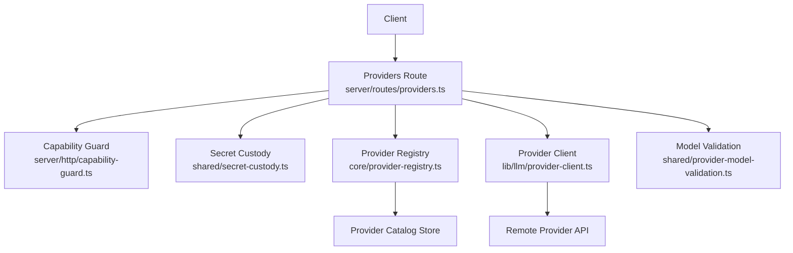
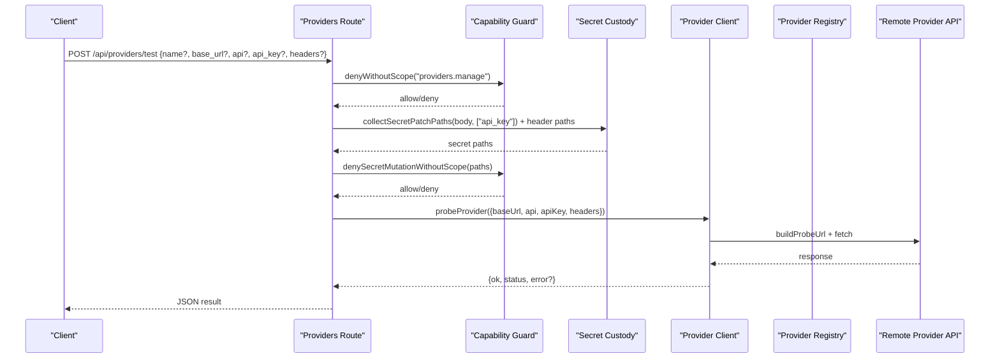
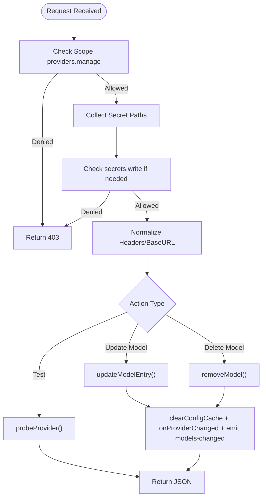

# Provider Configuration API

<cite>
**Referenced Files in This Document**
- [providers.ts](file://server/routes/providers.ts)
- [provider-client.ts](file://lib/llm/provider-client.ts)
- [provider-registry.ts](file://core/provider-registry.ts)
- [provider-model-validation.ts](file://shared/provider-model-validation.ts)
- [secret-custody.ts](file://shared/secret-custody.ts)
- [capability-guard.ts](file://server/http/capability-guard.ts)
- [tester.ts](file://core/providers/tester.ts)
- [types.ts](file://core/providers/types.ts)
</cite>

## Table of Contents
1. [Introduction](#introduction)
2. [Project Structure](#project-structure)
3. [Core Components](#core-components)
4. [Architecture Overview](#architecture-overview)
5. [Detailed Component Analysis](#detailed-component-analysis)
6. [Dependency Analysis](#dependency-analysis)
7. [Performance Considerations](#performance-considerations)
8. [Troubleshooting Guide](#troubleshooting-guide)
9. [Conclusion](#conclusion)

## Introduction
This document provides comprehensive API documentation for provider configuration and testing endpoints, focusing on:
- POST /api/providers/test: connection testing with credential validation and probe responses
- PUT /api/providers/:name/models/:modelId: model metadata updates (context window, max output tokens, etc.)
- DELETE /api/providers/:name/models/:modelId: model removal

It includes HTTP methods, URL patterns, request/response schemas with TypeScript interfaces, parameter validation rules, status codes, examples, and details about secret custody integration, header patching, and cascade refresh mechanisms.

## Project Structure
The provider configuration APIs are implemented as Hono routes under server/routes/providers.ts. They integrate with:
- lib/llm/provider-client.ts for building headers and probing connectivity
- core/provider-registry.ts for reading/writing provider catalog and model metadata
- shared/provider-model-validation.ts for filtering discovered models
- shared/secret-custody.ts for secret masking and patch resolution
- server/http/capability-guard.ts for scope-based authorization

**Diagram sources**
- [providers.ts:44-553](file://server/routes/providers.ts#L44-L553)
- [provider-client.ts:1-216](file://lib/llm/provider-client.ts#L1-L216)
- [provider-registry.ts:1000-1402](file://core/provider-registry.ts#L1000-L1402)
- [provider-model-validation.ts:1-82](file://shared/provider-model-validation.ts#L1-L82)
- [secret-custody.ts:1-107](file://shared/secret-custody.ts#L1-L107)
- [capability-guard.ts:1-46](file://server/http/capability-guard.ts#L1-L46)

**Section sources**
- [providers.ts:44-553](file://server/routes/providers.ts#L44-L553)

## Core Components
- Providers route: implements GET/POST/PUT/DELETE endpoints for provider summary, test, fetch-models, and model CRUD.
- Capability guard: enforces scopes like providers.manage and secrets.write.
- Secret custody: masks secrets, resolves masked patches, and collects secret paths for authorization checks.
- Provider client: builds auth headers per protocol, normalizes base URLs, and probes connectivity.
- Provider registry: persists provider catalog entries and model metadata; triggers cascade refresh after changes.
- Model validation: filters out reserved or invalid model IDs during discovery.

**Section sources**
- [providers.ts:44-553](file://server/routes/providers.ts#L44-L553)
- [capability-guard.ts:1-46](file://server/http/capability-guard.ts#L1-L46)
- [secret-custody.ts:1-107](file://shared/secret-custody.ts#L1-L107)
- [provider-client.ts:1-216](file://lib/llm/provider-client.ts#L1-L216)
- [provider-registry.ts:1000-1402](file://core/provider-registry.ts#L1000-L1402)
- [provider-model-validation.ts:1-82](file://shared/provider-model-validation.ts#L1-L82)

## Architecture Overview
The provider configuration API follows a layered architecture:
- Authorization layer validates scopes before processing requests.
- Request normalization resolves credentials from body or saved config, applies header patching, and sanitizes secrets.
- Business logic performs remote probes or updates provider catalog entries.
- Persistence writes to the provider catalog and triggers cascade refresh events.

**Diagram sources**
- [providers.ts:466-508](file://server/routes/providers.ts#L466-L508)
- [provider-client.ts:166-216](file://lib/llm/provider-client.ts#L166-L216)
- [capability-guard.ts:21-46](file://server/http/capability-guard.ts#L21-L46)
- [secret-custody.ts:68-107](file://shared/secret-custody.ts#L68-L107)

## Detailed Component Analysis

### Endpoint: POST /api/providers/test
Purpose: Test provider connectivity using provided or resolved credentials. Validates required fields, applies header patching, and probes the provider endpoint.

- Method: POST
- Path: /api/providers/test
- Authentication: Requires scope providers.manage. If body contains secret fields (e.g., api_key), requires secrets.write.
- Request schema:
  - name?: string — provider identifier used to resolve saved credentials
  - base_url?: string — effective base URL; if missing, must be present in saved config
  - api?: string — protocol identifier (e.g., openai-completions, anthropic-messages, google-generative-ai)
  - api_key?: string — optional; if present, api is required
  - headers?: Record<string, string> — optional; merged into saved headers via patch semantics
- Response schema:
  - ok: boolean
  - status: number — HTTP status from probe
  - skipped?: string — reason when health check is skipped (e.g., Codex Responses)
  - error?: string — diagnostic message on failure
- Status codes:
  - 200: success with ok field
  - 400: validation errors (missing base_url, api_key without api)
  - 403: insufficient scopes or secret mutation without secrets.write
- Behavior highlights:
  - Credential resolution priority: request body > saved credentials (via engine.resolveProviderCredentials) > plugin defaults
  - Header patching: body.headers merged with saved headers using resolveProviderHeadersPatch
  - Base URL normalization: normalizeProviderBaseUrlForApi handles provider-specific path adjustments
  - Probe strategy: Anthropic uses POST /v1/messages with minimal payload; others use GET /models
  - Timeout: 10 seconds for probe requests
  - Special case: openai-codex-responses skips health check and returns ok=true with skipped reason

Example request:
- POST /api/providers/test
- Body:
  - base_url: "https://api.openai.com"
  - api: "openai-completions"
  - api_key: "sk-..."
  - headers: {}

Example response:
- { ok: true, status: 200 }

Error example:
- { ok: false, error: "HTTP 401: Unauthorized" }

**Section sources**
- [providers.ts:466-508](file://server/routes/providers.ts#L466-L508)
- [provider-client.ts:166-216](file://lib/llm/provider-client.ts#L166-L216)
- [capability-guard.ts:21-46](file://server/http/capability-guard.ts#L21-L46)
- [secret-custody.ts:68-107](file://shared/secret-custody.ts#L68-L107)

### Endpoint: PUT /api/providers/:name/models/:modelId
Purpose: Update model metadata for a specific provider and model ID. Supports context window, max output tokens, image/video/reasoning flags, thinking levels, type, defaultThinkingLevel, compat, toolUse, and visionCapabilities.

- Method: PUT
- Path: /api/providers/:name/models/:modelId
- Authentication: Requires scope providers.manage.
- URL parameters:
  - name: string — provider identifier
  - modelId: string — model identifier
- Request schema:
  - name?: string
  - context?: number
  - maxOutput?: number
  - image?: boolean
  - video?: boolean
  - reasoning?: boolean
  - xhigh?: boolean
  - thinkingLevels?: string[]
  - type?: string
  - defaultThinkingLevel?: string
  - compat?: object
  - toolUse?: object
  - visionCapabilities?: object
  - Note: legacy field vision is accepted but normalized to image internally
- Response schema:
  - ok: boolean
- Status codes:
  - 200: success
  - 400: invalid body
  - 404: model not found
  - 500: internal error
- Behavior highlights:
  - Field whitelist enforced by updateModelEntry
  - Normalization functions applied to compat, toolUse, visionCapabilities
  - Upsert behavior: if model does not exist, it is added
  - After update, cascade refresh clears caches and emits models-changed event

Example request:
- PUT /api/providers/openai/models/gpt-4o-mini
- Body:
  - context: 128000
  - maxOutput: 4096
  - image: true
  - type: "chat"

Example response:
- { ok: true }

**Section sources**
- [providers.ts:514-531](file://server/routes/providers.ts#L514-L531)
- [provider-registry.ts:1200-1246](file://core/provider-registry.ts#L1200-L1246)

### Endpoint: DELETE /api/providers/:name/models/:modelId
Purpose: Remove a model entry from a provider’s catalog.

- Method: DELETE
- Path: /api/providers/:name/models/:modelId
- Authentication: Requires scope providers.manage.
- URL parameters:
  - name: string — provider identifier
  - modelId: string — model identifier
- Response schema:
  - ok: boolean
- Status codes:
  - 200: success
  - 500: internal error
- Behavior highlights:
  - Removes matching model by id from provider.models array
  - Persists changes to provider catalog
  - Cascade refresh clears caches and emits models-changed event

Example request:
- DELETE /api/providers/openai/models/gpt-3.5-turbo

Example response:
- { ok: true }

**Section sources**
- [providers.ts:537-549](file://server/routes/providers.ts#L537-L549)
- [provider-registry.ts:1183-1191](file://core/provider-registry.ts#L1183-L1191)

### Additional Endpoints

#### GET /api/providers/fetch-models
Purpose: Discover provider models via remote list or fallback to registry/defaults.

- Method: POST
- Path: /api/providers/fetch-models
- Authentication: Requires providers.manage and secrets.write if body contains secret fields.
- Request schema:
  - name?: string
  - base_url?: string
  - api?: string
  - api_key?: string
  - headers?: Record<string, string>
- Response schema:
  - models: Array<{ id, name, context, maxOutput }>
  - ignoredModels?: Array<string>
  - source?: "registry" | "builtin"
  - error?: string
- Status codes:
  - 200: success
  - 400: validation errors
  - 403: insufficient scopes
- Behavior highlights:
  - Remote list models:
    - anthropic-messages: GET {base}/v1/models?limit=1000
    - others: GET {base}/models
  - Fallback chain: registry → defaults
  - Filters invalid/reserved model IDs
  - Saves discovered models to cache

**Section sources**
- [providers.ts:356-443](file://server/routes/providers.ts#L356-L443)
- [provider-model-validation.ts:68-82](file://shared/provider-model-validation.ts#L68-L82)

#### GET /api/providers/:name/discovered-models
Purpose: Read cached discovered models for a provider.

- Method: GET
- Path: /api/providers/:name/discovered-models
- Authentication: Requires providers.manage.
- Response schema:
  - models: Array<{ id, name, context, maxOutput }>
  - ignoredModels?: Array<string>
  - fetchedAt?: string | null
- Status codes:
  - 200: success

**Section sources**
- [providers.ts:449-459](file://server/routes/providers.ts#L449-L459)

#### GET /api/providers/summary
Purpose: Unified overview merging provider catalog, OAuth status, SDK models, and configuration state.

- Method: GET
- Path: /api/providers/summary
- Authentication: No explicit scope enforcement shown in route; typically read-only.
- Response schema:
  - providers: Record<string, { type, auth_type, display_name, base_url, api, api_key, headers, models, custom_models, has_credentials, logged_in, supports_oauth, is_coding_plan, is_configured, can_delete, config_status, config_error, missing_fields }>
- Notes:
  - Masks secrets in api_key and headers
  - Determines OAuth login status from auth storage
  - Computes missing fields and config status

**Section sources**
- [providers.ts:63-208](file://server/routes/providers.ts#L63-L208)

#### GET /api/providers/:name/api-key
Purpose: Read plaintext API key for a provider (narrow, permissioned endpoint).

- Method: GET
- Path: /api/providers/:name/api-key
- Authentication: Requires providers.manage and secrets.write.
- Response schema:
  - api_key: string
- Status codes:
  - 200: success
  - 403: insufficient scopes

**Section sources**
- [providers.ts:214-225](file://server/routes/providers.ts#L214-L225)

## Dependency Analysis
Authorization and secret handling:
- denyWithoutScope enforces providers.manage for write operations.
- denySecretMutationWithoutScope enforces secrets.write when body contains secret fields (api_key, headers containing secrets).
- collectSecretPatchPaths identifies secret fields in nested structures.

Header patching and normalization:
- resolveProviderHeadersPatch merges body headers with saved headers.
- normalizeProviderHeaders standardizes header keys/values.

Base URL normalization:
- normalizeProviderBaseUrlForApi adjusts paths for kimi-coding, ollama, minimax anthropic compatibility.

Probe implementation:
- buildProbeUrl selects method and path based on api protocol.
- probeProvider executes fetch with timeouts and interprets 401/403 as auth failures.

Model validation:
- filterDiscoveredProviderModels removes reserved model IDs (e.g., deepseek provider reserved ids).

Cascade refresh:
- After model updates or deletions, clearConfigCache and engine.onProviderChanged are invoked, followed by emitting models-changed event.

**Diagram sources**
- [capability-guard.ts:21-46](file://server/http/capability-guard.ts#L21-L46)
- [secret-custody.ts:68-107](file://shared/secret-custody.ts#L68-L107)
- [providers.ts:466-549](file://server/routes/providers.ts#L466-L549)
- [provider-client.ts:166-216](file://lib/llm/provider-client.ts#L166-L216)
- [provider-registry.ts:1183-1246](file://core/provider-registry.ts#L1183-L1246)

**Section sources**
- [capability-guard.ts:1-46](file://server/http/capability-guard.ts#L1-L46)
- [secret-custody.ts:1-107](file://shared/secret-custody.ts#L1-L107)
- [providers.ts:466-549](file://server/routes/providers.ts#L466-L549)
- [provider-client.ts:1-216](file://lib/llm/provider-client.ts#L1-L216)
- [provider-registry.ts:1183-1246](file://core/provider-registry.ts#L1183-L1246)

## Performance Considerations
- Probe timeouts: 10 seconds for connectivity tests; avoid long-running operations.
- Cache usage: Discovered models are persisted to models-cache.json to reduce repeated network calls.
- Atomic writes: Cache writes use tmp+rename to prevent partial reads.
- Mtime caching: Provider registry caches catalog and auth.json mtime to avoid unnecessary disk I/O.

[No sources needed since this section provides general guidance]

## Troubleshooting Guide
Common issues and resolutions:
- Missing base_url: Ensure base_url is provided or resolvable from saved credentials.
- api_key without api: When providing api_key, you must also specify api protocol.
- Insufficient scopes: Add providers.manage and secrets.write scopes for mutation endpoints.
- Reserved model IDs: Some providers reserve certain model IDs; they will be filtered out during discovery.
- Health check skipped: For openai-codex-responses, health checks are intentionally skipped; treat as ok.

Diagnostic tips:
- Use GET /api/providers/:name/discovered-models to inspect cached discoveries.
- Check GET /api/providers/summary for missing fields and config status.
- Review error messages returned by probeProvider for HTTP status and diagnostics.

**Section sources**
- [providers.ts:466-508](file://server/routes/providers.ts#L466-L508)
- [providers.ts:449-459](file://server/routes/providers.ts#L449-L459)
- [providers.ts:63-208](file://server/routes/providers.ts#L63-L208)
- [provider-model-validation.ts:1-82](file://shared/provider-model-validation.ts#L1-L82)
- [provider-client.ts:183-216](file://lib/llm/provider-client.ts#L183-L216)

## Conclusion
The Provider Configuration API offers robust endpoints for testing connections, updating model metadata, and removing unused models. It integrates secure secret handling, flexible header patching, and reliable cascade refresh mechanisms. By following the documented schemas and validation rules, clients can confidently manage provider configurations and maintain accurate model capabilities across the system.

[No sources needed since this section summarizes without analyzing specific files]