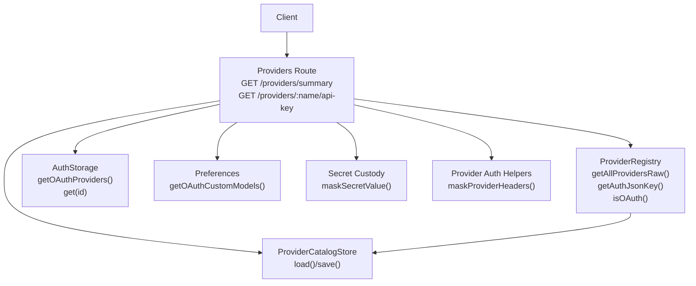
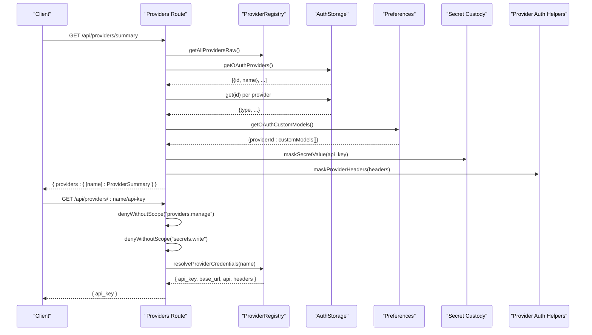
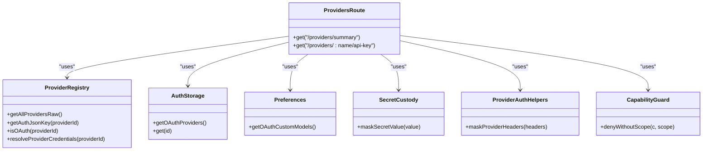

# Provider Management API

<cite>
**Referenced Files in This Document**
- [providers.ts](file://server/routes/providers.ts)
- [provider-registry.ts](file://core/provider-registry.ts)
- [provider-catalog.ts](file://core/provider-catalog.ts)
- [provider-auth.ts](file://shared/provider-auth.ts)
- [secret-custody.ts](file://shared/secret-custody.ts)
- [capability-guard.ts](file://server/http/capability-guard.ts)
</cite>

## Table of Contents
1. [Introduction](#introduction)
2. [Project Structure](#project-structure)
3. [Core Components](#core-components)
4. [Architecture Overview](#architecture-overview)
5. [Detailed Component Analysis](#detailed-component-analysis)
6. [Dependency Analysis](#dependency-analysis)
7. [Performance Considerations](#performance-considerations)
8. [Troubleshooting Guide](#troubleshooting-guide)
9. [Conclusion](#conclusion)
10. [Appendices](#appendices)

## Introduction
This document provides comprehensive API documentation for provider management endpoints, focusing on:
- GET /api/providers/summary: Unified provider overview including OAuth status, SDK models, and configuration state.
- GET /api/providers/:name/api-key: Secure API key retrieval with scope-based access control.

It includes HTTP methods, URL patterns, request/response schemas (TypeScript interfaces), parameter validation rules, status codes, examples for discovery, credential management, OAuth integration, and configuration validation. Security considerations, masking strategies, and error handling patterns are also documented.

## Project Structure
The provider management APIs are implemented as server routes that orchestrate data from the provider registry, catalog store, authentication storage, and secret custody utilities.



**Diagram sources**
- [providers.ts:63-208](file://server/routes/providers.ts#L63-L208)
- [provider-registry.ts:429-466](file://core/provider-registry.ts#L429-L466)
- [provider-catalog.ts:89-148](file://core/provider-catalog.ts#L89-L148)
- [provider-auth.ts:72-79](file://shared/provider-auth.ts#L72-L79)
- [secret-custody.ts:26-28](file://shared/secret-custody.ts#L26-L28)

**Section sources**
- [providers.ts:63-208](file://server/routes/providers.ts#L63-L208)
- [provider-registry.ts:429-466](file://core/provider-registry.ts#L429-L466)
- [provider-catalog.ts:89-148](file://core/provider-catalog.ts#L89-L148)

## Core Components
- Providers Route: Implements REST endpoints for provider summary and secure API key retrieval. It aggregates data from multiple subsystems and applies security checks and masking.
- ProviderRegistry: Central authority for provider definitions, capabilities, auth types, default models, and runtime metadata.
- ProviderCatalogStore: Persists user provider configurations and capabilities; supports migration and atomic writes.
- Provider Auth Helpers: Normalizes headers, masks secrets, and validates header names.
- Secret Custody: Provides masking utilities and secret patch path collection.
- Capability Guard: Enforces scope-based authorization for sensitive operations.

**Section sources**
- [providers.ts:44-552](file://server/routes/providers.ts#L44-L552)
- [provider-registry.ts:429-996](file://core/provider-registry.ts#L429-L996)
- [provider-catalog.ts:89-235](file://core/provider-catalog.ts#L89-L235)
- [provider-auth.ts:25-106](file://shared/provider-auth.ts#L25-L106)
- [secret-custody.ts:1-107](file://shared/secret-custody.ts#L1-L107)
- [capability-guard.ts:1-46](file://server/http/capability-guard.ts#L1-L46)

## Architecture Overview
The GET /providers/summary endpoint composes a unified view by merging:
- Provider catalog overlays and local plugin definitions
- OAuth login status from AuthStorage
- Custom OAuth models from preferences
- Masked credentials and headers
- Missing fields and configuration status

The GET /providers/:name/api-key endpoint enforces scopes and returns the unmasked API key for the specified provider.



**Diagram sources**
- [providers.ts:63-208](file://server/routes/providers.ts#L63-L208)
- [providers.ts:214-225](file://server/routes/providers.ts#L214-L225)
- [provider-registry.ts:1008-1048](file://core/provider-registry.ts#L1008-L1048)
- [provider-auth.ts:72-79](file://shared/provider-auth.ts#L72-L79)
- [secret-custody.ts:26-28](file://shared/secret-custody.ts#L26-L28)

## Detailed Component Analysis

### Endpoint: GET /api/providers/summary
- Method: GET
- Path: /api/providers/summary
- Authentication: Not required for read-only overview
- Authorization: None enforced at route level
- Purpose: Returns a unified overview of all providers, including OAuth status, SDK models, and configuration state.

Request
- No body or query parameters.

Response Schema (TypeScript)
- Response body:
  - providers: Record<string, ProviderSummary>
- ProviderSummary fields:
  - type: "oauth" | "api-key"
  - auth_type: "api-key" | "oauth" | "none" | "optional"
  - display_name: string
  - base_url: string
  - api: string
  - api_key: string (masked)
  - headers: Record<string, string> (values masked)
  - models: ModelEntry[]
  - custom_models: ModelEntry[]
  - has_credentials: boolean
  - logged_in: boolean | undefined
  - supports_oauth: boolean
  - is_coding_plan: boolean
  - is_configured: boolean
  - can_delete: boolean
  - config_status: "ok" | "needs_setup" | "invalid"
  - config_error: string | null
  - missing_fields: string[]

ModelEntry fields:
- id: string
- name?: string
- context?: number | null
- maxOutput?: number | null

Validation Rules
- For non-OAuth providers:
  - If base_url is empty, missing_fields includes "base_url".
  - If no api_key, headers, or allowed missing key scenario, missing_fields includes "api_key".
- If both raw models and custom models are empty, missing_fields includes "models".
- config_status:
  - "invalid" if config_error present.
  - "needs_setup" if any missing_fields exist.
  - "ok" otherwise.

Status Codes
- 200 OK: Successful response with providers map.

Security and Masking
- api_key values are masked using secret custody utilities.
- Header values are normalized and masked via provider auth helpers.

Examples
- Discovery: Use this endpoint to list all available providers, their auth types, and whether they need setup.
- OAuth Integration: Check supports_oauth and logged_in to guide OAuth flows.
- Configuration Validation: Inspect missing_fields and config_status to prompt users for required inputs.

**Section sources**
- [providers.ts:63-208](file://server/routes/providers.ts#L63-L208)
- [provider-auth.ts:72-79](file://shared/provider-auth.ts#L72-L79)
- [secret-custody.ts:26-28](file://shared/secret-custody.ts#L26-L28)

### Endpoint: GET /api/providers/:name/api-key
- Method: GET
- Path: /api/providers/:name/api-key
- Path Parameter:
  - name: string (required) — provider identifier
- Authentication: Required
- Authorization: Requires scopes:
  - "providers.manage"
  - "secrets.write"
- Purpose: Returns the unmasked API key for the specified provider.

Request
- No body or query parameters.

Response Schema (TypeScript)
- Response body:
  - api_key: string

Validation Rules
- name must be a non-empty string.
- Scopes must include "providers.manage" and "secrets.write".

Status Codes
- 200 OK: Success with api_key.
- 403 Forbidden: Insufficient scopes or missing principal.
- 404 Not Found: Provider not found (implementation may vary; see error handling below).

Security Considerations
- Strict scope enforcement prevents unauthorized access to secrets.
- The summary endpoint only returns masked values; this narrow endpoint exposes plaintext keys.

Error Handling Patterns
- Scope denial returns 403 with an error object containing error and scope fields.
- If the provider does not exist, the implementation may return 404 with an error message.

Examples
- Credential Management: After configuring a provider, call this endpoint to retrieve the stored API key for diagnostics or export.
- Troubleshooting: Compare returned api_key with expected values to validate configuration.

**Section sources**
- [providers.ts:214-225](file://server/routes/providers.ts#L214-L225)
- [capability-guard.ts:38-45](file://server/http/capability-guard.ts#L38-L45)

## Dependency Analysis
The endpoints depend on several core components:



**Diagram sources**
- [providers.ts:63-225](file://server/routes/providers.ts#L63-L225)
- [provider-registry.ts:1008-1048](file://core/provider-registry.ts#L1008-L1048)
- [provider-auth.ts:72-79](file://shared/provider-auth.ts#L72-L79)
- [secret-custody.ts:26-28](file://shared/secret-custody.ts#L26-L28)
- [capability-guard.ts:38-45](file://server/http/capability-guard.ts#L38-L45)

**Section sources**
- [providers.ts:63-225](file://server/routes/providers.ts#L63-L225)
- [provider-registry.ts:1008-1048](file://core/provider-registry.ts#L1008-L1048)
- [provider-auth.ts:72-79](file://shared/provider-auth.ts#L72-L79)
- [secret-custody.ts:26-28](file://shared/secret-custody.ts#L26-L28)
- [capability-guard.ts:38-45](file://server/http/capability-guard.ts#L38-L45)

## Performance Considerations
- Summary aggregation reads from multiple sources; consider caching results if frequently accessed.
- Masking operations are lightweight but should be avoided in hot paths where possible.
- Avoid unnecessary re-computation of OAuth login maps; reuse within a single request.

[No sources needed since this section provides general guidance]

## Troubleshooting Guide
Common issues and resolutions:
- 403 Forbidden on /providers/:name/api-key: Ensure the client has both "providers.manage" and "secrets.write" scopes.
- Empty models in summary: Verify provider configuration includes valid model IDs; check missing_fields for guidance.
- Invalid config_status: Investigate config_error messages and correct provider settings accordingly.
- Masked values in summary: Expected behavior; use the secure API key endpoint to retrieve plaintext when authorized.

**Section sources**
- [capability-guard.ts:38-45](file://server/http/capability-guard.ts#L38-L45)
- [providers.ts:63-208](file://server/routes/providers.ts#L63-L208)

## Conclusion
The provider management API offers a secure and comprehensive interface for discovering providers, managing credentials, and validating configurations. The summary endpoint provides a unified view suitable for UI dashboards, while the secure API key endpoint enables privileged clients to retrieve plaintext keys when necessary. Proper scoping and masking ensure robust security posture.

[No sources needed since this section summarizes without analyzing specific files]

## Appendices

### TypeScript Interfaces

```typescript
interface ProviderSummary {
  type: "oauth" | "api-key";
  auth_type: "api-key" | "oauth" | "none" | "optional";
  display_name: string;
  base_url: string;
  api: string;
  api_key: string;
  headers: Record<string, string>;
  models: ModelEntry[];
  custom_models: ModelEntry[];
  has_credentials: boolean;
  logged_in: boolean | undefined;
  supports_oauth: boolean;
  is_coding_plan: boolean;
  is_configured: boolean;
  can_delete: boolean;
  config_status: "ok" | "needs_setup" | "invalid";
  config_error: string | null;
  missing_fields: string[];
}

interface ModelEntry {
  id: string;
  name?: string;
  context?: number | null;
  maxOutput?: number | null;
}

interface GetApiKeyResponse {
  api_key: string;
}
```

**Section sources**
- [providers.ts:63-208](file://server/routes/providers.ts#L63-L208)
- [providers.ts:214-225](file://server/routes/providers.ts#L214-L225)