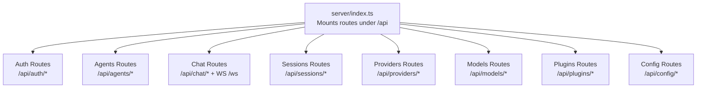
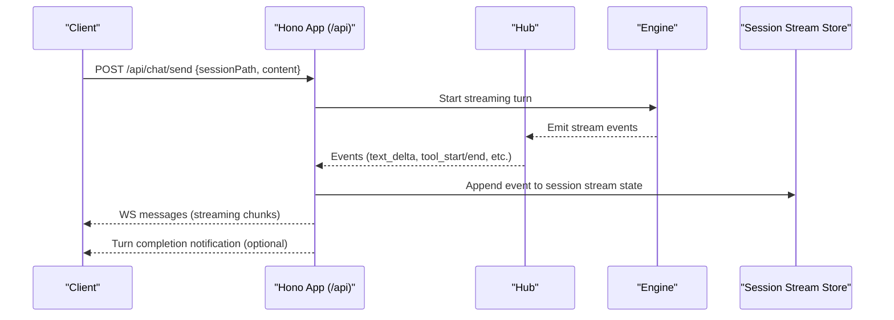
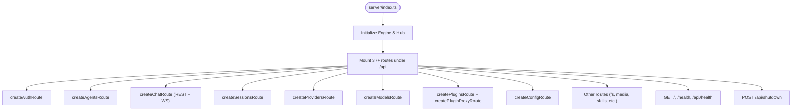

# REST API Endpoints

<cite>
**Referenced Files in This Document**
- [index.ts](file://server/index.ts)
- [auth.ts](file://server/routes/auth.ts)
- [agents.ts](file://server/routes/agents.ts)
- [chat.ts](file://server/routes/chat.ts)
- [sessions.ts](file://server/routes/sessions.ts)
- [providers.ts](file://server/routes/providers.ts)
- [models.ts](file://server/routes/models.ts)
- [plugins.ts](file://server/routes/plugins.ts)
- [config.ts](file://server/routes/config.ts)
</cite>

## Table of Contents
1. Introduction
2. Project Structure
3. Core Components
4. Architecture Overview
5. Detailed Component Analysis
6. Dependency Analysis
7. Performance Considerations
8. Troubleshooting Guide
9. Conclusion

## Introduction
This document provides comprehensive REST API documentation for OpenShadow’s HTTP endpoints. It covers authentication, agent management, session handling, chat operations, provider configuration, model management, plugin administration, and system settings. For each endpoint, it specifies HTTP methods, URL patterns, request/response schemas (TypeScript interfaces), parameter validation rules, status codes, error responses, content types, and practical usage examples.

The server mounts 37+ business routes under the /api prefix and also exposes a WebSocket route for streaming chat events. Health endpoints are available at both root and /api paths.

## Project Structure
OpenShadow uses Hono to define HTTP routes. The main entry initializes the engine, creates a Hub, and mounts all route modules under /api. Chat additionally registers a WebSocket route.

**Diagram sources**
- [index.ts:162-209](file://server/index.ts#L162-L209)

**Section sources**
- [index.ts:1-320](file://server/index.ts#L1-L320)

## Core Components
- Authentication: OAuth flows for providers with code or device-code patterns, custom model management per OAuth provider.
- Agents: CRUD, avatar upload, config and identity files, pinned memory, experience documents.
- Sessions: List/search, pin/unpin, authorized folders, message history, summaries.
- Chat: Streaming via WebSocket; REST helpers for health and metadata.
- Providers: Summary, fetch models, test connectivity, update/delete model entries.
- Models: List, set pending model, switch model within a session, auxiliary vision status.
- Plugins: Install from local zip/directory, marketplace install, proxy to plugin apps, asset sessions.
- Config: Global and agent-scoped settings, workspace history, memory management, search verification.

**Section sources**
- [auth.ts:1-280](file://server/routes/auth.ts#L1-L280)
- [agents.ts:1-845](file://server/routes/agents.ts#L1-L845)
- [chat.ts:1-800](file://server/routes/chat.ts#L1-L800)
- [sessions.ts:1-800](file://server/routes/sessions.ts#L1-L800)
- [providers.ts:1-553](file://server/routes/providers.ts#L1-L553)
- [models.ts:1-319](file://server/routes/models.ts#L1-L319)
- [plugins.ts:1-800](file://server/routes/plugins.ts#L1-L800)
- [config.ts:1-757](file://server/routes/config.ts#L1-L757)

## Architecture Overview
High-level flow for a typical chat turn over WebSocket:

**Diagram sources**
- [chat.ts:200-800](file://server/routes/chat.ts#L200-L800)
- [index.ts:172-176](file://server/index.ts#L172-L176)

## Detailed Component Analysis

### Authentication
Endpoints:
- POST /api/auth/oauth/start
  - Request body: { provider: string }
  - Response: { sessionId: string, url: string, instructions?: string, polling?: boolean }
  - Validation: provider required
  - Status codes: 200 OK, 400 Bad Request, 500 Internal Server Error
- POST /api/auth/oauth/callback
  - Request body: { sessionId: string, code: string }
  - Response: { ok: boolean }
  - Validation: sessionId and code required
  - Status codes: 200 OK, 400 Bad Request, 500 Internal Server Error
- GET /api/auth/oauth/poll/:sessionId
  - Response: { status: "pending" | "done" | "error", error?: string }
  - Status codes: 200 OK, 400 Bad Request
- GET /api/auth/oauth/status
  - Response: Record<string, { name: string, loggedIn: boolean, modelCount: number }>
- POST /api/auth/oauth/logout
  - Request body: { provider: string }
  - Response: { ok: boolean }
  - Validation: provider required
- GET /api/auth/oauth/:provider/custom-models
  - Response: { models: string[] }
- POST /api/auth/oauth/:provider/custom-models
  - Request body: { modelId: string }
  - Response: { ok: boolean, models: string[] }
  - Validation: modelId required and non-empty
- DELETE /api/auth/oauth/:provider/custom-models/:modelId
  - Response: { ok: boolean, models: string[] }

Notes:
- Content-Type: application/json
- Errors include user-friendly diagnostics for network timeouts and connection failures.

**Section sources**
- [auth.ts:54-276](file://server/routes/auth.ts#L54-L276)

### Agents
Endpoints:
- GET /api/agents
  - Query: fresh?: "1"|"true"
  - Response: { agents: AgentSummary[] }
- POST /api/agents
  - Request body: { name: string, id?: string, yuan?: any }
  - Response: { ok: boolean, ...AgentResult }
  - Validation: name required and trimmed
  - Status codes: 201/200 OK, 400 Bad Request, 409 Conflict, 500 Internal Server Error
- POST /api/agents/switch
  - Request body: { id: string }
  - Response: { ok: boolean, agent: { id, name }, sessionPath?, cwd?, homeFolder?, workspaceFolders[], authorizedFolders[], cwdHistory[], memoryMasterEnabled: boolean }
  - Validation: id required and valid
- DELETE /api/agents/:id
  - Response: { ok: boolean }
  - Status codes: 200 OK, 400 Bad Request, 404 Not Found, 500 Internal Server Error
- PUT /api/agents/primary
  - Request body: { id: string }
  - Response: { ok: boolean }
- PUT /api/agents/order
  - Request body: { order: string[] }
  - Response: { ok: boolean }
  - Validation: order must be an array
- GET /api/agents/:id/avatar
  - Response: image/png|image/jpeg|image/webp or JSON error
  - Status codes: 200 OK, 404 Not Found
- POST /api/agents/:id/avatar
  - Request body: { data: string } (base64 data URL)
  - Response: { ok: boolean, ext: string }
  - Validation: base64 data URL format required; max size enforced by middleware
  - Status codes: 200 OK, 400 Bad Request, 404 Not Found
- DELETE /api/agents/:id/avatar
  - Response: { ok: boolean }
- GET /api/agents/:id/config
  - Response: merged config with providers, availableTools, _raw structure
- PUT /api/agents/:id/config
  - Request body: partial config object (supports global fields and agent-specific fields)
  - Response: { ok: boolean }
  - Validation: tools.disabled only allows optional tool names; experience.enabled must be boolean
  - Security: requires scopes for settings.write and providers.manage when mutating providers or secrets
- GET /api/agents/:id/identity
  - Response: { content: string }
- PUT /api/agents/:id/identity
  - Request body: { content: string }
  - Response: { ok: boolean }
- GET /api/agents/:id/ishiki
  - Response: { content: string }
- PUT /api/agents/:id/ishiki
  - Request body: { content: string }
  - Response: { ok: boolean }
- GET /api/agents/:id/public-ishiki
  - Response: { content: string }
- PUT /api/agents/:id/public-ishiki
  - Request body: { content: string }
  - Response: { ok: boolean }
- GET /api/agents/:id/pinned
  - Response: { pins: string[] }
- PUT /api/agents/:id/pinned
  - Request body: { pins: string[] }
  - Response: { ok: boolean }
- GET /api/agents/:id/experience
  - Response: { content: string }
  - Status codes: 200 OK, 403 Forbidden if disabled
- PUT /api/agents/:id/experience
  - Request body: { content: string }
  - Response: { ok: boolean }

Notes:
- Content-Type: application/json except avatar GET which returns image bytes.
- Secrets masked in responses unless explicitly requested via protected endpoints.

**Section sources**
- [agents.ts:195-845](file://server/routes/agents.ts#L195-L845)

### Sessions
Endpoints:
- GET /api/sessions
  - Response: SessionProjection[]
  - Authorization: requires sessions.read scope
  - Status codes: 200 OK, 403 Forbidden (insufficient scope or studio mismatch), 500 Internal Server Error
- GET /api/sessions/search
  - Query: q (string), phase ("title"|"content"), limit (number)
  - Response: { query, phase, results: SessionSearchResult[] }
  - Validation: query length <= 512
  - Status codes: 200 OK, 400 Bad Request, 503 Service Unavailable (tokenizer unavailable)
- GET /api/sessions/summary
  - Query: path (string)
  - Response: { hasSummary: boolean, summary?: string, createdAt?: string, updatedAt?: string }
  - Validation: path required and valid
- POST /api/sessions/pin
  - Request body: { path: string, pinned: boolean }
  - Response: { ok: boolean, pinnedAt?: string }
  - Validation: path and pinned required
- GET /api/sessions/authorized-folders
  - Query: path (string)
  - Response: { ok: boolean, sessionPath?, cwd?, workspaceFolders[], authorizedFolders[], sandboxFolders[] }
- PATCH /api/sessions/authorized-folders
  - Request body: { action: "add"|"remove"|"set", folder?: string, folders?: string[], path?: string }
  - Response: { ok: boolean, ...scope fields }
  - Validation: folder(s) must exist and be directories
- GET /api/sessions/messages
  - Query: path?, before?, limit? (default 50, max 200), all?
  - Response: paginated messages with revision field
  - Authorization: requires sessions.read scope
  - Status codes: 200 OK, 403 Forbidden, 500 Internal Server Error

Notes:
- Content-Type: application/json
- Many endpoints enforce authorization via request context and capability guards.

**Section sources**
- [sessions.ts:508-800](file://server/routes/sessions.ts#L508-L800)

### Chat (REST + WebSocket)
REST:
- Health and metadata endpoints are mounted alongside chat routes.
- WebSocket upgrade is registered at /api/ws and /ws.

WebSocket protocol highlights:
- Messages include session-scoped events: text_delta, thinking_start/end, tool_start/end, content_block, browser_status, jian_update, devlog, compaction_start/end, notification, agent_activity.
- Clients subscribe by sessionPath; server enforces permissions and broadcasts accordingly.
- Graceful abort on disconnect and stall detection configurable via environment variables.

Typical client workflow:
- Connect WS
- Subscribe to sessionPath
- Send chat start via REST or WS command
- Receive streaming events until completion

**Section sources**
- [chat.ts:200-800](file://server/routes/chat.ts#L200-L800)
- [index.ts:172-176](file://server/index.ts#L172-L176)

### Providers
Endpoints:
- GET /api/providers/summary
  - Response: { providers: Record<string, ProviderSummary> }
  - Includes auth type, credentials presence, missing fields, config status
- GET /api/providers/:name/api-key
  - Response: { api_key: string }
  - Security: requires providers.manage and secrets.write scopes
- POST /api/providers/fetch-models
  - Request body: { name?, base_url?, api?, api_key?, headers? }
  - Response: { source?, models: ModelInfo[], ignoredModels?: string[], error?: string }
  - Validation: name or base_url required; api required when api_key present
  - Status codes: 200 OK, 400 Bad Request, 401/403 errors proxied, 500 Internal Server Error
- GET /api/providers/:name/discovered-models
  - Response: { models: ModelInfo[], fetchedAt?: string }
  - Security: requires providers.manage
- POST /api/providers/test
  - Request body: { name?, base_url?, api?, api_key?, headers? }
  - Response: { ok: boolean, error?: string }
  - Validation: base_url required; api required when api_key present
- PUT /api/providers/:name/models/:modelId
  - Request body: model metadata patch
  - Response: { ok: boolean }
  - Security: requires providers.manage
- DELETE /api/providers/:name/models/:modelId
  - Response: { ok: boolean }
  - Security: requires providers.manage

Notes:
- Content-Type: application/json
- Responses mask sensitive headers and keys where appropriate.

**Section sources**
- [providers.ts:63-553](file://server/routes/providers.ts#L63-L553)

### Models
Endpoints:
- GET /api/models
  - Response: { models: ModelInfo[], current?: string, activeModel?: { id, provider } }
- GET /api/models/auxiliary-vision
  - Response: { auxiliaryVision: AuxiliaryVisionStatus }
- POST /api/models/health
  - Request body: { modelId: string, provider: string } or { model: { id, provider } }
  - Response: { ok: boolean, status?: number, provider?: string, skipped?: string, error?: string, code?: string, reason?: string }
  - Validation: modelId and provider required; no fallback by id alone
- POST /api/models/set
  - Request body: { modelId: string, provider: string }
  - Response: { ok: boolean, model?: string, pendingModel: boolean, thinkingLevel?: string }
  - Validation: modelId and provider required
- POST /api/models/switch
  - Request body: { sessionPath: string, modelId: string, provider: string }
  - Response: { ok: boolean, model: ModelInfo, adaptations?: any, thinkingLevel?: string }
  - Validation: sessionPath, modelId, provider required; cannot switch while streaming

Notes:
- Content-Type: application/json
- Health check performs a real utility LLM call to validate credentials and compatibility.

**Section sources**
- [models.ts:188-319](file://server/routes/models.ts#L188-L319)

### Plugins
Endpoints:
- Proxy:
  - ALL /api/plugins/:pluginId/*
    - Proxies to plugin app with validated iframe ticket or surface session cookie
    - Strips host-only query parameters and headers before forwarding
- Installation:
  - Local install from directory or .zip
  - Marketplace install with version selection and distribution verification
- Configuration:
  - Plugin configuration values with scope support (global, agent, session)
- Asset access:
  - Automatic issuance of plugin asset session cookies for HTML responses

Security:
- Iframe tickets and surface sessions are verified and scoped to allowed routes.
- Host routes are forbidden for iframe tickets.

Notes:
- Content-Type: application/json unless serving static assets.
- Size limits apply to release packages.

**Section sources**
- [plugins.ts:1-800](file://server/routes/plugins.ts#L1-L800)

### Config
Endpoints:
- GET /api/config
  - Response: full config with providers, security, theme, memory, models, permissionMode, and _raw overlay
- PUT /api/config
  - Request body: partial config object (supports global fields and agent-specific fields)
  - Response: { ok: boolean }
  - Security: requires settings.write; providers.manage for provider mutations; secret mutation checks
- Workspace history:
  - POST /api/config/workspaces/recent { path: string }
  - DELETE /api/config/workspaces/recent { path: string }
  - DELETE /api/config/workspaces/recent/all
  - All return { ok: boolean, cwd_history: string[] }
- Default workspace:
  - GET /api/config/default-workspace → { path: string }
  - POST /api/config/default-workspace → { ok: boolean, path: string }
- System prompt:
  - GET /api/system-prompt → { content: string }
- Personality and identity:
  - GET/PUT /api/ishiki
  - GET/PUT /api/identity
- User profile:
  - GET/PUT /api/user-profile
- Pinned memory:
  - GET/PUT /api/pinned
- Memory management:
  - GET /api/memories/health → { agentId, enabled, status, steps, failedSteps, maxFailCount, lastSuccessAt, lastErrorAt }
  - GET /api/memories → { memories: FactEntry[] }
  - GET /api/memories/compiled → { content: string }
  - DELETE /api/memories/compiled → { ok: boolean }
  - DELETE /api/memories → { ok: boolean }
  - GET /api/memories/export → { version: 2, exportedAt: string, facts: FactEntry[] }
  - POST /api/memories/import → { ok: boolean, imported: number }
- Search verification:
  - POST /api/search/verify { provider, api_key?, search_provider? }
  - Response: { ok: boolean, error?: string }

Notes:
- Content-Type: application/json
- Secret fields are masked in responses unless explicitly requested via protected endpoints.

**Section sources**
- [config.ts:193-757](file://server/routes/config.ts#L193-L757)

## Dependency Analysis
Route mounting and initialization:

**Diagram sources**
- [index.ts:116-209](file://server/index.ts#L116-L209)

**Section sources**
- [index.ts:1-320](file://server/index.ts#L1-L320)

## Performance Considerations
- Streaming chat uses efficient serialization and broadcast; large payloads are minimized by summarizing tool arguments.
- Session state is bounded with eviction for non-streaming sessions.
- Provider model discovery caches results per-provider and supports registry/defaults fallback.
- File uploads (avatars) have size limits; plugin releases enforce maximum package size.
- Rate limiting is not implemented at the HTTP layer; clients should implement retries with backoff.

[No sources needed since this section provides general guidance]

## Troubleshooting Guide
Common issues and resolutions:
- Authentication failures:
  - Check provider credentials and base URLs; use /api/providers/test to validate connectivity.
  - For OAuth, ensure callback server availability or follow device-code instructions.
- Model switching conflicts:
  - Cannot switch model while streaming; wait for turn completion or abort gracefully.
- Session authorization errors:
  - Ensure sufficient scopes (sessions.read/write) and matching studio context.
- Provider model discovery errors:
  - Validate api_key and api fields; review ignored models list for invalid IDs.
- Plugin installation failures:
  - Verify manifest validity and version compatibility; inspect backup restore logs.

**Section sources**
- [providers.ts:356-553](file://server/routes/providers.ts#L356-L553)
- [models.ts:266-319](file://server/routes/models.ts#L266-L319)
- [sessions.ts:508-637](file://server/routes/sessions.ts#L508-L637)
- [plugins.ts:482-564](file://server/routes/plugins.ts#L482-L564)

## Conclusion
OpenShadow’s REST API provides a comprehensive surface for managing agents, sessions, providers, models, plugins, and configuration. Endpoints are secured with capability-based scopes and secret mutation checks. Streaming chat is supported via WebSocket with robust lifecycle management. Use the provided schemas and validation rules to integrate reliably and handle errors consistently.

[No sources needed since this section summarizes without analyzing specific files]