# Context Management API

<cite>
**Referenced Files in This Document**
- [execution-boundary.ts](file://core/execution-boundary.ts)
- [remote-execution-boundary.ts](file://core/remote-execution-boundary.ts)
- [plugin-context.ts](file://core/plugin-context.ts)
- [boundary.ts](file://server/http/boundary.ts)
- [route-security.ts](file://server/http/route-security.ts)
- [capability-policy.ts](file://core/capability-policy.ts)
- [grant-registry.ts](file://core/grant-registry.ts)
- [security-principal.ts](file://core/security-principal.ts)
- [tool-wrapper.ts](file://core/sandbox/tool-wrapper.ts)
- [network-filter.ts](file://core/sandbox/network-filter.ts)
- [workspace-scope.ts](file://core/shared/workspace-scope.ts)
- [resource-access-service.ts](file://core/resource-access-service.ts)
- [resources.ts](file://server/routes/resources.ts)
- [web-fetch.ts](file://core/tools/web-fetch.ts)
</cite>

## Table of Contents
1. [Introduction](#introduction)
2. [Project Structure](#project-structure)
3. [Core Components](#core-components)
4. [Architecture Overview](#architecture-overview)
5. [Detailed Component Analysis](#detailed-component-analysis)
6. [Dependency Analysis](#dependency-analysis)
7. [Performance Considerations](#performance-considerations)
8. [Troubleshooting Guide](#troubleshooting-guide)
9. [Conclusion](#conclusion)
10. [Appendices](#appendices)

## Introduction
This document provides detailed API documentation for context management and execution boundary endpoints. It covers:
- Context injection into HTTP requests and plugin runtime
- Tool execution permissions and sandboxing
- Workspace scoping and resource access control
- Security boundaries, permission models, and error handling
- Examples of context variables, tool invocation, file system access, and network request filtering

The goal is to help developers integrate with the platform securely by understanding how contexts are created, propagated, and enforced across HTTP routes, plugins, tools, and resources.

## Project Structure
Key modules involved in context management and execution boundaries:
- Execution boundary creation and validation (local and remote)
- Request context construction and authorization helpers
- Capability policy evaluation and grant registry
- Plugin context with restricted bus and session file staging
- Sandbox wrappers for path-safe tool execution and bash command checks
- Network filter for outbound connections
- Workspace scope normalization and folder authorization
- Resource access service and HTTP resource endpoints

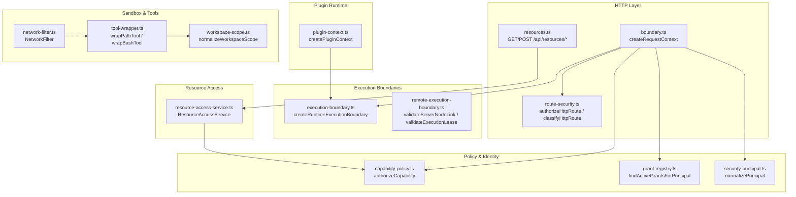

**Diagram sources**
- [boundary.ts:7-47](file://server/http/boundary.ts#L7-L47)
- [route-security.ts:29-80](file://server/http/route-security.ts#L29-L80)
- [resources.ts:12-54](file://server/routes/resources.ts#L12-L54)
- [capability-policy.ts:7-100](file://core/capability-policy.ts#L7-L100)
- [grant-registry.ts:51-68](file://core/grant-registry.ts#L51-L68)
- [security-principal.ts:38-65](file://core/security-principal.ts#L38-L65)
- [execution-boundary.ts:4-14](file://core/execution-boundary.ts#L4-L14)
- [remote-execution-boundary.ts:20-47](file://core/remote-execution-boundary.ts#L20-L47)
- [plugin-context.ts:9-22](file://core/plugin-context.ts#L9-L22)
- [tool-wrapper.ts:325-354](file://core/sandbox/tool-wrapper.ts#L325-L354)
- [network-filter.ts:23-70](file://core/sandbox/network-filter.ts#L23-L70)
- [workspace-scope.ts:10-25](file://core/shared/workspace-scope.ts#L10-L25)
- [resource-access-service.ts:6-31](file://core/resource-access-service.ts#L6-L31)

**Section sources**
- [boundary.ts:7-47](file://server/http/boundary.ts#L7-L47)
- [route-security.ts:29-80](file://server/http/route-security.ts#L29-L80)
- [resources.ts:12-54](file://server/routes/resources.ts#L12-L54)
- [capability-policy.ts:7-100](file://core/capability-policy.ts#L7-L100)
- [grant-registry.ts:51-68](file://core/grant-registry.ts#L51-L68)
- [security-principal.ts:38-65](file://core/security-principal.ts#L38-L65)
- [execution-boundary.ts:4-14](file://core/execution-boundary.ts#L4-L14)
- [remote-execution-boundary.ts:20-47](file://core/remote-execution-boundary.ts#L20-L47)
- [plugin-context.ts:9-22](file://core/plugin-context.ts#L9-L22)
- [tool-wrapper.ts:325-354](file://core/sandbox/tool-wrapper.ts#L325-L354)
- [network-filter.ts:23-70](file://core/sandbox/network-filter.ts#L23-L70)
- [workspace-scope.ts:10-25](file://core/shared/workspace-scope.ts#L10-L25)
- [resource-access-service.ts:6-31](file://core/resource-access-service.ts#L6-L31)

## Core Components
- Request context builder: constructs a frozen request context including auth principal, server/studio identifiers, connection kind, and execution boundary. Provides an authorize helper that evaluates capabilities against grants.
- Route security classifier: classifies HTTP routes into public, authenticated, local-only, studio-owner, or scoped policies; enforces required scopes.
- Capability policy engine: evaluates capability decisions based on principal, grants, transport constraints, and target scoping.
- Grant registry: persists and validates grants, supports expiration and revocation, and returns active grants per principal.
- Security principal normalizer: canonicalizes identity fields, derives principal IDs, and determines trust/connection properties.
- Execution boundary creators: define local execution boundaries and validate remote node links and execution leases.
- Plugin context: injects runtime context into plugins, wraps bus with permission checks, and stages session files safely.
- Sandbox wrappers: enforce path-based access for tools and bash commands, support external read grants, managed config write checks, and preflight pattern blocking.
- Network filter: applies host-level restrictions and custom mappings for outbound connections.
- Workspace scope: normalizes primary workspace and authorized folders for sandboxing.
- Resource access service: mediates metadata and content access with capability checks and sanitization.
- Resource HTTP endpoints: expose GET/HEAD content and POST ticket issuance with range support and ETag caching.

**Section sources**
- [boundary.ts:7-47](file://server/http/boundary.ts#L7-L47)
- [route-security.ts:29-80](file://server/http/route-security.ts#L29-L80)
- [capability-policy.ts:7-100](file://core/capability-policy.ts#L7-L100)
- [grant-registry.ts:51-68](file://core/grant-registry.ts#L51-L68)
- [security-principal.ts:38-65](file://core/security-principal.ts#L38-L65)
- [execution-boundary.ts:4-14](file://core/execution-boundary.ts#L4-L14)
- [remote-execution-boundary.ts:20-47](file://core/remote-execution-boundary.ts#L20-L47)
- [plugin-context.ts:9-22](file://core/plugin-context.ts#L9-L22)
- [tool-wrapper.ts:325-354](file://core/sandbox/tool-wrapper.ts#L325-L354)
- [network-filter.ts:23-70](file://core/sandbox/network-filter.ts#L23-L70)
- [workspace-scope.ts:10-25](file://core/shared/workspace-scope.ts#L10-L25)
- [resource-access-service.ts:6-31](file://core/resource-access-service.ts#L6-L31)
- [resources.ts:12-54](file://server/routes/resources.ts#L12-L54)

## Architecture Overview
The system composes multiple layers to enforce secure context propagation and execution boundaries:
- HTTP layer builds request context and classifies route policies
- Policy layer evaluates capabilities using normalized principals and active grants
- Execution boundaries define workbench roots, filesystem and network policies
- Plugins receive a constrained runtime context with permissioned bus and staged outputs
- Tools execute within sandbox wrappers enforcing path and command safety
- Resources are accessed via a service that enforces capability checks and sanitizes responses

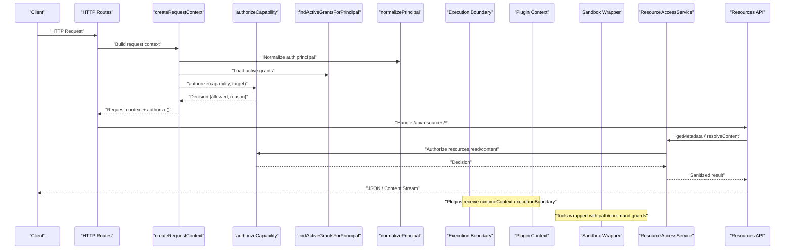

**Diagram sources**
- [boundary.ts:7-47](file://server/http/boundary.ts#L7-L47)
- [capability-policy.ts:7-100](file://core/capability-policy.ts#L7-L100)
- [grant-registry.ts:51-68](file://core/grant-registry.ts#L51-L68)
- [security-principal.ts:38-65](file://core/security-principal.ts#L38-L65)
- [resources.ts:12-54](file://server/routes/resources.ts#L12-L54)
- [resource-access-service.ts:6-31](file://core/resource-access-service.ts#L6-L31)
- [execution-boundary.ts:4-14](file://core/execution-boundary.ts#L4-L14)
- [plugin-context.ts:9-22](file://core/plugin-context.ts#L9-L22)
- [tool-wrapper.ts:325-354](file://core/sandbox/tool-wrapper.ts#L325-L354)

## Detailed Component Analysis

### HTTP Request Context and Authorization
- createRequestContext reads runtime context from the engine, normalizes the auth principal, and constructs a frozen request context with server/studio identifiers, connection kind, credential kind, and execution boundary.
- The returned context includes an authorize method that loads active grants and calls the capability policy evaluator with the requested capability and target.
- Route classification determines whether a route is public, authenticated, local-only, studio-owner, or requires specific scopes.

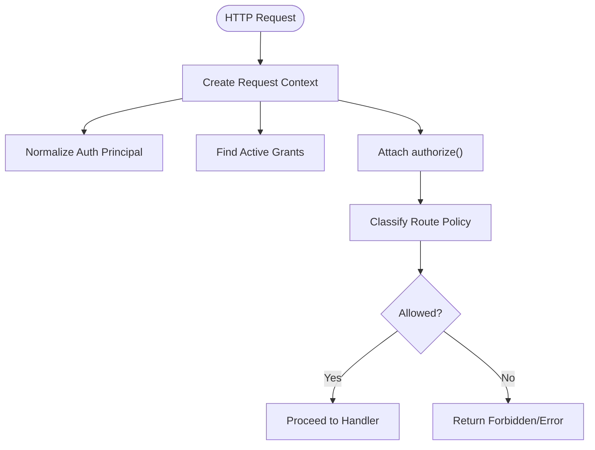

**Diagram sources**
- [boundary.ts:7-47](file://server/http/boundary.ts#L7-L47)
- [route-security.ts:29-80](file://server/http/route-security.ts#L29-L80)
- [capability-policy.ts:7-100](file://core/capability-policy.ts#L7-L100)
- [grant-registry.ts:51-68](file://core/grant-registry.ts#L51-L68)
- [security-principal.ts:38-65](file://core/security-principal.ts#L38-L65)

**Section sources**
- [boundary.ts:7-47](file://server/http/boundary.ts#L7-L47)
- [route-security.ts:29-80](file://server/http/route-security.ts#L29-L80)
- [capability-policy.ts:7-100](file://core/capability-policy.ts#L7-L100)
- [grant-registry.ts:51-68](file://core/grant-registry.ts#L51-L68)
- [security-principal.ts:38-65](file://core/security-principal.ts#L38-L65)

### Capability Policy and Grants
- authorizeCapability normalizes the principal and target, checks local ownership shortcuts, verifies presence of active grants, matches transport constraints, and ensures target scope containment.
- Grants are persisted in a registry with schema versioning, subject kinds, status lifecycle, and constraint sanitization.
- Principal normalization defines allowed kinds, connection and credential types, trust states, and scope expansion.

```mermaid
classDiagram
class CapabilityPolicy {
+authorizeCapability({principal, grants, capability, target, connectionKind})
+capabilityDecisionSummary(value)
}
class GrantRegistry {
+ensureGrantRegistry(hanakoHome)
+loadGrantRegistry(hanakoHome)
+createGrant(hanakoHome, input)
+findActiveGrantsForPrincipal(hanakoHome, principalId)
+revokeGrant(hanakoHome, grantId)
}
class SecurityPrincipal {
+normalizePrincipal(input)
+principalSummary(principal)
+principalOwnsLocalConnection(principal)
+principalHasScope(principal, required)
}
CapabilityPolicy --> GrantRegistry : "uses active grants"
CapabilityPolicy --> SecurityPrincipal : "normalizes principal"
```

**Diagram sources**
- [capability-policy.ts:7-100](file://core/capability-policy.ts#L7-L100)
- [grant-registry.ts:13-86](file://core/grant-registry.ts#L13-L86)
- [security-principal.ts:38-65](file://core/security-principal.ts#L38-L65)

**Section sources**
- [capability-policy.ts:7-100](file://core/capability-policy.ts#L7-L100)
- [grant-registry.ts:13-86](file://core/grant-registry.ts#L13-L86)
- [security-principal.ts:38-65](file://core/security-principal.ts#L38-L65)

### Execution Boundaries (Local and Remote)
- Local execution boundary creation sets schema version, boundary ID, kind, server/studio identifiers, workbench root/kind, and default sandbox/filesystem/network policies.
- Remote execution boundary validation enforces schema version, link fields, roles, transports, statuses, capabilities, and lease constraints including backup policies for write-capable commands.

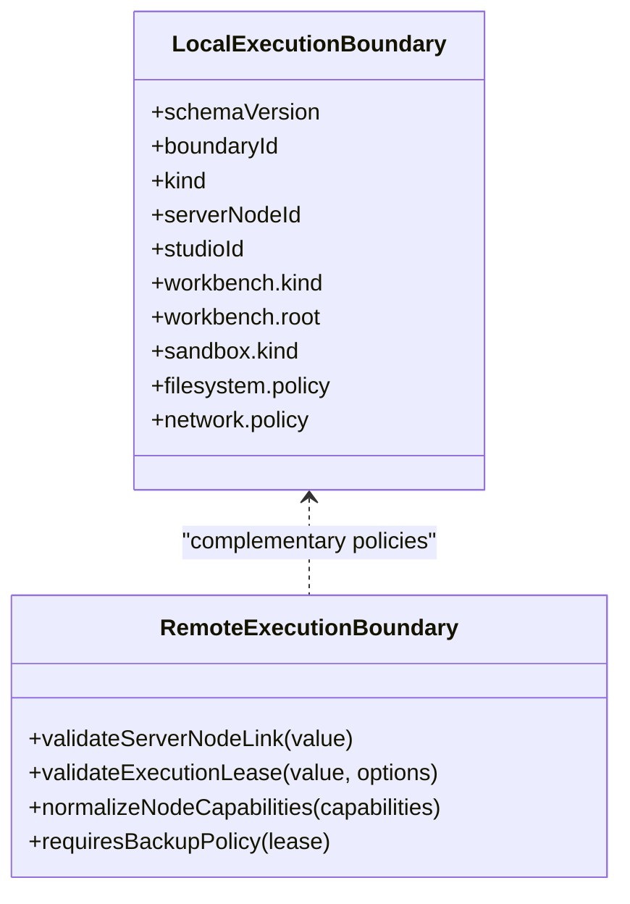

**Diagram sources**
- [execution-boundary.ts:4-49](file://core/execution-boundary.ts#L4-L49)
- [remote-execution-boundary.ts:20-89](file://core/remote-execution-boundary.ts#L20-L89)

**Section sources**
- [execution-boundary.ts:4-49](file://core/execution-boundary.ts#L4-L49)
- [remote-execution-boundary.ts:20-89](file://core/remote-execution-boundary.ts#L20-L89)

### Plugin Context Injection and Permissions
- createPluginContext builds a runtime scope from runtimeContext, including server/studio identifiers, connection kind, credential kind, and a copy of executionBoundary.
- Bus proxy restricts usage events unless granted permission; sensitive operations throw forbidden errors with structured codes.
- Session file registration and staging ensure absolute paths and proper storage kinds.

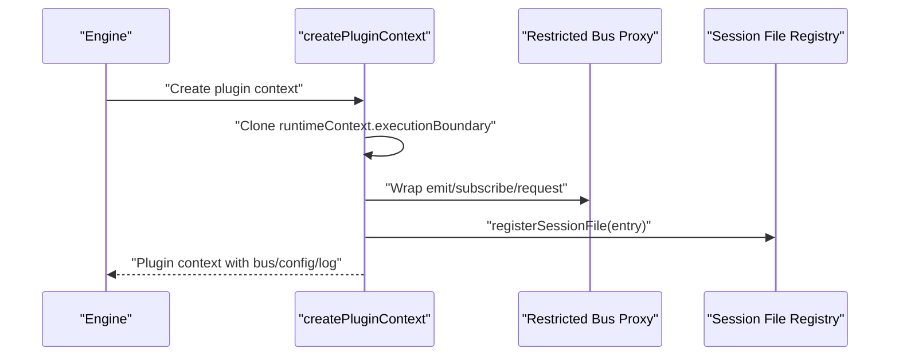

**Diagram sources**
- [plugin-context.ts:9-22](file://core/plugin-context.ts#L9-L22)
- [plugin-context.ts:102-140](file://core/plugin-context.ts#L102-L140)
- [plugin-context.ts:47-83](file://core/plugin-context.ts#L47-L83)

**Section sources**
- [plugin-context.ts:9-22](file://core/plugin-context.ts#L9-L22)
- [plugin-context.ts:102-140](file://core/plugin-context.ts#L102-L140)
- [plugin-context.ts:47-83](file://core/plugin-context.ts#L47-L83)

### Tool Execution Sandboxing and Path Guards
- wrapPathTool intercepts path-based tool executions, resolves absolute paths, checks managed config write permissions, and delegates to guard for allow/deny decisions. External read grants can override read blocks.
- wrapBashTool performs preflight checks for dangerous patterns, extracts path references from shell commands, and enforces guard checks before executing.

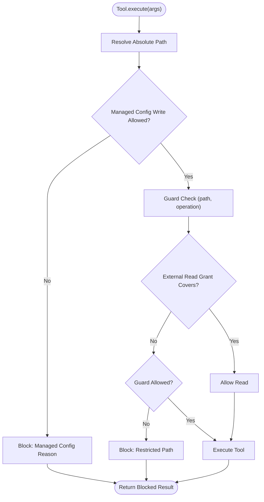

**Diagram sources**
- [tool-wrapper.ts:325-354](file://core/sandbox/tool-wrapper.ts#L325-L354)
- [tool-wrapper.ts:359-416](file://core/sandbox/tool-wrapper.ts#L359-L416)

**Section sources**
- [tool-wrapper.ts:325-354](file://core/sandbox/tool-wrapper.ts#L325-L354)
- [tool-wrapper.ts:359-416](file://core/sandbox/tool-wrapper.ts#L359-L416)

### Network Request Filtering
- NetworkFilter applies host-level restrictions by backing up and modifying hosts entries, supporting custom mappings and private IP blocking. It exposes restore and snapshot methods for audit.

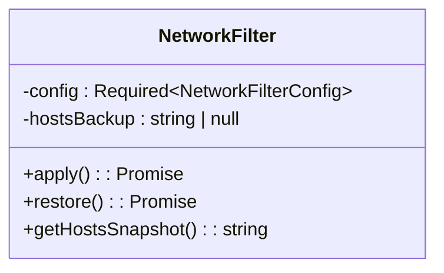

**Diagram sources**
- [network-filter.ts:23-70](file://core/sandbox/network-filter.ts#L23-L70)

**Section sources**
- [network-filter.ts:23-70](file://core/sandbox/network-filter.ts#L23-L70)

### Workspace Scoping and Authorized Folders
- normalizeWorkspaceScope cleans and deduplicates primaryCwd and workspaceFolders.
- normalizeSessionFolderScope merges authorized folders into sandboxFolders, ensuring no duplicates and consistent resolution.

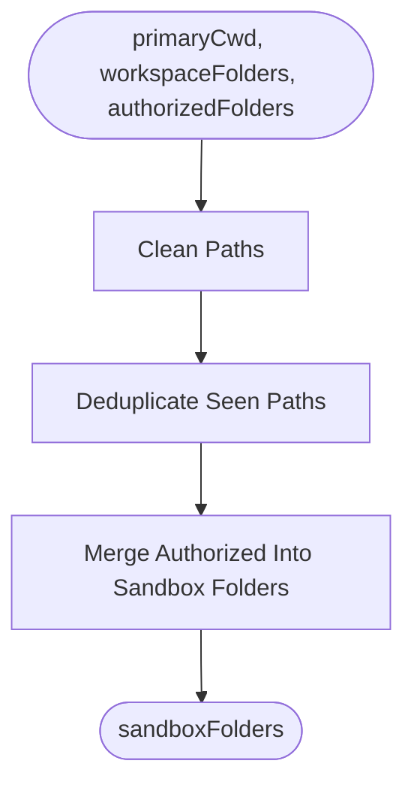

**Diagram sources**
- [workspace-scope.ts:10-25](file://core/shared/workspace-scope.ts#L10-L25)
- [workspace-scope.ts:36-56](file://core/shared/workspace-scope.ts#L36-L56)

**Section sources**
- [workspace-scope.ts:10-25](file://core/shared/workspace-scope.ts#L10-L25)
- [workspace-scope.ts:36-56](file://core/shared/workspace-scope.ts#L36-L56)

### Resource Access Control and HTTP Endpoints
- ResourceAccessService mediates metadata and content access, invoking capability checks and sanitizing responses by removing path fields for non-local owners.
- Resources API exposes:
  - GET /api/resources/:resourceId
  - POST /api/resources/:resourceId/ticket
  - GET /api/resources/:resourceId/content
  - HEAD /api/resources/:resourceId/content
- Content serving supports ETag caching, Range requests, and filename disposition.

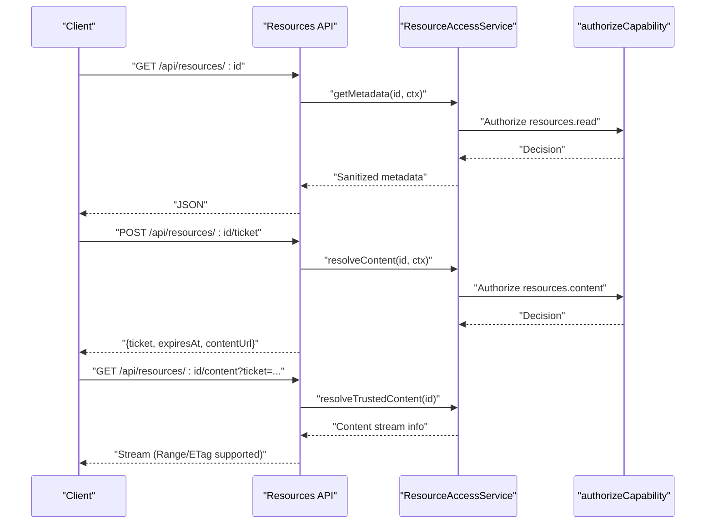

**Diagram sources**
- [resources.ts:12-54](file://server/routes/resources.ts#L12-L54)
- [resources.ts:103-150](file://server/routes/resources.ts#L103-L150)
- [resource-access-service.ts:6-31](file://core/resource-access-service.ts#L6-L31)
- [capability-policy.ts:7-100](file://core/capability-policy.ts#L7-L100)

**Section sources**
- [resources.ts:12-54](file://server/routes/resources.ts#L12-L54)
- [resources.ts:103-150](file://server/routes/resources.ts#L103-L150)
- [resource-access-service.ts:6-31](file://core/resource-access-service.ts#L6-L31)
- [capability-policy.ts:7-100](file://core/capability-policy.ts#L7-L100)

### Web Fetch Tool Example
- web_fetch tool fetches URLs, handles JSON/text responses, strips HTML tags, truncates output, and returns standardized content structures.

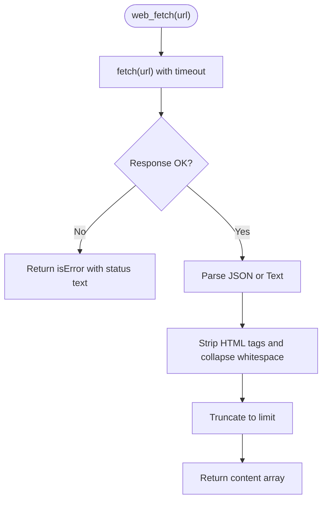

**Diagram sources**
- [web-fetch.ts:24-74](file://core/tools/web-fetch.ts#L24-L74)

**Section sources**
- [web-fetch.ts:24-74](file://core/tools/web-fetch.ts#L24-L74)

## Dependency Analysis
- HTTP boundary depends on security principal normalization, grant registry, and capability policy to build request context and authorize capabilities.
- Resource routes depend on resource access service which uses capability policy and optional audit hooks.
- Plugin context depends on runtime context and bus proxying for permission enforcement.
- Sandbox wrappers depend on path guards and external read grants; bash wrapper adds preflight checks.
- Network filter operates independently but integrates with sandbox lifecycle.
- Workspace scope utilities provide normalized folder lists used by sandbox configuration.

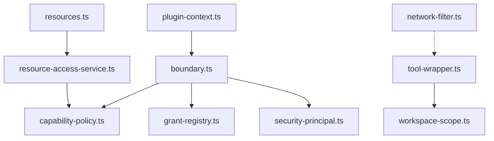

**Diagram sources**
- [boundary.ts:7-47](file://server/http/boundary.ts#L7-L47)
- [resources.ts:12-54](file://server/routes/resources.ts#L12-L54)
- [resource-access-service.ts:6-31](file://core/resource-access-service.ts#L6-L31)
- [plugin-context.ts:9-22](file://core/plugin-context.ts#L9-L22)
- [tool-wrapper.ts:325-354](file://core/sandbox/tool-wrapper.ts#L325-L354)
- [workspace-scope.ts:10-25](file://core/shared/workspace-scope.ts#L10-L25)
- [network-filter.ts:23-70](file://core/sandbox/network-filter.ts#L23-L70)

**Section sources**
- [boundary.ts:7-47](file://server/http/boundary.ts#L7-L47)
- [resources.ts:12-54](file://server/routes/resources.ts#L12-L54)
- [resource-access-service.ts:6-31](file://core/resource-access-service.ts#L6-L31)
- [plugin-context.ts:9-22](file://core/plugin-context.ts#L9-L22)
- [tool-wrapper.ts:325-354](file://core/sandbox/tool-wrapper.ts#L325-L354)
- [workspace-scope.ts:10-25](file://core/shared/workspace-scope.ts#L10-L25)
- [network-filter.ts:23-70](file://core/sandbox/network-filter.ts#L23-L70)

## Performance Considerations
- Prefer minimal payload sizes for resource content; leverage ETag and Range headers to reduce bandwidth.
- Cache active grants where appropriate to avoid repeated disk reads; ensure consistency when grants change.
- Use workspace scope normalization once per session to avoid redundant path computations.
- Avoid excessive regex preflight checks in high-throughput environments; consider compiling patterns once.
- Network filter apply/restore should be scoped to short-lived sandbox lifecycles to minimize system-wide impact.

## Troubleshooting Guide
Common issues and diagnostics:
- Missing capability or insufficient scope: check authorize decision reasons and ensure grants include required capabilities and transport constraints.
- Resource access denied: verify resource metadata contains correct studioId and resourceId; confirm capability decision allows resources.read or resources.content.
- Sandbox blocked results: inspect blocked reasons for managed config writes or restricted paths; review external read grants if applicable.
- Bash command blocked: examine preflight patterns and extracted path checks; adjust commands to comply with allowed operations.
- Network connectivity failures: confirm hosts modifications and custom mappings; restore original hosts after sandbox use.

**Section sources**
- [capability-policy.ts:7-100](file://core/capability-policy.ts#L7-L100)
- [resource-access-service.ts:6-31](file://core/resource-access-service.ts#L6-L31)
- [tool-wrapper.ts:325-354](file://core/sandbox/tool-wrapper.ts#L325-L354)
- [tool-wrapper.ts:359-416](file://core/sandbox/tool-wrapper.ts#L359-L416)
- [network-filter.ts:23-70](file://core/sandbox/network-filter.ts#L23-L70)

## Conclusion
The context management and execution boundary subsystem provides robust mechanisms for injecting runtime context, enforcing permissions, scoping workspaces, and controlling resource access. By combining normalized principals, grant-backed capability evaluation, sandboxed tool execution, and strict HTTP route policies, the platform ensures secure and predictable behavior across local and remote execution environments.

## Appendices

### TypeScript Interfaces Summary
- Request context fields:
  - method, url, path
  - serverId, serverNodeId, userId, studioId, principalId
  - connectionKind, credentialKind, platformAccountId, officialServiceKind
  - executionBoundary, authPrincipal
  - authorize(capability, target): Decision
- Execution boundary (local):
  - schemaVersion, boundaryId, kind, serverNodeId, studioId
  - workbench.kind, workbench.root
  - sandbox.kind, sandbox.enforcedBy
  - filesystem.policy, network.policy
- Execution lease (remote):
  - schemaVersion, leaseId, studioId, targetServerNodeId, agentId, sessionId
  - actorPrincipalId, capabilityDecisionId, mountId, resourceIds
  - commandClass, sandboxProfile, backupPolicy, expiresAt, createdAt
- Resource access:
  - getMetadata(resourceId, requestContext): Sanitized resource
  - resolveContent(resourceId, requestContext): Content + sanitized resource
  - resolveTrustedContent(resourceId, requestContext?): Trusted content
- Plugin context:
  - pluginId, pluginKey, source, pluginDir, dataDir
  - capabilities, sensitiveCapabilities
  - bus (restricted), config, log, registerSessionFile, stageFile
- Network filter:
  - allowedHosts, blockPrivate, customMappings
  - apply(), restore(), getHostsSnapshot()
- Workspace scope:
  - primaryCwd, workspaceFolders, authorizedFolders, sandboxFolders

[No sources needed since this section summarizes interfaces without analyzing specific files]