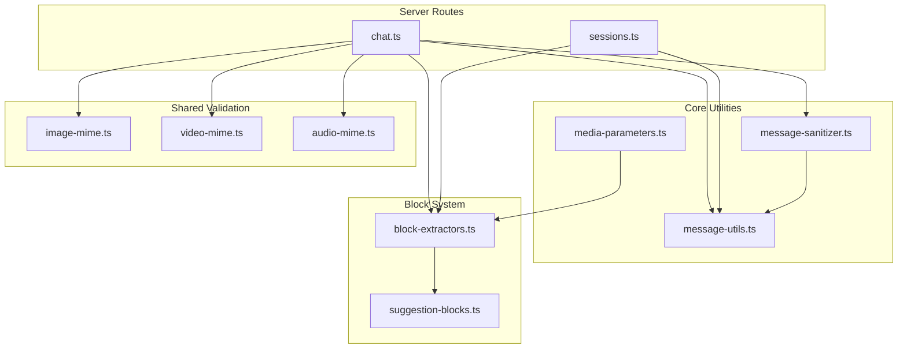
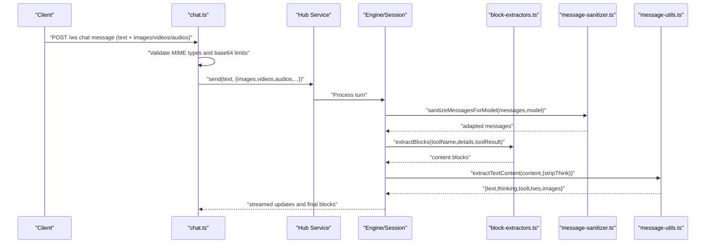
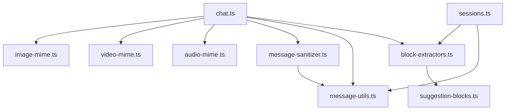

# Content Processing API

<cite>
**Referenced Files in This Document**
- [block-extractors.ts](file://server/block-extractors.ts)
- [suggestion-blocks.ts](file://server/suggestion-blocks.ts)
- [message-utils.ts](file://core/message-utils.ts)
- [message-sanitizer.ts](file://core/message-sanitizer.ts)
- [chat.ts](file://server/routes/chat.ts)
- [image-mime.ts](file://shared/image-mime.ts)
- [video-mime.ts](file://shared/video-mime.ts)
- [audio-mime.ts](file://shared/audio-mime.ts)
- [media-parameters.ts](file://core/media/media-parameters.ts)
- [sessions.ts](file://server/routes/sessions.ts)
</cite>

## Table of Contents
1. Introduction
2. Project Structure
3. Core Components
4. Architecture Overview
5. Detailed Component Analysis
6. Dependency Analysis
7. Performance Considerations
8. Troubleshooting Guide
9. Conclusion

## Introduction
This document describes the content processing and transformation APIs used to extract structured blocks from tool results, format and validate chat messages, generate suggestion cards, and handle media within chat sessions. It focuses on:
- Block extraction from tool outputs into a unified content block system
- Format conversion utilities for text, thinking, images, and tool calls
- Validation rules for image, video, and audio inputs
- Suggestion generation for automation workflows
- Structured data processing for deferred media generation and session file references

The goal is to provide clear guidance for integrating with these APIs, understanding their contracts, and handling various content types consistently across the system.

## Project Structure
Content processing spans server-side route handlers, shared validation modules, and core message utilities:
- Server routes orchestrate input validation and dispatch to hub services
- Shared MIME utilities define allowed formats and size limits for images, videos, and audios
- Core utilities parse and normalize Pi SDK content arrays into structured fields
- Block extractors transform tool result details into displayable content blocks
- Suggestion builders produce standardized automation draft cards
- Message sanitizers adapt messages based on model capabilities and strip historical inline media



**Diagram sources**
- [chat.ts:1350-1549](file://server/routes/chat.ts#L1350-L1549)
- [sessions.ts:921-944](file://server/routes/sessions.ts#L921-L944)
- [message-utils.ts:1-313](file://core/message-utils.ts#L1-L313)
- [message-sanitizer.ts:1-272](file://core/message-sanitizer.ts#L1-L272)
- [image-mime.ts:1-32](file://shared/image-mime.ts#L1-L32)
- [video-mime.ts:1-29](file://shared/video-mime.ts#L1-L29)
- [audio-mime.ts:1-70](file://shared/audio-mime.ts#L1-L70)
- [media-parameters.ts:104-160](file://core/media/media-parameters.ts#L104-L160)
- [block-extractors.ts:1-409](file://server/block-extractors.ts#L1-L409)
- [suggestion-blocks.ts:1-51](file://server/suggestion-blocks.ts#L1-L51)

**Section sources**
- [chat.ts:1350-1549](file://server/routes/chat.ts#L1350-L1549)
- [sessions.ts:921-944](file://server/routes/sessions.ts#L921-L944)
- [message-utils.ts:1-313](file://core/message-utils.ts#L1-L313)
- [message-sanitizer.ts:1-272](file://core/message-sanitizer.ts#L1-L272)
- [image-mime.ts:1-32](file://shared/image-mime.ts#L1-L32)
- [video-mime.ts:1-29](file://shared/video-mime.ts#L1-L29)
- [audio-mime.ts:1-70](file://shared/audio-mime.ts#L1-L70)
- [media-parameters.ts:104-160](file://core/media/media-parameters.ts#L104-L160)
- [block-extractors.ts:1-409](file://server/block-extractors.ts#L1-L409)
- [suggestion-blocks.ts:1-51](file://server/suggestion-blocks.ts#L1-L51)

## Core Components
- Content Block Extraction Registry: Converts tool result details into typed content blocks (files, artifacts, screenshots, media generation tasks, skills, settings confirmations, subagent/workflow summaries).
- Suggestion Builder: Produces standardized automation draft cards with operation metadata and actions.
- Text and Tool Call Extractor: Parses Pi SDK content arrays into normalized text, thinking, tool uses, and images; supports stripping reasoning tags.
- Message Sanitizer: Adapts messages to model capabilities by replacing unsupported media with placeholders and strips historical inline media for replay or persistence.
- Input Validators: Enforce allowed MIME types and base64 size limits for images, videos, and audios at the chat route entry point.
- Media Parameter Validator: Validates provider-specific media parameters against schemas, including type checks, enums, and numeric ranges.

**Section sources**
- [block-extractors.ts:1-409](file://server/block-extractors.ts#L1-L409)
- [suggestion-blocks.ts:1-51](file://server/suggestion-blocks.ts#L1-L51)
- [message-utils.ts:1-313](file://core/message-utils.ts#L1-L313)
- [message-sanitizer.ts:1-272](file://core/message-sanitizer.ts#L1-L272)
- [image-mime.ts:1-32](file://shared/image-mime.ts#L1-L32)
- [video-mime.ts:1-29](file://shared/video-mime.ts#L1-L29)
- [audio-mime.ts:1-70](file://shared/audio-mime.ts#L1-L70)
- [media-parameters.ts:104-160](file://core/media/media-parameters.ts#L104-L160)

## Architecture Overview
The content processing pipeline integrates multiple layers:
- Client sends chat messages with optional media attachments
- Server validates media formats and sizes
- Messages are sanitized according to model capabilities
- Tool results are transformed into content blocks via extractors
- Deferred media generation tasks are resolved and interludes emitted
- Session history is enriched with file references and metadata



**Diagram sources**
- [chat.ts:1350-1549](file://server/routes/chat.ts#L1350-L1549)
- [message-sanitizer.ts:1-272](file://core/message-sanitizer.ts#L1-L272)
- [block-extractors.ts:1-409](file://server/block-extractors.ts#L1-L409)
- [message-utils.ts:1-313](file://core/message-utils.ts#L1-L313)

## Detailed Component Analysis

### Content Block System
The block extraction registry maps tool names to extractor functions that produce typed content blocks. Supported block types include:
- file: References to session files with metadata (id, path, label, ext, mime, kind, storageKind, status, missingAt, resource)
- artifact: Legacy artifact previews with content and language
- screenshot: Inline image data with mimeType
- media_generation: Pending tasks for image/video generation with taskId, kind, batchId, prompt
- skill: Installed skill metadata and file reference
- settings_confirm/settings_update: Confirmation/update cards for settings changes
- subagent/workflow: Task summaries with stream keys and statuses
- plugin_card: Plugin UI cards with safe card payload

Key behaviors:
- Compatibility aliases (e.g., present_files -> stage_files)
- Fallback logic when file references are missing
- Interlude emission for deferred media generation tasks
- Replacement of pending blocks with success/failure outcomes based on deferred results

```mermaid
classDiagram
class BlockExtractors {
+stage_files(details)
+create_artifact(details)
+browser(details, toolResult)
+"image-gen_generate-image"(details)
+"image-gen_generate-video"(details)
+computer(details)
+install_skill(details)
+cron(details)
+automation(details)
+subagent(details)
+workflow(details)
+update_settings(details)
+extractBlocks(toolName, details, toolResult)
+resolveMediaGenerationBlocks(blocks, results, standaloneResults)
}
class SuggestionBuilder {
+buildAutomationSuggestionBlock({confirmId,suggestionId,suggestionShortCode,jobData,operation,status})
}
BlockExtractors --> SuggestionBuilder : "uses"
```

**Diagram sources**
- [block-extractors.ts:1-409](file://server/block-extractors.ts#L1-L409)
- [suggestion-blocks.ts:1-51](file://server/suggestion-blocks.ts#L1-L51)

**Section sources**
- [block-extractors.ts:1-409](file://server/block-extractors.ts#L1-L409)
- [suggestion-blocks.ts:1-51](file://server/suggestion-blocks.ts#L1-L51)

### Format Conversion APIs
- extractTextContent: Normalizes Pi SDK content arrays into text, thinking, tool uses, and images; supports stripping <think>/<thinking> tags.
- filterUnreferencedInlineImages: Removes extra inline images not referenced by attached markers.
- loadSessionHistoryMessages: Loads full session history from JSONL or Pi session manager, repairing oversized entries.
- loadLatestAssistantSummaryFromSessionFile: Efficiently reads tail of session file to infer last assistant summary.

Usage patterns:
- Convert string or array content to structured fields
- Strip reasoning blocks while preserving thinking content
- Summarize tool call arguments using a curated key list
- Handle legacy session formats gracefully

**Section sources**
- [message-utils.ts:1-313](file://core/message-utils.ts#L1-L313)

### Content Validation Rules
Input validation enforces:
- Allowed MIME types per media kind
- Base64 size limits per media kind
- Maximum counts for videos and audios
- Error responses with localized messages

Validation flow:
- Images: Check MIME and size limit
- Videos: Check count, MIME, and size limit
- Audios: Check count, MIME, and size limit
- Reject invalid inputs early with user-friendly errors

**Section sources**
- [chat.ts:1350-1549](file://server/routes/chat.ts#L1350-L1549)
- [image-mime.ts:1-32](file://shared/image-mime.ts#L1-L32)
- [video-mime.ts:1-29](file://shared/video-mime.ts#L1-L29)
- [audio-mime.ts:1-70](file://shared/audio-mime.ts#L1-L70)

### Suggestion Generation
Automation suggestions are built from job data and operation metadata:
- Supports create/update operations
- Includes confirmation IDs, short codes, and status
- Targets specific agents with executor metadata
- Provides actions (e.g., open view)

Use cases:
- Cron scheduling drafts
- Automation workflow proposals
- Settings change confirmations

**Section sources**
- [suggestion-blocks.ts:1-51](file://server/suggestion-blocks.ts#L1-L51)
- [block-extractors.ts:92-117](file://server/block-extractors.ts#L92-L117)

### Structured Data Processing
Deferred media generation tasks are resolved and replaced:
- Pending media_generation blocks are updated based on deferred results
- Interludes are emitted for progress updates
- Success replaces pending blocks with file references
- Failure/aborted emits fallback blocks with reasons

Session enrichment:
- Subagent blocks are patched with durable run metadata
- Stream keys are inferred from session paths
- After-index pagination is adjusted for sliced blocks

**Section sources**
- [block-extractors.ts:283-374](file://server/block-extractors.ts#L283-L374)
- [sessions.ts:921-944](file://server/routes/sessions.ts#L921-L944)

### Message Sanitization and Adaptation
Message sanitization adapts messages to model capabilities:
- Replaces unsupported media blocks with placeholder text
- Strips historical inline media while preserving current context
- Counts stripped items for non-silent notifications

Processing logic:
- Detect unsupported media based on model input capabilities
- Replace with localized placeholders
- Preserve attached markers for current context
- Optimize by skipping unnecessary allocations

**Section sources**
- [message-sanitizer.ts:1-272](file://core/message-sanitizer.ts#L1-L272)

### Media Parameter Validation
Provider-specific media parameters are validated against schemas:
- Type checking (number, integer, string, boolean, array, object)
- Enum constraints
- Numeric range validation (minimum/maximum)
- Explicit parameter precedence resolution

**Section sources**
- [media-parameters.ts:104-160](file://core/media/media-parameters.ts#L104-L160)

## Dependency Analysis
The content processing components have clear dependency relationships:
- Chat route depends on shared MIME validators and message sanitizer
- Block extractors depend on suggestion builder and i18n utilities
- Message utils support both route and session processing
- Sessions route enriches blocks with engine-provided metadata



**Diagram sources**
- [chat.ts:1350-1549](file://server/routes/chat.ts#L1350-L1549)
- [sessions.ts:921-944](file://server/routes/sessions.ts#L921-L944)
- [message-utils.ts:1-313](file://core/message-utils.ts#L1-L313)
- [message-sanitizer.ts:1-272](file://core/message-sanitizer.ts#L1-L272)
- [image-mime.ts:1-32](file://shared/image-mime.ts#L1-L32)
- [video-mime.ts:1-29](file://shared/video-mime.ts#L1-L29)
- [audio-mime.ts:1-70](file://shared/audio-mime.ts#L1-L70)
- [block-extractors.ts:1-409](file://server/block-extractors.ts#L1-L409)
- [suggestion-blocks.ts:1-51](file://server/suggestion-blocks.ts#L1-L51)

**Section sources**
- [chat.ts:1350-1549](file://server/routes/chat.ts#L1350-L1549)
- [sessions.ts:921-944](file://server/routes/sessions.ts#L921-L944)
- [message-utils.ts:1-313](file://core/message-utils.ts#L1-L313)
- [message-sanitizer.ts:1-272](file://core/message-sanitizer.ts#L1-L272)
- [image-mime.ts:1-32](file://shared/image-mime.ts#L1-L32)
- [video-mime.ts:1-29](file://shared/video-mime.ts#L1-L29)
- [audio-mime.ts:1-70](file://shared/audio-mime.ts#L1-L70)
- [block-extractors.ts:1-409](file://server/block-extractors.ts#L1-L409)
- [suggestion-blocks.ts:1-51](file://server/suggestion-blocks.ts#L1-L51)

## Performance Considerations
- Early validation prevents expensive processing of invalid media
- Message sanitization optimizes by skipping unnecessary allocations when no adaptation is needed
- Session history loading uses efficient tail reading for large files
- Block extraction avoids dependencies on unavailable properties for backward compatibility
- Deferred result resolution deduplicates interludes and consumes task IDs efficiently

[No sources needed since this section provides general guidance]

## Troubleshooting Guide
Common issues and resolutions:
- Unsupported media format: Verify MIME types against allowed lists and ensure base64 encoding is correct
- Media too large: Check size limits for images, videos, and audios
- Model capability mismatch: Use message sanitizer to adapt messages before sending to models
- Missing file references: Ensure session file metadata is properly populated in tool results
- Deferred task failures: Check deferred result stores for failure reasons and update UI accordingly

**Section sources**
- [chat.ts:1350-1549](file://server/routes/chat.ts#L1350-L1549)
- [message-sanitizer.ts:1-272](file://core/message-sanitizer.ts#L1-L272)
- [block-extractors.ts:283-374](file://server/block-extractors.ts#L283-L374)

## Conclusion
The content processing API provides a comprehensive system for handling diverse content types in chat interactions. Through structured block extraction, robust validation, intelligent message adaptation, and efficient deferred processing, it enables consistent and reliable content transformation across the platform. The modular design allows for easy extension and maintenance while ensuring backward compatibility and performance optimization.

[No sources needed since this section summarizes without analyzing specific files]