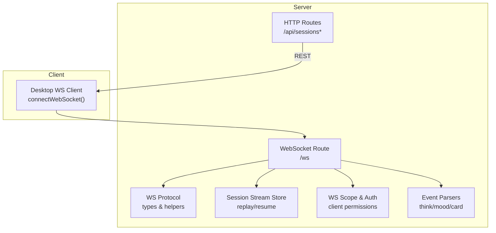
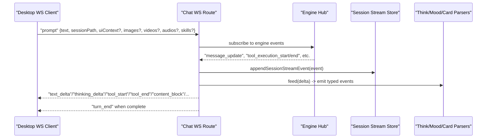
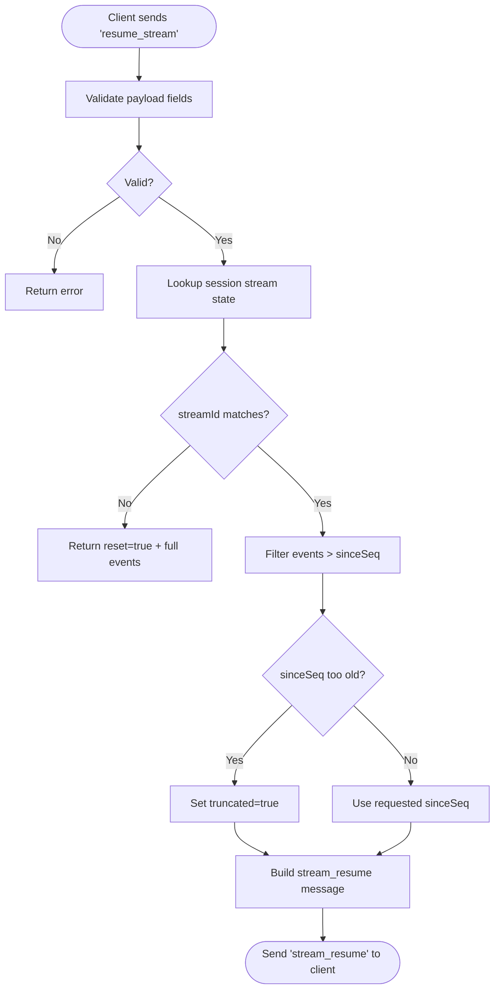
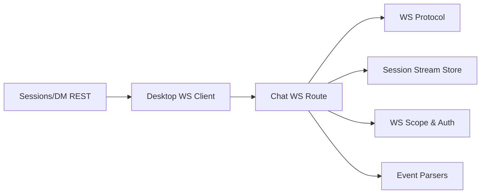

# Message Handling API

<cite>
**Referenced Files in This Document**
- [chat.ts](file://server/routes/chat.ts)
- [ws-protocol.ts](file://server/ws-protocol.ts)
- [session-stream-store.ts](file://server/session-stream-store.ts)
- [ws-scope.ts](file://server/ws-scope.ts)
- [sessions.ts](file://server/routes/sessions.ts)
- [dm.ts](file://server/routes/dm.ts)
- [events.ts](file://core/events.ts)
- [websocket.ts](file://desktop/src/react/services/websocket.ts)
</cite>

## Table of Contents
1. [Introduction](#introduction)
2. [Project Structure](#project-structure)
3. [Core Components](#core-components)
4. [Architecture Overview](#architecture-overview)
5. [Detailed Component Analysis](#detailed-component-analysis)
6. [Dependency Analysis](#dependency-analysis)
7. [Performance Considerations](#performance-considerations)
8. [Troubleshooting Guide](#troubleshooting-guide)
9. [Conclusion](#conclusion)
10. [Appendices](#appendices)

## Introduction
This document provides detailed API documentation for message sending, receiving, and processing endpoints across HTTP and WebSocket transports. It covers real-time chat functionality, message streaming, context injection, turn-based conversation flow, and structured content blocks. The focus is on the server-side routing and protocol definitions that power the OpenShadow messaging system.

## Project Structure
The messaging subsystem spans several modules:
- REST routes for session management and DMs
- WebSocket route for real-time chat and streaming
- Protocol definitions for WS messages
- Session stream store for replay/resume
- Security scoping for WS clients
- Event parsers for thinking/mood/card tags
- Client-side WebSocket connection utilities

**Diagram sources**
- [chat.ts:200-350](file://server/routes/chat.ts#L200-L350)
- [ws-protocol.ts:1-122](file://server/ws-protocol.ts#L1-L122)
- [session-stream-store.ts:28-142](file://server/session-stream-store.ts#L28-L142)
- [ws-scope.ts:27-88](file://server/ws-scope.ts#L27-L88)
- [events.ts:30-167](file://core/events.ts#L30-L167)
- [websocket.ts:41-75](file://desktop/src/react/services/websocket.ts#L41-L75)

**Section sources**
- [chat.ts:200-350](file://server/routes/chat.ts#L200-L350)
- [ws-protocol.ts:1-122](file://server/ws-protocol.ts#L1-L122)
- [session-stream-store.ts:28-142](file://server/session-stream-store.ts#L28-L142)
- [ws-scope.ts:27-88](file://server/ws-scope.ts#L27-L88)
- [events.ts:30-167](file://core/events.ts#L30-L167)
- [websocket.ts:41-75](file://desktop/src/react/services/websocket.ts#L41-L75)

## Core Components
- WebSocket Chat Route: Handles client connections, subscribes to engine events, broadcasts typed stream events, manages per-session state, and coordinates turn lifecycle (start/end), tool calls, notifications, and browser status.
- WS Protocol: Defines client/server message shapes, serialization helpers, and strict validation for resume payloads.
- Session Stream Store: Maintains per-turn event buffers with sequence numbers, compaction, and resume logic.
- WS Scope & Security: Enforces read/write permissions and subscription-based delivery for multi-studio environments.
- Event Parsers: Extract think/mood/card segments from streaming text into discrete events.
- Desktop WS Client: Establishes authenticated WS connections and resumes streams after reconnect.

**Section sources**
- [chat.ts:200-350](file://server/routes/chat.ts#L200-L350)
- [ws-protocol.ts:1-122](file://server/ws-protocol.ts#L1-L122)
- [session-stream-store.ts:28-142](file://server/session-stream-store.ts#L28-L142)
- [ws-scope.ts:27-88](file://server/ws-scope.ts#L27-L88)
- [events.ts:30-167](file://core/events.ts#L30-L167)
- [websocket.ts:41-75](file://desktop/src/react/services/websocket.ts#L41-L75)

## Architecture Overview
End-to-end flow for a user prompt through streaming response:

**Diagram sources**
- [chat.ts:389-442](file://server/routes/chat.ts#L389-L442)
- [ws-protocol.ts:1-36](file://server/ws-protocol.ts#L1-L36)
- [session-stream-store.ts:62-81](file://server/session-stream-store.ts#L62-L81)
- [events.ts:180-307](file://core/events.ts#L180-L307)

## Detailed Component Analysis

### WebSocket Chat Route (/ws)
Responsibilities:
- Accept WS connections and authenticate via token query parameter.
- Maintain per-session state (parsers, flags, timers).
- Subscribe to engine/hub events and broadcast typed WS messages.
- Manage turn lifecycle, stall timeouts, and disconnect abort grace periods.
- Emit structured content blocks for tool results, deferred results, automation suggestions, and more.
- Handle browser status polling and desk change notifications.

Key behaviors:
- Per-session state includes ThinkTagParser, MoodParser, CardParser instances and streaming flags.
- Broadcast uses serialized JSON once and sends to all eligible clients based on subscriptions and scopes.
- Turn stall watchdog aborts long-idle turns; disconnect abort grace period aborts all streaming if no clients remain.

**Section sources**
- [chat.ts:200-350](file://server/routes/chat.ts#L200-L350)
- [chat.ts:389-442](file://server/routes/chat.ts#L389-L442)
- [chat.ts:460-488](file://server/routes/chat.ts#L460-L488)
- [chat.ts:561-590](file://server/routes/chat.ts#L561-L590)

#### Client → Server Messages (WebSocket)
- prompt
  - Fields: type="prompt", text, sessionPath, images?, videos?, audios?, skills?, uiContext?
  - uiContext can be null to clear previous values; not persisted in session entries.
- abort
  - Fields: type="abort"
- resume_stream
  - Fields: type="resume_stream", sessionPath, streamId, sinceSeq

**Section sources**
- [ws-protocol.ts:1-36](file://server/ws-protocol.ts#L1-L36)

#### Server → Client Messages (WebSocket)
- text_delta: delta string
- mood_start / mood_text / mood_end
- thinking_start / thinking_delta / thinking_end
- tool_start: id?, name, args (summarized)
- tool_end: id?, name, success, details?
- turn_end
- error: message
- status: isStreaming, streamId?, turnId?
- session_title: title, path
- jian_update: content
- devlog: text, level
- activity_update: activity object
- content_block: block (rich types)
- session_user_message: sessionPath, message
- confirmation_resolved: confirmId, action, value?
- block_update: taskId, patch
- browser_status: running, url, thumbnail?
- bridge_status: platform, status, error?
- stream_resume: sessionPath, streamId, sinceSeq, nextSeq, reset, truncated, isStreaming, runtimeIsStreaming?, events[]

**Section sources**
- [ws-protocol.ts:12-36](file://server/ws-protocol.ts#L12-L36)

#### Content Block Types
Rich content blocks emitted via content_block include:
- file
- media_generation
- artifact (legacy compatibility)
- screenshot
- skill
- plugin_card
- suggestion_card
- cron_confirm
- settings_confirm
- settings_update
- interlude
- subagent
- workflow

These are produced by tool result extraction, deferred result handling, and automation suggestion builders.

**Section sources**
- [chat.ts:401-442](file://server/routes/chat.ts#L401-L442)
- [chat.ts:720-760](file://server/routes/chat.ts#L720-L760)

#### Streaming Resume Flow
Clients may request missing events using resume_stream. The server validates inputs and returns a compacted or full set of events with metadata indicating reset/truncation and current streaming state.

**Diagram sources**
- [ws-protocol.ts:92-137](file://server/ws-protocol.ts#L92-L137)
- [session-stream-store.ts:96-142](file://server/session-stream-store.ts#L96-L142)

**Section sources**
- [ws-protocol.ts:92-137](file://server/ws-protocol.ts#L92-L137)
- [session-stream-store.ts:96-142](file://server/session-stream-store.ts#L96-L142)

### Session Management REST API
Endpoints:
- GET /api/sessions
  - Lists sessions with metadata, summaries, workspace mounts, permission mode, RC attachments, and revision signatures.
- GET /api/sessions/search?q=...&phase=title|content&limit=N
  - Search sessions with tokenizer fallback and limits.
- GET /api/sessions/summary?path=...
  - Fetch rolling summary record for a session.
- POST /api/sessions/pin
  - Pin/unpin a session.
- GET /api/sessions/authorized-folders?path=...
  - Query authorized folder scope for a session.
- PATCH /api/sessions/authorized-folders
  - Add/remove/set authorized folders.
- GET /api/sessions/messages?path=...&before=&limit=&all=1
  - Paginated history with revision-aware reconciliation.

Error handling:
- Returns standardized error objects with code and status where applicable.
- Validates session paths and authorization scopes.

**Section sources**
- [sessions.ts:508-574](file://server/routes/sessions.ts#L508-L574)
- [sessions.ts:576-637](file://server/routes/sessions.ts#L576-L637)
- [sessions.ts:640-662](file://server/routes/sessions.ts#L640-L662)
- [sessions.ts:665-693](file://server/routes/sessions.ts#L665-L693)
- [sessions.ts:695-721](file://server/routes/sessions.ts#L695-L721)
- [sessions.ts:723-773](file://server/routes/sessions.ts#L723-L773)
- [sessions.ts:776-800](file://server/routes/sessions.ts#L776-L800)

### Direct Messages (DM) REST API
Endpoints:
- GET /api/dm
  - Lists DM conversations with last message previews and counts.
- GET /api/dm/:peerId
  - Retrieves visible messages for a peer, filtered by projection visibility.
- POST /api/dm/:peerId/reset
  - Resets phone projection visibility and runtime state for a peer.

Security:
- Requires channels enabled; otherwise returns 503.
- Validates peerId and resolves owner agent.

**Section sources**
- [dm.ts:76-136](file://server/routes/dm.ts#L76-L136)
- [dm.ts:139-175](file://server/routes/dm.ts#L139-L175)
- [dm.ts:177-225](file://server/routes/dm.ts#L177-L225)

### WebSocket Security and Scoping
- Client records track principal and subscriptions (studio-level or session-level).
- Delivery rules:
  - Local owners receive all events.
  - Non-local clients require chat.read scope and same-studio match; session events must carry studioId.
  - Thumbnails are withheld for non-local clients.
- Write/read permissions:
  - prompt/abort/steer/interject/slash/compact require chat.write.
  - resume_stream/context_usage require chat.read.
  - Other messages require chat scope.

**Section sources**
- [ws-scope.ts:27-88](file://server/ws-scope.ts#L27-L88)
- [ws-scope.ts:49-78](file://server/ws-scope.ts#L49-L78)

### Event Parsers (Thinking, Mood, Cards)
- ThinkTagParser: Intercepts <think>/<thinking> tags, emits think_start/think_text/think_end and passes-through text.
- MoodParser: Parses <mood>/<pulse>/<reflect> tags, emits mood_start/mood_text/mood_end and passes-through text.
- CardParser: Parses <card ...>...</card>, emits card_start/card_text/card_end and passes-through text.

These parsers are chained during streaming to produce fine-grained UI updates.

**Section sources**
- [events.ts:180-307](file://core/events.ts#L180-L307)
- [events.ts:30-167](file://core/events.ts#L30-L167)
- [events.ts:320-439](file://core/events.ts#L320-L439)

### Desktop WebSocket Client
- connectWebSocket builds URL with token query param and establishes connection.
- On open, it resumes active sessions by sending resume_stream requests for each streaming session path.

**Section sources**
- [websocket.ts:41-75](file://desktop/src/react/services/websocket.ts#L41-L75)

## Dependency Analysis
High-level dependencies between components:

**Diagram sources**
- [chat.ts:200-350](file://server/routes/chat.ts#L200-L350)
- [ws-protocol.ts:1-122](file://server/ws-protocol.ts#L1-L122)
- [session-stream-store.ts:28-142](file://server/session-stream-store.ts#L28-L142)
- [ws-scope.ts:27-88](file://server/ws-scope.ts#L27-L88)
- [events.ts:30-167](file://core/events.ts#L30-L167)
- [websocket.ts:41-75](file://desktop/src/react/services/websocket.ts#L41-L75)

**Section sources**
- [chat.ts:200-350](file://server/routes/chat.ts#L200-L350)
- [ws-protocol.ts:1-122](file://server/ws-protocol.ts#L1-L122)
- [session-stream-store.ts:28-142](file://server/session-stream-store.ts#L28-L142)
- [ws-scope.ts:27-88](file://server/ws-scope.ts#L27-L88)
- [events.ts:30-167](file://core/events.ts#L30-L167)
- [websocket.ts:41-75](file://desktop/src/react/services/websocket.ts#L41-L75)

## Performance Considerations
- Event buffering:
  - Default max events and bytes per stream are bounded; large events are compacted or omitted to prevent memory growth.
  - Trim policy drops oldest events when thresholds exceeded.
- Serialization optimization:
  - Broadcast serializes messages once and reuses the payload for multiple clients.
- Stall detection:
  - Turn stall watchdog prevents indefinite stalls by aborting idle turns.
- Thumbnail throttling:
  - Browser thumbnail polling runs only while browsers are active.

[No sources needed since this section provides general guidance]

## Troubleshooting Guide
Common issues and resolutions:
- Missing sessionPath in prompt:
  - Server responds with an error message; ensure sessionPath is provided.
- Agent deleted:
  - Requests targeting deleted agents return specific errors; verify agent existence before operations.
- Studio scope mismatch:
  - Multi-studio deployments enforce matching studio IDs; ensure client credentials align with server runtime studio.
- Token authentication:
  - WS connections require token query parameter; verify token validity and transport configuration.
- Resume failures:
  - Check streamId and sinceSeq; if reset=true, rebuild local state from returned events.

**Section sources**
- [chat.ts:234-248](file://server/routes/chat.ts#L234-L248)
- [sessions.ts:576-637](file://server/routes/sessions.ts#L576-L637)
- [websocket.ts:41-75](file://desktop/src/react/services/websocket.ts#L41-L75)

## Conclusion
The OpenShadow messaging system combines robust REST endpoints for session management and DMs with a high-performance WebSocket channel for real-time streaming. Strict protocol validation, secure scoping, and efficient event buffering enable reliable turn-based conversations with rich content blocks and resumable streams.

[No sources needed since this section summarizes without analyzing specific files]

## Appendices

### TypeScript Interfaces Summary
Note: These interfaces reflect the data models used by the desktop client and server-side processing. They are referenced here for completeness.

- ToolCall
- UserAttachment
- AudioWaveform
- VoiceTranscription
- DeskContext
- SessionRegistryFile
- ResourceEnvelope
- SessionConfirmationBlock
- SettingsUpdateChange
- SettingsUpdatePayload
- SuggestionCardBlock
- TextDecorator
- RichBlock
- ContentBlock
- ChatMessage
- ChatListItem
- SessionModel
- SessionMessages
- StreamBuffer

**Section sources**
- [chat-types.ts:14-348](file://desktop/src/react/stores/chat-types.ts#L14-L348)