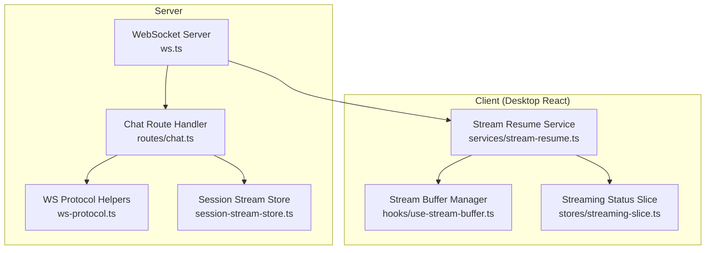
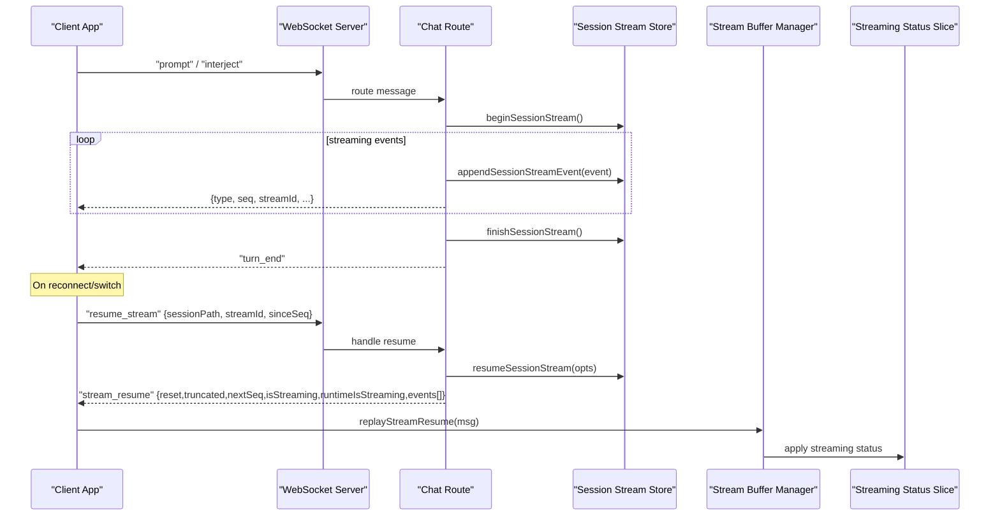
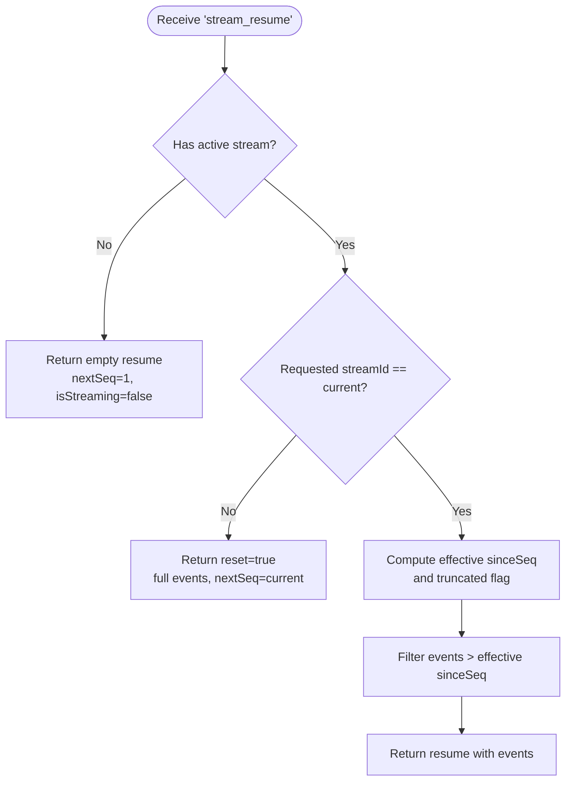
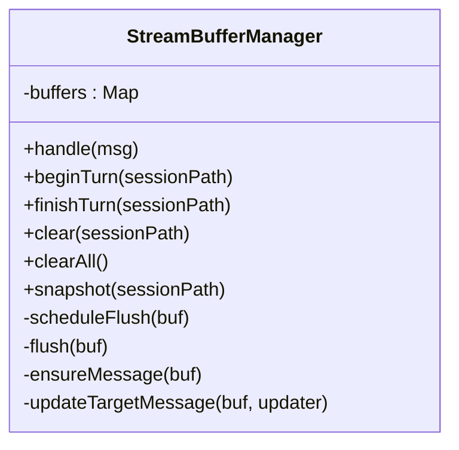
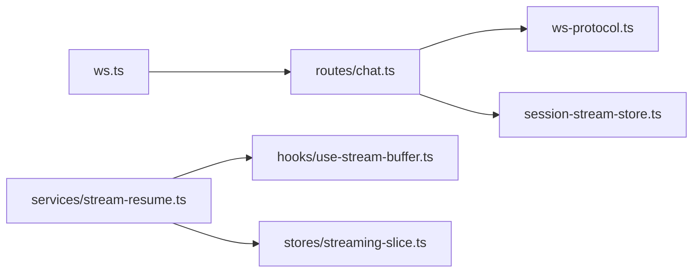

# Message Streaming API

<cite>
**Referenced Files in This Document**
- [ws.ts](file://server/ws.ts)
- [ws-protocol.ts](file://server/ws-protocol.ts)
- [chat.ts](file://server/routes/chat.ts)
- [session-stream-store.ts](file://server/session-stream-store.ts)
- [stream-resume.ts](file://desktop/src/react/services/stream-resume.ts)
- [use-stream-buffer.ts](file://desktop/src/react/hooks/use-stream-buffer.ts)
- [streaming-slice.ts](file://desktop/src/react/stores/streaming-slice.ts)
</cite>

## Table of Contents
1. [Introduction](#introduction)
2. [Project Structure](#project-structure)
3. [Core Components](#core-components)
4. [Architecture Overview](#architecture-overview)
5. [Detailed Component Analysis](#detailed-component-analysis)
6. [Dependency Analysis](#dependency-analysis)
7. [Performance Considerations](#performance-considerations)
8. [Troubleshooting Guide](#troubleshooting-guide)
9. [Conclusion](#conclusion)
10. [Appendices](#appendices)

## Introduction
This document describes the message streaming API used by the application to deliver real-time updates for:
- Text delta streaming
- Thinking process streaming
- Tool execution streaming
- Content block streaming

It covers the streaming protocol, chunked delivery semantics, stream resumption after reconnects or session switches, progress tracking via sequence numbers, and guidance for building robust streaming clients with partial response handling, state management, and error recovery.

## Project Structure
The streaming system spans server-side WebSocket routing and client-side buffering, resume logic, and UI state slices.

**Diagram sources**
- [ws.ts:1-177](file://server/ws.ts#L1-L177)
- [chat.ts:1200-1399](file://server/routes/chat.ts#L1200-L1399)
- [ws-protocol.ts:1-193](file://server/ws-protocol.ts#L1-L193)
- [session-stream-store.ts:1-254](file://server/session-stream-store.ts#L1-L254)
- [stream-resume.ts:1-287](file://desktop/src/react/services/stream-resume.ts#L1-L287)
- [use-stream-buffer.ts:1-601](file://desktop/src/react/hooks/use-stream-buffer.ts#L1-L601)
- [streaming-slice.ts:1-182](file://desktop/src/react/stores/streaming-slice.ts#L1-L182)

**Section sources**
- [ws.ts:1-177](file://server/ws.ts#L1-L177)
- [ws-protocol.ts:1-193](file://server/ws-protocol.ts#L1-L193)
- [chat.ts:1200-1399](file://server/routes/chat.ts#L1200-L1399)
- [session-stream-store.ts:1-254](file://server/session-stream-store.ts#L1-L254)
- [stream-resume.ts:1-287](file://desktop/src/react/services/stream-resume.ts#L1-L287)
- [use-stream-buffer.ts:1-601](file://desktop/src/react/hooks/use-stream-buffer.ts#L1-L601)
- [streaming-slice.ts:1-182](file://desktop/src/react/stores/streaming-slice.ts#L1-L182)

## Core Components
- WebSocket transport and basic chat deltas:
  - Server exposes a simple WebSocket interface that streams text deltas and lifecycle events.
- Advanced streaming protocol:
  - A richer set of event types for thinking, mood, tool calls, content blocks, and turn boundaries.
- Stream resumption:
  - Client requests missed events by streamId and sinceSeq; server replies with a compact replay payload and flags indicating reset/truncation.
- Client-side buffering:
  - Per-session buffer accumulates deltas at high frequency and flushes to the store at bounded FPS.
- Streaming status slice:
  - Tracks active streaming sessions and inline errors with TTL-based auto-clear.

**Section sources**
- [ws.ts:1-177](file://server/ws.ts#L1-L177)
- [ws-protocol.ts:1-193](file://server/ws-protocol.ts#L1-L193)
- [stream-resume.ts:1-287](file://desktop/src/react/services/stream-resume.ts#L1-L287)
- [use-stream-buffer.ts:1-601](file://desktop/src/react/hooks/use-stream-buffer.ts#L1-L601)
- [streaming-slice.ts:1-182](file://desktop/src/react/stores/streaming-slice.ts#L1-L182)

## Architecture Overview
End-to-end flow from client prompt to streamed response and resumption on reconnect/switch.

**Diagram sources**
- [chat.ts:1200-1399](file://server/routes/chat.ts#L1200-L1399)
- [session-stream-store.ts:1-254](file://server/session-stream-store.ts#L1-L254)
- [stream-resume.ts:1-287](file://desktop/src/react/services/stream-resume.ts#L1-L287)
- [use-stream-buffer.ts:1-601](file://desktop/src/react/hooks/use-stream-buffer.ts#L1-L601)
- [streaming-slice.ts:1-182](file://desktop/src/react/stores/streaming-slice.ts#L1-L182)

## Detailed Component Analysis

### Streaming Protocol (Server → Client)
Key event types and their roles:
- Text streaming:
  - text_delta: incremental text fragment
- Thinking process:
  - thinking_start, thinking_delta, thinking_end
- Mood/emotion:
  - mood_start, mood_text, mood_end
- Tool execution:
  - tool_start, tool_end
- Rich content:
  - content_block: file/media_generation/artifact/screenshot/skill/plugin_card/suggestion_card/cron_confirm/settings_confirm/settings_update
- Turn lifecycle:
  - turn_end
- Status and metadata:
  - status: isStreaming, streamId, turnId
  - context_usage: tokens, contextWindow, percent
  - browser_status, bridge_status, activity_update, devlog
- Resumption:
  - stream_resume: sessionPath, streamId, sinceSeq, nextSeq, reset, truncated, isStreaming, runtimeIsStreaming?, events[]

Notes:
- Each event carries top-level fields such as sessionPath, streamId, and seq for ordering and deduplication.
- The server constructs messages using protocol helpers to enforce shape and safety.

**Section sources**
- [ws-protocol.ts:1-193](file://server/ws-protocol.ts#L1-L193)
- [chat.ts:1200-1399](file://server/routes/chat.ts#L1200-L1399)

### Stream Resumption and Rebuild
Client behavior:
- Maintain per-session meta: streamId, lastSeq, consumedSeqs.
- On connect or switch, send resume_stream with sessionPath, streamId, sinceSeq.
- Handle stream_resume:
  - If reset or truncated, rebuild session from persisted messages and replay events.
  - Otherwise, dispatch events directly and update lastSeq.
- Apply streaming status based on isStreaming and runtimeIsStreaming.

Server behavior:
- resumeSessionStream returns:
  - current streamId, effective sinceSeq, nextSeq, isStreaming, reset/truncated flags, and filtered events.
  - If requested streamId differs from current, signals reset and sends full events.
  - If sinceSeq too old, marks truncated and adjusts sinceSeq.

**Diagram sources**
- [session-stream-store.ts:96-142](file://server/session-stream-store.ts#L96-L142)
- [chat.ts:1200-1399](file://server/routes/chat.ts#L1200-L1399)

**Section sources**
- [stream-resume.ts:1-287](file://desktop/src/react/services/stream-resume.ts#L1-L287)
- [session-stream-store.ts:1-254](file://server/session-stream-store.ts#L1-L254)
- [chat.ts:1200-1399](file://server/routes/chat.ts#L1200-L1399)

### Client-Side Streaming Buffer
Responsibilities:
- Accumulate high-frequency deltas (text, thinking, mood) per session without triggering frequent UI updates.
- Flush to Zustand store at bounded FPS (~30fps).
- Manage assistant message creation/rebinding within a turn.
- Insert interlude blocks near task results and drain pending interludes when anchors appear.
- Merge content blocks and replace placeholders with resolved results.

Processing highlights:
- Ensure assistant message exists before writing.
- Group tool_start/tool_end into collapsible tool groups.
- Render markdown for text blocks and strip internal markers.
- Snapshot in-flight buffer for hydration during session rebuild.

**Diagram sources**
- [use-stream-buffer.ts:1-601](file://desktop/src/react/hooks/use-stream-buffer.ts#L1-L601)

**Section sources**
- [use-stream-buffer.ts:1-601](file://desktop/src/react/hooks/use-stream-buffer.ts#L1-L601)

### Streaming Status Slice
Tracks:
- streamingSessions: list of paths currently streaming.
- activeSessionStreams: identity map keyed by path with streamId/turnId to ignore stale late events.
- unreadOutputSessionPaths: background sessions with new output not yet viewed.
- inlineErrors: per-session transient errors with TTL auto-clear.
- modelSwitching: global flag to prevent sending while switching models.

Operations:
- addStreamingSession/removeStreamingSession with identity matching.
- forceRemoveStreamingSession for forced cleanup.
- setInlineError/clearInlineError with timer management.

**Section sources**
- [streaming-slice.ts:1-182](file://desktop/src/react/stores/streaming-slice.ts#L1-L182)

### Legacy Simple WebSocket Chat
A minimal WebSocket chat example demonstrates basic delta streaming and lifecycle events. It can be used as a reference for implementing lightweight clients.

**Section sources**
- [ws.ts:1-177](file://server/ws.ts#L1-L177)

## Dependency Analysis
High-level dependencies between components:

**Diagram sources**
- [ws.ts:1-177](file://server/ws.ts#L1-L177)
- [chat.ts:1200-1399](file://server/routes/chat.ts#L1200-L1399)
- [ws-protocol.ts:1-193](file://server/ws-protocol.ts#L1-L193)
- [session-stream-store.ts:1-254](file://server/session-stream-store.ts#L1-L254)
- [stream-resume.ts:1-287](file://desktop/src/react/services/stream-resume.ts#L1-L287)
- [use-stream-buffer.ts:1-601](file://desktop/src/react/hooks/use-stream-buffer.ts#L1-L601)
- [streaming-slice.ts:1-182](file://desktop/src/react/stores/streaming-slice.ts#L1-L182)

**Section sources**
- [ws.ts:1-177](file://server/ws.ts#L1-L177)
- [chat.ts:1200-1399](file://server/routes/chat.ts#L1200-L1399)
- [ws-protocol.ts:1-193](file://server/ws-protocol.ts#L1-L193)
- [session-stream-store.ts:1-254](file://server/session-stream-store.ts#L1-L254)
- [stream-resume.ts:1-287](file://desktop/src/react/services/stream-resume.ts#L1-L287)
- [use-stream-buffer.ts:1-601](file://desktop/src/react/hooks/use-stream-buffer.ts#L1-L601)
- [streaming-slice.ts:1-182](file://desktop/src/react/stores/streaming-slice.ts#L1-L182)

## Performance Considerations
- Event compression:
  - Large events are compacted or omitted to fit size limits; original byte length is preserved for diagnostics.
- Ring buffer trimming:
  - Events are trimmed by count and total bytes to bound memory usage.
- Client-side throttling:
  - Buffered writes are flushed at ~30fps to balance responsiveness and render cost.
- Deduplication:
  - Consumed sequence sets avoid reprocessing duplicates after reconnects.

[No sources needed since this section provides general guidance]

## Troubleshooting Guide
Common issues and remedies:
- Duplicate events after reconnect:
  - Ensure consumedSeqs is updated and skip events already processed.
- Stale streaming status:
  - Use runtimeIsStreaming to force clear streaming state when server indicates idle.
- Missing assistant message during early deltas:
  - Buffer manager ensures assistant message existence before applying deltas.
- Interlude insertion order:
  - Pending interludes are queued and drained when anchor blocks resolve.
- Error display:
  - Inline errors are stored per session with TTL; ensure timers are canceled on clear.

**Section sources**
- [stream-resume.ts:1-287](file://desktop/src/react/services/stream-resume.ts#L1-L287)
- [use-stream-buffer.ts:1-601](file://desktop/src/react/hooks/use-stream-buffer.ts#L1-L601)
- [streaming-slice.ts:1-182](file://desktop/src/react/stores/streaming-slice.ts#L1-L182)

## Conclusion
The streaming API provides a robust, resumable, and efficient mechanism for delivering rich, multi-modal updates in real time. By combining server-side event sequencing and compression with client-side buffering and resume logic, it supports resilient user experiences across network interruptions and session changes.

[No sources needed since this section summarizes without analyzing specific files]

## Appendices

### Implementing a Streaming Client (Guidelines)
- Connect via WebSocket and subscribe to messages.
- For each incoming event:
  - Update per-session meta (streamId, seq).
  - Dispatch to buffer manager for accumulation and flushing.
  - Apply streaming status updates to UI state.
- On reconnect or session switch:
  - Send resume_stream with last known streamId and sinceSeq.
  - Process stream_resume:
    - If reset/truncated, rebuild session from persisted messages and replay events.
    - Otherwise, replay only missing events.
- Error handling:
  - Display inline errors with TTL.
  - Retry resume on connection loss.

[No sources needed since this section provides general guidance]