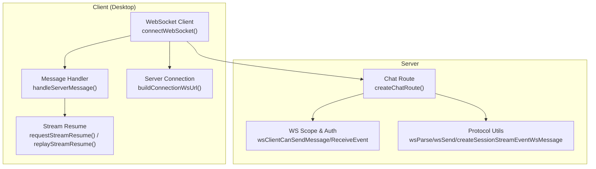
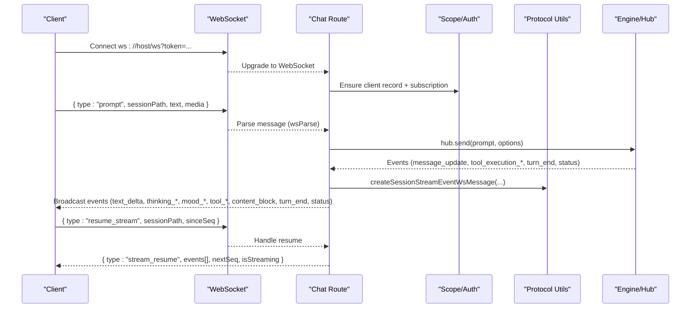
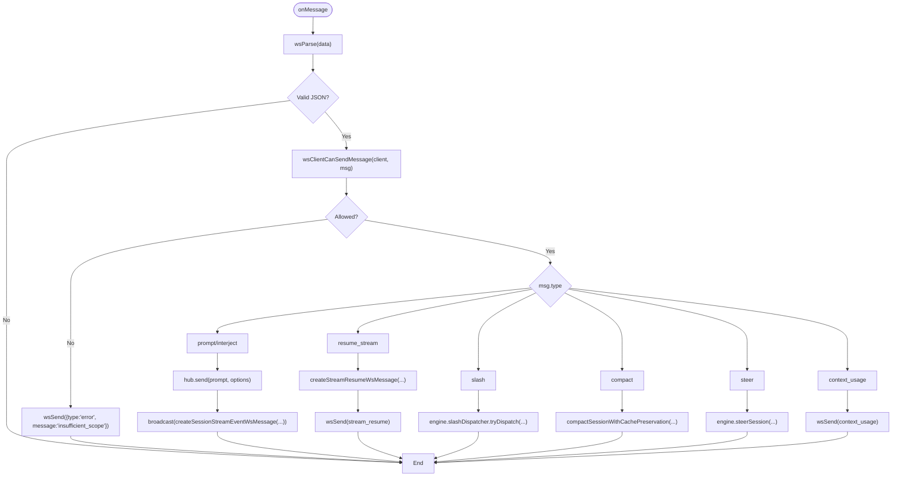
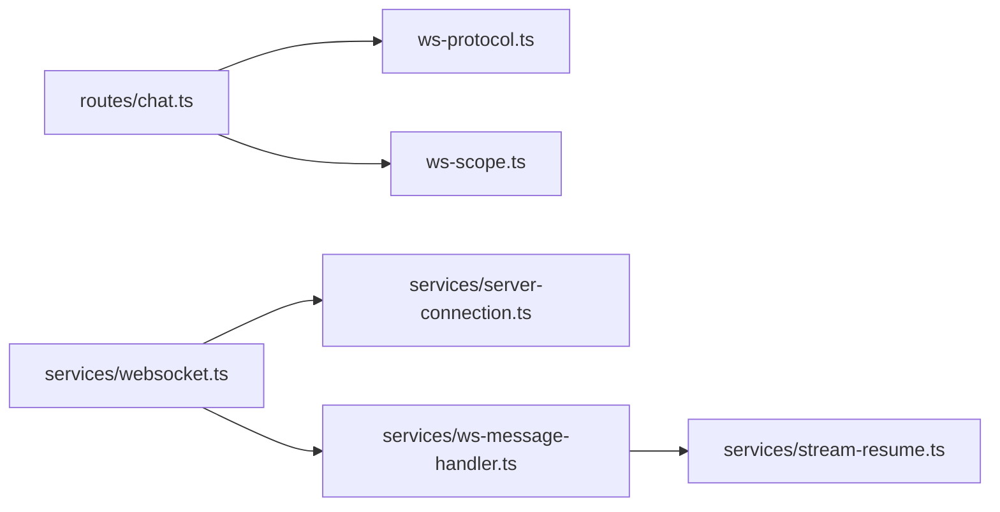

# Real-time Chat API

<cite>
**Referenced Files in This Document**
- [ws.ts](file://server/ws.ts)
- [ws-protocol.ts](file://server/ws-protocol.ts)
- [ws-scope.ts](file://server/ws-scope.ts)
- [chat.ts](file://server/routes/chat.ts)
- [websocket.ts](file://desktop/src/react/services/websocket.ts)
- [ws-message-handler.ts](file://desktop/src/react/services/ws-message-handler.ts)
- [stream-resume.ts](file://desktop/src/react/services/stream-resume.ts)
- [server-connection.ts](file://desktop/src/react/services/server-connection.ts)
</cite>

## Table of Contents
1. Introduction
2. Project Structure
3. Core Components
4. Architecture Overview
5. Detailed Component Analysis
6. Dependency Analysis
7. Performance Considerations
8. Troubleshooting Guide
9. Conclusion
10. Appendices

## Introduction
This document provides comprehensive API documentation for the real-time chat functionality using WebSocket connections. It covers the connection lifecycle, authentication, session-based event routing, message streaming protocol, and client-side implementation patterns. You will find detailed examples for text streaming, tool call events, thinking indicators, mood updates, and card parsing, along with message formats, event types, and error handling strategies.

## Project Structure
The real-time chat system is implemented across server-side routes and protocol utilities, as well as a robust client-side stack for connection management, message dispatching, and stream resumption.

**Diagram sources**
- [websocket.ts:41-125](file://desktop/src/react/services/websocket.ts#L41-L125)
- [ws-message-handler.ts:328-394](file://desktop/src/react/services/ws-message-handler.ts#L328-L394)
- [stream-resume.ts:103-119](file://desktop/src/react/services/stream-resume.ts#L103-L119)
- [server-connection.ts:641-649](file://desktop/src/react/services/server-connection.ts#L641-L649)
- [chat.ts:1141-1502](file://server/routes/chat.ts#L1141-L1502)
- [ws-scope.ts:80-88](file://server/ws-scope.ts#L80-L88)
- [ws-protocol.ts:38-90](file://server/ws-protocol.ts#L38-L90)

**Section sources**
- [websocket.ts:41-125](file://desktop/src/react/services/websocket.ts#L41-L125)
- [ws-message-handler.ts:328-394](file://desktop/src/react/services/ws-message-handler.ts#L328-L394)
- [stream-resume.ts:103-119](file://desktop/src/react/services/stream-resume.ts#L103-L119)
- [server-connection.ts:641-649](file://desktop/src/react/services/server-connection.ts#L641-L649)
- [chat.ts:1141-1502](file://server/routes/chat.ts#L1141-L1502)
- [ws-scope.ts:80-88](file://server/ws-scope.ts#L80-L88)
- [ws-protocol.ts:38-90](file://server/ws-protocol.ts#L38-L90)

## Core Components
- Server WebSocket route: Handles upgrade to WebSocket, enforces scopes, subscribes clients to sessions, processes user messages, and broadcasts streaming events.
- Protocol utilities: Provide safe send/parse helpers and construct standardized stream events and resume responses.
- Security scope: Validates client permissions for sending/receiving events and manages subscriptions per studio/session.
- Client connection manager: Establishes WebSocket connections, handles reconnection, and requests stream resumption after reconnect.
- Message handler: Routes incoming events to UI state updates, including streaming buffers, turn completion, and non-chat events.
- Stream resume: Tracks per-session stream metadata, deduplicates events by sequence, and rebuilds session state when needed.

**Section sources**
- [chat.ts:200-349](file://server/routes/chat.ts#L200-L349)
- [ws-protocol.ts:38-90](file://server/ws-protocol.ts#L38-L90)
- [ws-scope.ts:27-88](file://server/ws-scope.ts#L27-L88)
- [websocket.ts:41-125](file://desktop/src/react/services/websocket.ts#L41-L125)
- [ws-message-handler.ts:328-394](file://desktop/src/react/services/ws-message-handler.ts#L328-L394)
- [stream-resume.ts:103-119](file://desktop/src/react/services/stream-resume.ts#L103-L119)

## Architecture Overview
The architecture follows a publish-subscribe pattern over WebSocket. The server aggregates engine events and broadcasts them to all subscribed clients. Clients subscribe to specific sessions and use sequence numbers to maintain ordering and support resumption.

**Diagram sources**
- [websocket.ts:41-125](file://desktop/src/react/services/websocket.ts#L41-L125)
- [server-connection.ts:641-649](file://desktop/src/react/services/server-connection.ts#L641-L649)
- [chat.ts:1141-1502](file://server/routes/chat.ts#L1141-L1502)
- [ws-protocol.ts:38-90](file://server/ws-protocol.ts#L38-L90)

## Detailed Component Analysis

### Server WebSocket Route (Real-time Chat)
Responsibilities:
- Upgrade HTTP to WebSocket and manage client records.
- Enforce authorization and scope checks for send/receive.
- Subscribe clients to sessions based on request context.
- Process user prompts, interjections, slash commands, compaction, steering, and context usage queries.
- Broadcast streaming events with consistent shape and sequence IDs.
- Manage turn lifecycle, stall timeouts, and deferred result blocks.

Key behaviors:
- Authorization: Only clients with appropriate scopes can send or receive certain events.
- Session scoping: Events include sessionPath; clients must be subscribed to the same studio/session.
- Streaming pipeline: ThinkTag → Mood → Card parsers transform raw deltas into structured events.
- Turn boundaries: turn_start/status transitions, flush pipelines at turn_end, and post-turn notifications.
- Error handling: Returns typed errors and logs via error bus.

**Diagram sources**
- [chat.ts:1157-1474](file://server/routes/chat.ts#L1157-L1474)
- [ws-protocol.ts:38-90](file://server/ws-protocol.ts#L38-L90)
- [ws-scope.ts:80-88](file://server/ws-scope.ts#L80-L88)

**Section sources**
- [chat.ts:200-349](file://server/routes/chat.ts#L200-L349)
- [chat.ts:1141-1502](file://server/routes/chat.ts#L1141-L1502)
- [ws-protocol.ts:38-90](file://server/ws-protocol.ts#L38-L90)
- [ws-scope.ts:80-88](file://server/ws-scope.ts#L80-L88)

### WebSocket Protocol Utilities
Provides:
- Safe send functions for single and serialized payloads.
- Robust parser that accepts Buffer/string/ArrayBuffer.
- Builders for session stream events and stream resume responses with strict validation.

Important fields:
- Outbound session events include top-level sessionPath, streamId, seq, and event payload.
- stream_resume includes sinceSeq, nextSeq, reset, truncated, isStreaming, runtimeIsStreaming, and events array.

**Section sources**
- [ws-protocol.ts:38-122](file://server/ws-protocol.ts#L38-L122)

### Security Scopes and Subscriptions
Client record:
- clientId, principal (normalized), subscriptions (deduplicated).

Authorization rules:
- Local owner connections bypass most checks.
- WRITE_MESSAGE_TYPES require chat.write scope.
- READ_MESSAGE_TYPES require chat.read scope.
- Receiving events requires chat.read and matching studio/session subscriptions.

Subscription model:
- kind: "studio" or "session".
- For session events, both studioId and sessionPath must match client’s subscriptions.

**Section sources**
- [ws-scope.ts:27-88](file://server/ws-scope.ts#L27-L88)
- [ws-scope.ts:90-135](file://server/ws-scope.ts#L90-L135)

### Client Connection Management
Features:
- Builds WebSocket URL with optional token query parameter for local loopback connections.
- Manages connection lifecycle, auto-reconnect with exponential backoff, and manual reconnect.
- On open, requests stream resume for active sessions and refreshes context usage.

Authentication:
- Local connections append token as query param.
- Remote connections may use Bearer tokens in headers for REST; WS uses query token for local.

**Section sources**
- [server-connection.ts:641-649](file://desktop/src/react/services/server-connection.ts#L641-L649)
- [websocket.ts:41-125](file://desktop/src/react/services/websocket.ts#L41-L125)

### Message Handling and Streaming Pipeline
Client-side:
- handleServerMessage routes chat events through a streaming buffer manager for efficient rendering.
- Non-chat events update UI state (notifications, channels, DMs, browser status, etc.).
- turn_end triggers session refresh and context usage requests.

Server-side streaming pipeline:
- ThinkTagParser extracts thinking segments.
- MoodParser emits mood markers and text.
- CardParser parses interactive cards and emits card_start/card_text/card_end.
- Tool execution events emit tool_start/tool_end and unified content_block results.

**Section sources**
- [ws-message-handler.ts:328-394](file://desktop/src/react/services/ws-message-handler.ts#L328-L394)
- [chat.ts:644-740](file://server/routes/chat.ts#L644-L740)
- [chat.ts:995-1106](file://server/routes/chat.ts#L995-L1106)

### Stream Resume and Deduplication
Client-side:
- Maintains per-session stream metadata (streamId, lastSeq, consumedSeqs).
- Requests resume with sinceSeq and streamId; server responds with events and nextSeq.
- Deduplicates events by seq and supports full rebuild if reset/truncated.

Server-side:
- Resumes from in-memory session stream store.
- Provides runtimeIsStreaming to reflect engine state vs cached replay state.

**Section sources**
- [stream-resume.ts:103-119](file://desktop/src/react/services/stream-resume.ts#L103-L119)
- [stream-resume.ts:254-282](file://desktop/src/react/services/stream-resume.ts#L254-L282)
- [chat.ts:1218-1255](file://server/routes/chat.ts#L1218-L1255)
- [ws-protocol.ts:92-122](file://server/ws-protocol.ts#L92-L122)

## Dependency Analysis
High-level dependencies:
- Chat route depends on protocol utils for serialization and scope checks for authorization.
- Client connection manager builds URLs and manages reconnection logic.
- Message handler integrates with stream resume and streaming buffer manager.

**Diagram sources**
- [chat.ts:1141-1502](file://server/routes/chat.ts#L1141-L1502)
- [ws-protocol.ts:38-90](file://server/ws-protocol.ts#L38-L90)
- [ws-scope.ts:80-88](file://server/ws-scope.ts#L80-L88)
- [websocket.ts:41-125](file://desktop/src/react/services/websocket.ts#L41-L125)
- [server-connection.ts:641-649](file://desktop/src/react/services/server-connection.ts#L641-L649)
- [ws-message-handler.ts:328-394](file://desktop/src/react/services/ws-message-handler.ts#L328-L394)
- [stream-resume.ts:103-119](file://desktop/src/react/services/stream-resume.ts#L103-L119)

**Section sources**
- [chat.ts:1141-1502](file://server/routes/chat.ts#L1141-L1502)
- [ws-protocol.ts:38-90](file://server/ws-protocol.ts#L38-L90)
- [ws-scope.ts:80-88](file://server/ws-scope.ts#L80-L88)
- [websocket.ts:41-125](file://desktop/src/react/services/websocket.ts#L41-L125)
- [server-connection.ts:641-649](file://desktop/src/react/services/server-connection.ts#L641-L649)
- [ws-message-handler.ts:328-394](file://desktop/src/react/services/ws-message-handler.ts#L328-L394)
- [stream-resume.ts:103-119](file://desktop/src/react/services/stream-resume.ts#L103-L119)

## Performance Considerations
- Serialized broadcast: The server serializes messages once and reuses payloads for multiple clients to reduce overhead.
- Sequence-based deduplication: Clients track consumed sequences to avoid duplicate processing during resumption.
- Stall watchdog: Long-running turns are aborted if idle beyond configured thresholds to free resources.
- Media limits: Images, videos, audios are validated for count and size before processing.

[No sources needed since this section provides general guidance]

## Troubleshooting Guide
Common issues and resolutions:
- Insufficient scope: Ensure client has required scopes (chat.write/chat.read) for operations.
- Missing sessionPath: Many operations require sessionPath; ensure it is included in messages.
- Stream out-of-sync: Use resume_stream with correct sinceSeq and streamId; server will respond with stream_resume.
- Empty response: If no output, tool calls, thinking, or error occurred, an error message is broadcast indicating model did not respond.
- Token/auth failures: For local connections, verify token query parameter; for remote, ensure proper credentials and trust state.

**Section sources**
- [chat.ts:1157-1200](file://server/routes/chat.ts#L1157-L1200)
- [chat.ts:1342-1463](file://server/routes/chat.ts#L1342-L1463)
- [chat.ts:1049-1055](file://server/routes/chat.ts#L1049-L1055)
- [ws-scope.ts:80-88](file://server/ws-scope.ts#L80-L88)

## Conclusion
The real-time chat API leverages a robust WebSocket protocol with strong security scoping, session-based event routing, and resilient stream resumption. Clients benefit from efficient streaming, clear event semantics, and reliable recovery mechanisms. By adhering to the documented message formats and implementing the recommended client patterns, integrators can deliver responsive and feature-rich chat experiences.

[No sources needed since this section summarizes without analyzing specific files]

## Appendices

### WebSocket Message Formats

Client-to-Server:
- prompt: { type: "prompt", sessionPath, text?, images?, videos?, audios?, skills?, uiContext? }
- interject: { type: "interject", sessionPath, text?, images?, videos?, audios?, uiContext?, displayMessage?, sessionFileRefs? }
- steer: { type: "steer", sessionPath, text }
- slash: { type: "slash", sessionPath, text }
- compact: { type: "compact", sessionPath }
- abort: { type: "abort", sessionPath, reason? }
- resume_stream: { type: "resume_stream", sessionPath, streamId?, sinceSeq }
- context_usage: { type: "context_usage", sessionPath }

Server-to-Client (selected):
- text_delta: { type: "text_delta", delta, sessionPath, streamId, seq }
- thinking_start/delta/end: { type: "thinking_start" | "thinking_delta" | "thinking_end", ... }
- mood_start/text/end: { type: "mood_start" | "mood_text" | "mood_end", ... }
- tool_start/end: { type: "tool_start" | "tool_end", id?, name, args?, success?, details? }
- content_block: { type: "content_block", block }
- turn_end: { type: "turn_end", sessionPath, streamId, seq }
- status: { type: "status", isStreaming, sessionPath, streamId, aborted?, reason? }
- stream_resume: { type: "stream_resume", sessionPath, streamId, sinceSeq, nextSeq, reset, truncated, isStreaming, runtimeIsStreaming?, events[] }
- error: { type: "error", message, sessionPath }

Notes:
- All streaming events include top-level sessionPath, streamId, and seq for ordering and resumption.
- tool_start arguments are summarized to exclude large file contents.

**Section sources**
- [ws-protocol.ts:1-36](file://server/ws-protocol.ts#L1-L36)
- [ws-protocol.ts:72-122](file://server/ws-protocol.ts#L72-L122)
- [chat.ts:644-740](file://server/routes/chat.ts#L644-L740)
- [chat.ts:995-1106](file://server/routes/chat.ts#L995-L1106)

### Client-Side Implementation Patterns
- Establish connection with buildConnectionWsUrl and connectWebSocket.
- On open, request stream resume for each active session path.
- Implement handlers for REACT_CHAT_EVENTS via stream buffer manager.
- Update UI state for non-chat events (notifications, channels, DMs, browser status).
- Handle turn_end to refresh sessions and request context usage.

**Section sources**
- [websocket.ts:41-125](file://desktop/src/react/services/websocket.ts#L41-L125)
- [ws-message-handler.ts:328-394](file://desktop/src/react/services/ws-message-handler.ts#L328-L394)
- [stream-resume.ts:103-119](file://desktop/src/react/services/stream-resume.ts#L103-L119)