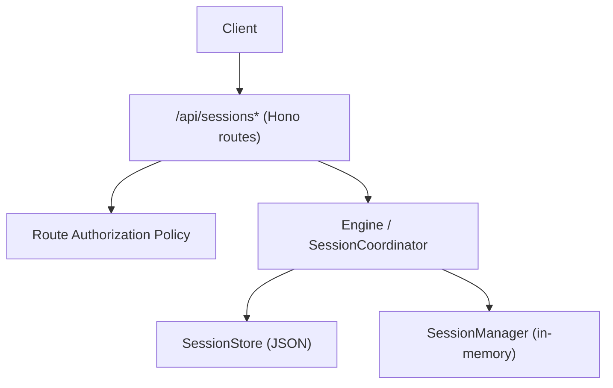
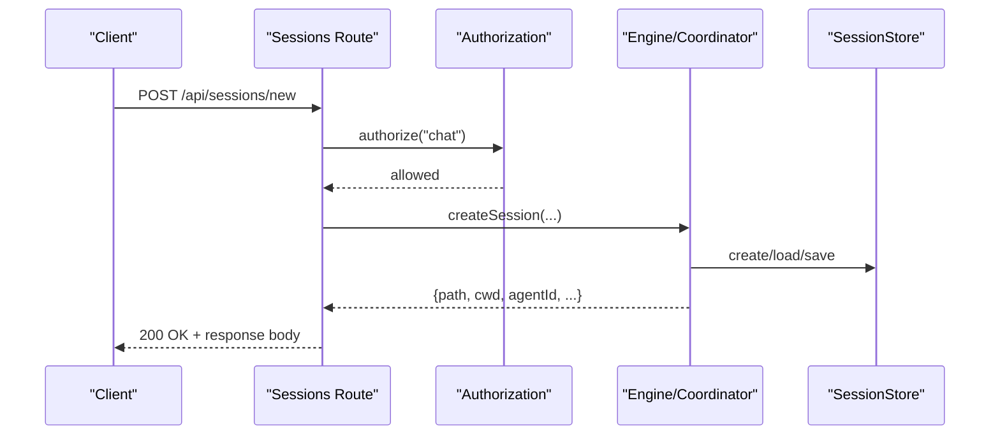
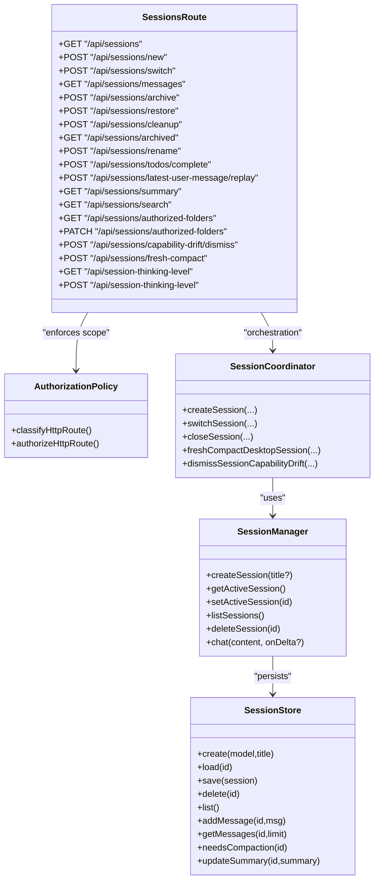
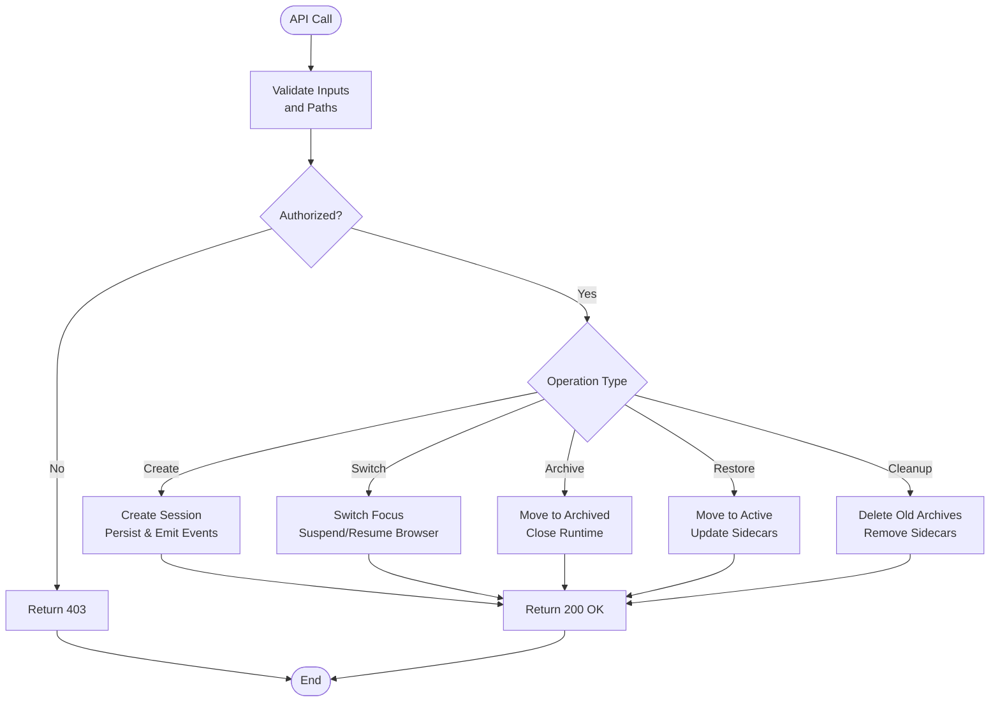

# Session Management API

<cite>
**Referenced Files in This Document**
- [sessions.ts](file://server/routes/sessions.ts)
- [route-security.ts](file://server/http/route-security.ts)
- [request-principal.ts](file://server/http/request-principal.ts)
- [session-coordinator.ts](file://core/session-coordinator.ts)
- [session-manager.ts](file://core/session-manager.ts)
- [session-store.ts](file://core/session-store.ts)
</cite>

## Table of Contents
1. [Introduction](#introduction)
2. [Project Structure](#project-structure)
3. [Core Components](#core-components)
4. [Architecture Overview](#architecture-overview)
5. [Detailed Component Analysis](#detailed-component-analysis)
6. [Dependency Analysis](#dependency-analysis)
7. [Performance Considerations](#performance-considerations)
8. [Troubleshooting Guide](#troubleshooting-guide)
9. [Conclusion](#conclusion)
10. [Appendices](#appendices)

## Introduction
This document provides comprehensive API documentation for session lifecycle management, including creation, configuration, status monitoring, and cleanup. It covers REST endpoints for session CRUD operations, session state queries, and session-specific settings. It also includes request/response schemas, authentication requirements, error handling patterns, and examples for creating new sessions, managing properties, and handling lifecycle events.

## Project Structure
The session management API is implemented as a Hono-based HTTP route module that delegates to core session orchestration logic. The key files are:
- server/routes/sessions.ts: REST endpoints for sessions
- server/http/route-security.ts: Route-level authorization policy
- server/http/request-principal.ts: Request principal resolution and fallbacks
- core/session-coordinator.ts: Session lifecycle orchestration (creation, switching, compaction, capability snapshots)
- core/session-manager.ts: In-memory session manager abstraction used by routes
- core/session-store.ts: Simple JSON-backed session store used by the in-memory manager

**Diagram sources**
- [sessions.ts:236-270](file://server/routes/sessions.ts#L236-L270)
- [route-security.ts:147-149](file://server/http/route-security.ts#L147-L149)
- [session-coordinator.ts:572-632](file://core/session-coordinator.ts#L572-L632)
- [session-manager.ts:9-25](file://core/session-manager.ts#L9-L25)
- [session-store.ts:38-59](file://core/session-store.ts#L38-L59)

**Section sources**
- [sessions.ts:236-270](file://server/routes/sessions.ts#L236-L270)
- [route-security.ts:147-149](file://server/http/route-security.ts#L147-L149)
- [request-principal.ts:44-106](file://server/http/request-principal.ts#L44-L106)
- [session-coordinator.ts:572-632](file://core/session-coordinator.ts#L572-L632)
- [session-manager.ts:9-25](file://core/session-manager.ts#L9-L25)
- [session-store.ts:38-59](file://core/session-store.ts#L38-L59)

## Core Components
- Sessions Route Module: Defines all session-related REST endpoints, performs input validation, authorization checks, and orchestrates engine calls.
- Authorization Policy: Classifies routes into public, authenticated, local-only, or scoped; session routes require chat scope.
- Principal Resolver: Resolves bearer/query token/web cookie and falls back to plugin surface session credentials when appropriate.
- Session Coordinator: Orchestrates session creation, restoration, thinking level, permission mode, workspace mounts, tool snapshots, and compaction.
- Session Manager (in-memory): Provides simple create/list/delete/chat helpers backed by a JSON store.
- Session Store (JSON): File-backed persistence for sessions with basic message management and compaction thresholds.

**Section sources**
- [sessions.ts:236-270](file://server/routes/sessions.ts#L236-L270)
- [route-security.ts:147-149](file://server/http/route-security.ts#L147-L149)
- [request-principal.ts:44-106](file://server/http/request-principal.ts#L44-L106)
- [session-coordinator.ts:734-800](file://core/session-coordinator.ts#L734-L800)
- [session-manager.ts:21-40](file://core/session-manager.ts#L21-L40)
- [session-store.ts:48-78](file://core/session-store.ts#L48-L78)

## Architecture Overview
The session API follows a layered architecture:
- HTTP Layer: Hono routes handle requests, parse bodies, validate inputs, enforce authorization, and return JSON responses.
- Authorization Layer: Global principal resolver and route classifier ensure only authorized clients can access session endpoints.
- Orchestration Layer: SessionCoordinator manages complex lifecycle tasks like model selection, prompt/tool snapshotting, workspace mounts, and compaction.
- Persistence Layer: SessionStore persists sessions to JSON files; SessionManager maintains in-memory state and integrates with memory and compaction utilities.

**Diagram sources**
- [sessions.ts:1138-1242](file://server/routes/sessions.ts#L1138-L1242)
- [route-security.ts:147-149](file://server/http/route-security.ts#L147-L149)
- [session-coordinator.ts:734-800](file://core/session-coordinator.ts#L734-L800)
- [session-store.ts:48-78](file://core/session-store.ts#L48-L78)

## Detailed Component Analysis

### Authentication and Authorization
- All session routes require the "chat" scope. Requests must include a valid bearer token, query token, or web session cookie. If no primary credential is present, a plugin surface session token may be used as a fallback.
- Unauthorized or insufficient-scope requests receive 403 responses with structured error fields.

Request headers and parameters:
- Authorization: Bearer <token>
- Cookie: Web session cookie
- Query: token=<token> (allowed for compatibility)

Response on failure:
- 403 Forbidden with fields such as error, reason, requiredScope, connectionKind.

**Section sources**
- [route-security.ts:147-149](file://server/http/route-security.ts#L147-L149)
- [request-principal.ts:44-106](file://server/http/request-principal.ts#L44-L106)

### Endpoints Reference

#### List Sessions
- Method: GET
- Path: /api/sessions
- Scope: chat
- Description: Lists all agent sessions with metadata and optional RC attachment info.
- Response fields: path, title, firstMessage, modified, revision, messageCount, cwd, agentId, agentName, projectId, modelId, modelProvider, workspaceMountId, workspaceLabel, permissionMode, pinnedAt, agentDeleted, readOnlyReason, continuationAvailable, deletedAt, hasSummary, rcAttachment.

Example response shape:
{
  "path": "...",
  "title": "...",
  "firstMessage": "...",
  "modified": "ISO timestamp",
  "revision": "string|null",
  "messageCount": 0,
  "cwd": "string|null",
  "agentId": "string|null",
  "agentName": "string|null",
  "projectId": "string|null",
  "modelId": "string|null",
  "modelProvider": "string|null",
  "workspaceMountId": "string|null",
  "workspaceLabel": "string|null",
  "permissionMode": "string",
  "pinnedAt": "ISO timestamp|null",
  "agentDeleted": false,
  "readOnlyReason": "string|null",
  "continuationAvailable": false,
  "deletedAt": "ISO timestamp|null",
  "hasSummary": false,
  "rcAttachment": null
}

**Section sources**
- [sessions.ts:508-574](file://server/routes/sessions.ts#L508-L574)

#### Search Sessions
- Method: GET
- Path: /api/sessions/search?q=...&phase=title|content&limit=N
- Scope: chat
- Description: Searches sessions by title or content with optional limit. Returns matchKind, snippet, score.
- Error: 400 if query exceeds max length; 503 if tokenizer unavailable.

**Section sources**
- [sessions.ts:576-637](file://server/routes/sessions.ts#L576-L637)

#### Get Session Summary
- Method: GET
- Path: /api/sessions/summary?path=...
- Scope: chat
- Description: Retrieves rolling summary for a specific session.
- Response fields: hasSummary, summary, createdAt, updatedAt.

**Section sources**
- [sessions.ts:640-662](file://server/routes/sessions.ts#L640-L662)

#### Pin/Unpin Session
- Method: POST
- Path: /api/sessions/pin
- Body: { path: string, pinned: boolean }
- Scope: write
- Description: Pins or unpins a session.
- Response: { ok: true, pinnedAt: ISO timestamp }

**Section sources**
- [sessions.ts:665-693](file://server/routes/sessions.ts#L665-L693)

#### Authorized Folders
- GET /api/sessions/authorized-folders?path=...
  - Scope: read
  - Response: { ok, sessionPath, cwd, workspaceFolders[], authorizedFolders[], sandboxFolders[] }
- PATCH /api/sessions/authorized-folders
  - Body: { action: "add"|"remove"|"set", folder?: string, folders?: string[] }
  - Scope: write
  - Response: same structure as GET

Validation errors return 400 with descriptive messages.

**Section sources**
- [sessions.ts:695-773](file://server/routes/sessions.ts#L695-L773)

#### List Messages
- Method: GET
- Path: /api/sessions/messages?path=...&before=N&limit=N&all=1
- Scope: read
- Description: Paginated retrieval of displayable messages and blocks for a session. Supports force-all mode for streaming recovery.
- Response fields: messages[], blocks[], todos[], hasMore, sessionFiles[], revision.

Notes:
- before and limit control pagination.
- all=1 returns full history without page bounds.
- Blocks include subagent/workflow inline cards with streamStatus and summaries resolved from durable stores.

**Section sources**
- [sessions.ts:776-1040](file://server/routes/sessions.ts#L776-L1040)

#### Replay Latest User Message
- Method: POST
- Path: /api/sessions/latest-user-message/replay
- Body: { path, sourceEntryId?, clientMessageId?, text?, displayMessage?, uiContext? }
- Scope: write
- Description: Replays the latest user turn in an active session with optional replacement text and UI context.
- Errors: 409 if session is streaming; 400 for missing params; 404 if session not found.

**Section sources**
- [sessions.ts:1042-1082](file://server/routes/sessions.ts#L1042-L1082)

#### Complete Todos
- Method: POST
- Path: /api/sessions/todos/complete
- Body: { path }
- Scope: write
- Description: Marks current todo list as completed and clears UI. Emits event to clear todos.
- Errors: 409 if session is streaming; 404 if session not found.

**Section sources**
- [sessions.ts:1084-1135](file://server/routes/sessions.ts#L1084-L1135)

#### Create New Session
- Method: POST
- Path: /api/sessions/new
- Body: { memoryEnabled?: boolean, agentId?: string, currentSessionPath?: string, thinkingLevel?: string, workspaceMountId?: string, workspaceLabel?: string, cwd?: string, workspaceFolders?: string[], projectId?: string }
- Scope: write
- Description: Creates a new session optionally under a different agent, with workspace mount/cwd, thinking level, and project assignment.
- Response fields: ok, path, cwd, workspaceFolders[], authorizedFolders[], agentId, agentName, projectId, planMode, permissionMode, accessMode, thinkingLevel, memoryModelUnavailableReason, workspaceMountId, workspaceLabel.
- Errors: 409 if no available model; 500 otherwise.

**Section sources**
- [sessions.ts:1138-1242](file://server/routes/sessions.ts#L1138-L1242)

#### Create Detached Session
- Method: POST
- Path: /api/sessions/new-detached
- Body: { memoryEnabled?: boolean, agentId?: string, permissionMode?: string, thinkingLevel?: string, workspaceMountId?: string, workspaceLabel?: string, cwd?: string, workspaceFolders?: string[] }
- Scope: write
- Description: Creates a detached session not bound to the current focus.
- Response fields: ok, path, cwd, workspaceFolders[], authorizedFolders[], agentId, agentName, currentSessionPath, planMode, permissionMode, accessMode, thinkingLevel, memoryModelUnavailableReason, workspaceMountId, workspaceLabel.

**Section sources**
- [sessions.ts:1244-1324](file://server/routes/sessions.ts#L1244-L1324)

#### Continue Deleted Agent Session
- Method: POST
- Path: /api/sessions/continue-deleted-agent
- Body: { path }
- Scope: write
- Description: Continues a session whose owning agent was deleted by migrating to a new agent.
- Response fields: ok, path, cwd, workspaceFolders[], authorizedFolders[], agentId, agentName, projectId, planMode, permissionMode, accessMode, thinkingLevel, memoryModelUnavailableReason, compacted.

**Section sources**
- [sessions.ts:1326-1377](file://server/routes/sessions.ts#L1326-L1377)

#### Switch Session
- Method: POST
- Path: /api/sessions/switch
- Body: { path, currentSessionPath? }
- Scope: write
- Description: Switches focus to another session, suspending/resuming browser state as needed.
- Response fields: ok, messageCount, memoryEnabled, planMode, permissionMode, accessMode, thinkingLevel, memoryModelUnavailableReason, cwd, workspaceFolders[], authorizedFolders[], workspaceMountId, workspaceLabel, agentId, agentName, browserRunning, browserUrl, isStreaming, currentModelId, currentModelProvider, currentModelName, currentModelInput, currentModelVideo, currentModelVideoTransport, currentModelVideoTransportSupported, currentModelAudio, currentModelAudioTransport, currentModelAudioTransportSupported, currentModelReasoning, currentModelXhigh, currentModelThinkingLevels, currentModelDefaultThinkingLevel, currentModelContextWindow, capabilityDrift.

**Section sources**
- [sessions.ts:1379-1464](file://server/routes/sessions.ts#L1379-L1464)

#### Dismiss Capability Drift Notice
- Method: POST
- Path: /api/sessions/capability-drift/dismiss
- Body: { path, fingerprint }
- Scope: write
- Description: Dismisses the current tool capability drift notice for a session until fingerprint changes.

**Section sources**
- [sessions.ts:1467-1485](file://server/routes/sessions.ts#L1467-L1485)

#### Fresh Compact Session
- Method: POST
- Path: /api/sessions/fresh-compact
- Body: { path }
- Scope: write
- Description: Compacts old conversation and rebuilds prompt/tool snapshots based on current agent configuration.
- Response fields: ok plus result details and capabilityDrift.

**Section sources**
- [sessions.ts:1487-1511](file://server/routes/sessions.ts#L1487-L1511)

#### Browser Session Utilities
- GET /api/browser/sessions
  - Returns list of sessions with active browsers.
- GET /api/browser/session-states
  - Returns states: running, recoverable, unavailable.
- POST /api/browser/close-session
  - Body: { sessionPath }
  - Closes browser for a session and emits status event.

**Section sources**
- [sessions.ts:1514-1534](file://server/routes/sessions.ts#L1514-L1534)

#### Rename Session
- Method: POST
- Path: /api/sessions/rename
- Body: { path, title }
- Scope: write
- Description: Updates session title.

**Section sources**
- [sessions.ts:1537-1558](file://server/routes/sessions.ts#L1537-L1558)

#### Cleanup Archived Sessions
- Method: POST
- Path: /api/sessions/cleanup
- Body: { maxAgeDays?: number }
- Scope: write
- Description: Deletes archived sessions older than cutoff, cleans sidecars and titles.

**Section sources**
- [sessions.ts:1561-1597](file://server/routes/sessions.ts#L1561-L1597)

#### List Archived Sessions
- Method: GET
- Path: /api/sessions/archived
- Scope: read
- Description: Lists archived sessions across agents.

**Section sources**
- [sessions.ts:1600-1607](file://server/routes/sessions.ts#L1600-L1607)

#### Archive Session
- Method: POST
- Path: /api/sessions/archive
- Body: { path }
- Scope: write
- Description: Moves active session to archived directory, closes runtime, updates timestamps.

**Section sources**
- [sessions.ts:1610-1659](file://server/routes/sessions.ts#L1610-L1659)

#### Restore Archived Session
- Method: POST
- Path: /api/sessions/restore
- Body: { path }
- Scope: write
- Description: Moves archived session back to active directory.

**Section sources**
- [sessions.ts:1662-1701](file://server/routes/sessions.ts#L1662-L1701)

#### Delete Archived Session
- Method: POST
- Path: /api/sessions/archived/delete
- Body: { path }
- Scope: write
- Description: Permanently deletes an archived session and its sidecars.

**Section sources**
- [sessions.ts:1704-1735](file://server/routes/sessions.ts#L1704-L1735)

#### Thinking Level Settings
- GET /api/session-thinking-level
  - Returns available levels and current level.
- POST /api/session-thinking-level
  - Body: { sessionPath?, thinkingLevel }
  - Sets global or per-session thinking level.

**Section sources**
- [sessions.ts:1738-1765](file://server/routes/sessions.ts#L1738-L1765)

### Request/Response Schemas

Common error envelope:
{
  "error": "string",
  "reason": "string|null",
  "code": "string|null",
  "requiredScope": "string|null",
  "credentialSource": "string|null",
  "connectionKind": "string|null"
}

Success envelopes vary by endpoint; typical fields include ok, path, cwd, agentId, agentName, permissionMode, accessMode, planMode, thinkingLevel, workspaceMountId, workspaceLabel, and endpoint-specific fields.

**Section sources**
- [sessions.ts:147-170](file://server/routes/sessions.ts#L147-L170)
- [sessions.ts:1138-1242](file://server/routes/sessions.ts#L1138-L1242)
- [sessions.ts:1379-1464](file://server/routes/sessions.ts#L1379-L1464)

### Examples

Create a new session:
- Request:
  POST /api/sessions/new
  {
    "memoryEnabled": true,
    "agentId": "rem-default",
    "thinkingLevel": "balanced",
    "workspaceMountId": "studio-123",
    "workspaceLabel": "My Workspace",
    "cwd": "/home/user/project",
    "workspaceFolders": ["/home/user/project/src"],
    "projectId": "proj-abc"
  }
- Response:
  {
    "ok": true,
    "path": "/agents/rem-default/sessions/2026-07-01T12-00-00.jsonl",
    "cwd": "/home/user/project",
    "workspaceFolders": ["/home/user/project/src"],
    "authorizedFolders": [],
    "agentId": "rem-default",
    "agentName": "Rem Default",
    "projectId": "proj-abc",
    "planMode": false,
    "permissionMode": "operate",
    "accessMode": "operate",
    "thinkingLevel": "balanced",
    "memoryModelUnavailableReason": null,
    "workspaceMountId": "studio-123",
    "workspaceLabel": "My Workspace"
  }

Switch session:
- Request:
  POST /api/sessions/switch
  {
    "path": "/agents/rem-default/sessions/2026-07-01T12-00-00.jsonl",
    "currentSessionPath": "/agents/rem-default/sessions/2026-07-01T11-00-00.jsonl"
  }
- Response:
  {
    "ok": true,
    "messageCount": 42,
    "memoryEnabled": true,
    "planMode": false,
    "permissionMode": "operate",
    "accessMode": "operate",
    "thinkingLevel": "balanced",
    "memoryModelUnavailableReason": null,
    "cwd": "/home/user/project",
    "workspaceFolders": ["/home/user/project/src"],
    "authorizedFolders": [],
    "workspaceMountId": "studio-123",
    "workspaceLabel": "My Workspace",
    "agentId": "rem-default",
    "agentName": "Rem Default",
    "browserRunning": false,
    "browserUrl": null,
    "isStreaming": false,
    "currentModelId": "gpt-4o",
    "currentModelProvider": "openai",
    "currentModelName": "GPT-4o",
    "currentModelInput": ["text","image"],
    "currentModelVideo": false,
    "currentModelVideoTransport": null,
    "currentModelVideoTransportSupported": false,
    "currentModelAudio": true,
    "currentModelAudioTransport": "direct",
    "currentModelAudioTransportSupported": true,
    "currentModelReasoning": true,
    "currentModelXhigh": true,
    "currentModelThinkingLevels": ["off","low","balanced","high","xhigh"],
    "currentModelDefaultThinkingLevel": "balanced",
    "currentModelContextWindow": 128000,
    "capabilityDrift": null
  }

List messages with pagination:
- Request:
  GET /api/sessions/messages?path=/agents/rem-default/sessions/2026-07-01T12-00-00.jsonl&before=100&limit=50
- Response:
  {
    "messages": [...],
    "blocks": [...],
    "todos": [],
    "hasMore": true,
    "sessionFiles": [],
    "revision": "stat-signature"
  }

Archive a session:
- Request:
  POST /api/sessions/archive
  {
    "path": "/agents/rem-default/sessions/2026-07-01T12-00-00.jsonl"
  }
- Response:
  { "ok": true }

Restore an archived session:
- Request:
  POST /api/sessions/restore
  {
    "path": "/agents/rem-default/sessions/archived/2026-07-01T12-00-00.jsonl"
  }
- Response:
  { "ok": true, "restoredPath": "/agents/rem-default/sessions/2026-07-01T12-00-00.jsonl" }

**Section sources**
- [sessions.ts:1138-1242](file://server/routes/sessions.ts#L1138-L1242)
- [sessions.ts:1379-1464](file://server/routes/sessions.ts#L1379-L1464)
- [sessions.ts:776-1040](file://server/routes/sessions.ts#L776-L1040)
- [sessions.ts:1610-1659](file://server/routes/sessions.ts#L1610-L1659)
- [sessions.ts:1662-1701](file://server/routes/sessions.ts#L1662-L1701)

## Dependency Analysis
- Sessions route depends on:
  - Authorization policy for scope enforcement ("chat").
  - Engine methods for session lifecycle (create, switch, close, archive, restore).
  - BrowserManager for session-bound browser state.
  - Deferred results and subagent run registries for block status reconciliation.
  - Session file registry for sidecar artifacts.
- SessionCoordinator depends on:
  - Model registry and provider capabilities.
  - Tool availability and snapshot computation.
  - Prompt snapshotting and skills snapshotting.
  - Memory reflection and compaction utilities.
  - Permission mode normalization and workspace scope formatting.

**Diagram sources**
- [sessions.ts:236-270](file://server/routes/sessions.ts#L236-L270)
- [route-security.ts:147-149](file://server/http/route-security.ts#L147-L149)
- [session-coordinator.ts:734-800](file://core/session-coordinator.ts#L734-L800)
- [session-manager.ts:21-40](file://core/session-manager.ts#L21-L40)
- [session-store.ts:48-78](file://core/session-store.ts#L48-L78)

**Section sources**
- [sessions.ts:236-270](file://server/routes/sessions.ts#L236-L270)
- [route-security.ts:147-149](file://server/http/route-security.ts#L147-L149)
- [session-coordinator.ts:734-800](file://core/session-coordinator.ts#L734-L800)
- [session-manager.ts:21-40](file://core/session-manager.ts#L21-L40)
- [session-store.ts:48-78](file://core/session-store.ts#L48-L78)

## Performance Considerations
- Message listing uses pagination and selective hydration to avoid parsing large histories unnecessarily.
- Revision signatures enable efficient diffing between cached and server-side session content.
- Subagent and workflow block statuses are reconciled from durable registries to minimize inconsistent UI states.
- Compaction reduces message volume and preserves cache prefixes to maintain LLM cache efficiency.

[No sources needed since this section provides general guidance]

## Troubleshooting Guide
Common errors and resolutions:
- 403 Forbidden: Missing or invalid credentials, insufficient scope, or studio mismatch. Ensure proper Authorization header or query token.
- 400 Bad Request: Missing required fields (e.g., path), invalid session path, or ambiguous workspace selection (both cwd and workspaceMountId provided).
- 404 Not Found: Session file does not exist or is not accessible.
- 409 Conflict: No available model during session creation; session busy (streaming); archived path already exists; active path already exists during restore.
- 500 Internal Server Error: Unexpected failures; check logs for stack traces.

Operational tips:
- Use /api/sessions/messages with revision to detect out-of-band writes and trigger incremental sync.
- For long-running background tasks, monitor deferred results and subagent runs via message blocks and their streamStatus.
- When encountering capability drift notices, use dismiss or fresh-compact to refresh tool snapshots.

**Section sources**
- [sessions.ts:147-170](file://server/routes/sessions.ts#L147-L170)
- [sessions.ts:1042-1082](file://server/routes/sessions.ts#L1042-L1082)
- [sessions.ts:1610-1659](file://server/routes/sessions.ts#L1610-L1659)
- [sessions.ts:1662-1701](file://server/routes/sessions.ts#L1662-L1701)

## Conclusion
The Session Management API provides a robust set of endpoints for creating, configuring, querying, and cleaning up sessions. It enforces strict authorization, supports advanced features like thinking levels, permission modes, workspace mounts, and capability drift management, and integrates with browser and deferred task subsystems for rich session experiences.

[No sources needed since this section summarizes without analyzing specific files]

## Appendices

### Lifecycle Flowchart

**Diagram sources**
- [sessions.ts:1138-1242](file://server/routes/sessions.ts#L1138-L1242)
- [sessions.ts:1379-1464](file://server/routes/sessions.ts#L1379-L1464)
- [sessions.ts:1610-1659](file://server/routes/sessions.ts#L1610-L1659)
- [sessions.ts:1662-1701](file://server/routes/sessions.ts#L1662-L1701)
- [sessions.ts:1561-1597](file://server/routes/sessions.ts#L1561-L1597)