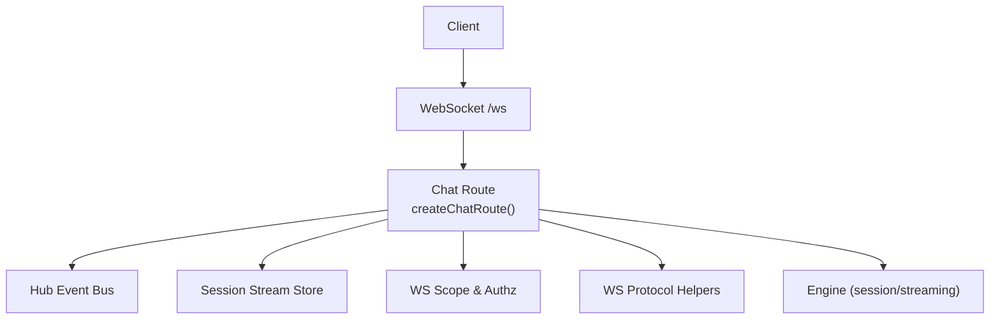
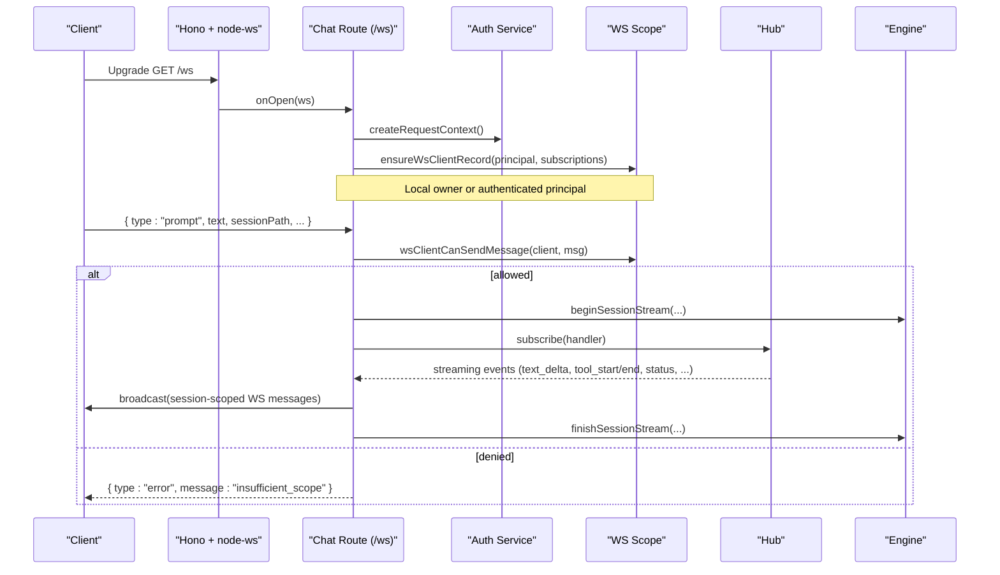
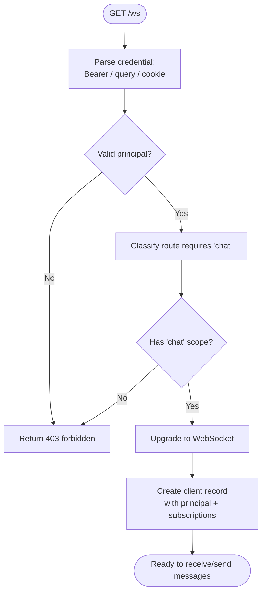
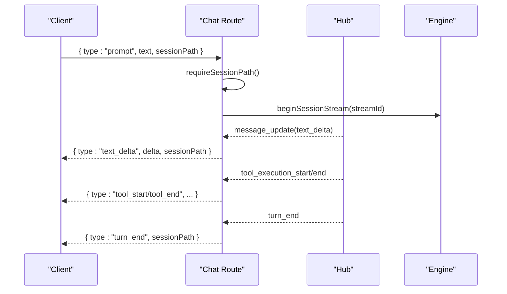
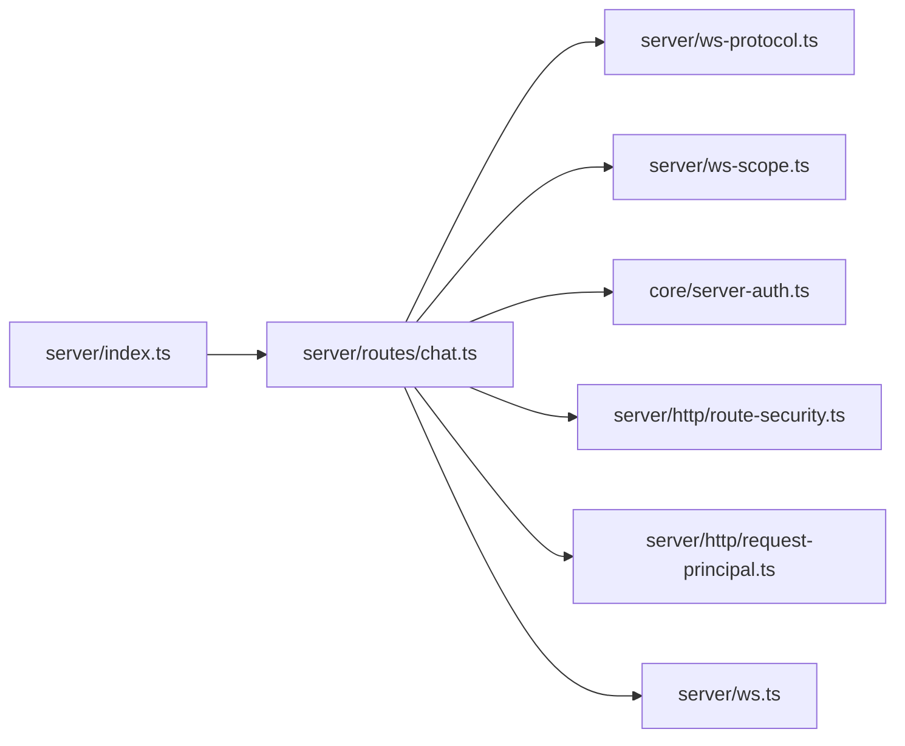

# Real-time Streaming API

<cite>
**Referenced Files in This Document**
- [server/index.ts](file://server/index.ts)
- [server/routes/chat.ts](file://server/routes/chat.ts)
- [server/ws-protocol.ts](file://server/ws-protocol.ts)
- [server/ws-scope.ts](file://server/ws-scope.ts)
- [core/server-auth.ts](file://core/server-auth.ts)
- [server/http/route-security.ts](file://server/http/route-security.ts)
- [server/http/request-principal.ts](file://server/http/request-principal.ts)
- [server/ws.ts](file://server/ws.ts)
</cite>

## Table of Contents
1. [Introduction](#introduction)
2. [Project Structure](#project-structure)
3. [Core Components](#core-components)
4. [Architecture Overview](#architecture-overview)
5. [Detailed Component Analysis](#detailed-component-analysis)
6. [Dependency Analysis](#dependency-analysis)
7. [Performance Considerations](#performance-considerations)
8. [Troubleshooting Guide](#troubleshooting-guide)
9. [Conclusion](#conclusion)
10. [Appendices](#appendices)

## Introduction
This document provides detailed API documentation for the WebSocket-based real-time communication endpoints used by the server to stream chat, progress updates, and notifications. It covers connection establishment, authentication and authorization, message protocols, event types, streaming data formats, error handling strategies, and practical examples such as chat streaming, progress updates, and real-time notifications.

## Project Structure
The WebSocket implementation is integrated into the HTTP server using Hono with @hono/node-ws. The chat route exposes both REST and WebSocket endpoints. Authentication and authorization are enforced via a principal-based system that supports bearer tokens, query tokens (local only), and web session cookies.

**Diagram sources**
- [server/index.ts:171-176](file://server/index.ts#L171-L176)
- [server/routes/chat.ts:200-210](file://server/routes/chat.ts#L200-L210)
- [server/ws-protocol.ts:38-64](file://server/ws-protocol.ts#L38-L64)
- [server/ws-scope.ts:27-88](file://server/ws-scope.ts#L27-L88)

**Section sources**
- [server/index.ts:171-176](file://server/index.ts#L171-L176)

## Core Components
- WebSocket upgrade and routing: Mounted at /ws and also at root path for compatibility.
- Chat route: Handles client messages, orchestrates streaming, broadcasts events, manages turn lifecycle, and integrates with the engine and hub.
- WS protocol helpers: Provide safe send/parse utilities and builders for session stream events and stream resume payloads.
- WS scope and authorization: Enforces per-client permissions for sending/receiving events based on principal scopes and subscriptions.
- Server auth service: Resolves principals from Bearer token, query token (local-only), or web session cookie; validates connection kind and trust state.
- HTTP route security: Classifies routes and enforces required scopes; marks /ws as requiring "chat" scope.

Key responsibilities:
- Connection lifecycle and client records
- Message parsing and validation
- Session-scoped streaming state management
- Broadcast filtering by subscription and scope
- Turn stall and disconnect abort safeguards

**Section sources**
- [server/routes/chat.ts:200-210](file://server/routes/chat.ts#L200-L210)
- [server/ws-protocol.ts:38-64](file://server/ws-protocol.ts#L38-L64)
- [server/ws-scope.ts:27-88](file://server/ws-scope.ts#L27-L88)
- [core/server-auth.ts:17-90](file://core/server-auth.ts#L17-L90)
- [server/http/route-security.ts:95-96](file://server/http/route-security.ts#L95-L96)

## Architecture Overview
The server uses Hono with node-ws to handle WebSocket upgrades. The chat route subscribes to internal hub events and translates them into WebSocket messages. Each client has a record including a normalized principal and subscriptions. Events are broadcast only to clients that can receive them based on scope and subscription rules.

**Diagram sources**
- [server/index.ts:171-176](file://server/index.ts#L171-L176)
- [server/routes/chat.ts:1141-1200](file://server/routes/chat.ts#L1141-L1200)
- [server/ws-scope.ts:80-88](file://server/ws-scope.ts#L80-L88)
- [server/ws-protocol.ts:72-90](file://server/ws-protocol.ts#L72-L90)

## Detailed Component Analysis

### Connection Establishment and Authentication
- Endpoint: GET /ws
- Authorization: Requires "chat" scope. Principal resolution supports:
  - Bearer token (Authorization: Bearer <token>)
  - Query token (?token=...) local-only
  - Web session cookie
- Local loopback token grants local_user principal with broad scopes.
- Device credentials are validated against stored device registry.
- Connection kind enforcement ensures local_user cannot be used remotely.

**Diagram sources**
- [server/http/route-security.ts:95-96](file://server/http/route-security.ts#L95-L96)
- [core/server-auth.ts:17-90](file://core/server-auth.ts#L17-L90)
- [server/http/request-principal.ts:44-106](file://server/http/request-principal.ts#L44-L106)

**Section sources**
- [server/http/route-security.ts:95-96](file://server/http/route-security.ts#L95-L96)
- [core/server-auth.ts:17-90](file://core/server-auth.ts#L17-L90)
- [server/http/request-principal.ts:44-106](file://server/http/request-principal.ts#L44-L106)

### Client-to-Server Messages
Supported client messages include:
- prompt: Initiates a chat turn with optional attachments and UI context.
- abort: Aborts an active streaming turn.
- resume_stream: Requests replay of missed events since a sequence number.
- steer, interject, slash, compact: Additional control signals (subject to write scope).

Common fields:
- type: string
- sessionPath: string (required for session-scoped operations)
- text: string (for prompt)
- images/videos/audios/skills: arrays (optional, for prompt)
- uiContext: object|null (optional, for prompt)
- reason: string (optional, for abort)
- streamId: string (optional, for resume_stream)
- sinceSeq: number (required, for resume_stream)

Error responses:
- { type: "error", message: "sessionPath is required" }
- { type: "error", message: "insufficient_scope" }

**Section sources**
- [server/ws-protocol.ts:1-36](file://server/ws-protocol.ts#L1-L36)
- [server/routes/chat.ts:1157-1200](file://server/routes/chat.ts#L1157-L1200)

### Server-to-Client Events
Streaming and control events include:
- text_delta: Assistant text fragment
- thinking_start/thinking_delta/thinking_end: Structured thinking blocks
- mood_start/mood_text/mood_end: Mood markers
- card_start/card_text/card_end: Rich content cards
- tool_start/tool_end: Tool execution lifecycle
- content_block: Unified result block (files, media generation, artifacts, screenshots, skill/plugin cards, suggestions, cron/settings confirmations)
- status: Streaming lifecycle with isStreaming, streamId, aborted, reason
- turn_end: End of assistant turn
- error: Error notification
- jian_update/devlog/activity_update/browser_status/bridge_status/session_created/session_metadata_updated/permission_mode/access_mode/plan_mode/notification/channel_new_message/dm_new_message/conversation_agent_activity/voice_transcription_update/deferred_result/block_update/todo_update/confirmation_resolved/apply_frontend_setting/session_branch_reset/session_user_message

All session-scoped events carry top-level sessionPath and may include streamId and seq for resumption.

**Section sources**
- [server/ws-protocol.ts:1-36](file://server/ws-protocol.ts#L1-L36)
- [server/routes/chat.ts:593-1125](file://server/routes/chat.ts#L593-L1125)

### Streaming Data Formats and Resume
- createSessionStreamEventWsMessage: Builds outbound session stream events with consistent top-level fields (sessionPath, streamId, seq) and validated payload shape.
- createStreamResumeWsMessage: Builds stream_resume response with replay events array, each entry having seq, ts (optional), and event.

Replay guarantees:
- Events are appended with monotonically increasing seq.
- Clients can request missing events using resume_stream with sinceSeq.
- Response includes reset/truncated flags and current streaming states.

**Section sources**
- [server/ws-protocol.ts:72-122](file://server/ws-protocol.ts#L72-L122)

### Security and Subscription Model
- Client records store principal and subscriptions (studio-level or session-level).
- wsClientCanReceiveEvent filters broadcasts by:
  - Local owner bypass
  - Presence of studioId on session events
  - Required scopes ("chat.read"/"chat.write")
  - Subscription matching (studio or specific session/resource)
- wsClientCanSendMessage enforces write/read scopes for message types.

**Section sources**
- [server/ws-scope.ts:27-88](file://server/ws-scope.ts#L27-L88)

### Turn Lifecycle and Stall Protection
- On status.isStreaming=true: beginSessionStream, reset parsers, schedule turn stall watchdog.
- During streaming: mark activity, emit deltas/cards/tools/status.
- On turn_end: flush pending parsers/cards, emit final deltas, finishSessionStream, clear timers, deliver deferred notifications if configured.
- Turn stall watchdog aborts long-idle turns after configurable threshold.
- Disconnect abort grace period aborts all streaming when no clients remain.

**Section sources**
- [server/routes/chat.ts:879-926](file://server/routes/chat.ts#L879-L926)
- [server/routes/chat.ts:995-1106](file://server/routes/chat.ts#L995-L1106)
- [server/routes/chat.ts:460-488](file://server/routes/chat.ts#L460-L488)
- [server/routes/chat.ts:217-230](file://server/routes/chat.ts#L217-L230)

### Example Workflows

#### Chat Streaming

**Diagram sources**
- [server/routes/chat.ts:1157-1200](file://server/routes/chat.ts#L1157-L1200)
- [server/routes/chat.ts:644-704](file://server/routes/chat.ts#L644-L704)
- [server/routes/chat.ts:705-759](file://server/routes/chat.ts#L705-L759)
- [server/routes/chat.ts:995-1106](file://server/routes/chat.ts#L995-L1106)

#### Progress Updates
- Use status events to reflect isStreaming, streamId, aborted, reason.
- Use block_update and deferred_result for asynchronous tasks (e.g., image/video generation).
- Use browser_status for browser automation progress and thumbnails.

**Section sources**
- [server/routes/chat.ts:879-926](file://server/routes/chat.ts#L879-L926)
- [server/routes/chat.ts:829-843](file://server/routes/chat.ts#L829-L843)
- [server/routes/chat.ts:1107-1124](file://server/routes/chat.ts#L1107-L1124)
- [server/routes/chat.ts:740-759](file://server/routes/chat.ts#L740-L759)

#### Real-time Notifications
- notification events include title, body, agentId, desktopFocusPolicy, sessionPath.
- channel_new_message, dm_new_message, conversation_agent_activity provide cross-channel updates.

**Section sources**
- [server/routes/chat.ts:959-977](file://server/routes/chat.ts#L959-L977)

## Dependency Analysis

**Diagram sources**
- [server/index.ts:171-176](file://server/index.ts#L171-L176)
- [server/routes/chat.ts:200-210](file://server/routes/chat.ts#L200-L210)
- [server/ws-protocol.ts:38-64](file://server/ws-protocol.ts#L38-L64)
- [server/ws-scope.ts:27-88](file://server/ws-scope.ts#L27-L88)
- [core/server-auth.ts:17-90](file://core/server-auth.ts#L17-L90)
- [server/http/route-security.ts:95-96](file://server/http/route-security.ts#L95-L96)
- [server/http/request-principal.ts:44-106](file://server/http/request-principal.ts#L44-L106)
- [server/ws.ts:1-177](file://server/ws.ts#L1-L177)

**Section sources**
- [server/index.ts:171-176](file://server/index.ts#L171-L176)

## Performance Considerations
- Serialized broadcast optimization: JSON.stringify once per broadcast and reuse across clients.
- Session state eviction: Non-streaming sessions evicted under memory pressure.
- Turn stall watchdog: Prevents long-idle streams from consuming resources.
- Browser thumbnail polling: Only active while any browser session is running.

[No sources needed since this section provides general guidance]

## Troubleshooting Guide
Common errors and diagnostics:
- insufficient_scope: Client lacks required "chat" or "chat.write" scope.
- sessionPath is required: Missing sessionPath on prompt/abort/resume_stream.
- modelNoResponse: Empty assistant output detected; check model configuration.
- OAuth flow issues: Network timeouts or callback misconfiguration during provider login.

Operational checks:
- Verify /api/health and /api/server/identity endpoints.
- Confirm WebSocket upgrade success at /ws.
- Inspect devlog events for server-side diagnostics.

**Section sources**
- [server/routes/chat.ts:1157-1200](file://server/routes/chat.ts#L1157-L1200)
- [server/routes/chat.ts:1049-1054](file://server/routes/chat.ts#L1049-L1054)
- [server/routes/auth.ts:22-37](file://server/routes/auth.ts#L22-L37)

## Conclusion
The WebSocket API provides a robust, secure, and scalable real-time streaming interface for chat, progress updates, and notifications. It leverages a principal-based authorization model, strict session scoping, and efficient broadcast mechanisms. Clients should implement reconnection with stream resume, handle stall and abort signals, and process unified content blocks for rich interactions.

[No sources needed since this section summarizes without analyzing specific files]

## Appendices

### API Reference Summary

- Connection
  - Endpoint: GET /ws
  - Auth: "chat" scope required; supports Bearer, query token (local-only), cookie
  - Upgrade: Hono + node-ws

- Client → Server Messages
  - prompt: { type, text, sessionPath, images?, videos?, audios?, skills?, uiContext? }
  - abort: { type, sessionPath, reason? }
  - resume_stream: { type, sessionPath, streamId?, sinceSeq, nextSeq }
  - steer/interject/slash/compact: subject to write scope

- Server → Client Events
  - text_delta, thinking_start/delta/end, mood_start/text/end, card_start/text/end
  - tool_start/end, content_block, status, turn_end, error
  - jian_update, devlog, activity_update, browser_status, bridge_status
  - session_created, session_metadata_updated, permission_mode, access_mode, plan_mode
  - notification, channel_new_message, dm_new_message, conversation_agent_activity
  - voice_transcription_update, deferred_result, block_update, todo_update
  - confirmation_resolved, apply_frontend_setting, session_branch_reset, session_user_message

- Error Handling
  - { type: "error", message }
  - Scope and sessionPath validation errors
  - Turn completion empty-response detection

- Examples
  - Chat streaming: prompt → text_delta/tool events → turn_end
  - Progress updates: status, block_update, deferred_result, browser_status
  - Real-time notifications: notification, channel_new_message, dm_new_message

**Section sources**
- [server/ws-protocol.ts:1-36](file://server/ws-protocol.ts#L1-L36)
- [server/routes/chat.ts:593-1125](file://server/routes/chat.ts#L593-L1125)
- [server/http/route-security.ts:95-96](file://server/http/route-security.ts#L95-L96)
- [core/server-auth.ts:17-90](file://core/server-auth.ts#L17-L90)