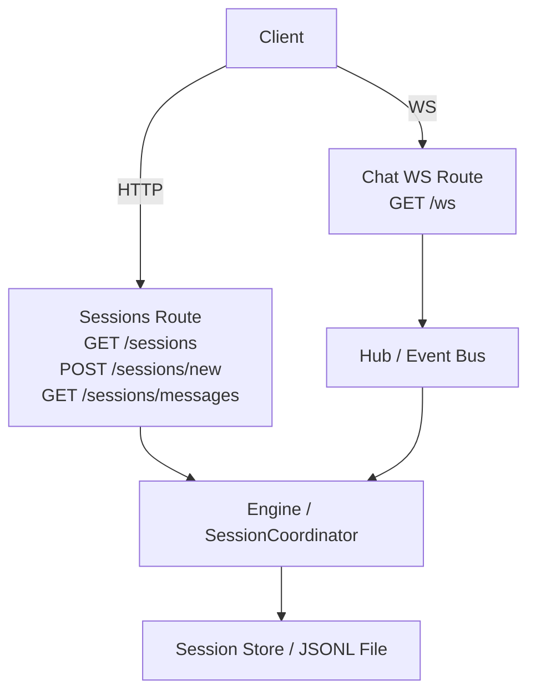
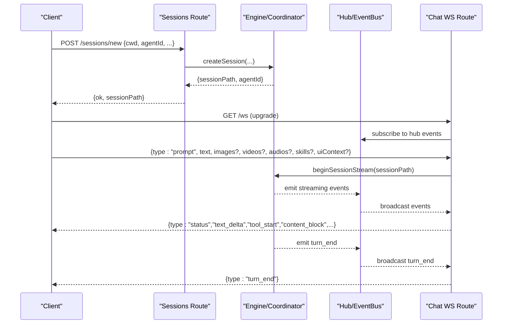
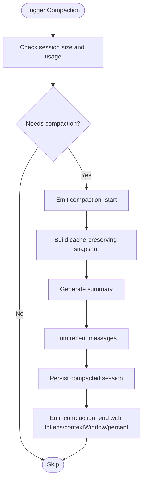
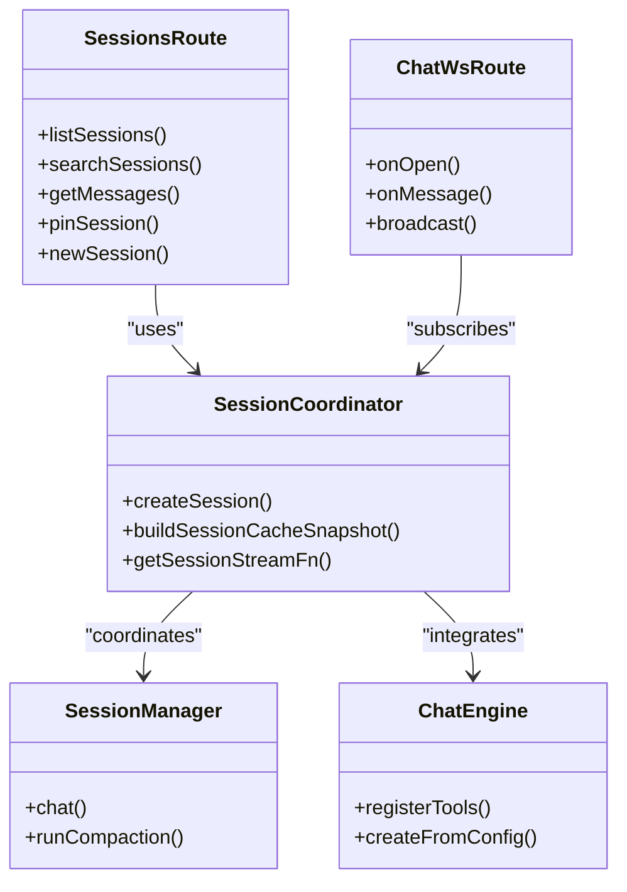

# Session & Chat API

<cite>
**Referenced Files in This Document**
- [server/routes/sessions.ts](file://server/routes/sessions.ts)
- [server/routes/chat.ts](file://server/routes/chat.ts)
- [server/ws-protocol.ts](file://server/ws-protocol.ts)
- [core/session-manager.ts](file://core/session-manager.ts)
- [core/session-coordinator.ts](file://core/session-coordinator.ts)
- [core/chat-engine.ts](file://core/chat-engine.ts)
</cite>

## Table of Contents
1. [Introduction](#introduction)
2. [Project Structure](#project-structure)
3. [Core Components](#core-components)
4. [Architecture Overview](#architecture-overview)
5. [Detailed Component Analysis](#detailed-component-analysis)
6. [Dependency Analysis](#dependency-analysis)
7. [Performance Considerations](#performance-considerations)
8. [Troubleshooting Guide](#troubleshooting-guide)
9. [Conclusion](#conclusion)
10. [Appendices](#appendices)

## Introduction
This document provides detailed API documentation for session and chat management endpoints, focusing on:
- Conversation lifecycle (create, list, search, pin, archive/restore semantics via paths)
- Message sending/receiving over REST and WebSocket streaming
- Context management (workspace scope, permission mode, thinking level, media inputs)
- Session persistence (JSONL-backed sessions, sidecar metadata, compaction)
- Real-time streaming with WebSocket protocol and stream resume
- TypeScript interfaces for request/response schemas and validation rules
- Examples for message formatting, context injection, session compaction, and live streaming

## Project Structure
The session and chat APIs are implemented as HTTP routes and a WebSocket endpoint:
- REST routes for session CRUD, history retrieval, and operations like pinning and authorized folders
- WebSocket route for real-time streaming, turn control, and event broadcasting
- Core session coordination and engine layers handle persistence, compaction, and LLM interactions

**Diagram sources**
- [server/routes/sessions.ts:508-574](file://server/routes/sessions.ts#L508-L574)
- [server/routes/sessions.ts:776-1040](file://server/routes/sessions.ts#L776-L1040)
- [server/routes/chat.ts:1141-1200](file://server/routes/chat.ts#L1141-L1200)
- [core/session-coordinator.ts:734-800](file://core/session-coordinator.ts#L734-L800)

**Section sources**
- [server/routes/sessions.ts:508-574](file://server/routes/sessions.ts#L508-L574)
- [server/routes/sessions.ts:776-1040](file://server/routes/sessions.ts#L776-L1040)
- [server/routes/chat.ts:1141-1200](file://server/routes/chat.ts#L1141-L1200)
- [core/session-coordinator.ts:734-800](file://core/session-coordinator.ts#L734-L800)

## Core Components
- Sessions REST API: lists sessions, searches, retrieves paginated messages, pins/unpins, manages authorized folders, replays last user turn, completes todos, creates new sessions.
- Chat WebSocket API: handles prompt streaming, aborts, resume, and broadcasts rich events (text deltas, tool calls, content blocks, status updates).
- Session Coordinator: orchestrates session creation, model selection, workspace scope, permission modes, compaction, and runtime pressure handling.
- Session Manager (legacy): simple in-memory store with compaction and memory integration.
- Chat Engine: tool registry and provider client wiring; used by higher layers to execute tools and manage capabilities.

**Section sources**
- [server/routes/sessions.ts:508-574](file://server/routes/sessions.ts#L508-L574)
- [server/routes/sessions.ts:776-1040](file://server/routes/sessions.ts#L776-L1040)
- [server/routes/chat.ts:1141-1200](file://server/routes/chat.ts#L1141-L1200)
- [core/session-coordinator.ts:734-800](file://core/session-coordinator.ts#L734-L800)
- [core/session-manager.ts:1-165](file://core/session-manager.ts#L1-L165)
- [core/chat-engine.ts:1-800](file://core/chat-engine.ts#L1-L800)

## Architecture Overview
High-level flow for creating a session and streaming a conversation turn:

**Diagram sources**
- [server/routes/sessions.ts:1137-1200](file://server/routes/sessions.ts#L1137-L1200)
- [server/routes/chat.ts:1141-1200](file://server/routes/chat.ts#L1141-L1200)
- [server/routes/chat.ts:879-926](file://server/routes/chat.ts#L879-L926)
- [server/routes/chat.ts:995-1106](file://server/routes/chat.ts#L995-L1106)

## Detailed Component Analysis

### REST: Sessions API
Endpoints:
- GET /api/sessions
  - Purpose: List all sessions with projection fields (title, firstMessage, modified, revision, messageCount, cwd, agentId, agentName, projectId, modelId, modelProvider, workspaceMountId, workspaceLabel, permissionMode, pinnedAt, agentDeleted, readOnlyReason, continuationAvailable, deletedAt, hasSummary, rcAttachment).
  - Auth: requires sessions.read scoped to studio or session path.
  - Response: array of session projections.
  - Status codes: 200 OK, 403 insufficient_scope/studio_scope_mismatch, 500 error.

- GET /api/sessions/search
  - Query params: q (string), phase ("title"|"content"), limit (number).
  - Validation: query length <= 512; tokenizer unavailable returns 503.
  - Response: { query, phase, results[] }.
  - Status codes: 200 OK, 400 query_too_long, 503 tokenizer unavailable, 500 error.

- GET /api/sessions/summary
  - Query param: path (required, validated against agentsDir).
  - Response: { hasSummary, summary, createdAt, updatedAt }.
  - Status codes: 200 OK, 400 missingParam, 403 invalid path, 403 insufficient_scope, 500 error.

- POST /api/sessions/pin
  - Body: { path (string), pinned (boolean) }.
  - Behavior: sets pinnedAt timestamp.
  - Status codes: 200 OK, 400 missingParam, 403 invalid path/deleted agent, 409 conflict if agent deleted, 500 error.

- GET /api/sessions/authorized-folders
  - Query param: path (defaults to current session if omitted).
  - Response: { ok, sessionPath, cwd, workspaceFolders[], authorizedFolders[], sandboxFolders[] }.
  - Status codes: 200 OK, 400 missingParam, 403 invalid path/deleted agent/not found, 500 error.

- PATCH /api/sessions/authorized-folders
  - Body: { action: "add"|"remove"|"set", folder?: string, folders?: string[] }.
  - Validation: folder must exist and be directory; set expects array of valid folders.
  - Response: updated scope object.
  - Status codes: 200 OK, 400 invalid action/folder errors, 403 invalid path/deleted agent/not found, 500 error.

- GET /api/sessions/messages
  - Query params: path (optional), before (number), limit (number, max 200), all (flag).
  - Behavior: loads session history, filters displayable messages, extracts blocks, resolves deferred results, computes pagination bounds, returns revision signature.
  - Response: { messages[], blocks[], todos[], hasMore, sessionFiles[], revision }.
  - Status codes: 200 OK, 403 invalid path, 403 insufficient_scope, 500 error.

- POST /api/sessions/latest-user-message/replay
  - Body: { path, sourceEntryId?, clientMessageId?, text?, displayMessage?, uiContext? }.
  - Behavior: replays latest user turn with optional replacement text and UI context.
  - Status codes: 200 OK, 400 missingParam, 403 invalid path/deleted agent/not found, 409 session busy, 500 error.

- POST /api/sessions/todos/complete
  - Body: { path }.
  - Behavior: marks all todos completed and emits update event.
  - Status codes: 200 OK, 400 missingParam, 403 invalid path/deleted agent/not found, 409 session busy, 500 error.

- POST /api/sessions/new
  - Body: { memoryEnabled?, agentId?, currentSessionPath?, thinkingLevel?, workspaceMountId?, workspaceLabel?, cwd?, workspaceFolders[], projectId? }.
  - Behavior: resolves workspace mount/cwd, suspends browser for old session, creates session with options (workspaceFolders, visibleInSessionList, thinkingLevel, workspaceMountId/label).
  - Response: { sessionPath, agentId } (success).
  - Status codes: 200 OK, 403 insufficient_scope, 409 no available model, 500 error.

Request/Response Schemas (TypeScript-like):
- SessionProjection
  - path: string
  - title: string | null
  - firstMessage: string
  - modified: string | null
  - revision: string | null
  - messageCount: number
  - cwd: string | null
  - agentId: string | null
  - agentName: string | null
  - projectId: string | null
  - modelId: string | null
  - modelProvider: string | null
  - workspaceMountId: string | null
  - workspaceLabel: string | null
  - permissionMode: string
  - pinnedAt: string | null
  - agentDeleted: boolean
  - readOnlyReason: string | null
  - continuationAvailable: boolean
  - deletedAt: string | null
  - hasSummary: boolean
  - rcAttachment: { sessionKey: string, platform: string, title: string } | null

- SearchQuery
  - q: string
  - phase: "title" | "content"
  - limit: number | undefined

- SearchResults
  - query: string
  - phase: "title" | "content"
  - results: SessionProjection[]

- SummaryRecord
  - hasSummary: boolean
  - summary: string | null
  - createdAt: string | null
  - updatedAt: string | null

- PinRequest
  - path: string
  - pinned: boolean

- AuthorizedFolderScope
  - ok: boolean
  - sessionPath: string | null
  - cwd: string | null
  - workspaceFolders: string[]
  - authorizedFolders: string[]
  - sandboxFolders: string[]

- AuthorizedFoldersAction
  - action: "add" | "remove" | "set"
  - folder?: string
  - folders?: string[]

- MessagesResponse
  - messages: Array<{ id: string, entryId?: string, role: "user"|"assistant", content: string, thinking?: string, toolCalls?: any[], images?: any[], timestamp?: number }>
  - blocks: Array<{ type: string, afterIndex: number, ... }>
  - todos: any[]
  - hasMore: boolean
  - sessionFiles: any[]
  - revision: string | null

- ReplayRequest
  - path: string
  - sourceEntryId?: string
  - clientMessageId?: string
  - text?: string
  - displayMessage?: any
  - uiContext?: any | null

- TodosCompleteRequest
  - path: string

- NewSessionRequest
  - memoryEnabled?: boolean
  - agentId?: string
  - currentSessionPath?: string
  - thinkingLevel?: string
  - workspaceMountId?: string
  - workspaceLabel?: string
  - cwd?: string
  - workspaceFolders?: string[]
  - projectId?: string

Validation Rules:
- Path validation: must be under agentsDir and active desktop session path where required.
- Query length limit: SESSION_SEARCH_QUERY_MAX_LENGTH = 512.
- Limit cap: messages limit max 200.
- Workspace selection: cwd and workspaceMountId cannot be combined; mount resolution uses MountAwareFileService.
- Permission checks: authorizeSessionRoute enforces scopes per operation.

Status Codes:
- 200 OK for successful operations
- 400 Bad Request for missing/invalid parameters
- 403 Forbidden for invalid session path, insufficient scope, or studio mismatch
- 404 Not Found when session not found
- 409 Conflict for no available model or session busy
- 500 Internal Server Error for unexpected failures
- 503 Service Unavailable for tokenizer unavailable

Examples:
- Create session with mount:
  - POST /api/sessions/new
  - Body: { workspaceMountId: "studio-1", thinkingLevel: "balanced", workspaceFolders: [] }
- Paginate messages:
  - GET /api/sessions/messages?path=/agents/rem-default/sessions/abc.jsonl&before=100&limit=50
- Replay last user message:
  - POST /api/sessions/latest-user-message/replay
  - Body: { path: "...", text: "Updated prompt", uiContext: { activeFile: "/src/main.ts" } }

**Section sources**
- [server/routes/sessions.ts:508-574](file://server/routes/sessions.ts#L508-L574)
- [server/routes/sessions.ts:576-637](file://server/routes/sessions.ts#L576-L637)
- [server/routes/sessions.ts:640-662](file://server/routes/sessions.ts#L640-L662)
- [server/routes/sessions.ts:665-693](file://server/routes/sessions.ts#L665-L693)
- [server/routes/sessions.ts:695-773](file://server/routes/sessions.ts#L695-L773)
- [server/routes/sessions.ts:776-1040](file://server/routes/sessions.ts#L776-L1040)
- [server/routes/sessions.ts:1042-1082](file://server/routes/sessions.ts#L1042-L1082)
- [server/routes/sessions.ts:1084-1135](file://server/routes/sessions.ts#L1084-L1135)
- [server/routes/sessions.ts:1137-1200](file://server/routes/sessions.ts#L1137-L1200)

### WebSocket: Chat Streaming API
WebSocket Endpoint:
- GET /ws
- Upgrade handshake; client subscribes to session-scoped events.

Client → Server Messages:
- prompt
  - Fields: text (string), sessionPath (string), images? (array), videos? (array), audios? (array), skills? (array), uiContext? (object|null)
  - uiContext: currentViewed?, activeFile?, activePreview?, pinnedFiles?
- abort
  - Fields: sessionPath (string), reason? (string)
- resume_stream
  - Fields: sessionPath (string), streamId (string), sinceSeq (number)

Server → Client Events:
- text_delta: { delta: string }
- mood_start/mood_text/mood_end
- thinking_start/thinking_delta/thinking_end
- tool_start/tool_end
- turn_end
- error: { message: string }
- status: { isStreaming: boolean, streamId?: string, turnId?: string, sessionPath: string, aborted?: boolean, reason?: string }
- session_title: { title: string, path: string }
- jian_update: { content: string }
- devlog: { text: string, level: "info"|"heartbeat"|"error" }
- activity_update: { activity: object }
- content_block: { block: object }
- session_user_message: { sessionPath: string, message: object }
- confirmation_resolved: { confirmId: string, action: "confirmed"|"rejected", value?: any }
- block_update: { taskId: string, patch: object }
- browser_status: { running: boolean, url: string, thumbnail?: string }
- bridge_status: { platform: string, status: string, error?: string }
- stream_resume: { sessionPath: string, streamId: string, sinceSeq: number, nextSeq: number, reset: boolean, truncated: boolean, isStreaming: boolean, runtimeIsStreaming?: boolean, events: [{ seq: number, ts?: number, event: object }] }

Protocol Validation:
- Strict assertions for sessionPath, streamId, seq, types, booleans, integers.
- Compatibility checks between top-level fields and nested sessionEvent fields.

Streaming Lifecycle:
- Begin: status isStreaming=true, streamId assigned
- Stream: text_delta, thinking_delta, tool_start/end, content_block
- End: turn_end, status isStreaming=false
- Resume: stream_resume with replayed events from sinceSeq

Abort Handling:
- Client sends abort; server marks ss.isAborted=true and broadcasts status with aborted=true and reason.

Turn Stall Watchdog:
- Configurable timeout; if idle beyond threshold, aborts streaming.

Examples:
- Start streaming:
  - Connect ws://host/ws
  - Send: { type: "prompt", text: "Hello", sessionPath: "/agents/rem-default/sessions/abc.jsonl" }
- Abort:
  - Send: { type: "abort", sessionPath: "...", reason: "user_abort" }
- Resume:
  - Send: { type: "resume_stream", sessionPath: "...", streamId: "...", sinceSeq: 128 }

**Section sources**
- [server/ws-protocol.ts:1-193](file://server/ws-protocol.ts#L1-L193)
- [server/routes/chat.ts:1141-1200](file://server/routes/chat.ts#L1141-L1200)
- [server/routes/chat.ts:879-926](file://server/routes/chat.ts#L879-L926)
- [server/routes/chat.ts:995-1106](file://server/routes/chat.ts#L995-L1106)

### Session Persistence and Compaction
- Session files are JSONL-based; revisions computed from file stat signatures for cache synchronization.
- Sidecar metadata (session-meta.json) stores thinking levels, prompt snapshots, and other meta.
- Compaction:
  - Triggered when session grows beyond thresholds
  - Produces summaries and trims recent messages while preserving cache keys
  - Emits compaction_start/compaction_end events over WebSocket

Compaction Flow:

**Diagram sources**
- [core/session-coordinator.ts:734-800](file://core/session-coordinator.ts#L734-L800)
- [server/routes/chat.ts:128-150](file://server/routes/chat.ts#L128-L150)

**Section sources**
- [server/routes/sessions.ts:227-234](file://server/routes/sessions.ts#L227-L234)
- [core/session-coordinator.ts:734-800](file://core/session-coordinator.ts#L734-L800)
- [server/routes/chat.ts:128-150](file://server/routes/chat.ts#L128-L150)

### Context Management
- Workspace Scope:
  - Resolved via workspaceMountId or cwd; mount resolution uses MountAwareFileService
  - Authorized folders can be added/removed/set per session
- Permission Mode:
  - Operate vs read-only modes influence tool availability and actions
- Thinking Level:
  - Model-specific defaults; can be set per session creation
- Media Inputs:
  - Images/videos/audios supported with MIME and base64 limits enforced

**Section sources**
- [server/routes/sessions.ts:103-145](file://server/routes/sessions.ts#L103-L145)
- [server/routes/sessions.ts:695-773](file://server/routes/sessions.ts#L695-L773)
- [server/routes/sessions.ts:1137-1200](file://server/routes/sessions.ts#L1137-L1200)
- [server/routes/chat.ts:37-39](file://server/routes/chat.ts#L37-L39)

## Dependency Analysis
Component relationships:
- Sessions Route depends on Engine/SessionCoordinator for session operations
- Chat WS Route depends on Hub/EventBus for event broadcasting and protocol utilities
- SessionCoordinator coordinates with SessionManager, providers, and storage
- ChatEngine registers tools and integrates with providers

**Diagram sources**
- [server/routes/sessions.ts:508-574](file://server/routes/sessions.ts#L508-L574)
- [server/routes/chat.ts:1141-1200](file://server/routes/chat.ts#L1141-L1200)
- [core/session-coordinator.ts:734-800](file://core/session-coordinator.ts#L734-L800)
- [core/session-manager.ts:1-165](file://core/session-manager.ts#L1-L165)
- [core/chat-engine.ts:1-800](file://core/chat-engine.ts#L1-L800)

**Section sources**
- [server/routes/sessions.ts:508-574](file://server/routes/sessions.ts#L508-L574)
- [server/routes/chat.ts:1141-1200](file://server/routes/chat.ts#L1141-L1200)
- [core/session-coordinator.ts:734-800](file://core/session-coordinator.ts#L734-L800)
- [core/session-manager.ts:1-165](file://core/session-manager.ts#L1-L165)
- [core/chat-engine.ts:1-800](file://core/chat-engine.ts#L1-L800)

## Performance Considerations
- Pagination: messages endpoint supports before/limit with max 200; forceAll flag for special cases
- Revision-based caching: clients use revision signatures to detect changes and avoid full reloads
- Stream resume: efficient replay of missed events using seq numbers
- Memory pressure: configurable thresholds for runtime pressure handling
- Tool result summarization: only necessary fields broadcast to reduce payload size

[No sources needed since this section provides general guidance]

## Troubleshooting Guide
Common issues and resolutions:
- Insufficient scope: ensure proper authentication and studio/session permissions
- Invalid session path: verify path exists under agentsDir and is active
- Session busy: wait for streaming to complete before replaying or completing todos
- Tokenizer unavailable: session search may return 503; retry later
- No available model: configure provider/model before creating sessions
- Turn stall timeout: adjust HANA_TURN_STALL_ABORT_MS environment variable

**Section sources**
- [server/routes/sessions.ts:576-637](file://server/routes/sessions.ts#L576-L637)
- [server/routes/sessions.ts:1042-1082](file://server/routes/sessions.ts#L1042-L1082)
- [server/routes/chat.ts:186-198](file://server/routes/chat.ts#L186-L198)

## Conclusion
The Session & Chat API provides comprehensive REST and WebSocket interfaces for managing conversations, with robust support for real-time streaming, context management, and session persistence. The architecture separates concerns between routing, coordination, and execution layers, enabling scalability and maintainability.

[No sources needed since this section summarizes without analyzing specific files]

## Appendices

### WebSocket Protocol Reference
Client → Server:
- prompt: { type: "prompt", text: string, sessionPath: string, images?: any[], videos?: any[], audios?: any[], skills?: any[], uiContext?: object|null }
- abort: { type: "abort", sessionPath: string, reason?: string }
- resume_stream: { type: "resume_stream", sessionPath: string, streamId: string, sinceSeq: number }

Server → Client:
- text_delta, mood_*, thinking_*, tool_start/end, turn_end, error, status, session_title, jian_update, devlog, activity_update, content_block, session_user_message, confirmation_resolved, block_update, browser_status, bridge_status, stream_resume

**Section sources**
- [server/ws-protocol.ts:1-193](file://server/ws-protocol.ts#L1-L193)