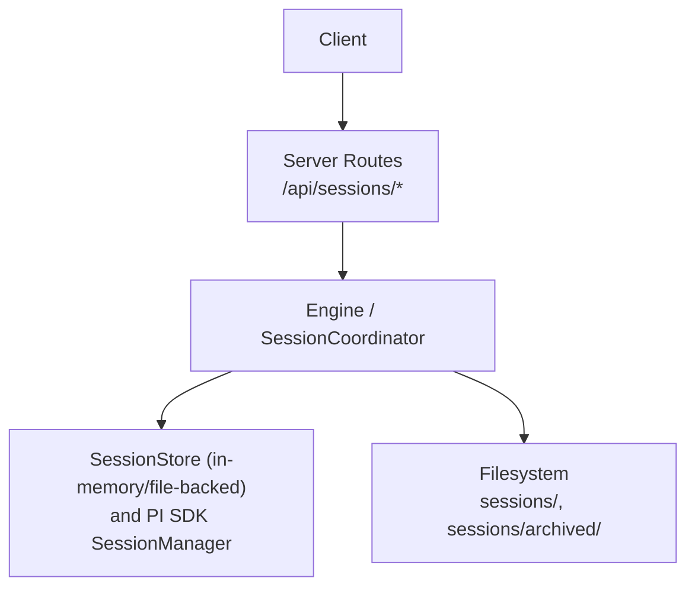
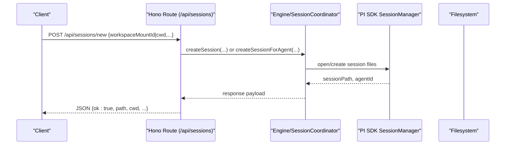
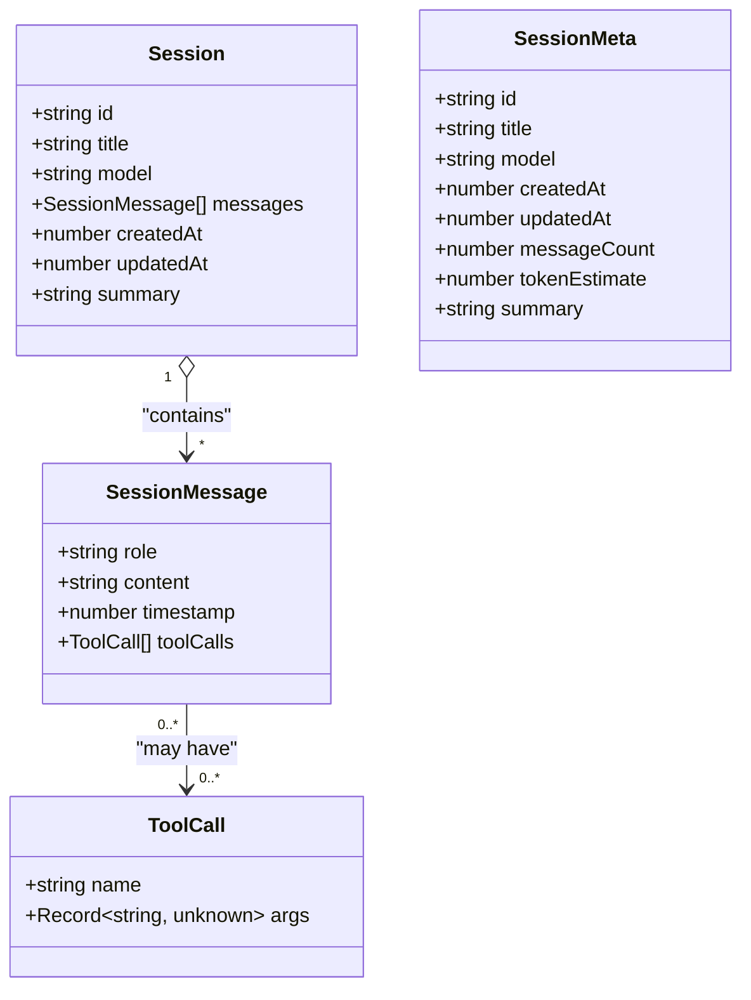
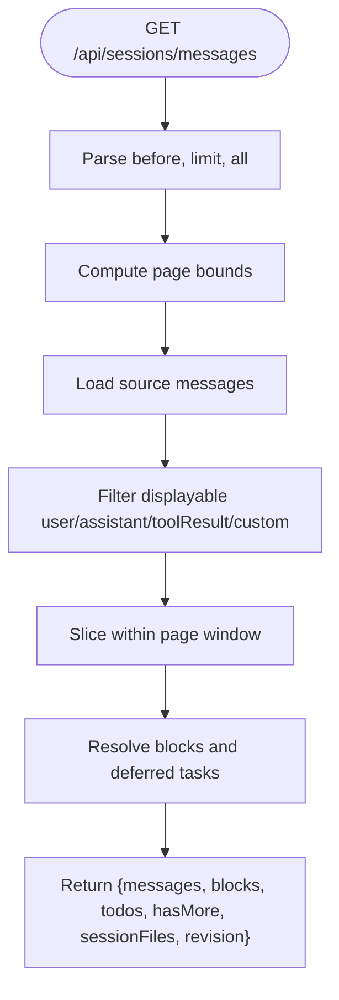
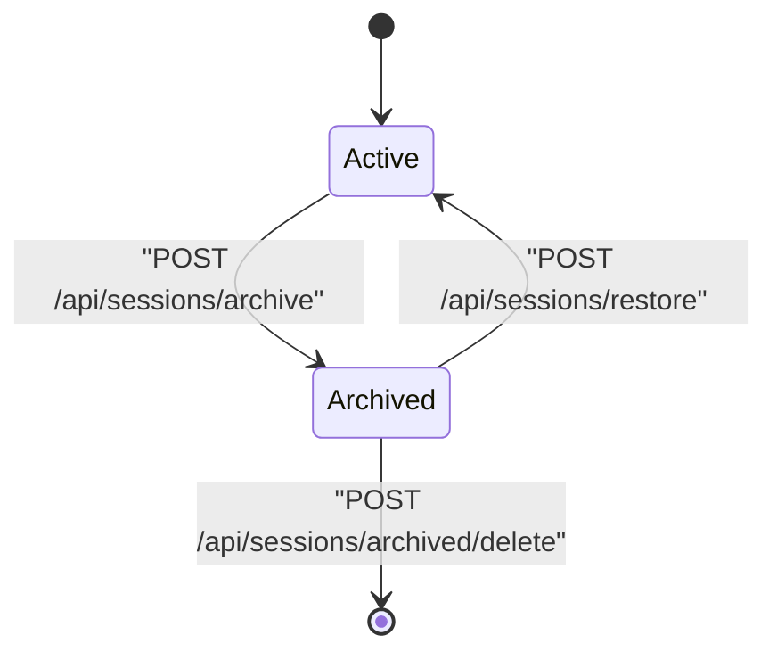
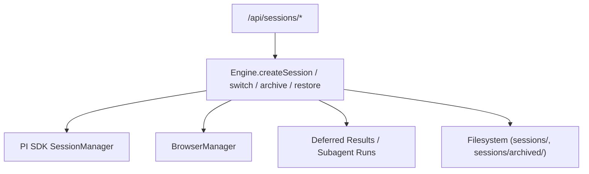

# Session Lifecycle API

<cite>
**Referenced Files in This Document**
- [sessions.ts](file://server/routes/sessions.ts)
- [session-coordinator.ts](file://core/session-coordinator.ts)
- [session-manager.ts](file://core/session-manager.ts)
- [session-store.ts](file://core/session-store.ts)
- [chat-types.ts](file://desktop/src/react/stores/chat-types.ts)
- [types.ts](file://desktop/src/react/types.ts)
</cite>

## Table of Contents
1. [Introduction](#introduction)
2. [Project Structure](#project-structure)
3. [Core Components](#core-components)
4. [Architecture Overview](#architecture-overview)
5. [Detailed Component Analysis](#detailed-component-analysis)
6. [Dependency Analysis](#dependency-analysis)
7. [Performance Considerations](#performance-considerations)
8. [Troubleshooting Guide](#troubleshooting-guide)
9. [Conclusion](#conclusion)
10. [Appendices](#appendices)

## Introduction
This document provides detailed API documentation for session lifecycle management endpoints exposed by the server. It covers:
- Creating sessions (including detached and agent-specific creation)
- Listing, searching, and summarizing sessions
- Archiving, restoring, and deleting archived sessions
- Switching active sessions
- Pagination, filtering, and sorting for session lists
- Request/response schemas using TypeScript interfaces
- Parameter validation rules and status codes
- Examples of session metadata handling, workspace configuration, permission modes, and state transitions

The API is implemented as a Hono-based HTTP router that delegates to an engine with a SessionCoordinator for orchestration.

## Project Structure
The session lifecycle endpoints are defined in the server routes module and rely on core session coordination logic.



**Diagram sources**
- [sessions.ts:508-574](file://server/routes/sessions.ts#L508-L574)
- [session-coordinator.ts:734-800](file://core/session-coordinator.ts#L734-L800)
- [session-manager.ts:21-36](file://core/session-manager.ts#L21-L36)
- [session-store.ts:48-93](file://core/session-store.ts#L48-L93)

**Section sources**
- [sessions.ts:508-574](file://server/routes/sessions.ts#L508-L574)
- [session-coordinator.ts:734-800](file://core/session-coordinator.ts#L734-L800)

## Core Components
- Server route handlers: define HTTP endpoints, validate inputs, enforce permissions, and return JSON responses.
- SessionCoordinator: orchestrates session creation, switching, persistence, and capability snapshots.
- SessionManager (PI SDK): manages per-session runtime and file I/O.
- SessionStore: simple in-memory/file-backed store used by legacy/local flows.

Key responsibilities:
- Input validation and error classification
- Workspace selection and mount resolution
- Permission mode and thinking level normalization
- Lifecycle transitions (archive/restore/delete)
- Search and list projections

**Section sources**
- [sessions.ts:147-170](file://server/routes/sessions.ts#L147-L170)
- [session-coordinator.ts:734-800](file://core/session-coordinator.ts#L734-L800)
- [session-manager.ts:21-36](file://core/session-manager.ts#L21-L36)
- [session-store.ts:48-93](file://core/session-store.ts#L48-L93)

## Architecture Overview
High-level request flow for session operations:



**Diagram sources**
- [sessions.ts:1137-1242](file://server/routes/sessions.ts#L1137-L1242)
- [session-coordinator.ts:734-800](file://core/session-coordinator.ts#L734-L800)
- [session-manager.ts:21-36](file://core/session-manager.ts#L21-L36)

## Detailed Component Analysis

### Endpoints Reference

#### Create Session
- Method: POST
- URL: /api/sessions/new
- Description: Creates a new session, optionally bound to a specific agent and workspace.
- Authentication/Authorization: Requires write scope; validates session path constraints when applicable.
- Request body fields:
  - memoryEnabled?: boolean (default true if omitted)
  - agentId?: string (optional; switch agent context if provided)
  - currentSessionPath?: string (previous session path for browser suspension)
  - thinkingLevel?: string | null (optional)
  - workspaceMountId?: string (preferred over cwd)
  - cwd?: string (fallback if no mount)
  - workspaceFolders?: string[] (absolute paths)
  - projectId?: string (optional project assignment)
- Response fields:
  - ok: boolean
  - path: string (new session path)
  - cwd: string
  - workspaceFolders: string[]
  - authorizedFolders: string[]
  - agentId: string
  - agentName: string
  - projectId: string | null
  - planMode: boolean
  - permissionMode: string
  - accessMode: string
  - thinkingLevel: string
  - memoryModelUnavailableReason: string | null
  - workspaceMountId?: string
  - workspaceLabel?: string | null
- Status codes:
  - 200 OK
  - 400 Bad Request (missing/invalid params)
  - 403 Forbidden (insufficient scope or invalid path)
  - 409 Conflict (no available model)
  - 500 Internal Server Error
- Notes:
  - If old session has a running browser, it is suspended before creating the new one.
  - Workspace selection prefers workspaceMountId; combining cwd and workspaceMountId is rejected.

**Section sources**
- [sessions.ts:1137-1242](file://server/routes/sessions.ts#L1137-L1242)

#### Create Detached Session
- Method: POST
- URL: /api/sessions/new-detached
- Description: Creates a background session not attached to the current UI focus.
- Request body fields:
  - memoryEnabled?: boolean
  - agentId?: string
  - permissionMode?: string
  - thinkingLevel?: string | null
  - workspaceMountId?: string
  - cwd?: string
  - workspaceFolders?: string[]
- Response fields:
  - ok: boolean
  - path: string
  - cwd: string | null
  - workspaceFolders: string[]
  - authorizedFolders: string[]
  - agentId: string
  - agentName: string
  - currentSessionPath: string | null
  - planMode: boolean
  - permissionMode: string
  - accessMode: string
  - thinkingLevel: string
  - memoryModelUnavailableReason: string | null
  - workspaceMountId?: string
  - workspaceLabel?: string | null
- Status codes:
  - 200 OK
  - 403 Forbidden
  - 500 Internal Server Error

**Section sources**
- [sessions.ts:1244-1324](file://server/routes/sessions.ts#L1244-L1324)

#### Continue Deleted Agent Session
- Method: POST
- URL: /api/sessions/continue-deleted-agent
- Description: Continues a session whose owning agent was deleted by migrating to a valid agent.
- Request body fields:
  - path: string (session path)
- Response fields:
  - ok: boolean
  - path: string
  - cwd: string | null
  - workspaceFolders: string[]
  - authorizedFolders: string[]
  - agentId: string
  - agentName: string
  - projectId: null
  - planMode: boolean
  - permissionMode: string
  - accessMode: string
  - thinkingLevel: string
  - memoryModelUnavailableReason: string | null
  - compacted: boolean
- Status codes:
  - 200 OK
  - 400 Bad Request (agent_not_deleted)
  - 403 Forbidden (invalid path)
  - 404 Not Found
  - 500 Internal Server Error

**Section sources**
- [sessions.ts:1326-1377](file://server/routes/sessions.ts#L1326-L1377)

#### Switch Session
- Method: POST
- URL: /api/sessions/switch
- Description: Switches the active session (supports cross-agent). Suspends/resumes browser state as needed.
- Request body fields:
  - path: string (target session path)
  - currentSessionPath?: string (previous session path)
- Response fields:
  - ok: boolean
  - messageCount: number
  - memoryEnabled: boolean
  - planMode: boolean
  - permissionMode: string
  - accessMode: string
  - thinkingLevel: string
  - memoryModelUnavailableReason: string | null
  - cwd: string
  - workspaceFolders: string[]
  - authorizedFolders: string[]
  - workspaceMountId?: string
  - workspaceLabel?: string | null
  - agentId: string
  - agentName: string
  - browserRunning: boolean
  - browserUrl: string | null
  - isStreaming: boolean
  - currentModelId: string | null
  - currentModelProvider: string | null
  - currentModelName: string | null
  - currentModelInput: any[] | null
  - currentModelVideo: boolean
  - currentModelVideoTransport: string | null
  - currentModelVideoTransportSupported: boolean
  - currentModelAudio: boolean
  - currentModelAudioTransport: string | null
  - currentModelAudioTransportSupported: boolean
  - currentModelReasoning: boolean | null
  - currentModelXhigh: boolean
  - currentModelThinkingLevels: any[] | null
  - currentModelDefaultThinkingLevel: string | null
  - currentModelContextWindow: number | null
  - capabilityDrift: object | null
- Status codes:
  - 200 OK
  - 400 Bad Request (missing path)
  - 403 Forbidden (invalid path)
  - 500 Internal Server Error

**Section sources**
- [sessions.ts:1379-1464](file://server/routes/sessions.ts#L1379-L1464)

#### List Sessions
- Method: GET
- URL: /api/sessions
- Description: Lists all agent sessions with projection fields suitable for UI.
- Query parameters: none
- Response: Array of session projection objects including:
  - path, title, firstMessage, modified, revision, messageCount
  - cwd, agentId, agentName, projectId, modelId, modelProvider
  - workspaceMountId, workspaceLabel
  - permissionMode, pinnedAt, agentDeleted, readOnlyReason
  - continuationAvailable, deletedAt, hasSummary, rcAttachment
- Status codes:
  - 200 OK
  - 403 Forbidden (insufficient scope or studio mismatch)
  - 500 Internal Server Error

**Section sources**
- [sessions.ts:508-574](file://server/routes/sessions.ts#L508-L574)

#### Search Sessions
- Method: GET
- URL: /api/sessions/search
- Description: Searches sessions by title or content phase.
- Query parameters:
  - q: string (search query; max length enforced)
  - phase: "title" | "content"
  - limit: number (optional)
- Response:
  - query: string
  - phase: string
  - results: array of session projection objects plus matchKind, snippet, score
- Status codes:
  - 200 OK
  - 400 Bad Request (query too long)
  - 403 Forbidden
  - 503 Service Unavailable (tokenizer unavailable)
  - 500 Internal Server Error

**Section sources**
- [sessions.ts:576-637](file://server/routes/sessions.ts#L576-L637)

#### Get Session Summary
- Method: GET
- URL: /api/sessions/summary
- Description: Retrieves the rolling summary for a session.
- Query parameters:
  - path: string (required)
- Response:
  - hasSummary: boolean
  - summary: string | null
  - createdAt: string | null
  - updatedAt: string | null
- Status codes:
  - 200 OK
  - 400 Bad Request (missing param)
  - 403 Forbidden (invalid path or insufficient scope)
  - 500 Internal Server Error

**Section sources**
- [sessions.ts:640-662](file://server/routes/sessions.ts#L640-L662)

#### Pin/Unpin Session
- Method: POST
- URL: /api/sessions/pin
- Description: Pins or unpins a session in the list.
- Request body fields:
  - path: string (required)
  - pinned: boolean (required)
- Response:
  - ok: boolean
  - pinnedAt: string | null
- Status codes:
  - 200 OK
  - 400 Bad Request (missing params)
  - 403 Forbidden (invalid path or insufficient scope)
  - 409 Conflict (agent deleted)
  - 500 Internal Server Error

**Section sources**
- [sessions.ts:664-693](file://server/routes/sessions.ts#L664-L693)

#### Authorized Folders
- GET /api/sessions/authorized-folders
  - Query: path (string, required)
  - Returns folder scope for a session
- PATCH /api/sessions/authorized-folders
  - Body:
    - path: string (required)
    - action: "add" | "remove" | "set"
    - folder: string (for add/remove)
    - folders: string[] (for set)
  - Returns updated folder scope
- Status codes:
  - 200 OK
  - 400 Bad Request (validation errors)
  - 403 Forbidden (invalid path or insufficient scope)
  - 404 Not Found
  - 500 Internal Server Error

**Section sources**
- [sessions.ts:695-773](file://server/routes/sessions.ts#L695-L773)

#### Archive Session
- Method: POST
- URL: /api/sessions/archive
- Description: Moves an active session into its agent’s sessions/archived directory.
- Request body fields:
  - path: string (active session path)
- Response:
  - ok: boolean
- Status codes:
  - 200 OK
  - 400 Bad Request (missing param)
  - 403 Forbidden (invalid path)
  - 404 Not Found
  - 409 Conflict (archived path already exists or sidecar conflict)
  - 500 Internal Server Error

**Section sources**
- [sessions.ts:1609-1659](file://server/routes/sessions.ts#L1609-L1659)

#### Restore Archived Session
- Method: POST
- URL: /api/sessions/restore
- Description: Restores an archived session back to active sessions/.
- Request body fields:
  - path: string (archived session path)
- Response:
  - ok: boolean
  - restoredPath: string
- Status codes:
  - 200 OK
  - 400 Bad Request (missing param)
  - 403 Forbidden (not an archived path)
  - 404 Not Found
  - 409 Conflict (active path already exists or sidecar conflict)
  - 500 Internal Server Error

**Section sources**
- [sessions.ts:1661-1701](file://server/routes/sessions.ts#L1661-L1701)

#### Delete Archived Session
- Method: POST
- URL: /api/sessions/archived/delete
- Description: Permanently deletes an archived session and cleans up sidecars and titles.
- Request body fields:
  - path: string (archived session path)
- Response:
  - ok: boolean
- Status codes:
  - 200 OK
  - 400 Bad Request (missing param)
  - 403 Forbidden (not an archived path)
  - 404 Not Found
  - 500 Internal Server Error

**Section sources**
- [sessions.ts:1703-1735](file://server/routes/sessions.ts#L1703-L1735)

#### List Archived Sessions
- Method: GET
- URL: /api/sessions/archived
- Description: Lists all archived sessions across agents.
- Response: Array of archived session entries
- Status codes:
  - 200 OK
  - 500 Internal Server Error

**Section sources**
- [sessions.ts:1599-1607](file://server/routes/sessions.ts#L1599-L1607)

#### Rename Session
- Method: POST
- URL: /api/sessions/rename
- Description: Updates the session title.
- Request body fields:
  - path: string (required)
  - title: string (required, non-empty after trim)
- Response:
  - ok: boolean
- Status codes:
  - 200 OK
  - 400 Bad Request (missing params)
  - 403 Forbidden (invalid path)
  - 409 Conflict (agent deleted)
  - 500 Internal Server Error

**Section sources**
- [sessions.ts:1536-1558](file://server/routes/sessions.ts#L1536-L1558)

#### Cleanup Archived Sessions
- Method: POST
- URL: /api/sessions/cleanup
- Description: Deletes archived sessions older than a threshold and cleans orphan titles.
- Request body fields:
  - maxAgeDays?: number (default 90)
- Response:
  - ok: boolean
  - deleted: number
  - maxAgeDays: number
- Status codes:
  - 200 OK
  - 500 Internal Server Error

**Section sources**
- [sessions.ts:1560-1597](file://server/routes/sessions.ts#L1560-L1597)

#### Thinking Level
- GET /api/session-thinking-level
  - Returns available levels and current level
- POST /api/session-thinking-level
  - Body:
    - sessionPath?: string (optional; per-session override if supported)
    - thinkingLevel: string
  - Returns ok: boolean
- Status codes:
  - 200 OK
  - 500 Internal Server Error

**Section sources**
- [sessions.ts:1737-1765](file://server/routes/sessions.ts#L1737-L1765)

### Data Models and Schemas (TypeScript Interfaces)

These interfaces reflect the primary shapes used by the session APIs. They are derived from the client-side types and core stores referenced by the server routes.



**Diagram sources**
- [session-store.ts:6-32](file://core/session-store.ts#L6-L32)
- [session-store.ts:13-22](file://core/session-store.ts#L13-L22)

Additional client-facing types relevant to session lifecycle:

```mermaid
classDiagram
class SessionPermissionMode {
<<enum>>
"auto"
"operate"
"ask"
"read_only"
}
class SessionCapabilityDrift {
+string fingerprint
+boolean dismissed
}
class SessionRegistryFile {
+string fileId
+string filePath
+string label
+string ext
+string mime
+string kind
+string storageKind
+object presentation
+boolean listed
+string status
+number missingAt
+number mtimeMs
+number size
+number version
+object resource
}
```

**Diagram sources**
- [types.ts:42-60](file://desktop/src/react/types.ts#L42-L60)
- [chat-types.ts:65-75](file://desktop/src/react/stores/chat-types.ts#L65-L75)

**Section sources**
- [session-store.ts:6-32](file://core/session-store.ts#L6-L32)
- [types.ts:42-60](file://desktop/src/react/types.ts#L42-L60)
- [chat-types.ts:65-75](file://desktop/src/react/stores/chat-types.ts#L65-L75)

### Validation Rules and Error Handling
- Path validation: All endpoints requiring a session path validate against allowed directories and reject invalid or archived paths where inappropriate.
- Scope checks: Many endpoints require explicit read/write scopes and may reject requests if the authenticated Studio does not match the server’s current Studio.
- Query limits: Search queries are limited in length; exceeding the limit returns a 400 error.
- Conflict detection: Archiving/restoring detects existing targets and sidecar conflicts, returning 409.
- Error classification: Creation failures are classified (e.g., no available model → 409), otherwise generic 500 responses include error messages.

**Section sources**
- [sessions.ts:147-170](file://server/routes/sessions.ts#L147-L170)
- [sessions.ts:576-637](file://server/routes/sessions.ts#L576-L637)
- [sessions.ts:1609-1659](file://server/routes/sessions.ts#L1609-L1659)
- [sessions.ts:1661-1701](file://server/routes/sessions.ts#L1661-L1701)

### Pagination, Filtering, and Sorting
- Session listing: The list endpoint returns projected session metadata sorted by recency. No explicit pagination parameters are exposed at this endpoint.
- Search: Supports phase ("title"|"content") and optional limit; results include matchKind, snippet, and score.
- Message history pagination: The messages endpoint supports before and limit parameters and returns hasMore to indicate additional pages.



**Diagram sources**
- [sessions.ts:776-1040](file://server/routes/sessions.ts#L776-L1040)

**Section sources**
- [sessions.ts:508-574](file://server/routes/sessions.ts#L508-L574)
- [sessions.ts:576-637](file://server/routes/sessions.ts#L576-L637)
- [sessions.ts:776-1040](file://server/routes/sessions.ts#L776-L1040)

### Workspace Configuration and Mounts
- Workspace selection:
  - Prefer workspaceMountId; if provided, cwd must be omitted.
  - Resolves mount root and label via MountAwareFileService.
- Response includes workspaceMountId and workspaceLabel when mounts are used.
- Workspace folders can be specified as absolute paths during creation.

**Section sources**
- [sessions.ts:103-145](file://server/routes/sessions.ts#L103-L145)
- [sessions.ts:1137-1242](file://server/routes/sessions.ts#L1137-L1242)

### Permission Modes and Access Control
- Permission modes: auto, operate, ask, read_only.
- Plan mode maps to read_only permission mode in some contexts.
- Access mode is derived from permission mode.
- Authorization uses a capability-based check per endpoint and target.

**Section sources**
- [types.ts:42-60](file://desktop/src/react/types.ts#L42-L60)
- [sessions.ts:1244-1324](file://server/routes/sessions.ts#L1244-L1324)

### Session State Transitions
- Active ↔ Archived:
  - Archive moves active session to sessions/archived/<filename>.jsonl and updates timestamps.
  - Restore moves archived session back to active sessions/<filename>.jsonl.
- Deletion:
  - Archived deletion removes the file and sidecars, and cleans orphan titles.
- Switching:
  - Suspends/resumes browser state; updates focus and returns full session context.



**Diagram sources**
- [sessions.ts:1609-1659](file://server/routes/sessions.ts#L1609-L1659)
- [sessions.ts:1661-1701](file://server/routes/sessions.ts#L1661-L1701)
- [sessions.ts:1703-1735](file://server/routes/sessions.ts#L1703-L1735)

## Dependency Analysis
The session lifecycle endpoints depend on:
- Hono routing and request context utilities
- Engine methods for session creation, switching, listing, archiving, and restoration
- Filesystem operations for moving/deleting session files and sidecars
- Browser manager for suspending/resuming browser instances
- Deferred result and subagent run registries for block status reconciliation



**Diagram sources**
- [sessions.ts:1137-1242](file://server/routes/sessions.ts#L1137-L1242)
- [sessions.ts:1379-1464](file://server/routes/sessions.ts#L1379-L1464)
- [sessions.ts:1609-1659](file://server/routes/sessions.ts#L1609-L1659)

**Section sources**
- [sessions.ts:1137-1242](file://server/routes/sessions.ts#L1137-L1242)
- [sessions.ts:1379-1464](file://server/routes/sessions.ts#L1379-L1464)
- [sessions.ts:1609-1659](file://server/routes/sessions.ts#L1609-L1659)

## Performance Considerations
- Message loading uses page bounds to avoid hydrating entire histories; only visible windows are fully parsed.
- Revision tracking enables incremental sync without re-fetching unchanged content.
- Sidecar caches reduce repeated reads for subagent metadata and summaries.
- Cleanup endpoint prunes stale archives based on mtime to keep disk usage bounded.

[No sources needed since this section provides general guidance]

## Troubleshooting Guide
Common issues and resolutions:
- Insufficient scope or Studio mismatch: Ensure the client’s authenticated Studio matches the server’s current Studio and has appropriate read/write capabilities.
- Invalid session path: Verify the path belongs to the expected directory structure and is not an archived path when operating on active sessions.
- Conflicts during archive/restore: Check for existing target paths or sidecar files; resolve naming collisions before retrying.
- Tokenizer unavailable for search: Retry later or fall back to title-only search.

**Section sources**
- [sessions.ts:576-637](file://server/routes/sessions.ts#L576-L637)
- [sessions.ts:1609-1659](file://server/routes/sessions.ts#L1609-L1659)
- [sessions.ts:1661-1701](file://server/routes/sessions.ts#L1661-L1701)

## Conclusion
The Session Lifecycle API provides comprehensive control over session creation, discovery, archival, and cleanup, with robust validation, authorization, and workspace/mount support. Clients should handle pagination for message retrieval, respect permission modes, and manage lifecycle transitions carefully to avoid conflicts.

[No sources needed since this section summarizes without analyzing specific files]

## Appendices

### Example Requests and Responses

- Create session (with mount):
  - POST /api/sessions/new
  - Body: { workspaceMountId: "mount-1", memoryEnabled: true, thinkingLevel: "balanced" }
  - Response: { ok: true, path: "...", cwd: "...", workspaceMountId: "mount-1", workspaceLabel: "...", ... }

- Search sessions:
  - GET /api/sessions/search?q=error&phase=title&limit=20
  - Response: { query: "error", phase: "title", results: [...] }

- Archive session:
  - POST /api/sessions/archive
  - Body: { path: "/path/to/agent/sessions/abc.jsonl" }
  - Response: { ok: true }

- Restore archived session:
  - POST /api/sessions/restore
  - Body: { path: "/path/to/agent/sessions/archived/abc.jsonl" }
  - Response: { ok: true, restoredPath: "/path/to/agent/sessions/abc.jsonl" }

- Delete archived session:
  - POST /api/sessions/archived/delete
  - Body: { path: "/path/to/agent/sessions/archived/abc.jsonl" }
  - Response: { ok: true }

[No sources needed since this section provides examples without analyzing specific files]