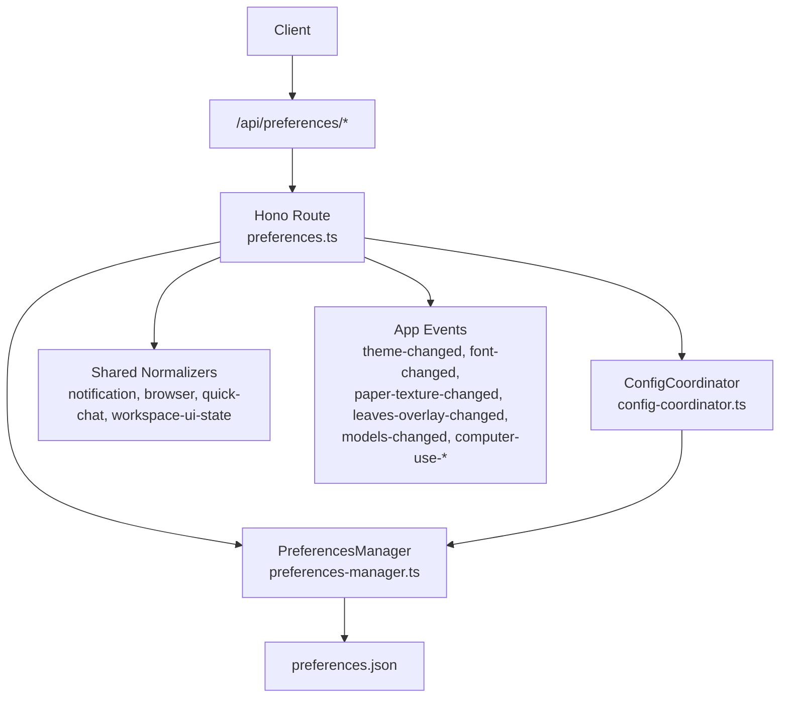
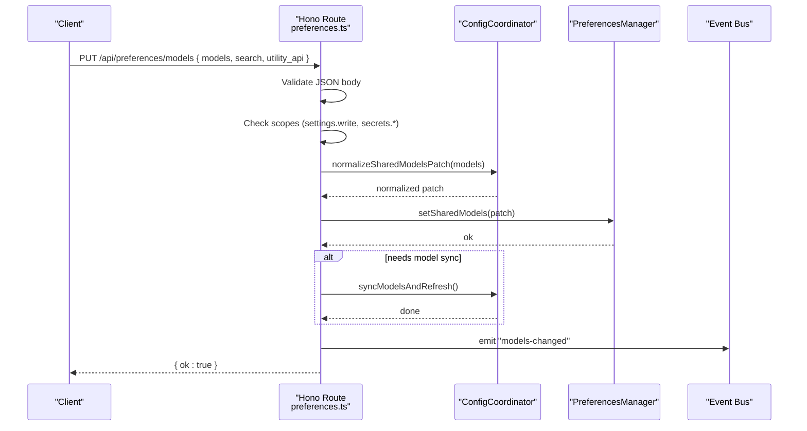
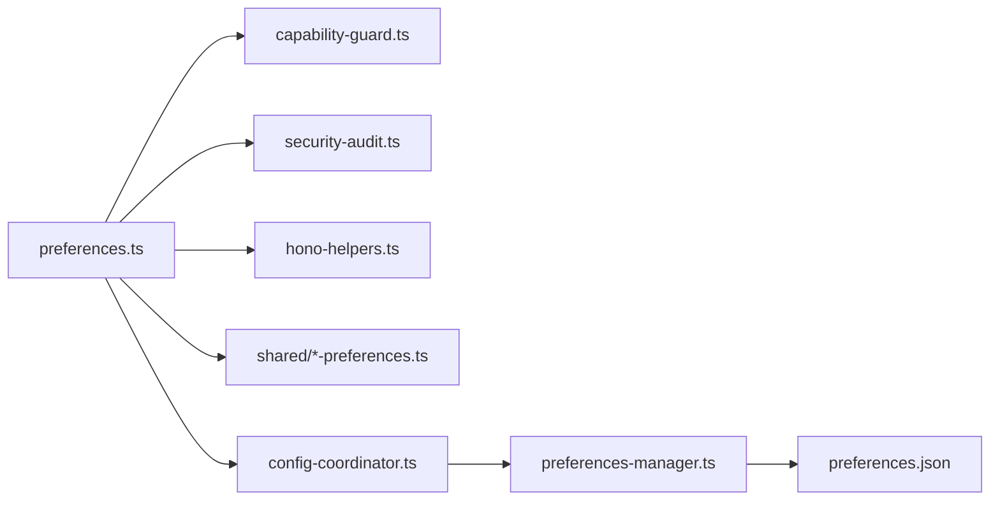

# Application Settings API

<cite>
**Referenced Files in This Document**
- [preferences.ts](file://server/routes/preferences.ts)
- [index.ts](file://server/index.ts)
- [config-coordinator.ts](file://core/config-coordinator.ts)
- [preferences-manager.ts](file://core/preferences-manager.ts)
- [notification-preferences.ts](file://shared/notification-preferences.ts)
- [browser-preferences.ts](file://shared/browser-preferences.ts)
- [quick-chat-preferences.ts](file://shared/quick-chat-preferences.ts)
- [workspace-ui-state.ts](file://shared/workspace-ui-state.ts)
</cite>

## Table of Contents
1. Introduction
2. Project Structure
3. Core Components
4. Architecture Overview
5. Detailed Component Analysis
6. Dependency Analysis
7. Performance Considerations
8. Troubleshooting Guide
9. Conclusion

## Introduction
This document provides comprehensive API documentation for application settings endpoints. It covers HTTP methods, URL patterns, request/response schemas (with TypeScript interfaces), and setting categories including general, interface, security, performance, notifications, browser behavior, quick chat, workspace UI state, and computer-use preferences. It also documents validation rules, default values, and how preferences are synchronized across devices via events and persistence.

## Project Structure
The settings API is exposed under the /api base path and implemented as a Hono route mounted by the server. The core logic is split between:
- Server routes that validate requests, enforce permissions, normalize inputs, persist changes, and emit events
- Shared preference normalizers and defaults
- A configuration coordinator that manages shared models, search/utility APIs, and model synchronization
- A preferences manager that persists user-level preferences to disk

**Diagram sources**
- [preferences.ts:1-542](file://server/routes/preferences.ts#L1-L542)
- [index.ts:181-207](file://server/index.ts#L181-L207)
- [config-coordinator.ts:1-619](file://core/config-coordinator.ts#L1-L619)
- [preferences-manager.ts:1-800](file://core/preferences-manager.ts#L1-L800)
- [notification-preferences.ts:1-36](file://shared/notification-preferences.ts#L1-L36)
- [browser-preferences.ts:1-41](file://shared/browser-preferences.ts#L1-L41)
- [quick-chat-preferences.ts:1-34](file://shared/quick-chat-preferences.ts#L1-L34)
- [workspace-ui-state.ts:1-188](file://shared/workspace-ui-state.ts#L1-L188)

**Section sources**
- [index.ts:181-207](file://server/index.ts#L181-L207)
- [preferences.ts:1-542](file://server/routes/preferences.ts#L1-L542)

## Core Components
- PreferencesRoute: Exposes all settings endpoints under /api/preferences with GET/PUT/POST/DELETE semantics. Validates payloads, enforces scopes, normalizes data, persists changes, and emits app events.
- ConfigCoordinator: Manages shared models, search provider keys, utility API overrides, and triggers model sync when needed.
- PreferencesManager: Persists global preferences to disk, provides getters/setters for many settings, and ensures safe writes.
- Shared Normalizers: Provide TypeScript interfaces, defaults, and normalization functions for notification, browser, quick-chat, and workspace UI state preferences.

Key responsibilities:
- Validation: Input shape checks, enum/value normalization, secret masking, scope-based authorization
- Defaults: Well-defined defaults for each category
- Persistence: Atomic writes to preferences.json
- Synchronization: Emitting events for theme, fonts, paper texture, leaves overlay, model changes, and computer-use updates

**Section sources**
- [preferences.ts:1-542](file://server/routes/preferences.ts#L1-L542)
- [config-coordinator.ts:1-619](file://core/config-coordinator.ts#L1-L619)
- [preferences-manager.ts:1-800](file://core/preferences-manager.ts#L1-L800)
- [notification-preferences.ts:1-36](file://shared/notification-preferences.ts#L1-L36)
- [browser-preferences.ts:1-41](file://shared/browser-preferences.ts#L1-L41)
- [quick-chat-preferences.ts:1-34](file://shared/quick-chat-preferences.ts#L1-L34)
- [workspace-ui-state.ts:1-188](file://shared/workspace-ui-state.ts#L1-L188)

## Architecture Overview
The settings API follows a layered architecture:
- HTTP layer: Hono routes handle request parsing, validation, and response formatting
- Business layer: ConfigCoordinator and PreferencesManager implement business logic and persistence
- Data layer: preferences.json on disk
- Event layer: App events notify clients of relevant changes (e.g., theme, fonts, models)

**Diagram sources**
- [preferences.ts:162-236](file://server/routes/preferences.ts#L162-L236)
- [config-coordinator.ts:56-86](file://core/config-coordinator.ts#L56-L86)
- [config-coordinator.ts:203-235](file://core/config-coordinator.ts#L203-L235)

## Detailed Component Analysis

### General Settings Endpoints
These endpoints manage global preferences such as language, timezone, sandboxing, hardware acceleration, update channel, auto-check updates, keep awake, thinking level, editor typography, channels, bridge/automation permission modes, network proxy, and more.

- GET /api/preferences/appearance
  - Response: { appearance: AppearancePreferences }
  - Notes: Appearance fields include theme, serif, paperTexture, leavesOverlay; changes emit corresponding events.
- PUT /api/preferences/appearance
  - Request: { appearance?: AppearancePreferences } or direct object
  - Response: { ok: true, appearance: AppearancePreferences }
  - Validation: Body must be an object; partial patches are merged.
- GET /api/preferences/notifications
  - Response: { notifications: NotificationPreferences }
- PUT /api/preferences/notifications
  - Request: { notifications?: NotificationPreferences } or direct object
  - Response: { ok: true, notifications: NotificationPreferences }
- GET /api/preferences/quick-chat
  - Response: { quickChat: QuickChatPreferences }
- PUT /api/preferences/quick-chat
  - Request: { quickChat?: QuickChatPreferences } or direct object
  - Response: { ok: true, quickChat: QuickChatPreferences }
- GET /api/preferences/browser
  - Response: { browser: BrowserPreferences }
- PUT /api/preferences/browser
  - Request: { browser?: BrowserPreferences } or direct object
  - Response: { ok: true, browser: BrowserPreferences }
  - Side effect: Applies browser preferences to the embedded browser manager.
- POST /api/preferences/browser/clear-cookies
  - Response: { ok: true }
  - Action: Clears cookies and site data for the embedded browser.
- POST /api/preferences/setup-complete
  - Response: { ok: true, setupComplete: true }
  - Action: Marks first-time setup complete atomically.

TypeScript Interfaces and Defaults
- AppearancePreferences
  - Fields: theme (string), serif (boolean), paperTexture (boolean), leavesOverlay (boolean)
  - Default values: Provided by engine.getAppearance(); changes trigger events.
- NotificationPreferences
  - Interface: { turnCompletion: TurnCompletionNotificationMode }
  - Types: "never" | "when_unfocused" | "when_session_unfocused"
  - Default: "never"
- QuickChatPreferences
  - Interface: { shortcut: string; reuseTimeoutMinutes: number; windowSize?: { width: number; height: number } }
  - Defaults: shortcut = "Alt+Space"; reuseTimeoutMinutes = 5; windowSize optional
- BrowserPreferences
  - Interface: { acceptCookies: boolean; agentOpenBehavior: "smart" | "current_tab" | "new_tab" }
  - Defaults: acceptCookies = true; agentOpenBehavior = "smart"

Validation Rules
- All PUT endpoints require a JSON object body; otherwise return 400 with error message.
- Partial objects are merged into existing preferences using respective merge/normalize functions.
- Secret fields (e.g., api_key, api_keys) are masked in responses and protected by scopes.

Synchronization Across Devices
- Changes are persisted to preferences.json and may emit app events for immediate UI updates.
- Clients should listen for events like "theme-changed", "font-changed", "paper-texture-changed", "leaves-overlay-changed", and "models-changed".

**Section sources**
- [preferences.ts:238-365](file://server/routes/preferences.ts#L238-L365)
- [preferences.ts:367-445](file://server/routes/preferences.ts#L367-L445)
- [notification-preferences.ts:1-36](file://shared/notification-preferences.ts#L1-L36)
- [quick-chat-preferences.ts:1-34](file://shared/quick-chat-preferences.ts#L1-L34)
- [browser-preferences.ts:1-41](file://shared/browser-preferences.ts#L1-L41)
- [preferences-manager.ts:439-492](file://core/preferences-manager.ts#L439-L492)

### Security and Model Settings Endpoints
Endpoints for managing shared models, search provider configuration, and utility API overrides.

- GET /api/preferences/models
  - Response: { models: SharedModels; thinking_level: string; search: SearchConfig; utility_api: UtilityApiConfig }
  - Notes: Returns masked secret values for api_key and api_keys.
- PUT /api/preferences/models
  - Request: { models?: SharedModelsPatch; search?: SearchConfigPatch; utility_api?: UtilityApiPatch }
  - Response: { ok: true }
  - Authorization: Requires "settings.write" and appropriate secret mutation scopes for sensitive fields.
  - Validation:
    - models patch validated against allowed fields; vision model must support image input if provided.
    - search provider and api_keys normalized; legacy api_key migrated to api_keys map.
    - utility_api fields normalized; invalid overrides cleared automatically.
  - Side effects:
    - If shared models changed, triggers model sync and refresh.
    - Emits "models-changed" event.

TypeScript Interfaces and Defaults
- SharedModels
  - Fields: utility?, utility_large?, vision?, vision_enabled?
  - Defaults: null unless configured; vision_enabled false unless enabled.
- SearchConfig
  - Fields: provider (string), api_key (string|null), api_keys (Record<string,string>)
  - Defaults: provider defaults to AUTO_SEARCH_PROVIDER; api_key derived from api_keys[provider] or legacy field.
- UtilityApiConfig
  - Fields: provider (string|null), base_url (string|null), api_key (string|null)
  - Defaults: all null unless configured.

Validation Rules
- models patch must be an object; vision model must support images.
- search provider must be valid; api_keys normalized and merged; legacy api_key migrated.
- utility_api override cleaned if incomplete or mismatched with selected utility model.

Synchronization Across Devices
- Models changes propagate to agents and trigger runtime refresh.
- Events emitted for client-side updates.

**Section sources**
- [preferences.ts:136-236](file://server/routes/preferences.ts#L136-L236)
- [config-coordinator.ts:56-86](file://core/config-coordinator.ts#L56-L86)
- [config-coordinator.ts:186-235](file://core/config-coordinator.ts#L186-L235)
- [config-coordinator.ts:255-337](file://core/config-coordinator.ts#L255-L337)
- [config-coordinator.ts:520-553](file://core/config-coordinator.ts#L520-L553)

### Workspace-Specific Options Endpoints
Endpoints for per-workspace UI state management.

- GET /api/preferences/workspace-ui-state?workspace=...&surface=...
  - Query params:
    - workspace: non-empty normalized path
    - surface: "electron" | "pwa"
  - Response: { state: WorkspaceUiEntry }
- PUT /api/preferences/workspace-ui-state
  - Request: { workspace: string; surface: string; state: WorkspaceUiEntryPatch }
  - Response: { ok: true, state: WorkspaceUiEntry }

TypeScript Interfaces and Defaults
- WorkspaceUiSurface: "electron" | "pwa"
- WorkspaceUiEntry
  - Fields: updatedAt (number), deskCurrentPath (string), deskExpandedPaths (string[]), deskSelectedPath (string), rightWorkspaceTab ("session-files"|"workspace"|plugin-widget prefix), jianView (string), jianDrawerOpen (boolean), previewOpen (boolean), openTabs (string[]), activeTabId (string|null), previewTabs (PreviewTab[])
  - Defaults: Derived from normalization; openTabs defaults to first preview tab if present.
- PreviewTab
  - Fields: id (string), filePath? (string), relativePath? (string), title (string), type (string), ext (string), language? (string)

Validation Rules
- workspace must be a non-empty normalized path.
- surface must be one of the allowed surfaces.
- State entries are normalized with limits on paths and tabs; invalid entries are pruned.

Synchronization Across Devices
- Workspace UI state is persisted per workspace root and surface class.
- GC removes stale workspace roots when directories no longer exist.

**Section sources**
- [preferences.ts:367-400](file://server/routes/preferences.ts#L367-L400)
- [workspace-ui-state.ts:60-114](file://shared/workspace-ui-state.ts#L60-L114)
- [workspace-ui-state.ts:149-188](file://shared/workspace-ui-state.ts#L149-L188)

### Sidebar and Plugin UI Preferences Endpoints
- GET /api/preferences/sidebar-ui
  - Response: { sidebarUi: SidebarUiPrefs }
- PUT /api/preferences/sidebar-ui
  - Request: { sidebarUi?: SidebarUiPrefs } or direct object
  - Response: { ok: true, sidebarUi: SidebarUiPrefs }
- GET /api/preferences/plugin-ui
  - Response: { hiddenWidgets: string[]; hiddenTabs: string[]; tabOrder: string[] }
- PUT /api/preferences/plugin-ui
  - Request: { hiddenWidgets?: string[]; hiddenTabs?: string[]; tabOrder?: string[] }
  - Response: { ok: true, ...result }

Defaults and Validation
- Sidebar UI prefs normalized and merged.
- Plugin UI prefs arrays validated and merged.

**Section sources**
- [preferences.ts:402-445](file://server/routes/preferences.ts#L402-L445)
- [preferences-manager.ts:528-663](file://core/preferences-manager.ts#L528-L663)

### Computer Use Preferences Endpoints
Platform-specific endpoints for enabling/disabling Computer Use, selecting providers, requesting permissions, and approving/revoke apps.

- GET /api/preferences/computer-use
  - Response: { settings: ComputerUseSettings; status: ComputerUseStatus; selectedProviderId: string|null }
- PUT /api/preferences/computer-use
  - Request: { settings?: ComputerUseSettings } or direct object
  - Response: { ok: true, settings: ComputerUseSettings }
  - Platform check: Not supported on Linux Preview.
- POST /api/preferences/computer-use/request-permissions
  - Request: { providerId?: string|null }
  - Response: { ok: true, result: any }
- POST /api/preferences/computer-use/approvals
  - Request: { providerId?: string|null; appId?: string|null }
  - Response: { ok: true, settings: ComputerUseSettings }
- DELETE /api/preferences/computer-use/approvals
  - Request: { providerId?: string|null; appId?: string|null }
  - Response: { ok: true, settings: ComputerUseSettings }

Events
- Emits "computer-use-settings-changed" and "computer-use-permissions-requested" events.

**Section sources**
- [preferences.ts:447-523](file://server/routes/preferences.ts#L447-L523)
- [preferences-manager.ts:352-382](file://core/preferences-manager.ts#L352-L382)

## Dependency Analysis
The settings API depends on several modules:
- Hono routing and helpers for request parsing and JSON handling
- Capability guards for scope-based authorization
- Security audit logging for sensitive mutations
- Shared normalizers for consistent schema enforcement
- ConfigCoordinator for shared models and search/utility API coordination
- PreferencesManager for persistent storage

**Diagram sources**
- [preferences.ts:1-542](file://server/routes/preferences.ts#L1-L542)
- [config-coordinator.ts:1-619](file://core/config-coordinator.ts#L1-L619)
- [preferences-manager.ts:1-800](file://core/preferences-manager.ts#L1-L800)

**Section sources**
- [preferences.ts:1-542](file://server/routes/preferences.ts#L1-L542)
- [config-coordinator.ts:1-619](file://core/config-coordinator.ts#L1-L619)
- [preferences-manager.ts:1-800](file://core/preferences-manager.ts#L1-L800)

## Performance Considerations
- Prefer partial PATCH-style updates to minimize payload size and avoid full rewrites.
- Avoid frequent writes to preferences.json; batch updates where possible.
- For model changes, rely on the built-in sync mechanism to prevent redundant refreshes.
- Use normalized inputs to reduce validation overhead and ensure efficient merges.

## Troubleshooting Guide
Common issues and resolutions:
- Invalid JSON body: Ensure request bodies are valid JSON objects.
- Missing scopes: Mutating secrets requires both "settings.write" and appropriate secret mutation scopes.
- Vision model not supporting images: When updating shared models, ensure the chosen vision model supports image input.
- Utility API override inconsistencies: Incomplete or mismatched utility_api overrides are automatically cleared.
- Platform restrictions: Computer Use endpoints are not supported on Linux Preview.

Error responses:
- 400 Bad Request: Returned for invalid inputs, unsupported platform, or validation failures.
- 500 Internal Server Error: Returned for unexpected server errors.

**Section sources**
- [preferences.ts:162-236](file://server/routes/preferences.ts#L162-L236)
- [preferences.ts:238-365](file://server/routes/preferences.ts#L238-L365)
- [preferences.ts:447-523](file://server/routes/preferences.ts#L447-L523)

## Conclusion
The Application Settings API provides a robust, validated, and secure interface for managing user preferences across multiple categories. It enforces strong typing through shared normalizers, persists changes reliably, and synchronizes state via events. Clients should leverage partial updates, respect authorization scopes, and listen for relevant events to maintain consistent UI and behavior across devices.