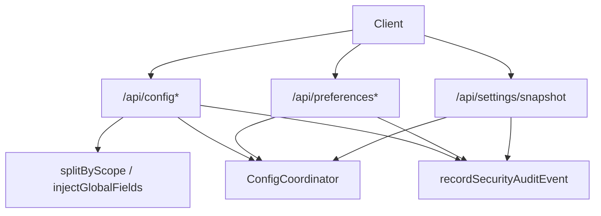
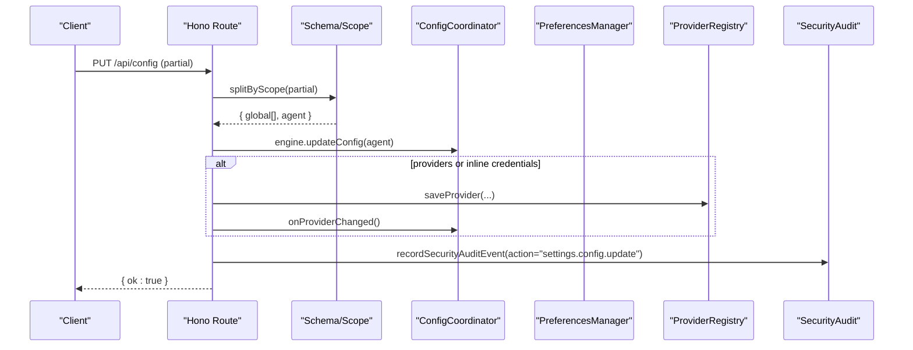
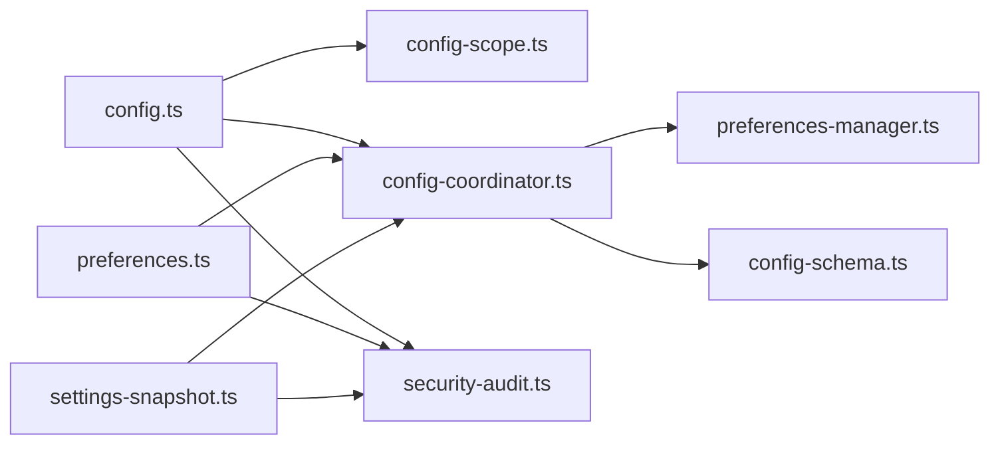

# Configuration Management API

<cite>
**Referenced Files in This Document**
- [server/routes/config.ts](file://server/routes/config.ts)
- [server/routes/preferences.ts](file://server/routes/preferences.ts)
- [server/routes/settings-snapshot.ts](file://server/routes/settings-snapshot.ts)
- [core/config-coordinator.ts](file://core/config-coordinator.ts)
- [shared/config-schema.ts](file://shared/config-schema.ts)
- [shared/config-scope.ts](file://shared/config-scope.ts)
- [shared/migrate-config-scope.ts](file://shared/migrate-config-scope.ts)
- [core/security-audit-log.ts](file://core/security-audit-log.ts)
- [server/http/security-audit.ts](file://server/http/security-audit.ts)
</cite>

## Table of Contents
1. [Introduction](#introduction)
2. [Project Structure](#project-structure)
3. [Core Components](#core-components)
4. [Architecture Overview](#architecture-overview)
5. [Detailed Component Analysis](#detailed-component-analysis)
6. [Dependency Analysis](#dependency-analysis)
7. [Performance Considerations](#performance-considerations)
8. [Troubleshooting Guide](#troubleshooting-guide)
9. [Conclusion](#conclusion)
10. [Appendices](#appendices)

## Introduction
This document provides detailed API documentation for configuration management endpoints. It covers HTTP methods, URL patterns, request/response schemas (TypeScript interfaces), parameter validation rules, and operational guidance including runtime configuration changes, environment variable management, configuration schema validation, migration procedures, configuration scopes (global, workspace, agent-specific), backup/restore operations, and configuration audit logging.

The configuration system supports:
- Global preferences (cross-agent): stored in preferences.json
- Agent-specific configuration: stored per agent config.yaml
- Workspace-related settings: recent workspaces, default workspace path
- Provider registry updates and inline credential patches
- Search provider configuration and verification
- Utility API configuration
- Settings snapshot export for backup/restore workflows
- Security audit logging for sensitive mutations

## Project Structure
Configuration endpoints are implemented as Hono routes under server/routes. The core logic is split across:
- Route handlers for REST endpoints
- Shared schema and scope utilities
- Preferences manager for global state persistence
- Config coordinator for runtime coordination and model/search/utility APIs
- Security audit logging for compliance and observability

**Diagram sources**
- [server/routes/config.ts:1-757](file://server/routes/config.ts#L1-L757)
- [server/routes/preferences.ts:1-542](file://server/routes/preferences.ts#L1-L542)
- [server/routes/settings-snapshot.ts:1-252](file://server/routes/settings-snapshot.ts#L1-L252)
- [shared/config-scope.ts:1-72](file://shared/config-scope.ts#L1-L72)
- [core/config-coordinator.ts:1-619](file://core/config-coordinator.ts#L1-L619)
- [server/http/security-audit.ts:1-34](file://server/http/security-audit.ts#L1-L34)

**Section sources**
- [server/routes/config.ts:1-757](file://server/routes/config.ts#L1-L757)
- [server/routes/preferences.ts:1-542](file://server/routes/preferences.ts#L1-L542)
- [server/routes/settings-snapshot.ts:1-252](file://server/routes/settings-snapshot.ts#L1-L252)
- [shared/config-schema.ts:1-47](file://shared/config-schema.ts#L1-L47)
- [shared/config-scope.ts:1-72](file://shared/config-scope.ts#L1-L72)
- [core/config-coordinator.ts:1-619](file://core/config-coordinator.ts#L1-L619)
- [server/http/security-audit.ts:1-34](file://server/http/security-audit.ts#L1-L34)

## Core Components
- Configuration route: reads/writes agent config, providers, search utility, memory artifacts, identity files, pinned memory, and more.
- Preferences route: manages global preferences (models, search, utility API, appearance, notifications, quick chat, browser, computer use).
- Settings snapshot route: exports a comprehensive snapshot of agent config, preferences, bridge status, plugin settings, and access summary.
- Config schema and scope: declares which fields are global vs agent-scoped and how to split/inject them at runtime.
- Config coordinator: orchestrates shared models, search config, utility API, heartbeat, and updateConfig side effects.
- Security audit log: records sensitive configuration changes with masked secrets.

**Section sources**
- [server/routes/config.ts:1-757](file://server/routes/config.ts#L1-L757)
- [server/routes/preferences.ts:1-542](file://server/routes/preferences.ts#L1-L542)
- [server/routes/settings-snapshot.ts:1-252](file://server/routes/settings-snapshot.ts#L1-L252)
- [shared/config-schema.ts:1-47](file://shared/config-schema.ts#L1-L47)
- [shared/config-scope.ts:1-72](file://shared/config-scope.ts#L1-L72)
- [core/config-coordinator.ts:1-619](file://core/config-coordinator.ts#L1-L619)
- [core/security-audit-log.ts:1-104](file://core/security-audit-log.ts#L1-L104)

## Architecture Overview
The configuration API follows a layered design:
- HTTP layer: Hono routes handle requests, validate inputs, enforce capabilities, and record audit events.
- Domain layer: ConfigCoordinator and PreferencesManager coordinate runtime state and persistence.
- Schema layer: CONFIG_SCHEMA defines global fields and their setters/getters; splitByScope/injectGlobalFields apply scope-aware routing.
- Storage layer: preferences.json for global state; per-agent config.yaml for agent-specific state; provider registry for LLM backend definitions.

**Diagram sources**
- [server/routes/config.ts:295-405](file://server/routes/config.ts#L295-L405)
- [shared/config-scope.ts:11-47](file://shared/config-scope.ts#L11-L47)
- [core/config-coordinator.ts:464-518](file://core/config-coordinator.ts#L464-L518)
- [server/http/security-audit.ts:1-34](file://server/http/security-audit.ts#L1-L34)

## Detailed Component Analysis

### Configuration Endpoints (/api/config*)
- GET /api/config
  - Purpose: Read current configuration with raw structure and providers list.
  - Response includes:
    - Merged config object with injected global fields
    - _raw: explicit provider/base_url/provider entries from raw config
    - providers: provider registry entries with masked api_key and headers
    - security: security block if present
  - Validation: None (read-only)
  - Notes: Performs workspace persistence GC before response.

- POST /api/config/workspaces/recent
  - Purpose: Add a workspace path to the recent list.
  - Request body: { path: string }
  - Validation: path must be non-empty string and existing directory
  - Response: { ok: boolean, cwd_history: string[] }

- DELETE /api/config/workspaces/recent
  - Purpose: Remove a workspace path from the recent list.
  - Request body: { path: string }
  - Validation: path must be non-empty string
  - Response: { ok: boolean, cwd_history: string[] }

- DELETE /api/config/workspaces/recent/all
  - Purpose: Clear all recent workspace paths.
  - Response: { ok: boolean, cwd_history: string[] }

- GET /api/config/default-workspace
  - Purpose: Get the default workspace path.
  - Response: { path: string }

- POST /api/config/default-workspace
  - Purpose: Ensure default workspace exists and return its path.
  - Response: { ok: boolean, path: string }

- PUT /api/config
  - Purpose: Update configuration with partial patch. Supports:
    - Global fields via schema-driven setter calls
    - Providers block updates (add/remove/update)
    - Inline API credentials for api/embedding_api/utility_api blocks
    - Secret mutation protection and capability checks
  - Request body: Partial config object
  - Validation:
    - Must be a JSON object
    - Capability guards: settings.write required; providers.manage if providers or inline credentials changed
    - Secret mutation guard for api_key and header secrets
  - Response: { ok: boolean }
  - Side effects:
    - Calls engine setters for global fields
    - Saves provider registry entries and triggers onProviderChanged
    - Emits app events for locale/editor/network_proxy/keep_awake/models-changed
    - Records security audit event

- GET /api/system-prompt
  - Purpose: Read effective system prompt content (including enabled skills).
  - Response: { content: string }

- GET /api/ishiki
  - Purpose: Read agent ishiki.md content.
  - Response: { content: string }

- PUT /api/ishiki
  - Purpose: Save agent ishiki.md content and rebuild system prompt.
  - Request body: { content: string }
  - Validation: content must be a string
  - Response: { ok: boolean }

- GET /api/identity
  - Purpose: Read agent identity.md content (empty string if missing).
  - Response: { content: string }

- PUT /api/identity
  - Purpose: Save agent identity.md content and rebuild system prompt.
  - Request body: { content: string }
  - Validation: content must be a string
  - Response: { ok: boolean }

- GET /api/user-profile
  - Purpose: Read user profile content.
  - Response: { content: string }

- PUT /api/user-profile
  - Purpose: Save user profile content and rebuild system prompt.
  - Request body: { content: string }
  - Validation: content must be a string
  - Response: { ok: boolean }

- GET /api/pinned
  - Purpose: Read pinned memory items as an array of strings.
  - Response: { pins: string[] }

- PUT /api/pinned
  - Purpose: Replace pinned memory items and rebuild system prompt.
  - Request body: { pins: string[] }
  - Validation: pins must be an array
  - Response: { ok: boolean }

- GET /api/memories/health
  - Purpose: Get memory subsystem health for the active agent.
  - Response: { agentId: string, enabled: boolean, status: string, reason?: string, steps: Record<string, any>, failedSteps: string[], maxFailCount: number, lastSuccessAt?: string, lastErrorAt?: string }

- GET /api/memories
  - Purpose: Export all facts for an agent (supports optional agentId query param).
  - Query params: agentId? (string)
  - Response: { memories: FactEntry[] }

- GET /api/memories/compiled
  - Purpose: Read compiled memory.md content for the active agent.
  - Response: { content: string }

- DELETE /api/memories/compiled
  - Purpose: Clear compiled memory artifacts and summaries for the active agent.
  - Response: { ok: boolean }

- DELETE /api/memories
  - Purpose: Clear all memory data (facts.db + compiled artifacts) for the active agent.
  - Response: { ok: boolean }

- GET /api/memories/export
  - Purpose: Export memory facts in v2 format.
  - Query params: agentId? (string)
  - Response: { version: number, exportedAt: string, facts: FactEntry[] }

- POST /api/memories/import
  - Purpose: Import memory facts (v1 or v2 compatible).
  - Request body: { facts: MemoryImportEntry[] | memories: MemoryImportEntry[] }
  - Validation: entries must be a non-empty array
  - Response: { ok: boolean, imported: number }

- POST /api/search/verify
  - Purpose: Verify and persist search provider API key(s).
  - Request body: { provider: string, search_provider?: string, api_key?: string }
  - Validation: provider required; api_key required when provider requires it
  - Response: { ok: boolean } or { ok: false, error: string }

Request/Response TypeScript Interfaces
- WorkspaceRecentPatch
  - path: string
- DefaultWorkspaceResponse
  - path: string
- ConfigUpdatePartial
  - Any subset of agent config plus optional providers block and inline credential blocks
- ProviderEntry
  - base_url: string
  - api: string
  - api_key: string
  - headers: Record<string, string>
  - models: string[]
  - model_count: number
- SystemPromptResponse
  - content: string
- IdentityResponse
  - content: string
- PinnedResponse
  - pins: string[]
- MemoryHealthResponse
  - agentId: string
  - enabled: boolean
  - status: "healthy" | "degraded" | "unhealthy" | "disabled" | "unavailable"
  - reason?: string
  - steps: Record<string, MemoryStepHealth>
  - failedSteps: string[]
  - maxFailCount: number
  - lastSuccessAt?: string
  - lastErrorAt?: string
- MemoryExportResponse
  - version: number
  - exportedAt: string
  - facts: MemoryFactEntry[]
- MemoryImportEntry
  - fact: string
  - tags: string[]
  - time?: string
  - session_id: string
- SearchVerifyRequest
  - provider: string
  - search_provider?: string
  - api_key?: string
- SearchVerifyResponse
  - ok: boolean
  - error?: string

Validation Rules Summary
- Path parameters must be non-empty strings and validated against filesystem where applicable.
- Content fields must be strings.
- Pins must be arrays of strings.
- Secrets are masked by default; mutation requires secret mutation scope.
- Provider updates require providers.manage capability when providers or inline credentials are mutated.
- Search verify enforces provider requirements and persists normalized keys.

**Section sources**
- [server/routes/config.ts:193-744](file://server/routes/config.ts#L193-L744)

### Preferences Endpoints (/api/preferences*)
- GET /api/preferences/models
  - Purpose: Read global models, thinking level, search config, and utility API config.
  - Response: { models: SharedModels, thinking_level: string, search: SearchConfig, utility_api: UtilityApiConfig }

- PUT /api/preferences/models
  - Purpose: Update global models, search config, and utility API config.
  - Request body: { models?: SharedModelsPatch, search?: SearchPreferencePatch, utility_api?: UtilityApiPatch }
  - Validation:
    - Body must be a JSON object
    - settings.write capability required
    - Secret mutation guard for api_key/api_keys
    - Vision model must support image input if set
  - Response: { ok: boolean }

- GET /api/preferences/appearance
  - Purpose: Read cross-front-end appearance preferences.
  - Response: { appearance: AppearancePrefs }

- PUT /api/preferences/appearance
  - Purpose: Update appearance preferences.
  - Request body: { appearance?: AppearancePrefsPatch }
  - Response: { ok: boolean, appearance: AppearancePrefs }

- GET /api/preferences/notifications
  - Purpose: Read notification preferences.
  - Response: { notifications: NotificationPrefs }

- PUT /api/preferences/notifications
  - Purpose: Update notification preferences.
  - Request body: { notifications?: NotificationPrefsPatch }
  - Response: { ok: boolean, notifications: NotificationPrefs }

- GET /api/preferences/quick-chat
  - Purpose: Read quick chat preferences.
  - Response: { quickChat: QuickChatPrefs }

- PUT /api/preferences/quick-chat
  - Purpose: Update quick chat preferences.
  - Request body: { quickChat?: QuickChatPrefsPatch }
  - Response: { ok: boolean, quickChat: QuickChatPrefs }

- GET /api/preferences/browser
  - Purpose: Read built-in browser preferences.
  - Response: { browser: BrowserPrefs }

- PUT /api/preferences/browser
  - Purpose: Update built-in browser preferences and apply.
  - Request body: { browser?: BrowserPrefsPatch }
  - Response: { ok: boolean, browser: BrowserPrefs }

- POST /api/preferences/browser/clear-cookies
  - Purpose: Clear browser cookies and site data.
  - Response: { ok: boolean }

- POST /api/preferences/setup-complete
  - Purpose: Mark initial setup complete.
  - Response: { ok: boolean, setupComplete: boolean }

- GET /api/preferences/workspace-ui-state
  - Purpose: Read workspace UI state for a given workspace and surface.
  - Query params: workspace (string), surface (string)
  - Validation: workspace non-empty; surface valid enum
  - Response: { state: WorkspaceUiStateEntry }

- PUT /api/preferences/workspace-ui-state
  - Purpose: Write workspace UI state.
  - Request body: { workspace: string, surface: string, state: WorkspaceUiStateEntry }
  - Validation: workspace non-empty; surface valid enum
  - Response: { ok: boolean, state: WorkspaceUiStateEntry }

- GET /api/preferences/sidebar-ui
  - Purpose: Read sidebar UI preferences.
  - Response: { sidebarUi: SidebarUiPrefs }

- PUT /api/preferences/sidebar-ui
  - Purpose: Update sidebar UI preferences.
  - Request body: { sidebarUi?: SidebarUiPrefsPatch }
  - Response: { ok: boolean, sidebarUi: SidebarUiPrefs }

- GET /api/preferences/plugin-ui
  - Purpose: Read plugin UI preferences.
  - Response: { hiddenWidgets: string[], hiddenTabs: string[], tabOrder: string[] }

- PUT /api/preferences/plugin-ui
  - Purpose: Update plugin UI preferences.
  - Request body: { hiddenWidgets?: string[], hiddenTabs?: string[], tabOrder?: string[] }
  - Response: { ok: boolean, ...pluginUi }

- GET /api/preferences/computer-use
  - Purpose: Read Computer Use settings and platform status.
  - Response: { settings: ComputerUseSettings, status: ComputerUseStatus, selectedProviderId?: string }

- PUT /api/preferences/computer-use
  - Purpose: Update Computer Use settings.
  - Request body: { settings?: ComputerUseSettingsPatch }
  - Response: { ok: boolean, settings: ComputerUseSettings }

- POST /api/preferences/computer-use/request-permissions
  - Purpose: Request system permissions for Computer Use.
  - Request body: { providerId?: string }
  - Response: { ok: boolean, result?: any }

- POST /api/preferences/computer-use/approvals
  - Purpose: Approve an app/window scope for Computer Use.
  - Request body: { providerId: string, appId: string }
  - Response: { ok: boolean, settings: ComputerUseSettings }

- DELETE /api/preferences/computer-use/approvals
  - Purpose: Revoke approval for an app/window scope.
  - Request body: { providerId: string, appId: string }
  - Response: { ok: boolean, settings: ComputerUseSettings }

Request/Response TypeScript Interfaces
- SharedModels
  - utility?: ModelRef | null
  - utility_large?: ModelRef | null
  - vision?: ModelRef | null
  - vision_enabled?: boolean
- SharedModelsPatch
  - utility?: ModelRef | null
  - utility_large?: ModelRef | null
  - vision?: ModelRef | null
  - vision_enabled?: boolean
- ModelRef
  - id: string
  - provider: string
- SearchConfig
  - provider: string
  - api_key: string
  - api_keys: Record<string, string>
- SearchPreferencePatch
  - provider?: string
  - api_key?: string
  - api_keys?: Record<string, string>
- UtilityApiConfig
  - provider: string
  - base_url: string
  - api_key: string
- UtilityApiPatch
  - provider?: string
  - base_url?: string
  - api_key?: string
- AppearancePrefs
  - theme?: string
  - serif?: boolean
  - paperTexture?: boolean
  - leavesOverlay?: boolean
- AppearancePrefsPatch
  - theme?: string
  - serif?: boolean
  - paperTexture?: boolean
  - leavesOverlay?: boolean
- NotificationPrefs
  - desktop?: boolean
  - sound?: boolean
  - channels?: Record<string, boolean>
- NotificationPrefsPatch
  - desktop?: boolean
  - sound?: boolean
  - channels?: Record<string, boolean>
- QuickChatPrefs
  - enabled?: boolean
  - shortcut?: string
- QuickChatPrefsPatch
  - enabled?: boolean
  - shortcut?: string
- BrowserPrefs
  - enabled?: boolean
  - proxy?: NetworkProxyConfig
  - userAgent?: string
- BrowserPrefsPatch
  - enabled?: boolean
  - proxy?: NetworkProxyConfig
  - userAgent?: string
- WorkspaceUiStateEntry
  - expandedPaths?: string[]
  - previewTabs?: string[]
- SidebarUiPrefs
  - projectViewExpanded?: boolean
  - expandAll?: boolean
- SidebarUiPrefsPatch
  - projectViewExpanded?: boolean
  - expandAll?: boolean
- PluginUiPrefs
  - hiddenWidgets: string[]
  - hiddenTabs: string[]
  - tabOrder: string[]
- ComputerUseSettings
  - enabled: boolean
  - selectedProviderId?: string
  - approvals?: Record<string, any>
  - platformPolicy?: Record<string, any>
- ComputerUseSettingsPatch
  - enabled?: boolean
  - selectedProviderId?: string
  - approvals?: Record<string, any>
  - platformPolicy?: Record<string, any>
- ComputerUseStatus
  - enabled: boolean
  - supported: boolean
  - selectedProviderId?: string
  - providers: string[]
  - activeLease?: any

Validation Rules Summary
- All preference endpoints require JSON objects.
- Models patch validates model references and vision model image support.
- Search and utility API patches respect secret masking and mutation guards.
- Workspace UI state requires valid workspace path and surface enum.
- Computer Use endpoints check platform support and emit app events.

**Section sources**
- [server/routes/preferences.ts:132-526](file://server/routes/preferences.ts#L132-L526)

### Settings Snapshot Endpoint (/api/settings/snapshot)
- GET /api/settings/snapshot
  - Purpose: Export a comprehensive snapshot of agent configuration, preferences, bridge status, plugin settings, and access summary.
  - Query params: agentId? (string)
  - Response:
    - agentId: string
    - config: AgentConfig (masked secrets, injected global fields, providers summary, available tools)
    - identity: string
    - ishiki: string
    - publicIshiki: string
    - userProfile: string
    - experience: string
    - pinned: { pins: string[] }
    - globalModels: { models, thinking_level, search, utility_api }
    - preferences: { quickChat, browser, notifications, bridge, computerUse, imageGeneration, speechRecognition, experiments }
    - access: AccessSummary | null
    - bridgeStatus: BridgeStatus | null
    - plugins: PluginSettings

Request/Response TypeScript Interfaces
- SettingsSnapshotResponse
  - agentId: string
  - config: AgentConfig
  - identity: string
  - ishiki: string
  - publicIshiki: string
  - userProfile: string
  - experience: string
  - pinned: { pins: string[] }
  - globalModels: GlobalModels
  - preferences: FullPreferences
  - access: AccessSummary | null
  - bridgeStatus: BridgeStatus | null
  - plugins: PluginSettings

Validation Rules Summary
- Validates agentId existence and format.
- Masks secrets and omits local paths unless caller has owner privileges.

**Section sources**
- [server/routes/settings-snapshot.ts:199-252](file://server/routes/settings-snapshot.ts#L199-L252)

### Configuration Scopes and Schema
- Global scope fields are declared in CONFIG_SCHEMA and persisted in preferences.json.
- Agent scope fields are persisted per agent config.yaml.
- splitByScope separates incoming patches into global setters and agent-level updates.
- injectGlobalFields populates responses with live values from engine getters.

Key Global Fields (examples)
- locale, timezone, sandbox, sandbox_network, hardware_acceleration, file_backup, update_channel, auto_check_updates, keep_awake, thinking_level, editor, capabilities.learn_skills, desk.heartbeat_master, channels.enabled, bridge.permissionMode, bridge.readOnly, bridge.receiptEnabled, bridge.richStreamingEnabled, automation.permissionMode, network_proxy

Migration Procedure
- migrateConfigScope migrates global fields from agent configs to preferences.json, backs up original configs, and cleans agent configs.

**Section sources**
- [shared/config-schema.ts:22-43](file://shared/config-schema.ts#L22-L43)
- [shared/config-scope.ts:11-72](file://shared/config-scope.ts#L11-L72)
- [shared/migrate-config-scope.ts:23-148](file://shared/migrate-config-scope.ts#L23-L148)

### Runtime Configuration Changes
- PUT /api/config applies partial updates:
  - Global fields call engine setters immediately
  - Providers updates persist to provider registry and trigger refresh
  - Inline credentials resolve to provider updates
  - App events emitted for relevant changes
  - Security audit events recorded

- PUT /api/preferences/models updates shared models, search, and utility API:
  - Normalizes patches, validates vision model support
  - Persists to preferences and syncs agents if needed
  - Emits models-changed event and records audit event

**Section sources**
- [server/routes/config.ts:295-405](file://server/routes/config.ts#L295-L405)
- [server/routes/preferences.ts:163-236](file://server/routes/preferences.ts#L163-L236)
- [core/config-coordinator.ts:464-518](file://core/config-coordinator.ts#L464-L518)

### Environment Variable Management
- Legacy single-provider fallback uses AGENT_API_KEY, AGENT_BASE_URL, AGENT_MODEL when no providers are configured.
- Utility API and search configurations can be influenced by environment variables through normalization functions.

**Section sources**
- [core/config-coordinator.ts:269-315](file://core/config-coordinator.ts#L269-L315)

### Configuration Schema Validation
- CONFIG_SCHEMA defines global fields and their setters/getters.
- splitByScope ensures only declared global fields are routed to engine setters.
- normalizeSharedModelsPatch validates shared model references and vision_enabled type.
- normalizeSearchApiKeys and related helpers ensure consistent key formats.

**Section sources**
- [shared/config-schema.ts:22-43](file://shared/config-schema.ts#L22-L43)
- [shared/config-scope.ts:11-47](file://shared/config-scope.ts#L11-L47)
- [core/config-coordinator.ts:56-86](file://core/config-coordinator.ts#L56-L86)

### Backup and Restore Operations
- Settings snapshot endpoint exports a full configuration snapshot suitable for backup.
- Memory export/import endpoints provide memory data portability.
- Migration backups are created during scope migration (pre-scope-migration files).

Operational Guidance
- Use GET /api/settings/snapshot to capture current state.
- Use GET /api/memories/export and POST /api/memories/import to back up and restore memory facts.
- Review pre-scope-migration backups after running migrations.

**Section sources**
- [server/routes/settings-snapshot.ts:202-248](file://server/routes/settings-snapshot.ts#L202-L248)
- [server/routes/config.ts:663-709](file://server/routes/config.ts#L663-L709)
- [shared/migrate-config-scope.ts:131-141](file://shared/migrate-config-scope.ts#L131-L141)

### Configuration Audit Logging
- Security audit events are appended to logs/security-audit.jsonl with masked secrets.
- recordSecurityAuditEvent wraps appendSecurityAuditEvent and attaches actor/principal info.

Audit Event Fields
- schemaVersion, eventId, timestamp, action, target, result, actor, decision, leaseId, errorCode, secretFields, metadata

**Section sources**
- [core/security-audit-log.ts:1-104](file://core/security-audit-log.ts#L1-L104)
- [server/http/security-audit.ts:1-34](file://server/http/security-audit.ts#L1-L34)

## Dependency Analysis
The configuration system exhibits clear separation of concerns:
- Routes depend on shared schema/scope utilities and coordinators
- Coordinators depend on preferences manager and model/search/utility APIs
- Security audit logging is decoupled and invoked by routes

**Diagram sources**
- [server/routes/config.ts:1-757](file://server/routes/config.ts#L1-L757)
- [server/routes/preferences.ts:1-542](file://server/routes/preferences.ts#L1-L542)
- [server/routes/settings-snapshot.ts:1-252](file://server/routes/settings-snapshot.ts#L1-L252)
- [shared/config-scope.ts:1-72](file://shared/config-scope.ts#L1-L72)
- [core/config-coordinator.ts:1-619](file://core/config-coordinator.ts#L1-L619)
- [server/http/security-audit.ts:1-34](file://server/http/security-audit.ts#L1-L34)

**Section sources**
- [server/routes/config.ts:1-757](file://server/routes/config.ts#L1-L757)
- [server/routes/preferences.ts:1-542](file://server/routes/preferences.ts#L1-L542)
- [server/routes/settings-snapshot.ts:1-252](file://server/routes/settings-snapshot.ts#L1-L252)
- [shared/config-scope.ts:1-72](file://shared/config-scope.ts#L1-L72)
- [core/config-coordinator.ts:1-619](file://core/config-coordinator.ts#L1-L619)
- [server/http/security-audit.ts:1-34](file://server/http/security-audit.ts#L1-L34)

## Performance Considerations
- Prefer partial updates to minimize payload size and processing overhead.
- Avoid frequent provider updates; batch changes when possible.
- Use settings snapshot sparingly for backup purposes due to comprehensive aggregation.
- Leverage memory import/export for bulk operations instead of individual writes.

[No sources needed since this section provides general guidance]

## Troubleshooting Guide
Common issues and resolutions:
- Invalid JSON body: Ensure request payloads are valid JSON objects.
- Missing capabilities: Grant settings.write and/or providers.manage as appropriate.
- Secret mutation denied: Provide unmasked secrets only when authorized; masked values are preserved.
- Vision model unsupported: Select a model that supports image input for vision_enabled.
- Platform not supported: Computer Use endpoints fail on unsupported platforms.
- Audit log not written: Verify hanakoHome is configured and writable.

**Section sources**
- [server/routes/config.ts:295-405](file://server/routes/config.ts#L295-L405)
- [server/routes/preferences.ts:163-236](file://server/routes/preferences.ts#L163-L236)
- [core/security-audit-log.ts:15-29](file://core/security-audit-log.ts#L15-L29)

## Conclusion
The configuration management API provides a robust, secure, and extensible interface for managing global and agent-specific settings. With schema-driven scoping, comprehensive validation, and audit logging, it supports safe runtime updates, migrations, and backup/restore workflows.

[No sources needed since this section summarizes without analyzing specific files]

## Appendices

### Example Workflows

- Runtime configuration change
  - Call PUT /api/config with a partial object containing global fields and/or agent fields.
  - For provider updates, include providers block or inline credentials in api/embedding_api/utility_api.
  - Observe emitted app events for immediate UI updates.

- Environment variable management
  - Set AGENT_API_KEY, AGENT_BASE_URL, AGENT_MODEL for legacy single-provider fallback.
  - Configure search and utility API via preferences endpoints.

- Configuration schema validation
  - Validate shared models using PUT /api/preferences/models with normalized patches.
  - Ensure vision model supports images when enabling vision.

- Migration procedure
  - Run migrateConfigScope to move global fields from agent configs to preferences.json.
  - Review pre-scope-migration backups for rollback if needed.

- Backup/restore operations
  - Export snapshot via GET /api/settings/snapshot.
  - Export/import memory facts via /api/memories/export and /api/memories/import.

- Configuration audit logging
  - Inspect logs/security-audit.jsonl for sensitive mutations.
  - Correlate actions with actors and decisions for compliance.

[No sources needed since this section provides general guidance]