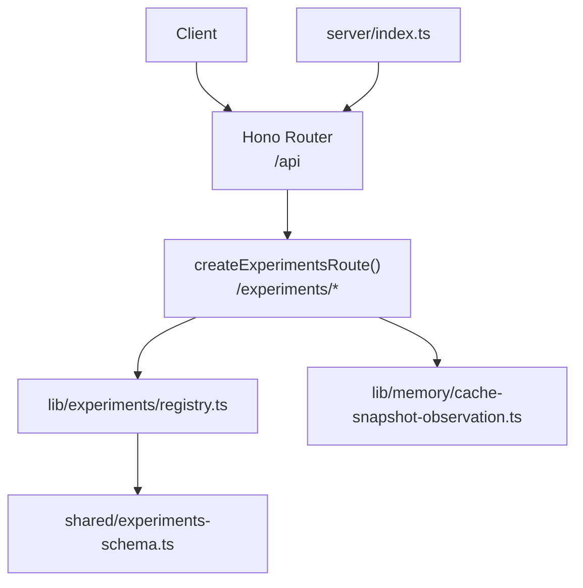
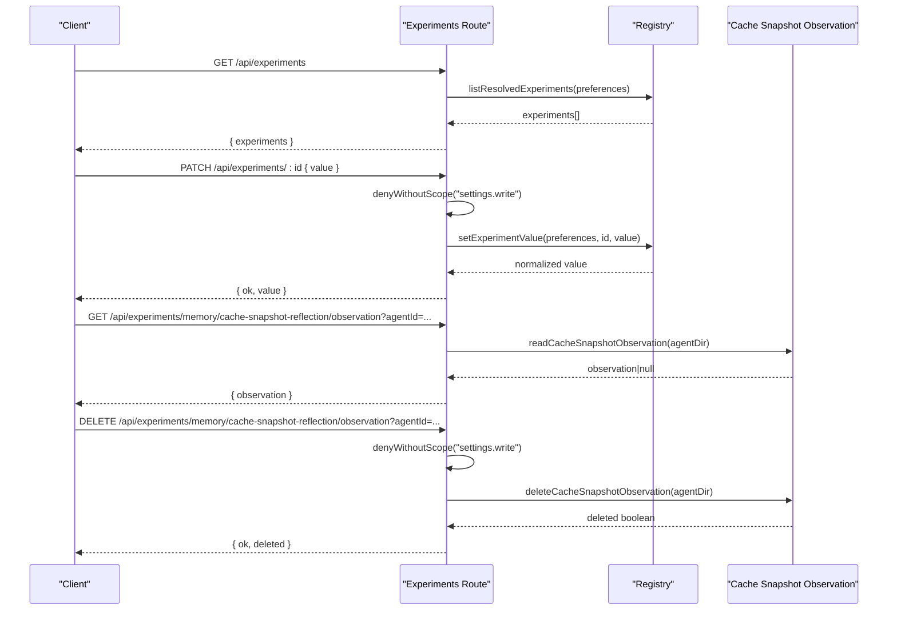
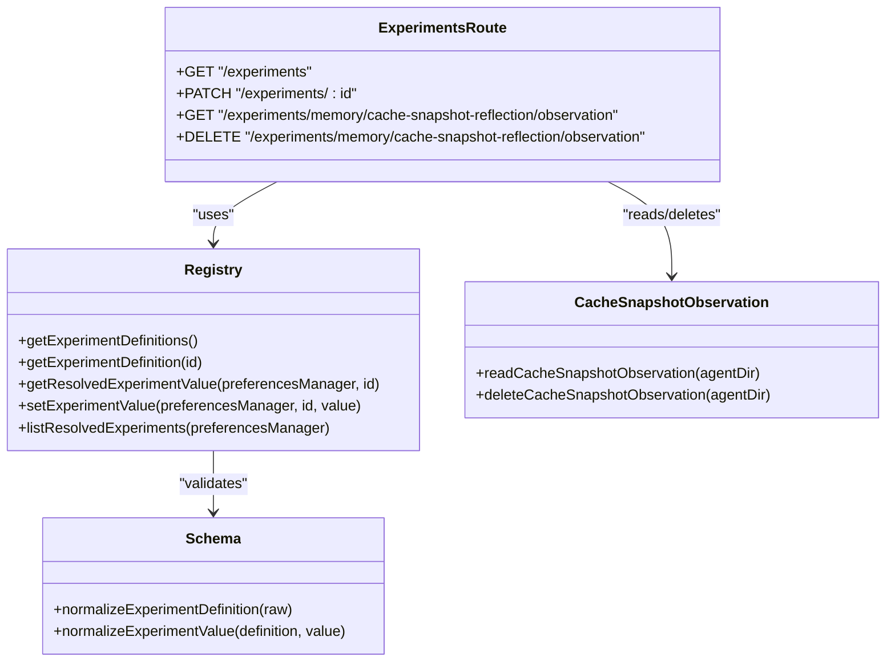

# Experiment Flags API

<cite>
**Referenced Files in This Document**
- [server/index.ts](file://server/index.ts)
- [server/routes/experiments.ts](file://server/routes/experiments.ts)
- [lib/experiments/registry.ts](file://lib/experiments/registry.ts)
- [shared/experiments-schema.ts](file://shared/experiments-schema.ts)
- [lib/memory/cache-snapshot-observation.ts](file://lib/memory/cache-snapshot-observation.ts)
- [desktop/src/react/settings/tabs/ExperimentsTab.tsx](file://desktop/src/react/settings/tabs/ExperimentsTab.tsx)
</cite>

## Table of Contents
1. [Introduction](#introduction)
2. [Project Structure](#project-structure)
3. [Core Components](#core-components)
4. [Architecture Overview](#architecture-overview)
5. [Detailed Component Analysis](#detailed-component-analysis)
6. [Dependency Analysis](#dependency-analysis)
7. [Performance Considerations](#performance-considerations)
8. [Troubleshooting Guide](#troubleshooting-guide)
9. [Conclusion](#conclusion)
10. [Appendices](#appendices)

## Introduction
This document provides detailed API documentation for experiment flag management endpoints exposed by the server. It covers HTTP methods, URL patterns, request/response schemas (with TypeScript interfaces), and feature toggle controls. It also documents the experiment lifecycle, safety mechanisms, and impact assessment tools available through the API.

The experiment system supports:
- Listing all experiments with their resolved values
- Updating a single experiment value (write-scoped)
- Observing and managing cache snapshot reflection diagnostics for an agent

## Project Structure
Experiment-related functionality is implemented across server routes, a registry of experiment definitions, schema validation utilities, and observation helpers for memory cache snapshots. The server mounts the experiments route under /api.

**Diagram sources**
- [server/index.ts:185](file://server/index.ts#L185)
- [server/routes/experiments.ts:30-74](file://server/routes/experiments.ts#L30-L74)
- [lib/experiments/registry.ts:159-203](file://lib/experiments/registry.ts#L159-L203)
- [shared/experiments-schema.ts:10-52](file://shared/experiments-schema.ts#L10-L52)
- [lib/memory/cache-snapshot-observation.ts:78-103](file://lib/memory/cache-snapshot-observation.ts#L78-L103)

**Section sources**
- [server/index.ts:185](file://server/index.ts#L185)
- [server/routes/experiments.ts:30-74](file://server/routes/experiments.ts#L30-L74)

## Core Components
- Experiments Route: Defines REST endpoints for listing and updating experiments and for observing cache snapshot reflection.
- Experiment Registry: Holds experiment definitions, resolves current values from preferences, and enforces scope and normalization rules.
- Experiment Schema: Validates and normalizes experiment definitions and values; defines allowed statuses, scopes, value types, and presentation types.
- Cache Snapshot Observation: Reads/writes/deletes per-agent observation files used to assess the impact of the cache snapshot reflection experiment.

Key responsibilities:
- Validation: All inputs are validated against the schema before being persisted or used.
- Scope enforcement: Only global experiments can be updated via this API.
- Safety: Write operations require settings.write capability; agent directory resolution is sanitized.

**Section sources**
- [server/routes/experiments.ts:30-74](file://server/routes/experiments.ts#L30-L74)
- [lib/experiments/registry.ts:159-203](file://lib/experiments/registry.ts#L159-L203)
- [shared/experiments-schema.ts:10-52](file://shared/experiments-schema.ts#L10-L52)
- [lib/memory/cache-snapshot-observation.ts:78-103](file://lib/memory/cache-snapshot-observation.ts#L78-L103)

## Architecture Overview
The client calls the server’s /api/experiments endpoints. The route handler validates requests, delegates to the registry for reading/updating experiment values, and uses observation helpers for diagnostic data.

**Diagram sources**
- [server/routes/experiments.ts:33-71](file://server/routes/experiments.ts#L33-L71)
- [lib/experiments/registry.ts:198-203](file://lib/experiments/registry.ts#L198-L203)
- [lib/memory/cache-snapshot-observation.ts:86-103](file://lib/memory/cache-snapshot-observation.ts#L86-L103)

## Detailed Component Analysis

### API Endpoints

#### List Experiments
- Method: GET
- Path: /api/experiments
- Auth: No explicit scope required by route
- Request body: None
- Response:
  - 200 OK: { experiments: ExperimentDefinitionWithResolvedValue[] }
  - 500 Internal Server Error: { error: string }

Notes:
- Returns all registered experiments with their resolved values based on current preferences.

**Section sources**
- [server/routes/experiments.ts:33-39](file://server/routes/experiments.ts#L33-L39)
- [lib/experiments/registry.ts:198-203](file://lib/experiments/registry.ts#L198-L203)

#### Update Experiment Value
- Method: PATCH
- Path: /api/experiments/:id
- Auth: Requires capability scope settings.write
- Request body: { value: any }
- Response:
  - 200 OK: { ok: true, value: any }
  - 400 Bad Request: { error: string }
  - 403 Forbidden: returned when capability check fails

Behavior:
- Validates that the experiment exists and has scope "global".
- Normalizes the provided value according to the experiment’s valueSchema.
- Persists the normalized value via preferences manager.

Examples:
- Enable a boolean experiment: PATCH /api/experiments/provider.deepseek_roleplay_reasoning_patch with { value: true }
- Set an enum experiment: PATCH /api/experiments/session.compaction_mode with { value: "cache_preserving" }
- Toggle paired toggles mapping: PATCH /api/experiments/memory.cache_snapshot_reflection with { value: "shadow" } or { value: "write" }

**Section sources**
- [server/routes/experiments.ts:41-51](file://server/routes/experiments.ts#L41-L51)
- [lib/experiments/registry.ts:185-196](file://lib/experiments/registry.ts#L185-L196)
- [shared/experiments-schema.ts:38-52](file://shared/experiments-schema.ts#L38-L52)

#### Read Cache Snapshot Reflection Observation
- Method: GET
- Path: /api/experiments/memory/cache-snapshot-reflection/observation
- Query params: agentId (required)
- Auth: No explicit scope required by route
- Response:
  - 200 OK: { observation: CacheSnapshotObservation | null }
  - 400 Bad Request: { error: string }

Behavior:
- Resolves agent directory safely using engine.getAgentDir or agentsDir fallback.
- Reads the latest observation file for the agent and returns normalized data.

**Section sources**
- [server/routes/experiments.ts:53-60](file://server/routes/experiments.ts#L53-L60)
- [lib/memory/cache-snapshot-observation.ts:86-93](file://lib/memory/cache-snapshot-observation.ts#L86-L93)

#### Delete Cache Snapshot Reflection Observation
- Method: DELETE
- Path: /api/experiments/memory/cache-snapshot-reflection/observation
- Query params: agentId (required)
- Auth: Requires capability scope settings.write
- Response:
  - 200 OK: { ok: true, deleted: boolean }
  - 400 Bad Request: { error: string }
  - 403 Forbidden: returned when capability check fails

Behavior:
- Resolves agent directory safely.
- Deletes the observation file if present and returns whether it was deleted.

**Section sources**
- [server/routes/experiments.ts:62-71](file://server/routes/experiments.ts#L62-L71)
- [lib/memory/cache-snapshot-observation.ts:95-103](file://lib/memory/cache-snapshot-observation.ts#L95-L103)

### Data Models and Schemas

#### Experiment Definition With Resolved Value
Represents a single experiment definition merged with its resolved runtime value.

Fields:
- id: string — Unique identifier for the experiment
- titleKey: string — i18n key for display title
- descriptionKey: string — i18n key for description
- owner: string — Owner category (e.g., session, provider, memory)
- scope: "global" | "agent" | "session" — Scope of the experiment
- defaultValue: any — Default value based on valueSchema type
- valueSchema: { type: "boolean" | "enum" | "number"; options?: Array<{ value: string; labelKey: string }>; presentation?: { type: "toggle" | "select" | "segmented" | "paired_toggles"; mapping?: Record<string, string> } }
- status: "alpha" | "beta" | "deprecated" | "retired"
- risk: string — Risk level metadata
- restartPolicy: string — Restart policy metadata
- targetHome: object — UI navigation metadata
- exitCriteria: string[] — Exit criteria metadata
- sunsetPolicy: object — Sunset policy metadata
- value: any — Resolved value after applying preferences and normalization

Validation constraints:
- id must be a non-empty string
- scope must be one of the allowed values
- status must be one of the allowed values
- valueSchema.type must be one of the allowed types
- For enum, options must be non-empty and include defaultValue
- Presentation type must be one of the allowed types

**Section sources**
- [shared/experiments-schema.ts:10-36](file://shared/experiments-schema.ts#L10-L36)
- [shared/experiments-schema.ts:38-52](file://shared/experiments-schema.ts#L38-L52)
- [lib/experiments/registry.ts:159-166](file://lib/experiments/registry.ts#L159-L166)
- [lib/experiments/registry.ts:198-203](file://lib/experiments/registry.ts#L198-L203)

#### Cache Snapshot Observation
Normalized observation record describing the last cache snapshot reflection attempt for an agent.

Fields:
- version: number
- agentId: string
- sessionPath: string
- trigger: string
- createdAt: string (ISO timestamp)
- mode: "shadow" | "write"
- status: "success" | "failed" | "skipped"
- reason: string
- usage: { model: string; cachedTokens: number; missTokens: number; latencyMs: number }
- summaryPreview: string
- memoryMdPreview: string
- baseMemoryMdHash: string
- cacheStrategy: string
- strict: boolean
- cachePrefixHash: string
- parentCachePrefixHash: string
- contractDiffs: string[]
- degradeReason: string
- diagnostics: { errorName: string; stack: string[]; requestModel: { id: string; provider: string; api: string; hasBaseUrl: boolean; hasQuirks: boolean } } | null

Normalization behavior:
- Ensures safe defaults for missing fields
- Enforces allowed enums for status and mode
- Truncates stack traces to a fixed length

**Section sources**
- [lib/memory/cache-snapshot-observation.ts:42-76](file://lib/memory/cache-snapshot-observation.ts#L42-L76)

### Feature Toggles and Controls

Supported value types and presentations:
- Boolean toggle: type "boolean", presentation "toggle"
- Enum selection: type "enum", presentation "select" or "segmented"
- Paired toggles: type "enum", presentation "paired_toggles" with mapping between UI toggles and internal values

Known experiments:
- session.compaction_mode (enum): compaction strategy selection
- provider.deepseek_roleplay_reasoning_patch (boolean): DeepSeek roleplay reasoning patch
- memory.cache_snapshot_reflection (enum): cache snapshot reflection modes ("off", "shadow", "write")
- subagent.proactive_delegation (boolean): proactive subagent delegation

These experiments are defined centrally and exposed via the list endpoint. Values are resolved from preferences and normalized before persistence.

**Section sources**
- [lib/experiments/registry.ts:16-155](file://lib/experiments/registry.ts#L16-L155)
- [shared/experiments-schema.ts:1-4](file://shared/experiments-schema.ts#L1-L4)

### Experiment Lifecycle and Safety Mechanisms

Lifecycle:
- Definitions are created with metadata including status, risk, restartPolicy, targetHome, exitCriteria, and sunsetPolicy.
- At runtime, getResolvedExperimentValue reads stored preferences and falls back to default if invalid or missing.
- setExperimentValue enforces scope and persists normalized values.

Safety:
- Input validation via normalizeExperimentDefinition and normalizeExperimentValue prevents invalid states.
- Scope enforcement ensures only global experiments can be updated via the API.
- Capability guard denies write operations without settings.write.
- Agent directory resolution sanitizes agentId to prevent path traversal.

Impact Assessment:
- Cache snapshot reflection observation endpoints provide visibility into the effect of enabling shadow/write modes.
- Clients can read the latest observation and optionally clear it to reset diagnostics.

**Section sources**
- [lib/experiments/registry.ts:174-196](file://lib/experiments/registry.ts#L174-L196)
- [server/routes/experiments.ts:41-71](file://server/routes/experiments.ts#L41-L71)
- [lib/memory/cache-snapshot-observation.ts:78-103](file://lib/memory/cache-snapshot-observation.ts#L78-L103)

## Dependency Analysis

**Diagram sources**
- [server/routes/experiments.ts:30-74](file://server/routes/experiments.ts#L30-L74)
- [lib/experiments/registry.ts:159-203](file://lib/experiments/registry.ts#L159-L203)
- [shared/experiments-schema.ts:10-52](file://shared/experiments-schema.ts#L10-L52)
- [lib/memory/cache-snapshot-observation.ts:78-103](file://lib/memory/cache-snapshot-observation.ts#L78-L103)

**Section sources**
- [server/routes/experiments.ts:30-74](file://server/routes/experiments.ts#L30-L74)
- [lib/experiments/registry.ts:159-203](file://lib/experiments/registry.ts#L159-L203)

## Performance Considerations
- Listing experiments is O(n) over the number of definitions and involves preference lookups; typically small and fast.
- Updating an experiment performs validation and persistence; ensure clients batch updates where possible.
- Reading/deleting observation files involve filesystem I/O; consider caching observations at the client side and polling less frequently.

[No sources needed since this section provides general guidance]

## Troubleshooting Guide
Common issues and resolutions:
- Invalid experiment ID: Ensure the id matches a known experiment definition. The registry will reject unknown ids.
- Invalid value: Confirm the value conforms to the experiment’s valueSchema (type, enum options, finite numbers).
- Non-global scope: Only global experiments can be updated via the API; attempts on agent/session scoped experiments will fail.
- Missing capability: Write endpoints require settings.write; verify client permissions.
- Agent directory unavailable: If engine.getAgentDir is not available and agentsDir is missing, observation endpoints will fail.

Error responses:
- 400 Bad Request: { error: string } for validation or input errors
- 403 Forbidden: Returned when capability checks fail
- 500 Internal Server Error: { error: string } for unexpected server-side failures

**Section sources**
- [server/routes/experiments.ts:41-71](file://server/routes/experiments.ts#L41-L71)
- [lib/experiments/registry.ts:168-196](file://lib/experiments/registry.ts#L168-L196)
- [shared/experiments-schema.ts:38-52](file://shared/experiments-schema.ts#L38-L52)

## Conclusion
The Experiment Flags API provides a robust mechanism for discovering and controlling experimental features. It enforces strong validation, scope restrictions, and capability-based security while offering diagnostic endpoints to assess the impact of certain experiments. Clients should rely on the list endpoint to discover supported experiments and use the update endpoint with appropriate values and capabilities.

[No sources needed since this section summarizes without analyzing specific files]

## Appendices

### Example Workflows

- Enable a boolean experiment:
  - PATCH /api/experiments/provider.deepseek_roleplay_reasoning_patch with { value: true }
  - Expect response { ok: true, value: true }

- Configure compaction mode:
  - PATCH /api/experiments/session.compaction_mode with { value: "cache_preserving" }
  - Expect response { ok: true, value: "cache_preserving" }

- Toggle cache snapshot reflection to shadow:
  - PATCH /api/experiments/memory.cache_snapshot_reflection with { value: "shadow" }
  - Expect response { ok: true, value: "shadow" }

- Observe cache snapshot reflection diagnostics:
  - GET /api/experiments/memory/cache-snapshot-reflection/observation?agentId=primary
  - Expect response { observation: CacheSnapshotObservation | null }

- Clear cache snapshot reflection diagnostics:
  - DELETE /api/experiments/memory/cache-snapshot-reflection/observation?agentId=primary
  - Expect response { ok: true, deleted: boolean }

**Section sources**
- [desktop/src/react/settings/tabs/ExperimentsTab.tsx:380-387](file://desktop/src/react/settings/tabs/ExperimentsTab.tsx#L380-L387)
- [desktop/src/react/settings/tabs/ExperimentsTab.tsx:193](file://desktop/src/react/settings/tabs/ExperimentsTab.tsx#L193)