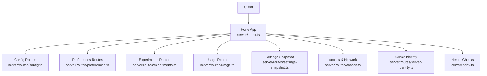
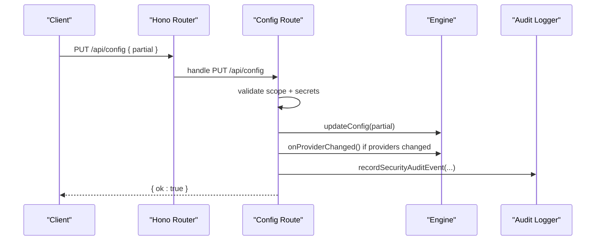
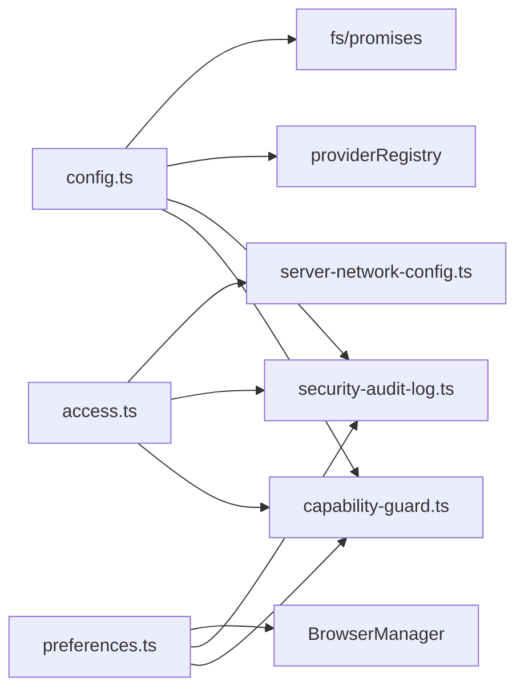

# System Administration API

<cite>
**Referenced Files in This Document**
- [server/index.ts](file://server/index.ts)
- [server/routes/config.ts](file://server/routes/config.ts)
- [server/routes/preferences.ts](file://server/routes/preferences.ts)
- [server/routes/experiments.ts](file://server/routes/experiments.ts)
- [server/routes/usage.ts](file://server/routes/usage.ts)
- [server/routes/settings-snapshot.ts](file://server/routes/settings-snapshot.ts)
- [server/routes/access.ts](file://server/routes/access.ts)
- [server/routes/server-identity.ts](file://server/routes/server-identity.ts)
- [core/config.ts](file://core/config.ts)
- [shared/config-schema.ts](file://shared/config-schema.ts)
- [core/metrics.ts](file://core/metrics.ts)
- [core/security-audit-log.ts](file://core/security-audit-log.ts)
</cite>

## Table of Contents
1. Introduction
2. Project Structure
3. Core Components
4. Architecture Overview
5. Detailed Component Analysis
6. Dependency Analysis
7. Performance Considerations
8. Troubleshooting Guide
9. Conclusion

## Introduction
This document provides comprehensive API documentation for system administration and configuration endpoints exposed by the server. It covers application settings, configuration management, experiment toggles, usage monitoring, backup/restore operations, and system health monitoring. For each endpoint, it specifies HTTP methods, URL patterns, request/response schemas (as TypeScript interfaces), parameter validation rules, status codes, and operational notes such as runtime configuration changes, environment variable management, performance metrics collection, audit logging, and backup/restore workflows.

## Project Structure
The server mounts multiple route modules under a common /api prefix. The key routes for system administration are:
- Configuration and agent content: /api/config, /api/system-prompt, /api/ishiki, /api/identity, /api/user-profile, /api/pinned, /api/memories/*
- Global preferences: /api/preferences/*
- Experiments: /api/experiments/*
- Usage ledger: /api/usage/*
- Settings snapshot: /api/settings/snapshot
- Access control and network: /api/access/*
- Server identity: /api/server/identity
- Health checks: /, /health, /api/health



**Diagram sources**
- [server/index.ts:164-209](file://server/index.ts#L164-L209)
- [server/routes/config.ts:189-745](file://server/routes/config.ts#L189-L745)
- [server/routes/preferences.ts:132-526](file://server/routes/preferences.ts#L132-L526)
- [server/routes/experiments.ts:30-74](file://server/routes/experiments.ts#L30-L74)
- [server/routes/usage.ts:3-39](file://server/routes/usage.ts#L3-L39)
- [server/routes/settings-snapshot.ts:199-251](file://server/routes/settings-snapshot.ts#L199-L251)
- [server/routes/access.ts:46-221](file://server/routes/access.ts#L46-L221)
- [server/routes/server-identity.ts:6-36](file://server/routes/server-identity.ts#L6-L36)
- [server/index.ts:77-84](file://server/index.ts#L77-L84)

**Section sources**
- [server/index.ts:164-209](file://server/index.ts#L164-L209)
- [server/index.ts:77-84](file://server/index.ts#L77-L84)

## Core Components
- Configuration Manager: Provides default configuration, persistence, and environment-based overrides. See core/config.ts.
- Global Config Schema: Declares which fields are global vs per-agent and their runtime setters/getters. See shared/config-schema.ts.
- Metrics Collector: Tracks uptime, memory, requests, chat/tool call counts, and average response time. See core/metrics.ts.
- Security Audit Log: Appends structured audit events to a JSONL file with secret masking. See core/security-audit-log.ts.

Key responsibilities:
- Persisting and merging configuration from disk and environment variables.
- Routing admin APIs to engine methods and storage backends.
- Emitting app events on configuration changes.
- Recording security audit events for sensitive mutations.

**Section sources**
- [core/config.ts:111-162](file://core/config.ts#L111-L162)
- [core/config.ts:170-233](file://core/config.ts#L170-L233)
- [core/config.ts:269-315](file://core/config.ts#L269-L315)
- [shared/config-schema.ts:22-43](file://shared/config-schema.ts#L22-L43)
- [core/metrics.ts:23-72](file://core/metrics.ts#L23-L72)
- [core/security-audit-log.ts:15-29](file://core/security-audit-log.ts#L15-L29)

## Architecture Overview
The server uses a Hono router to mount modular route handlers. Admin endpoints are grouped under /api. Each handler validates inputs, enforces capability scopes, updates engine state or persistent stores, emits app events, and records audit logs where applicable.



**Diagram sources**
- [server/index.ts:179-179](file://server/index.ts#L179-L179)
- [server/routes/config.ts:295-405](file://server/routes/config.ts#L295-L405)
- [core/security-audit-log.ts:15-29](file://core/security-audit-log.ts#L15-L29)

## Detailed Component Analysis

### Configuration Management (/api/config)
Endpoints:
- GET /api/config
- PUT /api/config
- GET /api/system-prompt
- GET /api/ishiki; PUT /api/ishiki
- GET /api/identity; PUT /api/identity
- GET /api/user-profile; PUT /api/user-profile
- GET /api/pinned; PUT /api/pinned
- GET /api/memories/health
- GET /api/memories; DELETE /api/memories
- GET /api/memories/compiled; DELETE /api/memories/compiled
- GET /api/memories/export; POST /api/memories/import
- POST /api/search/verify
- Workspace history: POST /api/config/workspaces/recent; DELETE /api/config/workspaces/recent; DELETE /api/config/workspaces/recent/all
- Default workspace: GET /api/config/default-workspace; POST /api/config/default-workspace

Request/Response Schemas (TypeScript):
```typescript
interface ConfigReadResponse {
  api?: Record<string, any>;
  embedding_api?: Record<string, any>;
  utility_api?: Record<string, any>;
  providers?: Record<string, ProviderSummary>;
  _raw?: RawConfig;
  security?: Record<string, any>;
  [key: string]: any; // other merged config fields
}

interface ProviderSummary {
  base_url: string;
  api: string;
  api_key: string; // masked
  headers: Record<string, string>; // masked
  models: string[];
  model_count: number;
}

interface RawConfig {
  api: { provider: string; base_url: string };
  embedding_api: { provider: string; base_url: string };
  utility_api: { provider: string; base_url: string };
}

interface UpdateConfigRequest {
  [key: string]: any; // partial config object
}

interface PromptResponse {
  content: string;
}

interface IshikiRequest {
  content: string;
}

interface IdentityRequest {
  content: string;
}

interface UserProfileRequest {
  content: string;
}

interface PinnedRequest {
  pins: string[];
}

interface MemoryHealthResponse {
  agentId: string;
  enabled: boolean;
  reason: string | null;
  status: "healthy" | "degraded" | "unhealthy" | "disabled" | "unavailable";
  steps: Record<string, MemoryStepHealth>;
  failedSteps: string[];
  maxFailCount: number;
  lastSuccessAt: string | null;
  lastErrorAt: string | null;
}

interface MemoryStepHealth {
  lastSuccessAt: string | null;
  lastErrorAt: string | null;
  lastErrorMsg: string | null;
  failCount: number;
}

interface MemoriesExportResponse {
  version: number;
  exportedAt: string;
  facts: MemoryFact[];
}

interface MemoryImportRequest {
  facts?: MemoryFact[];
  memories?: MemoryFactV1[];
}

interface MemoryFact {
  fact: string;
  tags: string[];
  time: string | null;
  session_id: string;
}

interface MemoryFactV1 {
  content: string;
  tags: string[];
  date: string | null;
  session_id: string;
}

interface SearchVerifyRequest {
  provider: string;
  search_provider?: string;
  api_key?: string;
}

interface SearchVerifyResponse {
  ok: boolean;
  error?: string;
}

interface WorkspaceHistoryRequest {
  path: string;
}

interface WorkspaceHistoryResponse {
  ok: boolean;
  cwd_history: string[];
}

interface DefaultWorkspaceResponse {
  path: string;
}
```

Validation Rules:
- PUT /api/config requires settings.write scope; provider mutations require providers.manage; secret mutations require appropriate secret scopes.
- Content fields must be strings; pins must be arrays of strings.
- Path parameters for workspaces must be normalized and validated as existing directories.
- Search verification requires provider and optional api_key depending on provider requirements.

Status Codes:
- 200 OK on success
- 400 Bad Request for invalid input or missing required fields
- 403 Forbidden when capability scopes are insufficient
- 404 Not Found for agent-related resources when not found
- 500 Internal Server Error on unexpected failures

Runtime Behavior:
- Global fields are routed via schema-driven setters on the engine.
- Provider changes trigger onProviderChanged and emit models-changed event.
- Changes to locale, editor, network_proxy, keep_awake emit corresponding app events.
- Secret values are masked in responses; audit events recorded for mutations.

Examples:
- Runtime configuration change: Send a partial object to PUT /api/config with top-level keys like thinking_level, sandbox, bridge.* etc.
- Environment variable management: Engine active provider resolution falls back to AGENT_API_KEY, AGENT_BASE_URL, AGENT_MODEL when no explicit provider is configured.

**Section sources**
- [server/routes/config.ts:189-745](file://server/routes/config.ts#L189-L745)
- [core/config.ts:269-315](file://core/config.ts#L269-L315)
- [shared/config-schema.ts:22-43](file://shared/config-schema.ts#L22-L43)

### Global Preferences (/api/preferences)
Endpoints:
- GET/PUT /api/preferences/models
- GET/PUT /api/preferences/appearance
- GET/PUT /api/preferences/notifications
- GET/PUT /api/preferences/quick-chat
- GET/PUT /api/preferences/browser; POST /api/preferences/browser/clear-cookies
- POST /api/preferences/setup-complete
- GET/PUT /api/preferences/workspace-ui-state
- GET/PUT /api/preferences/sidebar-ui
- GET/PUT /api/preferences/plugin-ui
- GET/PUT /api/preferences/computer-use; POST /api/preferences/computer-use/request-permissions; POST/DELETE /api/preferences/computer-use/approvals

Request/Response Schemas (TypeScript):
```typescript
interface ModelsPatch {
  models?: SharedModelsPatch;
  search?: SearchConfigPatch;
  utility_api?: UtilityApiPatch;
}

interface SharedModelsPatch {
  main?: string;
  small?: string;
  large?: string;
  vision?: string;
}

interface SearchConfigPatch {
  provider?: string;
  api_key?: string;
  api_keys?: Record<string, string>;
}

interface UtilityApiPatch {
  provider?: string;
  base_url?: string;
  api_key?: string;
}

interface AppearancePatch {
  theme?: string;
  serif?: boolean;
  paperTexture?: boolean;
  leavesOverlay?: boolean;
  [key: string]: any;
}

interface NotificationPreferencesPatch {
  [key: string]: any;
}

interface QuickChatPreferencesPatch {
  [key: string]: any;
}

interface BrowserPreferencesPatch {
  [key: string]: any;
}

interface WorkspaceUiStatePatch {
  workspace: string;
  surface: string;
  state: Record<string, any>;
}

interface SidebarUiPatch {
  sidebarUi: Record<string, any>;
}

interface PluginUiPatch {
  [key: string]: any;
}

interface ComputerUsePatch {
  settings: Record<string, any>;
}

interface ComputerUseApprovalRequest {
  providerId?: string;
  appId?: string;
}
```

Validation Rules:
- Mutations require settings.write scope; secret mutations require secret mutation scopes.
- Vision model selection must support image input.
- Browser preferences apply immediately via browser manager.
- Computer Use endpoints are platform-gated and may require permissions.

Status Codes:
- 200 OK on success
- 400 Bad Request for invalid input or unsupported platform
- 403 Forbidden for insufficient scopes
- 500 Internal Server Error on unexpected failures

Runtime Behavior:
- Updates emit app events (e.g., models-changed, theme-changed).
- Model sync may be triggered after patching shared models.

**Section sources**
- [server/routes/preferences.ts:132-526](file://server/routes/preferences.ts#L132-L526)

### Experiments (/api/experiments)
Endpoints:
- GET /api/experiments
- PATCH /api/experiments/:id
- GET /api/experiments/memory/cache-snapshot-reflection/observation?agentId=...
- DELETE /api/experiments/memory/cache-snapshot-reflection/observation?agentId=...

Request/Response Schemas (TypeScript):
```typescript
interface ExperimentEntry {
  id: string;
  value: any;
  description?: string;
}

interface ExperimentsListResponse {
  experiments: ExperimentEntry[];
}

interface SetExperimentRequest {
  value: any;
}

interface CacheSnapshotObservationResponse {
  observation: Record<string, any>;
}
```

Validation Rules:
- PATCH requires settings.write scope.
- agentId query param must be valid and non-empty.

Status Codes:
- 200 OK on success
- 400 Bad Request for invalid input
- 403 Forbidden for insufficient scopes
- 500 Internal Server Error on unexpected failures

**Section sources**
- [server/routes/experiments.ts:30-74](file://server/routes/experiments.ts#L30-L74)

### Usage Monitoring (/api/usage)
Endpoint:
- GET /api/usage/llm?since=&until=&attributionKind=&sessionPath=&agentId=&subsystem=&operation=&modelId=&provider=&status=&limit=

Request/Response Schemas (TypeScript):
```typescript
interface UsageFilter {
  since?: string;
  until?: string;
  attributionKind?: string;
  sessionPath?: string;
  agentId?: string;
  subsystem?: string;
  operation?: string;
  modelId?: string;
  provider?: string;
  status?: string;
  limit?: number;
}

interface UsageRecord {
  [key: string]: any;
}

interface UsageListResponse {
  items: UsageRecord[];
}
```

Validation Rules:
- limit defaults to 500 unless a date window is provided; capped at 2000; "all" disables limit.

Status Codes:
- 200 OK on success
- 500 Internal Server Error on unexpected failures

**Section sources**
- [server/routes/usage.ts:3-39](file://server/routes/usage.ts#L3-L39)

### Settings Snapshot (/api/settings/snapshot)
Endpoint:
- GET /api/settings/snapshot?agentId=...

Request/Response Schemas (TypeScript):
```typescript
interface SettingsSnapshotResponse {
  agentId: string;
  config: Record<string, any>;
  identity: string;
  ishiki: string;
  publicIshiki: string;
  userProfile: string;
  experience: string;
  pinned: { pins: string[] };
  globalModels: Record<string, any>;
  preferences: {
    quickChat: Record<string, any>;
    browser: Record<string, any>;
    notifications: Record<string, any>;
    bridge: Record<string, any>;
    computerUse: Record<string, any>;
    imageGeneration: Record<string, any>;
    speechRecognition: Record<string, any>;
    experiments: ExperimentEntry[];
  };
  access: Record<string, any> | null;
  bridgeStatus: Record<string, any> | null;
  plugins: Record<string, any>;
}
```

Validation Rules:
- agentId resolves to current or primary agent if omitted; must exist.

Status Codes:
- 200 OK on success
- 500 Internal Server Error on unexpected failures

**Section sources**
- [server/routes/settings-snapshot.ts:199-251](file://server/routes/settings-snapshot.ts#L199-L251)

### Access Control and Network (/api/access)
Endpoints:
- GET /api/access/summary
- GET /api/access/mobile-qr.svg?port=...
- PUT /api/access/network { mode, listenPort }
- POST /api/access/mobile-credentials { displayName?, expiresAt?, scopes? }
- POST /api/access/desktop-credentials { displayName?, expiresAt?, scopes? }
- PUT /api/access/account/profile { username?, displayName? }
- PUT /api/access/account/password { password? }
- DELETE /api/access/account/password

Request/Response Schemas (TypeScript):
```typescript
interface NetworkUpdateRequest {
  mode: "loopback" | "lan";
  listenPort: number;
}

interface NetworkSummary {
  mode: string;
  listenHost: string;
  configuredPort: number;
  actualPort: number;
  runtimeMode: string;
  runtimeHost: string;
  restartRequired: boolean;
  lanAddresses: string[];
  localServerUrl: string;
  candidateLanServerUrl: string | null;
  lanServerUrl: string | null;
  localMobileUrl: string;
  candidateLanMobileUrl: string | null;
  lanMobileUrl: string | null;
  localDesktopUrl: string;
  candidateLanDesktopUrl: string | null;
  lanDesktopUrl: string | null;
}

interface CredentialIssueRequest {
  displayName?: string;
  expiresAt?: string | null;
  scopes?: string[];
}

interface CredentialIssueResponse {
  ok: boolean;
  secret: string;
  accessUrl: string;
  device: Record<string, any>;
  credential: Record<string, any>;
}

interface AccountProfileUpdateRequest {
  username?: string;
  displayName?: string;
}

interface AccountPasswordUpdateRequest {
  password?: string;
}
```

Validation Rules:
- Local owner principal required for all endpoints.
- Mode must be loopback or lan; port must be between 1024 and 65535.
- Scopes must include required ones and be allowed by profile.

Status Codes:
- 200 OK on success
- 400 Bad Request for invalid input
- 403 Forbidden for non-local-owner principals
- 500 Internal Server Error on unexpected failures

Backup/Restore Operations:
- Backup policy integration exists in execution boundaries; UI exposes checkpoint listing and restore actions.
- Restore flows are typically initiated from the desktop UI using checkpoint IDs.

**Section sources**
- [server/routes/access.ts:46-221](file://server/routes/access.ts#L46-L221)
- [desktop/src/react/settings/tabs/SecurityTab.tsx:236-265](file://desktop/src/react/settings/tabs/SecurityTab.tsx#L236-L265)

### Server Identity (/api/server/identity)
Endpoint:
- GET /api/server/identity

Request/Response Schemas (TypeScript):
```typescript
interface ServerIdentityResponse {
  serverNodeId: string;
  userId: string;
  studioId: string;
  connectionKind: string;
  trustState: string;
  authState: string;
  credentialKind: string;
  platformAccountId: string | null;
  officialServiceKind: string | null;
  capabilities: string[];
  appVersion: string;
}
```

Validation Rules:
- Self-heals runtime context if unavailable.

Status Codes:
- 200 OK on success
- 500 Internal Server Error on registry errors

**Section sources**
- [server/routes/server-identity.ts:6-36](file://server/routes/server-identity.ts#L6-L36)

### Health Checks
Endpoints:
- GET /
- GET /health
- GET /api/health

Request/Response Schemas (TypeScript):
```typescript
interface HealthResponse {
  name?: string;
  version?: string;
  status?: string;
  ok?: boolean;
}
```

Status Codes:
- 200 OK on success

**Section sources**
- [server/index.ts:77-84](file://server/index.ts#L77-L84)

## Dependency Analysis
Admin routes depend on:
- Engine methods for runtime state and persistence (updateConfig, setSearchConfig, setUtilityApi, getSharedModels, etc.)
- Capability guards for authorization and secret mutation policies
- Security audit logger for recording sensitive operations
- Provider registry for saving provider configurations and triggering model refreshes
- File system for reading/writing agent files (ishiki.md, identity.md, user.md, pinned.md)



**Diagram sources**
- [server/routes/config.ts:295-405](file://server/routes/config.ts#L295-L405)
- [server/routes/preferences.ts:163-236](file://server/routes/preferences.ts#L163-L236)
- [server/routes/access.ts:85-115](file://server/routes/access.ts#L85-L115)
- [core/security-audit-log.ts:15-29](file://core/security-audit-log.ts#L15-L29)

**Section sources**
- [server/routes/config.ts:295-405](file://server/routes/config.ts#L295-L405)
- [server/routes/preferences.ts:163-236](file://server/routes/preferences.ts#L163-L236)
- [server/routes/access.ts:85-115](file://server/routes/access.ts#L85-L115)

## Performance Considerations
- Usage queries default to a limit of 500 unless a date window is specified; cap enforced at 2000 to avoid heavy payloads.
- Provider changes trigger model synchronization; batch updates to minimize repeated syncs.
- Masking secrets and computing summaries add overhead; cache results where possible.
- Memory health aggregation normalizes step data and computes statuses; avoid frequent polling in tight loops.

[No sources needed since this section provides general guidance]

## Troubleshooting Guide
Common issues and resolutions:
- Insufficient scopes: Ensure the client has settings.write and relevant secret mutation scopes for mutating endpoints.
- Invalid paths: Workspace history endpoints require normalized, existing directory paths.
- Platform restrictions: Computer Use endpoints are gated by platform support; check platform availability before calling.
- OAuth flow timeouts: Start flows within supported windows; poll status appropriately.
- Audit log location: Security audit events are appended to logs/security-audit.jsonl under the shadow home directory.

Operational tips:
- Use /api/settings/snapshot to inspect the full effective configuration for an agent.
- Use /api/usage/llm with filters to diagnose model usage anomalies.
- Use /api/memories/health to monitor memory pipeline health and identify failing steps.

**Section sources**
- [server/routes/preferences.ts:447-523](file://server/routes/preferences.ts#L447-L523)
- [server/routes/config.ts:583-660](file://server/routes/config.ts#L583-L660)
- [core/security-audit-log.ts:10-13](file://core/security-audit-log.ts#L10-L13)

## Conclusion
The system administration API provides robust controls over configuration, preferences, experiments, usage monitoring, access control, and health checks. Endpoints enforce strict validation and capability scoping, mask sensitive data, and record audit events. Administrators can perform runtime configuration changes, manage environment-backed providers, collect performance metrics, and maintain backups through integrated UI flows.

[No sources needed since this section summarizes without analyzing specific files]