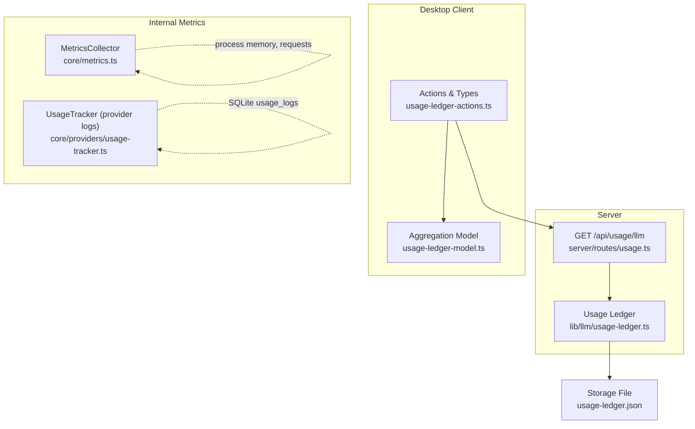
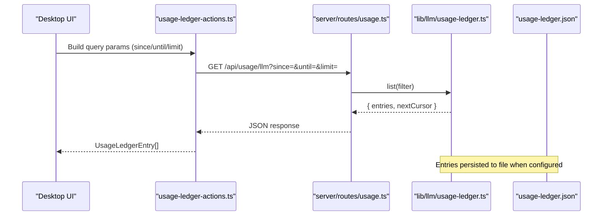
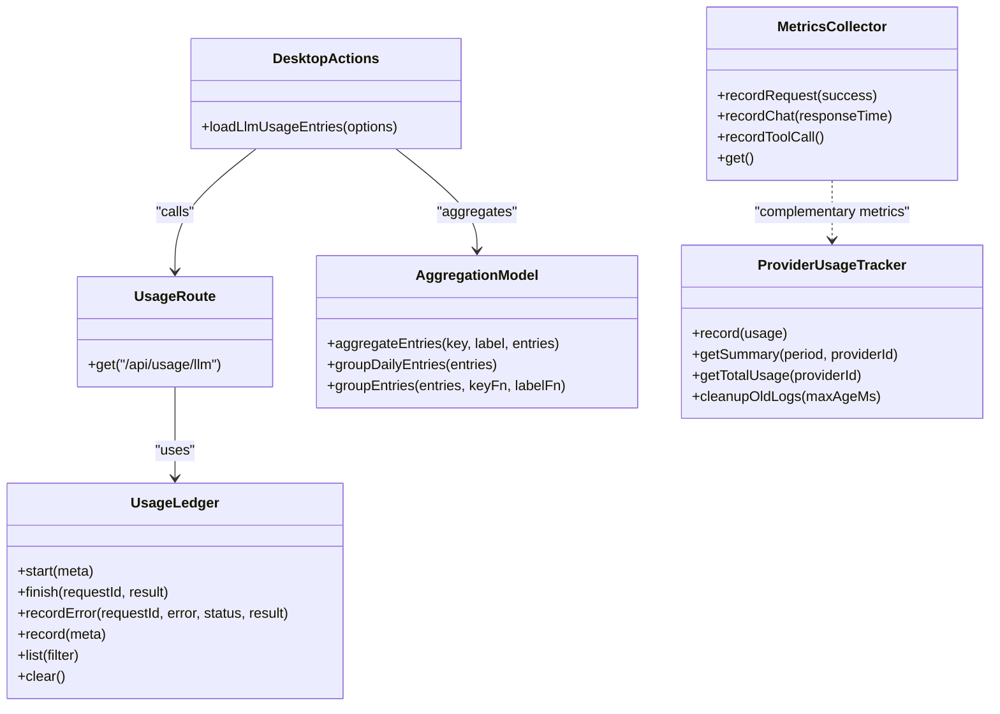

# Usage Monitoring API

<cite>
**Referenced Files in This Document**
- [server/routes/usage.ts](file://server/routes/usage.ts)
- [lib/llm/usage-ledger.ts](file://lib/llm/usage-ledger.ts)
- [desktop/src/react/settings/tabs/providers/usage-ledger-actions.ts](file://desktop/src/react/settings/tabs/providers/usage-ledger-actions.ts)
- [desktop/src/react/settings/tabs/providers/usage-ledger-model.ts](file://desktop/src/react/settings/tabs/providers/usage-ledger-model.ts)
- [core/metrics.ts](file://core/metrics.ts)
- [core/providers/usage-tracker.ts](file://core/providers/usage-tracker.ts)
- [usage-ledger.json](file://usage-ledger.json)
</cite>

## Table of Contents
1. Introduction
2. Project Structure
3. Core Components
4. Architecture Overview
5. Detailed Component Analysis
6. Dependency Analysis
7. Performance Considerations
8. Troubleshooting Guide
9. Conclusion

## Introduction
This document provides comprehensive API documentation for usage monitoring and metrics collection endpoints exposed by the server, along with client-side consumption patterns and data models. It covers:
- HTTP methods and URL patterns
- Request and response schemas using TypeScript interfaces
- Metric types (token usage, API calls, storage consumption)
- Examples of usage analytics, cost tracking, performance metrics, and resource utilization reports
- Data retention policies, aggregation intervals, and export formats

The primary endpoint is a read-only listing of LLM usage ledger entries, complemented by internal metrics collectors and provider-level usage trackers used elsewhere in the system.

## Project Structure
The usage monitoring feature spans server routes, an in-memory/persisted usage ledger, and desktop UI consumers that aggregate and visualize data.

**Diagram sources**
- [server/routes/usage.ts:1-39](file://server/routes/usage.ts#L1-L39)
- [lib/llm/usage-ledger.ts:1-302](file://lib/llm/usage-ledger.ts#L1-L302)
- [desktop/src/react/settings/tabs/providers/usage-ledger-actions.ts:1-110](file://desktop/src/react/settings/tabs/providers/usage-ledger-actions.ts#L1-L110)
- [desktop/src/react/settings/tabs/providers/usage-ledger-model.ts:1-139](file://desktop/src/react/settings/tabs/providers/usage-ledger-model.ts#L1-L139)
- [core/metrics.ts:1-78](file://core/metrics.ts#L1-L78)
- [core/providers/usage-tracker.ts:1-130](file://core/providers/usage-tracker.ts#L1-L130)
- [usage-ledger.json:1-53](file://usage-ledger.json#L1-L53)

**Section sources**
- [server/routes/usage.ts:1-39](file://server/routes/usage.ts#L1-L39)
- [lib/llm/usage-ledger.ts:1-302](file://lib/llm/usage-ledger.ts#L1-L302)
- [desktop/src/react/settings/tabs/providers/usage-ledger-actions.ts:1-110](file://desktop/src/react/settings/tabs/providers/usage-ledger-actions.ts#L1-L110)
- [desktop/src/react/settings/tabs/providers/usage-ledger-model.ts:1-139](file://desktop/src/react/settings/tabs/providers/usage-ledger-model.ts#L1-L139)
- [core/metrics.ts:1-78](file://core/metrics.ts#L1-L78)
- [core/providers/usage-tracker.ts:1-130](file://core/providers/usage-tracker.ts#L1-L130)
- [usage-ledger.json:1-53](file://usage-ledger.json#L1-L53)

## Core Components
- Server route GET /api/usage/llm: Accepts query filters and returns paginated usage entries from the usage ledger.
- Usage Ledger: In-process store with optional JSON persistence; supports filtering, limiting, and normalization of usage records.
- Desktop Actions: Builds query parameters and validates responses for the usage endpoint.
- Aggregation Model: Groups and aggregates entries into daily/category/model views and computes derived metrics like cache hit rate.
- Internal Metrics Collector: Tracks process uptime, memory, request counts, agent chat/tool call counts, and average response time.
- Provider Usage Tracker: Records per-provider token usage and latency to SQLite, with summary and cleanup utilities.

**Section sources**
- [server/routes/usage.ts:1-39](file://server/routes/usage.ts#L1-L39)
- [lib/llm/usage-ledger.ts:1-302](file://lib/llm/usage-ledger.ts#L1-L302)
- [desktop/src/react/settings/tabs/providers/usage-ledger-actions.ts:1-110](file://desktop/src/react/settings/tabs/providers/usage-ledger-actions.ts#L1-L110)
- [desktop/src/react/settings/tabs/providers/usage-ledger-model.ts:1-139](file://desktop/src/react/settings/tabs/providers/usage-ledger-model.ts#L1-L139)
- [core/metrics.ts:1-78](file://core/metrics.ts#L1-L78)
- [core/providers/usage-tracker.ts:1-130](file://core/providers/usage-tracker.ts#L1-L130)

## Architecture Overview
The usage monitoring flow starts at the desktop client, which queries the server’s usage endpoint. The server delegates to the usage ledger, which normalizes and persists entries. The client then aggregates entries for visualization.

**Diagram sources**
- [desktop/src/react/settings/tabs/providers/usage-ledger-actions.ts:67-95](file://desktop/src/react/settings/tabs/providers/usage-ledger-actions.ts#L67-L95)
- [server/routes/usage.ts:6-36](file://server/routes/usage.ts#L6-L36)
- [lib/llm/usage-ledger.ts:128-143](file://lib/llm/usage-ledger.ts#L128-L143)
- [usage-ledger.json:1-53](file://usage-ledger.json#L1-L53)

## Detailed Component Analysis

### Endpoint: GET /api/usage/llm
- Method: GET
- Path: /api/usage/llm
- Purpose: Retrieve recent LLM usage ledger entries with optional filtering and pagination.

Query Parameters
- since: ISO-8601 timestamp string; filter entries ended on or after this time.
- until: ISO-8601 timestamp string; filter entries started on or before this time.
- attributionKind: Filter by attribution kind (e.g., “memory”).
- sessionPath: Filter by attribution session path.
- agentId: Filter by attribution agent ID.
- subsystem: Filter by source subsystem.
- operation: Filter by source operation.
- modelId: Filter by model identifier.
- provider: Filter by model provider.
- status: Filter by entry status (“ok”, “error”, “aborted”, “usage_missing”).
- limit: Integer or “all”. Defaults to 500 if no date window provided; otherwise unlimited within max cap.

Response Schema
- entries: Array of UsageLedgerEntry objects.
- nextCursor: Always null for this endpoint.

Filtering Logic
- Date windows are enforced via since/until against endedAt/startedAt.
- Additional filters match fields on source, attribution, model, and status.
- Limit is normalized and capped internally.

Example Request
- GET /api/usage/llm?since=2026-07-01T00:00:00Z&until=2026-07-07T23:59:59Z&status=ok&limit=200

Example Response
- { "entries": [ ... ], "nextCursor": null }

Notes
- If limit is omitted and no date window is provided, a default limit applies.
- Unknown or invalid values are ignored or normalized by the ledger.

**Section sources**
- [server/routes/usage.ts:6-36](file://server/routes/usage.ts#L6-L36)
- [lib/llm/usage-ledger.ts:128-143](file://lib/llm/usage-ledger.ts#L128-L143)
- [lib/llm/usage-ledger.ts:239-258](file://lib/llm/usage-ledger.ts#L239-L258)

### Data Models (TypeScript Interfaces)

UsageLedgerEntry
- requestId: string
- startedAt: string (ISO-8601)
- endedAt: string | null (ISO-8601)
- durationMs: number | null
- status: "ok" | "error" | "aborted" | "usage_missing"
- source: object with optional fields subsystem, operation, surface, trigger, actor, parent
- attribution: object with optional fields kind, agentId, sessionPath, conversationId, conversationType, childAgentId, childSessionPath, taskId
- model: object with optional fields provider, modelId, api
- usage: NormalizedUsage | null
- error: { name: string | null, message: string | null } | null

NormalizedUsage
- input?: { totalTokens?: number | null, uncachedTokens?: number | null }
- output?: { totalTokens?: number | null, reasoningTokens?: number | null }
- cache?: { readTokens?: number | null, writeTokens?: number | null, missTokens?: number | null, hit?: boolean | null, created?: boolean | null, hitRatio?: number | null, support?: string | null }
- totalTokens?: number | null
- costTotal?: number | null

UsageAggregate (client-side aggregation)
- key: string
- label: string
- entries: UsageLedgerEntry[]
- requests: number
- ok: number
- errors: number
- inputTokens: number
- outputTokens: number
- cacheReadTokens: number
- cacheWriteTokens: number
- nonCachedTokens: number
- totalTokens: number
- costTotal: number
- cacheHitCount: number
- cacheObservedCount: number

Provider UsageRecord (internal tracker)
- id: string
- providerId: string
- model: string
- promptTokens: number
- completionTokens: number
- totalTokens: number
- latencyMs: number
- timestamp: number
- sessionId: string

Provider UsageSummary (internal tracker)
- providerId: string
- model: string
- totalRequests: number
- totalPromptTokens: number
- totalCompletionTokens: number
- totalTokens: number
- avgLatencyMs: number
- period: "hour" | "day" | "week" | "month"

System Metrics (internal collector)
- uptime: number
- memoryUsage: { used: number, total: number }
- requests: { total: number, success: number, error: number }
- agent: { chats: number, toolCalls: number, avgResponseTime: number }
- storage: { totalMemories: number, avgImportance: number }

**Section sources**
- [desktop/src/react/settings/tabs/providers/usage-ledger-actions.ts:3-59](file://desktop/src/react/settings/tabs/providers/usage-ledger-actions.ts#L3-L59)
- [desktop/src/react/settings/tabs/providers/usage-ledger-model.ts:6-22](file://desktop/src/react/settings/tabs/providers/usage-ledger-model.ts#L6-L22)
- [core/providers/usage-tracker.ts:3-24](file://core/providers/usage-tracker.ts#L3-L24)
- [core/metrics.ts:1-21](file://core/metrics.ts#L1-L21)

### Usage Ledger Implementation Details
- start(meta): Begins tracking a request; returns requestId and startedAt.
- finish(requestId, result): Completes a successful request; sets status “ok” and normalizes usage.
- recordError(requestId, error, status, result): Records failure or aborted states; preserves partial usage if present.
- record(meta): Convenience method to start and finish in one call.
- list(filter): Returns filtered and limited entries; always includes nextCursor set to null.
- clear(): Clears in-memory entries and persists empty state.

Normalization and Persistence
- Entries are normalized for schemaVersion, timestamps, model, usage shape, and error structure.
- Optional JSON file persistence writes versioned entries atomically.

Filtering Rules
- Supports date range, status, attribution kind/session/agent, source subsystem/operation, model provider/modelId.

**Section sources**
- [lib/llm/usage-ledger.ts:14-143](file://lib/llm/usage-ledger.ts#L14-L143)
- [lib/llm/usage-ledger.ts:175-233](file://lib/llm/usage-ledger.ts#L175-L233)
- [lib/llm/usage-ledger.ts:239-258](file://lib/llm/usage-ledger.ts#L239-L258)

### Client-Side Consumption and Aggregation
- Actions build query parameters, normalize limits, and validate responses.
- Aggregation functions group entries by day, category, or model and compute totals and derived metrics such as cache hit rate.

Key behaviors
- Default limit applied when no date window is specified.
- Daily grouping uses local date keys based on endedAt or startedAt.
- Hit rate computed only when cache observations exist.

**Section sources**
- [desktop/src/react/settings/tabs/providers/usage-ledger-actions.ts:67-109](file://desktop/src/react/settings/tabs/providers/usage-ledger-actions.ts#L67-L109)
- [desktop/src/react/settings/tabs/providers/usage-ledger-model.ts:34-72](file://desktop/src/react/settings/tabs/providers/usage-ledger-model.ts#L34-L72)
- [desktop/src/react/settings/tabs/providers/usage-ledger-model.ts:195-228](file://desktop/src/react/settings/tabs/providers/usage-ledger-model.ts#L195-L228)
- [desktop/src/react/settings/tabs/providers/usage-ledger-model.ts:136-139](file://desktop/src/react/settings/tabs/providers/usage-ledger-model.ts#L136-L139)

### Internal Metrics and Provider Usage Tracking
- MetricsCollector tracks process uptime, memory, request counts, agent chat/tool call counts, and average response time.
- UsageTracker records provider-level token usage and latency to SQLite, with summaries by period and cleanup of old logs.

Use cases
- System health dashboards (uptime, memory, request success/error rates).
- Cost estimation via token totals and latency averages.
- Storage insights via aggregated memory counts and importance scores (placeholder fields).

**Section sources**
- [core/metrics.ts:23-72](file://core/metrics.ts#L23-L72)
- [core/providers/usage-tracker.ts:26-127](file://core/providers/usage-tracker.ts#L26-L127)

## Dependency Analysis
The following diagram shows how components depend on each other for usage monitoring.

**Diagram sources**
- [server/routes/usage.ts:1-39](file://server/routes/usage.ts#L1-L39)
- [lib/llm/usage-ledger.ts:14-143](file://lib/llm/usage-ledger.ts#L14-L143)
- [desktop/src/react/settings/tabs/providers/usage-ledger-actions.ts:67-109](file://desktop/src/react/settings/tabs/providers/usage-ledger-actions.ts#L67-L109)
- [desktop/src/react/settings/tabs/providers/usage-ledger-model.ts:34-72](file://desktop/src/react/settings/tabs/providers/usage-ledger-model.ts#L34-L72)
- [core/metrics.ts:23-72](file://core/metrics.ts#L23-L72)
- [core/providers/usage-tracker.ts:26-127](file://core/providers/usage-tracker.ts#L26-L127)

**Section sources**
- [server/routes/usage.ts:1-39](file://server/routes/usage.ts#L1-L39)
- [lib/llm/usage-ledger.ts:14-143](file://lib/llm/usage-ledger.ts#L14-L143)
- [desktop/src/react/settings/tabs/providers/usage-ledger-actions.ts:67-109](file://desktop/src/react/settings/tabs/providers/usage-ledger-actions.ts#L67-L109)
- [desktop/src/react/settings/tabs/providers/usage-ledger-model.ts:34-72](file://desktop/src/react/settings/tabs/providers/usage-ledger-model.ts#L34-L72)
- [core/metrics.ts:23-72](file://core/metrics.ts#L23-L72)
- [core/providers/usage-tracker.ts:26-127](file://core/providers/usage-tracker.ts#L26-L127)

## Performance Considerations
- Query Limits: The server caps limit values to prevent large payloads; defaults apply when no date window is provided.
- Filtering Efficiency: Use precise date windows and specific filters (modelId, provider, subsystem) to reduce result sets.
- Aggregation Load: Client-side aggregation can be expensive for large datasets; prefer narrower queries and smaller limits.
- Persistence Overhead: Frequent writes to the usage ledger file may impact I/O; consider batching or adjusting max entries.

[No sources needed since this section provides general guidance]

## Troubleshooting Guide
Common issues and resolutions:
- Empty results: Ensure date filters are valid and inclusive; verify that entries have endedAt/startedAt within the requested window.
- Missing usage data: Status “usage_missing” indicates incomplete usage reporting; check upstream recording paths.
- Excessive payload size: Reduce limit or narrow filters; avoid omitting both since and until without specifying limit.
- Stale data: Confirm the usage ledger file exists and is readable; restart the server if necessary to reload persisted entries.

**Section sources**
- [lib/llm/usage-ledger.ts:146-173](file://lib/llm/usage-ledger.ts#L146-L173)
- [lib/llm/usage-ledger.ts:223-228](file://lib/llm/usage-ledger.ts#L223-L228)

## Conclusion
The Usage Monitoring API provides a robust mechanism to retrieve and analyze LLM usage data through a simple GET endpoint with flexible filtering. Combined with client-side aggregation and internal metrics collectors, it enables comprehensive insights into token usage, costs, performance, and resource utilization. Proper use of date windows and limits ensures efficient querying, while persistence guarantees durability across sessions.

[No sources needed since this section summarizes without analyzing specific files]

## Appendices

### Example Analytics Scenarios
- Usage Analytics: Group entries by day to observe trends in total tokens and costs.
- Cost Tracking: Sum costTotal across entries; optionally weight by provider pricing if available.
- Performance Metrics: Compute average durationMs and latencyMs across providers/models.
- Resource Utilization Reports: Aggregate cache hit ratios and non-cached tokens to assess caching effectiveness.

[No sources needed since this section provides conceptual examples]

### Data Retention Policies
- Usage Ledger: Maintains up to a configurable maximum number of entries; oldest entries are pruned on append.
- Provider Logs: Cleanup utility removes logs older than a configurable age (default ~90 days).

**Section sources**
- [lib/llm/usage-ledger.ts:11-22](file://lib/llm/usage-ledger.ts#L11-L22)
- [core/providers/usage-tracker.ts:117-126](file://core/providers/usage-tracker.ts#L117-L126)

### Aggregation Intervals
- Supported periods for provider summaries: hour, day, week, month.
- Client-side daily grouping uses local calendar days based on entry timestamps.

**Section sources**
- [core/providers/usage-tracker.ts:55-99](file://core/providers/usage-tracker.ts#L55-L99)
- [desktop/src/react/settings/tabs/providers/usage-ledger-model.ts:195-228](file://desktop/src/react/settings/tabs/providers/usage-ledger-model.ts#L195-L228)

### Export Formats
- JSON: The usage ledger stores and returns JSON arrays of entries.
- CSV/Other: Not natively supported by the API; clients can transform JSON to desired formats.

**Section sources**
- [usage-ledger.json:1-53](file://usage-ledger.json#L1-L53)
- [lib/llm/usage-ledger.ts:162-173](file://lib/llm/usage-ledger.ts#L162-L173)