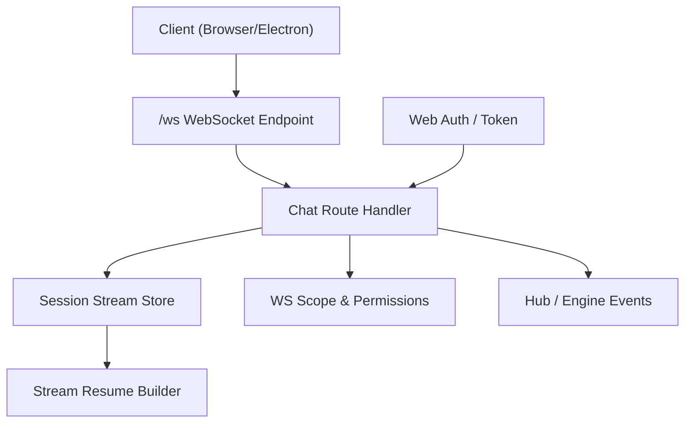
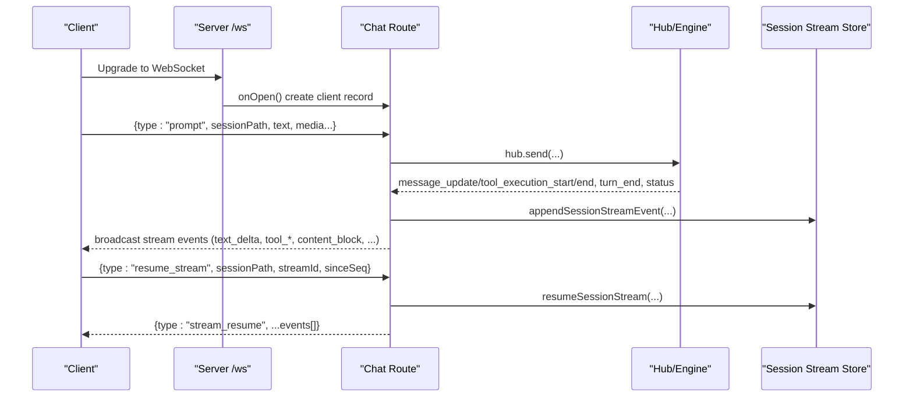
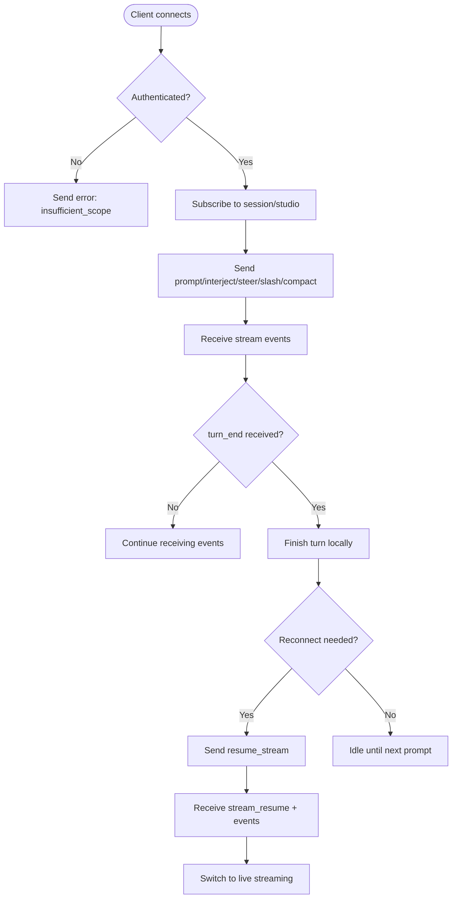
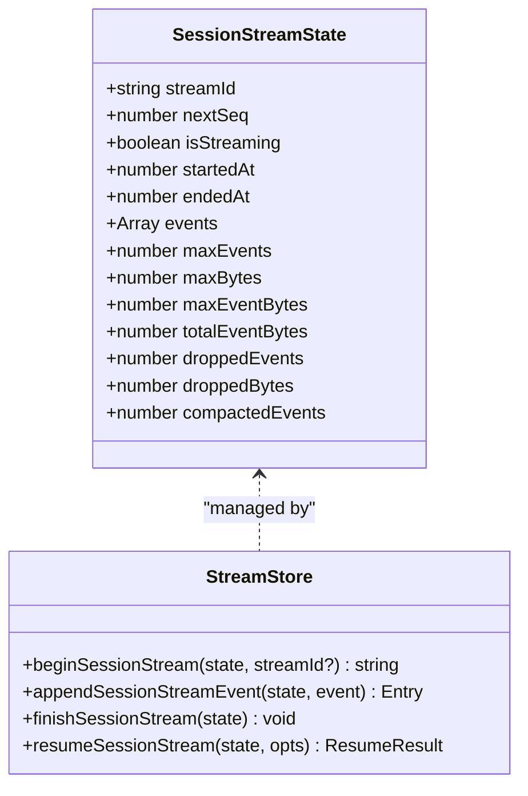
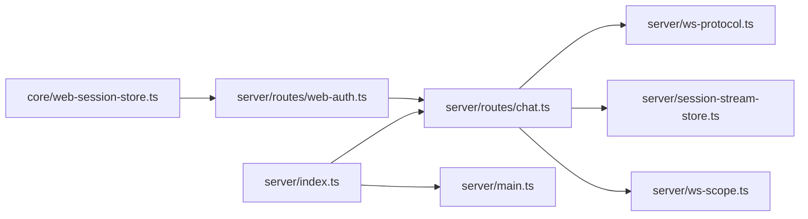

# WebSocket Protocol

<cite>
**Referenced Files in This Document**
- [server/index.ts](file://server/index.ts)
- [server/routes/chat.ts](file://server/routes/chat.ts)
- [server/ws-protocol.ts](file://server/ws-protocol.ts)
- [server/session-stream-store.ts](file://server/session-stream-store.ts)
- [server/ws-scope.ts](file://server/ws-scope.ts)
- [server/main.ts](file://server/main.ts)
- [server/ws.ts](file://server/ws.ts)
- [server/routes/web-auth.ts](file://server/routes/web-auth.ts)
- [core/web-session-store.ts](file://core/web-session-store.ts)
</cite>

## Table of Contents
1. [Introduction](#introduction)
2. [Project Structure](#project-structure)
3. [Core Components](#core-components)
4. [Architecture Overview](#architecture-overview)
5. [Detailed Component Analysis](#detailed-component-analysis)
6. [Dependency Analysis](#dependency-analysis)
7. [Performance Considerations](#performance-considerations)
8. [Troubleshooting Guide](#troubleshooting-guide)
9. [Conclusion](#conclusion)
10. [Appendices](#appendices)

## Introduction
This document specifies the OpenShadow real-time communication protocol over WebSocket. It covers connection establishment, authentication handshake, message formats, event types, bidirectional patterns, lifecycle management, reconnection and resume semantics, error handling, and examples for chat streaming, progress updates, file transfer indicators, and event subscriptions. Security considerations, connection limits, and performance optimization techniques are included for high-frequency messaging scenarios.

## Project Structure
OpenShadow exposes a unified HTTP + WebSocket server. The WebSocket endpoint is mounted under /ws and also aliased at the root path for compatibility. Authentication integrates with web sessions and token-based local connections. Session-scoped streaming uses an internal ring buffer to support resuming after reconnects.

**Diagram sources**
- [server/index.ts:160-176](file://server/index.ts#L160-L176)
- [server/routes/chat.ts:1141-1155](file://server/routes/chat.ts#L1141-L1155)
- [server/session-stream-store.ts:28-60](file://server/session-stream-store.ts#L28-L60)
- [server/ws-scope.ts:27-47](file://server/ws-scope.ts#L27-L47)

**Section sources**
- [server/index.ts:160-176](file://server/index.ts#L160-L176)
- [server/main.ts:459-460](file://server/main.ts#L459-L460)
- [server/ws.ts:24-31](file://server/ws.ts#L24-L31)

## Core Components
- WebSocket endpoint and routing: mounts /ws and forwards upgrade requests to the chat route handler.
- Chat route handler: implements client commands, broadcasts engine events as stream messages, manages per-session state, and controls turn lifecycle.
- Stream store: maintains a bounded ring buffer of events per session with sequence numbers for replay/resume.
- Protocol helpers: validate and construct stream messages and resume payloads.
- Scope and permissions: enforce read/write scopes and subscription rules for clients.

Key responsibilities:
- Connection lifecycle: open/close, client record creation, disconnect abort scheduling.
- Command processing: prompt, interject, steer, slash, compact, abort, resume_stream, context_usage.
- Event broadcasting: text deltas, thinking/mood/tool blocks, content blocks, status, notifications, browser status, bridge status, etc.
- Reconnection: stream resume by sessionPath, streamId, sinceSeq; reset/truncated flags; runtimeIsStreaming indicator.

**Section sources**
- [server/routes/chat.ts:1141-1155](file://server/routes/chat.ts#L1141-L1155)
- [server/routes/chat.ts:1157-1200](file://server/routes/chat.ts#L1157-L1200)
- [server/routes/chat.ts:1218-1255](file://server/routes/chat.ts#L1218-L1255)
- [server/session-stream-store.ts:96-142](file://server/session-stream-store.ts#L96-L142)
- [server/ws-protocol.ts:72-122](file://server/ws-protocol.ts#L72-L122)
- [server/ws-scope.ts:80-88](file://server/ws-scope.ts#L80-L88)

## Architecture Overview
The WebSocket layer sits atop Hono’s node-ws adapter. The chat route subscribes to engine/hub events and translates them into stream messages. Clients send control messages to initiate prompts or manage turns. A per-session stream store buffers recent events to support resume on reconnect.

**Diagram sources**
- [server/index.ts:160-176](file://server/index.ts#L160-L176)
- [server/routes/chat.ts:1141-1155](file://server/routes/chat.ts#L1141-L1155)
- [server/routes/chat.ts:1342-1463](file://server/routes/chat.ts#L1342-L1463)
- [server/routes/chat.ts:1218-1255](file://server/routes/chat.ts#L1218-L1255)
- [server/session-stream-store.ts:62-81](file://server/session-stream-store.ts#L62-L81)
- [server/session-stream-store.ts:96-142](file://server/session-stream-store.ts#L96-L142)

## Detailed Component Analysis

### Connection Establishment and Authentication
- Endpoint: GET /ws (also aliased at root).
- Local loopback connections may be treated as owner without explicit auth when no HTTP request is present.
- Web clients authenticate via cookie-based web sessions established through web-auth endpoints.
- Token-based local access can be used for Electron/local clients.

Authentication flow (web):
- POST /api/web-auth/login with username/password or other supported methods.
- Server sets a secure cookie and returns principal info.
- Subsequent WebSocket upgrades rely on cookie presence and principal resolution.

Security notes:
- Password login requires secure context for non-local connections.
- Principal normalization and scope checks govern read/write capabilities.

**Section sources**
- [server/index.ts:160-176](file://server/index.ts#L160-L176)
- [server/routes/web-auth.ts:41-86](file://server/routes/web-auth.ts#L41-L86)
- [server/routes/web-auth.ts:82-117](file://server/routes/web-auth.ts#L82-L117)
- [core/web-session-store.ts:66-90](file://core/web-session-store.ts#L66-L90)
- [server/routes/chat.ts:1147-1155](file://server/routes/chat.ts#L1147-L1155)

### Client Commands (Control Messages)
All control messages must include sessionPath unless otherwise specified. The server enforces required fields and responds with errors if missing.

- prompt
  - Purpose: Start a new turn with optional attachments and UI context.
  - Fields: type="prompt", sessionPath, text?, images?[], videos?[], audios?[], skills?[], uiContext?|null, displayMessage?, clientMessageId?, sessionFileRefs?
  - Validation: image/video/audio counts and MIME/type limits enforced; rejects if session is already streaming (unless interject).
- interject
  - Purpose: Inject a message into an active turn.
  - Fields: type="interject", sessionPath, text?, images?[], videos?[], audios?[], uiContext?|null, displayMessage?, clientMessageId?, sessionFileRefs?
  - Behavior: If steering fails, falls back to prompt behavior.
- steer
  - Purpose: Attempt to steer an active turn with guidance text.
  - Fields: type="steer", sessionPath, text
  - Behavior: On success, server replies steered; on failure, falls back to prompt.
- abort
  - Purpose: Abort current turn.
  - Fields: type="abort", sessionPath, reason?
  - Behavior: Marks session as aborted and broadcasts status with aborted=true.
- slash
  - Purpose: Execute slash command within a session.
  - Fields: type="slash", sessionPath, text, agentId?
  - Behavior: Dispatches to slash system; replies slash_result.
- compact
  - Purpose: Trigger session compaction.
  - Fields: type="compact", sessionPath
  - Behavior: Validates state and runs compaction; errors reported via error messages.
- resume_stream
  - Purpose: Reconnect and replay missed events.
  - Fields: type="resume_stream", sessionPath, streamId?, sinceSeq
  - Behavior: Returns stream_resume with events array and flags (reset, truncated, isStreaming, runtimeIsStreaming).
- context_usage
  - Purpose: Request current context usage metrics.
  - Fields: type="context_usage", sessionPath
  - Behavior: Replies with tokens, contextWindow, percent.

Error responses:
- type="error" with message and optional sessionPath.
- Additional structured error objects may be included for diagnostics.

**Section sources**
- [server/routes/chat.ts:1157-1200](file://server/routes/chat.ts#L1157-L1200)
- [server/routes/chat.ts:1202-1216](file://server/routes/chat.ts#L1202-L1216)
- [server/routes/chat.ts:1218-1255](file://server/routes/chat.ts#L1218-L1255)
- [server/routes/chat.ts:1257-1269](file://server/routes/chat.ts#L1257-L1269)
- [server/routes/chat.ts:1271-1302](file://server/routes/chat.ts#L1271-L1302)
- [server/routes/chat.ts:1304-1340](file://server/routes/chat.ts#L1304-L1340)
- [server/routes/chat.ts:1342-1463](file://server/routes/chat.ts#L1342-L1463)

### Server-to-Client Events (Data Streams)
Events are broadcast to all authorized clients. Each event includes top-level identifiers for routing and replay.

Common envelope:
- sessionPath: identifies the target session.
- streamId: identifies the current turn’s stream.
- seq: monotonically increasing sequence number for ordering and resume.

Event types:
- text_delta: incremental assistant text.
- thinking_start/thinking_delta/thinking_end: structured thinking segments.
- mood_start/mood_text/mood_end: expressive mood segments.
- tool_start/tool_end: tool invocation lifecycle with id/name/success/details.
- content_block: rich result blocks (files, artifacts, screenshots, skill cards, settings confirmations, suggestions, cron confirmations).
- turn_end: marks completion of a turn.
- status: streaming lifecycle with isStreaming/streamId/reason/aborted.
- session_user_message: user message recorded in session entries.
- confirmation_resolved: user action resolved for pending confirmations.
- block_update: active block patch updates.
- browser_status: running/url/thumbnail changes.
- bridge_status: external platform connectivity.
- notification: desktop/system notifications.
- devlog: developer logs with level.
- activity_update/conversation_agent_activity: agent activity entries.
- channel_new_message/channel_created/dm_new_message: cross-channel notifications.
- voice_transcription_update: transcription progress.
- permission_mode/access_mode/plan_mode: mode changes.
- session_created/session_metadata_updated: session lifecycle metadata.
- stream_resume: replay payload for reconnects.

Resume payload:
- type="stream_resume"
- Fields: sessionPath, streamId, sinceSeq, nextSeq, reset, truncated, isStreaming, runtimeIsStreaming?, events[] where each entry has seq, event, ts.

**Section sources**
- [server/ws-protocol.ts:1-36](file://server/ws-protocol.ts#L1-L36)
- [server/ws-protocol.ts:72-122](file://server/ws-protocol.ts#L72-L122)
- [server/routes/chat.ts:644-704](file://server/routes/chat.ts#L644-L704)
- [server/routes/chat.ts:705-759](file://server/routes/chat.ts#L705-L759)
- [server/routes/chat.ts:760-846](file://server/routes/chat.ts#L760-L846)
- [server/routes/chat.ts:847-946](file://server/routes/chat.ts#L847-L946)
- [server/routes/chat.ts:947-1006](file://server/routes/chat.ts#L947-L1006)
- [server/routes/chat.ts:1007-1124](file://server/routes/chat.ts#L1007-L1124)

### Bidirectional Communication Patterns
- Prompt-driven streaming: client sends prompt; server streams deltas and blocks until turn_end.
- Steering/interjection: client can influence ongoing turns; server acknowledges or falls back to prompt.
- Slash commands: client invokes commands; server replies with results inline.
- Compaction: client triggers compaction; server reports progress/errors.
- Resume: client requests missed events; server replays buffered events and continues live streaming.

**Diagram sources**
- [server/routes/chat.ts:1157-1200](file://server/routes/chat.ts#L1157-L1200)
- [server/routes/chat.ts:1218-1255](file://server/routes/chat.ts#L1218-L1255)
- [server/routes/chat.ts:1342-1463](file://server/routes/chat.ts#L1342-L1463)

### Security and Scoping
- Principal normalization and ownership checks allow local owners full access.
- Write operations require chat.write scope; read operations require chat.read scope.
- Global safe events (e.g., session_created, notification) have relaxed delivery rules.
- Session-scoped events require matching studioId and explicit subscriptions.

Subscription model:
- Studio-level subscription allows receiving all events within a studio.
- Session-level subscription restricts to a specific sessionPath.

**Section sources**
- [server/ws-scope.ts:8-25](file://server/ws-scope.ts#L8-L25)
- [server/ws-scope.ts:27-47](file://server/ws-scope.ts#L27-L47)
- [server/ws-scope.ts:49-88](file://server/ws-scope.ts#L49-L88)
- [server/ws-scope.ts:115-130](file://server/ws-scope.ts#L115-L130)

### Stream Buffering and Resume Semantics
- Per-session ring buffer stores up to a configurable number of events and bytes.
- Large events are compacted or omitted to fit limits.
- Resume logic supports:
  - Reset when streamId changed.
  - Truncated flag when requested sinceSeq is older than available.
  - Runtime streaming indicator to align client state with engine state.

**Diagram sources**
- [server/session-stream-store.ts:28-60](file://server/session-stream-store.ts#L28-L60)
- [server/session-stream-store.ts:62-81](file://server/session-stream-store.ts#L62-L81)
- [server/session-stream-store.ts:96-142](file://server/session-stream-store.ts#L96-L142)

**Section sources**
- [server/session-stream-store.ts:12-26](file://server/session-stream-store.ts#L12-L26)
- [server/session-stream-store.ts:144-152](file://server/session-stream-store.ts#L144-L152)
- [server/session-stream-store.ts:162-205](file://server/session-stream-store.ts#L162-L205)
- [server/session-stream-store.ts:207-236](file://server/session-stream-store.ts#L207-L236)
- [server/session-stream-store.ts:246-254](file://server/session-stream-store.ts#L246-L254)

### Examples

#### Real-time Chat Streaming
- Client sends prompt with sessionPath and text.
- Server streams text_delta, thinking_* and mood_* segments, tool_* invocations, and content_block results.
- Server emits turn_end to mark completion.

Implementation references:
- Prompt handling and validation.
- Message parsing and card pipeline.
- Tool execution start/end and content block emission.
- Turn end flushing and cleanup.

**Section sources**
- [server/routes/chat.ts:1342-1463](file://server/routes/chat.ts#L1342-L1463)
- [server/routes/chat.ts:644-704](file://server/routes/chat.ts#L644-L704)
- [server/routes/chat.ts:705-759](file://server/routes/chat.ts#L705-L759)
- [server/routes/chat.ts:1007-1124](file://server/routes/chat.ts#L1007-L1124)

#### Progress Updates
- Use status events to track streaming lifecycle and reasons.
- Use block_update for active task patches (e.g., streamStatus).
- Use activity_update/conversation_agent_activity for background tasks.

**Section sources**
- [server/routes/chat.ts:879-926](file://server/routes/chat.ts#L879-L926)
- [server/routes/chat.ts:829-846](file://server/routes/chat.ts#L829-L846)
- [server/routes/chat.ts:842-846](file://server/routes/chat.ts#L842-L846)

#### File Transfer Protocols
- File transfers are represented via content_block with file/artifact types.
- Blocks include fileId, filePath, label, ext, mime, kind, storageKind, status, resource, and presentation hints.
- For large files, use deferred_result and subsequent content_block updates.

**Section sources**
- [server/routes/chat.ts:77-126](file://server/routes/chat.ts#L77-L126)
- [server/routes/chat.ts:1504-1549](file://server/routes/chat.ts#L1504-L1549)

#### Event Subscription Patterns
- Clients subscribe to studio or session paths.
- Non-owner clients receive only permitted events based on scopes and subscriptions.
- Safe global events are broadly delivered to readers.

**Section sources**
- [server/ws-scope.ts:49-88](file://server/ws-scope.ts#L49-L88)
- [server/ws-scope.ts:115-130](file://server/ws-scope.ts#L115-L130)

## Dependency Analysis
The WebSocket subsystem depends on:
- Hono app and node-ws adapter for mounting and upgrading.
- Chat route for business logic and event translation.
- Session stream store for buffering and resume.
- Scope module for authorization and subscription checks.
- Web auth for session-based authentication.

**Diagram sources**
- [server/index.ts:160-176](file://server/index.ts#L160-L176)
- [server/main.ts:459-460](file://server/main.ts#L459-L460)
- [server/routes/chat.ts:1141-1155](file://server/routes/chat.ts#L1141-L1155)
- [server/ws-protocol.ts:72-122](file://server/ws-protocol.ts#L72-L122)
- [server/session-stream-store.ts:96-142](file://server/session-stream-store.ts#L96-L142)
- [server/ws-scope.ts:27-47](file://server/ws-scope.ts#L27-L47)
- [server/routes/web-auth.ts:41-86](file://server/routes/web-auth.ts#L41-L86)
- [core/web-session-store.ts:66-90](file://core/web-session-store.ts#L66-L90)

**Section sources**
- [server/index.ts:160-176](file://server/index.ts#L160-L176)
- [server/main.ts:459-460](file://server/main.ts#L459-L460)

## Performance Considerations
- Serialization optimization: broadcast serializes once and reuses payload across clients.
- Ring buffer sizing: default maximum events and bytes prevent memory growth; large events are compacted or omitted.
- Stall detection: configurable turn stall timeout aborts idle streaming.
- Disconnect grace: when no clients remain, streaming is aborted after a grace period.
- Browser thumbnail polling: throttled interval only while browsers are running.

Recommendations:
- Tune maxEvents/maxBytes/maxEventBytes based on workload.
- Use resume_stream to avoid long gaps during reconnects.
- Limit attachment sizes and counts to reduce payload overhead.
- Batch UI updates on the client side to minimize render churn.

**Section sources**
- [server/routes/chat.ts:337-349](file://server/routes/chat.ts#L337-L349)
- [server/session-stream-store.ts:12-26](file://server/session-stream-store.ts#L12-L26)
- [server/session-stream-store.ts:144-152](file://server/session-stream-store.ts#L144-L152)
- [server/routes/chat.ts:183-198](file://server/routes/chat.ts#L183-L198)
- [server/routes/chat.ts:217-230](file://server/routes/chat.ts#L217-L230)
- [server/routes/chat.ts:351-387](file://server/routes/chat.ts#L351-L387)

## Troubleshooting Guide
Common issues and resolutions:
- Missing sessionPath: server responds with error requiring sessionPath.
- Insufficient scope: ensure appropriate chat.read/chat.write scopes for read/write operations.
- Still streaming: reject new prompts while a turn is active; use interject or wait for turn_end.
- Model switching: reject prompts during model switch; retry after completion.
- Compaction conflicts: cannot compact while streaming or if already compacted; handle error messages accordingly.
- Resume mismatches: if reset=true, rebuild local state from events; if truncated=true, request earliest available events.

Operational tips:
- Monitor status events for isStreaming and reason fields.
- Use context_usage to track token consumption and window pressure.
- Leverage devlog for diagnostic traces.

**Section sources**
- [server/routes/chat.ts:234-248](file://server/routes/chat.ts#L234-L248)
- [server/routes/chat.ts:1164-1167](file://server/routes/chat.ts#L1164-L1167)
- [server/routes/chat.ts:1410-1418](file://server/routes/chat.ts#L1410-L1418)
- [server/routes/chat.ts:1316-1340](file://server/routes/chat.ts#L1316-L1340)
- [server/routes/chat.ts:1218-1255](file://server/routes/chat.ts#L1218-L1255)
- [server/routes/chat.ts:1257-1269](file://server/routes/chat.ts#L1257-L1269)
- [server/routes/chat.ts:760-764](file://server/routes/chat.ts#L760-L764)

## Conclusion
OpenShadow’s WebSocket protocol provides a robust, session-scoped, resumable streaming interface for real-time interactions. It balances flexibility (rich event types, content blocks, and control commands) with safety (scopes, subscriptions, and strict validation). Proper use of resume semantics and attention to performance tuning ensures reliable operation under high-frequency messaging loads.

## Appendices

### Connection Lifecycle Management
- Open: client establishes WebSocket; server creates client record and cancels disconnect abort timer.
- Active: client sends commands; server processes and broadcasts events.
- Close: client disconnects; server decrements active count, schedules disconnect abort, and prunes non-streaming session states.

**Section sources**
- [server/routes/chat.ts:1147-1155](file://server/routes/chat.ts#L1147-L1155)
- [server/routes/chat.ts:1482-1496](file://server/routes/chat.ts#L1482-L1496)
- [server/routes/chat.ts:217-230](file://server/routes/chat.ts#L217-L230)

### Reconnection Strategies
- Track last seen seq and streamId per session.
- On reconnect, send resume_stream with sinceSeq and streamId.
- Handle reset/truncated flags and rebuild state from events.
- Align with runtimeIsStreaming to synchronize with engine state.

**Section sources**
- [server/routes/chat.ts:1218-1255](file://server/routes/chat.ts#L1218-L1255)
- [server/session-stream-store.ts:96-142](file://server/session-stream-store.ts#L96-L142)
- [server/ws-protocol.ts:92-122](file://server/ws-protocol.ts#L92-L122)

### Error Handling Procedures
- Validate inputs and respond with typed error messages.
- Wrap async handlers to capture AppError and report via errorBus.
- Distinguish user aborts from unexpected errors to avoid noisy error broadcasts.

**Section sources**
- [server/routes/chat.ts:1464-1473](file://server/routes/chat.ts#L1464-L1473)
- [server/routes/chat.ts:1164-1167](file://server/routes/chat.ts#L1164-L1167)