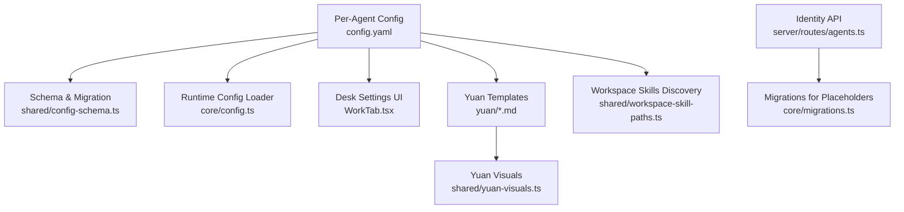
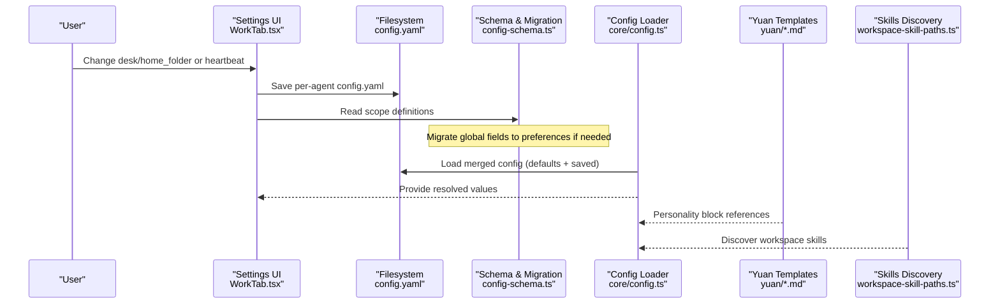
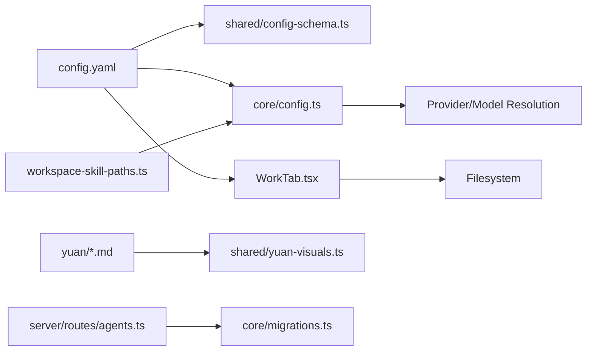

# Agent Configuration

<cite>
**Referenced Files in This Document**
- [config.yaml](file://config.yaml)
- [config.example.yaml](file://config.example.yaml)
- [shared/config-schema.ts](file://shared/config-schema.ts)
- [core/config.ts](file://core/config.ts)
- [desktop/src/react/settings/tabs/WorkTab.tsx](file://desktop/src/react/settings/tabs/WorkTab.tsx)
- [shared/workspace-skill-paths.ts](file://shared/workspace-skill-paths.ts)
- [yuan/hanako.md](file://yuan/hanako.md)
- [yuan/ming.md](file://yuan/ming.md)
- [yuan/en/butter.md](file://yuan/en/butter.md)
- [shared/yuan-visuals.ts](file://shared/yuan-visuals.ts)
- [core/personality/template.ts](file://core/personality/template.ts)
- [server/routes/agents.ts](file://server/routes/agents.ts)
- [core/migrations.ts](file://core/migrations.ts)
- [server/utils/validation.ts](file://server/utils/validation.ts)
</cite>

## Table of Contents
1. Introduction
2. Project Structure
3. Core Components
4. Architecture Overview
5. Detailed Component Analysis
6. Dependency Analysis
7. Performance Considerations
8. Troubleshooting Guide
9. Conclusion
10. Appendices

## Introduction
This document explains how to configure agents using YAML-based configuration and personality definition. It covers the complete config.yaml structure, including agent identity, model selection, memory settings, desk workspace configuration, and skill management. It also documents yuan templates (hanako, ming, butter), their personality differences, template variables like {{userName}} and {{agentName}}, configuration validation, migration patterns, and troubleshooting common errors.

## Project Structure
Agent configuration spans multiple layers:
- Per-agent YAML files under each agent directory define per-agent behavior (e.g., name, yuan, avatar, desk).
- Global preferences are managed via a schema-driven system that migrates certain fields from agent configs into shared preferences.
- The runtime loads provider/model selections and merges defaults with user-provided values.
- Personality is defined by yuan templates and UI visuals.
- Workspace skills are discovered from well-known directories within the workspace.

**Diagram sources**
- [config.yaml:1-19](file://config.yaml#L1-L19)
- [shared/config-schema.ts:1-47](file://shared/config-schema.ts#L1-L47)
- [core/config.ts:1-384](file://core/config.ts#L1-L384)
- [desktop/src/react/settings/tabs/WorkTab.tsx:31-63](file://desktop/src/react/settings/tabs/WorkTab.tsx#L31-L63)
- [yuan/hanako.md:1-38](file://yuan/hanako.md#L1-L38)
- [shared/yuan-visuals.ts:1-47](file://shared/yuan-visuals.ts#L1-L47)
- [shared/workspace-skill-paths.ts:1-20](file://shared/workspace-skill-paths.ts#L1-L20)
- [server/routes/agents.ts:625-660](file://server/routes/agents.ts#L625-L660)
- [core/migrations.ts:2534-2583](file://core/migrations.ts#L2534-L2583)

**Section sources**
- [config.yaml:1-19](file://config.yaml#L1-L19)
- [config.example.yaml:1-17](file://config.example.yaml#L1-L17)
- [shared/config-schema.ts:1-47](file://shared/config-schema.ts#L1-L47)
- [core/config.ts:1-384](file://core/config.ts#L1-L384)
- [desktop/src/react/settings/tabs/WorkTab.tsx:31-63](file://desktop/src/react/settings/tabs/WorkTab.tsx#L31-L63)
- [shared/workspace-skill-paths.ts:1-20](file://shared/workspace-skill-paths.ts#L1-L20)
- [yuan/hanako.md:1-38](file://yuan/hanako.md#L1-L38)
- [yuan/ming.md:1-41](file://yuan/ming.md#L1-L41)
- [yuan/en/butter.md:1-36](file://yuan/en/butter.md#L1-L36)
- [shared/yuan-visuals.ts:1-47](file://shared/yuan-visuals.ts#L1-L47)
- [server/routes/agents.ts:625-660](file://server/routes/agents.ts#L625-L660)
- [core/migrations.ts:2534-2583](file://core/migrations.ts#L2534-L2583)

## Core Components
- Per-agent config.yaml: Defines agent identity (name, yuan, avatar), desk workspace (home_folder), and other per-agent options.
- Global schema and migration: Declares which fields are global vs per-agent and migrates legacy global fields out of agent configs into preferences.
- Runtime config loader: Merges defaults with persisted values, resolves providers/models, and exposes getters/setters.
- Desk workspace UI: Provides controls for heartbeat and workspace context injection.
- Yuan templates and visuals: Define personality blocks and UI symbols/avatars.
- Workspace skills discovery: Scans known directories for skills.
- Identity API and migrations: Serve/update identity.md and repair placeholder usage.

Key responsibilities:
- config.yaml: Primary source of truth for per-agent settings.
- Schema: Single source of truth for field scoping and migration.
- Runtime loader: Applies defaults, env overrides, and multi-provider resolution.
- UI: Persists changes back to per-agent config.
- Yuan: Drives personality tone and visual identity.
- Skills: Auto-discovers capabilities from workspace.

**Section sources**
- [config.yaml:1-19](file://config.yaml#L1-L19)
- [shared/config-schema.ts:1-47](file://shared/config-schema.ts#L1-L47)
- [core/config.ts:1-384](file://core/config.ts#L1-L384)
- [desktop/src/react/settings/tabs/WorkTab.tsx:31-63](file://desktop/src/react/settings/tabs/WorkTab.tsx#L31-L63)
- [shared/workspace-skill-paths.ts:1-20](file://shared/workspace-skill-paths.ts#L1-L20)
- [yuan/hanako.md:1-38](file://yuan/hanako.md#L1-L38)
- [yuan/ming.md:1-41](file://yuan/ming.md#L1-L41)
- [yuan/en/butter.md:1-36](file://yuan/en/butter.md#L1-L36)
- [shared/yuan-visuals.ts:1-47](file://shared/yuan-visuals.ts#L1-L47)
- [server/routes/agents.ts:625-660](file://server/routes/agents.ts#L625-L660)
- [core/migrations.ts:2534-2583](file://core/migrations.ts#L2534-L2583)

## Architecture Overview
The configuration architecture blends file-based YAML with schema-driven migration and runtime merging.

**Diagram sources**
- [desktop/src/react/settings/tabs/WorkTab.tsx:31-63](file://desktop/src/react/settings/tabs/WorkTab.tsx#L31-L63)
- [config.yaml:1-19](file://config.yaml#L1-L19)
- [shared/config-schema.ts:1-47](file://shared/config-schema.ts#L1-L47)
- [core/config.ts:1-384](file://core/config.ts#L1-L384)
- [yuan/hanako.md:1-38](file://yuan/hanako.md#L1-L38)
- [shared/workspace-skill-paths.ts:1-20](file://shared/workspace-skill-paths.ts#L1-L20)

## Detailed Component Analysis

### YAML-Based Agent Configuration (config.yaml)
- Purpose: Per-agent configuration file defining identity, persona, and workspace behavior.
- Key sections:
  - agent: name, yuan, avatar; may include additional per-agent fields depending on version.
  - memory: enabled flag to control memory features.
  - desk: home_folder path, heartbeat_enabled, heartbeat_interval.
  - user: name used in identity and prompts.
  - preferences: per-user preferences (global scope fields are migrated here).

Practical examples:
- Basic agent with default model and memory enabled:
  - Set agent.name and agent.yuan; keep memory.enabled true.
- Desktop-focused agent with custom workspace:
  - Set desk.home_folder to your project root; enable heartbeat if desired.
- Multi-model setup:
  - Configure models.main/small/large and providers in the runtime config; per-agent config can still set yuan and desk.

Validation and persistence:
- The UI persists changes to the per-agent config.yaml.
- Global fields declared in the schema are migrated out of agent configs into preferences automatically.

**Section sources**
- [config.yaml:1-19](file://config.yaml#L1-L19)
- [config.example.yaml:1-17](file://config.example.yaml#L1-L17)
- [desktop/src/react/settings/tabs/WorkTab.tsx:31-63](file://desktop/src/react/settings/tabs/WorkTab.tsx#L31-L63)
- [shared/config-schema.ts:1-47](file://shared/config-schema.ts#L1-L47)

### Model Selection and Provider Resolution
- Role-based model selection uses refs like providerId::modelName.
- Resolution priority:
  1) Explicit role reference in models.*
  2) Default provider marked isDefault
  3) Legacy single-provider fields (agent.apiKey/baseUrl/model)
  4) Environment variables AGENT_API_KEY, AGENT_BASE_URL, AGENT_MODEL

Best practices:
- Prefer explicit models.main/small/large for clarity.
- Keep isDefault only on a fully configured provider.
- Use environment variables for CI or ephemeral setups.

**Section sources**
- [core/config.ts:269-315](file://core/config.ts#L269-L315)

### Memory Settings
- Toggle memory at the top level with memory.enabled.
- When enabled, memory tools become available to the agent.

Operational notes:
- Disabling memory reduces overhead but removes long-term recall.
- Combine with desk heartbeat to manage periodic tasks without memory.

**Section sources**
- [config.yaml:8-10](file://config.yaml#L8-L10)
- [core/config.ts:321-323](file://core/config.ts#L321-L323)

### Desk Workspace Configuration
- desk.home_folder: Root folder for workspace operations and context.
- desk.heartbeat_enabled and desk.heartbeat_interval: Control background heartbeat polling.
- Workspace context toggles (via UI): inject_agents_md and inject_claude_md influence what context files are injected into sessions.

Common patterns:
- Point home_folder to your main codebase.
- Enable heartbeat for automated maintenance tasks.
- Inject agents.md and Claude-style context files when collaborating with other AI workflows.

**Section sources**
- [config.yaml:5-13](file://config.yaml#L5-L13)
- [desktop/src/react/settings/tabs/WorkTab.tsx:31-63](file://desktop/src/react/settings/tabs/WorkTab.tsx#L31-L63)

### Skill Management
- Workspace skills are auto-discovered from known directories:
  - .claude/skills
  - .codex/skills
  - .openclaw/skills
  - .agents/skills
- Only existing directories are included.

Recommendations:
- Organize reusable tooling under one of these directories to make them available to agents.
- Keep manifests and handlers consistent with the expected format.

**Section sources**
- [shared/workspace-skill-paths.ts:1-20](file://shared/workspace-skill-paths.ts#L1-L20)

### Yuan Templates and Personality Differences
- hanako: Balanced assistant with MOOD block guiding emotional nuance.
- ming: More analytical with REFLECT block focusing on premises and reasoning.
- butter: Emotionally expressive with PULSE block emphasizing resonance and intuition.

Visual mapping:
- Each yuan maps to a symbol, mood label, accent color, and avatar.
- Unknown yuan values normalize to hanako.

Usage:
- Set agent.yuan to one of the supported keys.
- The corresponding template influences response style and internal reflection blocks.

**Section sources**
- [yuan/hanako.md:1-38](file://yuan/hanako.md#L1-L38)
- [yuan/ming.md:1-41](file://yuan/ming.md#L1-L41)
- [yuan/en/butter.md:1-36](file://yuan/en/butter.md#L1-L36)
- [shared/yuan-visuals.ts:1-47](file://shared/yuan-visuals.ts#L1-L47)

### Template Variables in Identity and Personality
- {{userName}} appears in yuan templates and personality construction to personalize responses.
- The runtime builds system prompts using the user’s name from configuration.
- Identity content is served and updated via the agents API.

Migration note:
- A migration repairs identity placeholders to ensure compatibility across versions.

**Section sources**
- [yuan/hanako.md:7-7](file://yuan/hanako.md#L7-L7)
- [yuan/ming.md:7-7](file://yuan/ming.md#L7-L7)
- [yuan/en/butter.md:5-5](file://yuan/en/butter.md#L5-L5)
- [core/personality/template.ts:21-26](file://core/personality/template.ts#L21-L26)
- [server/routes/agents.ts:625-660](file://server/routes/agents.ts#L625-L660)
- [core/migrations.ts:2534-2583](file://core/migrations.ts#L2534-L2583)

### Configuration Validation and Scope Migration
- Global vs per-agent scoping is declared in the schema.
- During startup, global fields are migrated from agent configs into preferences and then removed from agent configs.
- Backups are created before modifying agent configs during migration.

Implications:
- Do not rely on global fields inside per-agent config.yaml after migration.
- Manage global settings through preferences instead.

**Section sources**
- [shared/config-schema.ts:1-47](file://shared/config-schema.ts#L1-L47)
- [shared/migrate-config-scope.ts:74-148](file://shared/migrate-config-scope.ts#L74-L148)

### Practical Examples

- Example 1: Balanced assistant with memory and default workspace
  - agent.name: Your preferred name
  - agent.yuan: hanako
  - memory.enabled: true
  - desk.home_folder: Path to your main project

- Example 2: Analytical assistant with heartbeat and workspace context
  - agent.yuan: ming
  - desk.heartbeat_enabled: true
  - desk.heartbeat_interval: 30
  - workspace_context.inject_agents_md: true
  - workspace_context.inject_claude_md: true

- Example 3: Expressive assistant with custom workspace
  - agent.yuan: butter
  - desk.home_folder: Path to creative projects
  - memory.enabled: false (if you prefer stateless interactions)

Note: These examples describe configuration intent; actual edits should be made via the UI or directly in config.yaml.

[No sources needed since this section provides general guidance]

## Dependency Analysis
The following diagram shows key dependencies among configuration components.

**Diagram sources**
- [config.yaml:1-19](file://config.yaml#L1-L19)
- [shared/config-schema.ts:1-47](file://shared/config-schema.ts#L1-L47)
- [core/config.ts:1-384](file://core/config.ts#L1-L384)
- [desktop/src/react/settings/tabs/WorkTab.tsx:31-63](file://desktop/src/react/settings/tabs/WorkTab.tsx#L31-L63)
- [shared/workspace-skill-paths.ts:1-20](file://shared/workspace-skill-paths.ts#L1-L20)
- [yuan/hanako.md:1-38](file://yuan/hanako.md#L1-L38)
- [shared/yuan-visuals.ts:1-47](file://shared/yuan-visuals.ts#L1-L47)
- [server/routes/agents.ts:625-660](file://server/routes/agents.ts#L625-L660)
- [core/migrations.ts:2534-2583](file://core/migrations.ts#L2534-L2583)

**Section sources**
- [config.yaml:1-19](file://config.yaml#L1-L19)
- [shared/config-schema.ts:1-47](file://shared/config-schema.ts#L1-L47)
- [core/config.ts:1-384](file://core/config.ts#L1-L384)
- [desktop/src/react/settings/tabs/WorkTab.tsx:31-63](file://desktop/src/react/settings/tabs/WorkTab.tsx#L31-L63)
- [shared/workspace-skill-paths.ts:1-20](file://shared/workspace-skill-paths.ts#L1-L20)
- [yuan/hanako.md:1-38](file://yuan/hanako.md#L1-L38)
- [shared/yuan-visuals.ts:1-47](file://shared/yuan-visuals.ts#L1-L47)
- [server/routes/agents.ts:625-660](file://server/routes/agents.ts#L625-L660)
- [core/migrations.ts:2534-2583](file://core/migrations.ts#L2534-L2583)

## Performance Considerations
- Enabling memory increases storage and retrieval overhead; disable if not needed.
- Heartbeat intervals should balance responsiveness with resource usage.
- Workspace context injection adds prompt size; selectively enable only required files.
- Avoid overly large home_folder trees to reduce scanning time.

[No sources needed since this section provides general guidance]

## Troubleshooting Guide
Common issues and resolutions:
- Invalid agent id: Ensure ids do not contain path separators or relative traversal sequences.
- Missing identity.md: The API returns an empty string if the file does not exist; create it via the API or manually.
- Placeholder mismatches: Run migrations to repair identity placeholders.
- Global fields in agent config: After migration, global fields are moved to preferences; remove them from agent config.yaml to avoid confusion.

Validation helpers:
- Use provided utilities to validate ids and check agent existence.

**Section sources**
- [server/utils/validation.ts:1-10](file://server/utils/validation.ts#L1-L10)
- [server/routes/agents.ts:625-660](file://server/routes/agents.ts#L625-L660)
- [core/migrations.ts:2534-2583](file://core/migrations.ts#L2534-L2583)
- [shared/config-schema.ts:1-47](file://shared/config-schema.ts#L1-L47)

## Conclusion
Agent configuration combines per-agent YAML with schema-driven migration and runtime merging. Choose a yuan template to shape personality, configure memory and desk workspace to match your workflow, and leverage workspace skills for extensibility. Follow migration guidelines and use validation utilities to maintain a healthy configuration.

[No sources needed since this section summarizes without analyzing specific files]

## Appendices

### Appendix A: config.yaml Field Reference
- agent.name: Display name for the agent.
- agent.yuan: Personality template key (hanako, ming, butter).
- agent.avatar: Optional avatar reference.
- memory.enabled: Toggle memory features.
- desk.home_folder: Workspace root path.
- desk.heartbeat_enabled: Enable background heartbeat.
- desk.heartbeat_interval: Heartbeat interval in minutes.
- user.name: Name used in prompts and identity.
- preferences: Global preferences (migrated from global fields).

**Section sources**
- [config.yaml:1-19](file://config.yaml#L1-L19)
- [config.example.yaml:1-17](file://config.example.yaml#L1-L17)

### Appendix B: Yuan Template Quick Comparison
- hanako: Balanced, MOOD-driven, suitable for general assistance.
- ming: Analytical, REFLECT-driven, suited for deep reasoning.
- butter: Expressive, PULSE-driven, emphasizes emotional resonance.

**Section sources**
- [yuan/hanako.md:1-38](file://yuan/hanako.md#L1-L38)
- [yuan/ming.md:1-41](file://yuan/ming.md#L1-L41)
- [yuan/en/butter.md:1-36](file://yuan/en/butter.md#L1-L36)
- [shared/yuan-visuals.ts:1-47](file://shared/yuan-visuals.ts#L1-L47)