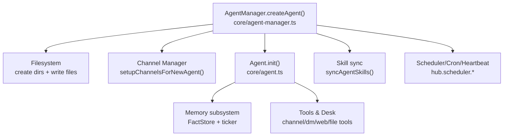
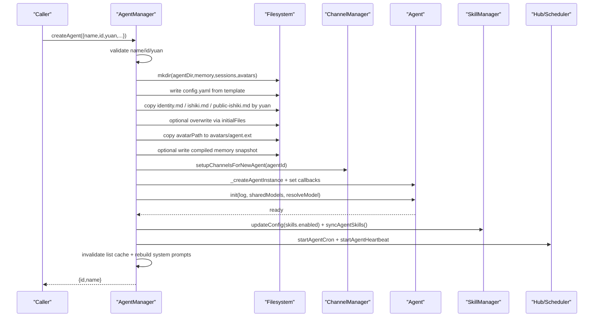
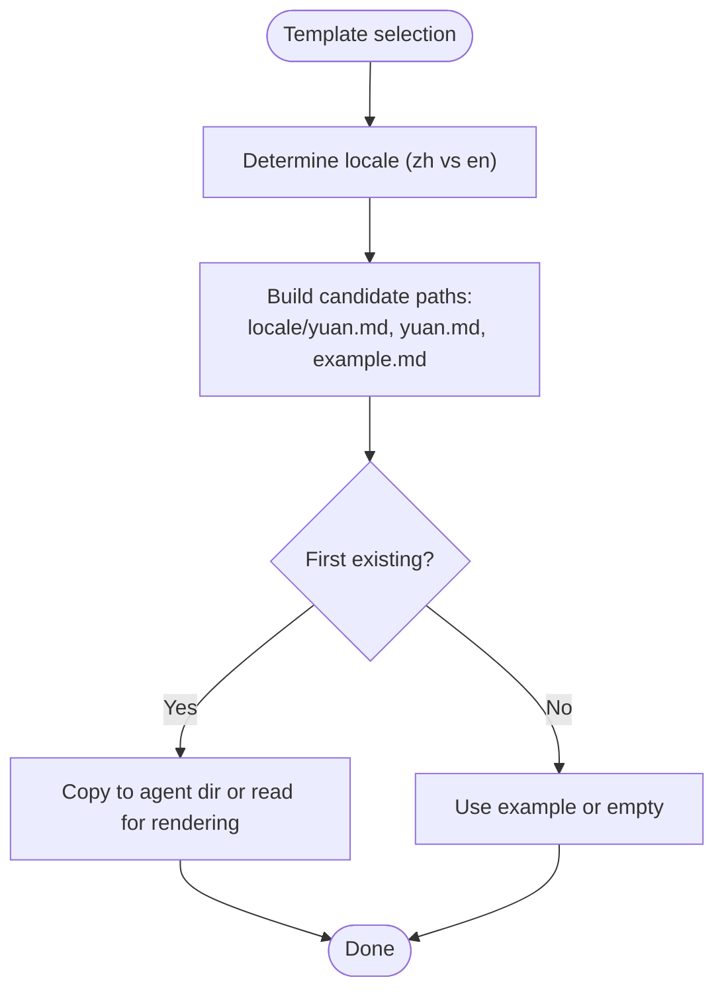
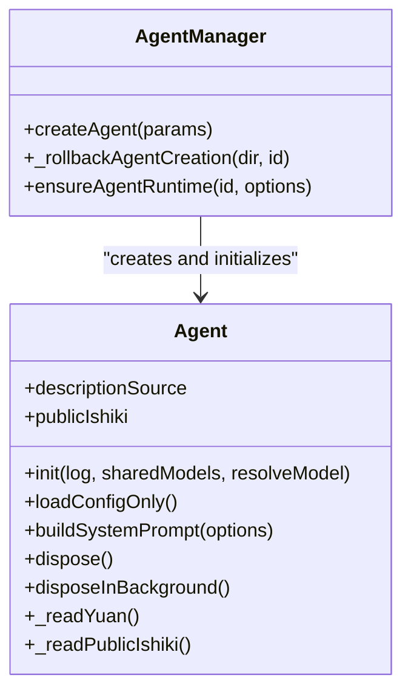
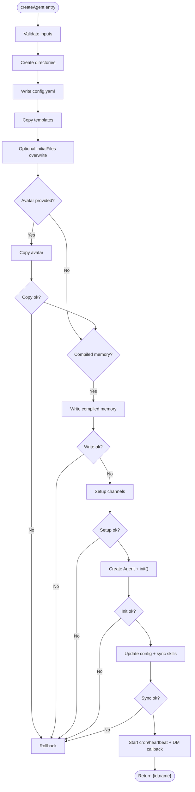
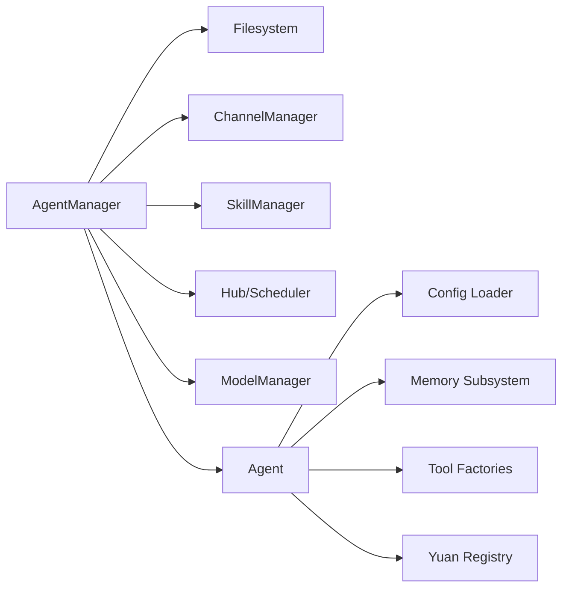

# Agent Creation and Initialization

<cite>
**Referenced Files in This Document**
- [agent-manager.ts](file://core/agent-manager.ts)
- [agent.ts](file://core/agent.ts)
- [yuan-registry.ts](file://core/yuan-registry.ts)
- [config.example.yaml](file://config.example.yaml)
- [agents.ts](file://server/routes/agents.ts)
- [config.ts](file://server/routes/config.ts)
</cite>

## Table of Contents
1. [Introduction](#introduction)
2. [Project Structure](#project-structure)
3. [Core Components](#core-components)
4. [Architecture Overview](#architecture-overview)
5. [Detailed Component Analysis](#detailed-component-analysis)
6. [Dependency Analysis](#dependency-analysis)
7. [Performance Considerations](#performance-considerations)
8. [Troubleshooting Guide](#troubleshooting-guide)
9. [Conclusion](#conclusion)
10. [Appendices](#appendices)

## Introduction
This document explains the end-to-end process of creating and initializing an agent, focusing on:
- Parameter validation and directory structure creation
- Configuration file generation from templates
- Template system for identity.md, ishiki.md, and public-ishiki.md based on yuan types
- Avatar handling and initial memory injection
- Channel setup integration
- Error handling and rollback mechanisms during failures
- Practical examples of programmatic agent creation with different configurations and customization options

The implementation is centered around the createAgent() method in the AgentManager class and the Agent runtime initialization flow.

## Project Structure
At a high level, agent creation spans:
- Core orchestration and lifecycle management (AgentManager)
- Agent runtime initialization and tooling (Agent)
- Yuan type validation and registry (yuan-registry)
- Server routes that expose configuration and identity editing APIs
- Example config template used as seed for new agents

**Diagram sources**
- [agent-manager.ts:557-753](file://core/agent-manager.ts#L557-L753)
- [agent.ts:278-647](file://core/agent.ts#L278-L647)

**Section sources**
- [agent-manager.ts:557-753](file://core/agent-manager.ts#L557-L753)
- [agent.ts:278-647](file://core/agent.ts#L278-L647)

## Core Components
- AgentManager.createAgent(): Orchestrates validation, filesystem layout, template population, avatar copy, optional compiled memory snapshot, channel setup, agent instance creation and init, skills sync, scheduler hooks, and cache refresh.
- Agent.init(): Loads config, sets identity flags, initializes memory v2 (FactStore, summaries), starts memory ticker, constructs tools (memory search, web, file, browser, notify, subagent, workflow, etc.), builds system prompt, and schedules maintenance.
- Yuan registry: Validates and normalizes yuan keys; provides repair state detection for invalid yuan values.
- Server routes: Provide read/write endpoints for identity.md and ishiki.md, triggering system prompt rebuilds when content changes.

**Section sources**
- [agent-manager.ts:557-753](file://core/agent-manager.ts#L557-L753)
- [agent.ts:278-647](file://core/agent.ts#L278-L647)
- [yuan-registry.ts:50-82](file://core/yuan-registry.ts#L50-L82)
- [agents.ts:625-691](file://server/routes/agents.ts#L625-L691)
- [config.ts:428-458](file://server/routes/config.ts#L428-L458)

## Architecture Overview
The following sequence diagram maps the actual code flow for agent creation and initialization.

**Diagram sources**
- [agent-manager.ts:557-753](file://core/agent-manager.ts#L557-L753)
- [agent.ts:278-647](file://core/agent.ts#L278-L647)

## Detailed Component Analysis

### createAgent() Method: Validation, Directory Layout, Templates, Avatars, Memory, Channels, Init
- Parameter validation
  - Name must be non-empty; ID sanitized and checked for path traversal; duplicate check against existing agent directory.
  - Yuan type validated against known templates using assertKnownYuan.
- Directory structure creation
  - Creates agent root, memory, sessions, avatars directories.
- Configuration generation
  - Seeds config.yaml from product template (config.example.yaml).
  - Injects agent.name, agent.yuan, memory.enabled, desk heartbeat defaults, user.name if available.
  - Inherits models.chat as a composite key {id, provider} from current agent or default model.
- Template system for identity.md, ishiki.md, public-ishiki.md
  - Chooses locale-aware yuan-specific template first, then generic yuan template, then example fallback.
  - Supports overwriting these files via initialFiles object.
- Avatar handling
  - Validates allowed extensions (.png, .jpg, .webp; .jpeg normalized to .jpg).
  - Copies to avatars/agent.<ext>.
- Initial memory injection
  - If initialMemory.compiled is present and valid, writes compiled memory snapshot into agent/memory with source metadata.
- Channel setup integration
  - Calls ChannelManager.setupChannelsForNewAgent(agentId); failure triggers rollback.
- Agent instance creation and initialization
  - Creates Agent instance, wires owner IDs resolver, resolves model credentials, calls Agent.init().
  - On init failure, performs rollback.
- Skills synchronization
  - Computes enabled skills (explicit override or default from SkillManager) and persists via updateConfig + syncAgentSkills.
- Scheduler hooks and DM callback
  - Starts cron and heartbeat; injects DM sent handler.
- Cache refresh and logging
  - Invalidates agent list cache, rebuilds system prompts across agents, logs creation.

Error handling and rollback
- A centralized rollback helper removes the agent directory and cleans up channels.
- Rollback is invoked after any failure post-directory creation: avatar copy, compiled memory write, channel setup, agent init, skill sync.

Practical usage patterns
- Minimal creation: provide name and optionally id.
- With yuan and avatar: specify yuan and avatarPath.
- With initial files: pass initialFiles to override identity.md, ishiki.md, public-ishiki.md.
- With prebuilt memory: pass initialMemory.compiled to seed memory.
- With explicit skills: pass enabledSkills to control initial skill set.

**Section sources**
- [agent-manager.ts:557-753](file://core/agent-manager.ts#L557-L753)
- [config.example.yaml:1-17](file://config.example.yaml#L1-L17)
- [yuan-registry.ts:50-82](file://core/yuan-registry.ts#L50-L82)

### Template System: identity.md, ishiki.md, public-ishiki.md
- Selection order
  - For each template type, prefer locale-prefixed yuan template, then generic yuan template, then example fallback where applicable.
- Runtime resolution
  - At runtime, Agent reads identity.md and ishiki.md from agent directory first, then falls back to product templates.
  - Public-ishiki.md is similarly resolved for guest-facing contexts.
- Variable substitution
  - Placeholders like {{userName}}, {{agentName}}, {{agentId}} are replaced at list-time and read-time.

**Diagram sources**
- [agent-manager.ts:623-651](file://core/agent-manager.ts#L623-L651)
- [agent.ts:1016-1061](file://core/agent.ts#L1016-L1061)

**Section sources**
- [agent-manager.ts:623-651](file://core/agent-manager.ts#L623-L651)
- [agent.ts:1016-1061](file://core/agent.ts#L1016-L1061)

### Avatar Handling
- Allowed formats: png, jpg, webp; jpeg is normalized to jpg.
- Destination: avatars/agent.<ext>.
- Failure to copy triggers rollback to avoid partial agent state.

**Section sources**
- [agent-manager.ts:666-679](file://core/agent-manager.ts#L666-L679)

### Initial Memory Injection
- Condition: initialMemory.compiled exists and passes hasCompiledMemory validation.
- Writes snapshot under agent/memory with source metadata (source, sourceId, sourcePackage).
- Failure triggers rollback.

**Section sources**
- [agent-manager.ts:685-696](file://core/agent-manager.ts#L685-L696)

### Channel Setup Integration
- After filesystem steps, calls ChannelManager.setupChannelsForNewAgent(agentId).
- Errors here trigger rollback to prevent orphaned channel entries.

**Section sources**
- [agent-manager.ts:698-704](file://core/agent-manager.ts#L698-L704)

### Agent Initialization Flow
- Compatibility checks and config load.
- Identity fields and master switches (memory, experience).
- Memory v2: FactStore, summaries, migration from v1 if needed.
- Utility and memory model resolution with credential refresh strategy.
- Memory ticker creation and start; background scheduling.
- Tool construction: memory search, web search/fetch, todo, pinned memory, experience, desk automation, stage files, file, browser, notify, stop task, check deferred, current status, terminal, update settings, session folders, install skill, subagent suite, workflow.
- Channel and DM tools wired only when channelsDir and agentsDir are present.
- System prompt built with memory master enabled; runtimeInitialized flag set; appearance summary refreshed asynchronously; memory maintenance scheduled.

**Diagram sources**
- [agent.ts:278-647](file://core/agent.ts#L278-L647)
- [agent-manager.ts:706-753](file://core/agent-manager.ts#L706-L753)

**Section sources**
- [agent.ts:278-647](file://core/agent.ts#L278-L647)

### Error Handling and Rollback Mechanisms
- Rollback helper deletes agent directory and cleans up channels.
- Invoked after:
  - Unsupported avatar extension
  - Avatar copy failure
  - Compiled memory snapshot write failure
  - Channel setup failure
  - Agent init failure
  - Skill sync failure

**Diagram sources**
- [agent-manager.ts:552-753](file://core/agent-manager.ts#L552-L753)

**Section sources**
- [agent-manager.ts:552-753](file://core/agent-manager.ts#L552-L753)

### Programmatic Examples
Below are practical patterns you can implement using the documented API surface. Replace placeholders with your environment values.

- Minimal agent creation
  - Inputs: { name: "MyAgent", id: "my-agent-id" }
  - Outcome: Default config seeded, identity/ishiki/public-ishiki copied from yuan templates, memory enabled, no avatar, no initial memory.

- Agent with custom yuan and avatar
  - Inputs: { name: "HanakoBot", yuan: "hanako", avatarPath: "/path/to/avatar.png" }
  - Outcome: Uses hanako templates; copies avatar to avatars/agent.png.

- Agent with initial files
  - Inputs: { name: "CustomBot", initialFiles: { identity: "...", ishiki: "...", publicIshiki: "..." } }
  - Outcome: Overwrites generated templates with provided content.

- Agent with prebuilt memory
  - Inputs: { name: "MemoryBot", initialMemory: { compiled: {...}, source: "character-card", sourceId: "cc-123" } }
  - Outcome: Writes compiled memory snapshot into agent/memory.

- Agent with explicit skills
  - Inputs: { name: "SkillBot", enabledSkills: ["skill-a", "skill-b"] }
  - Outcome: Persists skills.enabled and syncs into agent runtime.

Notes:
- Ensure avatarPath points to a supported image format.
- Ensure yuan is a known template key; otherwise creation fails early.
- If channel manager is unavailable, ensure it is initialized before calling createAgent.

[No sources needed since this section provides usage patterns without quoting specific code]

## Dependency Analysis
Key dependencies and relationships:
- AgentManager depends on:
  - Filesystem for directory and file operations
  - ChannelManager for per-agent channel setup/cleanup
  - SkillManager for computing and syncing enabled skills
  - Hub/Scheduler for cron and heartbeat
  - ModelManager for resolving chat model reference
- Agent depends on:
  - Config loader and safe fs utilities
  - Memory subsystem (FactStore, SessionSummaryManager, ticker)
  - Tools factories (web, file, browser, notify, subagent, workflow, etc.)
  - Yuan registry for capability definitions and repair state

**Diagram sources**
- [agent-manager.ts:557-753](file://core/agent-manager.ts#L557-L753)
- [agent.ts:278-647](file://core/agent.ts#L278-L647)
- [yuan-registry.ts:50-82](file://core/yuan-registry.ts#L50-L82)

**Section sources**
- [agent-manager.ts:557-753](file://core/agent-manager.ts#L557-L753)
- [agent.ts:278-647](file://core/agent.ts#L278-L647)
- [yuan-registry.ts:50-82](file://core/yuan-registry.ts#L50-L82)

## Performance Considerations
- Concurrency: Agent runtime initialization is queued and limited to a fixed concurrency to avoid contention during startup.
- Memory ticker: Background maintenance is scheduled off the critical path to reduce startup latency.
- Disk I/O: Template copying and config writing are synchronous; batch operations are minimized.
- Caching: Agent list results are cached with TTL; description regeneration is lazy and rate-limited.

[No sources needed since this section provides general guidance]

## Troubleshooting Guide
Common issues and resolutions:
- Invalid yuan template key
  - Symptom: Creation fails with INVALID_YUAN error.
  - Resolution: Use a known yuan key listed by the registry.
- Duplicate agent ID
  - Symptom: Error indicating agent already exists.
  - Resolution: Choose a unique id or omit to auto-generate.
- Unsupported avatar format
  - Symptom: Creation fails due to unsupported image type.
  - Resolution: Convert to png, jpg, or webp.
- Channel setup failure
  - Symptom: Channels not created; agent directory may exist.
  - Resolution: Investigate ChannelManager errors; rollback will remove partial state.
- Agent init failure
  - Symptom: Agent runtime not ready; directory cleaned up.
  - Resolution: Check config validity, model resolution, and memory subsystem readiness.

Server-side editing tips:
- Editing identity.md or ishiki.md via server routes triggers system prompt rebuild and cache invalidation.

**Section sources**
- [yuan-registry.ts:50-82](file://core/yuan-registry.ts#L50-L82)
- [agents.ts:625-691](file://server/routes/agents.ts#L625-L691)
- [config.ts:428-458](file://server/routes/config.ts#L428-L458)

## Conclusion
The createAgent() method orchestrates a robust, fail-safe agent bootstrap: validating inputs, preparing a consistent directory layout, seeding configuration and persona templates based on yuan types, integrating channels, initializing memory and tools, and ensuring cleanup on any failure. The design emphasizes resilience through targeted rollbacks and clear separation of concerns between orchestration (AgentManager) and runtime (Agent).

[No sources needed since this section summarizes without analyzing specific files]

## Appendices

### API Surface Summary
- AgentManager.createAgent(params)
  - Parameters: name, id?, yuan?, enabledSkills?, initialFiles?, avatarPath?, initialMemory?
  - Returns: { id, name }
- Server routes for identity and ishiki
  - GET/PUT /api/agents/:id/identity
  - GET/PUT /api/agents/:id/ishiki
  - GET/PUT /api/ishiki (current agent context)

**Section sources**
- [agent-manager.ts:557-753](file://core/agent-manager.ts#L557-L753)
- [agents.ts:625-691](file://server/routes/agents.ts#L625-L691)
- [config.ts:428-458](file://server/routes/config.ts#L428-L458)