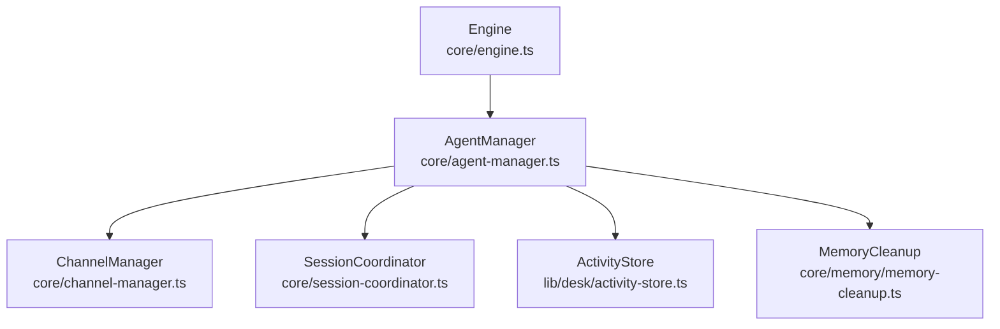
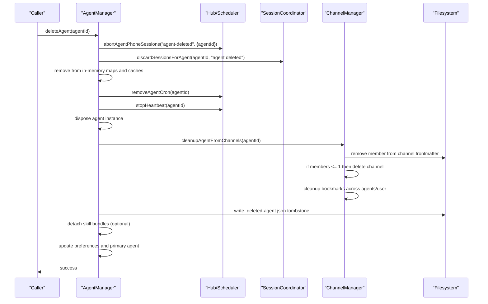
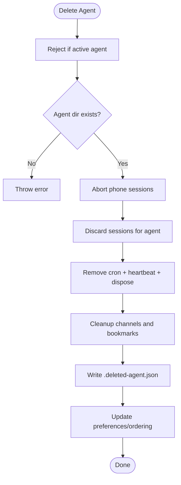
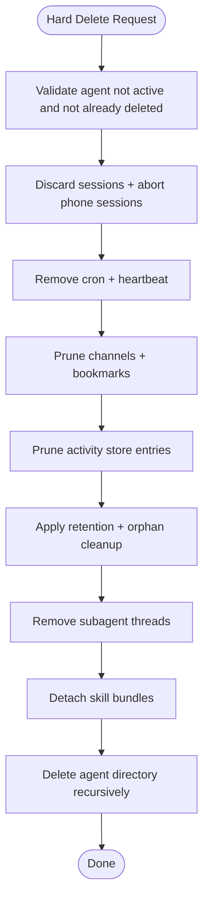
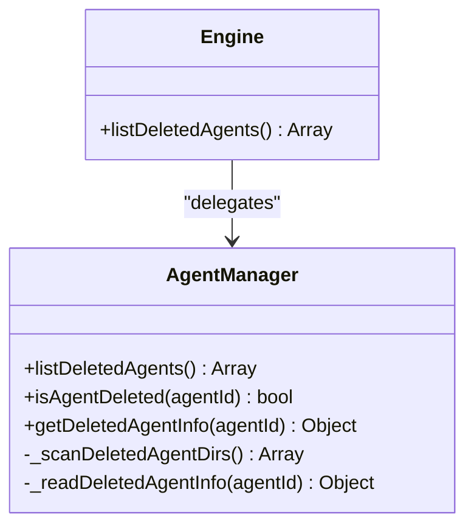
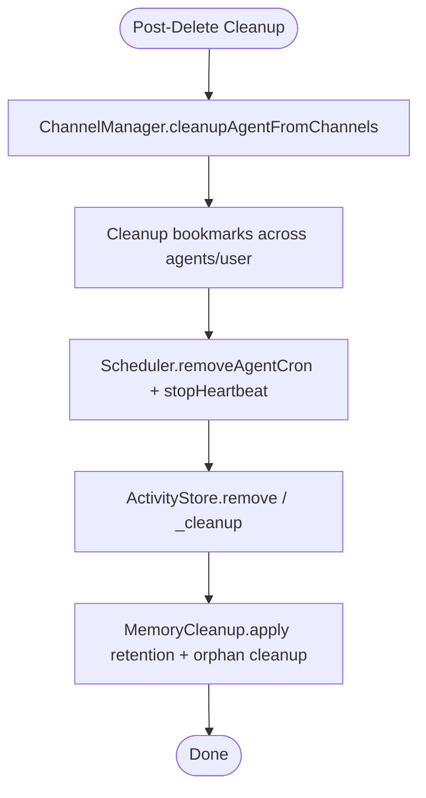
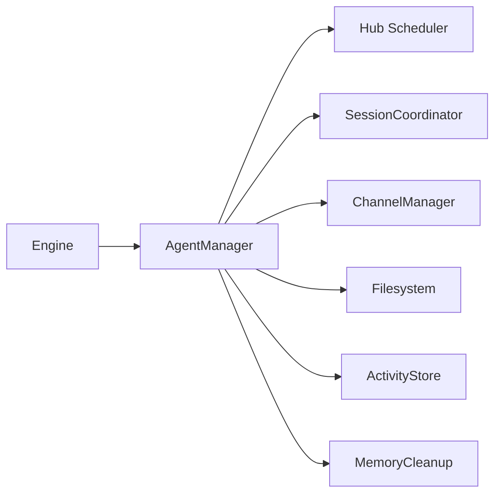

# Agent Deletion and Cleanup

<cite>
**Referenced Files in This Document**
- [agent-manager.ts](file://core/agent-manager.ts)
- [channel-manager.ts](file://core/channel-manager.ts)
- [session-coordinator.ts](file://core/session-coordinator.ts)
- [activity-store.ts](file://lib/desk/activity-store.ts)
- [memory-cleanup.ts](file://core/memory/memory-cleanup.ts)
- [engine.ts](file://core/engine.ts)
</cite>

## Table of Contents
1. Introduction
2. Project Structure
3. Core Components
4. Architecture Overview
5. Detailed Component Analysis
6. Dependency Analysis
7. Performance Considerations
8. Troubleshooting Guide
9. Conclusion

## Introduction
This document explains how agents are logically deleted (soft deletion via tombstones), how their resources are cleaned up, and how the system tracks and lists deleted agents. It also covers hard deletion considerations, data retention policies, and audit trail maintenance. The goal is to provide a clear, code-backed understanding of:
- Soft deletion with .deleted-agent.json tombstones
- Hard deletion procedures and resource cleanup
- Deleted agent tracking via listDeletedAgents()
- Recovery options for soft-deleted agents
- Cleanup of channels, scheduled tasks, activity stores, and associated resources

## Project Structure
The deletion and cleanup logic spans several core modules:
- Agent lifecycle and tombstone management: core/agent-manager.ts
- Channel membership and bookmark cleanup: core/channel-manager.ts
- Session runtime teardown per agent: core/session-coordinator.ts
- Per-agent activity store maintenance: lib/desk/activity-store.ts
- Memory fact retention and orphan cleanup: core/memory/memory-cleanup.ts
- Engine exposure of deleted agent listing: core/engine.ts

**Diagram sources**
- [agent-manager.ts](file://core/agent-manager.ts)
- [channel-manager.ts](file://core/channel-manager.ts)
- [session-coordinator.ts](file://core/session-coordinator.ts)
- [activity-store.ts](file://lib/desk/activity-store.ts)
- [memory-cleanup.ts](file://core/memory/memory-cleanup.ts)
- [engine.ts](file://core/engine.ts)

**Section sources**
- [agent-manager.ts](file://core/agent-manager.ts)
- [channel-manager.ts](file://core/channel-manager.ts)
- [session-coordinator.ts](file://core/session-coordinator.ts)
- [activity-store.ts](file://lib/desk/activity-store.ts)
- [memory-cleanup.ts](file://core/memory/memory-cleanup.ts)
- [engine.ts](file://core/engine.ts)

## Core Components
- Tombstone-based soft deletion:
  - A hidden file named .deleted-agent.json is written inside the agent directory to mark logical deletion.
  - Deleted agents are excluded from normal listings but remain discoverable via a dedicated listing API.
- Resource cleanup on delete:
  - Active sessions are discarded for the agent.
  - Phone sessions are aborted.
  - Cron jobs and heartbeat timers are removed.
  - Channel memberships are pruned; channels with ≤1 remaining member are deleted.
  - Subagent thread records are removed by agent ID.
  - Skill bundle references are detached when applicable.
  - Preferences and ordering are updated to remove the agent.
- Deleted agent tracking:
  - listDeletedAgents() scans directories that contain both config.yaml and the tombstone file, returning minimal metadata.
- Recovery:
  - Since soft deletion does not remove the agent directory or files, recovery consists of removing the tombstone file and refreshing caches.

**Section sources**
- [agent-manager.ts](file://core/agent-manager.ts)
- [channel-manager.ts](file://core/channel-manager.ts)
- [session-coordinator.ts](file://core/session-coordinator.ts)
- [engine.ts](file://core/engine.ts)

## Architecture Overview
The following sequence shows what happens during an agent deletion call, including all coordinated cleanup steps.

**Diagram sources**
- [agent-manager.ts](file://core/agent-manager.ts)
- [channel-manager.ts](file://core/channel-manager.ts)
- [session-coordinator.ts](file://core/session-coordinator.ts)

## Detailed Component Analysis

### Soft Deletion with Tombstones
- Tombstone location and name:
  - File path: agents/{agentId}/.deleted-agent.json
  - Name constant used internally: ".deleted-agent.json"
- Tombstone content includes:
  - version, agentId, agentName, yuan, deletedAt timestamp
- Detection and listing:
  - isAgentDeleted(agentId) checks for the presence of the tombstone
  - _scanDeletedAgentDirs() filters directories that have both config.yaml and the tombstone
  - listDeletedAgents() returns minimal info derived from tombstone and config fallbacks
- Visibility rules:
  - Normal agent listings exclude deleted agents
  - Deleted agents can be listed via listDeletedAgents() exposed through the engine

**Diagram sources**
- [agent-manager.ts](file://core/agent-manager.ts)
- [channel-manager.ts](file://core/channel-manager.ts)
- [session-coordinator.ts](file://core/session-coordinator.ts)

**Section sources**
- [agent-manager.ts](file://core/agent-manager.ts)
- [engine.ts](file://core/engine.ts)

### Hard Deletion Procedures and Resource Cleanup
Hard deletion means permanently removing the agent’s directory and all associated data. While the current implementation performs soft deletion, the following cleanup targets must be considered for a complete hard delete:
- Filesystem:
  - Remove the entire agent directory under agents/{agentId}, including memory/, sessions/, avatars/, desk/, etc.
- Channels:
  - Ensure membership removal and channel deletion already performed by ChannelManager.cleanupAgentFromChannels
- Sessions:
  - Confirm all runtime sessions are discarded via SessionCoordinator.discardSessionsForAgent
- Scheduled tasks:
  - Ensure cron and heartbeat removal via Hub scheduler
- Activity store:
  - Optionally prune per-agent activities.json entries and related artifacts
- Memory facts and embeddings:
  - Apply retention policy and orphan cleanup for facts and embeddings
- Subagent threads:
  - Remove subagent thread records by agent ID
- Skill bundles:
  - Detach agent from bundles if configured

[No sources needed since this diagram shows conceptual workflow, not actual code structure]

**Section sources**
- [agent-manager.ts](file://core/agent-manager.ts)
- [channel-manager.ts](file://core/channel-manager.ts)
- [session-coordinator.ts](file://core/session-coordinator.ts)
- [activity-store.ts](file://lib/desk/activity-store.ts)
- [memory-cleanup.ts](file://core/memory/memory-cleanup.ts)

### Deleted Agent Tracking System
- Tombstone format:
  - JSON file at agents/{agentId}/.deleted-agent.json containing version, agentId, agentName, yuan, deletedAt
- Discovery:
  - _scanDeletedAgentDirs() enumerates directories with both config.yaml and the tombstone
  - _readDeletedAgentInfo() reads tombstone and falls back to config.yaml fields for name/yuan
- Listing:
  - listDeletedAgents() returns an array of minimal entries suitable for UI or admin tools
- Exposure:
  - Engine exposes listDeletedAgents() for external consumers

**Diagram sources**
- [agent-manager.ts](file://core/agent-manager.ts)
- [engine.ts](file://core/engine.ts)

**Section sources**
- [agent-manager.ts](file://core/agent-manager.ts)
- [engine.ts](file://core/engine.ts)

### Recovery Options
Recovery is straightforward because soft deletion leaves the agent directory intact:
- Remove the tombstone file: agents/{agentId}/.deleted-agent.json
- Refresh caches:
  - Invalidate agent list cache
  - Rebuild system prompts if necessary
- Verify visibility:
  - Ensure the agent appears in normal listings again

Operational notes:
- Do not modify config.yaml unless you need to restore settings
- After recovery, ensure channels and bookmarks are consistent (ChannelManager provides repair utilities)

**Section sources**
- [agent-manager.ts](file://core/agent-manager.ts)
- [channel-manager.ts](file://core/channel-manager.ts)

### Cleanup of Channels, Scheduled Tasks, Activity Stores, and Associated Resources
- Channels:
  - Member removal from channel frontmatter
  - If remaining members ≤ 1, delete the channel
  - Clean up bookmarks in affected agents and user-level bookmark file
- Scheduled tasks:
  - Remove agent-specific cron jobs
  - Stop heartbeat for the agent
- Activity stores:
  - Per-agent activity store supports removal by ID and periodic cleanup of old entries
- Memory retention:
  - Facts older than retention threshold are deleted in batches
  - Orphaned embeddings are removed

**Diagram sources**
- [channel-manager.ts](file://core/channel-manager.ts)
- [activity-store.ts](file://lib/desk/activity-store.ts)
- [memory-cleanup.ts](file://core/memory/memory-cleanup.ts)

**Section sources**
- [channel-manager.ts](file://core/channel-manager.ts)
- [activity-store.ts](file://lib/desk/activity-store.ts)
- [memory-cleanup.ts](file://core/memory/memory-cleanup.ts)

## Dependency Analysis
- AgentManager orchestrates deletion and depends on:
  - Hub scheduler for cron and heartbeat control
  - SessionCoordinator for session teardown
  - ChannelManager for channel membership and bookmark cleanup
  - Filesystem for writing tombstones and reading configs
- Engine exposes listDeletedAgents() to higher layers
- ActivityStore and MemoryCleanup are independent utilities invoked as part of cleanup

**Diagram sources**
- [agent-manager.ts](file://core/agent-manager.ts)
- [engine.ts](file://core/engine.ts)
- [channel-manager.ts](file://core/channel-manager.ts)
- [session-coordinator.ts](file://core/session-coordinator.ts)
- [activity-store.ts](file://lib/desk/activity-store.ts)
- [memory-cleanup.ts](file://core/memory/memory-cleanup.ts)

**Section sources**
- [agent-manager.ts](file://core/agent-manager.ts)
- [engine.ts](file://core/engine.ts)
- [channel-manager.ts](file://core/channel-manager.ts)
- [session-coordinator.ts](file://core/session-coordinator.ts)
- [activity-store.ts](file://lib/desk/activity-store.ts)
- [memory-cleanup.ts](file://core/memory/memory-cleanup.ts)

## Performance Considerations
- Tombstone checks are lightweight filesystem operations; avoid scanning large trees unnecessarily.
- Batch deletion of memory facts prevents long-running queries and reduces lock contention.
- Channel cleanup iterates over channel files; consider caching channel indices if the number grows significantly.
- Activity store cleanup should be rate-limited to avoid blocking other operations.

[No sources needed since this section provides general guidance]

## Troubleshooting Guide
Common issues and resolutions:
- Agent still visible after deletion:
  - Ensure tombstone file exists and has correct permissions
  - Invalidate agent list cache and rebuild system prompts
- Sessions not terminated:
  - Verify SessionCoordinator.discardSessionsForAgent was called and succeeded
  - Check for lingering streaming sessions and force release if needed
- Channel membership inconsistencies:
  - Run ChannelManager.repairChannelCursorProjection to fix cursor projections
  - Re-run cleanupAgentFromChannels to re-prune memberships
- Orphaned memory embeddings:
  - Run memory cleanup to remove orphaned embeddings and apply retention policy

**Section sources**
- [agent-manager.ts](file://core/agent-manager.ts)
- [channel-manager.ts](file://core/channel-manager.ts)
- [session-coordinator.ts](file://core/session-coordinator.ts)
- [memory-cleanup.ts](file://core/memory/memory-cleanup.ts)

## Conclusion
Soft deletion via tombstones preserves agent data while preventing runtime usage, enabling safe recovery. Hard deletion requires comprehensive cleanup across channels, sessions, scheduling, activity stores, memory, and skill bundles. The system provides explicit APIs to track deleted agents and perform targeted cleanup, ensuring consistency and auditability.

[No sources needed since this section summarizes without analyzing specific files]