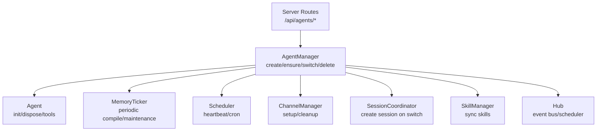
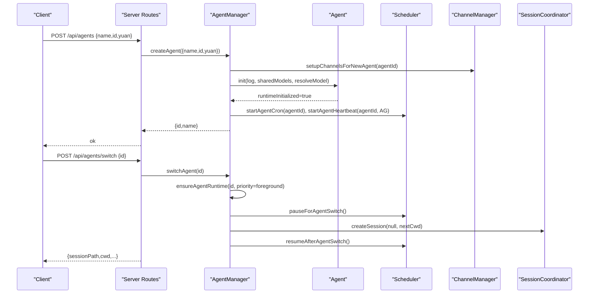
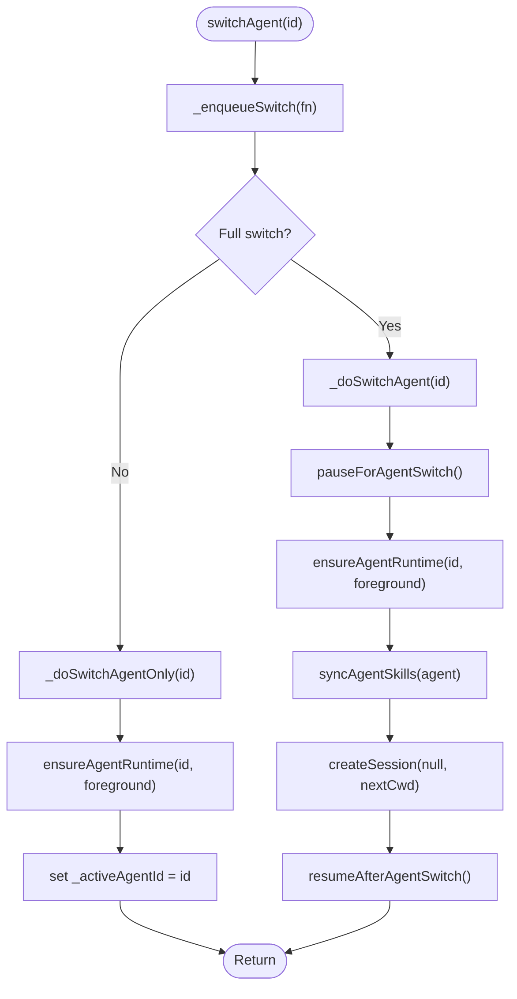
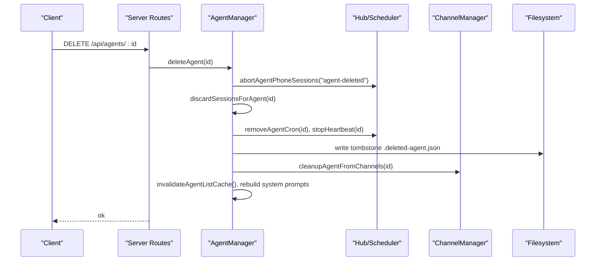
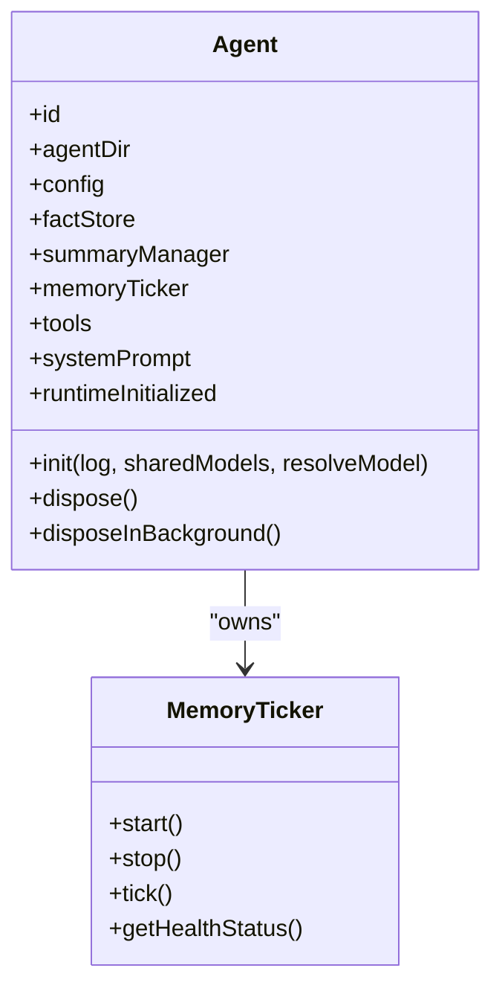
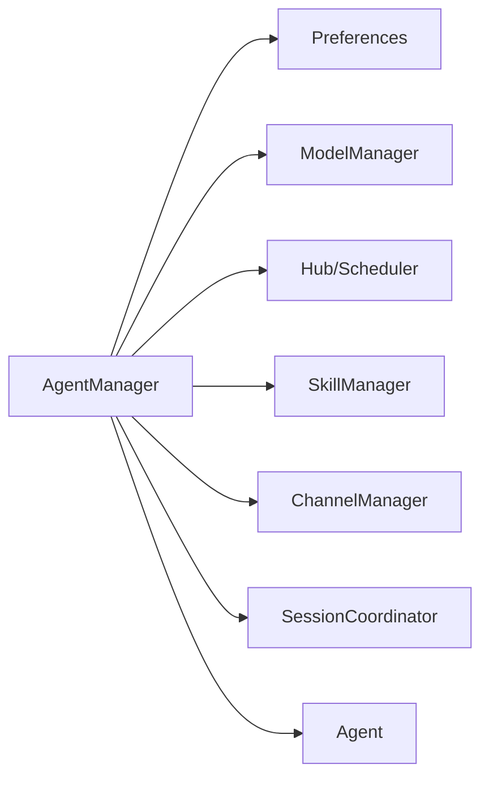

# Agent Lifecycle Management

<cite>
**Referenced Files in This Document**
- [agent-manager.ts](file://core/agent-manager.ts)
- [agent.ts](file://core/agent.ts)
- [agents.ts](file://server/routes/agents.ts)
- [resolve-agent.ts](file://server/utils/resolve-agent.ts)
- [memory-ticker.ts](file://lib/memory/memory-ticker.ts)
- [fresh-compact-maintainer.ts](file://hub/fresh-compact-maintainer.ts)
</cite>

## Table of Contents
1. [Introduction](#introduction)
2. [Project Structure](#project-structure)
3. [Core Components](#core-components)
4. [Architecture Overview](#architecture-overview)
5. [Detailed Component Analysis](#detailed-component-analysis)
6. [Dependency Analysis](#dependency-analysis)
7. [Performance Considerations](#performance-considerations)
8. [Troubleshooting Guide](#troubleshooting-guide)
9. [Conclusion](#conclusion)
10. [Appendices](#appendices)

## Introduction
This document explains the end-to-end lifecycle management of agents, focusing on creation, initialization, switching, and deletion. It details how the AgentManager class orchestrates agent state transitions from creation to runtime readiness, including concurrency control, resource isolation, persistence, tombstone handling for deleted agents, and cache invalidation strategies. Practical programmatic examples are provided via the REST API surface exposed by the server routes.

## Project Structure
The agent lifecycle is implemented primarily in core modules with a thin HTTP layer exposing operations:
- Core orchestration: AgentManager (creation, init, switch, delete, list, maintenance)
- Agent runtime: Agent (configuration loading, memory ticker, tools, system prompt)
- Server routes: /api/agents endpoints for programmatic access
- Memory subsystem: Memory Ticker for periodic compilation and maintenance
- Hub maintenance: Fresh compact maintainer for bridge sessions

**Diagram sources**
- [agent-manager.ts:231-336](file://core/agent-manager.ts#L231-L336)
- [agent.ts:278-647](file://core/agent.ts#L278-L647)
- [agents.ts:195-310](file://server/routes/agents.ts#L195-L310)
- [memory-ticker.ts:64-96](file://lib/memory/memory-ticker.ts#L64-L96)

**Section sources**
- [agent-manager.ts:98-146](file://core/agent-manager.ts#L98-L146)
- [agent.ts:91-250](file://core/agent.ts#L91-L250)
- [agents.ts:188-310](file://server/routes/agents.ts#L188-L310)

## Core Components
- AgentManager: Central coordinator for scanning, creating, initializing, switching, deleting agents; manages caches, queues, and concurrent runtime initialization.
- Agent: Per-agent runtime that loads config, initializes memory, builds system prompt, creates tools, and exposes disposal.
- Server Routes: REST endpoints to create, list, switch, delete agents and manage their configuration and assets.
- MemoryTicker: Periodic background job that compiles memory, updates summaries, and refreshes system prompts.

Key responsibilities:
- Creation: Validate inputs, scaffold directories/files, copy templates, set defaults, initialize channels, run init, register in-memory map, start scheduler tasks.
- Initialization: Load config, migrate memory v1→v2 if needed, construct FactStore + SummaryManager, build memory ticker, create tools, build system prompt, mark runtimeInitialized.
- Switching: Queue-based serialization, ensure runtime ready, update active pointer, sync skills, create new session, resume scheduling.
- Deletion: Abort phone sessions, discard sessions, dispose runtime, cleanup channels, write tombstone, detach bundles, update preferences/order, invalidate caches.

**Section sources**
- [agent-manager.ts:557-753](file://core/agent-manager.ts#L557-L753)
- [agent-manager.ts:282-336](file://core/agent-manager.ts#L282-L336)
- [agent-manager.ts:769-843](file://core/agent-manager.ts#L769-L843)
- [agent-manager.ts:854-933](file://core/agent-manager.ts#L854-L933)
- [agent.ts:278-647](file://core/agent.ts#L278-L647)

## Architecture Overview
The lifecycle flows through well-defined stages with explicit error handling and idempotency guarantees.

**Diagram sources**
- [agents.ts:208-280](file://server/routes/agents.ts#L208-L280)
- [agent-manager.ts:557-753](file://core/agent-manager.ts#L557-L753)
- [agent-manager.ts:769-843](file://core/agent-manager.ts#L769-L843)

## Detailed Component Analysis

### AgentManager.createAgent
Responsibilities:
- Input validation and ID generation
- Directory scaffolding and template population
- Channel setup and rollback on failure
- Initial runtime init and skill synchronization
- Start cron and heartbeat
- Update caches and rebuild system prompts

Concurrency and isolation:
- Each agent has its own directory under agentsDir, ensuring filesystem isolation.
- Channels are per-agent; failures trigger full rollback to avoid orphaned state.

Error recovery:
- Any step after filesystem mkdir can fail; _rollbackAgentCreation removes created files and cleans channel state.

Cache and prompt consistency:
- After creation, invalidates agent list cache and rebuilds all agents’ system prompts to reflect roster changes.

Practical example (programmatic):
- Use POST /api/agents with JSON body { name, id?, yuan? }. The route validates, calls engine.createAgent, emits app events, and returns the created agent metadata.

**Section sources**
- [agent-manager.ts:557-753](file://core/agent-manager.ts#L557-L753)
- [agents.ts:208-221](file://server/routes/agents.ts#L208-L221)

### AgentManager.ensureAgentRuntime
Responsibilities:
- Ensure an agent instance exists (load config only if missing)
- Prevent duplicate initialization via promise deduplication
- Enqueue runtime init with priority (foreground/background)
- Concurrency-limited pump to process queue

State transitions:
- From “config loaded” to “runtimeInitialized=true” after Agent.init completes.

Concurrent initialization handling:
- Uses a bounded concurrency pool (_runtimeInitConcurrency) and a priority queue.
- Deduplicates requests for the same agentId via _runtimeInitPromises.

Error recovery:
- If agent not found or config load fails, throws descriptive errors.
- Failed init does not block other agents due to queue separation.

Practical example (programmatic):
- Switching flow calls ensureAgentRuntime with priority foreground to guarantee readiness before UI proceeds.

**Section sources**
- [agent-manager.ts:282-336](file://core/agent-manager.ts#L282-L336)

### AgentManager.switchAgent and switchAgentOnly
Responsibilities:
- serialize switches via Promise chain to prevent race conditions
- Pure pointer switch vs full switch (including session creation)
- Ensure runtime readiness, clear config cache, update default model reference
- Sync skills and create a new session for the target agent

State transitions:
- Active agent pointer updated after successful runtime init and optional session creation.

Resource isolation:
- Heartbeat/cron remain per-agent; switching does not stop them during transition.
- Session creation uses nextCwd derived from home folder or previous cwd.

Error recovery:
- On failure, reverts activeAgentId to previous value.
- try/finally ensures scheduler pause/resume pairing.

Practical example (programmatic):
- POST /api/agents/switch { id } triggers full switch and returns session context.

**Diagram sources**
- [agent-manager.ts:769-843](file://core/agent-manager.ts#L769-L843)

**Section sources**
- [agent-manager.ts:769-843](file://core/agent-manager.ts#L769-L843)
- [agents.ts:223-280](file://server/routes/agents.ts#L223-L280)

### AgentManager.deleteAgent
Responsibilities:
- Guard against deleting active agent
- Abort phone sessions and discard sessions for agent
- Remove in-memory instances and activity stores
- Stop scheduler tasks and dispose agent runtime
- Cleanup channels and detach from skill bundles
- Write tombstone file (.deleted-agent.json)
- Update primary agent and order preferences
- Invalidate caches and rebuild system prompts

Tombstone handling:
- Tombstone includes version, agentId, agentName, yuan, deletedAt.
- Deleted agents are excluded from scans and lists; tombstones allow listing deleted agents and preserving metadata.

Persistence and cleanup:
- Ensures no dangling references across hub schedulers, subagent threads, and channel entries.

Practical example (programmatic):
- DELETE /api/agents/:id triggers deletion and emits agent-deleted event.

**Diagram sources**
- [agent-manager.ts:854-933](file://core/agent-manager.ts#L854-L933)
- [agents.ts:282-295](file://server/routes/agents.ts#L282-L295)

**Section sources**
- [agent-manager.ts:854-933](file://core/agent-manager.ts#L854-L933)
- [agents.ts:282-295](file://server/routes/agents.ts#L282-L295)

### Agent Runtime Initialization (Agent.init)
Responsibilities:
- Compatibility checks and config loading
- Identity and memory master/experience flags
- Memory v1→v2 migration (if needed)
- Construct FactStore and SummaryManager
- Initialize MemoryTicker with callbacks for compiled memory and system prompt refresh
- Create toolsets (web search, todo, pinned memory, experience, desk, browser, notify, terminal, workflow, subagent)
- Build system prompt and mark runtimeInitialized
- Schedule initial memory maintenance

Resource isolation:
- All paths and DBs are scoped to agentDir, ensuring strict isolation between agents.

Error recovery:
- Migration failures are logged but do not block startup; markers prevent repeated attempts.
- Utility model resolution errors are warned at startup; runtime tickers handle subsequent failures gracefully.

**Diagram sources**
- [agent.ts:278-647](file://core/agent.ts#L278-L647)
- [memory-ticker.ts:64-96](file://lib/memory/memory-ticker.ts#L64-L96)

**Section sources**
- [agent.ts:278-647](file://core/agent.ts#L278-L647)

### Cache Invalidation Strategies
- Agent list cache: TTL-based caching with explicit invalidation on create/update/delete and avatar changes.
- Config cache: Cleared when switching agents or updating providers; ensures fresh reads for downstream components.
- System prompt rebuild: Triggered after roster changes and description refresh to keep prompts consistent.

Practical hooks:
- invalidateAgentListCache() called after create, delete, avatar upload/remove, and config updates.
- clearConfigCache() invoked during switch and provider updates.

**Section sources**
- [agent-manager.ts:369-408](file://core/agent-manager.ts#L369-L408)
- [agents.ts:195-206](file://server/routes/agents.ts#L195-L206)
- [agents.ts:375-391](file://server/routes/agents.ts#L375-L391)
- [agents.ts:596-603](file://server/routes/agents.ts#L596-L603)

### Resource Isolation Between Agents
- Filesystem: Each agent has a dedicated directory under agentsDir with isolated memory, sessions, avatars, and desk artifacts.
- Database: FactStore DB path is per-agent.
- Tools: Tool constructors receive agent-scoped paths and callbacks; no cross-agent state leakage.
- Scheduler: Heartbeat and cron are per-agent; switching does not interfere with background tasks.

**Section sources**
- [agent.ts:168-250](file://core/agent.ts#L168-L250)
- [agent-manager.ts:1034-1119](file://core/agent-manager.ts#L1034-L1119)

### Concurrent Initialization Handling
- Bounded concurrency pool prevents resource contention during multi-agent startup.
- Priority queue ensures foreground tasks (e.g., active agent) complete first.
- Promise deduplication avoids redundant work for the same agent.

**Section sources**
- [agent-manager.ts:282-336](file://core/agent-manager.ts#L282-L336)

### Error Recovery Patterns
- Creation rollback: Partial state cleaned up on any failure after directory creation.
- Switch revert: Previous activeAgentId restored on failure.
- Memory ticker resilience: Provider credential errors are warned at startup; runtime tickers continue with graceful degradation.
- Tombstone preservation: Deleted agents retain metadata for UI and integration visibility.

**Section sources**
- [agent-manager.ts:552-556](file://core/agent-manager.ts#L552-L556)
- [agent-manager.ts:814-818](file://core/agent-manager.ts#L814-L818)
- [agent.ts:314-341](file://core/agent.ts#L314-L341)

### Agent Persistence and Tombstone Handling
- Persistence: Agent data persisted under agentsDir/{agentId}/... including config.yaml, memory/, sessions/, etc.
- Tombstone: .deleted-agent.json records deletion metadata; scans exclude deleted agents from active lists while allowing retrieval of deleted info.

**Section sources**
- [agent-manager.ts:176-210](file://core/agent-manager.ts#L176-L210)
- [agent-manager.ts:889-900](file://core/agent-manager.ts#L889-L900)

### Programmatic API Examples
- Create agent:
  - POST /api/agents with JSON { name, id?, yuan? }
  - Returns { ok: true, id, name }
- List agents:
  - GET /api/agents?fresh=1 to bypass cache
  - Returns { agents: [...] }
- Switch agent:
  - POST /api/agents/switch with JSON { id }
  - Returns { ok: true, agent, sessionPath, cwd, homeFolder, ... }
- Delete agent:
  - DELETE /api/agents/:id
  - Returns { ok: true }

Note: The server routes validate IDs, enforce permissions where applicable, and emit application events for UI synchronization.

**Section sources**
- [agents.ts:195-310](file://server/routes/agents.ts#L195-L310)
- [resolve-agent.ts:7-18](file://server/utils/resolve-agent.ts#L7-L18)

## Dependency Analysis
AgentManager depends on multiple subsystems via dependency injection:
- Preferences, Models, Hub, Skills, SearchConfig, ChannelManager, SessionCoordinator
- These dependencies enable cross-cutting concerns like scheduling, skills syncing, and session coordination without tight coupling.

**Diagram sources**
- [agent-manager.ts:130-146](file://core/agent-manager.ts#L130-L146)
- [agent-manager.ts:1034-1119](file://core/agent-manager.ts#L1034-L1119)

**Section sources**
- [agent-manager.ts:130-146](file://core/agent-manager.ts#L130-L146)

## Performance Considerations
- Runtime initialization concurrency limits CPU contention during startup.
- Memory maintenance runs asynchronously with bounded concurrency to avoid blocking foreground tasks.
- Agent list cache reduces I/O overhead; TTL and explicit invalidation balance freshness and performance.
- Background description refresh avoids synchronous LLM calls during list operations.

[No sources needed since this section provides general guidance]

## Troubleshooting Guide
Common issues and diagnostics:
- Agent not found during switch: Ensure agent exists and is not deleted; check tombstone presence.
- Model not available after switch: Verify models.chat contains both id and provider; otherwise default model behavior applies.
- Memory system unavailable: Check utility_large or chat fallback configuration; runtime warnings indicate resolution failures.
- Stale agent list: Call GET /api/agents?fresh=1 to force refresh.

Operational tips:
- Use health status endpoint for memory ticker to monitor degraded/unhealthy states.
- Inspect logs for “rebuild systemPrompt failed” and “description refresh failed” to identify transient issues.

**Section sources**
- [agent-manager.ts:801-818](file://core/agent-manager.ts#L801-L818)
- [agent.ts:365-376](file://core/agent.ts#L365-L376)
- [agents.ts:195-206](file://server/routes/agents.ts#L195-L206)

## Conclusion
The agent lifecycle is designed for robustness, isolation, and scalability. AgentManager coordinates creation, initialization, switching, and deletion with strong error handling and concurrency controls. Agents maintain strict resource isolation, while tombstones preserve metadata for deleted agents. Cache invalidation and background maintenance ensure consistency and performance. The REST API provides a clean interface for programmatic management.

[No sources needed since this section summarizes without analyzing specific files]

## Appendices

### API Reference Summary
- POST /api/agents: Create agent
- GET /api/agents: List agents (supports ?fresh=1)
- POST /api/agents/switch: Switch active agent
- DELETE /api/agents/:id: Delete agent
- PUT /api/agents/primary: Set primary agent
- GET/PUT /api/agents/:id/config: Read/write agent config
- GET/PUT /api/agents/:id/identity, ishiki, public-ishiki, pinned: Manage agent content
- GET/PUT /api/agents/:id/experience: Manage experience documents

**Section sources**
- [agents.ts:195-800](file://server/routes/agents.ts#L195-L800)

### Memory Maintenance and Fresh Compaction
- MemoryTicker performs periodic compilation and summary updates.
- Fresh compact maintainer schedules daily compactions for bridge sessions, leveraging agent memory ticker capabilities.

**Section sources**
- [memory-ticker.ts:64-96](file://lib/memory/memory-ticker.ts#L64-L96)
- [fresh-compact-maintainer.ts:42-89](file://hub/fresh-compact-maintainer.ts#L42-L89)