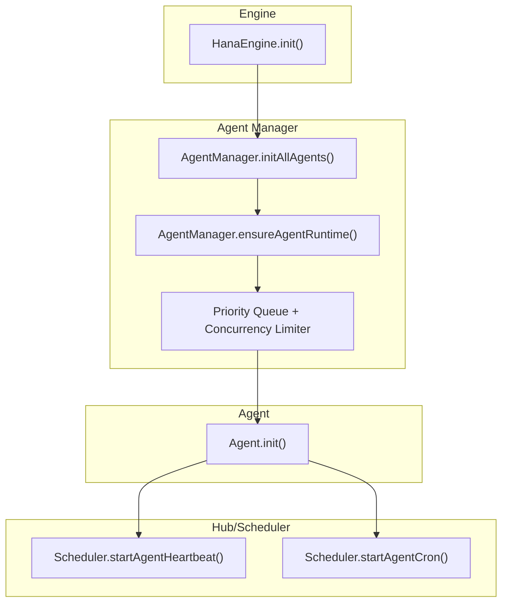
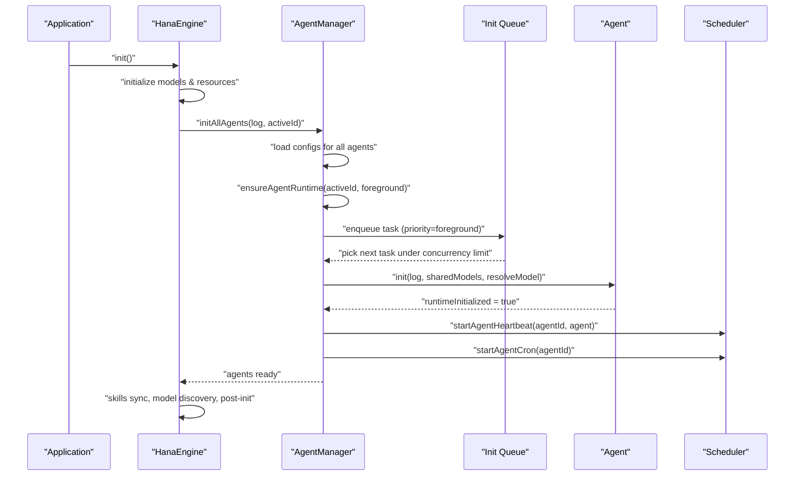
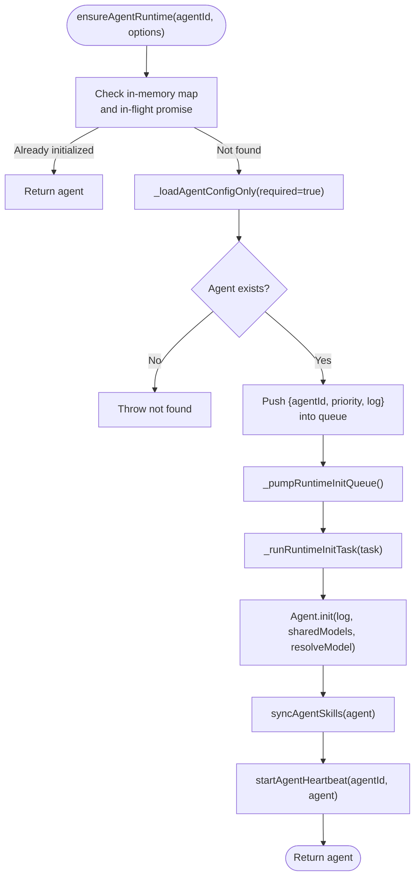
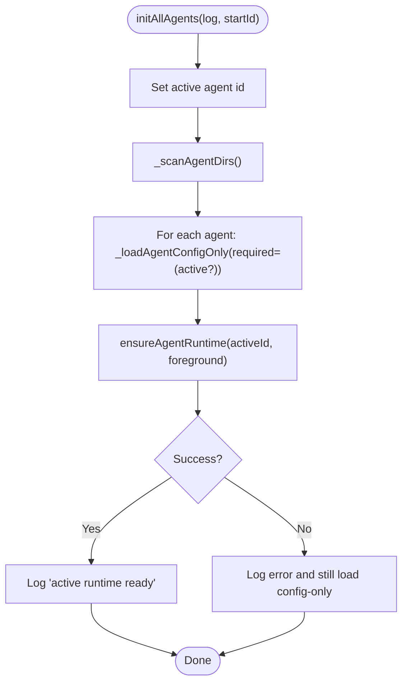
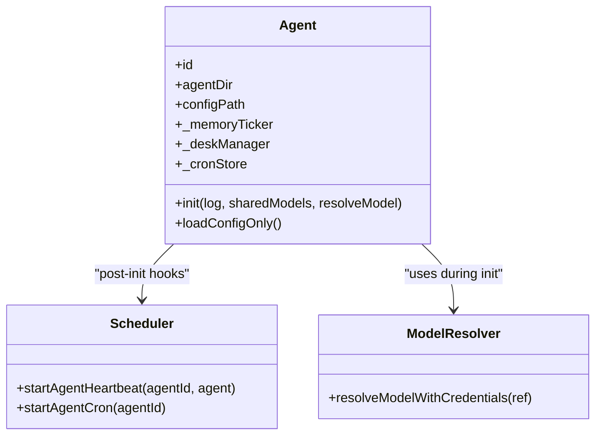
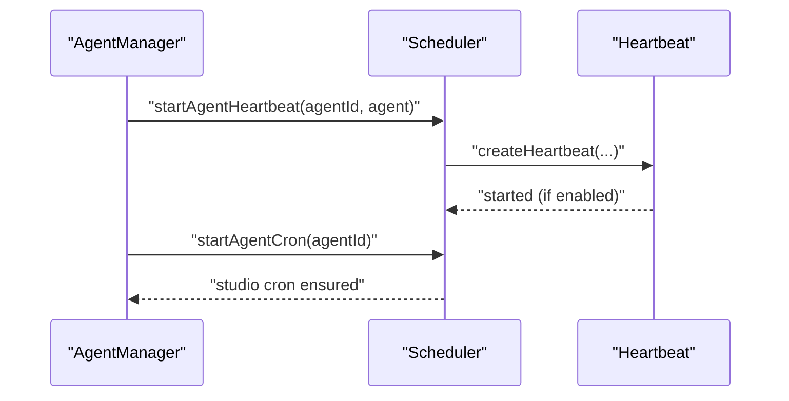
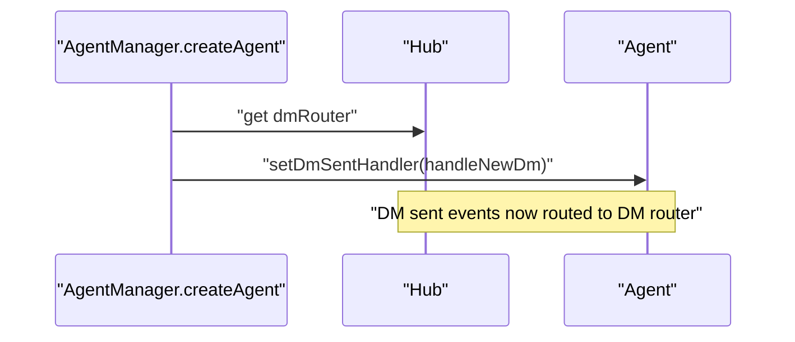
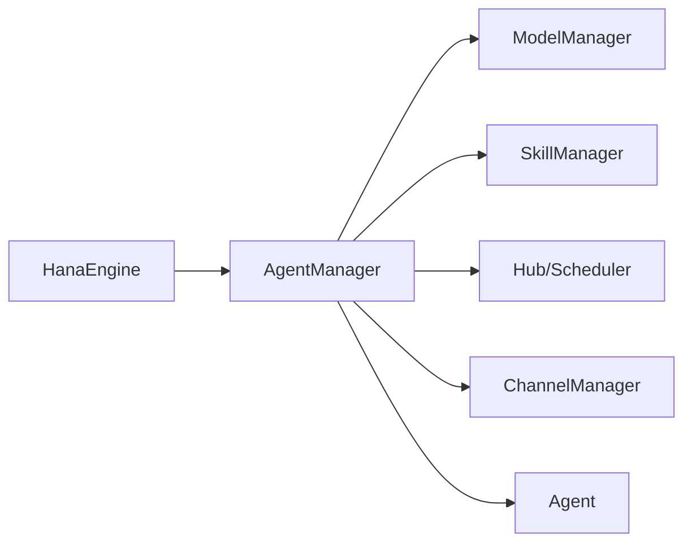

# Agent Runtime Initialization

<cite>
**Referenced Files in This Document**
- [agent-manager.ts](file://core/agent-manager.ts)
- [engine.ts](file://core/engine.ts)
- [agent.ts](file://core/agent.ts)
- [scheduler.ts](file://hub/scheduler.ts)
- [index.ts](file://hub/index.ts)
- [errors.ts](file://shared/errors.ts)
</cite>

## Table of Contents
1. [Introduction](#introduction)
2. [Project Structure](#project-structure)
3. [Core Components](#core-components)
4. [Architecture Overview](#architecture-overview)
5. [Detailed Component Analysis](#detailed-component-analysis)
6. [Dependency Analysis](#dependency-analysis)
7. [Performance Considerations](#performance-considerations)
8. [Troubleshooting Guide](#troubleshooting-guide)
9. [Conclusion](#conclusion)

## Introduction
This document explains the agent runtime initialization pipeline with a focus on:
- ensureAgentRuntime(): idempotent, priority-queued, concurrency-controlled agent runtime bootstrapping
- initAllAgents(): startup orchestration that loads configs and initializes the active agent first
- Concurrency handling via priority queues and shared model resolution
- Dependency injection patterns used across components
- The full initialization sequence: skill synchronization, heartbeat setup, cron job registration, and DM callback binding
- Error recovery strategies, partial initialization states, and graceful degradation when dependencies fail
- Examples of custom initialization hooks and debugging techniques

## Project Structure
The initialization spans several core modules:
- Engine orchestrates high-level startup phases and delegates to AgentManager for agents
- AgentManager manages agent lifecycle, including concurrent runtime initialization
- Agent performs per-agent initialization (config, memory, tools, desk/cron)
- Hub/Scheduler provides heartbeat and cron scheduling services
- Shared error definitions classify recoverable vs critical errors

**Diagram sources**
- [engine.ts:1500-1699](file://core/engine.ts#L1500-L1699)
- [agent-manager.ts:230-336](file://core/agent-manager.ts#L230-L336)
- [agent.ts:278-426](file://core/agent.ts#L278-L426)
- [scheduler.ts:100-130](file://hub/scheduler.ts#L100-L130)

**Section sources**
- [engine.ts:1500-1699](file://core/engine.ts#L1500-L1699)
- [agent-manager.ts:230-336](file://core/agent-manager.ts#L230-L336)

## Core Components
- HanaEngine: top-level bootstrap; initializes models, then calls AgentManager.initAllAgents(), then skills, model discovery, and post-init tasks
- AgentManager: scans agents, loads configs, ensures runtime for the active agent with priority queue and concurrency control, triggers skill sync and heartbeat
- Agent: per-agent initialization including config loading, memory subsystem, tool creation, desk/cron integration
- Scheduler: heartbeat and cron scheduler; starts/stops heartbeats per agent and studio-wide cron jobs
- Hub: composes engine and scheduler, exposes start/stop APIs and DM handler wiring

Key responsibilities:
- ensureAgentRuntime(): idempotent, deduplicates concurrent requests, enqueues with priority, runs within concurrency limit
- initAllAgents(): sets active agent, loads all configs, boots active agent first, logs readiness
- Agent.init(): builds memory ticker, tools, desk manager, cron store, and optional channels/DM integrations

**Section sources**
- [engine.ts:1500-1699](file://core/engine.ts#L1500-L1699)
- [agent-manager.ts:230-336](file://core/agent-manager.ts#L230-L336)
- [agent.ts:278-426](file://core/agent.ts#L278-L426)
- [scheduler.ts:100-130](file://hub/scheduler.ts#L100-L130)

## Architecture Overview
End-to-end initialization flow from engine to agent runtime and scheduling:

**Diagram sources**
- [engine.ts:1500-1699](file://core/engine.ts#L1500-L1699)
- [agent-manager.ts:230-336](file://core/agent-manager.ts#L230-L336)
- [agent.ts:278-426](file://core/agent.ts#L278-L426)
- [scheduler.ts:100-130](file://hub/scheduler.ts#L100-L130)

## Detailed Component Analysis

### ensureAgentRuntime(): Concurrent, Priority-Queued Bootstrapping
- Idempotency: returns existing instance if already initialized; deduplicates in-flight promises by agentId
- Concurrency: bounded by a fixed concurrency limit; tasks are sorted by priority (foreground first) before execution
- Shared model resolution: passes sharedModels and a resolveModel function into Agent.init() so each agent can resolve utility/memory models at runtime
- Post-init hooks: after successful Agent.init(), synchronizes agent skills and starts agent heartbeat

**Diagram sources**
- [agent-manager.ts:282-336](file://core/agent-manager.ts#L282-L336)

**Section sources**
- [agent-manager.ts:282-336](file://core/agent-manager.ts#L282-L336)

### initAllAgents(): Startup Orchestration
- Sets active agent ID
- Scans agent directories and loads configs for all agents (non-blocking failures for non-active agents)
- Ensures runtime for the active agent with foreground priority; failure is logged but does not block app startup
- Logs readiness status indicating whether the active runtime is ready or needs repair

**Diagram sources**
- [agent-manager.ts:230-261](file://core/agent-manager.ts#L230-L261)

**Section sources**
- [agent-manager.ts:230-261](file://core/agent-manager.ts#L230-L261)

### Agent.init(): Per-Agent Bootstrap
- Compatibility checks and config loading
- Identity and memory/experience flags
- Memory v2 subsystem: FactStore, SummaryManager, migration from v1, memory ticker
- Utility and memory model resolution using sharedModels and resolveModel
- Tool creation: memory search, web search/fetch, todo, pinned memory, experience tools
- Desk system: desk manager, cron store, automation tool, file/browser/notify/terminal tools
- Channels and DM tools (optional, when channelsDir and agentsDir exist)
- Skill install tool and subagent tools wired through callbacks

**Diagram sources**
- [agent.ts:278-600](file://core/agent.ts#L278-L600)
- [scheduler.ts:100-130](file://hub/scheduler.ts#L100-L130)

**Section sources**
- [agent.ts:278-600](file://core/agent.ts#L278-L600)

### Hub/Scheduler Integration: Heartbeat and Cron
- Scheduler.start(): starts heartbeat loop, studio cron, and daily fresh-compact maintenance
- startAgentHeartbeat(agentId, agent): creates per-agent heartbeat with workspace-aware scanning and configurable interval; respects master and per-agent enable flags
- startAgentCron(agentId): ensures studio cron scheduler is running (singleton)
- pause/resume around agent switches to avoid inconsistent state during session rebuild

**Diagram sources**
- [scheduler.ts:100-130](file://hub/scheduler.ts#L100-L130)
- [scheduler.ts:131-184](file://hub/scheduler.ts#L131-L184)

**Section sources**
- [scheduler.ts:100-184](file://hub/scheduler.ts#L100-L184)

### DM Callback Binding
- During createAgent and resumeAfterAgentSwitch, DM handlers are injected into agents so outbound DM events route to the DM router
- This ensures DM capability is available immediately after agent runtime is ready

**Diagram sources**
- [agent-manager.ts:743-747](file://core/agent-manager.ts#L743-L747)
- [index.ts:857-864](file://hub/index.ts#L857-L864)

**Section sources**
- [agent-manager.ts:743-747](file://core/agent-manager.ts#L743-L747)
- [index.ts:857-864](file://hub/index.ts#L857-L864)

## Dependency Analysis
- Engine depends on AgentManager for agent lifecycle and on Hub/Scheduler for background tasks
- AgentManager depends on:
  - ModelManager for model resolution
  - Skills manager for skill synchronization
  - Hub/Scheduler for heartbeat and cron
  - Channel manager for channel setup/cleanup
- Agent depends on callbacks injected by AgentManager to access Engine features without direct coupling

**Diagram sources**
- [engine.ts:1500-1699](file://core/engine.ts#L1500-L1699)
- [agent-manager.ts:230-336](file://core/agent-manager.ts#L230-L336)

**Section sources**
- [engine.ts:1500-1699](file://core/engine.ts#L1500-L1699)
- [agent-manager.ts:230-336](file://core/agent-manager.ts#L230-L336)

## Performance Considerations
- Concurrency limit for runtime initialization prevents resource contention during startup
- Foreground priority ensures the active agent boots first, improving perceived responsiveness
- Memory ticker and desk/cron run asynchronously; initial maintenance is deferred to avoid blocking UI
- Model resolution is performed lazily at tick time to adapt to credential changes without restarts

[No sources needed since this section provides general guidance]

## Troubleshooting Guide
Common issues and diagnostics:
- Partial initialization state: If Agent.init fails, configs are still loaded for the active agent to prevent downstream misconfiguration; check logs for “config load failed” and “active runtime needs repair” messages
- Model resolution failures: Utility/memory model resolution errors are logged as warnings; memory ticker will retry on subsequent ticks once credentials are corrected
- Skill sync failures: Classified as degraded/retryable; system continues with best-effort behavior
- Heartbeat not firing: Verify master switch and per-agent heartbeat_enabled flags; confirm Scheduler.startAgentHeartbeat was called post-init
- DM not routing: Ensure DM handler is set after agent init; verify hub.dmRouter is available

Debugging tips:
- Use module logger to trace initialization steps and timing
- Inspect startup logs for agent count and active runtime status
- Validate sharedModels and resolveModel availability passed to Agent.init
- Confirm Scheduler.start() has been invoked and heartbeat intervals are configured

**Section sources**
- [agent-manager.ts:230-261](file://core/agent-manager.ts#L230-L261)
- [agent.ts:364-426](file://core/agent.ts#L364-L426)
- [errors.ts:29-34](file://shared/errors.ts#L29-L34)

## Conclusion
The agent runtime initialization pipeline is designed for robustness and performance:
- Prioritized, concurrent initialization ensures the active agent is ready quickly while other agents initialize in the background
- Shared model resolution and dependency injection decouple components and allow dynamic configuration updates
- Graceful degradation and partial initialization states keep the application usable even when some dependencies fail
- Clear hooks for skills, heartbeat, cron, and DM callbacks integrate agents into the broader runtime seamlessly

[No sources needed since this section summarizes without analyzing specific files]