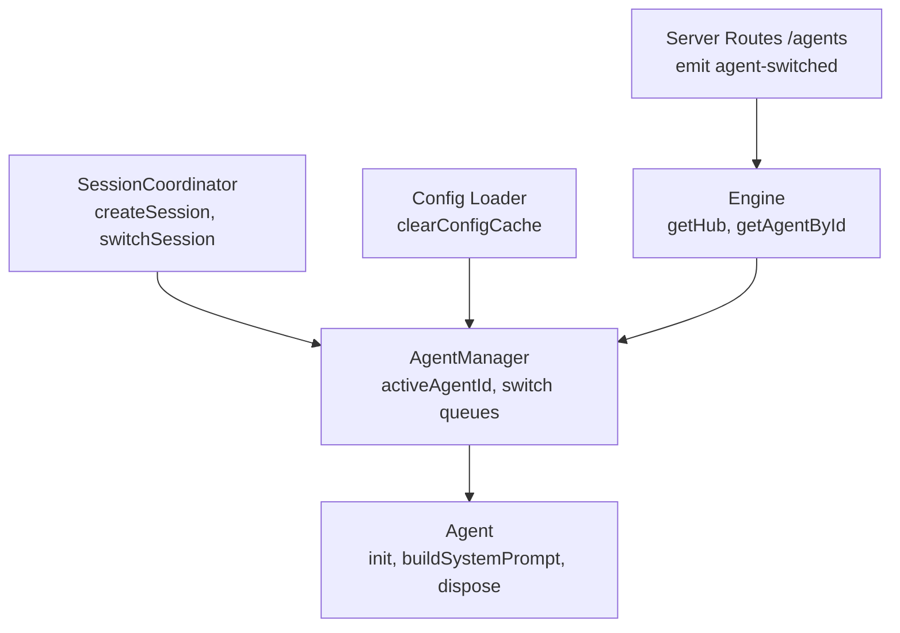
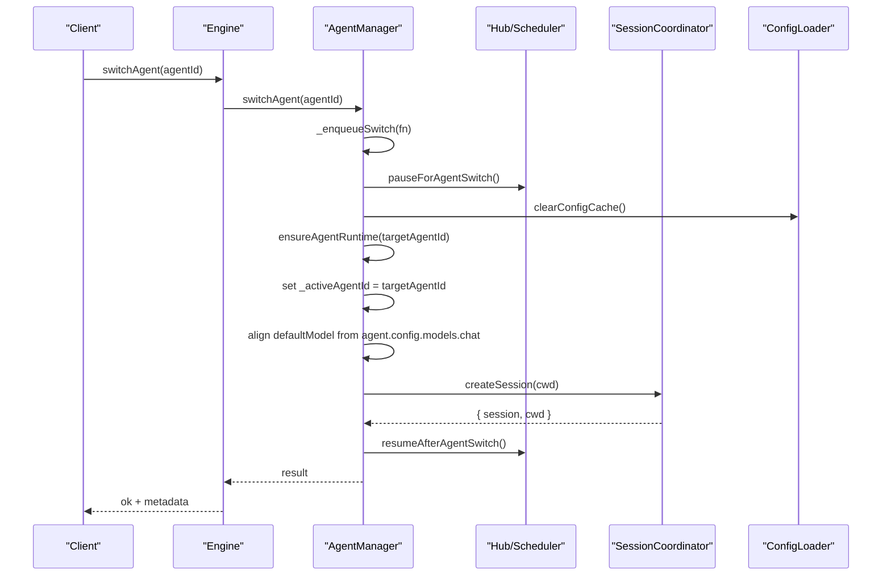
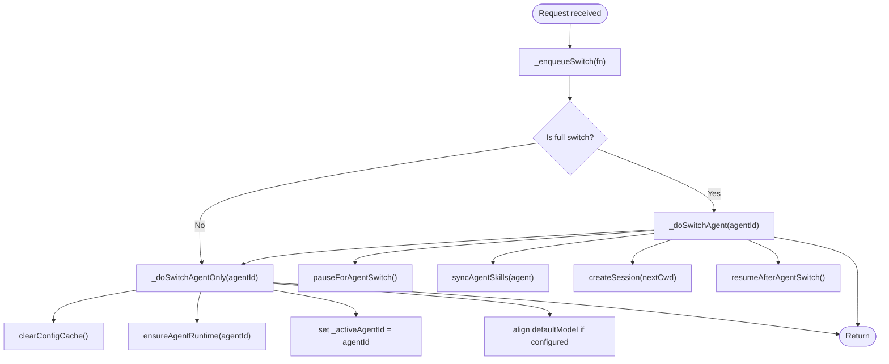
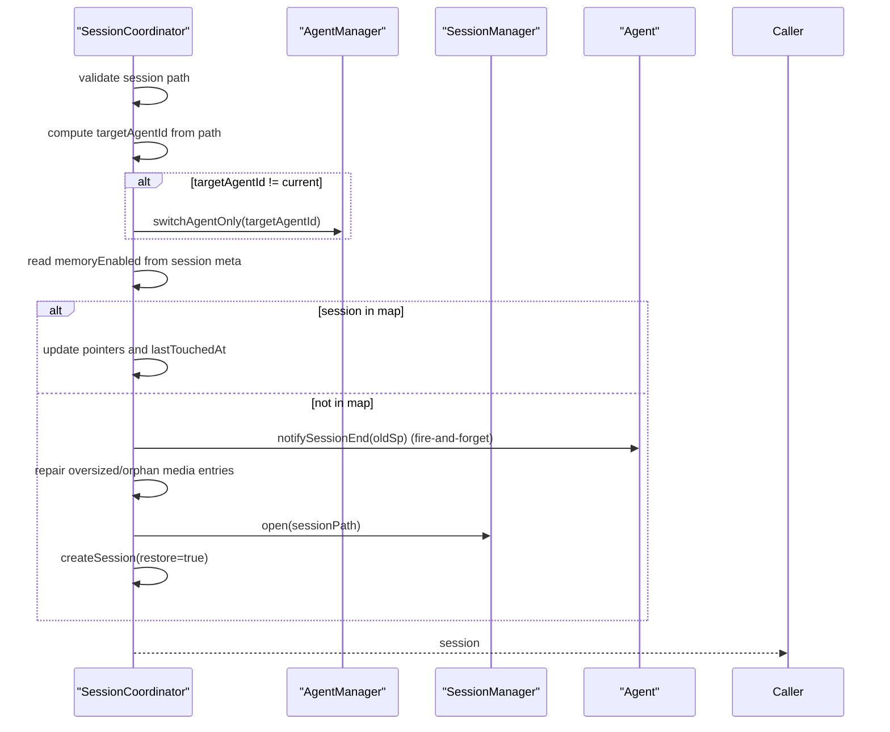
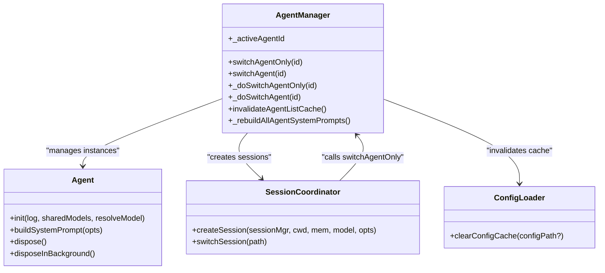

# Agent Switching and Context Management

<cite>
**Referenced Files in This Document**
- [agent-manager.ts](file://core/agent-manager.ts)
- [agent.ts](file://core/agent.ts)
- [session-coordinator.ts](file://core/session-coordinator.ts)
- [config-loader.ts](file://lib/memory/config-loader.ts)
- [engine.ts](file://core/engine.ts)
- [agents.ts](file://server/routes/agents.ts)
</cite>

## Table of Contents
1. [Introduction](#introduction)
2. [Project Structure](#project-structure)
3. [Core Components](#core-components)
4. [Architecture Overview](#architecture-overview)
5. [Detailed Component Analysis](#detailed-component-analysis)
6. [Dependency Analysis](#dependency-analysis)
7. [Performance Considerations](#performance-considerations)
8. [Troubleshooting Guide](#troubleshooting-guide)
9. [Conclusion](#conclusion)

## Introduction
This document explains the agent switching mechanisms and context management in the system, focusing on:
- Queue-based switching to prevent concurrent switches and ensure atomic state transitions
- Differences between full switching (with session restoration) and pointer-only switching
- Resource cleanup, configuration cache invalidation, and system prompt rebuilding across agents
- Interaction with SessionCoordinator for cross-agent session management
- The role of activeAgentId in routing operations

## Project Structure
The agent switching logic spans three core modules:
- AgentManager: owns the active agent pointer, manages agent lifecycle, and orchestrates switching
- Agent: per-agent runtime, tools, memory ticker, and system prompt building
- SessionCoordinator: session creation/switching, including cross-agent session handling

**Diagram sources**
- [agent-manager.ts:767-843](file://core/agent-manager.ts#L767-L843)
- [agent.ts:278-446](file://core/agent.ts#L278-L446)
- [session-coordinator.ts:1772-1847](file://core/session-coordinator.ts#L1772-L1847)
- [config-loader.ts:67-74](file://lib/memory/config-loader.ts#L67-L74)
- [engine.ts:730-738](file://core/engine.ts#L730-L738)
- [agents.ts:239-286](file://server/routes/agents.ts#L239-L286)

**Section sources**
- [agent-manager.ts:98-171](file://core/agent-manager.ts#L98-L171)
- [agent.ts:168-250](file://core/agent.ts#L168-L250)
- [session-coordinator.ts:572-632](file://core/session-coordinator.ts#L572-L632)

## Core Components
- AgentManager
  - Maintains _activeAgentId and a Promise chain queue to serialize all switch operations
  - Provides switchAgentOnly() for pointer-only switching and switchAgent() for full switching
  - Ensures config cache invalidation and default model alignment during pointer-only switch
  - Rebuilds system prompts for all initialized agents when roster changes
- Agent
  - Initializes memory, tools, desk, and builds system prompt
  - Exposes buildSystemPrompt() used by both non-session paths and session snapshotting
  - Supports background disposal to avoid blocking UI during cross-agent switches
- SessionCoordinator
  - Creates sessions with frozen snapshots (system prompt, skills, tool names)
  - Handles cross-agent session switching by invoking AgentManager.switchAgentOnly() before restoring or creating sessions
  - Manages memory flushes and health checks around session switches

**Section sources**
- [agent-manager.ts:767-843](file://core/agent-manager.ts#L767-L843)
- [agent.ts:278-446](file://core/agent.ts#L278-L446)
- [session-coordinator.ts:736-1068](file://core/session-coordinator.ts#L736-L1068)

## Architecture Overview
The switching architecture uses a single Promise chain to serialize all switch requests, preventing race conditions and ensuring atomic transitions. Full switching pauses external schedulers, updates skills, and creates a new session; pointer-only switching only updates the active agent pointer and aligns the default model.

**Diagram sources**
- [agent-manager.ts:767-843](file://core/agent-manager.ts#L767-L843)
- [config-loader.ts:67-74](file://lib/memory/config-loader.ts#L67-L74)
- [session-coordinator.ts:736-1068](file://core/session-coordinator.ts#L736-L1068)
- [engine.ts:730-738](file://core/engine.ts#L730-L738)

## Detailed Component Analysis

### Queue-Based Switching and Atomic Transitions
- All switch operations are enqueued via a Promise chain to guarantee sequential execution
- The queue is resilient: failures do not block subsequent switches
- Pointer-only path avoids pausing/resuming schedulers and does not create sessions
- Full path wraps the operation with pause/resume to protect focus session window

**Diagram sources**
- [agent-manager.ts:767-843](file://core/agent-manager.ts#L767-L843)

**Section sources**
- [agent-manager.ts:767-843](file://core/agent-manager.ts#L767-L843)

### Pointer-Only Switching: switchAgentOnly()
- Validates target agent exists
- Clears configuration cache to avoid stale reads
- Ensures target agent runtime is initialized (foreground priority)
- Updates activeAgentId atomically within the queue
- Aligns default model based on agent.config.models.chat if valid

Use cases:
- Cross-agent session switching where the caller wants to restore an existing session without recreating it
- Rapid successive switches that should converge to the final target

**Section sources**
- [agent-manager.ts:783-818](file://core/agent-manager.ts#L783-L818)
- [config-loader.ts:67-74](file://lib/memory/config-loader.ts#L67-L74)

### Full Switching: switchAgent()
- Pauses hub scheduling to protect focus session window
- Executes pointer-only switching
- Synchronizes skills for the new agent
- Determines next working directory (explicit home folder, previous cwd, or agent home)
- Creates a new session under the target agent and returns session metadata
- Resumes hub scheduling after completion

**Section sources**
- [agent-manager.ts:820-843](file://core/agent-manager.ts#L820-L843)

### Cross-Agent Session Management with SessionCoordinator
- When switching to a session belonging to another agent:
  - Phase 1: call switchAgentOnly(targetAgentId) to update active agent pointer
  - Restore memory-enabled flag from session meta
  - If session already cached, just update pointers and touch timestamps
  - Otherwise, trigger memory flush for old session, repair history issues, open session manager, and create session with restore flags
- Session creation freezes capability snapshots (system prompt, skills, tool names) to preserve prefix cache stability

**Diagram sources**
- [session-coordinator.ts:1772-1847](file://core/session-coordinator.ts#L1772-L1847)
- [session-coordinator.ts:736-1068](file://core/session-coordinator.ts#L736-L1068)

**Section sources**
- [session-coordinator.ts:1772-1847](file://core/session-coordinator.ts#L1772-L1847)
- [session-coordinator.ts:736-1068](file://core/session-coordinator.ts#L736-L1068)

### Configuration Cache Invalidation
- During pointer-only switching, clearConfigCache() is called to ensure fresh reads of config.yaml for the target agent
- Config loader caches parsed configs per path; clearing prevents stale provider/model references

**Section sources**
- [agent-manager.ts:783-818](file://core/agent-manager.ts#L783-L818)
- [config-loader.ts:67-74](file://lib/memory/config-loader.ts#L67-L74)

### System Prompt Rebuilding Across Agents
- After roster changes (e.g., agent created/deleted), AgentManager rebuilds each initialized agent’s _systemPrompt using buildSystemPrompt({ forceMemoryEnabled: master })
- Memory ticker’s onCompiled callback also refreshes _systemPrompt for non-session paths
- Per-session snapshots freeze system prompt at creation time to protect cache prefixes

**Section sources**
- [agent-manager.ts:151-163](file://core/agent-manager.ts#L151-L163)
- [agent.ts:378-446](file://core/agent.ts#L378-L446)
- [session-coordinator.ts:919-960](file://core/session-coordinator.ts#L919-L960)

### Resource Cleanup and Disposal
- On deleteAgent(), SessionCoordinator discards sessions for the agent, hub schedulers stop heartbeats/cron, and agent.dispose() closes FactStore and stops ticker
- disposeInBackground() allows non-blocking cleanup during cross-agent switches

**Section sources**
- [agent-manager.ts:854-933](file://core/agent-manager.ts#L854-L933)
- [agent.ts:652-680](file://core/agent.ts#L652-L680)

### Role of activeAgentId in Routing Operations
- activeAgentId determines which agent instance is returned by agent getter and influences default model alignment
- Server routes emit agent-switched events with agentId and session metadata after successful full switch

**Section sources**
- [agent-manager.ts:165-171](file://core/agent-manager.ts#L165-L171)
- [agents.ts:239-286](file://server/routes/agents.ts#L239-L286)

## Dependency Analysis
- AgentManager depends on:
  - Config loader for cache invalidation
  - Skills manager for syncAgentSkills
  - Hub scheduler for pause/resume and heartbeat/cron control
  - SessionCoordinator for createSession
- SessionCoordinator depends on:
  - AgentManager for switchAgentOnly
  - Model manager for thinking level defaults
  - SessionManager for opening/restoring sessions
- Agent depends on:
  - Callbacks injected by AgentManager to access Engine capabilities
  - Memory ticker and FactStore for compiled memory and system prompt updates

**Diagram sources**
- [agent-manager.ts:767-843](file://core/agent-manager.ts#L767-L843)
- [agent.ts:278-446](file://core/agent.ts#L278-L446)
- [session-coordinator.ts:1772-1847](file://core/session-coordinator.ts#L1772-L1847)
- [config-loader.ts:67-74](file://lib/memory/config-loader.ts#L67-L74)

**Section sources**
- [agent-manager.ts:767-843](file://core/agent-manager.ts#L767-L843)
- [agent.ts:278-446](file://core/agent.ts#L278-L446)
- [session-coordinator.ts:1772-1847](file://core/session-coordinator.ts#L1772-L1847)
- [config-loader.ts:67-74](file://lib/memory/config-loader.ts#L67-L74)

## Performance Considerations
- Queue-based switching serializes operations, avoiding contention and reducing overhead from repeated work
- Background disposal minimizes UI blocking during cross-agent switches
- Memory maintenance tasks are queued and rate-limited to reduce CPU spikes
- Freezing session snapshots preserves LLM cache prefixes, improving response times

[No sources needed since this section provides general guidance]

## Troubleshooting Guide
- If switching fails mid-way, the queue ensures subsequent switches still execute; check logs for error messages around switch phases
- For stale config issues, verify clearConfigCache() is invoked during pointer-only switching
- If system prompt appears outdated after roster changes, confirm _rebuildAllAgentSystemPrompts() was triggered
- For session restore errors, inspect health warnings and repair steps executed before SessionManager.open

**Section sources**
- [agent-manager.ts:767-843](file://core/agent-manager.ts#L767-L843)
- [session-coordinator.ts:1849-1936](file://core/session-coordinator.ts#L1849-L1936)

## Conclusion
The agent switching system guarantees safe, atomic transitions through a serialized queue, supports both pointer-only and full switching modes, and integrates tightly with session management and resource lifecycle. Configuration cache invalidation and systematic prompt rebuilding maintain consistency across agents, while SessionCoordinator ensures robust cross-agent session restoration and isolation.