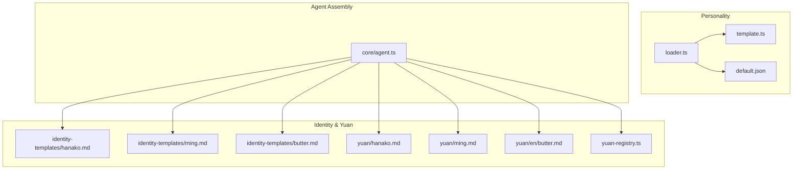
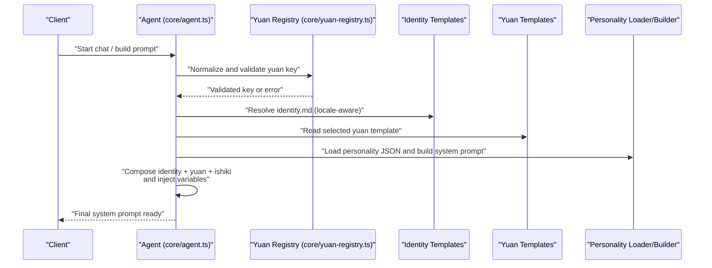
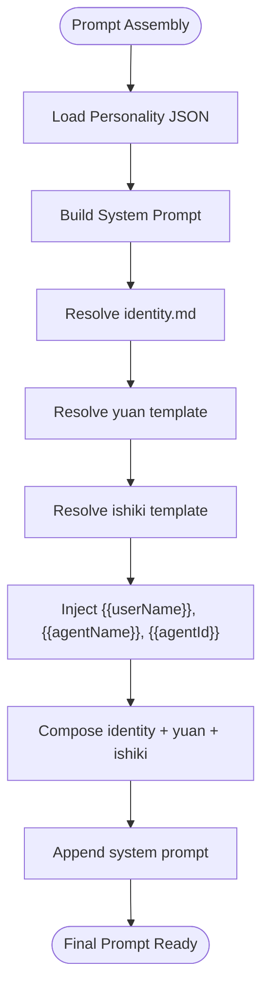
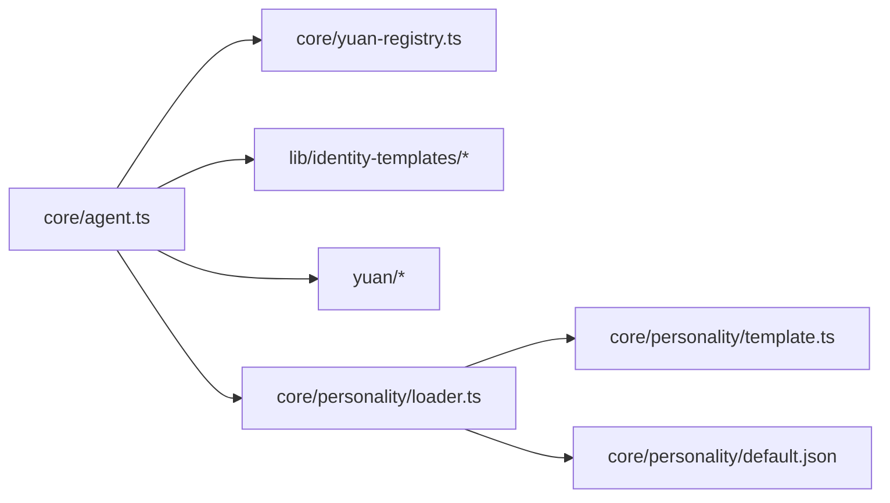

# Agent Personality & Identity

<cite>
**Referenced Files in This Document**
- [core/personality/loader.ts](file://core/personality/loader.ts)
- [core/personality/template.ts](file://core/personality/template.ts)
- [core/personality/default.json](file://core/personality/default.json)
- [core/agent.ts](file://core/agent.ts)
- [core/yuan-registry.ts](file://core/yuan-registry.ts)
- [lib/identity-templates/hanako.md](file://lib/identity-templates/hanako.md)
- [lib/identity-templates/ming.md](file://lib/identity-templates/ming.md)
- [lib/identity-templates/butter.md](file://lib/identity-templates/butter.md)
- [yuan/hanako.md](file://yuan/hanako.md)
- [yuan/ming.md](file://yuan/ming.md)
- [yuan/en/butter.md](file://yuan/en/butter.md)
</cite>

## Table of Contents
1. [Introduction](#introduction)
2. [Project Structure](#project-structure)
3. [Core Components](#core-components)
4. [Architecture Overview](#architecture-overview)
5. [Detailed Component Analysis](#detailed-component-analysis)
6. [Dependency Analysis](#dependency-analysis)
7. [Performance Considerations](#performance-considerations)
8. [Troubleshooting Guide](#troubleshooting-guide)
9. [Conclusion](#conclusion)
10. [Appendices](#appendices)

## Introduction
This document explains the agent personality system and identity customization in OpenShadow. It focuses on:
- The yuan template system with predefined personalities (hanako, ming, butter) and their behavioral characteristics
- The identity.md template structure and how it composes with yuan and ishiki templates
- How personality is injected into system prompts
- How to develop custom personalities, including knowledge domains, communication styles, and behavioral constraints
- The relationship between personality definitions and system prompt generation
- Personality inheritance, template composition, and testing variations

## Project Structure
The personality and identity system spans several modules:
- Personality JSON schema and loader for runtime behavior shaping
- Yuan templates that define internal thinking protocols (e.g., MOOD, Reflect, PULSE)
- Identity templates that describe who the agent is and how it relates to the user
- Agent assembly logic that composes identity, yuan, and ishiki into a cohesive persona block
- Yuan registry for validation and discovery of available templates

**Diagram sources**
- [core/personality/loader.ts:1-33](file://core/personality/loader.ts#L1-L33)
- [core/personality/template.ts:1-124](file://core/personality/template.ts#L1-L124)
- [core/personality/default.json:1-19](file://core/personality/default.json#L1-L19)
- [core/agent.ts:993-1040](file://core/agent.ts#L993-L1040)
- [core/yuan-registry.ts:1-90](file://core/yuan-registry.ts#L1-L90)
- [lib/identity-templates/hanako.md:1-4](file://lib/identity-templates/hanako.md#L1-L4)
- [lib/identity-templates/ming.md:1-4](file://lib/identity-templates/ming.md#L1-L4)
- [lib/identity-templates/butter.md:1-4](file://lib/identity-templates/butter.md#L1-L4)
- [yuan/hanako.md:1-38](file://yuan/hanako.md#L1-L38)
- [yuan/ming.md:1-41](file://yuan/ming.md#L1-L41)
- [yuan/en/butter.md:1-36](file://yuan/en/butter.md#L1-L36)

**Section sources**
- [core/personality/loader.ts:1-33](file://core/personality/loader.ts#L1-L33)
- [core/personality/template.ts:1-124](file://core/personality/template.ts#L1-L124)
- [core/personality/default.json:1-19](file://core/personality/default.json#L1-L19)
- [core/agent.ts:993-1040](file://core/agent.ts#L993-L1040)
- [core/yuan-registry.ts:1-90](file://core/yuan-registry.ts#L1-L90)
- [lib/identity-templates/hanako.md:1-4](file://lib/identity-templates/hanako.md#L1-L4)
- [lib/identity-templates/ming.md:1-4](file://lib/identity-templates/ming.md#L1-L4)
- [lib/identity-templates/butter.md:1-4](file://lib/identity-templates/butter.md#L1-L4)
- [yuan/hanako.md:1-38](file://yuan/hanako.md#L1-L38)
- [yuan/ming.md:1-41](file://yuan/ming.md#L1-L41)
- [yuan/en/butter.md:1-36](file://yuan/en/butter.md#L1-L36)

## Core Components
- Personality loader and validator: loads a JSON personality definition, validates its shape, and provides a fallback default when needed.
- System prompt builder: transforms a personality definition into a structured system message used by the LLM.
- Yuan templates: define internal thinking blocks (MOOD, Reflect, PULSE) that influence how the agent reasons before responding.
- Identity templates: short descriptions of the agent’s role and relationship to the user; composed with yuan and ishiki to form the full persona.
- Agent assembly: resolves identity, yuan, and ishiki files based on locale and selected yuan key, then injects them into the final prompt.
- Yuan registry: normalizes and validates the selected yuan key against available templates.

Key responsibilities:
- Personality JSON controls tone, traits, response style (language, length, emoji usage, creativity).
- Yuan templates control pre-response introspection and output formatting via special tags.
- Identity templates provide concise self-description and relational framing.
- Agent assembly ensures consistent ordering and variable substitution (e.g., {{userName}}, {{agentName}}).

**Section sources**
- [core/personality/loader.ts:1-33](file://core/personality/loader.ts#L1-L33)
- [core/personality/template.ts:1-124](file://core/personality/template.ts#L1-L124)
- [core/agent.ts:993-1040](file://core/agent.ts#L993-L1040)
- [core/yuan-registry.ts:1-90](file://core/yuan-registry.ts#L1-L90)

## Architecture Overview
The personality and identity system composes multiple layers to produce a final system prompt:
- Personality JSON defines behavioral parameters and is converted into a system prompt.
- Identity + Yuan + Ishiki are concatenated and templated with variables like {{userName}} and {{agentName}}.
- The agent selects the appropriate yuan template based on configuration and locale.
- The yuan registry validates the selected yuan key and lists available options.

**Diagram sources**
- [core/agent.ts:993-1040](file://core/agent.ts#L993-L1040)
- [core/yuan-registry.ts:1-90](file://core/yuan-registry.ts#L1-L90)
- [core/personality/loader.ts:1-33](file://core/personality/loader.ts#L1-L33)
- [core/personality/template.ts:1-124](file://core/personality/template.ts#L1-L124)

## Detailed Component Analysis

### Personality Template System
- Data model: name, greeting, tone, traits, response_style (use_emoji, max_length, language, creativity).
- Validation: strict checks ensure required fields and types.
- Loading: reads from a file path or falls back to embedded default if missing/invalid.
- System prompt building: constructs a comprehensive system message incorporating platform info, tool discipline, failure handling, memory guidance, and hard rules for tool usage.

Behavioral characteristics controlled by personality:
- Tone and traits shape conversational style.
- Response style dictates language, length limits, emoji usage, and creativity level.
- Hard rules enforce direct tool usage and transparent error reporting.

Practical example paths:
- Default personality definition: [core/personality/default.json:1-19](file://core/personality/default.json#L1-L19)
- Loader and fallback: [core/personality/loader.ts:1-33](file://core/personality/loader.ts#L1-L33)
- Schema and system prompt builder: [core/personality/template.ts:1-124](file://core/personality/template.ts#L1-L124)

**Section sources**
- [core/personality/template.ts:1-124](file://core/personality/template.ts#L1-L124)
- [core/personality/loader.ts:1-33](file://core/personality/loader.ts#L1-L33)
- [core/personality/default.json:1-19](file://core/personality/default.json#L1-L19)

### Yuan Template System (Predefined Personalities)
The yuan templates define internal thinking protocols that appear before responses:
- hanako: MOOD block (Vibe, Sparks, Reflections, Will) influencing emotional resonance and creative exploration.
- ming: Reflect block (Premise, Conduct, Reflection, Act) emphasizing analytical reasoning and grounded action.
- butter: PULSE block (Vibe, Echo, Read, Will) providing an English variant of inner monologue with emphasis on intuition and subtext.

Behavioral characteristics:
- hanako encourages empathetic, imaginative responses with reflective tension.
- ming prioritizes logical decomposition and honest uncertainty.
- butter blends emotional awareness with keen reading of unspoken cues.

Template selection and localization:
- The agent chooses the yuan template based on config.agent.yuan and locale (zh vs en directories).
- The yuan registry validates keys and lists available templates.

Practical example paths:
- hanako MOOD protocol: [yuan/hanako.md:1-38](file://yuan/hanako.md#L1-L38)
- ming Reflect protocol: [yuan/ming.md:1-41](file://yuan/ming.md#L1-L41)
- butter PULSE protocol (English): [yuan/en/butter.md:1-36](file://yuan/en/butter.md#L1-L36)
- Yuan key normalization and validation: [core/yuan-registry.ts:1-90](file://core/yuan-registry.ts#L1-L90)

**Section sources**
- [yuan/hanako.md:1-38](file://yuan/hanako.md#L1-L38)
- [yuan/ming.md:1-41](file://yuan/ming.md#L1-L41)
- [yuan/en/butter.md:1-36](file://yuan/en/butter.md#L1-L36)
- [core/yuan-registry.ts:1-90](file://core/yuan-registry.ts#L1-L90)

### Identity Template Structure and Composition
Identity templates provide a concise description of the agent’s role and relationship to the user. They are combined with yuan and ishiki to form the persona block.

Examples:
- hanako identity: warm, balanced assistant with both warmth and judgment.
- ming identity: rational-first assistant focused on logic and analysis.
- butter identity: available in English and localized variants.

Composition order:
- User profile section first (name and self-description).
- Then identity.md content.
- Followed by yuan template (internal thinking protocol).
- Finally ishiki template (behavioral guidelines and interaction patterns).

Variable injection:
- {{userName}}, {{agentName}}, {{agentId}} are substituted across identity, yuan, and ishiki.

Practical example paths:
- hanako identity: [lib/identity-templates/hanako.md:1-4](file://lib/identity-templates/hanako.md#L1-L4)
- ming identity: [lib/identity-templates/ming.md:1-4](file://lib/identity-templates/ming.md#L1-L4)
- butter identity: [lib/identity-templates/butter.md:1-4](file://lib/identity-templates/butter.md#L1-L4)
- Agent composition logic: [core/agent.ts:993-1040](file://core/agent.ts#L993-L1040)

**Section sources**
- [lib/identity-templates/hanako.md:1-4](file://lib/identity-templates/hanako.md#L1-L4)
- [lib/identity-templates/ming.md:1-4](file://lib/identity-templates/ming.md#L1-L4)
- [lib/identity-templates/butter.md:1-4](file://lib/identity-templates/butter.md#L1-L4)
- [core/agent.ts:993-1040](file://core/agent.ts#L993-L1040)

### Personality Injection into System Prompts
Personality influences the system prompt through:
- Direct inclusion of personality-derived instructions (tone, traits, response style).
- Platform information and tool discipline tailored to language.
- Failure handling guidance and memory support notes.
- Hard rules enforcing direct tool usage and transparent error reporting.

The personality builder integrates these elements into a single system message appended to the persona block.

Practical example paths:
- System prompt construction: [core/personality/template.ts:1-124](file://core/personality/template.ts#L1-L124)
- Personality loading and fallback: [core/personality/loader.ts:1-33](file://core/personality/loader.ts#L1-L33)

**Section sources**
- [core/personality/template.ts:1-124](file://core/personality/template.ts#L1-L124)
- [core/personality/loader.ts:1-33](file://core/personality/loader.ts#L1-L33)

### Custom Personality Development
To create a unique agent persona:
- Define a new identity template describing the agent’s role, expertise, and relationship to the user.
- Choose or author a yuan template specifying the internal thinking protocol (MOOD, Reflect, PULSE) and tag format.
- Optionally add an ishiki template for interaction patterns and behavioral constraints.
- Configure the agent’s yuan key and locale to select the correct templates.
- Provide a personality JSON to control tone, traits, and response style.

Guidelines:
- Keep identity concise and clear about domain focus and communication style.
- Ensure yuan templates include explicit trigger rules and tag boundaries to separate internal thoughts from responses.
- Use personality response_style to constrain length, language, emoji usage, and creativity.
- Align hard rules with desired tool usage behavior and error transparency.

Practical example paths:
- Identity template examples: [lib/identity-templates/hanako.md:1-4](file://lib/identity-templates/hanako.md#L1-L4), [lib/identity-templates/ming.md:1-4](file://lib/identity-templates/ming.md#L1-L4), [lib/identity-templates/butter.md:1-4](file://lib/identity-templates/butter.md#L1-L4)
- Yuan templates: [yuan/hanako.md:1-38](file://yuan/hanako.md#L1-L38), [yuan/ming.md:1-41](file://yuan/ming.md#L1-L41), [yuan/en/butter.md:1-36](file://yuan/en/butter.md#L1-L36)
- Personality JSON schema and builder: [core/personality/template.ts:1-124](file://core/personality/template.ts#L1-L124), [core/personality/default.json:1-19](file://core/personality/default.json#L1-L19)

**Section sources**
- [lib/identity-templates/hanako.md:1-4](file://lib/identity-templates/hanako.md#L1-L4)
- [lib/identity-templates/ming.md:1-4](file://lib/identity-templates/ming.md#L1-L4)
- [lib/identity-templates/butter.md:1-4](file://lib/identity-templates/butter.md#L1-L4)
- [yuan/hanako.md:1-38](file://yuan/hanako.md#L1-L38)
- [yuan/ming.md:1-41](file://yuan/ming.md#L1-L41)
- [yuan/en/butter.md:1-36](file://yuan/en/butter.md#L1-L36)
- [core/personality/template.ts:1-124](file://core/personality/template.ts#L1-L124)
- [core/personality/default.json:1-19](file://core/personality/default.json#L1-L19)

### Relationship Between Personality Definitions and System Prompt Generation
- Personality JSON drives tone, traits, and response style.
- The system prompt builder translates these into explicit instructions for the LLM.
- Identity, yuan, and ishiki compose the persona context around the system prompt.
- Variable substitution ensures personalization (user name, agent name, id).

Flowchart of prompt assembly:

**Diagram sources**
- [core/personality/template.ts:1-124](file://core/personality/template.ts#L1-L124)
- [core/agent.ts:993-1040](file://core/agent.ts#L993-L1040)

**Section sources**
- [core/personality/template.ts:1-124](file://core/personality/template.ts#L1-L124)
- [core/agent.ts:993-1040](file://core/agent.ts#L993-L1040)

### Personality Inheritance and Template Composition
Inheritance and composition rules:
- Identity resolution order: agent-specific identity.md > product identity-templates (locale-aware) > generic identity.example.md.
- Yuan resolution order: agent-specific yuan > product yuan (locale-aware) > default key “hanako”.
- Ishiki resolution order: agent-specific ishiki.md > product ishiki-templates (locale-aware) > generic ishiki.example.md.
- Variables are injected across all templates to personalize content.

Practical example paths:
- Composition logic and fallbacks: [core/agent.ts:993-1040](file://core/agent.ts#L993-L1040)
- Yuan key normalization and validation: [core/yuan-registry.ts:1-90](file://core/yuan-registry.ts#L1-L90)

**Section sources**
- [core/agent.ts:993-1040](file://core/agent.ts#L993-L1040)
- [core/yuan-registry.ts:1-90](file://core/yuan-registry.ts#L1-L90)

### Testing Personality Variations
Recommended testing approach:
- Create multiple identity templates for different domains (e.g., technical advisor, creative coach).
- Author corresponding yuan templates to vary internal reasoning styles.
- Adjust personality JSON to test tone, traits, and response style changes.
- Validate yuan keys using the registry to ensure availability and correctness.
- Observe how system prompt changes affect tool usage discipline and error transparency.

Practical example paths:
- Yuan registry listing and validation: [core/yuan-registry.ts:1-90](file://core/yuan-registry.ts#L1-L90)
- Personality loader and fallback: [core/personality/loader.ts:1-33](file://core/personality/loader.ts#L1-L33)

**Section sources**
- [core/yuan-registry.ts:1-90](file://core/yuan-registry.ts#L1-L90)
- [core/personality/loader.ts:1-33](file://core/personality/loader.ts#L1-L33)

## Dependency Analysis
The following diagram shows key dependencies among components involved in personality and identity:

**Diagram sources**
- [core/agent.ts:993-1040](file://core/agent.ts#L993-L1040)
- [core/yuan-registry.ts:1-90](file://core/yuan-registry.ts#L1-L90)
- [core/personality/loader.ts:1-33](file://core/personality/loader.ts#L1-L33)
- [core/personality/template.ts:1-124](file://core/personality/template.ts#L1-L124)
- [core/personality/default.json:1-19](file://core/personality/default.json#L1-L19)
- [lib/identity-templates/hanako.md:1-4](file://lib/identity-templates/hanako.md#L1-L4)
- [lib/identity-templates/ming.md:1-4](file://lib/identity-templates/ming.md#L1-L4)
- [lib/identity-templates/butter.md:1-4](file://lib/identity-templates/butter.md#L1-L4)
- [yuan/hanako.md:1-38](file://yuan/hanako.md#L1-L38)
- [yuan/ming.md:1-41](file://yuan/ming.md#L1-L41)
- [yuan/en/butter.md:1-36](file://yuan/en/butter.md#L1-L36)

**Section sources**
- [core/agent.ts:993-1040](file://core/agent.ts#L993-L1040)
- [core/yuan-registry.ts:1-90](file://core/yuan-registry.ts#L1-L90)
- [core/personality/loader.ts:1-33](file://core/personality/loader.ts#L1-L33)
- [core/personality/template.ts:1-124](file://core/personality/template.ts#L1-L124)
- [core/personality/default.json:1-19](file://core/personality/default.json#L1-L19)
- [lib/identity-templates/hanako.md:1-4](file://lib/identity-templates/hanako.md#L1-L4)
- [lib/identity-templates/ming.md:1-4](file://lib/identity-templates/ming.md#L1-L4)
- [lib/identity-templates/butter.md:1-4](file://lib/identity-templates/butter.md#L1-L4)
- [yuan/hanako.md:1-38](file://yuan/hanako.md#L1-L38)
- [yuan/ming.md:1-41](file://yuan/ming.md#L1-L41)
- [yuan/en/butter.md:1-36](file://yuan/en/butter.md#L1-L36)

## Performance Considerations
- Prompt caching: static sections (identity, yuan, ishiki) can benefit from caching; dynamic parts (user profile, timestamps) are placed at the end to preserve cache hits.
- File I/O: resolving identity, yuan, and ishiki involves filesystem reads; minimize redundant reads by caching resolved templates per agent session.
- Validation overhead: yuan key normalization and validation should be performed once during configuration load.

[No sources needed since this section provides general guidance]

## Troubleshooting Guide
Common issues and resolutions:
- Invalid yuan key: ensure the configured yuan key exists in lib/yuan; use the registry to list and assert valid keys.
- Missing identity or ishiki templates: verify agent-specific files exist or rely on product-level fallbacks.
- Personality JSON errors: check required fields and types; use the loader’s fallback to default when necessary.
- Variable substitution not applied: confirm {{userName}}, {{agentName}}, {{agentId}} are present and correctly replaced during composition.

Practical example paths:
- Yuan validation and repair state: [core/yuan-registry.ts:1-90](file://core/yuan-registry.ts#L1-L90)
- Personality loader fallback: [core/personality/loader.ts:1-33](file://core/personality/loader.ts#L1-L33)
- Agent composition and fallbacks: [core/agent.ts:993-1040](file://core/agent.ts#L993-L1040)

**Section sources**
- [core/yuan-registry.ts:1-90](file://core/yuan-registry.ts#L1-L90)
- [core/personality/loader.ts:1-33](file://core/personality/loader.ts#L1-L33)
- [core/agent.ts:993-1040](file://core/agent.ts#L993-L1040)

## Conclusion
OpenShadow’s personality and identity system combines structured personality definitions with modular identity and yuan templates to produce highly customizable agent personas. By leveraging the loader, validator, and registry, developers can craft unique agents with precise behavioral constraints, communication styles, and internal reasoning protocols. The composition pipeline ensures consistent prompt generation while supporting localization and fallbacks.

[No sources needed since this section summarizes without analyzing specific files]

## Appendices
- Example personality JSON fields: name, greeting, tone, traits, response_style (use_emoji, max_length, language, creativity).
- Example yuan blocks: MOOD (hanako), Reflect (ming), PULSE (butter).
- Example identity lines: concise role and relationship framing with variable placeholders.

[No sources needed since this section provides general guidance]