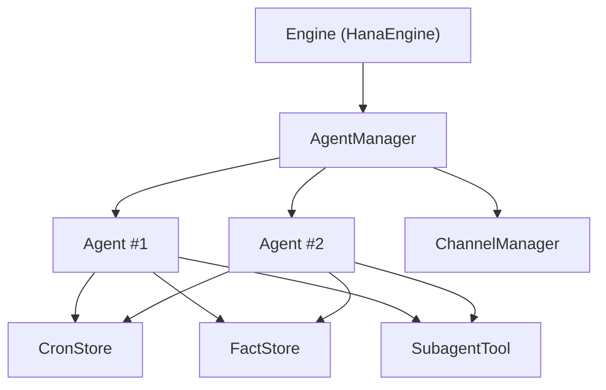
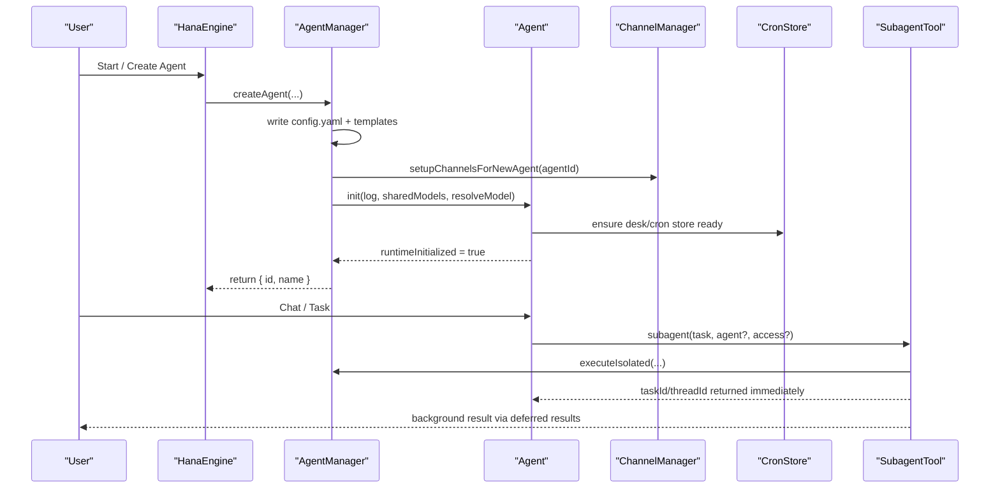
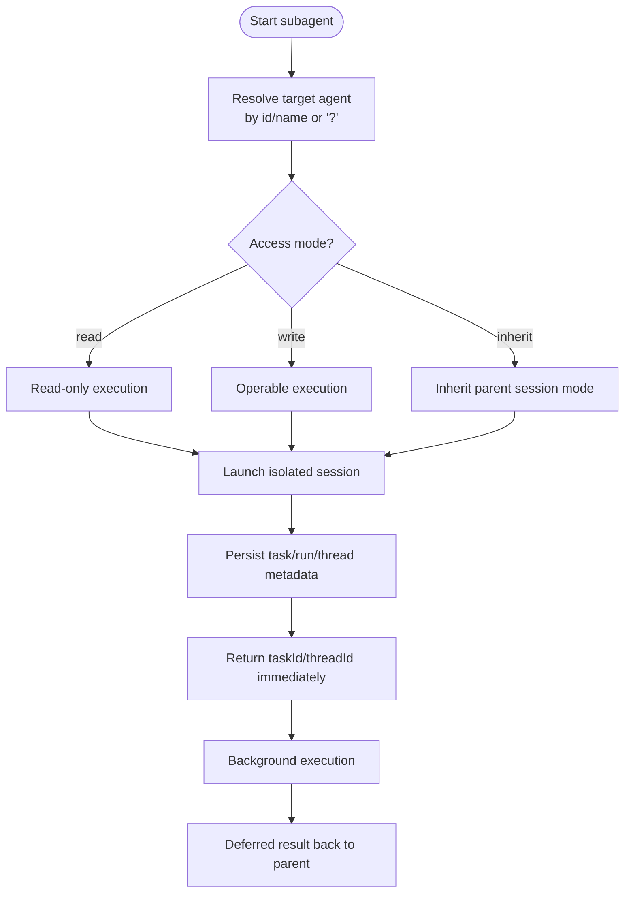
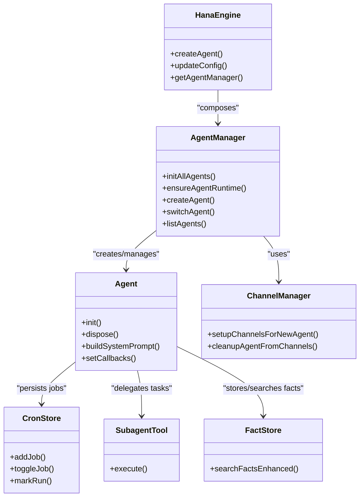

# Agent System

<cite>
**Referenced Files in This Document**
- [agent-manager.ts](file://core/agent-manager.ts)
- [agent.ts](file://core/agent.ts)
- [config.example.yaml](file://config.example.yaml)
- [channel-manager.ts](file://core/channel-manager.ts)
- [subagent-tool.ts](file://lib/tools/subagent-tool.ts)
- [cron-store.ts](file://lib/desk/cron-store.ts)
- [engine.ts](file://core/engine.ts)
- [fact-store.ts](file://core/memory/fact-store.ts)
</cite>

## Table of Contents
1. [Introduction](#introduction)
2. [Project Structure](#project-structure)
3. [Core Components](#core-components)
4. [Architecture Overview](#architecture-overview)
5. [Detailed Component Analysis](#detailed-component-analysis)
6. [Dependency Analysis](#dependency-analysis)
7. [Performance Considerations](#performance-considerations)
8. [Troubleshooting Guide](#troubleshooting-guide)
9. [Conclusion](#conclusion)
10. [Appendices](#appendices)

## Introduction
This document explains the multi-agent orchestration and lifecycle management system. It covers how agents are configured with personalities, memories, and capabilities via YAML configuration files; how agents are created, initialized, and isolated; how multiple agents collaborate through channels and subagent delegation; and how agent state is managed, persisted, and recovered. It also provides guidance on personality customization and capability extension through plugins.

## Project Structure
The agent system centers around a manager that orchestrates multiple agent instances, each with its own workspace, memory, tools, and scheduled tasks. Key directories:
- core: Core runtime (AgentManager, Agent, Engine, ChannelManager, memory subsystems)
- lib/tools: Tool implementations including subagent delegation
- lib/desk: Desk subsystem for cron scheduling and automation
- config.example.yaml: Per-agent YAML template used during creation

**Diagram sources**
- [engine.ts](file://core/engine.ts)
- [agent-manager.ts](file://core/agent-manager.ts)
- [agent.ts](file://core/agent.ts)
- [channel-manager.ts](file://core/channel-manager.ts)
- [cron-store.ts](file://lib/desk/cron-store.ts)
- [fact-store.ts](file://core/memory/fact-store.ts)
- [subagent-tool.ts](file://lib/tools/subagent-tool.ts)

**Section sources**
- [engine.ts](file://core/engine.ts)
- [agent-manager.ts](file://core/agent-manager.ts)
- [agent.ts](file://core/agent.ts)
- [channel-manager.ts](file://core/channel-manager.ts)
- [cron-store.ts](file://lib/desk/cron-store.ts)
- [fact-store.ts](file://core/memory/fact-store.ts)
- [subagent-tool.ts](file://lib/tools/subagent-tool.ts)

## Core Components
- AgentManager: Scans, creates, initializes, switches, and manages multiple agents. Handles concurrency queues for runtime initialization and memory maintenance.
- Agent: Represents a single assistant instance with identity, personality, memory, tools, desk/cron, and system prompt assembly.
- ChannelManager: Manages channels and member membership across agents; sets up channel bookmarks for new agents.
- CronStore: Persists and normalizes cron jobs (at/every/cron), tracks runs, and computes next run times.
- SubagentTool: Enables non-blocking delegation to other agents or the current agent, with access control and persistence.
- FactStore: Enhanced memory search with FTS and CJK ngrams; supports compiled snapshots.

**Section sources**
- [agent-manager.ts](file://core/agent-manager.ts)
- [agent.ts](file://core/agent.ts)
- [channel-manager.ts](file://core/channel-manager.ts)
- [cron-store.ts](file://lib/desk/cron-store.ts)
- [subagent-tool.ts](file://lib/tools/subagent-tool.ts)
- [fact-store.ts](file://core/memory/fact-store.ts)

## Architecture Overview
High-level flow: Engine composes managers; AgentManager owns Agent instances; Agents use tools (including subagent), memory, and desk/cron; ChannelManager coordinates cross-agent collaboration.

**Diagram sources**
- [engine.ts](file://core/engine.ts)
- [agent-manager.ts](file://core/agent-manager.ts)
- [agent.ts](file://core/agent.ts)
- [channel-manager.ts](file://core/channel-manager.ts)
- [cron-store.ts](file://lib/desk/cron-store.ts)
- [subagent-tool.ts](file://lib/tools/subagent-tool.ts)

## Detailed Component Analysis

### Agent Configuration and Personality
Agents are configured per directory under the agents folder using a YAML file. The example template includes agent metadata, memory toggles, desk heartbeat settings, user info, and preferences. During creation, the manager copies this template into the new agent’s directory and fills in fields such as name, yuan, memory enabled, and default model references.

Personality and identity are provided by templates (yuan-specific and locale-aware). The system selects identity and ishiki templates based on the agent’s yuan and locale, ensuring consistent persona across agents.

Key behaviors:
- Template-based identity and public-ishiki content selection
- Description auto-generation triggered when source/yuan changes
- Memory master switch controlled by config

Practical example outline:
- Create an agent named “researcher” with yuan set to a specific character card
- Enable memory and configure heartbeat interval
- Set user.name for personalized prompts

**Section sources**
- [config.example.yaml](file://config.example.yaml)
- [agent-manager.ts](file://core/agent-manager.ts)
- [agent.ts](file://core/agent.ts)

### Agent Creation, Initialization, and Resource Isolation
Creation workflow:
- Validate inputs and generate unique agent ID if not provided
- Create directory structure (memory, sessions, avatars)
- Write config.yaml from template with defaults and inherited model reference
- Copy identity/ishiki/public-ishiki templates based on yuan/locale
- Touch pinned.md and optional initial memory snapshot
- Initialize channels for the new agent
- Instantiate Agent, call init(), sync skills, start cron and heartbeat
- Inject DM callback and refresh description cache

Initialization highlights:
- Compatibility checks and config load
- FactStore and summary manager setup
- v1→v2 memory migration (if needed)
- Utility and memory model resolution with fallbacks
- Memory ticker startup and system prompt compilation
- Tool construction (web, browser, terminal, notify, etc.)
- Desk/cron store wiring and automation tool setup
- Subagent and workflow tools registration

Resource isolation patterns:
- Each agent has its own directory tree (memory, sessions, desk)
- Tools operate within session-scoped contexts and sandbox policies
- Channels and DMs scoped per agent; roster is centralized via AgentManager

**Section sources**
- [agent-manager.ts](file://core/agent-manager.ts)
- [agent.ts](file://core/agent.ts)

### Multi-Agent Collaboration: Channels and Subagent Delegation
Channels:
- ChannelManager maintains channel entries and member lists
- New agents get their channel bookmarks projected automatically
- Deleting agents cleans members and removes orphaned channels

Subagent delegation:
- SubagentTool launches non-blocking tasks against a target agent (or current)
- Supports discovery mode (“?”) to list available agents
- Access control: read vs write modes, inheriting parent session permission if omitted
- Concurrency limits per session and global
- Results delivered asynchronously via deferred results and activity hub
- Thread resume via threadId with subagent_reply

**Diagram sources**
- [subagent-tool.ts](file://lib/tools/subagent-tool.ts)
- [channel-manager.ts](file://core/channel-manager.ts)

**Section sources**
- [channel-manager.ts](file://core/channel-manager.ts)
- [subagent-tool.ts](file://lib/tools/subagent-tool.ts)

### Scheduling and Cron Jobs
Each agent can schedule recurring tasks via CronStore:
- Job types: at (one-shot), every (interval ms), cron (standard expression)
- Validation and normalization (model refs, min intervals, future time checks)
- Atomic writes with .tmp recovery and run history rotation
- Backoff on consecutive errors and automatic disable after one-shot “at” runs

Practical example outline:
- Define a daily cron job to summarize recent facts
- Use every type for periodic health checks
- Store runs in cron-runs/<jobId>.jsonl for auditing

**Section sources**
- [cron-store.ts](file://lib/desk/cron-store.ts)

### Memory Management and Persistence
Memory components:
- FactStore persists facts with enhanced search (FTS + CJK ngrams)
- Session summaries stored separately
- Compiled memory snapshots reduce context size and improve retrieval
- Memory ticker compiles and updates system prompt when memory changes

Persistence and recovery:
- Facts DB path per agent
- Summary directory per agent
- Migration markers prevent repeated migrations
- On init, memory ticker starts and schedules maintenance

**Section sources**
- [agent.ts](file://core/agent.ts)
- [fact-store.ts](file://core/memory/fact-store.ts)

### State Management, Switching, and Recovery
State management:
- AgentManager caches agent list and rebuilds system prompts when roster changes
- Runtime initialization queue ensures concurrent but bounded initialization
- Memory maintenance queue prevents contention during startup

Switching:
- switchAgentOnly changes focus without recreating sessions
- switchAgent performs full switch including skill sync and session restoration
- Heartbeat and cron continue running independently of active pointer

Recovery:
- Deleted agent tombstones allow listing deleted agents
- Channel cursor repair ensures bookmark consistency
- Config repair state surfaced to UI for guided fixes

**Section sources**
- [agent-manager.ts](file://core/agent-manager.ts)

### Plugin-Based Capability Extension
Agents can extend capabilities via plugins and skills:
- Skills are synced into agents upon creation or update
- Install skill tool integrates with engine utilities and preferences
- Plugins provide additional routes, tools, and surfaces
- MCP connectors can be updated per agent via engine bus requests

Guidance:
- Add custom tools through plugin manifests
- Expose routes for external integrations
- Respect agent permissions and sandbox policies

**Section sources**
- [agent-manager.ts](file://core/agent-manager.ts)
- [agent.ts](file://core/agent.ts)

## Dependency Analysis

**Diagram sources**
- [engine.ts](file://core/engine.ts)
- [agent-manager.ts](file://core/agent-manager.ts)
- [agent.ts](file://core/agent.ts)
- [channel-manager.ts](file://core/channel-manager.ts)
- [cron-store.ts](file://lib/desk/cron-store.ts)
- [subagent-tool.ts](file://lib/tools/subagent-tool.ts)
- [fact-store.ts](file://core/memory/fact-store.ts)

**Section sources**
- [engine.ts](file://core/engine.ts)
- [agent-manager.ts](file://core/agent-manager.ts)
- [agent.ts](file://core/agent.ts)
- [channel-manager.ts](file://core/channel-manager.ts)
- [cron-store.ts](file://lib/desk/cron-store.ts)
- [subagent-tool.ts](file://lib/tools/subagent-tool.ts)
- [fact-store.ts](file://core/memory/fact-store.ts)

## Performance Considerations
- Bounded concurrency for runtime initialization and memory maintenance avoids CPU contention during startup.
- Asynchronous description regeneration uses hash comparison to avoid unnecessary LLM calls.
- CronStore uses atomic writes and run history rotation to minimize I/O overhead.
- SubagentTool enforces per-session and global concurrency caps to prevent resource exhaustion.
- Memory ticker defers first maintenance to a background queue to keep foreground initialization fast.

[No sources needed since this section provides general guidance]

## Troubleshooting Guide
Common issues and resolutions:
- Agent initialization fails: check config.yaml validity and model references; ensure utility/utility_large models resolve correctly.
- Memory system unavailable: verify utility_large or chat fallback model credentials; ticker will retry on next tick.
- Subagent denied write access: parent session must be in operable mode or explicitly pass access:"read".
- Cron job not executing: validate schedule format and ensure job is enabled; inspect run history for backoff due to errors.
- Channel member cleanup: deleting an agent removes it from channels; orphaned channels with ≤1 member are removed.

**Section sources**
- [agent-manager.ts](file://core/agent-manager.ts)
- [agent.ts](file://core/agent.ts)
- [subagent-tool.ts](file://lib/tools/subagent-tool.ts)
- [cron-store.ts](file://lib/desk/cron-store.ts)
- [channel-manager.ts](file://core/channel-manager.ts)

## Conclusion
The agent system provides robust multi-agent orchestration with clear separation of concerns: AgentManager handles lifecycle, Agent encapsulates identity and capabilities, ChannelManager enables collaboration, CronStore powers scheduling, and SubagentTool facilitates asynchronous delegation. YAML-driven configuration and template-based personalities simplify customization, while memory and persistence mechanisms ensure reliable operation and recovery.

[No sources needed since this section summarizes without analyzing specific files]

## Appendices

### Practical Examples

- Setting up multiple agents with independent workspaces:
  - Create separate agent directories; each gets its own config.yaml, memory, sessions, and desk folders.
  - Assign different yuan and user.name to tailor personas.
  - Configure distinct models via models.chat references.

- Independent cron schedules:
  - Use CronStore to add at/every/cron jobs per agent.
  - Monitor runs in cron-runs/<jobId>.jsonl and adjust backoff behavior.

- Collaboration via channels:
  - Create channels and add multiple agents as members.
  - Use channel tools to post messages; DM tool to send private messages between agents.

- Subagent delegation:
  - Call subagent with agent="?" to discover peers.
  - Choose access mode appropriately; inherit parent session permission if unsure.
  - Resume threads using threadId with subagent_reply.

- Personality customization:
  - Adjust identity.md and ishiki.md per agent; change yuan to switch templates.
  - Update description.md generation triggers by modifying source or yuan.

- Capability extension via plugins:
  - Install skills and enable them per agent.
  - Develop plugins exposing tools and routes; integrate with engine bus for config updates.

**Section sources**
- [config.example.yaml](file://config.example.yaml)
- [agent-manager.ts](file://core/agent-manager.ts)
- [agent.ts](file://core/agent.ts)
- [channel-manager.ts](file://core/channel-manager.ts)
- [cron-store.ts](file://lib/desk/cron-store.ts)
- [subagent-tool.ts](file://lib/tools/subagent-tool.ts)