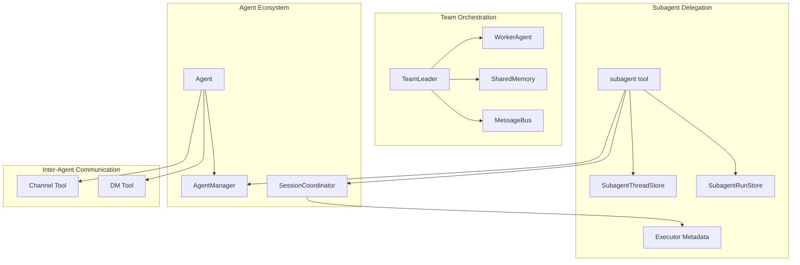
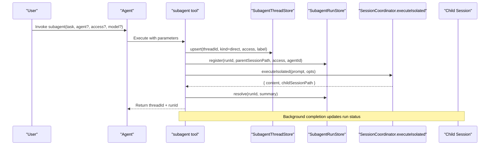
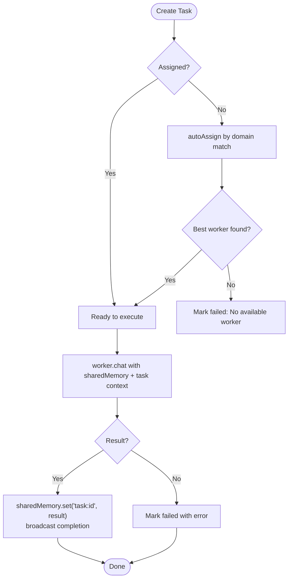
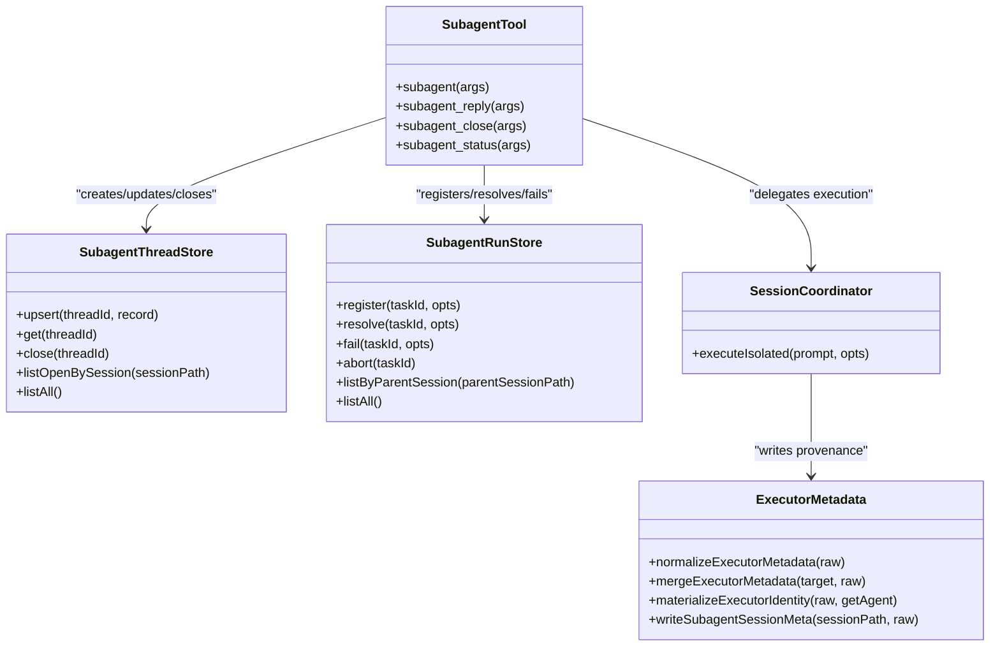
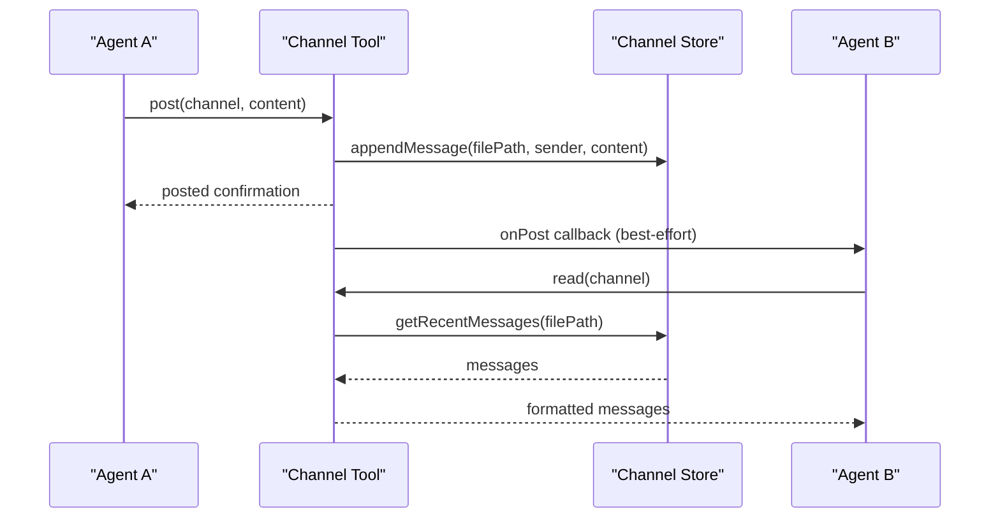
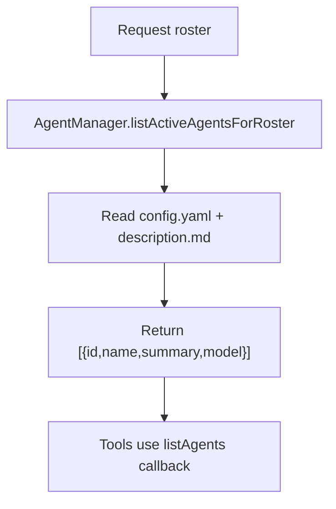
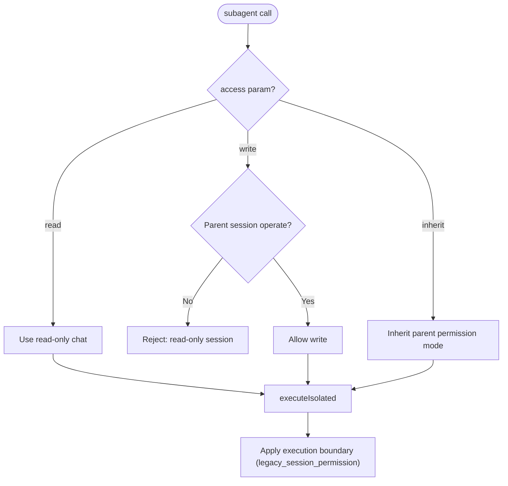
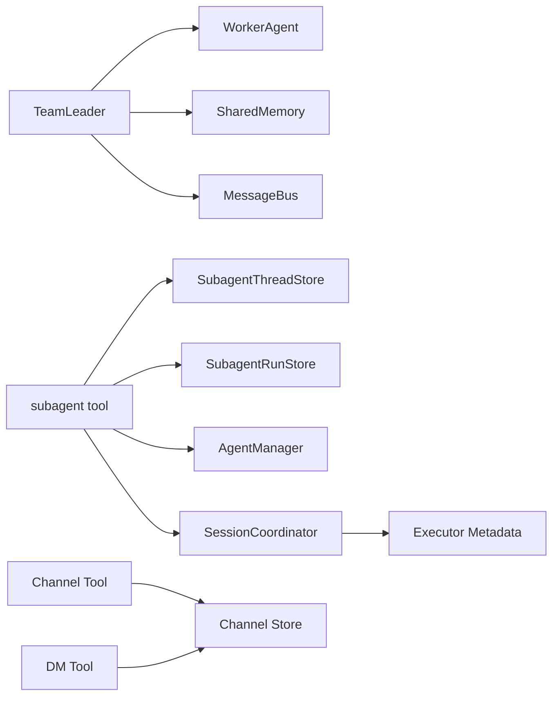

# Team Coordination

<cite>
**Referenced Files in This Document**
- [team.ts](file://core/team.ts)
- [subagent-tool.ts](file://core/subagent-tool.ts)
- [subagent-thread-store.ts](file://core/subagent-thread-store.ts)
- [subagent-run-store.ts](file://core/subagent-run-store.ts)
- [agent-manager.ts](file://core/agent-manager.ts)
- [agent.ts](file://core/agent.ts)
- [channel-tool.ts](file://core/tools/channel-tool.ts)
- [dm-tool.ts](file://core/tools/dm-tool.ts)
- [session-coordinator.ts](file://core/session-coordinator.ts)
- [execution-boundary.ts](file://core/execution-boundary.ts)
- [subagent-executor-metadata.ts](file://lib/subagent-executor-metadata.ts)
</cite>

## Table of Contents
1. [Introduction](#introduction)
2. [Project Structure](#project-structure)
3. [Core Components](#core-components)
4. [Architecture Overview](#architecture-overview)
5. [Detailed Component Analysis](#detailed-component-analysis)
6. [Dependency Analysis](#dependency-analysis)
7. [Performance Considerations](#performance-considerations)
8. [Troubleshooting Guide](#troubleshooting-guide)
9. [Conclusion](#conclusion)
10. [Appendices](#appendices)

## Introduction
This document explains how multi-agent teams coordinate and delegate tasks using channels, shared context, and the subagent tool. It covers team roster management, agent discovery patterns, inter-agent communication protocols, permission boundaries, resource sharing limitations, conflict resolution, and the subagent execution model including result aggregation and error propagation across agent boundaries. Practical examples are provided for setting up specialized roles and distributing tasks effectively.

## Project Structure
The relevant subsystems for team coordination and delegation are implemented under core and lib:
- Team orchestration primitives (leader, workers, shared memory, message bus)
- Subagent tooling with thread/run stores for lifecycle and status tracking
- Agent manager for roster discovery and runtime initialization
- Channel and DM tools for broadcast and direct messaging between agents
- Session coordinator for isolated execution and model selection
- Execution boundary and metadata utilities for sandboxing and provenance

**Diagram sources**
- [team.ts:180-390](file://core/team.ts#L180-L390)
- [subagent-tool.ts:1-181](file://core/subagent-tool.ts#L1-L181)
- [subagent-thread-store.ts:1-156](file://core/subagent-thread-store.ts#L1-L156)
- [subagent-run-store.ts:1-192](file://core/subagent-run-store.ts#L1-L192)
- [agent-manager.ts:367-450](file://core/agent-manager.ts#L367-L450)
- [agent.ts:576-610](file://core/agent.ts#L576-L610)
- [channel-tool.ts:176-370](file://core/tools/channel-tool.ts#L176-L370)
- [dm-tool.ts:39-103](file://core/tools/dm-tool.ts#L39-L103)
- [session-coordinator.ts:3904-3983](file://core/session-coordinator.ts#L3904-L3983)
- [subagent-executor-metadata.ts:1-107](file://lib/subagent-executor-metadata.ts#L1-L107)

**Section sources**
- [team.ts:1-390](file://core/team.ts#L1-L390)
- [subagent-tool.ts:1-181](file://core/subagent-tool.ts#L1-L181)
- [subagent-thread-store.ts:1-156](file://core/subagent-thread-store.ts#L1-L156)
- [subagent-run-store.ts:1-192](file://core/subagent-run-store.ts#L1-L192)
- [agent-manager.ts:367-450](file://core/agent-manager.ts#L367-L450)
- [agent.ts:576-610](file://core/agent.ts#L576-L610)
- [channel-tool.ts:176-370](file://core/tools/channel-tool.ts#L176-L370)
- [dm-tool.ts:39-103](file://core/tools/dm-tool.ts#L39-L103)
- [session-coordinator.ts:3904-3983](file://core/session-coordinator.ts#L3904-L3983)
- [subagent-executor-metadata.ts:1-107](file://lib/subagent-executor-metadata.ts#L1-L107)

## Core Components
- TeamLeader: orchestrates task creation, assignment, auto-assignment by domain matching, parallel execution, and broadcasts results via a message bus; maintains shared memory for cross-agent context.
- WorkerAgent: wraps an Agent instance to execute tasks with role instructions, shared memory snapshot, and current task context.
- SharedMemory: key-value store with snapshot export for injecting into worker prompts.
- MessageBus: bounded history of messages with per-recipient retrieval and broadcast support.
- SubagentTool: creates controllable subagent threads, enforces access modes, lists agents, delegates work via executeIsolated, and tracks runs and threads.
- SubagentThreadStore/SubagentRunStore: persistent in-memory stores with optional file persistence for thread lifecycle and run outcomes.
- AgentManager: canonical source of active agents for rosters and discovery; provides listActiveAgentsForRoster used by tools.
- Channel Tool and DM Tool: enable group broadcasting and one-to-one asynchronous messaging between agents.
- SessionCoordinator.executeIsolated: executes delegated tasks in isolated sessions with model resolution and safety checks.
- Executor Metadata: records executor identity and version for provenance across subagent boundaries.

**Section sources**
- [team.ts:54-116](file://core/team.ts#L54-L116)
- [team.ts:120-178](file://core/team.ts#L120-L178)
- [team.ts:180-390](file://core/team.ts#L180-L390)
- [subagent-tool.ts:1-181](file://core/subagent-tool.ts#L1-L181)
- [subagent-thread-store.ts:1-156](file://core/subagent-thread-store.ts#L1-L156)
- [subagent-run-store.ts:1-192](file://core/subagent-run-store.ts#L1-L192)
- [agent-manager.ts:422-450](file://core/agent-manager.ts#L422-L450)
- [channel-tool.ts:176-370](file://core/tools/channel-tool.ts#L176-L370)
- [dm-tool.ts:39-103](file://core/tools/dm-tool.ts#L39-L103)
- [session-coordinator.ts:3904-3983](file://core/session-coordinator.ts#L3904-L3983)
- [subagent-executor-metadata.ts:1-107](file://lib/subagent-executor-metadata.ts#L1-L107)

## Architecture Overview
The system supports two complementary collaboration models:
- In-process team orchestration via TeamLeader/WorkerAgent with SharedMemory and MessageBus for synchronous or near-synchronous coordination within a single agent runtime.
- Cross-session delegation via the subagent tool that spawns isolated child sessions through SessionCoordinator.executeIsolated, with explicit agent targeting, access control, and persistent thread/run tracking.

**Diagram sources**
- [subagent-tool.ts:38-125](file://core/subagent-tool.ts#L38-L125)
- [subagent-thread-store.ts:56-78](file://core/subagent-thread-store.ts#L56-L78)
- [subagent-run-store.ts:44-74](file://core/subagent-run-store.ts#L44-L74)
- [session-coordinator.ts:3904-3983](file://core/session-coordinator.ts#L3904-L3983)

## Detailed Component Analysis

### Team Orchestration (TeamLeader, WorkerAgent, SharedMemory, MessageBus)
- Task lifecycle: createTask → assignTask/autoAssign → executeTask → done/failed with result stored in SharedMemory and broadcast via MessageBus.
- Auto-assignment uses keyword overlap between task description and worker domain.
- Parallel execution is supported via Promise.all on task IDs.
- SharedMemory snapshots are injected into worker prompts to provide cross-task context.

**Diagram sources**
- [team.ts:208-316](file://core/team.ts#L208-L316)

**Section sources**
- [team.ts:180-390](file://core/team.ts#L180-L390)

### Subagent Delegation Model
- Discovery: agent="?" lists available agents via AgentManager.listAgents.
- Access control: access="read" forces read-only chat path; access="write" requires operate mode; otherwise inherits from parent session permission mode.
- Limits: per-session and global caps prevent runaway subagents.
- Lifecycle: subagent_start returns threadId/runId immediately; background execution resolves/fails runs; subagent_reply posts follow-ups; subagent_close marks threads closed; subagent_status queries state.
- Provenance: executor metadata written to child sessions for lineage.

**Diagram sources**
- [subagent-tool.ts:1-181](file://core/subagent-tool.ts#L1-L181)
- [subagent-thread-store.ts:1-156](file://core/subagent-thread-store.ts#L1-L156)
- [subagent-run-store.ts:1-192](file://core/subagent-run-store.ts#L1-L192)
- [session-coordinator.ts:3904-3983](file://core/session-coordinator.ts#L3904-L3983)
- [subagent-executor-metadata.ts:1-107](file://lib/subagent-executor-metadata.ts#L1-L107)

**Section sources**
- [subagent-tool.ts:1-181](file://core/subagent-tool.ts#L1-L181)
- [subagent-thread-store.ts:1-156](file://core/subagent-thread-store.ts#L1-L156)
- [subagent-run-store.ts:1-192](file://core/subagent-run-store.ts#L1-L192)
- [subagent-executor-metadata.ts:1-107](file://lib/subagent-executor-metadata.ts#L1-L107)
- [session-coordinator.ts:3904-3983](file://core/session-coordinator.ts#L3904-L3983)

### Inter-Agent Communication Protocols
- Channels: group discussions with read/post/create/list actions; membership enforced; posting triggers delivery callbacks so other agents can react asynchronously.
- Direct Messages: one-to-one async messaging persisted in both agents’ dm directories; DM Router notified to prompt recipient agents.

**Diagram sources**
- [channel-tool.ts:251-286](file://core/tools/channel-tool.ts#L251-L286)
- [channel-tool.ts:223-249](file://core/tools/channel-tool.ts#L223-L249)

**Section sources**
- [channel-tool.ts:176-370](file://core/tools/channel-tool.ts#L176-L370)
- [dm-tool.ts:39-103](file://core/tools/dm-tool.ts#L39-L103)

### Team Roster Management and Agent Discovery
- Canonical roster: AgentManager.listActiveAgentsForRoster reads agent configs and descriptions without scanning agentsDir inside Agents themselves.
- Tools receive listAgents callback to discover peers safely.
- DM tool resolves target by id or unique name fallback; ambiguous cases return candidates.

**Diagram sources**
- [agent-manager.ts:422-450](file://core/agent-manager.ts#L422-L450)
- [dm-tool.ts:57-74](file://core/tools/dm-tool.ts#L57-L74)

**Section sources**
- [agent-manager.ts:422-450](file://core/agent-manager.ts#L422-L450)
- [dm-tool.ts:39-103](file://core/tools/dm-tool.ts#L39-L103)

### Permission Boundaries and Resource Sharing Limitations
- Subagent access modes:
  - read-only: uses createReadOnlyChat when available; prevents edits.
  - write: requires operate mode; rejected if parent session is read_only.
  - inherit: defaults to parent session permission mode via getSessionPermissionMode.
- Execution boundary: legacy_session_permission sandbox policy applied to local processes.
- Resource scope: subagent inherits parent session cwd; workspace scoping applies at session level.

**Diagram sources**
- [subagent-tool.ts:57-63](file://core/subagent-tool.ts#L57-L63)
- [subagent-tool.ts:104-109](file://core/subagent-tool.ts#L104-L109)
- [execution-boundary.ts:16-50](file://core/execution-boundary.ts#L16-L50)
- [agent.ts:591-598](file://core/agent.ts#L591-L598)

**Section sources**
- [subagent-tool.ts:1-181](file://core/subagent-tool.ts#L1-L181)
- [execution-boundary.ts:1-69](file://core/execution-boundary.ts#L1-L69)
- [agent.ts:576-610](file://core/agent.ts#L576-L610)

### Conflict Resolution Patterns
- Channel membership validation prevents unauthorized writes; errors guide users to join or choose correct channel.
- DM routing ensures messages are persisted on both sides and delivered asynchronously; recipients can act independently.
- Subagent concurrency limits protect against resource exhaustion; failures propagate back to run store with error details.

**Section sources**
- [channel-tool.ts:251-286](file://core/tools/channel-tool.ts#L251-L286)
- [dm-tool.ts:81-94](file://core/tools/dm-tool.ts#L81-L94)
- [subagent-tool.ts:49-55](file://core/subagent-tool.ts#L49-L55)
- [subagent-run-store.ts:97-110](file://core/subagent-run-store.ts#L97-L110)

### Practical Examples
- Specialized roles:
  - Register workers with distinct domains (e.g., coding, writing, research). Use TeamLeader.planTasks to decompose goals into tasks and auto-assign based on domain keywords.
  - Share context by writing to SharedMemory before executing dependent tasks; workers read snapshot during chat.
- Task distribution strategies:
  - Manual assignment via assignTask for precise control.
  - Automatic assignment via autoAssign for simple keyword-based routing.
  - Parallel execution via executeTasks for independent subtasks.
- Subagent delegation:
  - Use subagent with agent="?" to discover targets; specify access="read" for research/review; omit access to inherit parent permissions.
  - Track progress via subagent_status; reply with subagent_reply; close with subagent_close.
  - Inspect executor provenance via session meta files for lineage.

[No sources needed since this section provides general guidance]

## Dependency Analysis
Key dependencies and relationships:
- TeamLeader depends on Agent instances and manages WorkerAgent, SharedMemory, MessageBus.
- SubagentTool depends on SubagentThreadStore, SubagentRunStore, AgentManager (for discovery), and SessionCoordinator.executeIsolated.
- Channel/DM tools depend on channel store and agent roster provider.
- Executor metadata ties child sessions back to their executor agent identity.

**Diagram sources**
- [team.ts:180-390](file://core/team.ts#L180-L390)
- [subagent-tool.ts:1-181](file://core/subagent-tool.ts#L1-L181)
- [channel-tool.ts:176-370](file://core/tools/channel-tool.ts#L176-L370)
- [dm-tool.ts:39-103](file://core/tools/dm-tool.ts#L39-L103)
- [subagent-executor-metadata.ts:1-107](file://lib/subagent-executor-metadata.ts#L1-L107)

**Section sources**
- [team.ts:180-390](file://core/team.ts#L180-L390)
- [subagent-tool.ts:1-181](file://core/subagent-tool.ts#L1-L181)
- [channel-tool.ts:176-370](file://core/tools/channel-tool.ts#L176-L370)
- [dm-tool.ts:39-103](file://core/tools/dm-tool.ts#L39-L103)
- [subagent-executor-metadata.ts:1-107](file://lib/subagent-executor-metadata.ts#L1-L107)

## Performance Considerations
- TeamLeader auto-assignment uses simple keyword scoring; consider more sophisticated matching for large teams.
- MessageBus retains bounded history; ensure consumers process promptly to avoid backlog.
- Subagent concurrency limits prevent saturation; tune maxPerSession and maxGlobal according to workload.
- SharedMemory snapshot truncation avoids oversized prompts; keep keys concise and values small.

[No sources needed since this section provides general guidance]

## Troubleshooting Guide
- Subagent not found:
  - Use agent="?" to list agents; verify agent id/name matches roster entries.
- Access denied:
  - Ensure parent session is in operate mode for access="write"; otherwise use access="read".
- Thread not found:
  - Verify threadId returned by subagent_start; check subagent_status for open threads.
- Channel operations fail:
  - Confirm membership; resolve exact channel id if names are ambiguous.
- DM not received:
  - Check DM Router callback invocation; ensure recipient agent is active and has phone enabled.

**Section sources**
- [subagent-tool.ts:40-47](file://core/subagent-tool.ts#L40-L47)
- [subagent-tool.ts:57-63](file://core/subagent-tool.ts#L57-L63)
- [subagent-tool.ts:134-146](file://core/subagent-tool.ts#L134-L146)
- [channel-tool.ts:142-165](file://core/tools/channel-tool.ts#L142-L165)
- [dm-tool.ts:91-94](file://core/tools/dm-tool.ts#L91-L94)

## Conclusion
Multi-agent coordination in this system combines in-process team orchestration with robust cross-session delegation. Teams share context via SharedMemory and communicate through channels and DMs. The subagent tool provides safe, auditable delegation with explicit access controls, provenance tracking, and persistent lifecycle management. Proper roster usage, permission awareness, and conflict handling ensure reliable collaboration across specialized agents.

[No sources needed since this section summarizes without analyzing specific files]

## Appendices

### API Reference Summary
- TeamLeader.createTask(description, priority)
- TeamLeader.assignTask(taskId, workerName)
- TeamLeader.autoAssign(taskId)
- TeamLeader.executeTask(taskId)
- TeamLeader.executeTasks(taskIds[])
- TeamLeader.planTasks(userGoal)
- SubagentTool.subagent({ task, agent?, access?, model?, label? })
- SubagentTool.subagent_reply({ threadId, task })
- SubagentTool.subagent_close({ threadId })
- SubagentTool.subagent_status({ threadId? })
- ChannelTool.channel({ action, channel?, content?, name?, members?, intro?, count? })
- DMTool.dm({ to, message })

[No sources needed since this section provides general guidance]