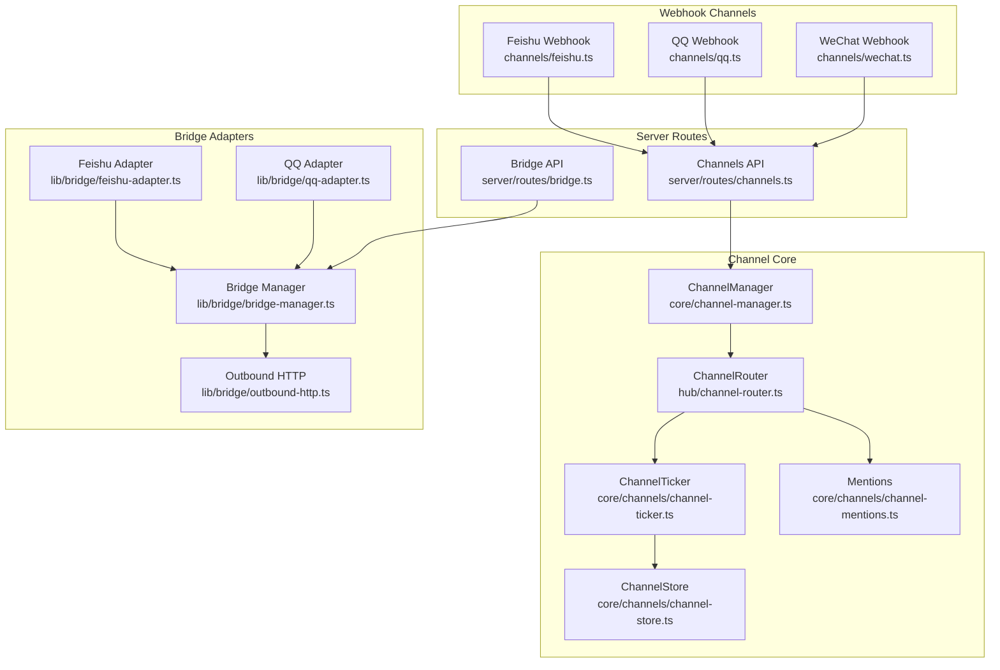
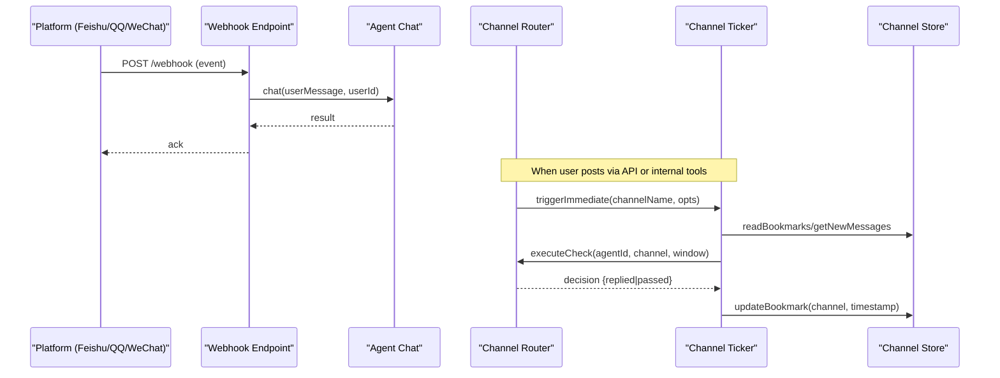
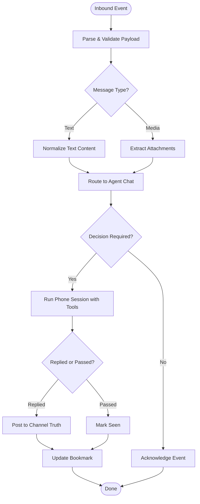
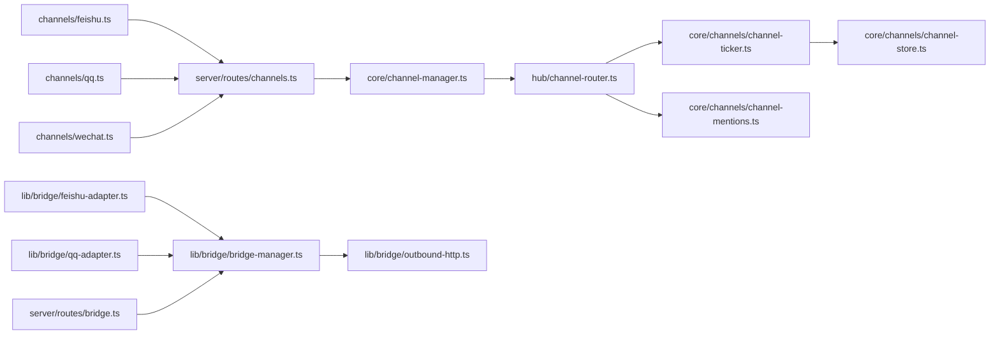

# Channel Integration

<cite>
**Referenced Files in This Document**
- [feishu.ts](file://channels/feishu.ts)
- [qq.ts](file://channels/qq.ts)
- [wechat.ts](file://channels/wechat.ts)
- [channel-manager.ts](file://core/channel-manager.ts)
- [channel-router.ts](file://hub/channel-router.ts)
- [channel-store.ts](file://core/channels/channel-store.ts)
- [channel-ticker.ts](file://core/channels/channel-ticker.ts)
- [channel-mentions.ts](file://core/channels/channel-mentions.ts)
- [channels.ts](file://server/routes/channels.ts)
- [feishu-adapter.ts](file://lib/bridge/feishu-adapter.ts)
- [qq-adapter.ts](file://lib/bridge/qq-adapter.ts)
- [outbound-http.ts](file://lib/bridge/outbound-http.ts)
- [bridge-manager.ts](file://lib/bridge/bridge-manager.ts)
- [bridge.ts](file://server/routes/bridge.ts)
</cite>

## Table of Contents
1. [Introduction](#introduction)
2. [Project Structure](#project-structure)
3. [Core Components](#core-components)
4. [Architecture Overview](#architecture-overview)
5. [Detailed Component Analysis](#detailed-component-analysis)
6. [Dependency Analysis](#dependency-analysis)
7. [Performance Considerations](#performance-considerations)
8. [Troubleshooting Guide](#troubleshooting-guide)
9. [Conclusion](#conclusion)
10. [Appendices](#appendices)

## Introduction
This document explains how OpenShadow integrates with external messaging platforms (Feishu, QQ, and WeChat) through a unified channel system. It covers configuration, message routing, authentication, inbound/outbound flows, formatting and attachments, platform-specific features, health monitoring, error recovery, scaling considerations, and guidance for building custom channel adapters.

## Project Structure
OpenShadow implements two complementary integration layers:
- Webhook channels: lightweight Hono-based endpoints that receive events from Feishu/QQ/WeChat webhooks and route them into the agent chat pipeline.
- Bridge adapters: full-featured integrations using official SDKs or APIs to manage long-lived connections, streaming replies, rich media, and advanced features.

**Diagram sources**
- [feishu.ts:1-77](file://channels/feishu.ts#L1-L77)
- [qq.ts:1-70](file://channels/qq.ts#L1-L70)
- [wechat.ts:1-80](file://channels/wechat.ts#L1-L80)
- [channel-manager.ts:1-280](file://core/channel-manager.ts#L1-L280)
- [channel-router.ts:1-800](file://hub/channel-router.ts#L1-L800)
- [channel-ticker.ts:1-723](file://core/channels/channel-ticker.ts#L1-L723)
- [channel-store.ts:1-532](file://core/channels/channel-store.ts#L1-L532)
- [channel-mentions.ts:1-103](file://core/channels/channel-mentions.ts#L1-L103)
- [channels.ts:1-673](file://server/routes/channels.ts#L1-L673)
- [feishu-adapter.ts:1-800](file://lib/bridge/feishu-adapter.ts#L1-L800)
- [qq-adapter.ts:170-548](file://lib/bridge/qq-adapter.ts#L170-L548)
- [outbound-http.ts:20-58](file://lib/bridge/outbound-http.ts#L20-L58)
- [bridge-manager.ts:815-845](file://lib/bridge/bridge-manager.ts#L815-L845)
- [bridge.ts:607-639](file://server/routes/bridge.ts#L607-L639)

**Section sources**
- [feishu.ts:1-77](file://channels/feishu.ts#L1-L77)
- [qq.ts:1-70](file://channels/qq.ts#L1-L70)
- [wechat.ts:1-80](file://channels/wechat.ts#L1-L80)
- [channel-manager.ts:1-280](file://core/channel-manager.ts#L1-L280)
- [channel-router.ts:1-800](file://hub/channel-router.ts#L1-L800)
- [channel-ticker.ts:1-723](file://core/channels/channel-ticker.ts#L1-L723)
- [channel-store.ts:1-532](file://core/channels/channel-store.ts#L1-L532)
- [channel-mentions.ts:1-103](file://core/channels/channel-mentions.ts#L1-L103)
- [channels.ts:1-673](file://server/routes/channels.ts#L1-L673)
- [feishu-adapter.ts:1-800](file://lib/bridge/feishu-adapter.ts#L1-L800)
- [qq-adapter.ts:170-548](file://lib/bridge/qq-adapter.ts#L170-L548)
- [outbound-http.ts:20-58](file://lib/bridge/outbound-http.ts#L20-L58)
- [bridge-manager.ts:815-845](file://lib/bridge/bridge-manager.ts#L815-L845)
- [bridge.ts:607-639](file://server/routes/bridge.ts#L607-L639)

## Core Components
- Webhook Channels: Provide simple /health and /webhook endpoints per platform, parse incoming events, and call the agent chat pipeline. Suitable for quick integrations or local testing.
- Channel Store: File-backed persistence for channels and bookmarks; supports atomic writes, file locks, frontmatter metadata, and message streams.
- Channel Ticker: Schedules periodic checks, immediate deliveries on new messages, proactive reminders, and bookmark updates with guard limits and interruption/resume.
- Channel Router: Orchestrates phone sessions for agents, formats context and identity guidance, manages tool modes, and emits events.
- Mentions Resolver: Extracts @mentions to prioritize delivery and guide behavior.
- Channels API: REST endpoints to create/list/update channels, manage members, send messages, update bookmarks, and toggle features.
- Bridge Adapters: Full-featured integrations for Feishu and QQ with WebSocket connections, streaming replies, rich media, and robust error handling.

**Section sources**
- [channel-store.ts:1-532](file://core/channels/channel-store.ts#L1-L532)
- [channel-ticker.ts:1-723](file://core/channels/channel-ticker.ts#L1-L723)
- [channel-router.ts:1-800](file://hub/channel-router.ts#L1-L800)
- [channel-mentions.ts:1-103](file://core/channels/channel-mentions.ts#L1-L103)
- [channels.ts:1-673](file://server/routes/channels.ts#L1-L673)
- [feishu-adapter.ts:1-800](file://lib/bridge/feishu-adapter.ts#L1-L800)
- [qq-adapter.ts:170-548](file://lib/bridge/qq-adapter.ts#L170-L548)

## Architecture Overview
The system supports two paths for platform connectivity:
- Webhook path: Platform → Hono endpoint → Agent chat → optional logging.
- Bridge path: Platform SDK/API → Adapter → Bridge Manager → Outbound HTTP → Platform.

**Diagram sources**
- [feishu.ts:16-61](file://channels/feishu.ts#L16-L61)
- [qq.ts:18-55](file://channels/qq.ts#L18-L55)
- [wechat.ts:20-65](file://channels/wechat.ts#L20-L65)
- [channels.ts:577-616](file://server/routes/channels.ts#L577-L616)
- [channel-ticker.ts:402-644](file://core/channels/channel-ticker.ts#L402-L644)
- [channel-store.ts:227-282](file://core/channels/channel-store.ts#L227-L282)
- [channel-router.ts:476-648](file://hub/channel-router.ts#L476-L648)

## Detailed Component Analysis

### Webhook Channels (Feishu, QQ, WeChat)
- Each channel defines a Hono app with /health and /webhook routes.
- Incoming payloads are validated and parsed; empty or non-message events are ignored.
- The agent.chat method is invoked with normalized user content and a stable userId derived from platform identifiers.
- Responses are logged; outbound reply implementation varies by platform (some placeholders exist).

Practical setup:
- Configure your platform’s webhook URL to point at your server’s /webhook endpoint.
- Ensure the server exposes HTTPS and handles TLS termination if needed.
- Use /health endpoints for readiness probes.

Incoming/outgoing flow example:
- Feishu: event schema im.message → extract text/chat_id/sender → agent.chat → log response.
- QQ: guilds.message → extract content/channel_id/author → agent.chat → log response.
- WeChat: msgtype=text → extract content/fromUserName → agent.chat → return WeChat response format.

**Section sources**
- [feishu.ts:16-61](file://channels/feishu.ts#L16-L61)
- [qq.ts:18-55](file://channels/qq.ts#L18-L55)
- [wechat.ts:20-65](file://channels/wechat.ts#L20-L65)

### Channel Store (File-backed Persistence)
- Channels are MD files with frontmatter metadata and a message stream body.
- Atomic writes and file locks prevent corruption under concurrency.
- Bookmarks track each agent’s last-read position per channel.
- Utilities support creating channels, appending messages, reading recent/new messages, and managing members.

Key operations:
- Create channel with members and optional intro.
- Append message with timestamped header.
- Read new messages since bookmark, skipping self-sent.
- Update bookmarks after decisions.

**Section sources**
- [channel-store.ts:1-532](file://core/channels/channel-store.ts#L1-L532)

### Channel Ticker (Delivery, Reminders, Guard Limits)
- Scans channels for unread messages per agent based on bookmarks.
- Builds delivery windows with limits and dropped counts.
- Executes checks via router callbacks; advances bookmarks when decisions are explicit or implicitly passed.
- Supports proactive reminders per channel interval and mentions-aware prioritization.
- Provides snapshot and schedule refresh capabilities.

Operational highlights:
- Immediate delivery merges and aborts ongoing work to always deliver latest context.
- Guard limits cap checks per delivery to avoid runaway loops.
- Interruption and checkpointing ensure resilience during high-frequency events.

**Section sources**
- [channel-ticker.ts:1-723](file://core/channels/channel-ticker.ts#L1-L723)

### Channel Router (Phone Sessions and Tools)
- Formats contextual prompts including identity, member lists, mention guidance, and delivery window notes.
- Runs agent phone sessions with specialized tools:
  - channel_read_context: read recent channel Truth.
  - channel_reply: post a reply to the channel.
  - channel_pass: mark as seen without posting.
- Emits events for new messages and activity tracking.

Configuration resolution:
- Reads per-channel settings like tool mode, reply length bounds, reminder intervals, model overrides, and guard limits.

**Section sources**
- [channel-router.ts:1-800](file://hub/channel-router.ts#L1-L800)

### Mentions Resolution
- Parses @mentions against channel members and agent display names.
- Enforces boundary rules to avoid false positives.
- Returns unique agent IDs for scheduling hints and behavior guidance.

**Section sources**
- [channel-mentions.ts:1-103](file://core/channels/channel-mentions.ts#L1-L103)

### Channels API (REST)
- Endpoints for listing channels, creating channels, adding/removing members, sending messages, updating bookmarks, deleting channels, and toggling features.
- Validates inputs, enforces minimum member constraints, and triggers immediate delivery with mention awareness.

Common usage:
- POST /channels to create a channel with members.
- POST /channels/:name/messages to post a message and trigger delivery.
- GET /channels to list with unread counts and bookmarks.

**Section sources**
- [channels.ts:1-673](file://server/routes/channels.ts#L1-L673)

### Bridge Adapters (Feishu, QQ)
- Feishu adapter:
  - Uses WebSocket client for real-time events.
  - Normalizes inbound messages (text, post, image, file, audio, media).
  - Supports block streaming, edit_message streaming, and CardKit streaming.
  - Downloads and uploads media with size validation and MIME detection.
  - Health checks and reconnection logic with status reporting.
- QQ adapter:
  - Manages access tokens and WebSocket heartbeats.
  - Handles C2C and guild events, extracts attachments, and maps DM guilds.
  - Robust error handling and diagnostics.

Authentication and credentials:
- Feishu: appId/appSecret configured via settings UI and persisted.
- QQ: appID/appSecret configured similarly; DM-to-guild mapping persisted per agent.
- WeChat iLink test endpoint available via bridge API.

Health and status:
- Periodic health checks and connection polling.
- Status transitions reported to manager and UI.

**Section sources**
- [feishu-adapter.ts:1-800](file://lib/bridge/feishu-adapter.ts#L1-L800)
- [qq-adapter.ts:170-548](file://lib/bridge/qq-adapter.ts#L170-L548)
- [outbound-http.ts:20-58](file://lib/bridge/outbound-http.ts#L20-L58)
- [bridge-manager.ts:815-845](file://lib/bridge/bridge-manager.ts#L815-L845)
- [bridge.ts:607-639](file://server/routes/bridge.ts#L607-L639)

### Conceptual Overview

[No sources needed since this diagram shows conceptual workflow, not actual code structure]

## Dependency Analysis

**Diagram sources**
- [feishu.ts:1-77](file://channels/feishu.ts#L1-L77)
- [qq.ts:1-70](file://channels/qq.ts#L1-L70)
- [wechat.ts:1-80](file://channels/wechat.ts#L1-L80)
- [channels.ts:1-673](file://server/routes/channels.ts#L1-L673)
- [channel-manager.ts:1-280](file://core/channel-manager.ts#L1-L280)
- [channel-router.ts:1-800](file://hub/channel-router.ts#L1-L800)
- [channel-ticker.ts:1-723](file://core/channels/channel-ticker.ts#L1-L723)
- [channel-store.ts:1-532](file://core/channels/channel-store.ts#L1-L532)
- [channel-mentions.ts:1-103](file://core/channels/channel-mentions.ts#L1-L103)
- [feishu-adapter.ts:1-800](file://lib/bridge/feishu-adapter.ts#L1-L800)
- [qq-adapter.ts:170-548](file://lib/bridge/qq-adapter.ts#L170-L548)
- [outbound-http.ts:20-58](file://lib/bridge/outbound-http.ts#L20-L58)
- [bridge-manager.ts:815-845](file://lib/bridge/bridge-manager.ts#L815-L845)
- [bridge.ts:607-639](file://server/routes/bridge.ts#L607-L639)

**Section sources**
- [channels.ts:1-673](file://server/routes/channels.ts#L1-L673)
- [channel-manager.ts:1-280](file://core/channel-manager.ts#L1-L280)
- [channel-router.ts:1-800](file://hub/channel-router.ts#L1-L800)
- [channel-ticker.ts:1-723](file://core/channels/channel-ticker.ts#L1-L723)
- [channel-store.ts:1-532](file://core/channels/channel-store.ts#L1-L532)
- [channel-mentions.ts:1-103](file://core/channels/channel-mentions.ts#L1-L103)
- [feishu-adapter.ts:1-800](file://lib/bridge/feishu-adapter.ts#L1-L800)
- [qq-adapter.ts:170-548](file://lib/bridge/qq-adapter.ts#L170-L548)
- [outbound-http.ts:20-58](file://lib/bridge/outbound-http.ts#L20-L58)
- [bridge-manager.ts:815-845](file://lib/bridge/bridge-manager.ts#L815-L845)
- [bridge.ts:607-639](file://server/routes/bridge.ts#L607-L639)

## Performance Considerations
- File locking and atomic writes ensure consistency but can serialize heavy write loads; batch operations where possible.
- Delivery windows limit message volume per check; tune guard limits and reminder intervals per channel needs.
- Streaming replies reduce latency and improve UX; prefer edit_message or CardKit streaming for long responses.
- Media upload/download should respect platform size limits and use streaming buffers to minimize memory pressure.
- Cache user info and frequently accessed metadata to reduce API calls.

[No sources needed since this section provides general guidance]

## Troubleshooting Guide
- Webhook health checks:
  - Verify /health endpoints respond with status ok for each channel.
- Message parsing issues:
  - Check payload schemas and skip non-message events gracefully.
- Missing outbound replies:
  - For webhook channels, implement platform-specific send methods; currently some channels only log responses.
- Bridge connection errors:
  - Inspect status reports and error logs; confirm appId/appSecret and network proxy settings.
- Quota and rate limits:
  - Respect platform limits; use retries with backoff and guard limits to avoid overload.
- Bookmark drift:
  - Repair channel cursor projection on startup to align agent bookmarks with channel membership.

**Section sources**
- [feishu.ts:16-61](file://channels/feishu.ts#L16-L61)
- [qq.ts:18-55](file://channels/qq.ts#L18-L55)
- [wechat.ts:20-65](file://channels/wechat.ts#L20-L65)
- [channel-ticker.ts:646-723](file://core/channels/channel-ticker.ts#L646-L723)
- [channel-manager.ts:192-252](file://core/channel-manager.ts#L192-L252)
- [feishu-adapter.ts:501-575](file://lib/bridge/feishu-adapter.ts#L501-L575)
- [qq-adapter.ts:535-548](file://lib/bridge/qq-adapter.ts#L535-L548)

## Conclusion
OpenShadow’s channel integration combines lightweight webhook endpoints with robust bridge adapters to support Feishu, QQ, and WeChat. The core channel system ensures reliable delivery, precise context, and resilient operation through file-backed persistence, scheduled processing, and guardrails. With clear APIs and extensible adapters, teams can integrate additional platforms while maintaining consistent behavior and observability.

[No sources needed since this section summarizes without analyzing specific files]

## Appendices

### Practical Setup Examples
- Feishu webhook:
  - Deploy server exposing https://your.domain/feishu/webhook.
  - Configure Feishu app webhook URL to the endpoint.
  - Use /health to verify readiness.
- QQ webhook:
  - Similar to Feishu; set guilds.message webhook to /qq/webhook.
- WeChat webhook:
  - Set Official Account/Enterprise WeChat webhook to /wechat/webhook.
  - Return required XML/JSON response format as implemented.

For full-featured integrations:
- Configure Feishu and QQ credentials in the settings UI; save and test connectivity.
- Monitor bridge status and handle reconnections automatically.

**Section sources**
- [feishu.ts:63-77](file://channels/feishu.ts#L63-L77)
- [qq.ts:57-70](file://channels/qq.ts#L57-L70)
- [wechat.ts:67-80](file://channels/wechat.ts#L67-L80)
- [bridge.ts:607-639](file://server/routes/bridge.ts#L607-L639)

### Developing Custom Channel Adapters
- Implement a Hono app with /health and /webhook routes.
- Normalize inbound payloads to text and attachments.
- Call agent.chat with a stable userId and return appropriate acknowledgments.
- Optionally integrate with the Channels API to trigger immediate delivery and mention-aware routing.
- For advanced features, follow the bridge adapter pattern:
  - Manage authentication and long-lived connections.
  - Support streaming replies and rich media.
  - Provide health checks and status reporting.
  - Use shared outbound HTTP utilities for retries and diagnostics.

**Section sources**
- [channels.ts:577-616](file://server/routes/channels.ts#L577-L616)
- [outbound-http.ts:20-58](file://lib/bridge/outbound-http.ts#L20-L58)
- [feishu-adapter.ts:1-800](file://lib/bridge/feishu-adapter.ts#L1-L800)
- [qq-adapter.ts:170-548](file://lib/bridge/qq-adapter.ts#L170-L548)