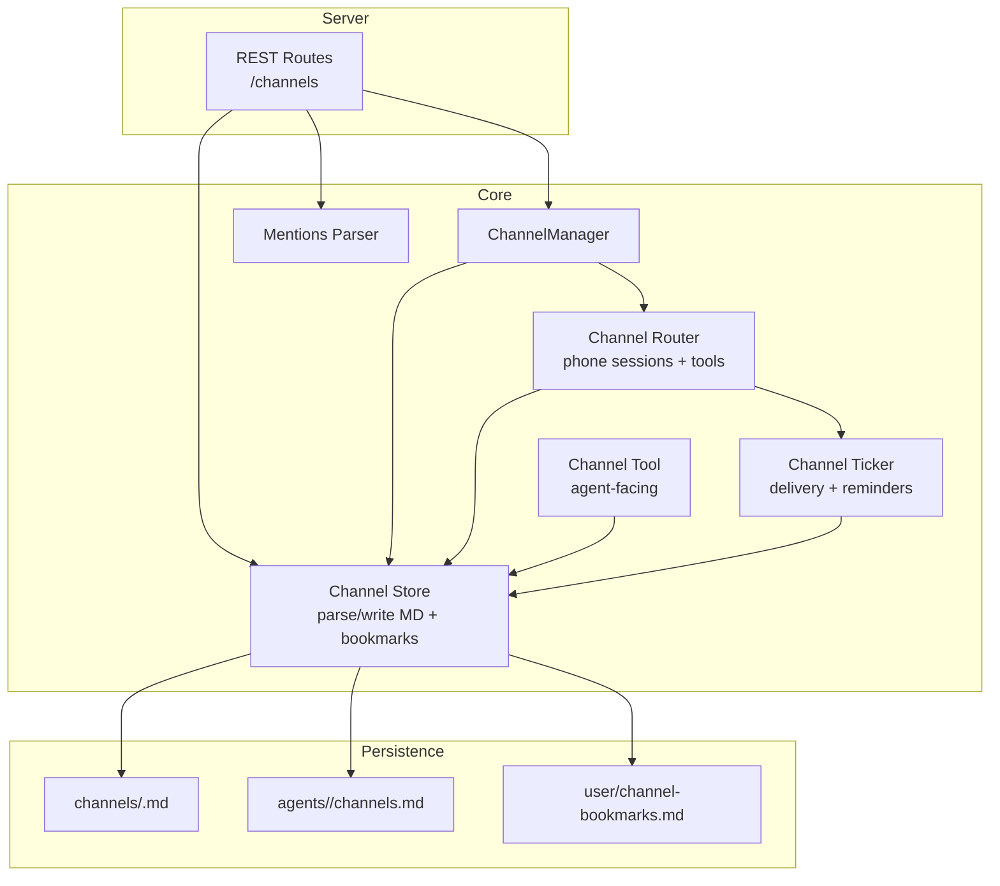
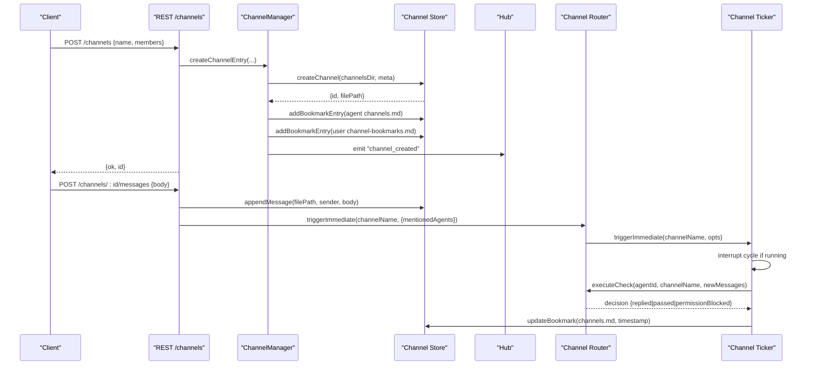
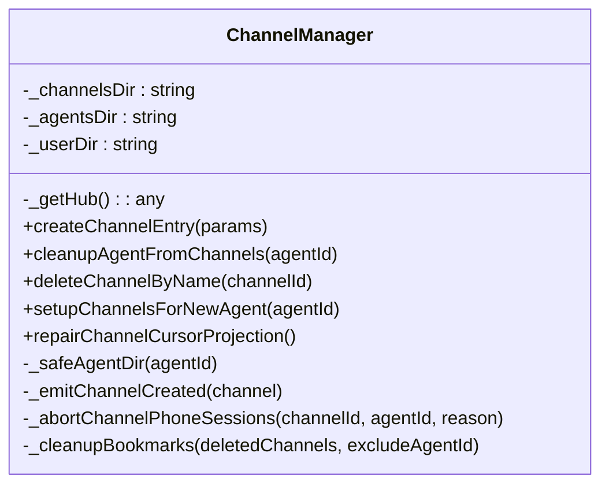
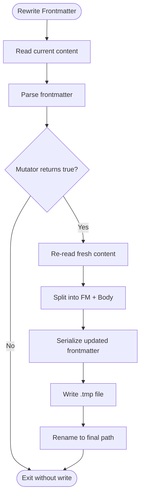
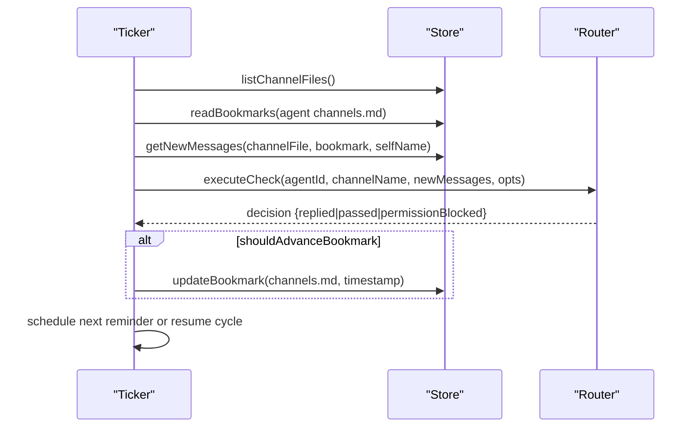
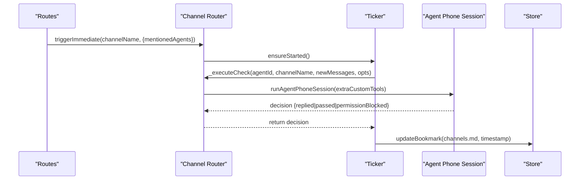
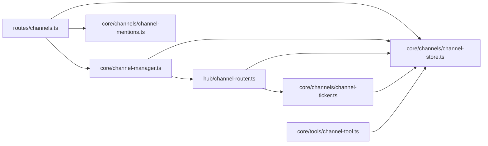

# Channel Management

<cite>
**Referenced Files in This Document**
- [channel-manager.ts](file://core/channel-manager.ts)
- [channel-store.ts](file://core/channels/channel-store.ts)
- [channel-ticker.ts](file://core/channels/channel-ticker.ts)
- [channel-mentions.ts](file://core/channels/channel-mentions.ts)
- [channels.ts](file://server/routes/channels.ts)
- [channel-tool.ts](file://core/tools/channel-tool.ts)
- [channel-router.ts](file://hub/channel-router.ts)
</cite>

## Table of Contents
1. [Introduction](#introduction)
2. [Project Structure](#project-structure)
3. [Core Components](#core-components)
4. [Architecture Overview](#architecture-overview)
5. [Detailed Component Analysis](#detailed-component-analysis)
6. [Dependency Analysis](#dependency-analysis)
7. [Performance Considerations](#performance-considerations)
8. [Troubleshooting Guide](#troubleshooting-guide)
9. [Conclusion](#conclusion)

## Introduction
This document explains how channels are created, managed, and maintained in OpenShadow. It focuses on the ChannelManager class architecture, channel CRUD operations, member management, bookmark system, persistence using Markdown files with frontmatter, cursor-based reading, event-driven updates, and the relationship between channels and agents (including automatic cleanup when agents are deleted). It also provides guidance for discovery, filtering, and performance optimization for large channel sets.

## Project Structure
Channels are implemented as Markdown files with YAML-like frontmatter for metadata and a message stream body. Each agent maintains a local “bookmark” file to track last-read positions per channel. The system exposes REST endpoints, an agent-facing tool, and a background ticker/router that delivers unread messages to agents and schedules proactive reminders.

**Diagram sources**
- [channels.ts:1-673](file://server/routes/channels.ts#L1-L673)
- [channel-manager.ts:1-280](file://core/channel-manager.ts#L1-L280)
- [channel-store.ts:1-532](file://core/channels/channel-store.ts#L1-L532)
- [channel-ticker.ts:1-723](file://core/channels/channel-ticker.ts#L1-L723)
- [channel-router.ts:1-1090](file://hub/channel-router.ts#L1-L1090)
- [channel-tool.ts:1-370](file://core/tools/channel-tool.ts#L1-L370)
- [channel-mentions.ts:1-103](file://core/channels/channel-mentions.ts#L1-L103)

**Section sources**
- [channels.ts:1-673](file://server/routes/channels.ts#L1-L673)
- [channel-manager.ts:1-280](file://core/channel-manager.ts#L1-L280)
- [channel-store.ts:1-532](file://core/channels/channel-store.ts#L1-L532)
- [channel-ticker.ts:1-723](file://core/channels/channel-ticker.ts#L1-L723)
- [channel-router.ts:1-1090](file://hub/channel-router.ts#L1-L1090)
- [channel-tool.ts:1-370](file://core/tools/channel-tool.ts#L1-L370)
- [channel-mentions.ts:1-103](file://core/channels/channel-mentions.ts#L1-L103)

## Core Components
- ChannelManager: Orchestrates channel lifecycle, member changes, and cleanup; integrates with Hub for delivery and events.
- Channel Store: Low-level persistence layer for channel MD files and agent/user bookmark files; includes parsing, atomic writes, and concurrency control.
- Channel Ticker: Background scheduler that delivers unread messages to agents and triggers proactive reminders; supports interruption and checkpointing.
- Channel Router: Wraps the ticker, runs agent phone sessions, injects channel-specific tools, and manages memory summarization.
- Channel Tool: Agent-facing tool enabling read/post/create/list actions against channels.
- Mentions Parser: Extracts @mentions from text to prioritize delivery to specific members.

**Section sources**
- [channel-manager.ts:1-280](file://core/channel-manager.ts#L1-L280)
- [channel-store.ts:1-532](file://core/channels/channel-store.ts#L1-L532)
- [channel-ticker.ts:1-723](file://core/channels/channel-ticker.ts#L1-L723)
- [channel-router.ts:1-1090](file://hub/channel-router.ts#L1-L1090)
- [channel-tool.ts:1-370](file://core/tools/channel-tool.ts#L1-L370)
- [channel-mentions.ts:1-103](file://core/channels/channel-mentions.ts#L1-L103)

## Architecture Overview
The channel subsystem is layered:
- API Layer: REST endpoints handle creation, listing, membership, posting, and deletion.
- Manager Layer: ChannelManager enforces business rules (member validation, cleanup, bookmark sync).
- Persistence Layer: Channel Store reads/writes MD files atomically and serializes concurrent access per file.
- Scheduling Layer: Channel Ticker iterates agents and channels, delivering unread messages and scheduling reminders.
- Execution Layer: Channel Router executes agent phone sessions with channel-specific tools and persists decisions.

**Diagram sources**
- [channels.ts:435-473](file://server/routes/channels.ts#L435-L473)
- [channel-manager.ts:44-77](file://core/channel-manager.ts#L44-L77)
- [channel-store.ts:194-218](file://core/channels/channel-store.ts#L194-L218)
- [channel-ticker.ts:402-432](file://core/channels/channel-ticker.ts#L402-L432)
- [channel-router.ts:383-396](file://hub/channel-router.ts#L383-L396)

## Detailed Component Analysis

### ChannelManager Class
Responsibilities:
- Create channels with validated members and optional intro message.
- Add/remove members and maintain agent/user bookmarks.
- Delete channels and clean up all related bookmarks.
- Cleanup orphaned references when agents are deleted (remove from members; delete channels with ≤1 member).
- Setup and repair agent bookmark projections for existing channels.

Key methods:
- createChannelEntry: Validates members exist, creates channel, adds bookmarks, emits event.
- cleanupAgentFromChannels: Removes agent from all channels; deletes channels with insufficient members; cleans bookmarks.
- deleteChannelByName: Deletes channel file and removes entries from all agent and user bookmarks.
- setupChannelsForNewAgent: Scans channels and adds entries to agent’s channels.md for membership projection.
- repairChannelCursorProjection: Ensures every member has a bookmark entry (cursor) even if missing.

Concurrency and safety:
- Uses Channel Store’s file locking for safe concurrent writes.
- Aborts active phone sessions on member removal or channel deletion via Hub integration.

**Diagram sources**
- [channel-manager.ts:24-279](file://core/channel-manager.ts#L24-L279)

**Section sources**
- [channel-manager.ts:44-116](file://core/channel-manager.ts#L44-L116)
- [channel-manager.ts:121-144](file://core/channel-manager.ts#L121-L144)
- [channel-manager.ts:192-252](file://core/channel-manager.ts#L192-L252)

### Channel Store (Persistence Layer)
Design principles:
- File-per-channel Markdown with frontmatter for metadata (id, name, description, members).
- Message stream body uses header lines with sender and timestamp.
- Per-file lock map serializes concurrent writes to avoid corruption.
- Atomic writes via tmp+rename to prevent partial writes.

Core functions:
- parseChannel: Extracts frontmatter and messages.
- createChannel: Creates channel file with optional intro message.
- appendMessage: Appends a message block atomically.
- getNewMessages/getRecentMessages: Cursor-based and sliding window reads.
- getChannelMembers/getChannelMeta: Read-only metadata access.
- addChannelMember/removeChannelMember/updateChannelMeta: Frontmatter mutations preserving body.
- deleteChannel: Removes channel file.
- Bookmark APIs: readBookmarks, updateBookmark, addBookmarkEntry, removeBookmarkEntry for agent and user bookmark files.

Data formats:
- Channel file: frontmatter followed by message blocks separated by ---.
- Bookmark file: list of entries with last-read timestamps.

**Diagram sources**
- [channel-store.ts:359-384](file://core/channels/channel-store.ts#L359-L384)

**Section sources**
- [channel-store.ts:52-104](file://core/channels/channel-store.ts#L52-L104)
- [channel-store.ts:194-218](file://core/channels/channel-store.ts#L194-L218)
- [channel-store.ts:227-234](file://core/channels/channel-store.ts#L227-L234)
- [channel-store.ts:243-282](file://core/channels/channel-store.ts#L243-L282)
- [channel-store.ts:289-348](file://core/channels/channel-store.ts#L289-L348)
- [channel-store.ts:390-396](file://core/channels/channel-store.ts#L390-L396)
- [channel-store.ts:429-500](file://core/channels/channel-store.ts#L429-L500)

### Channel Ticker (Delivery and Reminders)
Behavior:
- Periodic cycles iterate agents and their channels with unread messages.
- Immediate delivery triggered by new messages interrupts ongoing cycles and restarts with latest context.
- Proactive reminders pick a random member based on channel settings and schedule intervals.
- Supports AbortController-based cancellation and checkpoint resume.

Key features:
- Delivery window limits dropped older unread messages to bound context size.
- Guard limit caps checks per delivery to prevent runaway loops.
- Updates bookmarks only after explicit decisions (reply/pass/implicit pass).

**Diagram sources**
- [channel-ticker.ts:246-339](file://core/channels/channel-ticker.ts#L246-L339)
- [channel-ticker.ts:402-432](file://core/channels/channel-ticker.ts#L402-L432)
- [channel-ticker.ts:452-644](file://core/channels/channel-ticker.ts#L452-L644)
- [channel-store.ts:243-282](file://core/channels/channel-store.ts#L243-L282)

**Section sources**
- [channel-ticker.ts:1-125](file://core/channels/channel-ticker.ts#L1-L125)
- [channel-ticker.ts:274-339](file://core/channels/channel-ticker.ts#L274-L339)
- [channel-ticker.ts:402-432](file://core/channels/channel-ticker.ts#L402-L432)
- [channel-ticker.ts:452-644](file://core/channels/channel-ticker.ts#L452-L644)

### Channel Router (Execution and Tools)
Responsibilities:
- Wrap ticker and provide callbacks for execution and memory summarization.
- Run agent phone sessions with channel-specific tools: channel_read_context, channel_reply, channel_pass.
- Enforce membership checks and permission blocking.
- Emit events and record activities for UI and diagnostics.
- Manage model/tool mode overrides and guard limits per channel.

Important behaviors:
- Mention-aware delivery prioritizes mentioned agents.
- Decision repair loop ensures agents call exactly one decision tool per turn.
- Memory summarization compresses channel Truth into searchable facts.

**Diagram sources**
- [channel-router.ts:383-396](file://hub/channel-router.ts#L383-L396)
- [channel-router.ts:476-648](file://hub/channel-router.ts#L476-L648)
- [channel-router.ts:762-875](file://hub/channel-router.ts#L762-L875)
- [channel-ticker.ts:452-644](file://core/channels/channel-ticker.ts#L452-L644)

**Section sources**
- [channel-router.ts:46-108](file://hub/channel-router.ts#L46-L108)
- [channel-router.ts:160-333](file://hub/channel-router.ts#L160-L333)
- [channel-router.ts:476-648](file://hub/channel-router.ts#L476-L648)
- [channel-router.ts:762-875](file://hub/channel-router.ts#L762-L875)
- [channel-router.ts:1005-1088](file://hub/channel-router.ts#L1005-L1088)

### Channel Tool (Agent-Facing Operations)
Capabilities:
- read: Get recent messages from a channel.
- post: Append a message to a channel and optionally trigger delivery.
- create: Create a new channel with members and optional intro.
- list: List joined channels with last-read cursors.

Security:
- Resolves channel references safely and validates membership before operations.
- Prevents path traversal and invalid IDs.

**Section sources**
- [channel-tool.ts:48-70](file://core/tools/channel-tool.ts#L48-L70)
- [channel-tool.ts:86-140](file://core/tools/channel-tool.ts#L86-L140)
- [channel-tool.ts:176-369](file://core/tools/channel-tool.ts#L176-L369)

### Mentions Parser
Purpose:
- Extracts @mentions from text considering boundary characters and display aliases.
- Returns unique agent IDs mentioned, used to prioritize delivery.

**Section sources**
- [channel-mentions.ts:1-103](file://core/channels/channel-mentions.ts#L1-L103)

## Dependency Analysis
High-level dependencies:
- Server routes depend on ChannelManager and Channel Store for persistence and orchestration.
- ChannelManager depends on Channel Store and Hub for events and session aborts.
- Channel Router depends on Channel Ticker and Channel Store; orchestrates agent phone sessions.
- Channel Ticker depends on Channel Store for reading/writing and on Router callbacks for execution.
- Channel Tool depends on Channel Store for direct operations.

**Diagram sources**
- [channels.ts:1-673](file://server/routes/channels.ts#L1-L673)
- [channel-manager.ts:1-280](file://core/channel-manager.ts#L1-L280)
- [channel-store.ts:1-532](file://core/channels/channel-store.ts#L1-L532)
- [channel-ticker.ts:1-723](file://core/channels/channel-ticker.ts#L1-L723)
- [channel-router.ts:1-1090](file://hub/channel-router.ts#L1-L1090)
- [channel-tool.ts:1-370](file://core/tools/channel-tool.ts#L1-L370)
- [channel-mentions.ts:1-103](file://core/channels/channel-mentions.ts#L1-L103)

**Section sources**
- [channels.ts:1-673](file://server/routes/channels.ts#L1-L673)
- [channel-manager.ts:1-280](file://core/channel-manager.ts#L1-L280)
- [channel-store.ts:1-532](file://core/channels/channel-store.ts#L1-L532)
- [channel-ticker.ts:1-723](file://core/channels/channel-ticker.ts#L1-L723)
- [channel-router.ts:1-1090](file://hub/channel-router.ts#L1-L1090)
- [channel-tool.ts:1-370](file://core/tools/channel-tool.ts#L1-L370)
- [channel-mentions.ts:1-103](file://core/channels/channel-mentions.ts#L1-L103)

## Performance Considerations
- Concurrency control: Channel Store uses per-file locks to serialize writes, preventing race conditions and data loss.
- Atomic writes: Temporary files and rename reduce risk of partial writes during crashes.
- Cursor-based reading: Bookmarks enable efficient incremental reads without scanning entire histories.
- Delivery windows: Limits dropped unread messages to bound context size, reducing LLM payload and processing time.
- Guard limits: Cap checks per delivery to prevent runaway loops and excessive resource usage.
- Reminder scheduling: Configurable intervals and proactive toggles allow tuning frequency and load.
- Large channel sets: Prefer listing and filtering at API level; avoid loading full histories unless necessary. Use recent message windows and bookmark states to minimize I/O.

[No sources needed since this section provides general guidance]

## Troubleshooting Guide
Common issues and resolutions:
- Channel not found: Ensure channel ID exists and is within allowed directory scope; verify safe path resolution.
- Invalid member ID: Validate agent existence and directory safety before adding members.
- Duplicate channel creation: Check for existing channel files; use unique IDs or custom IDs with prefix handling.
- Bookmark inconsistencies: Repair agent bookmark projections to align with channel membership; ensure user bookmarks are updated on creation/deletion.
- Delivery not triggering: Verify channels enabled flag; check Hub integration for immediate delivery calls; inspect mention extraction.
- Excessive checks: Adjust guard limits per channel; review proactive vs. reactive modes.

Operational tips:
- Use server routes to toggle channels feature and refresh proactive schedules.
- Monitor ticker snapshot and activity logs for delivery progress and errors.
- Inspect channel frontmatter and bookmark files for manual corrections if needed.

**Section sources**
- [channels.ts:208-226](file://server/routes/channels.ts#L208-L226)
- [channels.ts:435-473](file://server/routes/channels.ts#L435-L473)
- [channel-manager.ts:85-116](file://core/channel-manager.ts#L85-L116)
- [channel-manager.ts:223-252](file://core/channel-manager.ts#L223-L252)
- [channel-ticker.ts:621-644](file://core/channels/channel-ticker.ts#L621-L644)

## Conclusion
OpenShadow’s channel management combines robust persistence with flexible scheduling and execution. Channels are persisted as Markdown with frontmatter, ensuring human-readable storage and easy maintenance. The ChannelManager enforces lifecycle rules and cleanup, while the Channel Store guarantees safe concurrent access. The Ticker and Router deliver unread messages efficiently, support proactive reminders, and integrate with agent phone sessions to produce meaningful interactions. With bookmarks and delivery windows, the system scales well to large channel sets while maintaining responsiveness and correctness.

[No sources needed since this section summarizes without analyzing specific files]